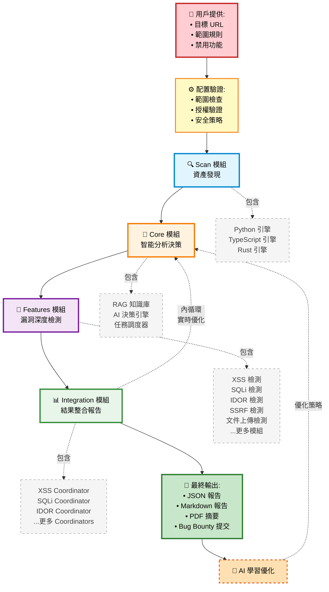
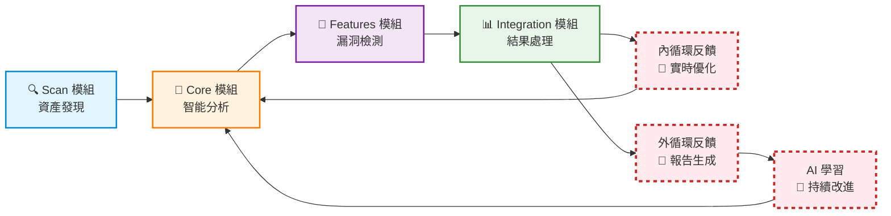
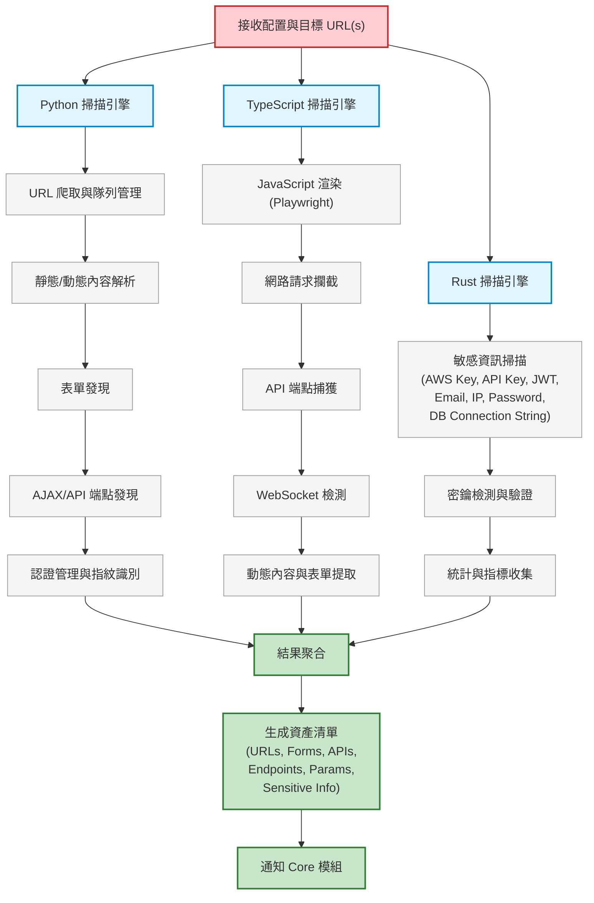
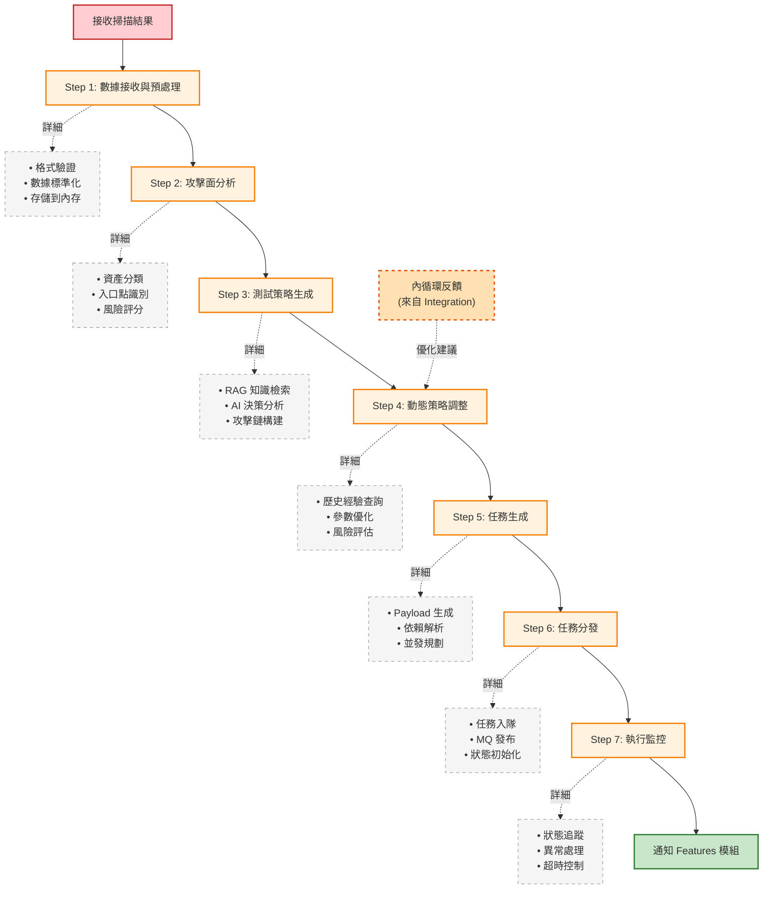
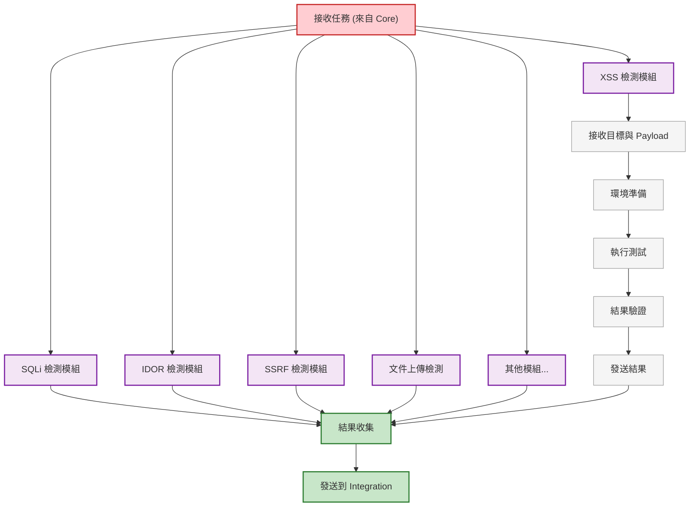
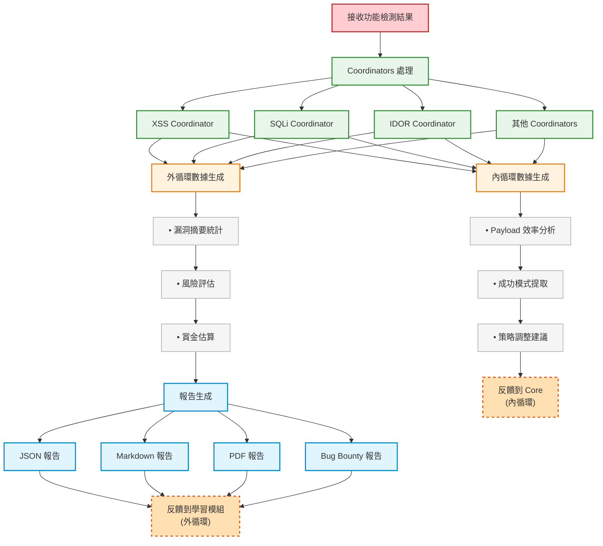

# AIVA 完整執行工作流程 - 從目標輸入到報告生成

> **版本**: v2.0  
> **日期**: 2025年11月17日  
> **基於**: 真實系統架構和 aiva_common 標準規範

---

## 📋 目錄

- [工作流程概覽](#工作流程概覽)
  - [系統整體流程圖](#系統整體流程圖-高層視角)
  - [雙閉環反饋機制圖](#雙閉環反饋機制圖)
  - [Scan 模組詳細流程](#scan-模組詳細流程圖)
  - [Core 模組詳細流程](#core-模組詳細流程圖-7-大步驟)
  - [Features 模組詳細流程](#features-模組詳細流程圖)
  - [Integration 模組詳細流程](#integration-模組詳細流程圖)
- [詳細步驟說明](#詳細步驟說明)
- [配置範例](#配置範例)
- [執行命令](#執行命令)
- [故障處理](#故障處理)

---

## 📌 文檔說明

本文檔採用**分層展示**的方式:

1. **系統整體流程圖**: 高層視角,展示四大模組的協作關係
2. **模組詳細流程圖**: 每個模組的內部運作細節
3. **文字說明**: 詳細的配置、命令和範例

這樣的設計避免了單一圖表過於複雜,讓您可以:
- 快速理解整體架構
- 深入了解特定模組
- 根據需求查看不同層級的細節

---

## 🎯 工作流程概覽

### 系統整體流程圖 (高層視角)



### 雙閉環反饋機制圖



### Scan 模組詳細流程圖

> **🎯 黑盒測試場景說明**: 
> 
> 本模組專注於實戰 Bug Bounty 測試場景，使用多語言引擎協同工作：
> 
> - **掃描對象**: 網站、網頁 (URL)、API 端點、Web 應用
> - **三引擎協同**:
>   - **Python 引擎**: URL 爬取、內容解析、漏洞掃描
>   - **TypeScript 引擎**: JavaScript 渲染、動態內容分析、網路攔截
>   - **Rust 引擎**: 高性能敏感資訊掃描（API Key、密鑰、JWT 等）
> - **輸出結果**: 資產清單（URLs、Forms、APIs、Endpoints、敏感資訊）
> 
> ⚠️ **注意**: 本模組不包含 Git 倉庫掃描、源代碼審計等白盒測試功能，專注於黑盒滲透測試。



### Core 模組詳細流程圖 (7 大步驟)



### Features 模組詳細流程圖



### Integration 模組詳細流程圖



### 階段文字描述

```
┌─────────────────────────────────────────────────────────────────────┐
│                    AIVA 完整執行工作流程                              │
│                  (12 個主要步驟 + 子步驟)                            │
└─────────────────────────────────────────────────────────────────────┘

Phase 0: 目標配置階段 (用戶輸入)
├─ Step 0.1: 目標 URL 收集
├─ Step 0.2: 範圍定義 (包含/排除規則)
├─ Step 0.3: 禁止操作聲明
├─ Step 0.4: 授權驗證
└─ Step 0.5: 配置文件生成

Phase 1: 掃描階段 (Scan 模組)
├─ Step 1.1: 範圍驗證與預檢
├─ Step 1.2: 被動信息收集
├─ Step 1.3: 主動掃描執行
├─ Step 1.4: 資產清單生成
└─ Step 1.5: 掃描結果持久化

Phase 2: 數據接收階段 (Core 模組 - Step 1/7)
├─ Step 2.1: 接收掃描完成事件
├─ Step 2.2: 數據格式驗證
├─ Step 2.3: 數據標準化處理
├─ Step 2.4: 存儲到 Core 內存
└─ Step 2.5: 觸發後續分析

Phase 3: 攻擊面分析階段 (Core 模組 - Step 2/7)
├─ Step 3.1: 資產分類與標記
├─ Step 3.2: 入口點識別
├─ Step 3.3: 攻擊向量分析
├─ Step 3.4: 風險評分計算
└─ Step 3.5: 優先級排序

Phase 4: 策略生成階段 (Core 模組 - Step 3/7)
├─ Step 4.1: RAG 知識檢索
├─ Step 4.2: AI 決策分析
├─ Step 4.3: 測試策略生成
├─ Step 4.4: 功能模組選擇
└─ Step 4.5: 攻擊鏈構建

Phase 5: 動態調整階段 (Core 模組 - Step 4/7)
├─ Step 5.1: 歷史經驗查詢
├─ Step 5.2: 策略優化建議
├─ Step 5.3: 參數動態調整
├─ Step 5.4: 風險評估更新
└─ Step 5.5: 策略確認

Phase 6: 任務生成階段 (Core 模組 - Step 5/7)
├─ Step 6.1: 任務模板選擇
├─ Step 6.2: Payload 生成
├─ Step 6.3: 任務依賴解析
├─ Step 6.4: 並發策略規劃
└─ Step 6.5: 任務對象創建

Phase 7: 任務分發階段 (Core 模組 - Step 6/7)
├─ Step 7.1: 任務加入佇列
├─ Step 7.2: MQ 消息發布
├─ Step 7.3: 功能模組通知
├─ Step 7.4: 執行狀態初始化
└─ Step 7.5: 監控啟動

Phase 8: 執行監控階段 (Core 模組 - Step 7/7)
├─ Step 8.1: 任務狀態追蹤
├─ Step 8.2: 進度更新收集
├─ Step 8.3: 異常檢測處理
├─ Step 8.4: 超時控制
└─ Step 8.5: 執行日誌記錄

Phase 9: 功能檢測階段 (Features 模組)
├─ Step 9.1: 接收任務消息
├─ Step 9.2: 環境準備
├─ Step 9.3: 深度漏洞檢測
│  ├─ XSS 檢測
│  ├─ SQLi 檢測
│  ├─ IDOR 檢測
│  └─ 其他模組
├─ Step 9.4: 結果驗證
└─ Step 9.5: 結果發送

Phase 10: 結果處理階段 (Integration Coordinator)
├─ Step 10.1: 接收功能結果
├─ Step 10.2: 數據驗證與清洗
├─ Step 10.3: 內循環數據生成
│  ├─ Payload 效率分析
│  ├─ 成功模式提取
│  └─ 策略調整建議
├─ Step 10.4: 外循環數據生成
│  ├─ 漏洞摘要統計
│  ├─ 風險評估
│  └─ 賞金估算
└─ Step 10.5: 反饋發送到 Core

Phase 11: 報告生成階段 (Integration 模組)
├─ Step 11.1: 結果聚合
├─ Step 11.2: 數據標準化
├─ Step 11.3: 報告模板選擇
├─ Step 11.4: 多格式報告生成
│  ├─ JSON 結構化報告
│  ├─ Markdown 技術報告
│  ├─ PDF 執行摘要
│  └─ Bug Bounty 平台報告
└─ Step 11.5: 報告存檔

Phase 12: 學習優化階段 (Core 外部學習)
├─ Step 12.1: 經驗提取
├─ Step 12.2: 知識庫更新
├─ Step 12.3: AI 模型微調
├─ Step 12.4: 策略優化記錄
└─ Step 12.5: 性能指標更新
```

---

## 📝 詳細步驟說明

### Phase 0: 目標配置階段 (用戶輸入)

**目的**: 收集用戶輸入,定義測試範圍和限制

#### Step 0.1: 目標 URL 收集

**用戶輸入格式**:
```python
# 格式 1: 單一目標
target_input = {
    "targets": ["https://example.com"]
}

# 格式 2: 多個目標
target_input = {
    "targets": [
        "https://example.com",
        "https://api.example.com",
        "https://admin.example.com"
    ]
}

# 格式 3: 域名級別 (自動發現子域)
target_input = {
    "targets": ["example.com"],
    "scope_type": "domain",  # 包含所有子域
    "auto_discover_subdomains": True
}

# 格式 4: URL 列表文件
target_input = {
    "target_file": "targets.txt",  # 每行一個 URL
    "scope_type": "urls"
}
```

#### Step 0.2: 範圍定義 (包含/排除規則)

**包含規則配置**:
```python
scope_config = {
    "include": {
        # 包含的 URL 模式
        "url_patterns": [
            "https://example.com/*",
            "https://*.example.com/*",
            "https://api.example.com/v1/*"
        ],
        
        # 包含的子域
        "subdomains": [
            "www", "api", "app", "staging"
        ],
        
        # 包含的路徑
        "paths": [
            "/api/*",
            "/admin/*",
            "/user/*"
        ],
        
        # 包含的 IP 範圍 (可選)
        "ip_ranges": [
            "192.168.1.0/24",
            "10.0.0.0/8"
        ]
    }
}
```

**排除規則配置**:
```python
scope_config["exclude"] = {
    # 排除的 URL 模式
    "url_patterns": [
        "https://example.com/logout",
        "https://example.com/delete/*",
        "https://*.example.com/admin/delete/*"
    ],
    
    # 排除的子域
    "subdomains": [
        "status",      # 狀態頁面
        "blog",        # 部落格
        "docs"         # 文檔站
    ],
    
    # 排除的路徑
    "paths": [
        "/admin/settings/*",
        "/api/internal/*",
        "/system/*"
    ],
    
    # 排除的文件類型
    "file_extensions": [
        ".pdf", ".jpg", ".png", ".gif",
        ".zip", ".rar", ".doc", ".xls"
    ],
    
    # 排除的參數
    "parameters": [
        "session_id",
        "auth_token",
        "csrf_token"
    ]
}
```

**智能範圍推斷**:
```python
# 用戶可以用自然語言描述
natural_language_scope = """
測試 example.com 的所有網頁，但是:
1. 不要測試部落格區域 (blog.example.com)
2. 不要測試任何刪除功能
3. 不要測試登出功能
4. 可以測試 API，但不包括內部 API
5. 管理後台可以測試，但不要動設定頁面
"""

# AI 會自動解析並生成配置
parsed_scope = ai_parser.parse_natural_language_scope(natural_language_scope)
```

#### Step 0.3: 禁止操作聲明

**用戶明確禁止的操作**:
```python
forbidden_actions = {
    # 破壞性測試
    "destructive_tests": {
        "enabled": False,
        "forbidden_actions": [
            "delete_data",           # 禁止刪除數據
            "modify_production",     # 禁止修改生產環境
            "ddos_simulation",       # 禁止 DDoS 模擬
            "resource_exhaustion"    # 禁止資源耗盡攻擊
        ]
    },
    
    # 社交工程
    "social_engineering": {
        "enabled": False,
        "forbidden_actions": [
            "phishing",              # 禁止釣魚
            "impersonation",         # 禁止冒充
            "user_interaction"       # 禁止需要用戶互動的測試
        ]
    },
    
    # 暴力破解
    "brute_force": {
        "enabled": False,           # 完全禁止
        "max_attempts": 0           # 最大嘗試次數 0
    },
    
    # 數據外洩測試
    "data_exfiltration": {
        "enabled": False,
        "forbidden_actions": [
            "download_database",     # 禁止下載數據庫
            "extract_user_data",     # 禁止提取用戶數據
            "steal_credentials"      # 禁止竊取憑證
        ]
    },
    
    # 速率限制
    "rate_limiting": {
        "max_requests_per_minute": 100,
        "max_concurrent_connections": 10,
        "respect_robots_txt": True,
        "honor_rate_limit_headers": True
    },
    
    # 時間限制
    "time_constraints": {
        "max_execution_time_minutes": 120,  # 最長執行 2 小時
        "allowed_hours": {
            "start": "09:00",       # 只在上班時間測試
            "end": "18:00",
            "timezone": "UTC+8"
        },
        "allowed_days": [1, 2, 3, 4, 5]  # 週一到週五
    }
}
```

**默認安全策略** (即使用戶未明說):
```python
default_safe_policies = {
    "automatically_disabled": [
        "DoS/DDoS 攻擊",
        "物理破壞",
        "惡意軟件植入",
        "後門安裝",
        "權限提升 (除非明確授權)",
        "橫向移動",
        "數據加密/勒索",
        "日誌清除/篡改"
    ],
    
    "requires_explicit_permission": [
        "數據庫讀取",
        "文件系統訪問",
        "管理員權限測試",
        "生產環境測試"
    ]
}
```

#### Step 0.4: 授權驗證

**授權檢查清單**:
```python
authorization_checks = {
    # Bug Bounty 平台授權
    "bugbounty_platform": {
        "platform": "hackerone",  # 或 "bugcrowd", "intigriti"
        "program_id": "example-company",
        "authorization_token": "xxx",
        "scope_verified": True
    },
    
    # 書面授權
    "written_authorization": {
        "has_authorization_letter": True,
        "letter_path": "/path/to/authorization.pdf",
        "authorizer_name": "John Doe",
        "authorizer_email": "john@example.com",
        "authorization_date": "2025-11-15",
        "expiry_date": "2025-12-15"
    },
    
    # 域名所有權驗證
    "domain_ownership": {
        "verification_method": "dns_txt_record",  # 或 "file_upload"
        "verification_code": "aiva-verify-abc123",
        "verified": True,
        "verified_at": "2025-11-17T10:00:00Z"
    },
    
    # 法律合規檢查
    "legal_compliance": {
        "gdpr_compliant": True,
        "data_protection_acknowledged": True,
        "terms_accepted": True,
        "jurisdiction": "EU"  # 或 "US", "CN", etc.
    }
}
```

**未授權處理**:
```python
if not authorization_checks["bugbounty_platform"]["scope_verified"]:
    raise AuthorizationError(
        "目標不在 Bug Bounty 授權範圍內。"
        "請確認目標是否在平台的 Scope 列表中。"
    )

if not authorization_checks["written_authorization"]["has_authorization_letter"]:
    confirm = input("未檢測到書面授權。是否繼續? (僅限個人測試環境) [y/N]: ")
    if confirm.lower() != 'y':
        sys.exit("已取消執行。請獲取授權後再試。")
```

#### Step 0.5: 配置文件生成

**生成標準配置文件**:
```python
# 生成 YAML 配置
config_generator = TargetConfigGenerator()
config_file = config_generator.generate_config(
    targets=target_input,
    scope=scope_config,
    forbidden=forbidden_actions,
    authorization=authorization_checks
)

# 保存配置
config_path = f"configs/target_{int(time.time())}.yaml"
with open(config_path, 'w') as f:
    yaml.dump(config_file, f)

print(f"✅ 配置文件已生成: {config_path}")
```

**配置文件範例** (`target_config.yaml`):
```yaml
# AIVA 目標配置文件
version: "2.0"
created_at: "2025-11-17T10:30:00Z"
config_id: "cfg_20251117_001"

# 目標定義
targets:
  primary:
    - url: "https://example.com"
      type: "web_application"
      priority: "high"
    - url: "https://api.example.com"
      type: "api"
      priority: "high"
  
  secondary:
    - url: "https://staging.example.com"
      type: "web_application"
      priority: "medium"

# 範圍配置
scope:
  include:
    url_patterns:
      - "https://example.com/*"
      - "https://*.example.com/*"
    subdomains:
      - "www"
      - "api"
      - "app"
    paths:
      - "/api/*"
      - "/user/*"
  
  exclude:
    url_patterns:
      - "https://example.com/logout"
      - "https://*/admin/delete/*"
    subdomains:
      - "status"
      - "blog"
    paths:
      - "/admin/settings/*"
    file_extensions:
      - ".pdf"
      - ".jpg"
      - ".png"

# 禁止操作
forbidden_actions:
  destructive_tests: false
  social_engineering: false
  brute_force:
    enabled: false
    max_attempts: 0
  data_exfiltration: false
  rate_limiting:
    max_requests_per_minute: 100
    max_concurrent_connections: 10

# 授權信息
authorization:
  bugbounty_platform:
    platform: "hackerone"
    program_id: "example-company"
    scope_verified: true
  written_authorization:
    has_authorization_letter: true
    letter_path: "/path/to/auth.pdf"
  domain_ownership:
    verification_method: "dns_txt_record"
    verified: true

# 執行參數
execution:
  max_execution_time_minutes: 120
  allowed_hours:
    start: "09:00"
    end: "18:00"
    timezone: "UTC+8"
  allowed_days: [1, 2, 3, 4, 5]
```

---

### Phase 1: 掃描階段 (Scan 模組)

**啟動命令**:
```bash
# 使用配置文件啟動
python -m aiva.launcher --config configs/target_20251117_001.yaml

# 或直接命令行
python -m aiva.launcher \
  --targets "https://example.com" \
  --exclude "*/logout" \
  --no-destructive \
  --max-time 120
```

#### Step 1.1: 範圍驗證與預檢

**執行內容**:
```python
# services/scan/aiva_scan/scope_validator.py
class ScopeValidator:
    async def validate_targets(self, config: dict) -> dict:
        """驗證目標可達性和授權"""
        validation_results = []
        
        for target in config["targets"]["primary"]:
            # 1. DNS 解析檢查
            dns_check = await self._check_dns_resolution(target["url"])
            
            # 2. HTTP 可達性檢查
            http_check = await self._check_http_connectivity(target["url"])
            
            # 3. 授權範圍檢查
            scope_check = await self._verify_in_scope(
                target["url"],
                config["scope"]
            )
            
            # 4. 安全檢查 (檢測蜜罐、陷阱)
            security_check = await self._detect_honeypot(target["url"])
            
            validation_results.append({
                "target": target["url"],
                "dns_resolved": dns_check["success"],
                "http_reachable": http_check["success"],
                "in_scope": scope_check["in_scope"],
                "safe_to_scan": security_check["safe"],
                "warnings": security_check.get("warnings", [])
            })
        
        return {
            "validated_targets": [
                r for r in validation_results 
                if r["dns_resolved"] and r["http_reachable"] 
                and r["in_scope"] and r["safe_to_scan"]
            ],
            "failed_targets": [
                r for r in validation_results 
                if not (r["dns_resolved"] and r["http_reachable"])
            ],
            "out_of_scope_targets": [
                r for r in validation_results 
                if not r["in_scope"]
            ]
        }
```

**輸出範例**:
```
🔍 開始範圍驗證...
  ✅ https://example.com - DNS 解析成功
  ✅ https://example.com - HTTP 連接成功 (200 OK)
  ✅ https://example.com - 在授權範圍內
  ✅ https://example.com - 安全檢查通過
  
  ✅ https://api.example.com - 驗證成功
  
  ⚠️  https://status.example.com - 不在範圍內 (已排除)
  ❌ https://test.example.com - DNS 解析失敗
  
📊 驗證摘要:
  • 有效目標: 2 個
  • 失敗目標: 1 個
  • 範圍外目標: 1 個
```

#### Step 1.2: 被動信息收集

**執行內容**:
```python
# 不直接訪問目標,從公開源收集信息
passive_recon = {
    # DNS 記錄查詢
    "dns_enumeration": {
        "subdomains": await dns_enumerator.find_subdomains("example.com"),
        "dns_records": await dns_enumerator.get_all_records("example.com"),
        "historical_dns": await dns_enumerator.get_historical_data("example.com")
    },
    
    # WHOIS 信息
    "whois_data": {
        "registrar": "Namecheap",
        "creation_date": "2020-01-01",
        "name_servers": ["ns1.example.com", "ns2.example.com"]
    },
    
    # 證書透明度日誌
    "certificate_transparency": {
        "certificates": await ct_log_scanner.search_certificates("example.com"),
        "subdomains_from_certs": ["api", "www", "app", "staging"]
    },
    
    # 搜索引擎偵察
    "search_engine_recon": {
        "google_dorks": await google_dorker.search("site:example.com"),
        "exposed_files": ["backup.sql", "config.php.bak"],
        "interesting_paths": ["/admin", "/api/v1", "/upload"]
    },
    
    # 代碼倉庫搜索
    "code_repositories": {
        "github_repos": await github_scanner.search_organization("example-company"),
        "exposed_secrets": ["API_KEY=xxx", "DB_PASSWORD=yyy"],
        "leaked_credentials": []
    },
    
    # 第三方服務
    "third_party_services": {
        "shodan_data": await shodan.search("example.com"),
        "censys_data": await censys.search("example.com"),
        "virustotal_data": await virustotal.get_domain_report("example.com")
    }
}
```

#### Step 1.3: 主動掃描執行

**三引擎協同掃描**:
```python
# Python 靜態引擎
python_scan = await PythonScanEngine().scan({
    "targets": validated_targets,
    "tasks": [
        "port_scanning",
        "service_detection",
        "http_crawling",
        "form_discovery",
        "parameter_mining"
    ]
})

# TypeScript 動態引擎
typescript_scan = await TypeScriptScanEngine().scan({
    "targets": validated_targets,
    "tasks": [
        "javascript_rendering",
        "spa_route_discovery",
        "ajax_endpoint_capture",
        "websocket_detection",
        "dynamic_content_analysis"
    ]
})

# Rust 高效引擎 - 敏感資訊掃描
rust_scan = await RustScanEngine().scan({
    "targets": validated_targets,
    "tasks": [
        "sensitive_info_scanning",  # AWS Key, API Key, JWT, Email, IP, Password
        "secret_detection",         # 密鑰檢測
        "secret_verification"       # 密鑰驗證
    ]
})
```

#### Step 1.4: 資產清單生成

**聚合掃描結果**:
```python
asset_inventory = {
    "scan_metadata": {
        "scan_id": "SCAN_20251117_001",
        "start_time": "2025-11-17T10:35:00Z",
        "end_time": "2025-11-17T10:50:00Z",
        "duration_seconds": 900,
        "status": "completed"
    },
    
    "discovered_assets": {
        # 域名和子域
        "domains": {
            "total": 15,
            "list": [
                {"domain": "example.com", "source": "input"},
                {"domain": "www.example.com", "source": "dns"},
                {"domain": "api.example.com", "source": "dns"},
                # ...
            ]
        },
        
        # URL 和路徑
        "urls": {
            "total": 2847,
            "by_type": {
                "pages": 1523,
                "api_endpoints": 94,
                "static_resources": 1230
            },
            "interesting_endpoints": [
                {"url": "/api/v1/users", "method": "GET", "auth": False},
                {"url": "/admin/login", "type": "form"},
                {"url": "/upload", "type": "file_upload"}
            ]
        },
        
        # 技術棧
        "technology_stack": {
            "web_server": "nginx/1.18.0",
            "application": "React 18.2.0",
            "backend": "Node.js Express",
            "database": "MongoDB (推測)",
            "cdn": "Cloudflare",
            "waf": "Cloudflare WAF"
        },
        
        # 安全特徵
        "security_features": {
            "https": True,
            "hsts": True,
            "csp": True,
            "csrf_protection": True,
            "rate_limiting": True,
            "waf_detected": True
        },
        
        # 潛在入口點
        "entry_points": {
            "forms": [
                {"url": "/login", "fields": ["username", "password"]},
                {"url": "/register", "fields": ["email", "password", "name"]},
                {"url": "/search", "fields": ["q"]}
            ],
            "api_endpoints": [
                {"url": "/api/v1/users", "params": ["id", "page", "limit"]},
                {"url": "/api/v1/posts", "params": ["category", "sort"]}
            ],
            "file_uploads": [
                {"url": "/upload", "accepted_types": [".jpg", ".png", ".pdf"]}
            ]
        }
    }
}
```

#### Step 1.5: 掃描結果持久化

**存儲與通知**:
```python
# 1. 存儲到數據庫
await scan_storage.save_scan_results(asset_inventory)

# 2. 生成掃描報告文件
report_path = f"scan_results/SCAN_20251117_001.json"
with open(report_path, 'w') as f:
    json.dump(asset_inventory, f, indent=2)

# 3. 發送掃描完成事件到 MQ
await mq_broker.publish(
    topic="scan.completed",
    message={
        "event_type": "SCAN_COMPLETED",
        "scan_id": "SCAN_20251117_001",
        "target_count": len(validated_targets),
        "asset_count": asset_inventory["discovered_assets"]["urls"]["total"],
        "duration_seconds": 900,
        "report_path": report_path,
        "priority": "high"
    }
)

print(f"""
✅ 掃描階段完成！

📊 掃描摘要:
  • 掃描 ID: SCAN_20251117_001
  • 掃描時間: 15 分鐘
  • 發現域名: 15 個
  • 發現 URL: 2847 個
  • API 端點: 94 個
  • 表單: 23 個
  • 文件上傳點: 3 個

📁 報告已保存: {report_path}
📨 已通知 Core 模組開始分析
""")
```

---

### Phase 2-8: Core 模組處理 (7 大步驟)

**Core 模組接收掃描完成事件後自動執行**

#### Phase 2: 數據接收階段 (Core Step 1/7)

```python
# services/core/aiva_core/core_capabilities/processing/scan_result_processor.py
class ScanResultProcessor:
    async def stage_1_data_ingestion(self, scan_id: str) -> dict:
        """Step 1/7: 數據接收與預處理"""
        
        # 2.1 接收掃描完成事件
        scan_event = await self.mq_broker.consume(
            queue="core.scan_completed",
            timeout=300
        )
        
        # 2.2 數據格式驗證
        validator = ScanDataValidator()
        validation_result = await validator.validate(scan_event["message"])
        
        if not validation_result["valid"]:
            raise ValueError(f"掃描數據無效: {validation_result['errors']}")
        
        # 2.3 載入完整掃描結果
        scan_results = await self.scan_interface.load_scan_results(scan_id)
        
        # 2.4 數據標準化處理
        normalized_data = await self._normalize_scan_data(scan_results)
        
        # 2.5 存儲到 Core 內存
        await self.session_state_manager.store_scan_data(
            scan_id=scan_id,
            data=normalized_data
        )
        
        logger.info(f"✅ [Step 1/7] 數據接收完成 - {scan_id}")
        
        return {
            "scan_id": scan_id,
            "assets_count": len(normalized_data["assets"]),
            "entry_points_count": len(normalized_data["entry_points"]),
            "next_stage": "attack_surface_analysis"
        }
```

#### Phase 3: 攻擊面分析階段 (Core Step 2/7)

```python
async def stage_2_attack_surface_analysis(self, scan_id: str) -> dict:
    """Step 2/7: 初步攻擊面分析"""
    
    # 3.1 載入掃描數據
    scan_data = await self.session_state_manager.get_scan_data(scan_id)
    
    # 3.2 資產分類與標記
    classified_assets = await self.surface_analyzer.classify_assets(
        scan_data["assets"]
    )
    # 結果: {"web_pages": [...], "api_endpoints": [...], "forms": [...]}
    
    # 3.3 入口點識別
    entry_points = await self.surface_analyzer.identify_entry_points(
        classified_assets
    )
    # 識別: 可注入參數、文件上傳、認證端點等
    
    # 3.4 攻擊向量分析
    attack_vectors = await self.surface_analyzer.analyze_attack_vectors(
        entry_points
    )
    # 分析: XSS潛在點、SQLi潛在點、IDOR可能性等
    
    # 3.5 風險評分計算
    risk_scores = await self.surface_analyzer.calculate_risk_scores(
        attack_vectors
    )
    
    # 3.6 優先級排序
    prioritized_targets = await self.surface_analyzer.prioritize(
        attack_vectors,
        risk_scores
    )
    
    logger.info(f"✅ [Step 2/7] 攻擊面分析完成 - 發現 {len(prioritized_targets)} 個目標")
    
    return {
        "scan_id": scan_id,
        "classified_assets": classified_assets,
        "attack_vectors": attack_vectors,
        "prioritized_targets": prioritized_targets,
        "next_stage": "strategy_generation"
    }
```

#### Phase 4: 策略生成階段 (Core Step 3/7)

```python
async def stage_3_strategy_generation(self, scan_id: str, analysis_result: dict) -> dict:
    """Step 3/7: 測試策略生成"""
    
    # 4.1 RAG 知識檢索
    knowledge = await self.rag_engine.retrieve_knowledge(
        query="漏洞檢測策略",
        context={
            "target_type": "web_application",
            "tech_stack": analysis_result.get("tech_stack"),
            "attack_vectors": analysis_result["attack_vectors"]
        },
        top_k=5
    )
    
    # 4.2 AI 決策分析
    ai_decision = await self.ai_engine.analyze(
        targets=analysis_result["prioritized_targets"],
        knowledge=knowledge,
        confidence_threshold=0.7
    )
    
    # 4.3 測試策略生成
    test_strategy = await self.strategy_generator.generate(
        ai_decision=ai_decision,
        attack_vectors=analysis_result["attack_vectors"]
    )
    
    # 4.4 功能模組選擇
    selected_modules = await self.module_selector.select(
        test_strategy=test_strategy,
        available_modules=["function_xss", "function_sqli", "function_idor", ...]
    )
    
    # 4.5 攻擊鏈構建
    attack_chain = await self.chain_builder.build(
        modules=selected_modules,
        strategy=test_strategy
    )
    
    logger.info(f"✅ [Step 3/7] 策略生成完成 - 選擇 {len(selected_modules)} 個模組")
    
    return {
        "scan_id": scan_id,
        "test_strategy": test_strategy,
        "selected_modules": selected_modules,
        "attack_chain": attack_chain,
        "next_stage": "dynamic_adjustment"
    }
```

#### Phase 5: 動態調整階段 (Core Step 4/7)

```python
async def stage_4_dynamic_adjustment(self, scan_id: str, strategy: dict) -> dict:
    """Step 4/7: 動態策略調整"""
    
    # 5.1 歷史經驗查詢
    historical_data = await self.strategy_adjuster.query_history(
        target_type="web_application",
        modules=strategy["selected_modules"]
    )
    
    # 5.2 策略優化建議
    optimization_suggestions = await self.strategy_adjuster.generate_suggestions(
        current_strategy=strategy["test_strategy"],
        historical_data=historical_data
    )
    
    # 5.3 參數動態調整
    adjusted_params = await self.strategy_adjuster.adjust_parameters(
        original_params=strategy["attack_chain"]["parameters"],
        suggestions=optimization_suggestions
    )
    
    # 範例調整:
    # - 並發數: 5 → 8 (歷史數據顯示更高效)
    # - 超時時間: 30s → 45s (目標響應較慢)
    # - Payload 順序: [A, B, C] → [B, A, C] (B 成功率更高)
    
    # 5.4 風險評估更新
    updated_risk = await self.risk_assessor.reassess(
        adjusted_strategy=adjusted_params
    )
    
    # 5.5 策略確認
    final_strategy = {
        **strategy,
        "adjusted_parameters": adjusted_params,
        "optimization_applied": True,
        "risk_level": updated_risk["level"]
    }
    
    logger.info(f"✅ [Step 4/7] 動態調整完成 - 應用 {len(optimization_suggestions)} 個優化")
    
    return {
        "scan_id": scan_id,
        "final_strategy": final_strategy,
        "next_stage": "task_generation"
    }
```

#### Phase 6: 任務生成階段 (Core Step 5/7)

```python
async def stage_5_task_generation(self, scan_id: str, strategy: dict) -> dict:
    """Step 5/7: 任務生成"""
    
    tasks = []
    
    for module in strategy["selected_modules"]:
        # 6.1 任務模板選擇
        template = await self.task_generator.get_template(module)
        
        # 6.2 Payload 生成
        payloads = await self.payload_generator.generate(
            module=module,
            targets=strategy["prioritized_targets"],
            parameters=strategy["adjusted_parameters"]
        )
        
        # 6.3 任務依賴解析
        dependencies = await self.dependency_resolver.resolve(
            module=module,
            existing_tasks=tasks
        )
        
        # 6.4 任務對象創建
        task = await self.task_generator.create_task(
            template=template,
            module=module,
            payloads=payloads,
            targets=strategy["prioritized_targets"],
            dependencies=dependencies,
            parameters=strategy["adjusted_parameters"]
        )
        
        tasks.append(task)
    
    # 6.5 並發策略規劃
    execution_plan = await self.execution_planner.plan(
        tasks=tasks,
        max_concurrent=strategy["adjusted_parameters"].get("max_concurrent", 5)
    )
    
    logger.info(f"✅ [Step 5/7] 任務生成完成 - 生成 {len(tasks)} 個任務")
    
    return {
        "scan_id": scan_id,
        "tasks": tasks,
        "execution_plan": execution_plan,
        "next_stage": "task_distribution"
    }
```

#### Phase 7: 任務分發階段 (Core Step 6/7)

```python
async def stage_6_task_distribution(self, scan_id: str, tasks: list) -> dict:
    """Step 6/7: 任務佇列管理與分發"""
    
    distribution_results = []
    
    for task in tasks:
        # 7.1 任務加入佇列
        queue_result = await self.task_queue_manager.enqueue(task)
        
        # 7.2 MQ 消息發布
        await self.mq_broker.publish(
            topic=f"features.{task['module']}.task",
            message={
                "task_id": task["task_id"],
                "module": task["module"],
                "targets": task["targets"],
                "payloads": task["payloads"],
                "parameters": task["parameters"],
                "priority": task["priority"],
                "timeout": task["timeout"]
            }
        )
        
        # 7.3 執行狀態初始化
        await self.session_state_manager.init_task_status(
            task_id=task["task_id"],
            status="queued",
            queued_at=datetime.now()
        )
        
        distribution_results.append({
            "task_id": task["task_id"],
            "module": task["module"],
            "status": "distributed"
        })
    
    # 7.4 監控啟動
    await self.monitoring_service.start_monitoring(
        scan_id=scan_id,
        task_ids=[t["task_id"] for t in tasks]
    )
    
    logger.info(f"✅ [Step 6/7] 任務分發完成 - 分發 {len(tasks)} 個任務")
    
    return {
        "scan_id": scan_id,
        "distributed_tasks": distribution_results,
        "next_stage": "execution_monitoring"
    }
```

#### Phase 8: 執行監控階段 (Core Step 7/7)

```python
async def stage_7_execution_monitoring(self, scan_id: str, task_ids: list) -> dict:
    """Step 7/7: 執行狀態監控"""
    
    monitoring_active = True
    completed_tasks = []
    failed_tasks = []
    
    while monitoring_active:
        # 8.1 任務狀態追蹤
        for task_id in task_ids:
            status = await self.session_state_manager.get_task_status(task_id)
            
            # 8.2 狀態更新收集
            if status["status"] == "completed":
                completed_tasks.append(task_id)
                logger.info(f"✅ 任務完成: {task_id}")
                
            elif status["status"] == "failed":
                failed_tasks.append(task_id)
                logger.error(f"❌ 任務失敗: {task_id}")
                
                # 8.3 異常檢測處理
                await self._handle_task_failure(task_id, status["error"])
            
            # 8.4 超時控制
            elif self._is_timeout(status):
                logger.warning(f"⏱️  任務超時: {task_id}")
                await self.task_queue_manager.cancel_task(task_id)
                failed_tasks.append(task_id)
        
        # 8.5 執行日誌記錄
        await self.logging_service.log_monitoring_snapshot({
            "scan_id": scan_id,
            "total_tasks": len(task_ids),
            "completed": len(completed_tasks),
            "failed": len(failed_tasks),
            "in_progress": len(task_ids) - len(completed_tasks) - len(failed_tasks)
        })
        
        # 檢查是否所有任務完成
        if len(completed_tasks) + len(failed_tasks) == len(task_ids):
            monitoring_active = False
        else:
            await asyncio.sleep(5)  # 每 5 秒檢查一次
    
    logger.info(f"✅ [Step 7/7] 執行監控完成 - 完成 {len(completed_tasks)}/{len(task_ids)} 個任務")
    
    return {
        "scan_id": scan_id,
        "completed_tasks": completed_tasks,
        "failed_tasks": failed_tasks,
        "success_rate": len(completed_tasks) / len(task_ids) if task_ids else 0,
        "next_phase": "feature_execution_results_collection"
    }
```

---

### Phase 9: 功能檢測階段 (Features 模組)

**Features 模組接收任務並執行**

```python
# services/features/function_xss/xss_worker.py
class XssWorkerService:
    async def handle_task(self, task_message: dict):
        """處理 XSS 檢測任務"""
        
        # 9.1 接收任務消息
        task_id = task_message["task_id"]
        targets = task_message["targets"]
        payloads = task_message["payloads"]
        
        logger.info(f"📨 接收 XSS 任務: {task_id}")
        
        # 9.2 環境準備
        await self._prepare_environment(task_message["parameters"])
        
        # 9.3 深度漏洞檢測
        detection_results = []
        
        for target in targets:
            for payload in payloads:
                # 執行 XSS 測試
                result = await self._test_xss_payload(
                    url=target["url"],
                    parameter=target["parameter"],
                    payload=payload,
                    context=target.get("context", "html")
                )
                
                if result["vulnerable"]:
                    detection_results.append(result)
        
        # 9.4 結果驗證
        verified_results = await self._verify_findings(detection_results)
        
        # 9.5 結果發送
        await self.mq_broker.publish(
            topic="log.results.all",
            message={
                "task_id": task_id,
                "module": "function_xss",
                "status": "completed",
                "findings": [r.dict() for r in verified_results],
                "statistics": {
                    "payloads_tested": len(payloads) * len(targets),
                    "vulnerabilities_found": len(verified_results),
                    "execution_time": 300
                }
            }
        )
        
        logger.info(f"✅ XSS 任務完成: {task_id} - 發現 {len(verified_results)} 個漏洞")
```

**多個功能模組並行執行**:
```
同時運行:
├─ function_xss → XSS 檢測
├─ function_sqli → SQLi 檢測  
├─ function_idor → IDOR 檢測
├─ function_ssrf → SSRF 檢測
└─ function_file_upload → 文件上傳漏洞檢測
```

---

### Phase 10: 結果處理階段 (Integration Coordinator)

**Coordinator 接收並處理所有功能模組結果**

```python
# services/integration/coordinators/xss_coordinator.py
class XSSCoordinator(BaseCoordinator):
    async def collect_result(self, feature_result: dict) -> dict:
        """收集並處理 XSS 結果"""
        
        # 10.1 接收功能結果
        logger.info(f"📨 接收 XSS 結果: {feature_result['task_id']}")
        
        # 10.2 數據驗證與清洗
        validated_result = await self._validate_result(feature_result)
        
        # 10.3 內循環數據生成
        optimization_data = await self._extract_optimization_data(validated_result)
        # 包含:
        # - Payload 效率分析
        # - 成功模式提取
        # - 策略調整建議
        # - 性能優化建議
        
        # 10.4 外循環數據生成
        report_data = await self._extract_report_data(validated_result)
        # 包含:
        # - 漏洞摘要統計
        # - 風險評估
        # - 賞金估算
        # - 合規性分析
        
        # 10.5 反饋發送到 Core
        await self._send_feedback_to_core(
            CoreFeedback(
                task_id=feature_result["task_id"],
                optimization_data=optimization_data,
                execution_success=True,
                findings_count=len(validated_result["findings"])
            )
        )
        
        logger.info(f"✅ XSS 結果處理完成: {feature_result['task_id']}")
        
        return {
            "status": "success",
            "internal_loop": optimization_data.dict(),
            "external_loop": report_data.dict()
        }
```

---

### Phase 11: 報告生成階段 (Integration 模組)

```python
# services/integration/aiva_integration/report_generator.py
class ReportGenerator:
    async def generate_complete_report(self, scan_id: str) -> dict:
        """生成完整報告"""
        
        # 11.1 結果聚合
        all_results = await self._aggregate_all_results(scan_id)
        
        # 11.2 數據標準化
        normalized_data = await self._normalize_data(all_results)
        
        # 11.3 報告模板選擇
        templates = {
            "technical": "technical_report_template.md",
            "executive": "executive_summary_template.md",
            "bugbounty": "bugbounty_submission_template.md"
        }
        
        # 11.4 多格式報告生成
        reports = {}
        
        # JSON 結構化報告
        reports["json"] = await self._generate_json_report(normalized_data)
        
        # Markdown 技術報告
        reports["markdown"] = await self._generate_markdown_report(
            normalized_data,
            template=templates["technical"]
        )
        
        # PDF 執行摘要
        reports["pdf"] = await self._generate_pdf_report(
            normalized_data,
            template=templates["executive"]
        )
        
        # Bug Bounty 平台報告
        reports["bugbounty"] = await self._generate_bugbounty_report(
            normalized_data,
            platform="hackerone"
        )
        
        # 11.5 報告存檔
        report_dir = f"reports/{scan_id}"
        os.makedirs(report_dir, exist_ok=True)
        
        for format_type, content in reports.items():
            file_path = f"{report_dir}/report.{format_type}"
            await self._save_report(file_path, content)
        
        logger.info(f"✅ 報告生成完成: {report_dir}")
        
        return {
            "scan_id": scan_id,
            "report_directory": report_dir,
            "formats": list(reports.keys()),
            "summary": {
                "total_vulnerabilities": normalized_data["total_vulnerabilities"],
                "critical": normalized_data["critical_count"],
                "high": normalized_data["high_count"],
                "estimated_bounty": normalized_data["estimated_bounty"]
            }
        }
```

---

### Phase 12: 學習優化階段 (Core 外部學習)

```python
# services/core/aiva_core/external_learning/learning_orchestrator.py
class ExternalLearningOrchestrator:
    async def process_completed_scan(self, scan_id: str):
        """處理已完成的掃描,進行學習優化"""
        
        # 12.1 經驗提取
        experience = await self.experience_extractor.extract(scan_id)
        # 包含:
        # - 成功的攻擊模式
        # - 失敗的嘗試
        # - 效率數據
        # - 目標特徵
        
        # 12.2 知識庫更新
        await self.knowledge_base.update({
            "attack_patterns": experience["successful_patterns"],
            "target_characteristics": experience["target_features"],
            "optimization_hints": experience["optimization_suggestions"]
        })
        
        # 12.3 AI 模型微調
        if experience["success_rate"] > 0.8:
            await self.model_trainer.schedule_fine_tuning(
                scenario=experience["scenario_type"],
                training_data=experience["training_samples"]
            )
        
        # 12.4 策略優化記錄
        await self.strategy_optimizer.record_optimization({
            "scan_id": scan_id,
            "original_strategy": experience["original_strategy"],
            "adjusted_strategy": experience["adjusted_strategy"],
            "improvement": experience["improvement_percentage"]
        })
        
        # 12.5 性能指標更新
        await self.metrics_updater.update({
            "average_execution_time": experience["execution_time"],
            "success_rate": experience["success_rate"],
            "false_positive_rate": experience["false_positive_rate"]
        })
        
        logger.info(f"✅ 學習優化完成: {scan_id}")
```

---

## 🚀 完整執行命令

### 方式 1: 命令行交互式

```bash
# 啟動 AIVA
python -m aiva.cli

# 交互式輸入
AIVA> 請提供目標 URL
> https://example.com

AIVA> 是否有需要排除的區域？(回車跳過)
> https://example.com/blog/*
> https://status.example.com

AIVA> 是否有禁止的操作？(輸入 'default' 使用默認安全策略)
> default

AIVA> 是否有授權證明？(y/n)
> y

AIVA> 請提供 Bug Bounty 平台
> hackerone

AIVA> 請提供項目 ID
> example-company

AIVA> ✅ 配置完成！開始執行... (預計 2 小時)
```

### 方式 2: 配置文件

```bash
# 使用預先準備的配置文件
python -m aiva.launcher --config my_target_config.yaml

# 或指定參數覆蓋
python -m aiva.launcher \
  --config my_target_config.yaml \
  --max-time 180 \
  --output-dir ./my_reports
```

### 方式 3: Python API

```python
from aiva import AIVAScanner

# 創建掃描器
scanner = AIVAScanner()

# 配置目標
scanner.add_targets([
    "https://example.com",
    "https://api.example.com"
])

# 配置範圍
scanner.set_scope(
    include=["https://example.com/*"],
    exclude=["*/logout", "*/delete/*"]
)

# 設置安全策略
scanner.set_policy(
    no_destructive=True,
    max_execution_time=120
)

# 執行完整工作流程
result = await scanner.run_complete_workflow()

print(f"✅ 掃描完成！發現 {result.vulnerabilities_count} 個漏洞")
print(f"📁 報告路徑: {result.report_path}")
```

---

## 🎯 總結

完整的 AIVA 執行流程包含 **12 個主要階段**:

```
Phase 0:  目標配置 (用戶輸入)
Phase 1:  掃描階段 (Scan 模組)
Phase 2:  數據接收 (Core Step 1/7)
Phase 3:  攻擊面分析 (Core Step 2/7)
Phase 4:  策略生成 (Core Step 3/7)
Phase 5:  動態調整 (Core Step 4/7)
Phase 6:  任務生成 (Core Step 5/7)
Phase 7:  任務分發 (Core Step 6/7)
Phase 8:  執行監控 (Core Step 7/7)
Phase 9:  功能檢測 (Features 模組)
Phase 10: 結果處理 (Integration Coordinator)
Phase 11: 報告生成 (Integration 模組)
Phase 12: 學習優化 (Core 外部學習)
```

**核心特點**:
- ✅ 從用戶輸入開始的完整流程
- ✅ 詳細的範圍控制和安全策略
- ✅ 智能的授權驗證機制
- ✅ AI 驅動的動態優化
- ✅ 自動學習和持續改進
- ✅ 多格式報告生成
- ✅ 完整的雙閉環反饋機制

---

**文件版本**: v2.0  
**創建日期**: 2025年11月17日  
**維護者**: AIVA 開發團隊
