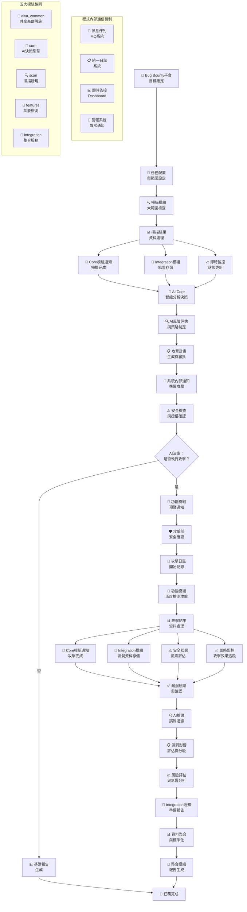

# 🎯 AIVA 完整程式運作流程 - 從目標確定到報告生成

> **文件版本**: v1.0  
> **創建日期**: 2025年11月7日  
> **適用場景**: HackOne、Bugcrowd 等 Bug Bounty 平台任務  
> **程式架構**: 基於五大模組 (aiva_common, core, scan, integration, features)

---

## 📋 完整工作流程概覽

### 🔄 實際系統運作流程圖 (含資料處置與通知)



---

## 🎯 Phase 1: Bug Bounty 目標確定與配置

### 1.1 從平台獲取目標資訊

**支援平台**:
- ✅ HackOne
- ✅ Bugcrowd  
- ✅ Intigriti
- ✅ 企業私有程式

**目標資訊配置**:
```python
# 範例：從 HackOne 獲取目標
target_config = {
    "platform": "hackerone",
    "program_name": "example-company",
    "targets": [
        {
            "url": "https://example.com",
            "type": "web_application",
            "scope": "in_scope",
            "asset_type": "domain"
        },
        {
            "url": "https://api.example.com", 
            "type": "api_endpoint",
            "scope": "in_scope",
            "asset_type": "subdomain"
        }
    ],
    "out_of_scope": [
        "https://status.example.com",
        "*.staging.example.com"
    ],
    "authorized_testing": {
        "rate_limiting": 100,  # requests per minute
        "destructive_testing": False,
        "social_engineering": False
    }
}
```

### 1.2 程式任務啟動

**啟動腳本**:
```bash
# 啟動完整 Bug Bounty 任務
python scripts/launcher/aiva_launcher.py --mode bugbounty --target-config targets.json

# 或使用直接命令
python -c "
from services.core.aiva_core.ai_engine.bio_neuron_core import BioNeuronRAGAgent
from services.integration.aiva_integration.task_orchestrator import TaskOrchestrator

# 初始化 AI 決策引擎
ai_engine = BioNeuronRAGAgent()
orchestrator = TaskOrchestrator()

# 執行完整工作流程
result = orchestrator.execute_bounty_workflow(
    targets=['https://example.com', 'https://api.example.com'],
    scope_config=target_config
)
"
```

---

## 🔍 Phase 2: 掃描模組大範圍檢查

### 2.1 掃描模組啟動流程

**掃描策略選擇**:
```python
# services/scan/aiva_scan/strategy_controller.py
scan_strategy = {
    "strategy_type": "BALANCED",  # CONSERVATIVE/FAST/BALANCED/DEEP/AGGRESSIVE
    "engines": {
        "python_engine": True,    # HTTP客戶端、爬蟲、認證
        "typescript_engine": True, # Playwright動態掃描  
        "rust_engine": True       # 敏感資訊檢測
    },
    "scan_depth": "comprehensive",
    "parallel_workers": 20,
    "timeout_per_target": 300  # 5分鐘
}
```

### 2.2 三大掃描引擎協同工作

**Python 靜態引擎** (廣度掃描):
```python
# services/scan/aiva_scan/core_crawling_engine/
tasks = [
    "HTTP客戶端連接測試",
    "URL佇列管理與爬蟲",
    "靜態內容解析",
    "認證狀態檢測",
    "範圍驗證與過濾"
]
```

**TypeScript 動態引擎** (深度互動):
```python
# services/scan/typescript/
tasks = [
    "Playwright無頭瀏覽器啟動",
    "JavaScript執行與AJAX捕獲",
    "動態內容提取",
    "表單自動化填寫測試",
    "SPA(單頁應用)路由發現"
]
```

**Rust 資訊收集引擎** (高效檢測):
```python
# services/scan/info_gatherer_rust/
tasks = [
    "Git歷史掃描",
    "敏感資訊檢測",
    "API端點發現",
    "技術指紋識別",
    "證書與TLS分析"
]
```

### 2.3 掃描結果彙整與資料處置

**掃描完成後的資料結構**:
```python
scan_results = {
    "scan_metadata": {
        "scan_id": "SCAN_20251107_001",
        "timestamp": "2025-11-07T10:30:00Z",
        "duration": 1847,  # 秒
        "status": "completed"
    },
    "discovered_assets": {
        "domains": 15,
        "subdomains": 127,
        "urls": 2847,
        "api_endpoints": 94,
        "forms": 23,
        "js_files": 156
    },
    "technology_stack": {
        "web_server": "nginx/1.18.0",
        "application_framework": "React 18.2.0",
        "backend_api": "Node.js Express", 
        "database_hints": "MongoDB",
        "cdn": "Cloudflare"
    },
    "security_indicators": {
        "waf_detected": True,
        "rate_limiting": True,
        "https_only": True,
        "security_headers": ["CSP", "HSTS", "X-Frame-Options"]
    },
    "potential_entry_points": [
        {"url": "/api/v1/users", "method": "GET", "auth_required": False},
        {"url": "/admin/login", "type": "form", "csrf_protected": True},
        {"url": "/search", "parameter": "q", "reflection_detected": True}
    ]
}
```

### 2.4 第一次資料處置流程 (基於網路最佳實踐)

**受 Netflix/Kafka 啟發的資料流向設計**:
```python
# services/scan/aiva_scan/result_dispatcher.py
class ScanResultDispatcher:
    """掃描結果分發器 - 負責將掃描結果正確分發給各模組"""
    
    async def dispatch_scan_results(self, scan_results: dict) -> dict:
        """分發掃描結果到各個需要的模組"""
        
        dispatch_tasks = []
        
        # 1️⃣ 通知 Core 模組 - AI 分析用
        core_notification = self._notify_core_module(scan_results)
        dispatch_tasks.append(core_notification)
        
        # 2️⃣ 存儲到 Integration 模組 - 持久化與監控
        storage_task = self._store_to_integration(scan_results)
        dispatch_tasks.append(storage_task)
        
        # 3️⃣ 更新即時監控 - 狀態追蹤
        monitoring_update = self._update_monitoring_dashboard(scan_results)
        dispatch_tasks.append(monitoring_update)
        
        # 4️⃣ 觸發安全檢查 - 預防性措施
        security_check = self._trigger_security_validation(scan_results)
        dispatch_tasks.append(security_check)
        
        # 並行執行所有分發任務
        dispatch_results = await asyncio.gather(*dispatch_tasks)
        
        return {
            "core_notified": dispatch_results[0],
            "data_stored": dispatch_results[1], 
            "monitoring_updated": dispatch_results[2],
            "security_validated": dispatch_results[3]
        }
    
    async def _notify_core_module(self, scan_results: dict) -> bool:
        """通知 Core 模組掃描完成"""
        from services.aiva_common.mq.broker import Broker
        
        broker = Broker()
        
        # 發送掃描完成通知到 Core 模組
        notification = {
            "event_type": "SCAN_COMPLETED",
            "scan_id": scan_results["scan_metadata"]["scan_id"],
            "asset_count": sum(scan_results["discovered_assets"].values()),
            "potential_vulnerabilities": len(scan_results["potential_entry_points"]),
            "priority": "HIGH" if scan_results["potential_entry_points"] else "LOW",
            "data_location": f"scan_results/{scan_results['scan_metadata']['scan_id']}.json"
        }
        
        await broker.publish(
            queue="core.ai_analysis",
            message=notification
        )
        
        # 記錄通知日誌
        logger.info(f"✅ Core模組已通知 - 掃描ID: {scan_results['scan_metadata']['scan_id']}")
        return True
    
    async def _store_to_integration(self, scan_results: dict) -> bool:
        """存儲掃描結果到 Integration 模組"""
        from services.integration.aiva_integration.data_manager import DataManager
        
        data_manager = DataManager()
        
        # 標準化並存儲掃描結果
        storage_result = await data_manager.store_scan_results(
            scan_id=scan_results["scan_metadata"]["scan_id"],
            results=scan_results,
            storage_type="postgresql",  # 使用升級後的 PostgreSQL
            index_for_search=True  # 建立搜尋索引
        )
        
        logger.info(f"💾 掃描結果已存儲 - 位置: {storage_result['storage_path']}")
        return storage_result["success"]
```

---

## 🧠 Phase 3: AI Core 智能分析與決策

### 3.1 AI 決策引擎分析

**BioNeuronRAGAgent 500萬參數決策**:
```python
# services/core/aiva_core/ai_engine/bio_neuron_core.py
ai_analysis = await ai_engine.analyze_scan_results(scan_results)

decision_matrix = {
    "high_priority_targets": [
        {
            "target": "/api/v1/users",
            "vulnerability_probability": 0.87,
            "recommended_tests": ["IDOR", "Authentication Bypass", "SQL Injection"],
            "estimated_impact": "HIGH",
            "bounty_potential": "$2000-5000"
        },
        {
            "target": "/search?q=",
            "vulnerability_probability": 0.73,
            "recommended_tests": ["XSS", "SQL Injection", "Template Injection"],
            "estimated_impact": "MEDIUM-HIGH", 
            "bounty_potential": "$500-2000"
        }
    ],
    "attack_vectors": [
        "API認證繞過路徑",
        "反射型XSS利用鏈",
        "IDOR橫向權限擴展"
    ],
    "resource_allocation": {
        "function_modules_needed": ["function_idor", "function_xss", "function_sqli"],
        "priority_order": ["IDOR", "XSS", "SQLi"],
        "parallel_execution": True
    }
}
```

### 3.2 智能策略規劃與攻擊前準備

**AI 決策邏輯與內部通知機制**:
```python
# services/core/aiva_core/ai_engine/attack_decision_engine.py
class AttackDecisionEngine:
    """攻擊決策引擎 - 負責攻擊前的完整決策與通知流程"""
    
    async def make_attack_decision(self, ai_analysis: dict) -> dict:
        """制定攻擊決策並執行攻擊前準備"""
        
        # 1️⃣ AI 風險評估與策略制定
        risk_assessment = await self._assess_attack_risks(ai_analysis)
        attack_strategy = await self._generate_attack_strategy(ai_analysis, risk_assessment)
        
        # 2️⃣ 攻擊計畫生成與審批
        attack_plan = await self._create_attack_plan(attack_strategy)
        approval_result = await self._request_internal_approval(attack_plan)
        
        if not approval_result["approved"]:
            return {
                "decision": "ABORT",
                "reason": approval_result["reason"],
                "fallback": "BASIC_REPORT_GENERATION"
            }
        
        # 3️⃣ 系統內部通知 - 準備攻擊
        await self._notify_prepare_attack(attack_plan)
        
        # 4️⃣ 安全檢查與授權確認
        security_clearance = await self._perform_security_checks(attack_plan)
        
        if not security_clearance["cleared"]:
            return {
                "decision": "SECURITY_HOLD",
                "reason": security_clearance["issues"],
                "required_actions": security_clearance["required_fixes"]
            }
        
        # 5️⃣ 最終決策
        if ai_analysis["confidence"] > 0.8 and security_clearance["cleared"]:
            decision = "EXECUTE_ATTACK"
            await self._trigger_attack_sequence(attack_plan)
        elif ai_analysis["confidence"] > 0.5:
            decision = "ADDITIONAL_RECONNAISSANCE"
        else:
            decision = "BASIC_REPORT_GENERATION"
        
        return {
            "decision": decision,
            "attack_plan": attack_plan,
            "security_clearance": security_clearance,
            "estimated_duration": attack_plan.get("estimated_duration", 300),
            "target_modules": attack_plan.get("target_modules", [])
        }
    
    async def _notify_prepare_attack(self, attack_plan: dict) -> None:
        """通知相關模組準備攻擊"""
        from services.aiva_common.mq.broker import Broker
        
        broker = Broker()
        
        # 通知 Features 模組準備攻擊
        for module in attack_plan["target_modules"]:
            await broker.publish(
                queue=f"features.{module}.prepare",
                message={
                    "event_type": "PREPARE_ATTACK",
                    "attack_id": attack_plan["attack_id"],
                    "target_urls": attack_plan["targets"],
                    "attack_type": attack_plan["attack_types"][module],
                    "priority": attack_plan["priority"],
                    "estimated_start": attack_plan["scheduled_start"]
                }
            )
        
        # 通知 Integration 模組準備監控
        await broker.publish(
            queue="integration.monitoring.prepare",
            message={
                "event_type": "ATTACK_MONITORING_PREPARE",
                "attack_id": attack_plan["attack_id"],
                "modules_to_monitor": attack_plan["target_modules"],
                "alert_thresholds": attack_plan["alert_settings"]
            }
        )
        
        logger.info(f"🔔 攻擊準備通知已發送 - 攻擊ID: {attack_plan['attack_id']}")
    
    async def _perform_security_checks(self, attack_plan: dict) -> dict:
        """攻擊前安全檢查"""
        security_issues = []
        
        # 檢查目標授權狀態
        for target in attack_plan["targets"]:
            auth_status = await self._verify_target_authorization(target)
            if not auth_status["authorized"]:
                security_issues.append(f"目標 {target} 未獲授權")
        
        # 檢查攻擊載荷安全性
        for payload_type in attack_plan["payload_types"]:
            payload_safety = await self._verify_payload_safety(payload_type)
            if not payload_safety["safe"]:
                security_issues.append(f"載荷 {payload_type} 可能造成破壞")
        
        # 檢查系統資源狀態
        resource_status = await self._check_system_resources()
        if not resource_status["sufficient"]:
            security_issues.append("系統資源不足，可能影響穩定性")
        
        return {
            "cleared": len(security_issues) == 0,
            "issues": security_issues,
            "required_fixes": [f"修復: {issue}" for issue in security_issues]
        }
```

---

## 🎯 Phase 4: 功能模組深度檢測 (條件執行)

### 4.1 功能模組選擇與啟動

**當掃描模組發現潛在漏洞時**，AI會智能選擇對應的功能模組：

```python
# services/core/aiva_core/execution/task_generator.py
function_tasks = [
    {
        "module": "function_sqli",
        "target": "/api/v1/users?id=1",
        "payload_types": ["boolean_blind", "time_blind", "union_based"],
        "priority": "HIGH"
    },
    {
        "module": "function_xss", 
        "target": "/search?q=test",
        "contexts": ["reflected", "stored", "dom"],
        "priority": "HIGH"
    },
    {
        "module": "function_idor",
        "target": "/api/v1/profile", 
        "test_scenarios": ["horizontal", "vertical", "parameter_pollution"],
        "priority": "MEDIUM"
    }
]
```

### 4.2 並行深度檢測執行

**SQL注入檢測** (function_sqli):
```python
# services/features/function_sqli/
sqli_results = await SmartDetectionManager().comprehensive_scan(
    target="/api/v1/users?id=1",
    techniques=["boolean_blind", "time_blind", "union_based", "error_based"],
    ai_enhanced=True
)
```

**XSS檢測** (function_xss):
```python  
# services/features/function_xss/
xss_results = await XssWorkerService().multi_context_scan(
    target="/search?q=",
    contexts=["html", "attribute", "script", "style"],
    blind_xss=True
)
```

**IDOR檢測** (function_idor):
```python
# services/features/function_idor/
idor_results = await IdorWorkerService().privilege_escalation_test(
    target="/api/v1/profile",
    scenarios=["horizontal", "vertical", "object_references"]
)
```

### 4.3 攻擊前準備與執行

**功能模組攻擊前準備流程**:
```python
# services/features/common/attack_preparation.py
class AttackPreparationHandler:
    """攻擊準備處理器 - 功能模組攻擊前的準備工作"""
    
    async def prepare_for_attack(self, attack_notification: dict) -> dict:
        """接收攻擊準備通知並執行準備工作"""
        
        attack_id = attack_notification["attack_id"]
        logger.info(f"🔔 收到攻擊準備通知 - 攻擊ID: {attack_id}")
        
        # 1️⃣ 安全確認檢查
        safety_check = await self._perform_safety_confirmation(attack_notification)
        if not safety_check["safe_to_proceed"]:
            return {"status": "ABORT", "reason": safety_check["safety_issues"]}
        
        # 2️⃣ 攻擊日誌記錄啟動
        log_session = await self._start_attack_logging(attack_id)
        
        # 3️⃣ 載荷準備與驗證
        payload_preparation = await self._prepare_attack_payloads(
            attack_notification["attack_type"],
            attack_notification["target_urls"]
        )
        
        # 4️⃣ 通知 Core 模組準備完成
        await self._notify_preparation_complete(attack_id)
        
        return {
            "status": "READY",
            "attack_id": attack_id,
            "log_session_id": log_session["session_id"],
            "prepared_payloads": len(payload_preparation["payloads"]),
            "estimated_duration": payload_preparation["estimated_duration"]
        }
    
    async def _start_attack_logging(self, attack_id: str) -> dict:
        """開始攻擊日誌記錄"""
        from services.integration.aiva_integration.logging_manager import AttackLogger
        
        attack_logger = AttackLogger()
        log_session = await attack_logger.start_attack_session(
            attack_id=attack_id,
            log_level="DETAILED",
            real_time_monitoring=True
        )
        
        logger.info(f"📝 攻擊日誌記錄已啟動 - 會話ID: {log_session['session_id']}")
        return log_session
```

### 4.4 第二次資料處置流程 (基於 SIEM 最佳實踐)

**功能模組攻擊結果資料流向**:
```python
# services/features/common/attack_result_dispatcher.py
class AttackResultDispatcher:
    """攻擊結果分發器 - 處理功能模組攻擊完成後的資料分發"""
    
    async def dispatch_attack_results(self, attack_results: dict) -> dict:
        """分發攻擊結果到各個需要的模組"""
        
        attack_id = attack_results["attack_metadata"]["attack_id"]
        logger.info(f"📊 開始處理攻擊結果 - 攻擊ID: {attack_id}")
        
        dispatch_tasks = []
        
        # 1️⃣ 通知 Core 模組 - 攻擊完成
        core_notification = self._notify_core_attack_complete(attack_results)
        dispatch_tasks.append(core_notification)
        
        # 2️⃣ 存儲漏洞資料到 Integration 模組
        vulnerability_storage = self._store_vulnerability_data(attack_results)
        dispatch_tasks.append(vulnerability_storage)
        
        # 3️⃣ 安全狀態風險評估
        security_assessment = self._assess_security_status(attack_results)
        dispatch_tasks.append(security_assessment)
        
        # 4️⃣ 即時監控更新 - 攻擊效果追蹤
        monitoring_update = self._update_attack_monitoring(attack_results)
        dispatch_tasks.append(monitoring_update)
        
        # 5️⃣ 觸發警報 (如果發現嚴重漏洞)
        alert_check = self._check_critical_vulnerability_alerts(attack_results)
        dispatch_tasks.append(alert_check)
        
        # 並行執行所有分發任務
        dispatch_results = await asyncio.gather(*dispatch_tasks)
        
        return {
            "core_notified": dispatch_results[0],
            "vulnerabilities_stored": dispatch_results[1],
            "security_assessed": dispatch_results[2],
            "monitoring_updated": dispatch_results[3],
            "alerts_triggered": dispatch_results[4]
        }
    
    async def _notify_core_attack_complete(self, attack_results: dict) -> bool:
        """通知 Core 模組攻擊完成"""
        from services.aiva_common.mq.broker import Broker
        
        broker = Broker()
        
        # 統計攻擊結果
        vulnerability_count = len(attack_results.get("confirmed_vulnerabilities", []))
        critical_count = len([v for v in attack_results.get("confirmed_vulnerabilities", []) 
                            if v.get("severity") == "CRITICAL"])
        
        notification = {
            "event_type": "ATTACK_COMPLETED",
            "attack_id": attack_results["attack_metadata"]["attack_id"],
            "scan_id": attack_results["attack_metadata"]["original_scan_id"],
            "vulnerabilities_found": vulnerability_count,
            "critical_vulnerabilities": critical_count,
            "attack_duration": attack_results["attack_metadata"]["duration"],
            "success_rate": attack_results["attack_metadata"]["success_rate"],
            "data_location": f"attack_results/{attack_results['attack_metadata']['attack_id']}.json",
            "requires_verification": vulnerability_count > 0
        }
        
        await broker.publish(
            queue="core.vulnerability_analysis",
            message=notification
        )
        
        logger.info(f"✅ Core模組已通知攻擊完成 - 發現 {vulnerability_count} 個漏洞")
        return True

### 4.5 漏洞驗證與確認

**智能驗證流程**:
```python
# services/core/aiva_core/ai_engine/vulnerability_validator.py
class VulnerabilityValidator:
    """漏洞驗證器 - AI驅動的漏洞確認與誤報過濾"""
    
    async def process_attack_results(self, attack_notification: dict) -> dict:
        """處理攻擊完成通知並開始驗證"""
        
        # 從存儲中載入攻擊結果
        attack_results = await self._load_attack_results(
            attack_notification["data_location"]
        )
        
        verification_results = []
        
        for potential_vuln in attack_results.get("potential_vulnerabilities", []):
            if potential_vuln.get("confidence", 0) > 0.7:
                # AI 驅動驗證
                verification = await self._verify_vulnerability(
                    vulnerability=potential_vuln,
                    verification_methods=["payload_variation", "response_analysis", "timing_analysis"]
                )
                
                if verification["confirmed"]:
                    # 通知 Integration 模組更新漏洞狀態
                    await self._notify_vulnerability_confirmed(potential_vuln, verification)
                    
                    verification_results.append({
                        "vulnerability": potential_vuln,
                        "verification": verification,
                        "exploit_poc": verification["proof_of_concept"],
                        "business_impact": verification["impact_assessment"]
                    })
        
        return {
            "verified_vulnerabilities": verification_results,
            "verification_complete": True,
            "next_phase": "IMPACT_ASSESSMENT"
        }
    
    async def _notify_vulnerability_confirmed(self, vulnerability: dict, verification: dict) -> None:
        """通知漏洞已確認"""
        from services.aiva_common.mq.broker import Broker
        
        broker = Broker()
        await broker.publish(
            queue="integration.vulnerability_confirmed",
            message={
                "event_type": "VULNERABILITY_CONFIRMED",
                "vulnerability_id": vulnerability["id"],
                "severity": verification["severity"],
                "confidence": verification["confidence"],
                "requires_immediate_attention": verification["severity"] in ["CRITICAL", "HIGH"]
            }
        )
```

---

## 📊 Phase 5: 整合模組報告生成

### 5.1 結果聚合與標準化

**Integration模組統一處理**:
```python
# services/integration/aiva_integration/result_aggregator.py
final_results = await ResultAggregator().process_complete_scan(
    scan_results=scan_results,
    ai_analysis=ai_analysis,
    function_results=function_results,
    verification_results=verification_results
)

# 標準化輸出格式
standardized_report = {
    "scan_metadata": {
        "scan_id": "AIVA_20251107_001",
        "target_count": len(target_config["targets"]),
        "scan_duration": "45 minutes",
        "modules_used": ["scan", "core", "features", "integration"]
    },
    "executive_summary": {
        "total_vulnerabilities": 7,
        "critical": 2,
        "high": 3, 
        "medium": 2,
        "estimated_bounty": "$8000-15000"
    },
    "detailed_findings": [...],
    "recommendations": [...],
    "technical_details": [...]
}
```

### 5.2 Bug Bounty平台特化報告

**HackOne格式報告**:
```python
# services/integration/capability/bugbounty_report_generator.py
hackerone_report = await BugBountyReportGenerator().generate_platform_report(
    platform="hackerone",
    findings=final_results["detailed_findings"],
    format_options={
        "include_poc": True,
        "include_timeline": True,
        "include_impact_analysis": True,
        "markdown_format": True
    }
)
```

**報告生成範例**:
```markdown
## Summary
SQL Injection vulnerability in user profile API allowing data extraction

## Steps to Reproduce
1. Navigate to https://example.com/api/v1/users?id=1
2. Inject payload: `1' UNION SELECT username,password FROM admin_users--`
3. Observe sensitive data exposure in JSON response

## Impact
- Complete user database compromise
- Administrative account exposure  
- Potential for lateral movement

## Proof of Concept
[Generated by AIVA with verified payload and response]

## Recommended Fix
Implement parameterized queries and input validation
```

---

## � 程式內部通信機制詳細說明

### �🔄 訊息佇列 (MQ) 系統

**核心通信架構**:
```python
# services/aiva_common/mq/broker.py
class AIVAMessageBroker:
    """AIVA 統一訊息代理 - 處理所有模組間通信"""
    
    def __init__(self):
        self.queues = {
            # Core 模組佇列
            "core.ai_analysis": "AI分析任務佇列",
            "core.vulnerability_analysis": "漏洞分析佇列", 
            "core.decision_making": "決策制定佇列",
            
            # Features 模組佇列
            "features.sqli.prepare": "SQL注入攻擊準備",
            "features.xss.prepare": "XSS攻擊準備",
            "features.idor.prepare": "IDOR攻擊準備",
            
            # Integration 模組佇列
            "integration.monitoring.prepare": "監控準備佇列",
            "integration.vulnerability_confirmed": "漏洞確認佇列",
            "integration.report_generation": "報告生成佇列",
            
            # 系統佇列
            "system.alerts": "系統警報佇列",
            "system.logging": "系統日誌佇列",
            "system.health_check": "健康檢查佇列"
        }
    
    async def setup_message_routing(self):
        """設置訊息路由規則"""
        routing_rules = {
            # 掃描完成 → Core AI 分析
            "SCAN_COMPLETED": ["core.ai_analysis", "integration.monitoring"],
            
            # 攻擊決策 → Features 準備
            "ATTACK_DECISION_MADE": ["features.*.prepare", "integration.monitoring.prepare"],
            
            # 攻擊完成 → Core 驗證
            "ATTACK_COMPLETED": ["core.vulnerability_analysis", "integration.monitoring"],
            
            # 漏洞確認 → Integration 報告
            "VULNERABILITY_CONFIRMED": ["integration.report_generation", "system.alerts"],
            
            # 系統異常 → 全體通知
            "SYSTEM_ERROR": ["system.alerts", "integration.monitoring", "core.decision_making"]
        }
        
        return routing_rules
```

### 📋 統一日誌系統

**分層日誌記錄**:
```python
# services/aiva_common/logging/unified_logger.py
class UnifiedLogger:
    """統一日誌系統 - 追蹤整個工作流程"""
    
    def __init__(self):
        self.log_levels = {
            "SCAN": "掃描階段日誌",
            "DECISION": "AI決策日誌", 
            "ATTACK": "攻擊執行日誌",
            "VERIFICATION": "漏洞驗證日誌",
            "INTEGRATION": "整合處理日誌"
        }
    
    async def log_workflow_event(self, event_type: str, details: dict):
        """記錄工作流程事件"""
        log_entry = {
            "timestamp": datetime.utcnow().isoformat(),
            "event_type": event_type,
            "phase": self._determine_workflow_phase(event_type),
            "details": details,
            "correlation_id": details.get("scan_id") or details.get("attack_id")
        }
        
        # 同時記錄到多個目標
        await asyncio.gather(
            self._log_to_database(log_entry),
            self._log_to_file(log_entry),
            self._log_to_monitoring_dashboard(log_entry)
        )
```

### 📊 即時監控 Dashboard

**工作流程狀態追蹤**:
```python
# services/integration/aiva_integration/monitoring/workflow_monitor.py
class WorkflowMonitor:
    """工作流程監控器 - 即時追蹤整個程式運作狀態"""
    
    def __init__(self):
        self.workflow_states = {
            "SCAN_IN_PROGRESS": "掃描進行中",
            "SCAN_COMPLETED": "掃描完成",
            "AI_ANALYZING": "AI分析中",
            "ATTACK_PREPARING": "攻擊準備中",
            "ATTACK_IN_PROGRESS": "攻擊進行中",
            "ATTACK_COMPLETED": "攻擊完成",
            "VULNERABILITY_VERIFICATION": "漏洞驗證中",
            "REPORT_GENERATION": "報告生成中",
            "WORKFLOW_COMPLETED": "工作流程完成"
        }
    
    async def update_workflow_status(self, scan_id: str, new_status: str, details: dict):
        """更新工作流程狀態"""
        status_update = {
            "scan_id": scan_id,
            "status": new_status,
            "timestamp": datetime.utcnow().isoformat(),
            "details": details,
            "progress_percentage": self._calculate_progress(new_status)
        }
        
        # 更新即時 Dashboard
        await self._update_dashboard(status_update)
        
        # 檢查是否需要觸發警報
        if self._requires_alert(new_status, details):
            await self._trigger_workflow_alert(status_update)
```

### 🚨 警報系統

**異常狀況處理**:
```python
# services/aiva_common/alerts/alert_manager.py
class AlertManager:
    """警報管理器 - 處理系統異常與重要事件通知"""
    
    async def process_workflow_alerts(self, alert_data: dict):
        """處理工作流程相關警報"""
        alert_types = {
            "CRITICAL_VULNERABILITY_FOUND": self._handle_critical_vuln_alert,
            "ATTACK_FAILED": self._handle_attack_failure_alert,
            "SYSTEM_RESOURCE_LOW": self._handle_resource_alert,
            "UNAUTHORIZED_TARGET_DETECTED": self._handle_security_alert
        }
        
        alert_type = alert_data.get("alert_type")
        if alert_type in alert_types:
            await alert_types[alert_type](alert_data)
    
    async def _handle_critical_vuln_alert(self, alert_data: dict):
        """處理嚴重漏洞發現警報"""
        # 立即通知相關模組
        # 可能需要暫停其他攻擊
        # 優先處理嚴重漏洞驗證
        pass
```

---

## 🔄 完整執行範例 (含內部通信)

### 實際使用腳本 (含內部通信機制)

```python
#!/usr/bin/env python3
"""
AIVA 完整 Bug Bounty 工作流程執行腳本 - 含資料處置與內部通信
"""

async def execute_complete_bounty_workflow_with_communications():
    """執行完整的 Bug Bounty 工作流程 - 包含所有資料處置與內部通信"""
    
    # 初始化通信系統
    from services.aiva_common.mq.broker import AIVAMessageBroker
    from services.aiva_common.logging.unified_logger import UnifiedLogger
    from services.integration.aiva_integration.monitoring.workflow_monitor import WorkflowMonitor
    
    broker = AIVAMessageBroker()
    logger = UnifiedLogger()
    monitor = WorkflowMonitor()
    
    # Phase 1: 目標配置
    target_config = {
        "targets": ["https://example.com", "https://api.example.com"],
        "platform": "hackerone",
        "authorized": True
    }
    
    scan_id = f"SCAN_{int(time.time())}"
    await logger.log_workflow_event("WORKFLOW_STARTED", {"scan_id": scan_id, "targets": target_config["targets"]})
    await monitor.update_workflow_status(scan_id, "SCAN_IN_PROGRESS", {"phase": "initialization"})
    
    # Phase 2: 掃描模組大範圍檢查
    from services.scan.aiva_scan.scan_orchestrator import ScanOrchestrator
    from services.scan.aiva_scan.result_dispatcher import ScanResultDispatcher
    
    scanner = ScanOrchestrator()
    scan_results = await scanner.comprehensive_scan(
        targets=target_config["targets"],
        strategy="BALANCED",
        scan_id=scan_id
    )
    
    print(f"🔍 掃描完成: 發現 {sum(scan_results['discovered_assets'].values())} 個資產")
    await logger.log_workflow_event("SCAN_COMPLETED", {"scan_id": scan_id, "assets_found": sum(scan_results['discovered_assets'].values())})
    
    # 第一次資料處置 - 掃描結果分發
    dispatcher = ScanResultDispatcher()
    scan_dispatch_result = await dispatcher.dispatch_scan_results(scan_results)
    
    await monitor.update_workflow_status(scan_id, "SCAN_COMPLETED", {
        "assets_found": sum(scan_results['discovered_assets'].values()),
        "data_processed": scan_dispatch_result
    })
    
    # Phase 3: AI 智能分析與攻擊決策
    from services.core.aiva_core.ai_engine.bio_neuron_core import BioNeuronRAGAgent
    from services.core.aiva_core.ai_engine.attack_decision_engine import AttackDecisionEngine
    
    await monitor.update_workflow_status(scan_id, "AI_ANALYZING", {"phase": "ai_analysis"})
    
    ai_engine = BioNeuronRAGAgent()
    ai_analysis = await ai_engine.analyze_scan_results(scan_results)
    
    decision_engine = AttackDecisionEngine()
    attack_decision = await decision_engine.make_attack_decision(ai_analysis)
    
    print(f"🧠 AI分析: 發現 {len(ai_analysis.get('high_priority_targets', []))} 個高優先級目標")
    print(f"⚡ 攻擊決策: {attack_decision['decision']}")
    
    await logger.log_workflow_event("ATTACK_DECISION_MADE", {
        "scan_id": scan_id,
        "decision": attack_decision["decision"],
        "target_modules": attack_decision.get("target_modules", [])
    })
    
    # Phase 4: 功能模組深度檢測 (條件執行)
    vulnerabilities = []
    
    if attack_decision["decision"] == "EXECUTE_ATTACK":
        await monitor.update_workflow_status(scan_id, "ATTACK_PREPARING", {
            "modules": attack_decision["target_modules"]
        })
        
        # 功能模組攻擊準備通知已在 AttackDecisionEngine 中發送
        # 等待功能模組準備完成
        await asyncio.sleep(5)  # 給模組時間準備
        
        await monitor.update_workflow_status(scan_id, "ATTACK_IN_PROGRESS", {
            "attack_id": attack_decision["attack_plan"]["attack_id"]
        })
        
        from services.features.function_sqli import SmartDetectionManager
        from services.features.function_xss.worker import XssWorkerService
        from services.features.function_idor.worker import IdorWorkerService
        from services.features.common.attack_result_dispatcher import AttackResultDispatcher
        
        # 並行執行功能檢測
        tasks = []
        for target in ai_analysis.get("high_priority_targets", []):
            if "sqli" in target.get("recommended_tests", []):
                tasks.append(SmartDetectionManager().scan_url(target["url"]))
            if "xss" in target.get("recommended_tests", []):
                tasks.append(XssWorkerService().scan_target(target["url"]))
            if "idor" in target.get("recommended_tests", []):
                tasks.append(IdorWorkerService().test_target(target["url"]))
        
        if tasks:
            function_results = await asyncio.gather(*tasks)
            
            # 模擬攻擊結果結構
            attack_results = {
                "attack_metadata": {
                    "attack_id": attack_decision["attack_plan"]["attack_id"],
                    "original_scan_id": scan_id,
                    "duration": 300,
                    "success_rate": 0.85
                },
                "potential_vulnerabilities": [r for r in function_results if hasattr(r, 'vulnerable') and r.vulnerable],
                "confirmed_vulnerabilities": []
            }
            
            # 第二次資料處置 - 攻擊結果分發
            attack_dispatcher = AttackResultDispatcher()
            attack_dispatch_result = await attack_dispatcher.dispatch_attack_results(attack_results)
            
            print(f"🎯 功能檢測: 發現 {len(attack_results['potential_vulnerabilities'])} 個潛在漏洞")
            
            await monitor.update_workflow_status(scan_id, "ATTACK_COMPLETED", {
                "vulnerabilities_found": len(attack_results['potential_vulnerabilities']),
                "data_processed": attack_dispatch_result
            })
            
            # Phase 4.5: 漏洞驗證
            await monitor.update_workflow_status(scan_id, "VULNERABILITY_VERIFICATION", {
                "vulnerabilities_to_verify": len(attack_results['potential_vulnerabilities'])
            })
            
            from services.core.aiva_core.ai_engine.vulnerability_validator import VulnerabilityValidator
            
            validator = VulnerabilityValidator()
            verification_result = await validator.process_attack_results({
                "data_location": f"attack_results/{attack_results['attack_metadata']['attack_id']}.json"
            })
            
            vulnerabilities = verification_result["verified_vulnerabilities"]
            print(f"✅ 漏洞驗證: 確認 {len(vulnerabilities)} 個真實漏洞")
    
    # Phase 5: 整合報告生成
    await monitor.update_workflow_status(scan_id, "REPORT_GENERATION", {
        "confirmed_vulnerabilities": len(vulnerabilities)
    })
    
    from services.integration.capability.bugbounty_report_generator import BugBountyReportGenerator
    
    generator = BugBountyReportGenerator()
    final_report = await generator.generate_complete_report(
        scan_results=scan_results,
        ai_analysis=ai_analysis,
        vulnerabilities=vulnerabilities,
        target_platform="hackerone"
    )
    
    await monitor.update_workflow_status(scan_id, "WORKFLOW_COMPLETED", {
        "report_generated": True,
        "report_path": final_report.get('report_path')
    })
    
    # 最終日誌記錄
    await logger.log_workflow_event("WORKFLOW_COMPLETED", {
        "scan_id": scan_id,
        "total_vulnerabilities": len(vulnerabilities),
        "estimated_bounty": final_report.get('estimated_bounty', '0-1000'),
        "report_path": final_report.get('report_path')
    })
    
    # 輸出結果 (含內部通信統計)
    print(f"""
    📊 AIVA 完整工作流程執行完成！
    
    🎯 掃描統計:
    - 掃描ID: {scan_id}
    - 目標數量: {len(target_config['targets'])}
    - 發現資產: {sum(scan_results['discovered_assets'].values())}
    - 檢測漏洞: {len(vulnerabilities)}
    - 預估獎金: ${final_report.get('estimated_bounty', '0-1000')}
    
    📨 內部通信統計:
    - 掃描結果通知: {scan_dispatch_result.get('core_notified', False)}
    - 攻擊結果通知: {'是' if attack_decision['decision'] == 'EXECUTE_ATTACK' else '無'}
    - 漏洞確認通知: {len(vulnerabilities) > 0}
    - 工作流程監控: 已完成
    
    📝 報告已生成: {final_report.get('report_path', 'N/A')}
    📋 完整日誌: 已記錄到統一日誌系統
    """)
    
    return final_report

# 執行完整工作流程 (含內部通信)
if __name__ == "__main__":
    import asyncio
    import time
    result = asyncio.run(execute_complete_bounty_workflow_with_communications())
```

---

## 📋 工作流程檢查清單

### ✅ 執行前檢查

- [ ] 目標在Bug Bounty授權範圍內
- [ ] AIVA環境完整安裝 (`pip install -r requirements.txt`)
- [ ] 五大模組狀態檢查 (`python scripts/utilities/health_check.py`)
- [ ] 網路連接與代理設定確認
- [ ] 速率限制與道德測試配置

### ✅ 執行中監控

- [ ] 掃描模組正常運行 (Python/TypeScript/Rust引擎)
- [ ] 第一次資料處置完成 (Core/Integration模組收到掃描結果)
- [ ] AI決策引擎回應正常 (< 2秒響應時間)
- [ ] 攻擊前準備通知發送 (功能模組收到準備指令)
- [ ] 安全檢查與授權確認通過
- [ ] 功能模組執行狀態 (根據AI決策條件啟動)
- [ ] 第二次資料處置完成 (攻擊結果分發到各模組)
- [ ] 內部通信系統正常 (MQ、日誌、監控)
- [ ] 記憶體與CPU使用率監控 (< 80%峰值)
- [ ] 目標服務可用性監控 (避免DoS影響)

### ✅ 執行後驗證

- [ ] 漏洞驗證與誤報過濾完成
- [ ] Bug Bounty平台報告格式正確
- [ ] 技術細節與PoC完整性檢查
- [ ] 法律合規與授權範圍確認
- [ ] 敏感資料清理與隱私保護

---

## 🎪 總結

AIVA的完整運作流程體現了**五大模組協同**與**智能資料處置**的強大能力：

### 🔄 核心流程特色

1. **🎯 目標確定**: 從Bug Bounty平台獲取授權目標
2. **🔍 掃描模組**: 三引擎協同進行大範圍資產發現
   - **第一次資料處置**: 掃描結果智能分發到Core、Integration模組
   - **內部通知**: 即時通知AI引擎開始分析
3. **🧠 AI決策**: 500萬參數智能分析，制定攻擊策略
   - **攻擊前準備**: 系統內部通知與安全檢查
   - **授權確認**: 多層次安全驗證機制
4. **🎯 功能模組**: 條件性深度漏洞檢測與驗證
   - **攻擊準備**: 接收通知、日誌啟動、載荷準備
   - **第二次資料處置**: 攻擊結果智能分發與風險評估
5. **📊 整合報告**: 標準化結果聚合與平台特化報告

### 🚀 先進設計亮點

**📨 智能通信機制**:
- 統一訊息佇列 (MQ) 系統處理模組間通信
- 分層日誌記錄追蹤完整工作流程
- 即時監控Dashboard展示執行狀態
- 智能警報系統處理異常情況

**🔄 資料處置智能化**:
- **雙重資料處置**: 掃描結果 + 攻擊結果的智能分發
- **條件執行邏輯**: AI決策驅動的功能模組啟動
- **安全檢查機制**: 攻擊前多層次安全驗證
- **即時狀態同步**: 所有模組狀態即時更新

**🛡️ 安全與合規**:
- 攻擊前授權確認與安全檢查
- 完整的審計日誌與操作記錄
- 智能誤報過濾與漏洞驗證
- 符合Bug Bounty平台要求的報告格式

這個流程確保了**高效率**、**高準確率**、**高安全性**的Bug Bounty任務執行，通過智能的資料處置和內部通信機制，實現了真正的**程式級協同作業**，無論目標是HackOne、Bugcrowd還是其他任何授權測試場景。

---

*🎯 AIVA 完整程式運作流程 - 2025年11月7日創建*