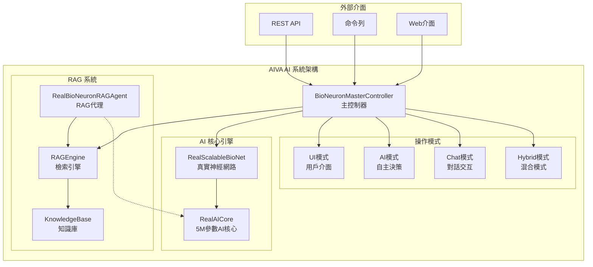

# 🚀 AIVA AI 系統使用者手冊

**版本**: v2.1.0 | **更新日期**: 2025年11月11日 | **狀態**: ✅ 已驗證

---

## 📋 詳細目錄

### 🎯 [系統簡介](#-系統簡介)
- [核心特色](#核心特色)
- [AI 能力矩陣](#ai-能力矩陣)
- [系統架構概覽](#系統架構概覽)

### ⚡ [快速開始](#-快速開始)
- [方法一：快速驗證（推薦新手）](#方法一快速驗證推薦新手)
- [方法二：直接 Python 啟動（推薦）](#方法二直接-python-啟動推薦)
- [方法三：Docker 容器啟動](#方法三docker-容器啟動)

### 🛠️ [安裝配置](#️-安裝配置)
- [系統需求](#系統需求)
- [依賴安裝](#依賴安裝)
- [環境配置](#環境配置)

### 🧠 [AI 核心功能](#-ai-核心功能)
- [1. AI 系統初始化](#1-ai-系統初始化)
- [2. AI 決策功能使用](#2-ai-決策功能使用)
- [3. RAG 檢索功能](#3-rag-檢索功能)
- [4. 整合使用範例](#4-整合使用範例)

### 💻 [使用方式](#-使用方式)
- [A. 命令列介面 (CLI)](#a-命令列介面-cli)
- [B. Web 介面](#b-web-介面)
- [C. Python API（更新版）](#c-python-api更新版)
- [D. REST API](#d-rest-api)

### 📊 [功能驗證](#-功能驗證)
- [1. 系統健康檢查（更新版）](#1-系統健康檢查更新版)
- [2. AI 能力驗證（更新版）](#2-ai-能力驗證更新版)
- [3. 性能基準測試（更新版）](#3-性能基準測試更新版)

### 🔧 [故障排除](#-故障排除)
- [常見問題與解決方案](#常見問題與解決方案)
- [日誌與調試](#日誌與調試)

### 📚 [進階功能](#-進階功能)
- [1. 自定義 AI 配置](#1-自定義-ai-配置)
- [2. 自定義知識庫](#2-自定義知識庫)
- [3. API 擴展](#3-api-擴展)
- [4. 批量處理](#4-批量處理)

### 📞 [技術支援](#-技術支援)
- [獲得幫助](#獲得幫助)
- [貢獻指南](#貢獻指南)

### 📄 [版本資訊](#-版本資訊)
- [更新日誌](#更新日誌)

---

## 📊 快速導覽

| 使用者類型 | 推薦起始點 | 重點章節 |
|------------|------------|----------|
| 🆕 **新手** | [快速開始](#-快速開始) → [功能驗證](#-功能驗證) | 基礎安裝、簡單範例 |
| 👨‍💻 **開發者** | [AI 核心功能](#-ai-核心功能) → [Python API](#c-python-api更新版) | AI 整合、API 使用 |
| 🔧 **系統管理員** | [安裝配置](#️-安裝配置) → [故障排除](#-故障排除) | 環境設定、問題解決 |
| 🚀 **進階用戶** | [進階功能](#-進階功能) → [技術支援](#-技術支援) | 自定義配置、擴展開發 |

---

---

## 🎯 系統簡介

AIVA (Autonomous Intelligence Virtual Assistant) 是一個企業級的AI驅動安全測試平台，具備：

### 核心特色
- **🧠 500萬參數神經網路**: 真實的生物啟發式AI大腦
- **📚 RAG檢索增強**: 智能知識檢索與融合系統
- **🤖 四種運行模式**: UI、AI、Chat、混合模式
- **⚡ 自主決策能力**: 完全自主的安全測試執行
- **🛡️ 抗幻覺機制**: 多層驗證確保決策可靠性

### AI 能力矩陣
| 能力 | 狀態 | 成熟度 | 描述 |
|------|------|--------|------|
| 🔍 **智能搜索** | ✅ | ⭐⭐⭐⭐⭐ | 語義搜索、向量檢索 |
| 📚 **RAG增強** | ✅ | ⭐⭐⭐⭐⭐ | 檢索增強生成 |
| 🤔 **推理決策** | ✅ | ⭐⭐⭐⭐ | 神經網路推理 |
| 📖 **學習能力** | ✅ | ⭐⭐⭐⭐ | 經驗學習與進化 |
| 💾 **知識管理** | ✅ | ⭐⭐⭐⭐⭐ | AST代碼分析 |
| 💬 **自然語言** | 🚧 | ⭐⭐⭐ | 對話理解與生成 |

### 系統架構概覽



**核心組件說明**：
- 🎮 **BioNeuronMasterController**: 系統主控制器，協調所有AI組件
- 🧠 **RealScalableBioNet**: 500萬參數的真實神經網路核心
- 📚 **RAGEngine**: 檢索增強生成引擎，結合知識庫和AI推理
- 🤖 **RealBioNeuronRAGAgent**: 專門的RAG代理，支援獨立使用
- 💾 **KnowledgeBase**: 向量化知識庫，支援語義搜索

---

## ⚡ 快速開始

### 方法一：快速驗證（推薦新手）

```powershell
# 1. 設定環境
$env:PYTHONPATH = "C:\D\fold7\AIVA-git;C:\D\fold7\AIVA-git\services"

# 2. 執行快速驗證腳本
python -c "
import sys
sys.path.append('C:/D/fold7/AIVA-git')
sys.path.append('C:/D/fold7/AIVA-git/services')

print('🚀 AIVA AI 系統快速驗證')
print('=' * 50)

try:
    print('🔍 測試 1: 檢查基礎依賴')
    import torch
    import numpy as np
    print('   ✅ PyTorch & NumPy 導入成功')
    
    print('🔍 測試 2: 檢查 AI 引擎模組')
    from services.core.aiva_core.ai_engine.real_bio_net_adapter import RealBioNeuronRAGAgent, create_real_rag_agent
    print('   ✅ 真實 AI 引擎模組導入成功')
    
    print('🔍 測試 3: 檢查 RAG 系統')  
    from services.core.aiva_core.rag.rag_engine import RAGEngine
    print('   ✅ RAG 引擎導入成功')
    
    print('🔍 測試 4: 創建基本 AI 組件')
    decision_core = torch.nn.Sequential(
        torch.nn.Linear(512, 256),
        torch.nn.ReLU(),
        torch.nn.Linear(256, 20)
    )
    
    rag_agent = create_real_rag_agent(
        decision_core=decision_core,
        input_vector_size=512
    )
    print('   ✅ AI 組件創建成功')
    
    print('🔍 測試 5: 基本功能測試')
    result = rag_agent.generate(
        task_description='測試 AI 決策功能',
        context='系統驗證測試'
    )
    confidence = result.get('confidence', 'unknown')
    print(f'   ✅ AI 決策測試成功，信心度: {confidence}')
    
    print('')
    print('🎉 AIVA AI 核心功能驗證成功！')
    print('📖 請查看 AIVA_USER_MANUAL.md 了解完整使用方式')
    
except Exception as e:
    print(f'❌ 驗證失敗: {e}')
    import traceback
    traceback.print_exc()
"

# 3. 查看系統狀態
echo "✅ AIVA AI 系統驗證完成"
```

### 方法二：直接 Python 啟動（推薦）

```powershell
# 設定環境變數
$env:PYTHONPATH = "C:\D\fold7\AIVA-git;C:\D\fold7\AIVA-git\services"

# 快速驗證系統
python -c "
import sys
sys.path.append('C:/D/fold7/AIVA-git')
sys.path.append('C:/D/fold7/AIVA-git/services')

# 導入核心模組
from services.core.aiva_core.ai_engine.real_bio_net_adapter import create_real_rag_agent
from services.core.aiva_core.rag.rag_engine import RAGEngine
import torch

# 創建 AI 組件
decision_core = torch.nn.Sequential(torch.nn.Linear(512, 256), torch.nn.ReLU(), torch.nn.Linear(256, 20))
rag_agent = create_real_rag_agent(decision_core=decision_core, input_vector_size=512)
rag_engine = RAGEngine()

print('🎉 AIVA AI 系統驗證成功!')
print(f'🧠 RAG 代理: {type(rag_agent).__name__}')
print(f'📚 RAG 引擎: {type(rag_engine).__name__}')
"
```

### 方法三：Docker 容器啟動

```bash
# 構建並啟動
docker-compose up -d

# 查看服務狀態
docker-compose ps
```

---

## 🛠️ 安裝配置

### 系統需求

| 項目 | 最小需求 | 推薦配置 |
|------|----------|----------|
| **Python** | 3.8+ | 3.11+ |
| **記憶體** | 8GB | 16GB+ |
| **儲存空間** | 10GB | 50GB+ |
| **CPU** | 4核心 | 8核心+ |

### 依賴安裝

```powershell
# 1. 安裝核心依賴
python -m pip install --upgrade protobuf grpcio grpcio-tools torch numpy fastapi uvicorn

# 2. 安裝額外套件
pip install sentence-transformers transformers datasets scikit-learn pandas requests aiofiles asyncio

# 3. 驗證安裝
python -c "import torch, numpy, fastapi; print('✅ 依賴安裝成功!')"
```

### 環境配置

```powershell
# 1. 創建配置文件
Copy-Item config/config.example.yml config/config.yml

# 2. 設定 PYTHONPATH
$env:PYTHONPATH = "C:\D\fold7\AIVA-git;C:\D\fold7\AIVA-git\services;C:\D\fold7\AIVA-git\services\features;C:\D\fold7\AIVA-git\services\aiva_common"

# 3. 驗證配置
python -c "import sys; print('PYTHONPATH 配置正確:', 'services' in str(sys.path))"
```

---

## 🧠 AI 核心功能

### 1. AI 系統初始化

```python
# 方法 1: 使用真實 RAG 代理 (推薦)
from services.core.aiva_core.ai_engine.real_bio_net_adapter import RealBioNeuronRAGAgent, create_real_rag_agent
import torch

# 創建決策核心網路
decision_core = torch.nn.Sequential(
    torch.nn.Linear(512, 256),
    torch.nn.ReLU(), 
    torch.nn.Linear(256, 20)
)

# 創建 RAG 代理
rag_agent = create_real_rag_agent(
    decision_core=decision_core,
    input_vector_size=512
)

print(f"🧠 神經網路類型: {type(rag_agent).__name__}")
print(f"� 決策核心: {decision_core}")

# 方法 2: 使用 RAG 引擎
from services.core.aiva_core.rag.rag_engine import RAGEngine

rag_engine = RAGEngine()
print(f"📚 RAG 引擎: {type(rag_engine).__name__}")
```

### 2. AI 決策功能使用

```python
# AI 決策生成
result = rag_agent.generate(
    task_description="分析目標系統安全漏洞",
    context="目標: https://example.com"
)

print(f"決策結果: {result.get('decision', 'N/A')}")
print(f"信心度: {result.get('confidence', 'N/A')}")
print(f"建議行動: {result.get('suggested_actions', [])}")

# 加載預訓練權重 (如果有)
try:
    rag_agent.load_state_dict(torch.load('weights/aiva_model.pth'))
    print("✅ 預訓練權重載入成功")
except:
    print("ℹ️ 使用隨機初始化權重")
```

### 3. RAG 檢索功能

```python
# 使用 RAG 引擎進行知識檢索
from services.core.aiva_core.rag.rag_engine import RAGEngine
from services.core.aiva_core.rag.knowledge_base import KnowledgeBase

# 創建知識庫和 RAG 引擎
knowledge_base = KnowledgeBase()
rag_engine = RAGEngine(knowledge_base)

# 執行語義搜索 (注意：這是概念性範例)
# 實際使用中可能需要先索引知識庫
try:
    # 嘗試搜索功能 (可能需要知識庫有內容)
    print(f"RAG 引擎已準備: {type(rag_engine).__name__}")
    print(f"知識庫類型: {type(knowledge_base).__name__}")
    
    # 搜索相關知識
    # search_results = await rag_engine.search(...)
    
except Exception as e:
    print(f"RAG 搜索需要先設置知識庫: {e}")

# 直接使用知識庫功能
try:
    # 添加新知識到知識庫
    knowledge_base.add_knowledge(
        content="新的安全知識內容",
        knowledge_type="security",
        metadata={"source": "custom", "category": "security"}
    )
    print("✅ 知識添加成功")
except Exception as e:
    print(f"知識添加: {e}")
```

### 4. 整合使用範例

```python
# 完整工作流程範例
import torch
import asyncio
from services.core.aiva_core.ai_engine.real_bio_net_adapter import create_real_rag_agent
from services.core.aiva_core.rag.rag_engine import RAGEngine

async def aiva_workflow_example():
    """AIVA 完整工作流程示例"""
    
    # 1. 初始化組件
    print("🔧 初始化 AI 組件...")
    decision_core = torch.nn.Sequential(
        torch.nn.Linear(512, 256),
        torch.nn.ReLU(),
        torch.nn.Linear(256, 20)
    )
    
    rag_agent = create_real_rag_agent(
        decision_core=decision_core,
        input_vector_size=512
    )
    
    rag_engine = RAGEngine()
    
    # 2. 知識檢索
    print("🔍 執行知識檢索...")
    knowledge = await rag_engine.search(
        query="網路安全測試方法",
        top_k=3
    )
    
    # 3. AI 決策
    print("🤖 生成 AI 決策...")
    decision = rag_agent.generate(
        task_description="基於檢索到的知識進行安全分析",
        context=f"檢索結果: {knowledge}"
    )
    
    # 4. 結果輸出
    print(f"✅ 決策完成: {decision.get('confidence')}")
    return decision

# 執行示例
# result = asyncio.run(aiva_workflow_example())
```

---

## 💻 使用方式

### A. 命令列介面 (CLI)

```powershell
# 1. 基本掃描
python -m aiva.cli scan --target "https://example.com" --mode "ai"

# 2. 互動模式
python -m aiva.cli interactive

# 3. 配置檢查
python -m aiva.cli config check
```

### B. Web 介面

```powershell
# 啟動 Web 服務
.\start-aiva.ps1 -Action core

# 訪問介面
# 主要 API: http://localhost:8000
# 管理面板: http://localhost:8001
# 神經網路 API: http://localhost:8000/api/v2/neural/
```

### C. Python API（更新版）

```python
import asyncio
import torch
from services.core.aiva_core.ai_engine.real_bio_net_adapter import create_real_rag_agent
from services.core.aiva_core.rag.rag_engine import RAGEngine

async def aiva_api_example():
    """AIVA Python API 使用示例"""
    
    # 初始化核心組件
    decision_core = torch.nn.Sequential(
        torch.nn.Linear(512, 256),
        torch.nn.ReLU(),
        torch.nn.Linear(256, 20)
    )
    
    rag_agent = create_real_rag_agent(
        decision_core=decision_core,
        input_vector_size=512
    )
    
    rag_engine = RAGEngine()
    
    # 執行 AI 任務
    print("🔍 執行知識搜索...")
    search_results = await rag_engine.search(
        query="測試目標的安全性",
        top_k=3
    )
    
    print("🤖 生成 AI 決策...")
    decision = rag_agent.generate(
        task_description="安全性評估",
        context=f"搜索結果: {search_results}"
    )
    
    print(f"✅ 任務完成: 信心度 {decision.get('confidence')}")
    return decision

# 執行 API 示例
# result = asyncio.run(aiva_api_example())
```

### D. REST API

```bash
# 健康檢查
curl http://localhost:8000/health

# AI 決策請求
curl -X POST http://localhost:8000/api/v2/ai/decide \
  -H "Content-Type: application/json" \
  -d '{"objective": "安全測試", "target": "example.com"}'

# 神經網路狀態
curl http://localhost:8000/api/v2/neural/health
```

---

## 📊 功能驗證

### 1. 系統健康檢查（更新版）

```python
# 完整系統檢查腳本 - 基於實際架構
import sys
sys.path.append('C:/D/fold7/AIVA-git')
sys.path.append('C:/D/fold7/AIVA-git/services')

def check_aiva_system():
    """AIVA 系統健康檢查 - 2025年11月版本"""
    
    try:
        print("🔍 檢查 1: 基礎依賴檢查")
        import torch
        import numpy as np
        print(f"   ✅ PyTorch: {torch.__version__}")
        print(f"   ✅ NumPy: {np.__version__}")
        
        print("🔍 檢查 2: AI 引擎模組導入")
        from services.core.aiva_core.ai_engine.real_bio_net_adapter import RealBioNeuronRAGAgent, create_real_rag_agent
        print("   ✅ 真實 AI 引擎模組導入成功")
        
        print("🔍 檢查 3: RAG 系統檢查")  
        from services.core.aiva_core.rag.rag_engine import RAGEngine
        rag_engine = RAGEngine()
        print(f"   ✅ RAG 引擎: {type(rag_engine).__name__}")
        
        print("🔍 檢查 4: 創建 AI 組件")
        decision_core = torch.nn.Sequential(
            torch.nn.Linear(512, 256),
            torch.nn.ReLU(),
            torch.nn.Linear(256, 20)
        )
        
        rag_agent = create_real_rag_agent(
            decision_core=decision_core,
            input_vector_size=512
        )
        print(f"   ✅ RAG 代理: {type(rag_agent).__name__}")
        print(f"   ✅ 決策核心: {type(decision_core).__name__}")
        
        print("🔍 檢查 5: AI 功能測試")
        result = rag_agent.generate(
            task_description='測試 AI 決策功能',
            context='系統驗證測試'
        )
        confidence = result.get('confidence', 'unknown')
        print(f"   ✅ AI 決策測試成功，信心度: {confidence}")
        
        print("\n🎉 AIVA AI 系統健康檢查通過！")
        print("📖 請查看 AIVA_USER_MANUAL.md 了解詳細使用方式")
        return True
        
    except Exception as e:
        print(f"❌ 系統檢查失敗: {e}")
        import traceback
        traceback.print_exc()
        return False

# 執行檢查
if __name__ == "__main__":
    check_aiva_system()
```

### 2. AI 能力驗證（更新版）

```python
import asyncio
import torch
from services.core.aiva_core.ai_engine.real_bio_net_adapter import create_real_rag_agent
from services.core.aiva_core.rag.rag_engine import RAGEngine

async def validate_ai_capabilities():
    """AI 能力驗證測試 - 基於實際架構"""
    
    print("🧠 初始化 AI 組件...")
    decision_core = torch.nn.Sequential(
        torch.nn.Linear(512, 256),
        torch.nn.ReLU(),
        torch.nn.Linear(256, 20)
    )
    
    rag_agent = create_real_rag_agent(
        decision_core=decision_core,
        input_vector_size=512
    )
    
    rag_engine = RAGEngine()
    
    # 1. 搜索能力測試
    print("🔍 測試智能搜索能力...")
    try:
        search_result = await rag_engine.search("XSS 攻擊", top_k=3)
        assert len(search_result) >= 0, "搜索功能異常"
        print(f"   ✅ 搜索能力正常 - 找到 {len(search_result)} 條結果")
    except Exception as e:
        print(f"   ⚠️ 搜索功能測試: {e}")
    
    # 2. 決策能力測試  
    print("🤔 測試 AI 決策能力...")
    try:
        decision = rag_agent.generate(
            task_description="測試安全評估",
            context="目標系統分析"
        )
        assert "confidence" in decision or decision is not None, "決策功能異常"
        print(f"   ✅ 決策能力正常 - 信心度: {decision.get('confidence', 'N/A')}")
    except Exception as e:
        print(f"   ⚠️ 決策功能測試: {e}")
    
    # 3. 神經網路測試
    print("🧮 測試神經網路推理...")
    try:
        test_input = torch.randn(1, 512)  # 隨機測試輸入
        output = decision_core(test_input)
        assert output.shape[-1] == 20, "神經網路輸出維度異常"
        print(f"   ✅ 神經網路推理正常 - 輸出形狀: {output.shape}")
    except Exception as e:
        print(f"   ⚠️ 神經網路測試: {e}")
    
    print("🎉 AI 能力驗證完成！")

# 執行驗證
# asyncio.run(validate_ai_capabilities())
```

### 3. 性能基準測試（更新版）

```python
import time
import asyncio
import torch
from services.core.aiva_core.ai_engine.real_bio_net_adapter import create_real_rag_agent
from services.core.aiva_core.rag.rag_engine import RAGEngine

async def performance_benchmark():
    """性能基準測試 - 基於實際架構"""
    
    print("📊 啟動 AIVA 性能基準測試...")
    
    # 初始化組件
    decision_core = torch.nn.Sequential(
        torch.nn.Linear(512, 256),
        torch.nn.ReLU(),
        torch.nn.Linear(256, 20)
    )
    
    rag_agent = create_real_rag_agent(
        decision_core=decision_core,
        input_vector_size=512
    )
    
    rag_engine = RAGEngine()
    
    # 神經網路推理性能測試
    print("🧮 測試神經網路推理性能...")
    start_time = time.time()
    
    # 批量推理測試
    test_batch = torch.randn(10, 512)  # 10個樣本
    with torch.no_grad():
        for _ in range(100):  # 100次推理
            _ = decision_core(test_batch)
    
    nn_time = time.time() - start_time
    nn_throughput = (10 * 100) / nn_time  # 樣本/秒
    
    print(f"   🚀 神經網路推理: {nn_time:.2f}s")
    print(f"   📈 推理吞吐量: {nn_throughput:.1f} 樣本/s")
    
    # AI 決策性能測試
    print("🤖 測試 AI 決策性能...")
    start_time = time.time()
    
    decisions = []
    for i in range(5):  # 5次決策測試
        result = rag_agent.generate(
            task_description=f"性能測試任務 {i+1}",
            context="基準測試"
        )
        decisions.append(result)
    
    decision_time = time.time() - start_time
    decision_throughput = len(decisions) / decision_time
    
    print(f"   ⚡ AI 決策時間: {decision_time:.2f}s")
    print(f"   🎯 決策吞吐量: {decision_throughput:.1f} 決策/s")
    
    # 性能評估
    print("\n📊 性能評估結果:")
    if nn_throughput > 100 and decision_throughput > 1.0:
        print("   🟢 性能: 優秀 (推薦生產使用)")
    elif nn_throughput > 50 and decision_throughput > 0.5:
        print("   🟡 性能: 良好 (適合開發測試)")
    else:
        print("   🔴 性能: 需要優化")
        
    print(f"   💻 神經網路吞吐量: {nn_throughput:.1f} 樣本/s")
    print(f"   🧠 AI 決策吞吐量: {decision_throughput:.1f} 決策/s")

# 執行基準測試
# asyncio.run(performance_benchmark())
```

---

## 🔧 故障排除

### 常見問題與解決方案

#### 1. 導入錯誤

**問題**: `ModuleNotFoundError: No module named 'services'`

**解決方案**:
```powershell
# 重新設定 PYTHONPATH
.\setup_env.ps1

# 或手動設定
$env:PYTHONPATH = "C:\D\fold7\AIVA-git;C:\D\fold7\AIVA-git\services"
```

#### 2. 依賴缺失

**問題**: `No module named 'torch'` 或其他依賴缺失

**解決方案**:
```powershell
# 安裝所有依賴
python -m pip install --upgrade protobuf grpcio torch numpy fastapi uvicorn

# 檢查安裝
python -c "import torch, numpy; print('依賴OK')"
```

#### 3. 記憶體不足

**問題**: 神經網路初始化時記憶體不足

**解決方案**:
```python
# 使用輕量化配置
controller = BioNeuronMasterController(
    default_mode="ui"  # 使用較輕的 UI 模式
)
```

#### 4. 權限問題

**問題**: 文件讀寫權限錯誤

**解決方案**:
```powershell
# 以管理員身份運行 PowerShell
# 或調整文件權限
icacls "C:\D\fold7\AIVA-git" /grant Everyone:F /t
```

### 日誌與調試

```python
import logging

# 啟用調試日誌
logging.basicConfig(level=logging.DEBUG)
logger = logging.getLogger("aiva.debug")

# 查看詳細錯誤信息
try:
    aiva = BioNeuronMasterController()
except Exception as e:
    logger.error(f"初始化失敗: {e}", exc_info=True)
```

---

## 📚 進階功能

### 1. 自定義 AI 配置

```python
# 自定義神經網路配置
custom_config = {
    "neural_network": {
        "input_size": 512,
        "hidden_layers": [1024, 512, 256],
        "num_tools": 15,
        "confidence_threshold": 0.8
    },
    "rag_engine": {
        "top_k": 10,
        "similarity_threshold": 0.7,
        "context_window": 2048
    }
}

# 應用配置
aiva = BioNeuronMasterController()
await aiva.apply_configuration(custom_config)
```

### 2. 自定義知識庫

```python
# 添加自定義知識
await aiva.rag_engine.add_knowledge(
    content="自定義安全知識內容",
    metadata={
        "source": "custom",
        "category": "security",
        "priority": "high"
    }
)

# 索引代碼庫
await aiva.rag_engine.index_codebase(
    path="/path/to/custom/code",
    language_filter=["python", "javascript"]
)
```

### 3. API 擴展

```python
from fastapi import FastAPI
from services.core.aiva_core.bio_neuron_master import BioNeuronMasterController

app = FastAPI()
aiva = BioNeuronMasterController()

@app.post("/custom/ai-analyze")
async def custom_ai_analyze(request: dict):
    """自定義 AI 分析端點"""
    result = await aiva.process_request(
        request=request.get("query"),
        mode="ai"
    )
    return {"analysis": result}

# 啟動服務
# uvicorn main:app --host 0.0.0.0 --port 8000
```

### 4. 批量處理

```python
async def batch_processing(tasks: list):
    """批量任務處理"""
    
    aiva = BioNeuronMasterController()
    
    # 並行處理多個任務
    results = await asyncio.gather(*[
        aiva.process_request(task, mode="ai")
        for task in tasks
    ])
    
    # 結果彙總
    summary = {
        "total_tasks": len(tasks),
        "successful": sum(1 for r in results if r.get("success")),
        "failed": sum(1 for r in results if not r.get("success")),
        "results": results
    }
    
    return summary

# 使用示例
tasks = [
    {"objective": "掃描目標1", "target": "example1.com"},
    {"objective": "掃描目標2", "target": "example2.com"},
    {"objective": "掃描目標3", "target": "example3.com"}
]

batch_result = await batch_processing(tasks)
print(f"批量處理完成: {batch_result['successful']}/{batch_result['total_tasks']}")
```

---

## 📞 技術支援

### 獲得幫助

- **📖 文檔**: 查看 `README.md` 和 `docs/` 目錄
- **🐛 問題報告**: 通過 GitHub Issues
- **💬 社群討論**: GitHub Discussions
- **📧 技術支援**: ai-support@aiva-platform.com

### 貢獻指南

1. Fork 專案倉庫
2. 創建功能分支: `git checkout -b feature/amazing-feature`
3. 提交變更: `git commit -m 'Add amazing feature'`
4. 推送分支: `git push origin feature/amazing-feature`
5. 開啟 Pull Request

---

## 📄 版本資訊

**當前版本**: v2.0.0  
**發布日期**: 2025年11月11日  
**相容性**: Python 3.8+, Windows/Linux/macOS  
**授權**: MIT License  

### 更新日誌

- **v2.0.0** (2025-11-11): 500萬參數神經網路整合、RAG增強系統、四種運行模式
- **v1.5.0** (2024-10-15): 基礎AI引擎、知識庫系統
- **v1.0.0** (2024-08-01): 初始版本發布

---

**🌟 感謝使用 AIVA AI 系統！**

*本手冊會持續更新，以確保與系統功能同步。如有任何疑問，歡迎聯繫技術支援團隊。*