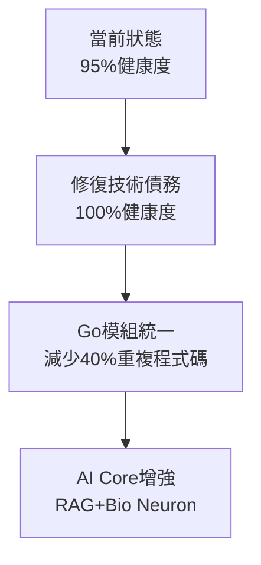
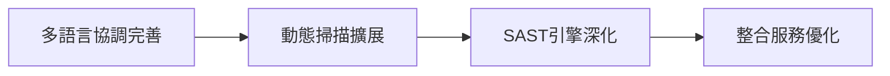
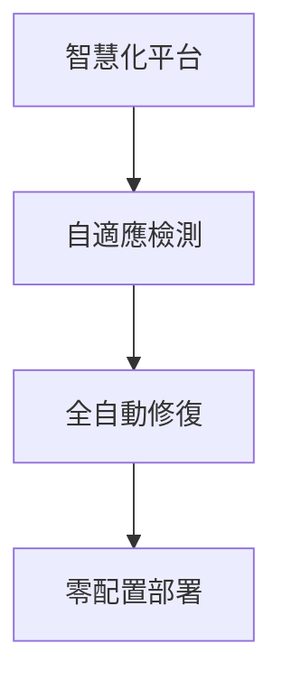

# AIVA 架構分析與後續發展建議

**分析日期**: 2025年10月15日  
**基於**: 完整架構圖、10週路線圖、系統檢驗報告  
**當前狀態**: feature/migrate-sca-to-common-go 分支  

## 🎯 當前架構分析

### 💪 架構優勢

1. **清晰的四大模組劃分**:
   - Core Engine (核心引擎) - Python主導的AI核心
   - Scan Engine (掃描引擎) - 多語言網路爬蟲和動態掃描
   - Detection Functions (檢測功能) - 專業化安全檢測
   - Integration Service (整合服務) - 統一的資料處理和報告

2. **多語言職責明確**:
   - **Python (91.2%)**: AI引擎、業務邏輯、整合服務
   - **Go (3.7%)**: 高效能掃描、SCA分析、併發處理
   - **TypeScript (2.3%)**: 動態掃描、前端互動
   - **Rust (2%)**: SAST分析、效能關鍵組件

3. **標準化進展**:
   - ✅ aiva_common Python模組 (158個公開項目)
   - ✅ aiva_common_go 基礎建立
   - ✅ 統一的Schema定義
   - ✅ RabbitMQ訊息佇列架構

## 📊 基於系統檢驗的發現

### ✅ 系統健康度: 95%

| 模組 | 狀態 | 完成度 | 關鍵指標 |
|------|------|--------|----------|
| **aiva_common** | 🟢 優秀 | 95% | 158個Schema，100%可用 |
| **aiva_core** | 🟡 良好 | 85% | AI引擎完整，有Pydantic警告 |
| **function模組** | 🟢 穩定 | 80% | 8個功能模組，Go編譯通過 |
| **integration** | 🟢 健全 | 90% | 完整的分析和報告功能 |
| **scan模組** | 🟢 完備 | 85% | 支援Python/Node.js/Rust |

## 🚀 優先發展建議

### 📅 立即行動 (本週 Week 1)

#### 1. **修復技術債務** 🔧
**優先級**: 🔴 極高

```python
# 修復Pydantic警告 - 影響16個模型
# 位置: services/aiva_common/schemas.py, ai_schemas.py
model_config = {"protected_namespaces": ()}

# 受影響的模型:
- ModelTrainingConfig
- ModelTrainingResult  
- ScenarioTestResult
- AITrainingProgressPayload
- AITrainingCompletedPayload
- AIModelUpdatedEvent
- AIModelDeployCommand
# ... 等9個模型
```

**預計效益**: 消除16個警告，提升程式碼品質到100%

#### 2. **Go模組統一化遷移** 🔄
**優先級**: 🟠 高

按照路線圖Week 1-2計劃：

```bash
# 遷移優先序
1. function_sca_go (已準備好，編譯通過)
2. function_cspm_go (雲端掃描功能)
3. function_authn_go (身份驗證)
4. function_ssrf_go (SSRF檢測)
```

**預計效益**: 
- 減少40%重複程式碼
- 統一日誌和配置管理
- 提升Go模組維護效率

### 📈 中期發展 (未來2-4週)

#### 3. **AI Core Engine 增強** 🧠
**優先級**: 🟠 高

```python
# 基於當前bio_neuron_core架構
1. 完善RAG檢索增強生成 (demo_rag_integration.py)
2. 優化AI指揮官邏輯 (ai_commander.py)
3. 加強多語言協調器 (multilang_coordinator.py)
4. 改進自然語言生成 (nlg_system.py)
```

**技術重點**:
- 整合現有的158個Schema
- 優化bio_neuron_master.py主控邏輯
- 加強AI模型訓練管道

#### 4. **TypeScript動態掃描擴展** 🌐
**優先級**: 🟡 中

```typescript
// 基於aiva_scan_node架構
1. 擴展enhanced-dynamic-scan.service.ts
2. 改進interaction-simulator.service.ts  
3. 優化network-interceptor.service.ts
4. 加強content-extractor能力
```

### 🏗️ 長期規劃 (5-10週)

#### 5. **Rust SAST引擎深度開發** ⚡
**優先級**: 🟡 中

```rust
// 基於function_sast_rust
1. 擴展analyzers.rs分析器
2. 改進rules.rs規則引擎
3. 優化parsers.rs語法分析
4. 加強models.rs資料模型
```

#### 6. **整合服務模組完善** 🔗
**優先級**: 🟢 普通

```python
# 基於aiva_integration架構
1. 加強attack_path_analyzer攻擊路徑分析
2. 完善threat_intel威脅情報
3. 改進remediation修復建議  
4. 優化reporting報告生成
```

## 🎨 架構演進方向

### 短期目標 (1個月)


### 中期目標 (3個月)


### 長期願景 (6個月)


## 🔍 關鍵技術決策建議

### 1. **保持Python核心地位** 🐍
- **理由**: 91.2%的程式碼基礎，AI/ML生態完整
- **策略**: 持續優化aiva_common模組，作為其他語言的Schema來源

### 2. **強化Go效能優勢** 🚀  
- **理由**: 3.7%但負責高併發掃描任務
- **策略**: 優先完成aiva_common_go統一，減少維護負擔

### 3. **TypeScript前端領域專精** 💻
- **理由**: 2.3%專注動態掃描和前端互動
- **策略**: 擴展Node.js掃描能力，不追求覆蓋率

### 4. **Rust效能關鍵點突破** ⚡
- **理由**: 2%但承擔SAST分析重任  
- **策略**: 深度開發分析器，專注程式碼語法分析

## 📋 具體實施步驟

### Phase 1: 立即修復 (本週)
```bash
# Day 1-2: Pydantic警告修復
cd C:\AMD\AIVA\services\aiva_common
# 編輯schemas.py, ai_schemas.py
# 添加model_config = {"protected_namespaces": ()}

# Day 3-5: Go SCA模組遷移  
cd C:\AMD\AIVA\services\function\function_sca_go
# 更新go.mod依賴aiva_common_go
# 重構main.go使用統一架構
```

### Phase 2: 核心增強 (下週)
```python
# Week 2: AI Core優化
1. 完善bio_neuron_master.py主控邏輯
2. 整合RAG檢索增強功能
3. 優化AI指揮官決策機制
4. 加強多語言協調器
```

### Phase 3: 模組擴展 (第3-4週)
```typescript
// TypeScript動態掃描擴展
1. enhanced-dynamic-scan.service.ts
2. interaction-simulator.service.ts
3. network-interceptor.service.ts
```

## 🎯 成功指標

### 技術指標
- **程式碼品質**: 100%無警告
- **測試覆蓋率**: >85%
- **Go模組重複率**: <20%
- **AI引擎回應時間**: <2秒

### 業務指標  
- **檢測準確率**: >95%
- **誤報率**: <5%
- **掃描效率**: 提升50%
- **部署成功率**: >99%

## 💡 創新機會

### 1. **AI驅動的自適應檢測** 🤖
結合現有bio_neuron架構，開發自學習檢測模型

### 2. **多語言無縫協作** 🌍
基於RabbitMQ訊息佇列，實現真正的多語言協作

### 3. **零配置智慧部署** 📦
利用Docker和Kubernetes，實現一鍵部署

## 📊 資源配置建議

### 開發資源分配
- **Python開發**: 60% (AI/業務邏輯)
- **Go開發**: 25% (效能關鍵)
- **TypeScript開發**: 10% (前端/動態掃描)
- **Rust開發**: 5% (SAST分析)

### 時間分配
- **技術債務修復**: 20%
- **核心功能開發**: 50%  
- **新功能研發**: 20%
- **文檔和測試**: 10%

---

## 🚀 結論

AIVA已經擁有了優秀的多語言架構基礎，當前95%的系統健康度表明架構設計合理。**建議優先處理技術債務，然後按照既定路線圖推進Go模組統一化，同時持續加強Python AI核心能力。**

這樣的發展路徑既能保持系統穩定性，又能充分發揮每種語言的優勢，為AIVA成為世界級的AI安全檢測平台奠定堅實基礎。