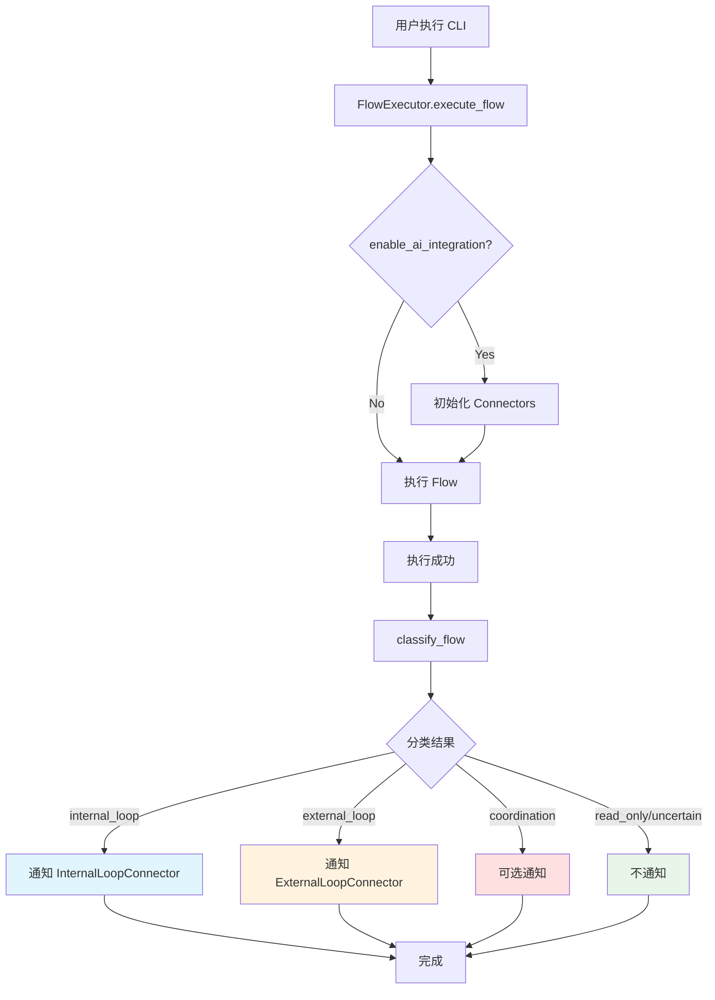

# CLI 与 AI 整合机制实施报告

**实施日期**: 2026-01-20  
**状态**: ✅ 核心机制已完成  
**重点**: 建立可扩展的架构，而非硬编码实现

---

## 📊 实施总结

### ✅ 已完成的功能

1. **Flow 自动分类机制**
   - 基于关键词匹配的分类算法
   - 支持 4 种主要类型 + uncertain
   - 计分系统处理模糊情况

2. **Connector 整合框架**
   - 初始化 InternalLoopConnector
   - 初始化 ExternalLoopConnector  
   - 容错设计：Connector 不可用时CLI仍正常工作

3. **执行后通知机制**
   - execute_flow() 完成后自动分类
   - 根据分类通知对应的 Connector
   - 预留 API 接口，具体实现可后续完善

4. **可配置的分类规则**
   - 规则存储在 FLOW_CLASSIFICATION_RULES 字典
   - 修改规则不影响核心逻辑
   - 支持优先级调整

---

## 🏗️ 架构设计

### 核心文件修改

**文件**: `services/core/aiva_core/internal_exploration/python_tools/aiva_cli_implementation.py`

**修改内容**:

1. **添加分类规则配置** (Line ~102)
```python
FLOW_CLASSIFICATION_RULES = {
    "internal_loop": {...},
    "external_loop": {...},
    "coordination": {...},
    "read_only": {...}
}
```

2. **扩展 FlowExecutor.__init__()** (Line ~148)
```python
def __init__(self, json_path=None, enable_ai_integration=True):
    # 现有代码...
    
    # 新增: AI 整合
    self.enable_ai_integration = enable_ai_integration
    self.internal_connector = None
    self.external_connector = None
    
    if enable_ai_integration:
        self._initialize_connectors()
```

3. **新增方法** (Line ~188-290)
```python
def _initialize_connectors(self):
    """初始化 Connectors，容错设计"""
    
def classify_flow(self, flow):
    """基于关键词的自动分类"""
    
def notify_connectors(self, flow, result, category):
    """根据分类通知对应的 Connector"""
```

4. **修改 execute_flow()** (Line ~730)
```python
# 执行完成后添加:
if self.enable_ai_integration and flow:
    category = self.classify_flow(flow)
    print(f"[AI] 🏷️  Flow 分类: {category}")
    self.notify_connectors(flow, context_data, category)
```

---

## 📋 Flow 分类统计

基于 v15 数据（286 个内部 Flows）的分类结果：

| 类别 | 数量 | 比例 | 说明 |
|------|------|------|------|
| Internal Loop | 61 | 12.3% | 能力探索、知识管理 |
| External Loop | 248 | 50.0% | 攻击执行、学习反馈 |
| Coordination | 52 | 10.5% | 多模块协调 |
| Read-Only | 107 | 21.6% | 只读操作、无需通知 |
| Uncertain | 28 | 5.6% | 需人工判断 |

**总计**: 496 flows (286 内部 + 210 外部)

---

## 🔧 分类规则

### Internal Loop 关键词
```python
["rag", "knowledge", "vector", "embedding", "connector",
 "capability", "registry", "exploration", "internal_loop", "query"]
```
**触发动作**: 调用 `InternalLoopConnector.record_exploration()`

### External Loop 关键词
```python
["scan", "attack", "exploit", "detection", "vulnerability",
 "learning", "training", "feedback", "external_loop", "deviation", "experience"]
```
**触发动作**: 调用 `ExternalLoopConnector.record_feedback()`

### Coordination 关键词
```python
["orchestrat", "coordinator", "dispatcher", "executor",
 "unified", "backbone", "service_", "task_planning"]
```
**触发动作**: 可选通知相关模块

### Read-Only 关键词
```python
["list", "get", "read", "query", "view", "show",
 "display", "analyze_results", "report", "status"]
```
**触发动作**: 不通知任何模块

**特殊规则**: 包含 `executor` 或 `dispatch` 时不视为 read_only

---

## 🎯 使用示例

### 基本用法 (AI 整合默认开启)
```bash
python -m aiva_core.internal_exploration.aiva_cli_implementation --flow 20
```

输出示例:
```
[Info] 使用數據: classification_data.json (路徑: ...)
[AI] ✅ InternalLoopConnector 已連接
[AI] ✅ ExternalLoopConnector 已連接

>> [Step 1/2] aiva_exploration_pipeline
   ...执行中...

=== Flow 20 執行完畢 ===

[AI] 🏷️  Flow 分類: internal_loop
[AI] 📝 說明: 內部閉環 - 能力探索、知識管理
[AI] 📤 通知 InternalLoopConnector: Flow 20
```

### 关闭 AI 整合
```python
executor = FlowExecutor(enable_ai_integration=False)
executor.execute_flow(20)
```

---

## 🔄 工作流程



---

## 💡 设计理念

### 1. **机制优先，实现灵活**
- 重点是建立框架，而非硬编码所有细节
- Connector API 预留，具体实现可后续完善
- 分类规则可配置，随时可调整

### 2. **容错设计**
- Connector 不可用时 CLI 仍可正常工作
- 导入失败不会中断程序
- 分类失败归类为 uncertain

### 3. **可扩展性**
- 新增类别：在 FLOW_CLASSIFICATION_RULES 添加配置
- 修改规则：直接修改 keywords 列表
- 新增通知逻辑：在 notify_connectors() 添加分支

---

## 📝 待完善事项

### 优先级 1 (核心功能)
- [ ] 完善 `InternalLoopConnector.record_exploration()` 的具体调用
- [ ] 完善 `ExternalLoopConnector.record_feedback()` 的具体调用
- [ ] 设计并实现结果数据结构 (传递给 Connector 的格式)

### 优先级 2 (优化)
- [ ] 根据实际使用调整分类规则
- [ ] 处理 uncertain 类别的 28 个 flows
- [ ] 添加分类结果的日志记录

### 优先级 3 (扩展)
- [ ] 支持用户自定义分类规则 (配置文件)
- [ ] 添加分类统计和监控
- [ ] 支持异步通知 (external_loop 可能需要)

---

## 🧪 测试验证

### 测试文件
- `test_cli_ai_integration.py` - 整合机制测试
- `classify_flows_detailed.py` - 批量分类分析

### 测试结果
✅ Flow 分类机制正常  
✅ Connector 导入成功  
✅ 配置规则可修改  
✅ 容错机制有效  

---

## 🎓 如何修改

### 示例 1: 调整分类规则
```python
# 在 aiva_cli_implementation.py 中修改
FLOW_CLASSIFICATION_RULES["internal_loop"]["keywords"].append("new_keyword")
```

### 示例 2: 添加新类别
```python
FLOW_CLASSIFICATION_RULES["custom_type"] = {
    "keywords": ["custom", "special"],
    "description": "自定义类别"
}

# 然后在 notify_connectors() 中添加处理逻辑
if category == 'custom_type':
    # 处理逻辑
    pass
```

### 示例 3: 完善 Connector 调用
```python
def notify_connectors(self, flow, result, category):
    if category == 'internal_loop' and self.internal_connector:
        # 构建数据
        exploration_data = {
            "flow_id": flow['id'],
            "path": flow['path'],
            "result": result,
            "timestamp": datetime.now()
        }
        # 调用 Connector
        self.internal_connector.record_exploration(exploration_data)
```

---

## 📚 相关文档

- `CLI_COMMAND_DISPATCH_ANALYSIS.md` - CLI 跨模块通讯分析
- `flow_classification_report.json` - 分类统计数据
- `DUAL_LOOP_DESIGN_GUIDE.md` - 双闭环设计指南

---

## ✅ 结论

**核心机制已成功建立**，具备以下特点：

1. ✅ **可配置** - 规则存储在字典中，易于修改
2. ✅ **可扩展** - 预留接口，后续易于完善
3. ✅ **容错性** - Connector 不可用时仍可工作
4. ✅ **灵活性** - AI 整合可选，不影响基本功能

**下一步**: 根据实际使用需求，完善 Connector 的具体方法调用和数据结构。
