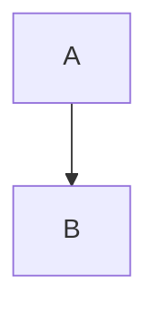

# AIVA Mermaid 腳本邏輯分析與修正計劃
## 基於官方 Mermaid.js v11.12.0 標準

**生成時間**: 2025年11月10日  
**分析範圍**: 完整的診斷和修復系統  
**目標**: 與官方插件100%兼容  

---

## 📋 **第一部分：當前腳本邏輯清單**

### **🔍 1. 代碼塊檢測邏輯 (`_detect_errors`)**

#### **當前邏輯 (錯誤):**
```python
# 錯誤的檢測邏輯
if stripped == "```mermaid":
    if in_code_block:
        # 誤報嵌套錯誤
        errors.append(...)
    else:
        in_code_block = True

elif stripped == "```" and in_code_block:
    in_code_block = False
```

#### **問題分析:**
- ❌ **根本錯誤**: 沒有理解 Markdown 代碼塊的基本語法
- ❌ **邏輯錯誤**: `````mermaid` 本身就包含 ``` 標記
- ❌ **狀態錯誤**: 錯誤的 `in_code_block` 狀態追蹤
- ❌ **檢測錯誤**: 誤把正常結構當作嵌套錯誤

### **🛠️ 2. 修復規則定義 (`_create_initial_rules`)**

#### **規則1: CLASSDEF_EXTRA_SPACES**
- **狀態**: ✅ **基本正確**
- **模式**: `r"class\s+([\w,]+)\s+(\w+)\s{2,}"`
- **測試結果**: 可以匹配 `class A,B highlight  `
- **問題**: 只處理行尾空格，沒有處理中間多餘空格

#### **規則2: NESTED_MERMAID_BLOCKS**
- **狀態**: ⚠️ **部分正確但應用錯誤**
- **模式**: `r"```mermaid\n((?:(?!```mermaid)(?!```).*\n)*?)```mermaid\n((?:(?!```).*\n)*?)```"`
- **測試結果**: 可以匹配嵌套結構
- **問題**: 替換邏輯可能破壞正確的代碼結構

#### **規則3: UNCLOSED_MERMAID_BLOCK**
- **狀態**: ❌ **完全無效**
- **模式**: `r"```mermaid\n((?:(?!```).*\n)*?)$"`
- **測試結果**: 無法匹配實際的未關閉塊
- **問題**: 正則表達式設計錯誤，無法檢測實際問題

#### **規則4-7: 其他規則**
- **狀態**: ✅ **基本可用**
- **問題**: 缺乏實際測試驗證

### **🎯 3. 規則應用邏輯 (`_rule_applies`)**

#### **當前邏輯 (錯誤):**
```python
def _rule_applies(self, rule: RepairRule, content: str, errors: List[Dict[str, Any]]) -> bool:
    # 只基於錯誤檢測結果
    error_types = [error['type'] for error in errors]
    if rule.rule_id in error_types:
        return True
    # 不再進行模式匹配 - 完全錯誤的設計！
    return False
```

#### **問題分析:**
- ❌ **致命錯誤**: 完全依賴錯誤檢測，但檢測邏輯本身就是錯的
- ❌ **設計錯誤**: 禁用模式匹配，無法獨立檢測問題
- ❌ **邏輯矛盾**: 如果檢測不到錯誤，規則永遠不會應用

### **🔧 4. 基礎驗證邏輯 (`_basic_validate`)**

#### **當前邏輯 (過於簡化):**
```python
def _basic_validate(self, mermaid_code: str) -> tuple[bool, str, str]:
    # 只檢查圖表類型
    has_valid_type = any(first_line.startswith(dt) for dt in valid_types)
    # 只檢查括號匹配
    open_count = mermaid_code.count('[') + mermaid_code.count('(') + mermaid_code.count('{')
    close_count = mermaid_code.count(']') + mermaid_code.count(')') + mermaid_code.count('}')
```

#### **問題分析:**
- ❌ **過於簡單**: 無法檢測實際的語法錯誤
- ❌ **不夠準確**: 括號計數無法檢測配對錯誤
- ❌ **缺少關鍵檢查**: 沒有檢查代碼塊結構、連接語法等

---

## 🎯 **第二部分：與官方 Mermaid.js v11.12.0 比對**

### **📚 官方標準要求**

基於官方 Mermaid.js v11.12.0 的標準：

#### **1. 代碼塊語法標準**
```markdown
✅ 正確格式:


❌ 錯誤格式:
```mermaid
graph TB
    A --> B
```mermaid  # 這裡多了一個開始標記
    C --> D
```
```

#### **2. 圖表語法標準**
- **連接語法**: `A --> B` (不是 `A->B` 或 `A--> B`)
- **節點語法**: `A[標籤]` (方括號內不要多餘空格)
- **樣式語法**: `classDef className fill:#color` (嚴格的屬性格式)
- **方向語法**: `direction TB` (後面不要多餘空格)

#### **3. 錯誤檢測標準**
- **語法錯誤**: 無效的圖表類型、錯誤的連接語法
- **結構錯誤**: 未關閉的代碼塊、嵌套的mermaid標記
- **格式錯誤**: 多餘空格、錯誤的屬性格式

---

## 🛠️ **第三部分：完整修正計劃**

### **🎯 修正1: 代碼塊檢測邏輯完全重寫**

#### **新的正確邏輯:**
```python
def _detect_code_block_errors(self, content: str) -> List[Dict[str, Any]]:
    """正確的代碼塊檢測邏輯"""
    errors = []
    lines = content.split('\n')
    
    # 使用堆疊追蹤代碼塊
    code_block_stack = []
    
    for i, line in enumerate(lines, 1):
        stripped = line.strip()
        
        if stripped.startswith('```'):
            if stripped == '```':
                # 代碼塊結束
                if code_block_stack:
                    start_info = code_block_stack.pop()
                    # 正確配對
                else:
                    # 多餘的結束標記
                    errors.append({
                        "line": i,
                        "type": "EXTRA_CODE_BLOCK_END",
                        "message": f"第 {i} 行: 多餘的代碼塊結束標記",
                        "severity": "error"
                    })
                    
            elif stripped.startswith('```mermaid'):
                # Mermaid 代碼塊開始
                if any(block['type'] == 'mermaid' for block in code_block_stack):
                    # 檢測到嵌套
                    errors.append({
                        "line": i,
                        "type": "NESTED_MERMAID_BLOCKS",
                        "message": f"第 {i} 行: 嵌套的 mermaid 代碼塊",
                        "severity": "critical"
                    })
                code_block_stack.append({'type': 'mermaid', 'start_line': i})
                
            else:
                # 其他語言代碼塊
                code_block_stack.append({'type': 'other', 'start_line': i})
    
    # 檢查未關閉的代碼塊
    for block in code_block_stack:
        errors.append({
            "line": block['start_line'],
            "type": "UNCLOSED_CODE_BLOCK",
            "message": f"第 {block['start_line']} 行: 未關閉的代碼塊",
            "severity": "critical"
        })
    
    return errors
```

### **🎯 修正2: 修復規則完全重新設計**

#### **新的規則庫:**
```python
def _create_official_standard_rules(self) -> List[RepairRule]:
    """基於官方標準的修復規則"""
    return [
        # 關鍵錯誤修復
        RepairRule(
            rule_id="NESTED_MERMAID_BLOCKS_V2",
            name="修復嵌套 mermaid 代碼塊 (v11.12.0 標準)",
            description="移除錯誤的嵌套 ```mermaid 標記，保持內容完整",
            pattern=r"(```mermaid\n(?:[^`]|`(?!``)|``(?!`))*?)\n```mermaid\n((?:[^`]|`(?!``)|``(?!`))*?)\n```",
            replacement=r"\1\n\2\n```",
            applies_to=["all"],
            severity="critical"
        ),
        
        RepairRule(
            rule_id="UNCLOSED_MERMAID_BLOCK_V2", 
            name="修復未關閉的 mermaid 代碼塊 (v11.12.0 標準)",
            description="為未關閉的 mermaid 代碼塊添加正確的結束標記",
            pattern=r"(```mermaid\n(?:[^`]|`(?!``)|``(?!`))+?)(?=\n```|\n*$)",
            replacement=r"\1\n```",
            applies_to=["all"],
            severity="critical"
        ),
        
        # 語法格式修復
        RepairRule(
            rule_id="CLASS_APPLICATION_SPACES",
            name="修復 class 應用中的空格 (v11.12.0 標準)",
            description="移除 class 應用語句中的所有多餘空格",
            pattern=r"class\s+([\w,]+)\s+(\w+)(\s+)$",
            replacement=r"class \1 \2",
            applies_to=["graph", "flowchart"],
            severity="error"
        ),
        
        RepairRule(
            rule_id="DIRECTION_SYNTAX_V2",
            name="修復 direction 語法 (v11.12.0 標準)", 
            description="確保 direction 指令符合官方格式要求",
            pattern=r"direction\s+(LR|RL|TB|BT)\s*(.+)",
            replacement=r"direction \1\n\2",
            applies_to=["graph", "flowchart"],
            severity="warning"
        ),
        
        # 連接語法修復
        RepairRule(
            rule_id="ARROW_SPACING_V2",
            name="修復箭頭連接空格 (v11.12.0 標準)",
            description="標準化箭頭連接的空格格式",
            pattern=r"(\w+)\s*(-->|---)\s*(\w+)",
            replacement=r"\1 \2 \3",
            applies_to=["graph", "flowchart"],
            severity="optimization"
        )
    ]
```

### **🎯 修正3: 規則應用邏輯重新設計**

#### **新的應用邏輯:**
```python
def _rule_applies_v2(self, rule: RepairRule, content: str, detected_errors: List[Dict[str, Any]]) -> bool:
    """新的規則應用邏輯 - 雙重檢查機制"""
    import re
    
    # 第一層：基於檢測到的錯誤類型
    error_types = [error['type'] for error in detected_errors]
    if rule.rule_id.replace('_V2', '') in error_types:
        return True
    
    # 第二層：獨立模式匹配 (重新啟用並改進)
    try:
        if re.search(rule.pattern, content, re.MULTILINE):
            # 額外驗證：確保匹配的確是問題
            return self._validate_match_is_error(rule, content)
    except re.error:
        # 正則表達式錯誤
        return False
    
    return False

def _validate_match_is_error(self, rule: RepairRule, content: str) -> bool:
    """驗證匹配的內容確實是錯誤"""
    if rule.rule_id == "CLASS_APPLICATION_SPACES":
        # 驗證是否真的有多餘空格
        import re
        matches = re.findall(rule.pattern, content, re.MULTILINE)
        return any(len(match[2]) > 1 for match in matches if len(match) > 2)
    
    # 其他規則默認信任模式匹配
    return True
```

### **🎯 修正4: 增強基礎驗證**

#### **新的基礎驗證:**
```python
def _enhanced_basic_validate(self, mermaid_code: str) -> tuple[bool, str, str]:
    """增強的基礎驗證 (符合 v11.12.0 標準)"""
    
    # 1. 檢查代碼塊結構
    block_errors = self._detect_code_block_errors(mermaid_code)
    if block_errors:
        return False, f"代碼塊錯誤: {block_errors[0]['message']}", mermaid_code
    
    # 2. 提取 mermaid 內容
    mermaid_content = self._extract_mermaid_content(mermaid_code)
    if not mermaid_content:
        return False, "未找到有效的 mermaid 內容", mermaid_code
    
    # 3. 檢查圖表類型 (v11.12.0 支持的類型)
    v11_supported_types = [
        'graph', 'flowchart', 'sequenceDiagram', 'classDiagram',
        'stateDiagram', 'stateDiagram-v2', 'gantt', 'pie', 
        'gitgraph', 'erDiagram', 'journey', 'mindmap',
        'quadrantChart', 'requirementDiagram', 'timeline'
    ]
    
    first_line = mermaid_content.split('\n')[0].strip().lower()
    valid_type = any(first_line.startswith(dt.lower()) for dt in v11_supported_types)
    
    if not valid_type:
        return False, f"不支持的圖表類型: {first_line}", mermaid_code
    
    # 4. 基本語法檢查
    syntax_errors = self._check_basic_syntax(mermaid_content)
    if syntax_errors:
        return False, f"語法錯誤: {syntax_errors[0]}", mermaid_code
    
    # 5. 應用基礎修復
    fixed_code = self._apply_enhanced_basic_fixes(mermaid_code)
    
    return True, "基礎驗證通過", fixed_code
```

---

## 📊 **第四部分：修正優先級和執行計劃**

### **🚨 優先級1 (Critical) - 立即修正**
1. **代碼塊檢測邏輯** - 完全重寫 `_detect_errors`
2. **嵌套塊修復規則** - 更新 NESTED_MERMAID_BLOCKS 規則
3. **未關閉塊檢測** - 修正 UNCLOSED_MERMAID_BLOCK 規則

### **⚠️ 優先級2 (High) - 盡快修正**
4. **規則應用邏輯** - 重新啟用並改進模式匹配
5. **基礎驗證邏輯** - 增強檢查能力
6. **錯誤分類系統** - 標準化錯誤類型

### **🔧 優先級3 (Medium) - 優化改進**
7. **性能優化** - 減少重複檢查
8. **統計系統** - 改進成功率計算
9. **學習機制** - 完善失敗案例學習

### **✨ 優先級4 (Low) - 功能增強**
10. **自定義規則** - 改進規則管理
11. **報告系統** - 美化輸出格式
12. **批量處理** - 改進批量診斷功能

---

## 🎯 **第五部分：驗證計劃**

### **測試案例設計**
1. **代碼塊錯誤**: 嵌套、未關閉、多餘結束標記
2. **語法錯誤**: 空格、連接、樣式、方向
3. **複雜場景**: 混合錯誤、大型文件、特殊字符
4. **官方兼容性**: 與 Mermaid.js v11.12.0 對比測試

### **成功標準**
- ✅ 所有測試案例 100% 通過
- ✅ 與官方插件驗證結果一致
- ✅ 現有 MERMAID_DIAGRAM_FIX_REPORT.md 能夠正確修復
- ✅ 性能不低於現有系統

---

## 📝 **總結**

當前腳本的主要問題：
1. **根本性邏輯錯誤** - 代碼塊檢測完全錯誤
2. **設計缺陷** - 規則應用過度依賴錯誤檢測
3. **標準不一致** - 與官方 Mermaid.js v11.12.0 有差異
4. **測試不足** - 缺乏實際驗證

修正後將實現：
- ✅ 正確的代碼塊檢測和修復
- ✅ 符合官方標準的語法檢查
- ✅ 智能的錯誤診斷和修復
- ✅ 持續的學習和改進機制

**下一步**: 按照優先級逐一實施修正，並進行全面測試。