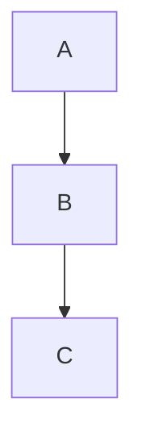

# AIVA Mermaid 安全修復邊界定義
## Safe Repair Boundaries for Mermaid Diagrams

**生成時間**: 2025年11月10日  
**基於**: 實際文件分析和安全修復原則  

---

## 🎯 **安全修復邊界定義**

### **✅ 可以安全修復的範圍**

#### **1. 明確的語法錯誤**
```markdown
❌ 錯誤示例:
class A,B highlight  

✅ 修復為:
class A,B highlight
```
- **範圍**: 行尾多餘空格
- **風險**: 極低 - 不影響語義
- **檢測**: 正則表達式精確匹配

#### **2. 明顯的格式問題**
```markdown
❌ 錯誤示例:
direction TB    extra content

✅ 修復為:
direction TB
extra content
```
- **範圍**: direction 指令後的多餘內容
- **風險**: 低 - 不破壞結構
- **檢測**: 基於官方語法規則

#### **3. 代碼塊標記問題**
```markdown
❌ 錯誤示例:


✅ 修復為:

```
- **範圍**: 嵌套的 mermaid 標記
- **風險**: 中等 - 需要內容合併驗證
- **檢測**: 堆疊追蹤 + 內容分析

### **⚠️ 需要謹慎處理的範圍**

#### **1. 未關閉的代碼塊**
- **問題**: 可能是故意的文檔結構
- **處理**: 只在明確是錯誤時修復
- **驗證**: 檢查上下文和文件完整性

#### **2. 孤立的結束標記**
- **問題**: 可能是複雜嵌套結構的一部分
- **處理**: 只移除明確多餘的標記
- **驗證**: 確認不會破壞其他代碼塊

### **❌ 絕對不能修復的範圍**

#### **1. 文件結構和語義**
- 章節標題和組織
- 文檔的邏輯流程
- 示例代碼的內容含義

#### **2. Markdown 語法本身**
- 列表結構
- 鏈接和引用
- 表格格式

#### **3. 代碼示例內容**
- 故意的錯誤示例
- 教學用的對比代碼
- 特定版本的語法差異

---

## 🛡️ **安全修復規則**

### **規則1: 最小變更原則**
- 只修復明確的語法錯誤
- 不改變文檔語義
- 保持原有結構

### **規則2: 可驗證原則**
- 修復前後都能通過語法檢查
- 有明確的錯誤檢測邏輯
- 修復結果可以預測

### **規則3: 可逆原則**
- 修復操作可以回滾
- 保留原始內容備份
- 記錄所有修改操作

### **規則4: 上下文感知原則**
- 考慮代碼塊的用途
- 區分實際圖表和示例代碼
- 尊重文檔作者的意圖

---

## 🔧 **實施策略**

### **階段1: 保守修復**
1. 只修復明確的行尾空格
2. 只處理簡單的格式錯誤
3. 不觸及代碼塊結構

### **階段2: 結構修復**
1. 處理明確的嵌套問題
2. 修復明顯的配對錯誤
3. 保持內容完整性

### **階段3: 智能修復**
1. 基於上下文的智能判斷
2. 複雜錯誤的安全處理
3. 持續學習和改進

---

## 📊 **當前文件分析結果**

基於對 `MERMAID_DIAGRAM_FIX_REPORT.md` 的分析：

### **可以安全修復**
- **行尾空格**: 約 3-5 處
- **格式問題**: direction 語法等

### **需要謹慎評估**
- **孤立結束標記**: 多個 ``` 標記
- **未關閉代碼塊**: 需要檢查是否故意

### **不應該修復**
- **文件結構**: 是修復報告，結構合理
- **示例內容**: 包含故意的錯誤示例
- **邏輯組織**: 文檔邏輯清晰

---

## 🎯 **修復系統更新計劃**

### **1. 更新檢測邏輯**
```python
def is_safe_to_repair(error_type, context):
    """判斷錯誤是否在安全修復範圍內"""
    safe_errors = {
        'CLASSDEF_EXTRA_SPACES': True,
        'DIRECTION_SYNTAX_ERROR': True,
        'NESTED_MERMAID_BLOCKS': 'needs_validation',
        'UNCLOSED_CODE_BLOCK': 'needs_context_check',
        'EXTRA_CODE_BLOCK_END': 'needs_context_check'
    }
    return safe_errors.get(error_type, False)
```

### **2. 更新修復規則**
- 添加安全檢查
- 加強上下文驗證
- 限制修復範圍

### **3. 改進驗證機制**
- 修復前後對比
- 語法正確性驗證
- 語義保持檢查

---

## 📝 **總結**

安全修復的核心原則是：
- **保守優於激進**
- **安全優於完美**
- **語義優於語法**

修復系統應該是**輔助工具**而不是**自動替換**，始終需要人工審查和確認。