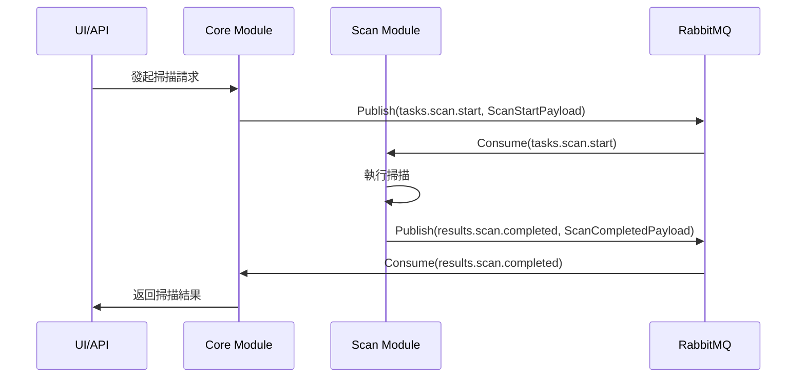
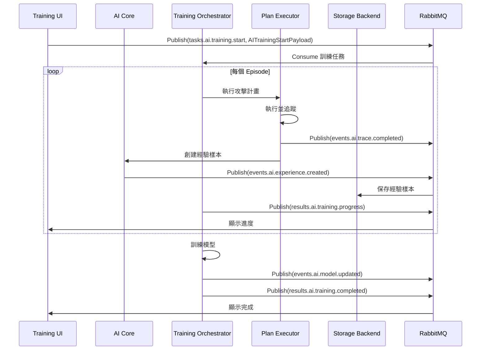
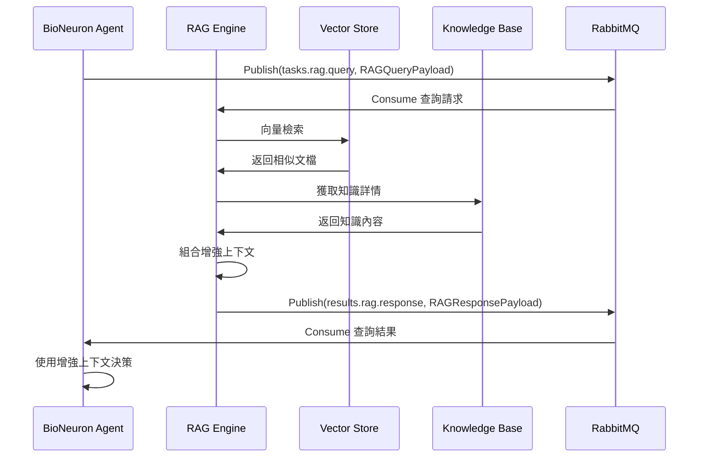
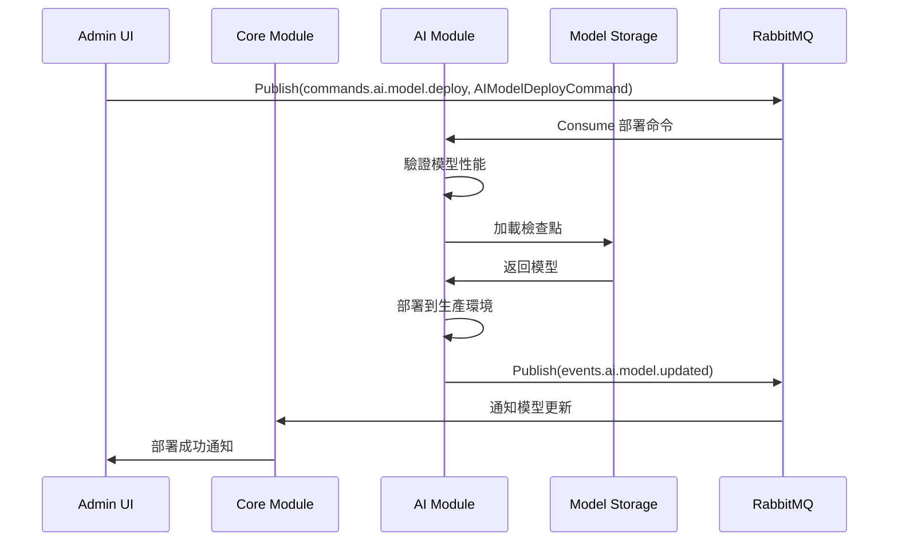

# AIVA 模組間通訊合約完整清單

本文檔列出了 AIVA 系統中所有模組之間的通訊合約（Contracts），包括消息格式、Topic 定義和數據流向。

---

## 📋 目錄

1. [核心消息結構](#核心消息結構)
2. [Topic 枚舉](#topic-枚舉)
3. [掃描模組合約](#掃描模組合約)
4. [功能測試模組合約](#功能測試模組合約)
5. [AI 訓練模組合約](#ai-訓練模組合約)
6. [RAG 知識庫合約](#rag-知識庫合約)
7. [統一通訊包裝器](#統一通訊包裝器)
8. [完整通訊流程圖](#完整通訊流程圖)

---

## 核心消息結構

### `MessageHeader`

所有消息的標準頭部：

```python
class MessageHeader(BaseModel):
    message_id: str          # 消息唯一 ID
    trace_id: str            # 追蹤 ID (用於關聯相關消息)
    correlation_id: str | None  # 關聯 ID (用於請求-響應配對)
    source_module: ModuleName   # 來源模組
    timestamp: datetime      # 時間戳
    version: str = "1.0"     # 消息版本
```

### `AivaMessage`

標準消息包裝：

```python
class AivaMessage(BaseModel):
    header: MessageHeader    # 消息頭
    topic: Topic            # 消息主題
    schema_version: str     # Schema 版本
    payload: dict[str, Any] # 消息載荷（具體內容）
```

---

## Topic 枚舉

### 掃描相關 Topics

| Topic | 方向 | 用途 |
|-------|------|------|
| `tasks.scan.start` | Core → Scan | 啟動掃描任務 |
| `results.scan.completed` | Scan → Core | 掃描完成結果 |

### 功能測試 Topics

| Topic | 方向 | 用途 |
|-------|------|------|
| `tasks.function.start` | Core → Function | 啟動功能測試 |
| `tasks.function.xss` | Core → Function | XSS 測試 |
| `tasks.function.sqli` | Core → Function | SQL 注入測試 |
| `tasks.function.ssrf` | Core → Function | SSRF 測試 |
| `tasks.function.idor` | Core → Function | IDOR 測試 |
| `results.function.completed` | Function → Core | 功能測試完成 |

### AI 訓練 Topics

| Topic | 方向 | 用途 |
|-------|------|------|
| `tasks.ai.training.start` | UI/Core → AI | 啟動訓練會話 |
| `tasks.ai.training.episode` | Orchestrator → AI | 執行單個訓練回合 |
| `tasks.ai.training.stop` | UI/Core → AI | 停止訓練 |
| `results.ai.training.progress` | AI → UI/Core | 訓練進度報告 |
| `results.ai.training.completed` | AI → UI/Core | 訓練完成 |
| `results.ai.training.failed` | AI → UI/Core | 訓練失敗 |

### AI 事件 Topics

| Topic | 方向 | 用途 |
|-------|------|------|
| `events.ai.experience.created` | AI → Storage | 新經驗樣本創建 |
| `events.ai.trace.completed` | AI → Storage | 執行追蹤完成 |
| `events.ai.model.updated` | AI → Core | 模型更新通知 |

### AI 命令 Topics

| Topic | 方向 | 用途 |
|-------|------|------|
| `commands.ai.model.deploy` | Core → AI | 部署模型命令 |

### RAG Topics

| Topic | 方向 | 用途 |
|-------|------|------|
| `tasks.rag.knowledge.update` | Any → RAG | 更新知識庫 |
| `tasks.rag.query` | Any → RAG | 查詢知識庫 |
| `results.rag.response` | RAG → Requester | 查詢結果 |

### 通用 Topics

| Topic | 方向 | 用途 |
|-------|------|------|
| `findings.detected` | Any → Core | 漏洞發現通知 |
| `log.results.all` | Any → Logger | 日誌記錄 |
| `status.task.update` | Any → Monitor | 任務狀態更新 |
| `module.heartbeat` | Any → Monitor | 模組心跳 |
| `command.task.cancel` | Core → Any | 取消任務 |
| `config.global.update` | Core → All | 配置更新 |

---

## 掃描模組合約

### ✅ 已實現

#### `ScanStartPayload`

**Topic**: `tasks.scan.start`
**流向**: Core → Scan Module

```python
class ScanStartPayload(BaseModel):
    scan_id: str                    # 掃描 ID
    targets: list[HttpUrl]          # 目標 URL 列表
    scope: ScanScope                # 掃描範圍
    authentication: Authentication  # 認證信息
    strategy: str = "deep"          # 掃描策略
    rate_limit: RateLimit           # 速率限制
    custom_headers: dict[str, str]  # 自定義 HTTP 頭
    x_forwarded_for: str | None     # X-Forwarded-For
```

#### `ScanCompletedPayload`

**Topic**: `results.scan.completed`
**流向**: Scan Module → Core

```python
class ScanCompletedPayload(BaseModel):
    scan_id: str                # 掃描 ID
    status: str                 # 狀態
    assets: list[Asset]         # 發現的資產
    summary: Summary            # 摘要統計
    duration_seconds: float     # 執行時間
    metadata: dict[str, Any]    # 元數據
```

---

## 功能測試模組合約

### ✅ 已實現

#### `FunctionTaskPayload`

**Topic**: `tasks.function.*`
**流向**: Core → Function Module

```python
class FunctionTaskPayload(BaseModel):
    task_id: str                    # 任務 ID
    scan_id: str                    # 關聯的掃描 ID
    module: str                     # 模組名稱
    test_type: str                  # 測試類型
    targets: list[dict[str, Any]]   # 測試目標
    config: dict[str, Any]          # 配置
    metadata: dict[str, Any]        # 元數據
```

#### `FindingPayload`

**Topic**: `findings.detected`
**流向**: Function Module → Core

```python
class FindingPayload(BaseModel):
    finding_id: str                 # 漏洞 ID
    task_id: str                    # 關聯任務 ID
    scan_id: str                    # 關聯掃描 ID
    vulnerability_type: VulnerabilityType  # 漏洞類型
    severity: Severity              # 嚴重程度
    confidence: Confidence          # 可信度
    target: Target                  # 目標信息
    evidence: FindingEvidence       # 證據
    impact: FindingImpact           # 影響
    recommendation: FindingRecommendation  # 修復建議
    metadata: dict[str, Any]        # 元數據
```

---

## AI 訓練模組合約

### ✅ 新增完成

#### `AITrainingStartPayload`

**Topic**: `tasks.ai.training.start`
**流向**: UI/Core → AI Training Module

```python
class AITrainingStartPayload(BaseModel):
    training_id: str                        # 訓練會話 ID (必須以 training_ 開頭)
    training_type: str                      # 訓練類型: single|batch|continuous|scenario
    scenario_id: str | None                 # 靶場場景 ID (可選)
    target_vulnerability: str | None        # 目標漏洞類型 (可選)
    config: ModelTrainingConfig             # 訓練配置
    metadata: dict[str, Any]                # 元數據
```

**使用示例**:

```python
msg = AivaMessage(
    header=MessageHeader(
        message_id="msg_001",
        trace_id="trace_001",
        source_module=ModuleName.CORE,
    ),
    topic=Topic.TASK_AI_TRAINING_START,
    payload=AITrainingStartPayload(
        training_id="training_20250114_001",
        training_type="batch",
        scenario_id="SQLI-1",
        target_vulnerability="sqli",
        config=ModelTrainingConfig(
            episodes=100,
            learning_rate=0.001,
            gamma=0.99
        )
    ).model_dump()
)
```

#### `AITrainingProgressPayload`

**Topic**: `results.ai.training.progress`
**流向**: AI Training Module → UI/Core

```python
class AITrainingProgressPayload(BaseModel):
    training_id: str                    # 訓練會話 ID
    episode_number: int                 # 當前回合數
    total_episodes: int                 # 總回合數
    successful_episodes: int = 0        # 成功回合數
    failed_episodes: int = 0            # 失敗回合數
    total_samples: int = 0              # 總樣本數
    high_quality_samples: int = 0       # 高質量樣本數
    avg_reward: float | None            # 平均獎勵
    avg_quality: float | None           # 平均質量分數
    best_reward: float | None           # 最佳獎勵
    model_metrics: dict[str, float]     # 模型指標
    status: str = "running"             # 狀態
    metadata: dict[str, Any]            # 元數據
    timestamp: datetime                 # 時間戳
```

#### `AITrainingCompletedPayload`

**Topic**: `results.ai.training.completed`
**流向**: AI Training Module → UI/Core

```python
class AITrainingCompletedPayload(BaseModel):
    training_id: str                    # 訓練會話 ID
    status: str                         # 最終狀態: completed|failed|cancelled
    total_episodes: int                 # 總回合數
    successful_episodes: int            # 成功回合數
    failed_episodes: int                # 失敗回合數
    total_duration_seconds: float       # 總訓練時間
    total_samples: int                  # 總樣本數
    high_quality_samples: int           # 高質量樣本數
    medium_quality_samples: int         # 中質量樣本數
    low_quality_samples: int            # 低質量樣本數
    final_avg_reward: float | None      # 最終平均獎勵
    final_avg_quality: float | None     # 最終平均質量
    best_episode_reward: float | None   # 最佳回合獎勵
    model_checkpoint_path: str | None   # 模型檢查點路徑
    model_metrics: dict[str, float]     # 模型指標
    error_message: str | None           # 錯誤信息（如果失敗）
    metadata: dict[str, Any]            # 元數據
    completed_at: datetime              # 完成時間
```

#### `AIExperienceCreatedEvent`

**Topic**: `events.ai.experience.created`
**流向**: AI Module → Storage/Monitor

```python
class AIExperienceCreatedEvent(BaseModel):
    experience_id: str                  # 經驗樣本 ID
    training_id: str | None             # 關聯的訓練會話 ID
    trace_id: str                       # 執行追蹤 ID
    vulnerability_type: str             # 漏洞類型
    quality_score: float                # 質量分數 (0.0-1.0)
    success: bool                       # 執行是否成功
    plan_summary: dict[str, Any]        # 計畫摘要
    result_summary: dict[str, Any]      # 結果摘要
    metadata: dict[str, Any]            # 元數據
    timestamp: datetime                 # 時間戳
```

#### `AITraceCompletedEvent`

**Topic**: `events.ai.trace.completed`
**流向**: AI Module → Storage/Monitor

```python
class AITraceCompletedEvent(BaseModel):
    trace_id: str                       # 追蹤 ID
    session_id: str | None              # 會話 ID
    training_id: str | None             # 訓練會話 ID
    total_steps: int                    # 總步驟數
    successful_steps: int               # 成功步驟數
    failed_steps: int                   # 失敗步驟數
    duration_seconds: float             # 執行時間
    final_success: bool                 # 最終是否成功
    plan_type: str                      # 計畫類型
    metadata: dict[str, Any]            # 元數據
    timestamp: datetime                 # 時間戳
```

#### `AIModelUpdatedEvent`

**Topic**: `events.ai.model.updated`
**流向**: AI Module → Core/Monitor

```python
class AIModelUpdatedEvent(BaseModel):
    model_id: str                       # 模型 ID
    model_version: str                  # 模型版本
    training_id: str | None             # 訓練會話 ID
    update_type: str                    # 更新類型: checkpoint|deployment|fine_tune|architecture
    performance_metrics: dict[str, float]  # 性能指標
    model_path: str | None              # 模型文件路徑
    checkpoint_path: str | None         # 檢查點路徑
    is_deployed: bool = False           # 是否已部署
    metadata: dict[str, Any]            # 元數據
    timestamp: datetime                 # 時間戳
```

#### `AIModelDeployCommand`

**Topic**: `commands.ai.model.deploy`
**流向**: Core → AI Module

```python
class AIModelDeployCommand(BaseModel):
    model_id: str                       # 模型 ID
    model_version: str                  # 模型版本
    checkpoint_path: str                # 檢查點路徑
    deployment_target: str = "production"  # 部署目標: production|staging|testing
    deployment_config: dict[str, Any]   # 部署配置
    require_validation: bool = True     # 是否需要驗證
    min_performance_threshold: dict[str, float]  # 最低性能閾值
    metadata: dict[str, Any]            # 元數據
```

---

## RAG 知識庫合約

### ✅ 新增完成

#### `RAGKnowledgeUpdatePayload`

**Topic**: `tasks.rag.knowledge.update`
**流向**: Any → RAG Module

```python
class RAGKnowledgeUpdatePayload(BaseModel):
    knowledge_type: str                 # 知識類型: vulnerability|payload|technique|scenario|experience|cve|mitre
    content: str                        # 知識內容
    source_id: str | None               # 知識來源 ID
    category: str | None                # 類別
    tags: list[str]                     # 標籤
    related_cve: str | None             # 相關 CVE
    related_cwe: str | None             # 相關 CWE
    mitre_techniques: list[str]         # MITRE ATT&CK 技術
    confidence: float = 1.0             # 可信度 (0.0-1.0)
    metadata: dict[str, Any]            # 元數據
```

#### `RAGQueryPayload`

**Topic**: `tasks.rag.query`
**流向**: Any → RAG Module

```python
class RAGQueryPayload(BaseModel):
    query_id: str                       # 查詢 ID
    query_text: str                     # 查詢文本
    top_k: int = 5                      # 返回前 K 個結果 (1-100)
    min_similarity: float = 0.5         # 最小相似度 (0.0-1.0)
    knowledge_types: list[str] | None   # 限制知識類型
    categories: list[str] | None        # 限制類別
    metadata: dict[str, Any]            # 元數據
```

#### `RAGResponsePayload`

**Topic**: `results.rag.response`
**流向**: RAG Module → Requester

```python
class RAGResponsePayload(BaseModel):
    query_id: str                       # 查詢 ID
    results: list[dict[str, Any]]       # 檢索結果列表
    total_results: int                  # 總結果數
    avg_similarity: float | None        # 平均相似度
    enhanced_context: str | None        # 增強的上下文（組合所有結果）
    metadata: dict[str, Any]            # 元數據
    timestamp: datetime                 # 時間戳
```

---

## 統一通訊包裝器

### ✅ 新增完成

為了更好地支持請求-響應模式和命令模式，我們提供了統一的包裝器：

#### `AIVARequest`

用於請求-響應模式：

```python
class AIVARequest(BaseModel):
    request_id: str                     # 請求 ID
    source_module: ModuleName           # 來源模組
    target_module: ModuleName           # 目標模組
    request_type: str                   # 請求類型標識
    payload: dict[str, Any]             # 請求載荷
    trace_id: str | None                # 追蹤 ID
    timeout_seconds: int = 30           # 超時時間 (1-300秒)
    metadata: dict[str, Any]            # 元數據
    timestamp: datetime                 # 時間戳
```

#### `AIVAResponse`

請求的響應：

```python
class AIVAResponse(BaseModel):
    request_id: str                     # 對應的請求 ID
    response_type: str                  # 響應類型標識
    success: bool                       # 是否成功
    payload: dict[str, Any] | None      # 響應載荷
    error_code: str | None              # 錯誤代碼
    error_message: str | None           # 錯誤信息
    metadata: dict[str, Any]            # 元數據
    timestamp: datetime                 # 時間戳
```

#### `AIVAEvent`

事件通知：

```python
class AIVAEvent(BaseModel):
    event_id: str                       # 事件 ID
    event_type: str                     # 事件類型標識
    source_module: ModuleName           # 來源模組
    payload: dict[str, Any]             # 事件載荷
    trace_id: str | None                # 追蹤 ID
    metadata: dict[str, Any]            # 元數據
    timestamp: datetime                 # 時間戳
```

#### `AIVACommand`

命令消息：

```python
class AIVACommand(BaseModel):
    command_id: str                     # 命令 ID
    command_type: str                   # 命令類型標識
    source_module: ModuleName           # 來源模組
    target_module: ModuleName           # 目標模組
    payload: dict[str, Any]             # 命令載荷
    priority: int = 0                   # 優先級 (0-10)
    trace_id: str | None                # 追蹤 ID
    metadata: dict[str, Any]            # 元數據
    timestamp: datetime                 # 時間戳
```

---

## 完整通訊流程圖

### 1. 掃描流程



### 2. AI 訓練流程



### 3. RAG 知識查詢流程



### 4. 模型部署流程



---

## ✅ 完成度檢查清單

### 核心通訊

- [x] `MessageHeader` - 標準消息頭
- [x] `AivaMessage` - 標準消息包裝
- [x] `Topic` 枚舉 - 所有消息主題

### 掃描模組

- [x] `ScanStartPayload` - 掃描啟動
- [x] `ScanCompletedPayload` - 掃描完成
- [x] `Asset` - 資產信息
- [x] `Summary` - 掃描摘要

### 功能測試模組

- [x] `FunctionTaskPayload` - 功能測試任務
- [x] `FindingPayload` - 漏洞發現
- [x] `EnhancedVulnerability` - 增強漏洞信息（含 CVSS、CVE、CWE、MITRE）
- [x] `FindingEvidence` - 漏洞證據
- [x] `FindingImpact` - 漏洞影響
- [x] `FindingRecommendation` - 修復建議

### AI 訓練模組

- [x] `AITrainingStartPayload` - 訓練啟動
- [x] `AITrainingProgressPayload` - 訓練進度
- [x] `AITrainingCompletedPayload` - 訓練完成
- [x] `AIExperienceCreatedEvent` - 經驗樣本創建事件
- [x] `AITraceCompletedEvent` - 追蹤完成事件
- [x] `AIModelUpdatedEvent` - 模型更新事件
- [x] `AIModelDeployCommand` - 模型部署命令

### RAG 知識庫

- [x] `RAGKnowledgeUpdatePayload` - 知識更新
- [x] `RAGQueryPayload` - 知識查詢
- [x] `RAGResponsePayload` - 查詢響應

### 統一包裝器

- [x] `AIVARequest` - 統一請求
- [x] `AIVAResponse` - 統一響應
- [x] `AIVAEvent` - 統一事件
- [x] `AIVACommand` - 統一命令

### 已有的強化學習 Schemas

- [x] `AttackPlan` - 攻擊計畫（含 MITRE ATT&CK 映射）
- [x] `AttackResult` - 攻擊結果（含 CVSS 評分）
- [x] `TraceRecord` - 執行追蹤記錄
- [x] `TraceStep` - 追蹤步驟
- [x] `ExperienceSample` - 經驗樣本
- [x] `PlanExecutionMetrics` - 執行指標
- [x] `ModelTrainingConfig` - 訓練配置
- [x] `CVSSv3Metrics` - CVSS v3.1 評分
- [x] `CWEReference` - CWE 參考
- [x] `CVEReference` - CVE 參考
- [x] `SARIFResult` - SARIF 格式支持

---

## 📊 統計

- **總 Topic 數量**: 30+
- **總 Payload Schema 數量**: 50+
- **支持的模組**: Core, Scan, Function, AI, RAG, Storage, Monitor
- **支持的語言**: Python, Go, TypeScript, Rust
- **消息格式**: 統一的 JSON 格式，符合 Pydantic Schema

---

## 🔧 使用建議

1. **使用標準 `AivaMessage` 包裝**: 所有模組間消息都應使用 `AivaMessage` 包裝
2. **填充 `trace_id`**: 用於追蹤跨模組的消息流
3. **使用對應的 Payload**: 根據 Topic 使用正確的 Payload Schema
4. **處理錯誤**: 使用 `AIVAResponse` 的 `error_code` 和 `error_message`
5. **設置超時**: 使用 `AIVARequest` 的 `timeout_seconds` 控制超時
6. **優先級控制**: 使用 `AIVACommand` 的 `priority` 控制命令優先級

---

## 📝 更新日誌

- **2025-10-14**: 添加完整的 AI 訓練、RAG、統一包裝器合約
- **2025-10-13**: 增強漏洞發現合約，添加 CVSS、CVE、CWE、MITRE 支持
- **2025-10-12**: 添加強化學習相關 Schemas
- **Earlier**: 核心掃描和功能測試合約

---

## 📚 相關文檔

- [schemas.py](/workspaces/AIVA/services/aiva_common/schemas.py) - 完整 Schema 定義
- [enums.py](/workspaces/AIVA/services/aiva_common/enums.py) - 所有枚舉定義
- [AI_SYSTEM_OVERVIEW.md](/workspaces/AIVA/AI_SYSTEM_OVERVIEW.md) - AI 系統概覽
- [DATA_STORAGE_GUIDE.md](/workspaces/AIVA/DATA_STORAGE_GUIDE.md) - 數據存儲指南
