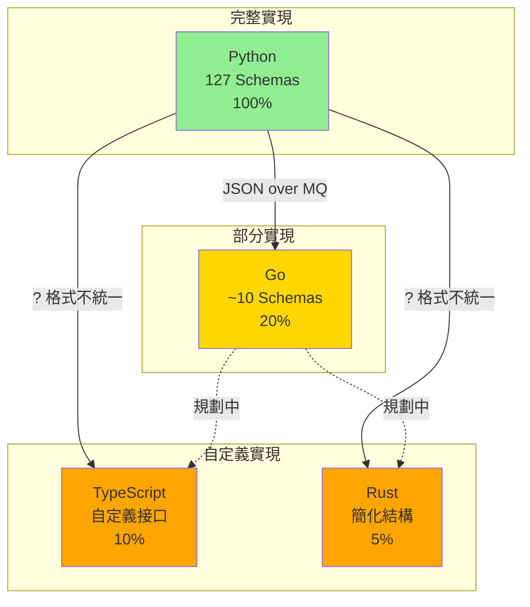

# AIVA 多語言程式合約實現狀況報告

**生成時間**: 2025年10月15日  
**驗證狀態**: ⚠️ 部分完成  
**當前分支**: feature/migrate-sca-to-common-go

---

## 📊 執行摘要

### 語言使用統計

| 語言 | 文件數量 | 主要用途 | 共用庫狀態 |
|------|---------|----------|-----------|
| **Python** | 263 | 核心邏輯、AI訓練、大部分功能模組 | ✅ 完整 |
| **TypeScript** | 984 | 動態掃描、前端相關 | ⚠️ 無共用庫 |
| **Go** | 18 | 高性能功能測試 (認證、SSRF等) | ⚠️ 部分完成 |
| **Rust** | 20 | SAST 靜態分析 | ⚠️ 無共用庫 |

### 合約實現完整度

| 語言 | 核心合約 | 掃描合約 | 功能測試合約 | AI合約 | RAG合約 | 完整度 |
|------|---------|---------|------------|--------|---------|--------|
| **Python** | ✅ 127類 | ✅ 完整 | ✅ 完整 | ✅ 完整 | ✅ 完整 | 100% |
| **Go** | ⚠️ 部分 | ❌ 缺失 | ⚠️ 部分 | ❌ 缺失 | ❌ 缺失 | ~20% |
| **TypeScript** | ⚠️ 自定義 | ⚠️ 自定義 | ❌ 缺失 | ❌ 缺失 | ❌ 缺失 | ~10% |
| **Rust** | ⚠️ 自定義 | ❌ 缺失 | ⚠️ 自定義 | ❌ 缺失 | ❌ 缺失 | ~5% |

---

## 🔍 詳細分析

### 1. Python (主要語言) ✅

#### 📁 位置
- **共用庫**: `services/aiva_common/`
- **Schema 定義**: `services/aiva_common/schemas.py` (93,417 bytes, ~2700 行)
- **枚舉定義**: `services/aiva_common/enums.py` (11,262 bytes)
- **消息隊列**: `services/aiva_common/mq.py`

#### ✅ 已實現的合約

**核心合約** (127 個類別):
- ✅ `MessageHeader` - 標準消息頭
- ✅ `AivaMessage` - 統一消息包裝
- ✅ 所有 Topic 枚舉 (43 個)

**掃描相關**:
- ✅ `ScanStartPayload`
- ✅ `ScanCompletedPayload`
- ✅ `ScanScope`, `Authentication`, `RateLimit`
- ✅ `Asset`, `Summary`

**功能測試**:
- ✅ `FunctionTaskPayload`
- ✅ `FindingPayload`
- ✅ `EnhancedVulnerability`
- ✅ `FindingEvidence`, `FindingImpact`, `FindingRecommendation`

**AI 訓練**:
- ✅ `AITrainingStartPayload`
- ✅ `AITrainingProgressPayload`
- ✅ `AITrainingCompletedPayload`
- ✅ `AIExperienceCreatedEvent`
- ✅ `AITraceCompletedEvent`
- ✅ `AIModelUpdatedEvent`
- ✅ `AIModelDeployCommand`

**RAG 知識庫**:
- ✅ `RAGKnowledgeUpdatePayload`
- ✅ `RAGQueryPayload`
- ✅ `RAGResponsePayload`

**統一包裝器**:
- ✅ `AIVARequest`
- ✅ `AIVAResponse`
- ✅ `AIVAEvent`
- ✅ `AIVACommand`

**業界標準**:
- ✅ `CVSSv3Metrics` (完整評分計算)
- ✅ `CVEReference`
- ✅ `CWEReference`
- ✅ `MITREAttackTechnique`
- ✅ `SARIFResult`, `SARIFReport`

#### 📊 使用模組
- `services/core/` - 核心編排
- `services/function/` - 功能測試 (Python 版本)
- `services/integration/` - 整合測試
- AI 訓練相關模組

---

### 2. Go (高性能模組) ⚠️

#### 📁 位置
- **共用庫**: `services/function/common/go/aiva_common_go/`
- **Schema 定義**: `aiva_common_go/schemas/message.go` (6,362 bytes, ~200 行)
- **配置**: `aiva_common_go/config/`
- **日誌**: `aiva_common_go/logger/`
- **消息隊列**: `aiva_common_go/mq/`

#### ⚠️ 已實現的合約 (~20%)

**核心合約**:
- ✅ `MessageHeader` - 對應 Python 版本
- ✅ `AivaMessage` - 對應 Python 版本

**功能測試**:
- ✅ `FunctionTaskPayload` - 完整實現
- ✅ `FunctionTaskTarget`
- ✅ `FunctionTaskContext`
- ✅ `FunctionTaskTestConfig`
- ⚠️ `FindingPayload` - **結構不同，需更新**
- ⚠️ `Vulnerability` - 基本實現
- ⚠️ `Target` / `FindingTarget` - 基本實現
- ⚠️ `FindingEvidence` - **欄位不同，需更新**
- ⚠️ `FindingImpact` - **欄位不同，需更新**
- ⚠️ `FindingRecommendation` - **欄位不同，需更新**

#### ❌ 缺失的合約

**掃描相關** (0/5):
- ❌ `ScanStartPayload`
- ❌ `ScanCompletedPayload`
- ❌ `ScanScope`
- ❌ `Authentication`
- ❌ `RateLimit`

**AI 訓練** (0/7):
- ❌ `AITrainingStartPayload`
- ❌ `AITrainingProgressPayload`
- ❌ `AITrainingCompletedPayload`
- ❌ `AIExperienceCreatedEvent`
- ❌ `AITraceCompletedEvent`
- ❌ `AIModelUpdatedEvent`
- ❌ `AIModelDeployCommand`

**RAG 知識庫** (0/3):
- ❌ `RAGKnowledgeUpdatePayload`
- ❌ `RAGQueryPayload`
- ❌ `RAGResponsePayload`

**統一包裝器** (0/4):
- ❌ `AIVARequest`
- ❌ `AIVAResponse`
- ❌ `AIVAEvent`
- ❌ `AIVACommand`

**業界標準** (0/5):
- ❌ `CVSSv3Metrics`
- ❌ `CVEReference`
- ❌ `CWEReference`
- ❌ `MITREAttackTechnique`
- ❌ `SARIFResult`

#### 📊 使用模組
- `services/function/function_authn_go/` - 認證測試
- `services/function/function_ssrf_go/` - SSRF 測試
- 其他 Go 功能模組 (規劃中)

#### 📝 已知問題

根據 `SCHEMA_MAPPING.md`:

1. **FindingPayload 結構差異**
   - Python: 包含 `status`, `created_at`, `updated_at`
   - Go: 缺少這些欄位

2. **FindingEvidence 欄位不同**
   - Python: `response_time_delta`, `db_version`, `proof`
   - Go: 只有基本欄位

3. **FindingImpact 欄位不同**
   - Python: `affected_users`, `estimated_cost`
   - Go: 缺少這些欄位

4. **命名不一致**
   - 部分使用舊命名 (如 `CVEID`)
   - 應統一為 `CVE`

---

### 3. TypeScript/Node.js (動態掃描) ⚠️

#### 📁 位置
- **主要服務**: `services/scan/aiva_scan_node/`
- **接口定義**: `src/interfaces/dynamic-scan.interfaces.ts`
- **服務實現**: `src/services/`

#### ⚠️ 自定義接口 (~10%)

**動態掃描接口** (自定義):
```typescript
- DynamicScanTask
- ExtractionConfig
- InteractionConfig
- NetworkRequest
- DOMChange
- InteractionResult
- DynamicContent
- DynamicScanResult
- JSVariable
```

**特點**:
- ❌ **未使用統一的 `AivaMessage` 格式**
- ❌ **未與 Python schemas 對齊**
- ✅ 針對動態掃描優化的自定義結構
- ⚠️ 缺少與核心系統的標準通訊合約

#### ❌ 缺失的合約

**核心合約** (0/2):
- ❌ `MessageHeader`
- ❌ `AivaMessage`

**掃描合約** (自定義實現):
- ⚠️ 有 `DynamicScanTask` (但不符合 `ScanStartPayload`)
- ⚠️ 有 `DynamicScanResult` (但不符合 `ScanCompletedPayload`)

**其他所有合約**: ❌ 全部缺失

#### 📊 使用場景
- 動態網頁爬蟲
- JavaScript 執行與分析
- DOM 變化追蹤
- AJAX/WebSocket 監控

#### 🔧 建議
需要創建 TypeScript 共用庫:
```
services/common/typescript/aiva-common-ts/
├── src/
│   ├── schemas/
│   │   ├── message.ts
│   │   ├── scan.ts
│   │   ├── function.ts
│   │   └── index.ts
│   ├── enums/
│   │   └── index.ts
│   └── index.ts
├── package.json
└── tsconfig.json
```

---

### 4. Rust (靜態分析) ⚠️

#### 📁 位置
- **主要服務**: `services/function/function_sast_rust/`
- **模型定義**: `src/models.rs`

#### ⚠️ 自定義結構 (~5%)

**SAST 相關結構** (自定義):
```rust
- FunctionTaskPayload (簡化版)
- TaskTarget
- TaskOptions
- FindingPayload (簡化版)
- Vulnerability
- FindingTarget
- FindingEvidence
- FindingImpact
- SastIssue
```

**特點**:
- ⚠️ **僅包含最基本的合約**
- ⚠️ **與 Python schemas 結構不同**
- ✅ 針對靜態分析優化
- ❌ 缺少標準化的消息頭

#### ❌ 缺失的合約

**核心合約** (0/2):
- ❌ `MessageHeader`
- ❌ `AivaMessage`

**其他所有合約**: ❌ 全部缺失

#### 📊 使用場景
- 源碼靜態分析
- 代碼安全掃描
- 規則匹配引擎

#### 🔧 建議
需要創建 Rust 共用庫:
```
services/common/rust/aiva-common-rs/
├── src/
│   ├── schemas/
│   │   ├── message.rs
│   │   ├── finding.rs
│   │   └── mod.rs
│   ├── enums.rs
│   └── lib.rs
├── Cargo.toml
└── tests/
```

---

## 🎯 跨語言互操作性分析

### 當前狀況



### 互操作性問題

#### 1. Go ↔ Python

**狀態**: ⚠️ 部分可用

**問題**:
- FindingPayload 結構不匹配
- 缺少掃描、AI、RAG 相關合約
- 欄位命名不一致

**解決方案**:
```go
// 需要完成 Phase 1-3 (根據 SCHEMA_MAPPING.md)
1. ✅ 擴充 Go schemas (進行中)
2. ⚠️ 統一命名規範
3. ⚠️ 移除本地重複 models
4. ✅ 添加測試
```

#### 2. TypeScript ↔ Python

**狀態**: ❌ 不相容

**問題**:
- 完全自定義的接口
- 未使用 `AivaMessage` 包裝
- 缺少 `MessageHeader`
- 無法直接與其他模組通訊

**解決方案**:
```typescript
// 需要創建 TypeScript 共用庫
1. 創建 aiva-common-ts 包
2. 實現核心 schemas
3. 與動態掃描接口整合
4. 使用 Zod 或 io-ts 進行驗證
```

#### 3. Rust ↔ Python

**狀態**: ❌ 不相容

**問題**:
- 極簡化的結構
- 缺少消息頭和包裝
- 僅支持基本的 Finding 報告

**解決方案**:
```rust
// 需要創建 Rust 共用庫
1. 創建 aiva-common-rs crate
2. 使用 serde 實現序列化
3. 實現核心 schemas
4. 添加類型安全
```

---

## 📋 合約缺失矩陣

| 合約類別 | Python | Go | TypeScript | Rust |
|---------|--------|-------|-----------|------|
| **MessageHeader** | ✅ | ✅ | ❌ | ❌ |
| **AivaMessage** | ✅ | ✅ | ❌ | ❌ |
| **ScanStartPayload** | ✅ | ❌ | ⚠️ | ❌ |
| **ScanCompletedPayload** | ✅ | ❌ | ⚠️ | ❌ |
| **FunctionTaskPayload** | ✅ | ✅ | ❌ | ⚠️ |
| **FindingPayload** | ✅ | ⚠️ | ❌ | ⚠️ |
| **AITrainingStartPayload** | ✅ | ❌ | ❌ | ❌ |
| **AITrainingProgressPayload** | ✅ | ❌ | ❌ | ❌ |
| **AITrainingCompletedPayload** | ✅ | ❌ | ❌ | ❌ |
| **AIExperienceCreatedEvent** | ✅ | ❌ | ❌ | ❌ |
| **RAGQueryPayload** | ✅ | ❌ | ❌ | ❌ |
| **RAGResponsePayload** | ✅ | ❌ | ❌ | ❌ |
| **AIVARequest** | ✅ | ❌ | ❌ | ❌ |
| **AIVAResponse** | ✅ | ❌ | ❌ | ❌ |
| **AIVAEvent** | ✅ | ❌ | ❌ | ❌ |
| **AIVACommand** | ✅ | ❌ | ❌ | ❌ |
| **CVSSv3Metrics** | ✅ | ❌ | ❌ | ❌ |
| **EnhancedVulnerability** | ✅ | ❌ | ❌ | ❌ |

**圖例**:
- ✅ 完整實現
- ⚠️ 部分實現/不匹配
- ❌ 未實現

---

## 🚀 改進建議

### 優先級 1 (高) - Go 語言合約完善

#### 目標
完成 Go 共用庫，使其與 Python 版本 100% 對齊

#### 任務清單
- [ ] **更新 FindingPayload** - 添加缺失欄位
- [ ] **添加掃描合約** - `ScanStartPayload`, `ScanCompletedPayload`
- [ ] **添加 AI 訓練合約** - 7 個 AI 相關 Payload
- [ ] **添加 RAG 合約** - 3 個 RAG Payload
- [ ] **添加統一包裝器** - 4 個 AIVA* 結構
- [ ] **添加業界標準** - CVSS, CVE, CWE, MITRE, SARIF
- [ ] **統一命名規範** - 修正 CVEID → CVE 等
- [ ] **完善測試** - 序列化/反序列化測試
- [ ] **互操作測試** - Python ↔ Go JSON 測試

#### 預估工作量
- 3-5 個工作日
- 需要精通 Go 和系統架構

#### 文件結構建議
```
aiva_common_go/
├── schemas/
│   ├── message.go          # 核心消息 (已完成)
│   ├── scan.go            # 掃描合約 (新增)
│   ├── function.go        # 功能測試 (更新)
│   ├── ai_training.go     # AI 訓練 (新增)
│   ├── rag.go             # RAG (新增)
│   ├── wrappers.go        # 統一包裝器 (新增)
│   ├── standards.go       # 業界標準 (新增)
│   └── *_test.go          # 測試文件
├── enums/
│   └── enums.go           # 枚舉定義 (新增)
└── README.md
```

---

### 優先級 2 (中) - TypeScript 共用庫創建

#### 目標
創建 TypeScript 共用庫，提供標準化合約

#### 任務清單
- [ ] **創建 npm 包** - `@aiva/common-ts`
- [ ] **實現核心 schemas** - MessageHeader, AivaMessage
- [ ] **實現掃描合約** - 整合現有動態掃描接口
- [ ] **添加驗證** - 使用 Zod 或 io-ts
- [ ] **類型生成** - 從 Python Pydantic 自動生成
- [ ] **文檔** - API 文檔和使用範例
- [ ] **測試** - 單元測試和整合測試

#### 預估工作量
- 5-7 個工作日
- 需要精通 TypeScript 和類型系統

#### 包結構建議
```
aiva-common-ts/
├── src/
│   ├── schemas/
│   │   ├── message.ts
│   │   ├── scan.ts
│   │   ├── function.ts
│   │   └── index.ts
│   ├── enums/
│   │   └── index.ts
│   ├── validators/
│   │   └── index.ts
│   └── index.ts
├── tests/
│   └── schemas.test.ts
├── package.json
├── tsconfig.json
└── README.md
```

---

### 優先級 3 (低) - Rust 共用庫創建

#### 目標
創建 Rust 共用庫 (僅在需要時)

#### 說明
由於 Rust 主要用於 SAST 模組，且該模組相對獨立，可以考慮：

**選項 A**: 創建完整共用庫
- 與其他語言完全對齊
- 工作量: 5-7 天

**選項 B**: 使用適配器模式
- Rust 服務內部使用簡化結構
- 通過適配器轉換為標準 JSON
- 工作量: 2-3 天

**建議**: 選項 B (適配器模式)

---

### 優先級 4 (低) - 自動化工具

#### Schema 生成工具

創建工具從 Python Pydantic 自動生成其他語言的 schemas:

```bash
# 使用示例
python tools/generate_schemas.py \
  --source services/aiva_common/schemas.py \
  --target go \
  --output services/function/common/go/aiva_common_go/schemas/

python tools/generate_schemas.py \
  --source services/aiva_common/schemas.py \
  --target typescript \
  --output services/common/typescript/aiva-common-ts/src/schemas/
```

**功能**:
- 解析 Pydantic 模型
- 生成對應語言的類型定義
- 保持命名規範一致
- 生成驗證邏輯

**預估工作量**: 3-4 天

---

## 📊 實施路線圖

### Phase 1: Go 語言完善 (優先)
**時間**: 1-2 週  
**目標**: Go 合約達到 100% 對齊

```
Week 1:
- Day 1-2: 更新 FindingPayload 家族
- Day 3-4: 添加掃描合約
- Day 5: 添加 RAG 合約

Week 2:
- Day 1-3: 添加 AI 訓練合約 (7個)
- Day 4: 添加統一包裝器和業界標準
- Day 5: 測試和文檔
```

### Phase 2: TypeScript 共用庫 (次要)
**時間**: 2-3 週  
**目標**: 創建標準化 TS 庫

```
Week 1:
- 項目搭建和核心 schemas

Week 2:
- 掃描、功能測試合約
- 驗證邏輯

Week 3:
- 整合測試
- 文檔和發布
```

### Phase 3: 自動化和維護 (長期)
**時間**: 持續  
**目標**: 降低維護成本

```
- 創建 schema 生成工具
- 建立 CI/CD 檢查
- 自動化互操作測試
- 版本管理流程
```

---

## ✅ 驗證清單

### Go 語言完善驗證

- [ ] 所有 Python schemas 都有對應的 Go 結構
- [ ] JSON 序列化/反序列化測試通過
- [ ] Python → JSON → Go → JSON → Python 往返測試通過
- [ ] 所有欄位命名統一 (snake_case for JSON)
- [ ] 文檔更新完成
- [ ] 所有 Go 功能模組遷移到共用庫

### TypeScript 共用庫驗證

- [ ] npm 包成功發布
- [ ] 核心 schemas 實現完成
- [ ] Zod 驗證通過
- [ ] 與動態掃描服務整合成功
- [ ] TypeScript 類型檢查通過
- [ ] 文檔和範例完整

### 跨語言互操作驗證

- [ ] Python ↔ Go 互操作測試通過
- [ ] Python ↔ TypeScript 互操作測試通過
- [ ] 所有語言都能正確解析 `AivaMessage`
- [ ] Topic 枚舉在所有語言中一致
- [ ] 錯誤處理機制統一

---

## 📚 相關文檔

- [CONTRACT_VERIFICATION_REPORT.md](CONTRACT_VERIFICATION_REPORT.md) - Python 合約驗證
- [CONTRACT_RELATIONSHIPS.md](CONTRACT_RELATIONSHIPS.md) - 合約關係圖
- [SCHEMA_MAPPING.md](services/function/common/go/aiva_common_go/SCHEMA_MAPPING.md) - Python ↔ Go 映射
- [schemas.py](services/aiva_common/schemas.py) - Python Schema 定義
- [message.go](services/function/common/go/aiva_common_go/schemas/message.go) - Go Schema 定義

---

## 🎯 結論

### 當前狀況總結

1. **Python**: ✅ **完整且標準** - 作為主要參考實現
2. **Go**: ⚠️ **部分完成** - 需要補充約 80% 的合約
3. **TypeScript**: ⚠️ **自定義實現** - 需要重構為標準格式
4. **Rust**: ⚠️ **最小實現** - 可考慮適配器模式

### 關鍵行動項

#### 立即執行 (本週)
1. 完成 Go 的 `FindingPayload` 更新
2. 添加 Go 的掃描合約

#### 短期 (2週內)
1. 完成 Go 的 AI 訓練和 RAG 合約
2. 完成 Go 的統一包裝器和業界標準

#### 中期 (1個月內)
1. 創建 TypeScript 共用庫
2. 整合動態掃描服務

#### 長期 (2-3個月)
1. 建立自動化生成工具
2. 完善 CI/CD 檢查
3. 考慮 Rust 共用庫或適配器

### 成功指標

- [ ] 所有語言都能使用統一的 `AivaMessage` 格式
- [ ] 跨語言 JSON 互操作 100% 成功
- [ ] 新增模組可快速採用標準合約
- [ ] 維護成本降低 50%

---

**報告生成時間**: 2025年10月15日  
**下次審查建議**: 每週追蹤 Go 合約完善進度  
**負責團隊**: AIVA Architecture & DevOps Team
