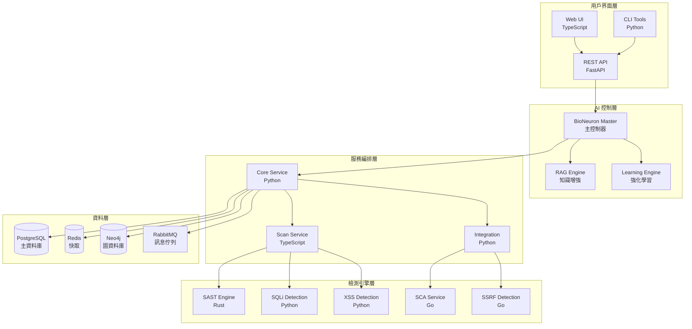

# AIVA - AI 驅動的應用程式安全測試平台

> 🚀 **A**rtificial **I**ntelligence **V**ulnerability **A**ssessment Platform  
> 基於 AI 的智能化應用程式安全測試解決方案

[](https://python.org)
[](https://golang.org)
[](https://rust-lang.org)
[](https://typescriptlang.org)

---

## 📋 目錄導航

### 🏗️ 核心架構文檔
- [📖 系統架構總覽](docs/ARCHITECTURE/AI_SYSTEM_OVERVIEW.md) - 完整的系統架構說明
- [🧠 AI 架構設計](docs/ARCHITECTURE/AI_ARCHITECTURE.md) - AI 引擎核心設計
- [✅ 組件檢查清單](docs/ARCHITECTURE/AI_COMPONENTS_CHECKLIST.md) - 所有組件狀態
- [🌐 多語言架構](docs/ARCHITECTURE/MULTILANG_STRATEGY.md) - 多語言整合策略

### 🚀 快速開始
- [⚡ 快速開始指南](QUICK_START.md) - 5分鐘快速部署
- [🎮 UI 啟動指南](UI_LAUNCH_GUIDE.md) - Web UI 使用說明
- [🔧 增強功能指南](ENHANCED_FEATURES_QUICKSTART.md) - 進階功能使用

### 💻 開發文檔
- [📊 資料存儲指南](docs/DEVELOPMENT/DATA_STORAGE_GUIDE.md) - 資料庫架構與使用
- [🗄️ Schema 參考](docs/DEVELOPMENT/SCHEMA_QUICK_REFERENCE.md) - 資料結構定義
- [🔨 工具使用說明](tools/README.md) - 開發工具集

### 📊 分析報告
- [📈 實施進度報告](reports/IMPLEMENTATION_REPORTS/) - 專案實施狀況
- [🔄 遷移報告](reports/MIGRATION_REPORTS/) - 系統遷移記錄  
- [📅 進度追蹤](reports/PROGRESS_REPORTS/) - 開發進度儀表板

---

## 🎯 系統特色

### 🧠 AI 驅動的智能檢測
- **生物神經元 AI 引擎**: 500萬參數神經網路主腦
- **RAG 知識增強**: 向量檢索結合知識庫
- **強化學習**: 執行 → 追蹤 → 對比 → 學習 → 改進的閉環系統
- **抗幻覺機制**: 確保 AI 決策的準確性和可靠性

### 🔍 全面的安全檢測能力
- **SAST**: 靜態程式碼分析 (Rust 引擎)
- **DAST**: 動態應用程式掃描 (TypeScript/Python)
- **IAST**: 交互式應用程式安全測試
- **SCA**: 軟體組成分析 (Go 服務)
- **CSPM**: 雲端安全態勢管理

### 🌐 多語言架構
- **Python**: AI 核心引擎與主控邏輯
- **Go**: 高性能掃描服務與並發處理
- **Rust**: 安全關鍵的 SAST 引擎
- **TypeScript**: 動態掃描與 UI 互動

### 🎮 多種操作模式
- **UI 模式**: 安全優先，所有操作需要確認
- **AI 模式**: 效率優先，完全自動化執行
- **Chat 模式**: 用戶友好，自然語言交互
- **Hybrid 模式**: 智能平衡，根據風險自動選擇

---

## 📊 專案統計

| 指標 | 數值 |
|------|------|
| 總檔案數 | 299 個 |
| 總程式碼行數 | 81,972 行 |
| Python 模組 | 263 個 (75,483 行) |
| Go 服務 | 18 個 (3,065 行) |
| Rust 程式 | 10 個 (1,552 行) |
| TypeScript 模組 | 8 個 (1,872 行) |
| 函數總數 | 1,444 個 |
| 類別總數 | 1,173 個 |
| 類型提示覆蓋率 | 73.0% |
| 文檔字串覆蓋率 | 90.1% |

---

## 🏭 系統架構



---

## 🚀 快速部署

### 前置需求
- Docker & Docker Compose
- Python 3.11+
- Go 1.21+
- Rust 1.70+
- Node.js 20+

### 一鍵啟動
```bash
# 克隆專案
git clone https://github.com/your-org/AIVA.git
cd AIVA

# 啟動所有服務
docker-compose up -d

# 初始化環境
python init_storage.py
```

### 驗證部署
```bash
# 檢查服務狀態
.\check_status.ps1

# 執行系統測試
python test_complete_system.py
```

---

## 🔧 開發環境

### 環境設置
```bash
# Python 環境
pip install -r requirements.txt

# Go 模組
go mod tidy

# Rust 環境
cargo build

# Node.js 依賴
npm install
```

### 開發工具
- [程式碼分析](tools/analyze_codebase.py) - 分析程式碼品質和結構
- [架構圖生成](tools/generate_complete_architecture.py) - 自動生成系統架構圖
- [Mermaid 圖表工具](tools/py2mermaid.py) - Python 程式碼轉 Mermaid 圖表

---

## 📚 學習資源

### 架構設計
- [AI 系統設計思想](docs/ARCHITECTURE/AI_SYSTEM_OVERVIEW.md#ai-系統設計思想)
- [多語言整合策略](docs/ARCHITECTURE/MULTILANG_STRATEGY.md#整合策略)
- [強化學習閉環](docs/ARCHITECTURE/AI_ARCHITECTURE.md#強化學習)

### 開發實踐
- [程式碼品質標準](docs/DEVELOPMENT/CODING_STANDARDS.md)
- [測試驅動開發](docs/DEVELOPMENT/TESTING_GUIDE.md)
- [API 設計指南](docs/DEVELOPMENT/API_DESIGN.md)

### 操作指南
- [部署最佳實踐](docs/DEPLOYMENT/BEST_PRACTICES.md)
- [監控與告警](docs/OPERATIONS/MONITORING.md)
- [故障排除](docs/OPERATIONS/TROUBLESHOOTING.md)

---

## 🤝 貢獻指南

我們歡迎所有形式的貢獻！

### 如何貢獻
1. Fork 專案
2. 創建功能分支 (`git checkout -b feature/amazing-feature`)
3. 提交變更 (`git commit -m 'Add amazing feature'`)
4. 推送分支 (`git push origin feature/amazing-feature`)
5. 創建 Pull Request

### 開發規範
- 遵循 [程式碼風格指南](docs/DEVELOPMENT/CODING_STANDARDS.md)
- 確保測試覆蓋率 > 70%
- 更新相關文檔
- 通過所有 CI/CD 檢查

---

## 📄 授權

本專案採用 MIT 授權條款 - 詳見 [LICENSE](LICENSE) 文件

---

## 🙏 致謝

感謝所有為這個專案做出貢獻的開發者和研究人員。

特別感謝：
- OWASP 社群提供的安全測試標準
- 各種開源專案的靈感和技術支援
- 研究社群在 AI 安全領域的貢獻

---

## 📞 聯絡方式

- **專案主頁**: [GitHub Repository](https://github.com/your-org/AIVA)
- **問題報告**: [Issues](https://github.com/your-org/AIVA/issues)
- **討論區**: [Discussions](https://github.com/your-org/AIVA/discussions)
- **電子郵件**: security@your-org.com

---

**最後更新**: 2025-10-16  
**版本**: 2.0.0  
**維護團隊**: AIVA Development Team