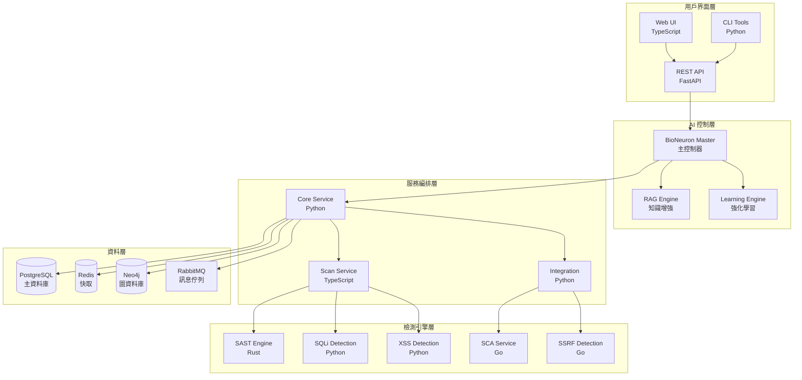

# AIVA - AI 驅動的應用程式安全測試平台

> 🚀 **A**rtificial **I**ntelligence **V**ulnerability **A**ssessment Platform  
> 基於 AI 的智能化應用程式安全測試解決方案

[](https://python.org)
[](https://golang.org)
[](https://rust-lang.org)
[](https://fastapi.tiangolo.com)
[]()

**當前版本:** v3.0+ | **最後更新:** 2025年10月23日

---

## 🏗️ 系統架構

AIVA 採用**五大核心模組架構**，結合 BioNeuron AI 智能體實現全自動化安全測試：

```
🧠 AI核心引擎 (BioNeuron)    🔍 掃描引擎 (統一介面)
    ↓                           ↓
⚔️  攻擊執行引擎          � 整合服務 (經驗學習)
    ↓                           ↓  
🛠️  功能檢測模組    →    📊 統一報告和分析
```

### 核心能力
- **🧠 BioNeuron AI**: 生物神經元啟發的 RAG 智能體，具備經驗學習和自適應能力
- **🔍 智能掃描**: 統一掃描引擎，整合多種掃描技術和策略
- **⚔️ 攻擊執行**: 自動化攻擊鏈編排、漏洞利用和結果驗證
- **🔗 深度整合**: 跨語言技術棧整合 (Python/Rust/Go/Node.js/WASM)
- **📚 經驗學習**: 持續學習攻擊模式，優化測試策略

---

## 📚 核心文檔

### 📖 完整文檔導航
- [📚 **文檔索引中心**](docs/DOCUMENTATION_INDEX.md) - 所有文檔的導航入口和分類

### 🎯 系統狀態和架構  
- [📊 **系統整合狀態報告**](docs/reports/AIVA_SYSTEM_STATUS_UNIFIED.md) - 系統整體狀態、架構概況、維護記錄
- [🧠 **AI 技術文檔**](docs/AIVA_AI_TECHNICAL_DOCUMENTATION.md) - BioNeuron 架構、跨語言整合、經驗學習
- [📦 **實施包文檔**](docs/AIVA_IMPLEMENTATION_PACKAGE.md) - 系統實施和部署指南

### 🚀 快速開始
- [⚡ **快速開始指南**](docs/guides/QUICK_START.md) - 5分鐘快速部署
- [🚀 **快速部署指南**](docs/guides/QUICK_DEPLOY.md) - 一鍵部署說明  
- [🛠️ **開發快速入門**](docs/guides/DEVELOPMENT_QUICK_START.md) - 開發環境搭建

### � 開發計劃
- [📅 **Phase I 開發計劃**](docs/plans/AIVA_PHASE_I_DEVELOPMENT_PLAN.md) - 第一階段詳細計劃
- [🛤️ **階段路線圖**](docs/plans/AIVA_PHASE_0_COMPLETE_PHASE_I_ROADMAP.md) - 完整開發路線圖
- [� **掃描整合計劃**](docs/plans/SCAN_INTEGRATION_IMPLEMENTATION_ROADMAP.md) - 掃描模組整合路線圖

### 💻 開發工具和文檔
- [✅ **開發任務檢查清單**](docs/guides/DEVELOPMENT_TASKS_CHECKLIST.md) - 開發流程和任務
- [🎯 **Token 優化指南**](docs/guides/AIVA_TOKEN_OPTIMIZATION_GUIDE.md) - AI Token 使用優化
- [� **資料存儲指南**](docs/DEVELOPMENT/DATA_STORAGE_GUIDE.md) - 資料庫架構與使用
- [🔨 **工具使用說明**](tools/README.md) - 開發工具集

### 📊 評估和報告  
- [💼 **商業就緒性評估**](docs/assessments/COMMERCIAL_READINESS_ASSESSMENT.md) - 商業化評估結果
- [💎 **高價值功能分析**](docs/assessments/HIGH_VALUE_FEATURES_ANALYSIS.md) - 核心功能價值分析
- [📈 **實施進度報告**](reports/IMPLEMENTATION_REPORTS/) - 專案實施狀況
- [🔄 **系統重組報告**](docs/reports/) - 系統重組和優化記錄
- [📅 **進度追蹤**](reports/PROGRESS_REPORTS/) - 開發進度儀表板

---

## 🔥 **重點功能摘要**

### 📋 **Schema 定義管理系統** ✅ **完成**
- **單一真實來源**: `services/aiva_common/schemas/` (Python 權威定義)
- **多語言輸出**: 自動生成 JSON/TypeScript/Go/Rust 檔案
- **自動化工具**: `tools/schema_manager.py` 一鍵管理
- **影響分析**: `tools/analyze_schema_impact.ps1` 變更追蹤
- **5種語言支援**: Python → JSON/TypeScript/Go/Rust (597KB 總計)

### 🛠️ **官方工具鏈** ✅ **完成**
- **Pydantic 2.11.9**: Python JSON Schema 生成 (270KB)
- **datamodel-code-generator**: TypeScript 介面 (51KB + 14KB 枚舉)
- **quicktype 23.2.6**: Go (155KB) + Rust (107KB) 結構

### 🧹 **系統清理** ✅ **完成**
- **廢棄檔案清除**: 13個備份檔案已清理 (0.1MB 節省)
- **ai_engine_backup 目錄**: 完全移除
- **程式碼庫**: 更整潔、更專業的結構

---

## 🎯 系統特色

### 🧠 AI 驅動的智能檢測
- **生物神經元 AI 引擎**: 500萬參數神經網路主腦
- **RAG 知識增強**: 向量檢索結合知識庫
- **強化學習**: 執行 → 追蹤 → 對比 → 學習 → 改進的閉環系統
- **抗幻覺機制**: 確保 AI 決策的準確性和可靠性

### 🔍 全面的安全檢測能力
- **SAST**: 靜態程式碼分析 (Rust 引擎)
- **DAST**: 動態應用程式掃描 (TypeScript/Python)
- **IAST**: 交互式應用程式安全測試
- **SCA**: 軟體組成分析 (Go 服務)
- **CSPM**: 雲端安全態勢管理

### 🌐 多語言架構
- **Python**: AI 核心引擎與主控邏輯
- **Go**: 高性能掃描服務與並發處理
- **Rust**: 安全關鍵的 SAST 引擎
- **TypeScript**: 動態掃描與 UI 互動

### 🎮 多種操作模式
- **UI 模式**: 安全優先，所有操作需要確認
- **AI 模式**: 效率優先，完全自動化執行
- **Chat 模式**: 用戶友好，自然語言交互
- **Hybrid 模式**: 智能平衡，根據風險自動選擇

---

## 📊 專案統計

| 指標 | 數值 |
|------|------|
| 總檔案數 | 299 個 |
| 總程式碼行數 | 81,972 行 |
| Python 模組 | 263 個 (75,483 行) |
| Go 服務 | 18 個 (3,065 行) |
| Rust 程式 | 10 個 (1,552 行) |
| TypeScript 模組 | 8 個 (1,872 行) |
| 函數總數 | 1,444 個 |
| 類別總數 | 1,173 個 |
| 類型提示覆蓋率 | 73.0% |
| 文檔字串覆蓋率 | 90.1% |

---

## ⚡ **快速使用指令**

### 🔧 Schema 管理
```bash
# 創建新 Schema
python tools/schema_manager.py create-schema \
  --name "SecurityTest" --category "findings" \
  --fields '{"test_id": "str", "result": "bool"}'

# 驗證所有定義
python tools/schema_manager.py validate

# 生成多語言檔案
.\tools\generate-official-contracts.ps1 -GenerateAll
```

### 🔍 系統檢查
```bash
# 分析 Schema 使用
.\tools\analyze_schema_impact.ps1 -SchemaName "FindingPayload" -Action analyze

# 清理廢棄檔案  
.\tools\cleanup_deprecated_files.ps1 -DryRun

# 執行測試
python -m pytest tests/
```

### 📊 專案統計
```bash
# 查看生成檔案
Get-ChildItem schemas | Select-Object Name, @{N="Size(KB)";E={[math]::Round($_.Length/1024,1)}}

# 列出所有 Schema
python tools/schema_manager.py list
```

---

## 🏭 系統架構



---

## 🚀 快速部署

### 前置需求
- Docker & Docker Compose
- Python 3.11+
- Go 1.21+
- Rust 1.70+
- Node.js 20+

### 一鍵啟動
```bash
# 克隆專案
git clone https://github.com/your-org/AIVA.git
cd AIVA

# 啟動所有服務
docker-compose up -d

# 初始化環境
python init_storage.py
```

### 驗證部署
```bash
# 檢查服務狀態
.\check_status.ps1

# 執行系統測試
python test_complete_system.py
```

---

## 🔧 開發環境

### 環境設置
```bash
# Python 環境
pip install -r requirements.txt

# Go 模組
go mod tidy

# Rust 環境
cargo build

# Node.js 依賴
npm install
```

### 開發工具
- [程式碼分析](tools/analyze_codebase.py) - 分析程式碼品質和結構
- [架構圖生成](tools/generate_complete_architecture.py) - 自動生成系統架構圖
- [Mermaid 圖表工具](tools/py2mermaid.py) - Python 程式碼轉 Mermaid 圖表

---

## 📚 學習資源

### 架構設計
- [AI 系統設計思想](docs/ARCHITECTURE/AI_SYSTEM_OVERVIEW.md#ai-系統設計思想)
- [多語言整合策略](docs/ARCHITECTURE/MULTILANG_STRATEGY.md#整合策略)
- [強化學習閉環](docs/ARCHITECTURE/AI_ARCHITECTURE.md#強化學習)

### 開發實踐
- [程式碼品質標準](docs/DEVELOPMENT/CODING_STANDARDS.md)
- [測試驅動開發](docs/DEVELOPMENT/TESTING_GUIDE.md)
- [API 設計指南](docs/DEVELOPMENT/API_DESIGN.md)

### 操作指南
- [部署最佳實踐](docs/DEPLOYMENT/BEST_PRACTICES.md)
- [監控與告警](docs/OPERATIONS/MONITORING.md)
- [故障排除](docs/OPERATIONS/TROUBLESHOOTING.md)

---

## 🤝 貢獻指南

我們歡迎所有形式的貢獻！

### 如何貢獻
1. Fork 專案
2. 創建功能分支 (`git checkout -b feature/amazing-feature`)
3. 提交變更 (`git commit -m 'Add amazing feature'`)
4. 推送分支 (`git push origin feature/amazing-feature`)
5. 創建 Pull Request

### 開發規範
- 遵循 [程式碼風格指南](docs/DEVELOPMENT/CODING_STANDARDS.md)
- 確保測試覆蓋率 > 70%
- 更新相關文檔
- 通過所有 CI/CD 檢查

---

## 📄 授權

本專案採用 MIT 授權條款 - 詳見 [LICENSE](LICENSE) 文件

---

## 🙏 致謝

感謝所有為這個專案做出貢獻的開發者和研究人員。

特別感謝：
- OWASP 社群提供的安全測試標準
- 各種開源專案的靈感和技術支援
- 研究社群在 AI 安全領域的貢獻

---

## 📞 聯絡方式

- **專案主頁**: [GitHub Repository](https://github.com/your-org/AIVA)
- **問題報告**: [Issues](https://github.com/your-org/AIVA/issues)
- **討論區**: [Discussions](https://github.com/your-org/AIVA/discussions)
- **電子郵件**: security@your-org.com

---

**最後更新**: 2025-10-23  
**版本**: 3.0.0  
**維護團隊**: AIVA Development Team

---

## 📂 **最新更新 (v3.0.0 - 2025-10-23)**

### ✅ **文檔結構重組完成**
- **docs/** 目錄按功能分類 (guides/, plans/, assessments/, reports/)
- **scripts/** 目錄按用途分類 (launcher/, testing/, validation/, integration/, reporting/, conversion/)
- **tools/** 目錄按類型分類 (development/, schema/, automation/, monitoring/)
- **reports/** 目錄按報告類型分類 (connectivity/, security/, analysis/, implementation/, etc.)

### 📚 **文檔導航優化** 
- 新增 [文檔索引中心](docs/DOCUMENTATION_INDEX.md) 提供完整導航
- 所有文檔路徑更新至新結構
- 分類清晰，查找便利，維護性大幅提升

### 🔧 **腳本整合優化**
- 26個輔助腳本重新分類整理
- 保持向後兼容性的重定向機制
- 核心功能腳本保留 (enhanced_real_ai_attack_system.py, real_attack_executor.py)
- 五大模組架構完整維持