# AIVA 程式合約關係圖

本文檔展示 AIVA 系統中各模組間的合約關係和數據流向。

---

## 🏗️ 系統架構概覽

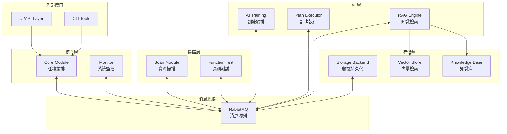

---

## 📊 模組間合約映射

### 1. 掃描流程合約

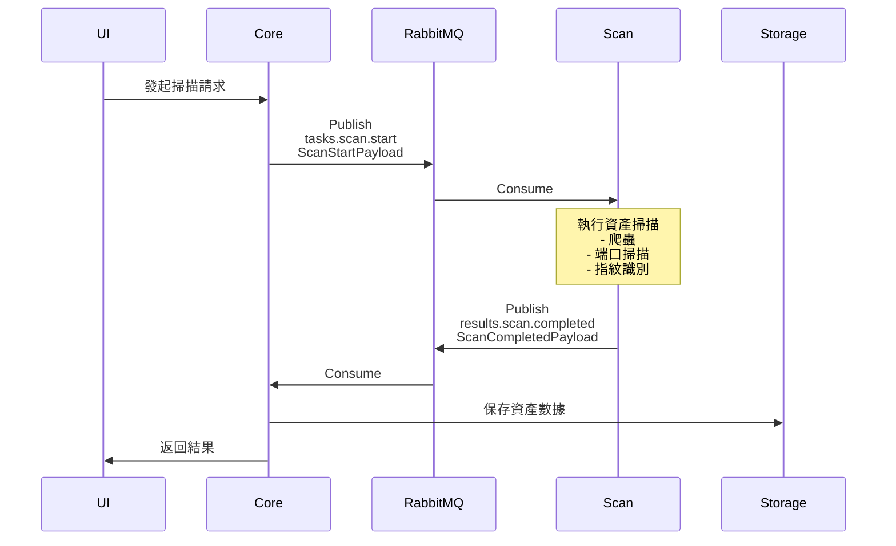

**合約清單**:
- `ScanStartPayload` → `tasks.scan.start`
- `ScanCompletedPayload` → `results.scan.completed`

---

### 2. 功能測試流程合約

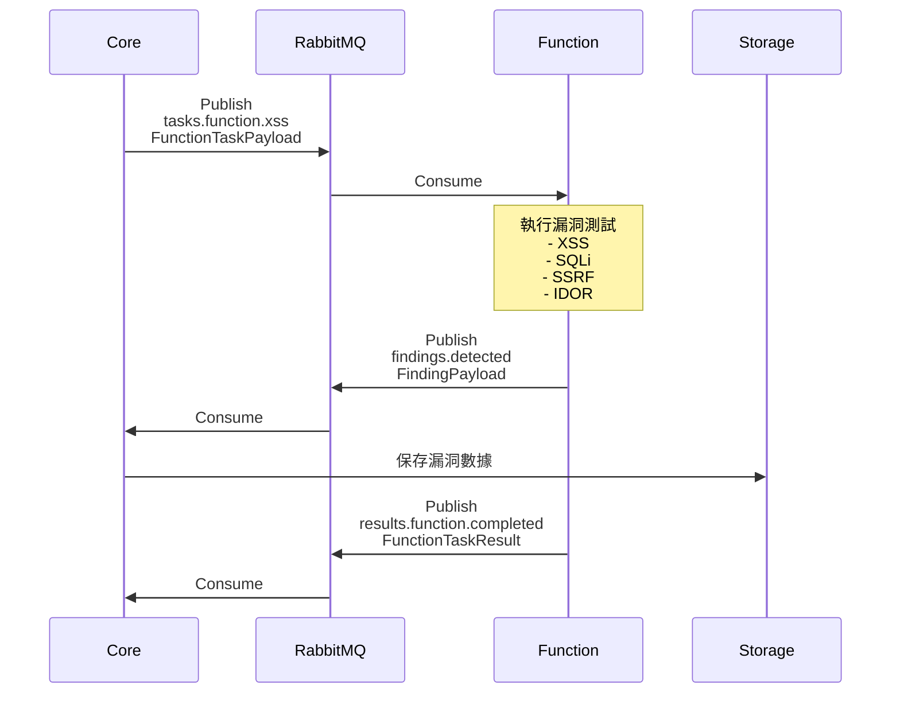

**合約清單**:
- `FunctionTaskPayload` → `tasks.function.*`
- `FindingPayload` → `findings.detected`
- `EnhancedVulnerability` (內嵌於 FindingPayload)

---

### 3. AI 訓練流程合約

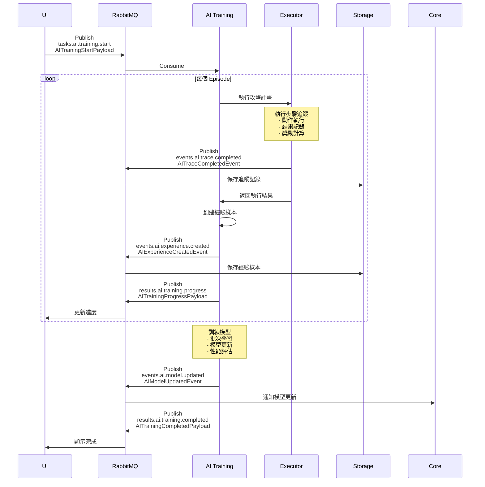

**合約清單**:
- `AITrainingStartPayload` → `tasks.ai.training.start`
- `AITrainingProgressPayload` → `results.ai.training.progress`
- `AITrainingCompletedPayload` → `results.ai.training.completed`
- `AIExperienceCreatedEvent` → `events.ai.experience.created`
- `AITraceCompletedEvent` → `events.ai.trace.completed`
- `AIModelUpdatedEvent` → `events.ai.model.updated`

---

### 4. RAG 知識檢索流程合約

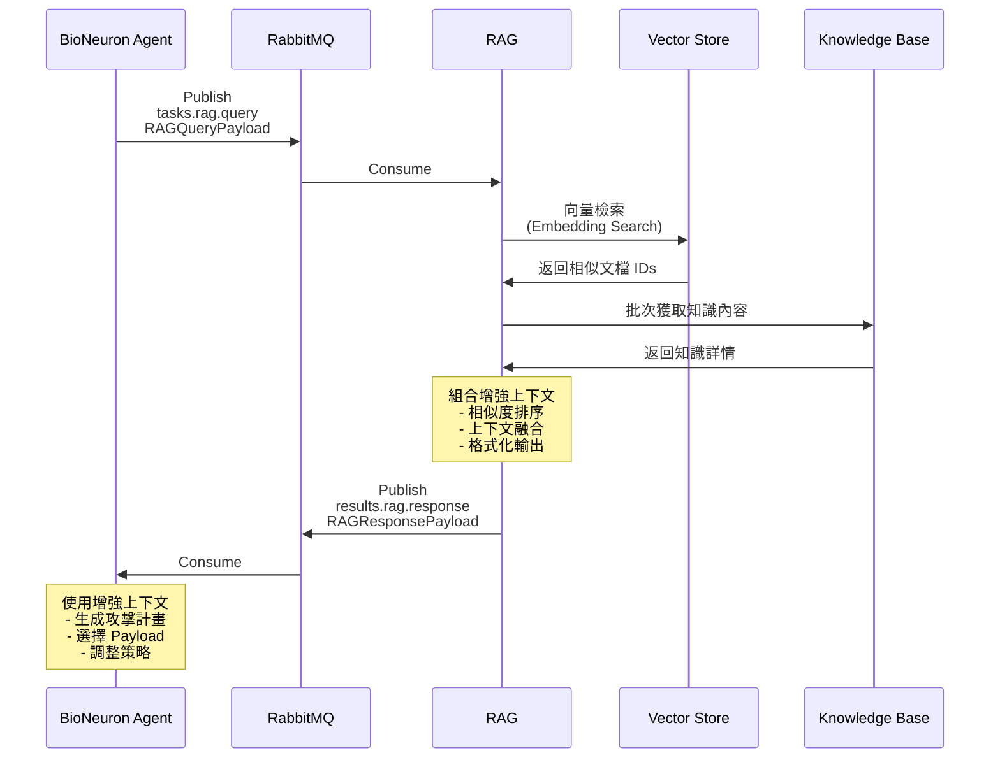

**合約清單**:
- `RAGQueryPayload` → `tasks.rag.query`
- `RAGResponsePayload` → `results.rag.response`
- `RAGKnowledgeUpdatePayload` → `tasks.rag.knowledge.update`

---

### 5. 模型部署流程合約

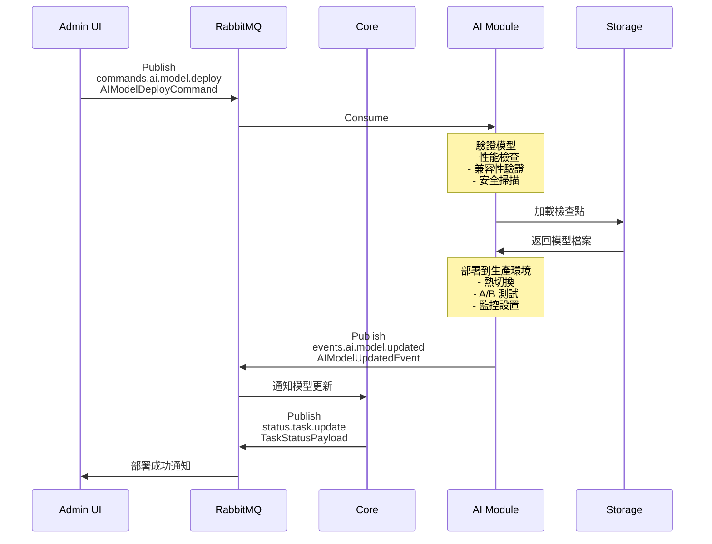

**合約清單**:
- `AIModelDeployCommand` → `commands.ai.model.deploy`
- `AIModelUpdatedEvent` → `events.ai.model.updated`

---

## 🔗 統一通訊包裝器使用場景

### 場景 1: 請求-響應模式 (AIVARequest/Response)

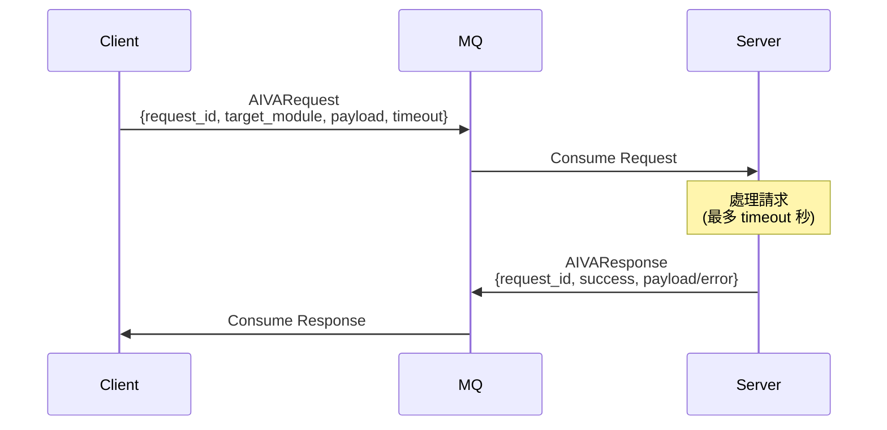

**使用案例**:
- 同步 API 調用
- 需要確認的命令
- 配置查詢

### 場景 2: 事件通知模式 (AIVAEvent)

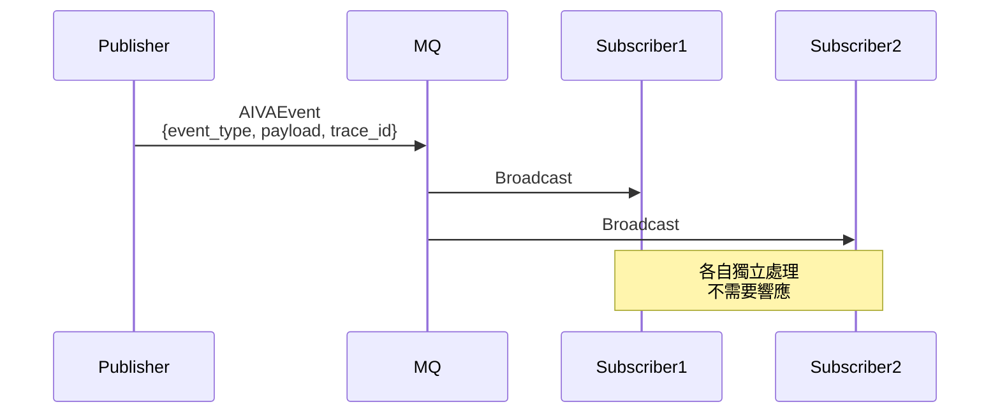

**使用案例**:
- 系統事件通知
- 日誌記錄
- 監控指標上報

### 場景 3: 命令模式 (AIVACommand)

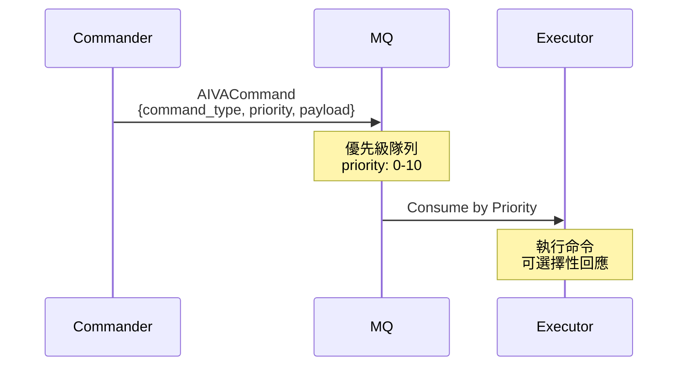

**使用案例**:
- 任務取消
- 配置更新
- 模型部署

---

## 📋 合約依賴關係

### 核心合約依賴樹

```
AivaMessage (根合約)
├── MessageHeader (必需)
│   ├── message_id: str
│   ├── trace_id: str
│   ├── correlation_id: str | None
│   ├── source_module: ModuleName (來自 enums)
│   ├── timestamp: datetime
│   └── version: str
├── topic: Topic (來自 enums)
├── schema_version: str
└── payload: dict[str, Any]
    └── 可以是任何 *Payload 類別
```

### Payload 繼承關係

```
BaseModel (Pydantic)
├── ScanStartPayload
│   ├── targets: list[HttpUrl]
│   ├── scope: ScanScope
│   ├── authentication: Authentication
│   └── ...
├── ScanCompletedPayload
│   ├── assets: list[Asset]
│   ├── summary: Summary
│   └── ...
├── FindingPayload
│   ├── vulnerability: EnhancedVulnerability
│   │   ├── cvss_metrics: CVSSv3Metrics
│   │   ├── cve_references: list[CVEReference]
│   │   ├── cwe_references: list[CWEReference]
│   │   └── mitre_techniques: list[MITREAttackTechnique]
│   ├── evidence: FindingEvidence
│   ├── impact: FindingImpact
│   └── recommendation: FindingRecommendation
├── AITrainingStartPayload
│   ├── training_id: str
│   ├── config: ModelTrainingConfig
│   └── ...
└── ... (其他 50+ Payload)
```

---

## 🎯 業界標準集成

### CVSS v3.1 評分流程

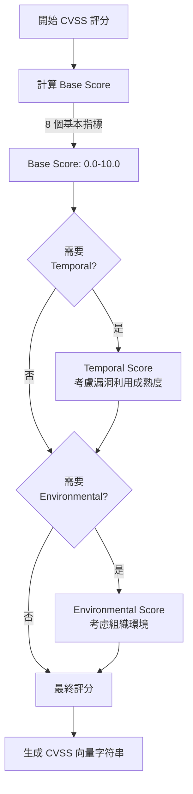

**集成位置**:
- `CVSSv3Metrics` 類別
- `EnhancedVulnerability.cvss_metrics`
- 自動計算並生成向量字符串

### MITRE ATT&CK 映射

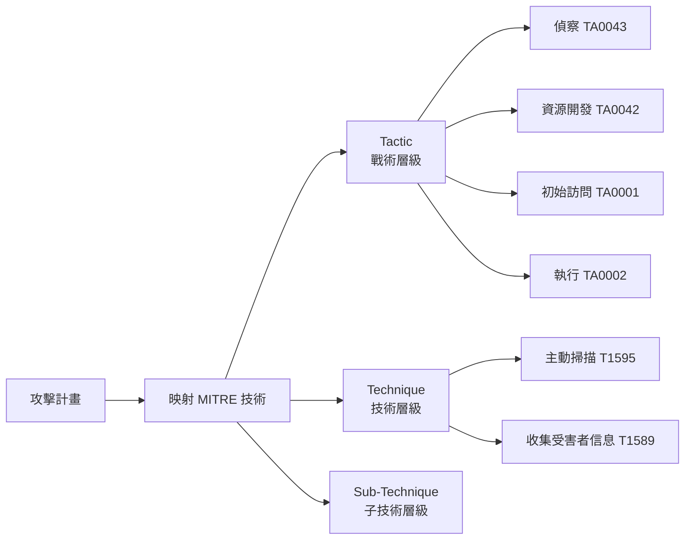

**集成位置**:
- `MITREAttackTechnique` 類別
- `AttackPlan.mitre_techniques`
- `EnhancedVulnerability.mitre_techniques`

---

## 📊 合約使用統計

### Topic 使用頻率分布

```
掃描相關:        ████░░░░░░ 5%  (2/43)
功能測試:        ██████████░ 14% (6/43)
AI 訓練:         ██████████░ 14% (6/43)
AI 事件:         ███████░░░░ 7%  (3/43)
AI 命令:         ██░░░░░░░░░ 2%  (1/43)
RAG 知識庫:      ███████░░░░ 7%  (3/43)
滲透後測試:      ██████████░ 14% (6/43)
威脅情報:        ████████░░░ 9%  (4/43)
授權測試:        ███████░░░░ 7%  (3/43)
修復建議:        █████░░░░░░ 5%  (2/43)
通用管理:        ████████████ 16% (7/43)
```

### Payload 複雜度分析

| Payload 類別 | 欄位數 | 嵌套層級 | 複雜度 |
|-------------|--------|----------|--------|
| MessageHeader | 6 | 1 | 簡單 |
| ScanStartPayload | 8 | 2 | 中等 |
| FindingPayload | 10 | 4 | 複雜 |
| EnhancedVulnerability | 15 | 3 | 複雜 |
| AITrainingStartPayload | 6 | 2 | 中等 |
| AITrainingCompletedPayload | 14 | 2 | 複雜 |
| CVSSv3Metrics | 19 | 1 | 複雜 |
| RAGQueryPayload | 6 | 1 | 簡單 |

---

## 🔄 數據流向總覽

```mermaid
flowchart TB
    subgraph Input["數據輸入"]
        UI[UI/API]
        CLI[CLI]
        Ext[外部系統]
    end

    subgraph Processing["處理層"]
        Core[核心編排]
        Scan[掃描引擎]
        Test[測試引擎]
        AI[AI 引擎]
    end

    subgraph Knowledge["知識層"]
        RAG[RAG 檢索]
        Vector[向量庫]
        KB[知識庫]
    end

    subgraph Storage["存儲層"]
        DB[(PostgreSQL)]
        Redis[(Redis)]
        Files[文件系統]
    end

    Input --> Core
    Core --> Scan
    Core --> Test
    Core --> AI
    
    Scan --> Core
    Test --> Core
    AI --> Core
    
    AI <--> RAG
    RAG <--> Vector
    RAG <--> KB
    
    Core --> DB
    AI --> DB
    RAG --> Vector
    
    Core --> Redis
    AI --> Redis
    
    AI --> Files
    Scan --> Files
```

---

## 📝 合約版本演進

### v1.0 (當前)
- ✅ 基礎掃描與測試合約
- ✅ AI 訓練完整流程
- ✅ RAG 知識檢索
- ✅ 統一通訊包裝器
- ✅ CVSS/CVE/CWE/MITRE 集成

### v1.1 (規劃中)
- 🔄 合約版本控制機制
- 🔄 向後兼容性檢查
- 🔄 自動文檔生成 (OpenAPI/AsyncAPI)
- 🔄 合約測試框架

### v2.0 (未來)
- 🔮 分布式追蹤增強
- 🔮 多語言 SDK 生成
- 🔮 合約治理平台
- 🔮 實時合約監控

---

## 🎓 最佳實踐

### 1. 使用統一包裝器
```python
# ✅ 推薦: 使用 AIVARequest
request = AIVARequest(
    request_id=generate_id(),
    source_module=ModuleName.CORE,
    target_module=ModuleName.AI_TRAINING,
    request_type="training.start",
    payload=AITrainingStartPayload(...).model_dump(),
    timeout_seconds=30
)

# ❌ 不推薦: 直接使用原始字典
raw_msg = {
    "id": "...",
    "data": {...}
}
```

### 2. 填充 trace_id
```python
# ✅ 推薦: 使用 trace_id 追蹤請求
header = MessageHeader(
    message_id=generate_id(),
    trace_id=current_trace_id,  # 傳遞上游 trace_id
    source_module=ModuleName.CORE
)

# ❌ 不推薦: 忽略 trace_id
header = MessageHeader(
    message_id=generate_id(),
    source_module=ModuleName.CORE
)
```

### 3. 錯誤處理
```python
# ✅ 推薦: 使用 AIVAResponse 的錯誤欄位
response = AIVAResponse(
    request_id=request.request_id,
    response_type="training.result",
    success=False,
    error_code="TRAINING_FAILED",
    error_message="模型收斂失敗: loss > threshold"
)

# ❌ 不推薦: 在 payload 中自定義錯誤格式
response = {
    "status": "error",
    "msg": "failed"
}
```

### 4. Payload 驗證
```python
# ✅ 推薦: 使用 Pydantic 驗證
try:
    payload = AITrainingStartPayload(**data)
except ValidationError as e:
    logger.error(f"Invalid payload: {e}")
    return error_response()

# ❌ 不推薦: 手動檢查
if "training_id" not in data:
    return error()
```

---

## 📚 相關文檔

- [MODULE_COMMUNICATION_CONTRACTS.md](MODULE_COMMUNICATION_CONTRACTS.md) - 完整合約定義
- [CONTRACT_VERIFICATION_REPORT.md](CONTRACT_VERIFICATION_REPORT.md) - 驗證報告
- [schemas.py](services/aiva_common/schemas.py) - Schema 實現
- [enums.py](services/aiva_common/enums.py) - 枚舉定義

---

**文檔版本**: 1.0  
**最後更新**: 2025年10月15日  
**維護者**: AIVA Development Team
