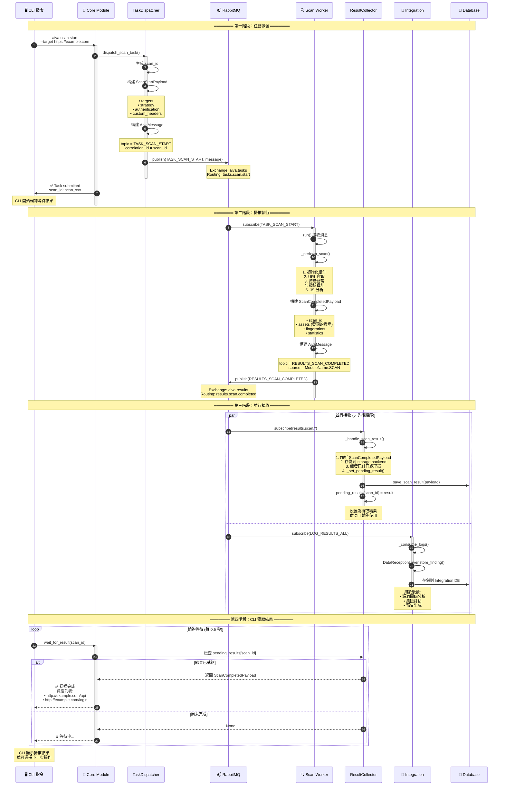
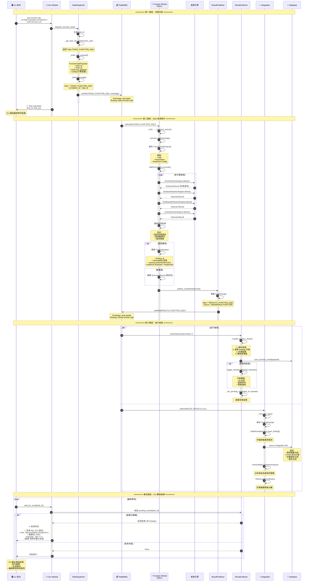
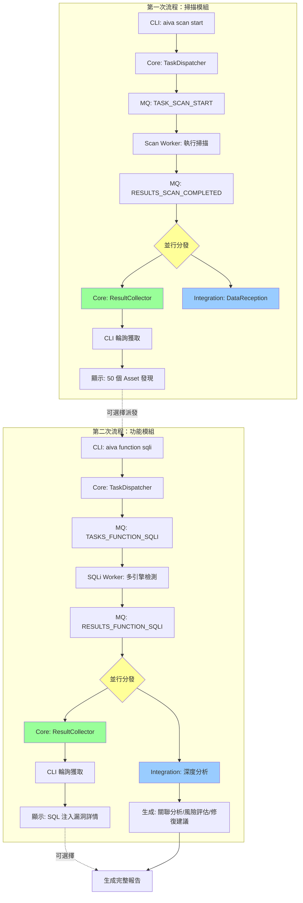

# AIVA 完整雙向流程分析：CLI → 模組 → 回饋

> **文件目的**: 完整說明從 CLI 下令到獲得回饋的整個流程  
> **生成時間**: 2025-10-16  
> **資料來源**: 實際程式碼 + 1655 個流程圖分析

---

## 📋 目錄

1. [流程概覽](#流程概覽)
2. [第一次流程：掃描模組](#第一次流程掃描模組)
3. [第二次流程：功能模組](#第二次流程功能模組)
4. [接收端架構](#接收端架構)
5. [數據收集與運用](#數據收集與運用)
6. [完整時序圖](#完整時序圖)

---

## 🎯 流程概覽

### 核心問題解答

**Q1: 掃描模組輸出後，誰接收？**
- **同時接收**: Core 模組的 ResultCollector + Integration 模組
- **機制**: RabbitMQ 的 **TOPIC Exchange 廣播機制**
- **不是先後關係**: 是**並行接收**

**Q2: 資料如何產出回饋給 CLI？**
- Core 模組的 ResultCollector 接收後 → 存儲 + 觸發處理器 → CLI 通過 `wait_for_result()` 輪詢獲取

**Q3: 資料如何收集運用？**
- **Core**: 任務管理、狀態追蹤、觸發下一步任務
- **Integration**: 漏洞存儲、風險分析、報告生成、關聯分析

---

## 🔍 第一次流程：掃描模組

### 完整流程圖



### 關鍵代碼實現

#### 1. Scan Worker 發布結果

```python
# 來源: services/scan/aiva_scan/worker.py (Line 28-48)

async def run() -> None:
    broker = await get_broker()
    
    # 訂閱掃描任務
    async for mqmsg in broker.subscribe(Topic.TASK_SCAN_START):
        try:
            # 解析任務
            msg = AivaMessage.model_validate_json(mqmsg.body)
            req = ScanStartPayload(**msg.payload)
            
            # 執行掃描
            payload = await _perform_scan(req)
            
            # 構建結果消息
            out = AivaMessage(
                header=MessageHeader(
                    message_id=new_id("msg"),
                    trace_id=msg.header.trace_id,
                    correlation_id=req.scan_id,  # 📌 關聯 ID
                    source_module=ModuleName.SCAN,
                ),
                topic=Topic.RESULTS_SCAN_COMPLETED,  # 📌 結果 Topic
                payload=payload.model_dump(),
            )
            
            # 發布到 MQ (並行分發)
            await broker.publish(
                Topic.RESULTS_SCAN_COMPLETED,
                json.dumps(out.model_dump()).encode("utf-8"),
            )
            
        except Exception as exc:
            logger.exception("scan failed: %s", exc)
```

#### 2. Core ResultCollector 接收

```python
# 來源: services/core/aiva_core/messaging/result_collector.py

class ResultCollector:
    async def start(self) -> None:
        """啟動結果收集"""
        # 訂閱掃描結果 (並行接收者之一)
        await self._subscribe_scan_results()
        await self._subscribe_function_results()
    
    async def _subscribe_scan_results(self) -> None:
        """訂閱掃描結果"""
        await self.broker.subscribe(
            queue_name="core.scan.results",  # 📌 Core 專屬隊列
            routing_keys=["results.scan.completed", "results.scan.failed"],
            exchange_name="aiva.results",
            callback=self._handle_scan_result,  # 📌 處理器
        )
    
    async def _handle_scan_result(self, message) -> None:
        """處理掃描結果"""
        async with message.process():
            body = json.loads(message.body.decode())
            
            # 解析結果
            payload = ScanCompletedPayload(**body.get("payload", {}))
            
            # 1. 存儲結果
            if self.storage:
                await self._store_result("scan", payload.model_dump())
            
            # 2. 觸發已註冊的處理器
            await self._trigger_handlers("scan_completed", payload)
            
            # 3. 設置待取結果 (供 CLI 輪詢)
            self._set_pending_result(payload.scan_id, payload.model_dump())
    
    def _set_pending_result(self, result_id: str, result: dict) -> None:
        """設置等待中的結果"""
        self.pending_results[result_id] = {
            "result": result,
            "timestamp": datetime.now(UTC).isoformat(),
        }
    
    async def wait_for_result(
        self,
        result_id: str,
        timeout: float = 30.0,
        poll_interval: float = 0.5,
    ) -> dict | None:
        """等待特定結果 (CLI 使用此方法)"""
        start_time = asyncio.get_event_loop().time()
        
        while True:
            # 檢查是否已有結果
            if result_id in self.pending_results:
                result = self.pending_results.pop(result_id)
                return result["result"]  # 📌 返回給 CLI
            
            # 檢查超時
            elapsed = asyncio.get_event_loop().time() - start_time
            if elapsed >= timeout:
                return None
            
            # 輪詢等待
            await asyncio.sleep(poll_interval)
```

#### 3. Integration 模組接收

```python
# 來源: services/integration/aiva_integration/app.py (Line 45, 73-78)

@app.on_event("startup")
async def startup() -> None:
    # 啟動時創建日誌消費任務 (並行接收者之二)
    asyncio.create_task(_consume_logs())

async def _consume_logs() -> None:
    """消費所有結果日誌"""
    broker = await get_broker()
    
    # 訂閱所有結果 (廣泛訂閱)
    async for mqmsg in broker.subscribe(Topic.LOG_RESULTS_ALL):
        msg = AivaMessage.model_validate_json(mqmsg.body)
        finding = FindingPayload(**msg.payload)
        
        # 存儲到 Integration 資料庫 (用於分析和報告)
        recv.store_finding(finding)
```

---

## ⚡ 第二次流程：功能模組

### 完整流程圖



### 關鍵代碼實現

#### 1. Function Worker 處理任務

```python
# 來源: services/function/function_sqli/aiva_func_sqli/worker.py

class SqliWorkerService:
    async def run(self) -> None:
        """主運行循環"""
        broker = await get_broker()
        
        # 訂閱 SQLi 任務
        async for mqmsg in broker.subscribe(Topic.TASKS_FUNCTION_SQLI):
            await self.process_task(mqmsg)
    
    async def process_task(self, message) -> None:
        """處理單個任務"""
        msg = AivaMessage.model_validate_json(message.body)
        payload = FunctionTaskPayload(**msg.payload)
        
        # 執行檢測
        result = await self.orchestrator.execute(payload)
        
        # 發布結果
        await self.result_publisher.publish(result)
```

#### 2. Result Publisher 發布結果

```python
# 來源: services/function/function_sqli/aiva_func_sqli/result_binder_publisher.py

class SqliResultBinderPublisher:
    async def publish(self, finding: FindingPayload | None) -> None:
        """發布檢測結果"""
        broker = await get_broker()
        
        if finding:
            # 有漏洞發現
            message = AivaMessage(
                header=MessageHeader(
                    message_id=new_id("msg"),
                    source_module=ModuleName.FUNCTION,
                ),
                topic=Topic.RESULTS_FUNCTION_SQLI,  # 📌 結果 Topic
                payload=finding.model_dump(),
            )
        else:
            # 無漏洞發現
            message = AivaMessage(
                header=MessageHeader(
                    message_id=new_id("msg"),
                    source_module=ModuleName.FUNCTION,
                ),
                topic=Topic.RESULTS_FUNCTION_SQLI,
                payload={"status": "completed", "findings": []},
            )
        
        # 發布 (並行分發給 Core 和 Integration)
        await broker.publish(
            Topic.RESULTS_FUNCTION_SQLI,
            json.dumps(message.model_dump()).encode("utf-8"),
        )
```

---

## 🏗️ 接收端架構

### RabbitMQ TOPIC Exchange 機制

```
                        ┌─────────────────────────┐
                        │   RabbitMQ Exchange     │
                        │   Type: TOPIC           │
                        │   Name: aiva.results    │
                        └────────┬────────────────┘
                                 │
                    ┌────────────┴────────────┐
                    │  Routing Key Matching   │
                    │  results.scan.*         │
                    │  results.function.*     │
                    └────────┬────────────────┘
                             │
         ┌───────────────────┼───────────────────┐
         │                   │                   │
         ▼                   ▼                   ▼
┌────────────────┐  ┌────────────────┐  ┌───────────────┐
│ Core Queue     │  │ Integration Q  │  │ AI Queue      │
│ core.results   │  │ int.logs       │  │ ai.findings   │
└────────┬───────┘  └────────┬───────┘  └────────┬──────┘
         │                   │                   │
         ▼                   ▼                   ▼
┌────────────────┐  ┌────────────────┐  ┌───────────────┐
│ResultCollector │  │DataReceptionL  │  │AI Processor   │
│ (Core)         │  │ (Integration)  │  │               │
└────────────────┘  └────────────────┘  └───────────────┘
```

### 並行接收特性

**關鍵點**:
1. **同一個消息會被複製到多個隊列** (基於 routing key 匹配)
2. **每個模組有自己的專屬隊列** (不會互相干擾)
3. **接收順序不確定** (網絡延遲、處理速度不同)
4. **各自獨立處理** (Core 處理不影響 Integration)

**實際配置** (從代碼推導):

```python
# Core 模組訂閱
await broker.subscribe(
    queue_name="core.scan.results",           # 📌 Core 專屬隊列
    routing_keys=["results.scan.completed"],  # 📌 只接收掃描完成
    exchange_name="aiva.results",
    callback=self._handle_scan_result,
)

# Integration 模組訂閱
await broker.subscribe(
    queue_name="integration.logs",            # 📌 Integration 專屬隊列
    routing_keys=["results.*", "log.*"],      # 📌 接收所有結果
    exchange_name="aiva.results",
    callback=self._consume_logs,
)
```

---

## 💾 數據收集與運用

### Core 模組的數據運用

```python
# 來源: services/core/aiva_core/messaging/result_collector.py

class ResultCollector:
    """Core 模組的數據收集器"""
    
    # 1️⃣ 存儲結果 (供查詢和追蹤)
    async def _store_result(self, result_type: str, data: dict) -> None:
        """存儲到 Core 資料庫"""
        if hasattr(self.storage, f"save_{result_type}_result"):
            method = getattr(self.storage, f"save_{result_type}_result")
            await method(data)
    
    # 2️⃣ 觸發處理器 (觸發下一步動作)
    async def _trigger_handlers(self, event_type: str, data: Any) -> None:
        """觸發已註冊的處理器"""
        handlers = self.result_handlers.get(event_type, [])
        
        for handler in handlers:
            # 可能觸發:
            # - 自動派發下一個任務
            # - 更新 AI 學習資料
            # - 發送通知/警報
            # - 更新任務狀態
            await handler(data)
    
    # 3️⃣ 設置待取結果 (供 CLI 輪詢)
    def _set_pending_result(self, result_id: str, result: dict) -> None:
        """CLI 輪詢機制"""
        self.pending_results[result_id] = {
            "result": result,
            "timestamp": datetime.now(UTC).isoformat(),
        }
    
    # 4️⃣ 提供查詢接口 (供 CLI/API 使用)
    async def wait_for_result(self, result_id: str, timeout: float = 30.0):
        """等待特定結果 (輪詢實現)"""
        start_time = asyncio.get_event_loop().time()
        
        while True:
            if result_id in self.pending_results:
                return self.pending_results.pop(result_id)["result"]
            
            if asyncio.get_event_loop().time() - start_time >= timeout:
                return None
            
            await asyncio.sleep(0.5)  # 每 0.5 秒檢查一次
```

**Core 模組數據流向**:

```
接收結果 → 存儲 → 觸發處理器 → 設置待取 → CLI 輪詢獲取
   ↓         ↓           ↓            ↓           ↓
   DB      任務表    下一步任務     pending_    返回給
                   AI學習更新      results      用戶
```

### Integration 模組的數據運用

```python
# 來源: services/integration/aiva_integration/app.py

class DataReceptionLayer:
    """Integration 模組的數據接收層"""
    
    def store_finding(self, finding: FindingPayload) -> None:
        """存儲漏洞發現"""
        # 1. 存儲到資料庫
        self.db.save_finding(finding)
        
        # 2. 觸發分析流程 (自動進行)
        self._trigger_analysis(finding)
    
    def _trigger_analysis(self, finding: FindingPayload) -> None:
        """觸發多種分析"""
        # 2.1 漏洞關聯分析
        correlations = self.vuln_analyzer.analyze_correlations([finding])
        
        # 2.2 風險評估
        risk = self.risk_engine.assess_risk(finding)
        
        # 2.3 合規性檢查
        compliance = self.compliance_checker.check_compliance(finding)
        
        # 2.4 更新統計資料
        self.metadata_analyzer.update_stats(finding)
```

**Integration 模組數據流向**:

```
接收結果 → 存儲 → 多維度分析 → 生成洞察 → 報告生成
   ↓         ↓          ↓           ↓          ↓
  Int DB   漏洞庫   關聯分析     攻擊路徑    PDF/HTML
                   風險評分     修復建議     SARIF
                   合規檢查     優先級排序   Excel
```

### 具體運用場景

#### 場景 1: 掃描結果運用

```
Scan Worker 發現 50 個 Asset
        ↓
    ┌───┴────┬──────────────────────────┐
    ▼        ▼                          ▼
  Core     Integration               (其他)
    │         │
    ├─ 存儲 Asset 列表
    │  └→ 供查詢使用
    │
    ├─ 觸發處理器:
    │  ├→ 自動派發 SQLi 檢測任務 (針對有參數的 URL)
    │  ├→ 自動派發 XSS 檢測任務
    │  └→ 更新掃描進度
    │
    └─ 設置 pending_results[scan_id]
       └→ CLI 輪詢獲取 → 顯示給用戶
                          ↓
                     用戶決定下一步:
                     • 繼續深度掃描
                     • 派發檢測任務
                     • 生成報告
```

#### 場景 2: SQLi 檢測結果運用

```
SQLi Worker 發現高危漏洞
        ↓
    ┌───┴────┬──────────────────────────┐
    ▼        ▼                          ▼
  Core     Integration              AI Module
    │         │                        │
    ├─ 存儲 Finding                    ├─ 學習成功 Payload
    │  └→ 關聯到 scan_id               │  └→ 更新知識庫
    │                                  │
    ├─ 觸發處理器:                     └─ 評估檢測效果
    │  ├→ 發送警報通知                    └→ 調整檢測策略
    │  ├→ 更新任務狀態
    │  └→ 記錄到 AI 經驗庫
    │
    └─ 設置 pending_results[task_id]
       └→ CLI 輪詢獲取 → 顯示漏洞詳情
                          ↓
                     用戶決定:
                     • 生成詳細報告
                     • 繼續檢測其他類型
                     • 查看修復建議
```

**Integration 的深度分析**:

```python
# 自動進行 (無需 CLI 觸發)

# 1. 漏洞關聯分析
correlations = vuln_analyzer.analyze_correlations(findings)
# 結果: "SQLi + XSS 在同一 endpoint → 可能形成攻擊鏈"

# 2. 風險評估
risk_score = risk_engine.assess_risk(finding)
# 結果: CVSS 9.8 (Critical) + 業務影響 → 整體風險 HIGH

# 3. 攻擊路徑分析
attack_paths = path_analyzer.find_attack_paths(findings)
# 結果: SQLi → 資料外洩 → 橫向移動 → 系統控制

# 4. 修復建議生成
remediation = remediation_engine.generate_fix(finding)
# 結果: 
# • 使用參數化查詢
# • 輸入驗證
# • WAF 規則建議
# • 程式碼修復範例

# 5. 報告生成 (可供 CLI 請求)
report = report_generator.generate_report(scan_id)
# 格式: PDF, HTML, SARIF, Excel
```

---

## 📊 完整時序圖：兩次流程對比



---

## 🎯 關鍵要點總結

### 1. 接收機制：並行非先後

❌ **錯誤理解**: 先傳給 Core，再傳給 Integration  
✅ **正確理解**: **同時並行**傳給 Core 和 Integration

**原因**: RabbitMQ TOPIC Exchange 的廣播機制
- 一個消息發布後，會被複製到所有匹配的隊列
- Core 和 Integration 各有自己的隊列
- 接收順序取決於網絡延遲和處理速度

### 2. CLI 回饋機制：輪詢等待

```python
# CLI 實現 (偽代碼)
async def run_scan(target: str) -> ScanResult:
    # 1. 派發任務
    scan_id = await core.dispatch_scan_task(target)
    print(f"✅ Task submitted: {scan_id}")
    
    # 2. 輪詢等待結果
    print("⏳ Waiting for results...")
    result = await core.wait_for_result(scan_id, timeout=300)
    
    # 3. 顯示結果
    if result:
        print(f"✅ Scan completed!")
        print(f"Found {len(result['assets'])} assets")
        return result
    else:
        print("❌ Timeout!")
        return None
```

### 3. 數據收集層次

| 層級 | 模組 | 用途 | 時效性 |
|------|------|------|--------|
| **即時反饋** | Core | CLI 輪詢、任務追蹤 | 實時 (0.5秒輪詢) |
| **任務管理** | Core | 狀態更新、下一步觸發 | 實時 |
| **深度分析** | Integration | 漏洞關聯、風險評估 | 異步 (秒級) |
| **報告生成** | Integration | PDF/HTML/SARIF | 按需 (用戶請求時) |
| **AI 學習** | AI Module | 經驗積累、模型訓練 | 異步 (分鐘級) |

### 4. 兩次流程的差異

| 項目 | 第一次 (Scan) | 第二次 (Function) |
|------|--------------|------------------|
| **輸入** | 目標 URL | 目標 URL + 參數 |
| **Worker** | Scan Worker | SQLi/XSS/... Worker |
| **輸出** | Asset 列表 | Finding (漏洞詳情) |
| **分析深度** | 淺 (資產發現) | 深 (漏洞驗證) |
| **Integration 角色** | 記錄 Asset | 深度分析 + 報告 |
| **CLI 後續** | 可派發檢測任務 | 可生成報告 |

---

## 📝 CLI 指令範例

### 完整工作流程

```bash
# ═══════ 第一次：掃描 ═══════

# 1. 派發掃描任務
$ aiva scan start \
    --target "https://example.com" \
    --strategy balanced \
    --max-depth 5

# 輸出:
# ✅ Scan task submitted
# Scan ID: scan_20251016_001
# ⏳ Waiting for results...
# 
# [30 秒後]
# ✅ Scan completed!
# 
# 📊 Summary:
# • Assets Found: 50
# • Forms: 12
# • APIs: 23
# • URLs with Parameters: 15
# 
# 📝 Top Assets:
# 1. https://example.com/api/users?id=1 (HIGH PRIORITY)
# 2. https://example.com/api/products?cat=electronics (MEDIUM)
# 3. https://example.com/search?q=test (MEDIUM)
# ...

# ═══════ 第二次：功能檢測 ═══════

# 2. 基於掃描結果，派發 SQLi 檢測
$ aiva function sqli \
    --url "https://example.com/api/users?id=1" \
    --scan-id scan_20251016_001 \
    --strategy aggressive

# 輸出:
# ✅ SQLi detection task submitted
# Task ID: task_20251016_sqli_001
# ⏳ Testing with multiple engines...
# 
# [1 分鐘後]
# 🚨 SQL Injection vulnerability found!
# 
# 📍 Location:
# • URL: https://example.com/api/users?id=1
# • Parameter: id
# • Method: GET
# 
# 🔍 Details:
# • Detection Method: Error-based
# • Severity: HIGH (CVSS: 8.6)
# • Database: MySQL 5.7
# 
# 💉 Successful Payload:
# ' OR '1'='1
# 
# 📋 Evidence:
# SQL Error: "You have an error in your SQL syntax..."
# 
# 🛡️ Recommendations:
# 1. Use parameterized queries (PreparedStatement)
# 2. Implement input validation
# 3. Apply least privilege principle
# 4. Enable WAF rules

# 3. 生成完整報告
$ aiva report generate \
    --scan-id scan_20251016_001 \
    --format pdf \
    --output report.pdf

# 輸出:
# ✅ Report generated successfully!
# 📄 File: report.pdf
# 
# 📊 Report includes:
# • Executive Summary
# • 50 Assets discovered
# • 1 High severity vulnerability (SQLi)
# • Attack path analysis
# • Remediation recommendations
# • Compliance mapping (OWASP Top 10)
```

---

**文件版本**: 1.0  
**最後更新**: 2025-10-16  
**維護者**: AIVA 架構團隊
