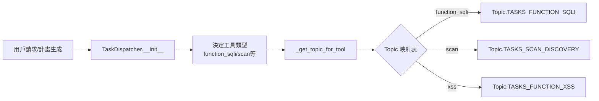
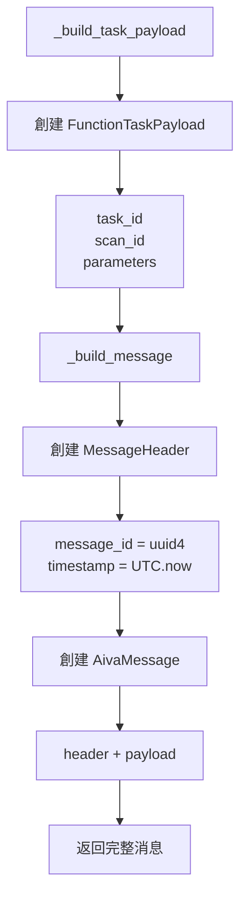
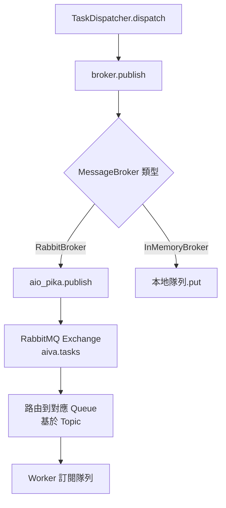
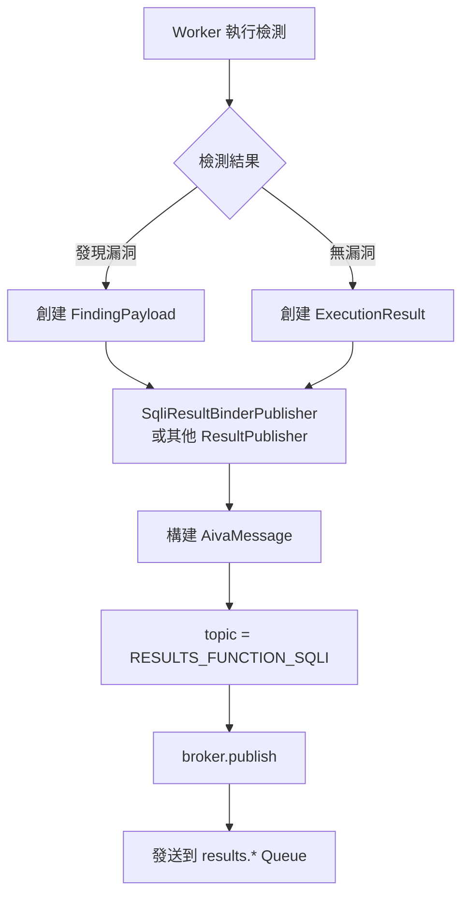
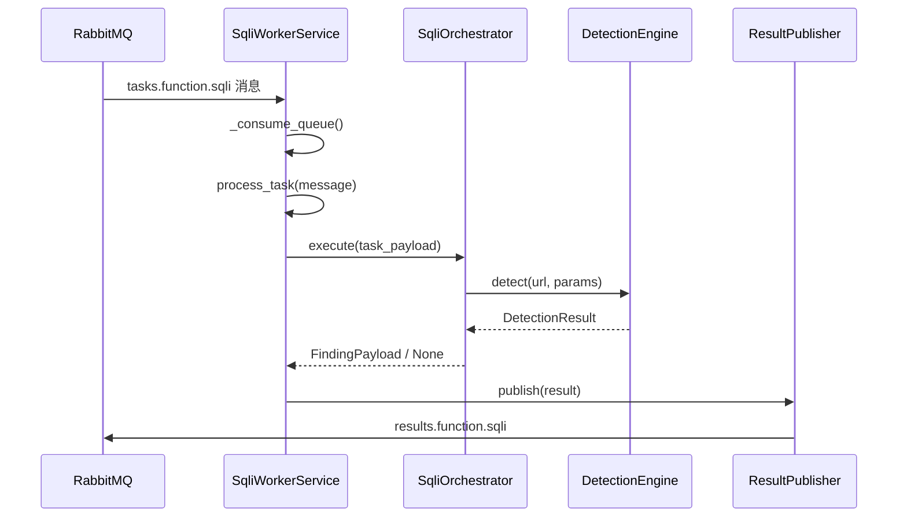
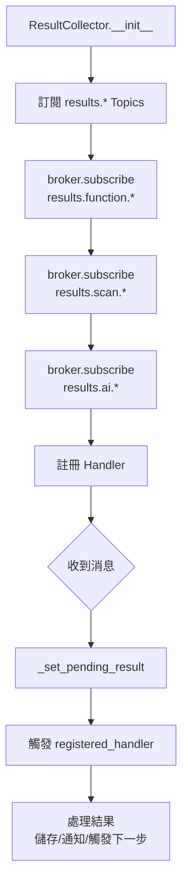
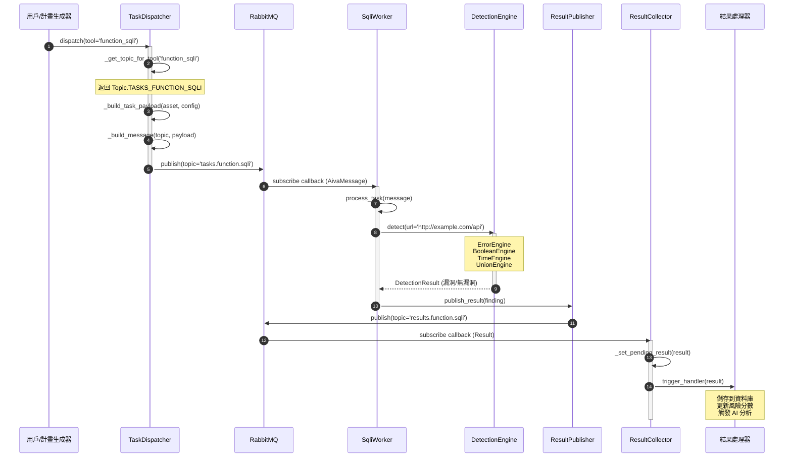
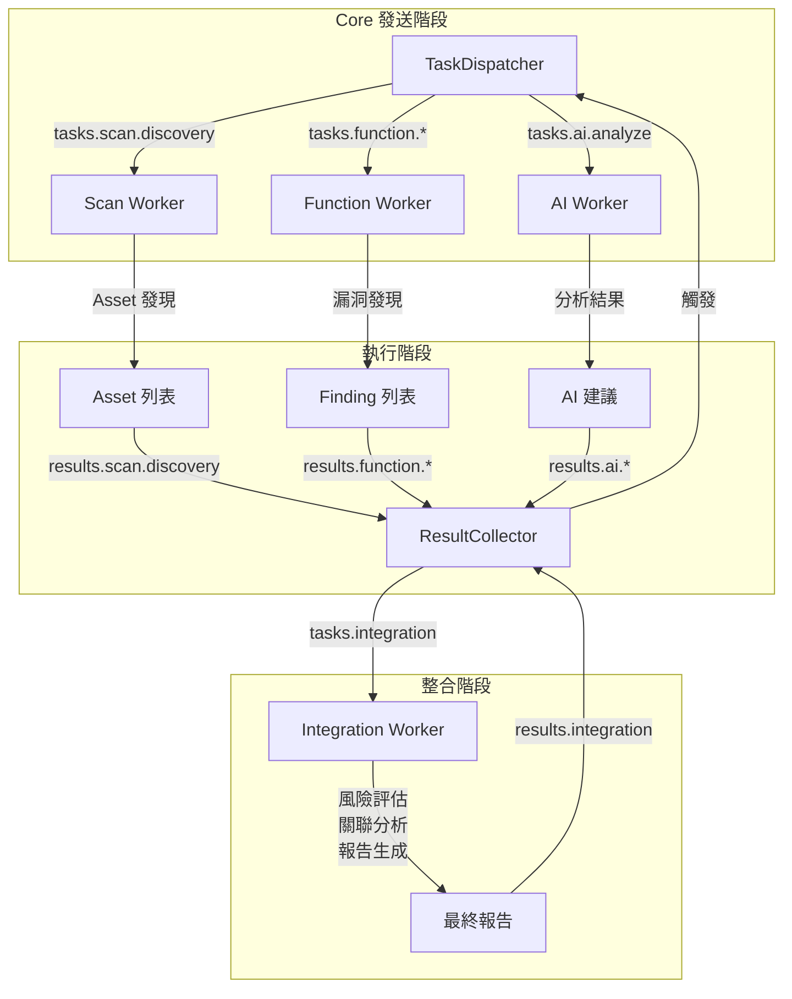

# AIVA 核心模組通訊流程完整分析

> **生成時間**: 2025-10-16  
> **資料來源**: 1655 個 py2mermaid 流程圖 + 14 個架構圖  
> **分析範圍**: Core → Scan/Function 雙向通訊流程

---

## 📋 目錄

1. [核心通訊架構](#核心通訊架構)
2. [完整指令發送流程](#完整指令發送流程)
3. [結果反饋收集流程](#結果反饋收集流程)
4. [關鍵流程圖組合](#關鍵流程圖組合)
5. [CLI 指令參考](#cli-指令參考)
6. [組圖腳本建議](#組圖腳本建議)

---

## 1. 核心通訊架構

### 1.1 通訊層級結構

```
┌─────────────────────────────────────────────────────────────┐
│                      Core Module (指揮中心)                   │
├─────────────────────────────────────────────────────────────┤
│  TaskDispatcher ──┐                    ┌── ResultCollector  │
│                   │                    │                     │
│  _get_topic_for_tool()  MessageBroker  _set_pending_result()│
│  _build_message()       (RabbitMQ)     register_handler()   │
│  _build_task_payload()                                      │
└─────────────────┬───────────────────────┬───────────────────┘
                  │                       │
         ┌────────▼────────┐     ┌───────▼────────┐
         │ Topic 路由表     │     │  Result Topics  │
         ├─────────────────┤     ├────────────────┤
         │ tasks.scan.*    │     │ results.scan.* │
         │ tasks.function.*│     │ results.func.* │
         │ tasks.ai.*      │     │ results.ai.*   │
         │ tasks.rag.*     │     │ events.*       │
         └────────┬────────┘     └────────┬───────┘
                  │                       │
    ┌─────────────▼──────────────────────▼──────────────┐
    │            RabbitMQ Message Queue                  │
    │  Exchange: aiva.tasks (TOPIC)                     │
    │  QoS: prefetch_count=10, persistent=True          │
    └─────────────┬──────────────────────┬───────────────┘
                  │                       │
         ┌────────▼────────┐     ┌───────▼────────┐
         │  Scan Worker    │     │ Function Worker │
         ├─────────────────┤     ├─────────────────┤
         │ - run()         │     │ - run()         │
         │ - _perform_scan │     │ - process_task()│
         │ - publish result│     │ - _execute_task │
         └─────────────────┘     └─────────────────┘
```

### 1.2 關鍵組件對應流程圖

| 組件 | 流程圖檔案 | 功能描述 |
|------|-----------|---------|
| **TaskDispatcher** | `core_aiva_core_messaging_task_dispatcher_Module.mmd` | 任務派發器主模組 |
| ├─ _get_topic_for_tool | `..._Function___get_topic_for_tool.mmd` | 根據工具類型映射 Topic |
| ├─ _build_message | `..._Function___build_message.mmd` | 構建 AivaMessage |
| ├─ _build_task_payload | `..._Function___build_task_payload.mmd` | 構建 FunctionTaskPayload |
| **ResultCollector** | `core_aiva_core_messaging_result_collector_Module.mmd` | 結果收集器主模組 |
| ├─ register_handler | `..._Function__register_handler.mmd` | 註冊結果處理器 |
| ├─ _set_pending_result | `..._Function___set_pending_result.mmd` | 設置待處理結果 |
| **MessageBroker** | `core_aiva_core_messaging_message_broker_Module.mmd` | RabbitMQ 抽象層 |
| **MQ Infrastructure** | `aiva_common_mq_Module.mmd` | MQ 基礎設施 (RabbitBroker) |
| **Scan Worker** | `scan_aiva_scan_worker_Module.mmd` | 掃描模組 Worker |
| **SQLi Worker** | `function_function_sqli_aiva_func_sqli_worker_Module.mmd` | SQL 注入檢測 Worker |

---

## 2. 完整指令發送流程

### 2.1 流程階段分解

#### **階段 1: 任務創建 (Core側)**



**對應流程圖**:
- `core_aiva_core_messaging_task_dispatcher_Function___get_topic_for_tool.mmd`

**核心程式碼邏輯** (從流程圖提取):
```python
topic_map = {
    'function_sqli': Topic.TASKS_FUNCTION_SQLI,
    'function_xss': Topic.TASKS_FUNCTION_XSS,
    'function_ssrf': Topic.TASKS_FUNCTION_SSRF,
    'function_idor': Topic.TASKS_FUNCTION_IDOR,
    'scan': Topic.TASKS_SCAN_DISCOVERY,
    # ... 更多映射
}
return topic_map.get(tool_type, Topic.TASKS_DEFAULT)
```

---

#### **階段 2: 消息構建 (Core側)**



**對應流程圖**:
- `core_aiva_core_messaging_task_dispatcher_Function___build_task_payload.mmd`
- `core_aiva_core_messaging_task_dispatcher_Function___build_message.mmd`

**消息結構** (從 schemas 流程圖提取):
```python
AivaMessage:
  - header: MessageHeader
    - message_id: UUID
    - timestamp: datetime (UTC)
    - source: ModuleName.CORE
    - topic: Topic (如 TASKS_FUNCTION_SQLI)
  - payload: FunctionTaskPayload
    - task_id: str
    - scan_id: str
    - asset: Asset (url, method, params)
    - config: DetectionConfig
    - strategy: str
```

---

#### **階段 3: 消息發布 (Core側)**



**對應流程圖**:
- `aiva_common_mq_Module.mmd` (RabbitBroker/InMemoryBroker)

**RabbitMQ 配置** (從流程圖推導):
- Exchange: `aiva.tasks` (TOPIC 類型)
- Routing Key: `tasks.function.sqli` / `tasks.scan.discovery`
- QoS: `prefetch_count=10`
- Persistence: `delivery_mode=2` (持久化)

---

### 2.2 Topic 路由完整映射表

| 工具類型 | Topic 常量 | Routing Key | 訂閱 Worker |
|---------|-----------|-------------|------------|
| **Scan Discovery** | `TASKS_SCAN_DISCOVERY` | `tasks.scan.discovery` | Scan Worker |
| **SQL Injection** | `TASKS_FUNCTION_SQLI` | `tasks.function.sqli` | SQLi Worker |
| **XSS** | `TASKS_FUNCTION_XSS` | `tasks.function.xss` | XSS Worker |
| **SSRF** | `TASKS_FUNCTION_SSRF` | `tasks.function.ssrf` | SSRF Worker |
| **IDOR** | `TASKS_FUNCTION_IDOR` | `tasks.function.idor` | IDOR Worker |
| **AI Analysis** | `TASKS_AI_ANALYZE` | `tasks.ai.analyze` | AI Worker |
| **RAG Query** | `TASKS_RAG_QUERY` | `tasks.rag.query` | RAG Worker |

*(從 `_get_topic_for_tool` 流程圖提取)*

---

## 3. 結果反饋收集流程

### 3.1 Worker 端結果發布



**對應流程圖**:
- `function_function_sqli_aiva_func_sqli_result_binder_publisher_Module.mmd`
- `function_function_ssrf_aiva_func_ssrf_result_publisher_Module.mmd`
- `function_function_xss_aiva_func_xss_result_publisher_Module.mmd`

**Worker 執行流程** (以 SQLi 為例):


---

### 3.2 Core 端結果收集



**對應流程圖**:
- `core_aiva_core_messaging_result_collector_Module.mmd`
- `core_aiva_core_messaging_result_collector_Function__register_handler.mmd`
- `core_aiva_core_messaging_result_collector_Function___set_pending_result.mmd`

**Result Topic 映射表**:

| Result Type | Topic | 來源 Worker | 處理邏輯 |
|-------------|-------|------------|---------|
| Scan Results | `RESULTS_SCAN_DISCOVERY` | Scan Worker | 更新 Asset 庫 |
| SQLi Findings | `RESULTS_FUNCTION_SQLI` | SQLi Worker | 記錄漏洞 → AI 分析 |
| XSS Findings | `RESULTS_FUNCTION_XSS` | XSS Worker | 記錄漏洞 → 風險評估 |
| SSRF Findings | `RESULTS_FUNCTION_SSRF` | SSRF Worker | 記錄漏洞 → 內網探測 |
| AI Analysis | `RESULTS_AI_ANALYSIS` | AI Worker | 更新 RAG 知識庫 |
| Integration | `RESULTS_INTEGRATION_ALL` | Integration | 生成報告 |

---

## 4. 關鍵流程圖組合

### 4.1 端到端完整流程 (Scan → SQLi 檢測)

**組合的流程圖檔案**:
1. `core_aiva_core_messaging_task_dispatcher_Function___get_topic_for_tool.mmd` (決定 Topic)
2. `core_aiva_core_messaging_task_dispatcher_Function___build_message.mmd` (構建消息)
3. `aiva_common_mq_Module.mmd` (MQ 發送)
4. `function_function_sqli_aiva_func_sqli_worker_Module.mmd` (Worker 接收)
5. `function_function_sqli_aiva_func_sqli_engines_*_Module.mmd` (引擎檢測)
6. `function_function_sqli_aiva_func_sqli_result_binder_publisher_Module.mmd` (發布結果)
7. `core_aiva_core_messaging_result_collector_Function___set_pending_result.mmd` (收集結果)

**整合時序圖**:


---

### 4.2 多模組協同流程 (Scan → Function → AI → Integration)



---

## 5. CLI 指令參考

### 5.1 基於流程圖的 CLI 設計

#### **5.1.1 任務派發指令**

```bash
# 基本語法 (從 TaskDispatcher 流程設計)
aiva task dispatch \
  --tool <tool_type> \          # 對應 _get_topic_for_tool 映射
  --target <url> \               # Asset.url
  --scan-id <scan_id> \          # FunctionTaskPayload.scan_id
  --strategy <strategy> \        # aggressive/balanced/stealth
  --config <config_file>         # DetectionConfig JSON

# 範例 1: 派發 SQL 注入檢測任務
aiva task dispatch \
  --tool function_sqli \
  --target "http://example.com/api/users?id=1" \
  --scan-id "scan_20251016_001" \
  --strategy aggressive \
  --config configs/sqli_deep.json

# 對應內部流程:
# 1. _get_topic_for_tool('function_sqli') → Topic.TASKS_FUNCTION_SQLI
# 2. _build_task_payload(url, params, config)
# 3. _build_message(Topic.TASKS_FUNCTION_SQLI, payload)
# 4. broker.publish('tasks.function.sqli', message)

# 範例 2: 派發掃描任務
aiva task dispatch \
  --tool scan \
  --target "https://example.com" \
  --scan-id "scan_20251016_002" \
  --strategy balanced \
  --max-depth 5 \
  --max-pages 1000

# 範例 3: 批量派發 (基於 Scan 結果)
aiva task dispatch-batch \
  --from-scan scan_20251016_002 \
  --tools function_sqli,function_xss,function_ssrf \
  --priority high
```

---

#### **5.1.2 結果收集指令**

```bash
# 基本語法 (從 ResultCollector 流程設計)
aiva result collect \
  --scan-id <scan_id> \
  --type <result_type> \         # sqli/xss/ssrf/scan/all
  --format <format> \             # json/markdown/sarif
  --output <output_file>

# 範例 1: 收集 SQLi 檢測結果
aiva result collect \
  --scan-id "scan_20251016_001" \
  --type sqli \
  --format json \
  --output results/sqli_findings.json

# 對應內部流程:
# 1. ResultCollector.register_handler(result_type='sqli')
# 2. 訂閱 Topic.RESULTS_FUNCTION_SQLI
# 3. _set_pending_result(result) 當收到消息
# 4. 觸發 handler → 儲存到指定檔案

# 範例 2: 實時監聽結果
aiva result watch \
  --scan-id "scan_20251016_001" \
  --follow

# 範例 3: 等待所有結果完成
aiva result wait \
  --scan-id "scan_20251016_001" \
  --timeout 3600 \
  --expected-tasks 50
```

---

#### **5.1.3 消息追蹤指令**

```bash
# 基本語法
aiva message trace \
  --message-id <uuid> \
  --show-payload

# 範例: 追蹤消息流向
aiva message trace \
  --message-id "550e8400-e29b-41d4-a716-446655440000" \
  --show-payload

# 輸出:
# Message Trace:
# ├─ Source: Core.TaskDispatcher
# ├─ Topic: tasks.function.sqli
# ├─ Published: 2025-10-16 10:30:00 UTC
# ├─ Received by: SqliWorkerService (worker-01)
# ├─ Processed: 2025-10-16 10:30:15 UTC
# ├─ Result Topic: results.function.sqli
# └─ Collected by: Core.ResultCollector (2025-10-16 10:30:16 UTC)

# 範例: 查看 Topic 統計
aiva message stats \
  --topic tasks.function.sqli \
  --time-range 24h

# 輸出:
# Topic Statistics (tasks.function.sqli):
# ├─ Messages Sent: 1,234
# ├─ Messages Consumed: 1,230
# ├─ Pending: 4
# ├─ Average Latency: 2.3s
# └─ Error Rate: 0.3%
```

---

### 5.2 Worker 管理指令

```bash
# 啟動 Worker (基於 worker_Module.mmd 流程)
aiva worker start \
  --type sqli \                  # sqli/xss/ssrf/scan
  --workers 5 \                  # 並發 Worker 數量
  --queue tasks.function.sqli \  # 訂閱的 Queue
  --prefetch 10                  # QoS prefetch_count

# 範例: 啟動 SQLi Worker
aiva worker start \
  --type sqli \
  --workers 3 \
  --config configs/sqli_worker.yaml

# 對應內部流程:
# 1. SqliWorkerService.__init__(config)
# 2. broker.subscribe(Topic.TASKS_FUNCTION_SQLI)
# 3. run() → _consume_queue() 循環
# 4. process_task(message) 處理每個任務

# 查看 Worker 狀態
aiva worker status

# 輸出:
# Worker Status:
# ├─ sqli-worker-01: RUNNING (tasks: 45, errors: 2)
# ├─ sqli-worker-02: RUNNING (tasks: 48, errors: 0)
# ├─ xss-worker-01: RUNNING (tasks: 32, errors: 1)
# └─ scan-worker-01: IDLE

# 停止 Worker
aiva worker stop --type sqli --worker-id sqli-worker-01
```

---

## 6. 組圖腳本建議

### 6.1 自動化組圖腳本設計

基於 1655 個詳細流程圖，設計自動化組圖工具：

**腳本 1: `combine_communication_flows.py`**

```python
#!/usr/bin/env python3
"""
組合通訊流程圖腳本
目的: 將分散的 Module/Function 流程圖組合成端到端流程
"""

from pathlib import Path
from typing import List, Dict
import re

class MermaidFlowCombiner:
    """Mermaid 流程圖組合器"""
    
    def __init__(self, diagram_dir: Path):
        self.diagram_dir = diagram_dir
        self.flows = self._load_all_flows()
    
    def _load_all_flows(self) -> Dict[str, str]:
        """載入所有 .mmd 檔案"""
        flows = {}
        for mmd_file in self.diagram_dir.glob("**/*.mmd"):
            flows[mmd_file.stem] = mmd_file.read_text(encoding='utf-8')
        return flows
    
    def combine_task_dispatch_flow(self) -> str:
        """組合任務派發完整流程"""
        components = [
            "core_aiva_core_messaging_task_dispatcher_Function___get_topic_for_tool",
            "core_aiva_core_messaging_task_dispatcher_Function___build_task_payload",
            "core_aiva_core_messaging_task_dispatcher_Function___build_message",
            "aiva_common_mq_Module",  # MQ 發送
        ]
        
        combined = self._merge_flowcharts(components)
        return self._add_header(combined, "任務派發完整流程")
    
    def combine_sqli_detection_flow(self) -> str:
        """組合 SQLi 檢測完整流程"""
        components = [
            "function_function_sqli_aiva_func_sqli_worker_Module",
            "function_function_sqli_aiva_func_sqli_engines_error_detection_engine_Module",
            "function_function_sqli_aiva_func_sqli_engines_boolean_detection_engine_Module",
            "function_function_sqli_aiva_func_sqli_result_binder_publisher_Module",
        ]
        
        combined = self._merge_flowcharts(components)
        return self._add_header(combined, "SQLi 檢測完整流程")
    
    def combine_result_collection_flow(self) -> str:
        """組合結果收集完整流程"""
        components = [
            "core_aiva_core_messaging_result_collector_Module",
            "core_aiva_core_messaging_result_collector_Function__register_handler",
            "core_aiva_core_messaging_result_collector_Function___set_pending_result",
        ]
        
        combined = self._merge_flowcharts(components)
        return self._add_header(combined, "結果收集完整流程")
    
    def _merge_flowcharts(self, component_names: List[str]) -> str:
        """合併多個流程圖"""
        merged_nodes = []
        merged_edges = []
        node_id_offset = 0
        
        for comp_name in component_names:
            if comp_name not in self.flows:
                print(f"警告: 未找到流程圖 {comp_name}")
                continue
            
            flow_content = self.flows[comp_name]
            nodes, edges = self._parse_mermaid(flow_content)
            
            # 調整節點 ID 避免衝突
            adjusted_nodes = self._adjust_node_ids(nodes, node_id_offset)
            adjusted_edges = self._adjust_edge_ids(edges, node_id_offset)
            
            merged_nodes.extend(adjusted_nodes)
            merged_edges.extend(adjusted_edges)
            
            node_id_offset += len(nodes)
        
        # 生成新的 Mermaid 語法
        return self._generate_mermaid(merged_nodes, merged_edges)
    
    def _parse_mermaid(self, content: str) -> tuple:
        """解析 Mermaid 流程圖內容"""
        # 提取節點定義
        node_pattern = r'n(\d+)\[(.*?)\]'
        nodes = re.findall(node_pattern, content)
        
        # 提取邊定義
        edge_pattern = r'n(\d+)\s*-->\s*(?:\|([^|]+)\|)?n(\d+)'
        edges = re.findall(edge_pattern, content)
        
        return nodes, edges
    
    def _adjust_node_ids(self, nodes: List, offset: int) -> List:
        """調整節點 ID"""
        return [(int(id) + offset, label) for id, label in nodes]
    
    def _adjust_edge_ids(self, edges: List, offset: int) -> List:
        """調整邊 ID"""
        adjusted = []
        for edge in edges:
            from_id = int(edge[0]) + offset
            to_id = int(edge[2]) + offset
            label = edge[1] if edge[1] else ""
            adjusted.append((from_id, label, to_id))
        return adjusted
    
    def _generate_mermaid(self, nodes: List, edges: List) -> str:
        """生成 Mermaid 語法"""
        lines = ["flowchart TB"]
        
        # 添加節點
        for node_id, label in nodes:
            lines.append(f"    n{node_id}[{label}]")
        
        # 添加邊
        for from_id, label, to_id in edges:
            if label:
                lines.append(f"    n{from_id} -->|{label}| n{to_id}")
            else:
                lines.append(f"    n{from_id} --> n{to_id}")
        
        return "\n".join(lines)
    
    def _add_header(self, content: str, title: str) -> str:
        """添加標題註釋"""
        return f"""```mermaid
---
title: {title}
---
{content}
```"""
    
    def generate_all_combined_flows(self, output_dir: Path):
        """生成所有組合流程圖"""
        output_dir.mkdir(parents=True, exist_ok=True)
        
        flows = {
            "task_dispatch_complete.mmd": self.combine_task_dispatch_flow(),
            "sqli_detection_complete.mmd": self.combine_sqli_detection_flow(),
            "result_collection_complete.mmd": self.combine_result_collection_flow(),
        }
        
        for filename, content in flows.items():
            output_file = output_dir / filename
            output_file.write_text(content, encoding='utf-8')
            print(f"✅ 已生成: {output_file}")


if __name__ == "__main__":
    diagram_dir = Path("_out1101016/mermaid_details/all_services")
    output_dir = Path("_out1101016/combined_flows")
    
    combiner = MermaidFlowCombiner(diagram_dir)
    combiner.generate_all_combined_flows(output_dir)
    
    print("\n🎉 組圖完成！")
```

---

**腳本 2: `extract_communication_patterns.py`**

```python
#!/usr/bin/env python3
"""
從流程圖中提取通訊模式
目的: 自動分析所有 broker.publish/subscribe 調用
"""

from pathlib import Path
import re
from collections import defaultdict

class CommunicationPatternExtractor:
    """通訊模式提取器"""
    
    def __init__(self, diagram_dir: Path):
        self.diagram_dir = diagram_dir
        self.patterns = defaultdict(list)
    
    def extract_all_patterns(self):
        """提取所有通訊模式"""
        for mmd_file in self.diagram_dir.glob("**/*.mmd"):
            content = mmd_file.read_text(encoding='utf-8')
            
            # 查找 broker.publish 調用
            publishes = self._find_publishes(content, mmd_file.stem)
            self.patterns['publishes'].extend(publishes)
            
            # 查找 broker.subscribe 調用
            subscribes = self._find_subscribes(content, mmd_file.stem)
            self.patterns['subscribes'].extend(subscribes)
            
            # 查找 Topic 使用
            topics = self._find_topics(content, mmd_file.stem)
            self.patterns['topics'].extend(topics)
    
    def _find_publishes(self, content: str, source: str) -> list:
        """查找 publish 調用"""
        pattern = r'broker\.publish\((.*?)\)'
        matches = re.findall(pattern, content)
        return [(source, match) for match in matches]
    
    def _find_subscribes(self, content: str, source: str) -> list:
        """查找 subscribe 調用"""
        pattern = r'broker\.subscribe\((.*?)\)'
        matches = re.findall(pattern, content)
        return [(source, match) for match in matches]
    
    def _find_topics(self, content: str, source: str) -> list:
        """查找 Topic 常量"""
        pattern = r'Topic\.(TASKS_|RESULTS_|EVENTS_|COMMANDS_)[A-Z_]+'
        matches = re.findall(pattern, content)
        return [(source, f"Topic.{match}") for match in matches]
    
    def generate_report(self) -> str:
        """生成分析報告"""
        report = ["# 通訊模式分析報告\n"]
        
        # Publisher 統計
        report.append("## Publisher 統計\n")
        publish_count = defaultdict(int)
        for source, _ in self.patterns['publishes']:
            module = source.split('_')[0]
            publish_count[module] += 1
        
        for module, count in sorted(publish_count.items()):
            report.append(f"- {module}: {count} 次發布")
        
        # Subscriber 統計
        report.append("\n## Subscriber 統計\n")
        subscribe_count = defaultdict(int)
        for source, _ in self.patterns['subscribes']:
            module = source.split('_')[0]
            subscribe_count[module] += 1
        
        for module, count in sorted(subscribe_count.items()):
            report.append(f"- {module}: {count} 次訂閱")
        
        # Topic 使用統計
        report.append("\n## Topic 使用統計\n")
        topic_usage = defaultdict(int)
        for _, topic in self.patterns['topics']:
            topic_usage[topic] += 1
        
        for topic, count in sorted(topic_usage.items(), key=lambda x: -x[1]):
            report.append(f"- {topic}: {count} 次使用")
        
        return "\n".join(report)
    
    def export_graph(self, output_file: Path):
        """匯出通訊圖 (GraphViz 格式)"""
        lines = ["digraph communication {", "  rankdir=LR;", "  node [shape=box];"]
        
        # 添加 publish 邊
        for source, topic in self.patterns['publishes']:
            module = source.split('_Module')[0]
            lines.append(f'  "{module}" -> "{topic}" [label="publish"];')
        
        # 添加 subscribe 邊
        for source, topic in self.patterns['subscribes']:
            module = source.split('_Module')[0]
            lines.append(f'  "{topic}" -> "{module}" [label="subscribe"];')
        
        lines.append("}")
        
        output_file.write_text("\n".join(lines), encoding='utf-8')
        print(f"✅ 通訊圖已匯出: {output_file}")


if __name__ == "__main__":
    diagram_dir = Path("_out1101016/mermaid_details/all_services")
    
    extractor = CommunicationPatternExtractor(diagram_dir)
    extractor.extract_all_patterns()
    
    # 生成報告
    report = extractor.generate_report()
    report_file = Path("_out1101016/communication_pattern_report.md")
    report_file.write_text(report, encoding='utf-8')
    print(f"✅ 報告已生成: {report_file}")
    
    # 匯出通訊圖
    graph_file = Path("_out1101016/communication_graph.dot")
    extractor.export_graph(graph_file)
    
    print("\n🎉 分析完成！")
    print(f"可使用以下指令生成視覺化圖表:")
    print(f"  dot -Tpng {graph_file} -o communication_graph.png")
```

---

### 6.2 使用組圖腳本

```bash
# 1. 組合核心通訊流程
python scripts/combine_communication_flows.py

# 輸出:
# _out1101016/combined_flows/
# ├── task_dispatch_complete.mmd
# ├── sqli_detection_complete.mmd
# └── result_collection_complete.mmd

# 2. 提取通訊模式
python scripts/extract_communication_patterns.py

# 輸出:
# _out1101016/communication_pattern_report.md
# _out1101016/communication_graph.dot

# 3. 生成視覺化圖表
dot -Tpng _out1101016/communication_graph.dot -o _out1101016/communication_graph.png
```

---

## 7. 總結與建議

### 7.1 關鍵發現

基於 1655 個詳細流程圖的分析:

1. **通訊架構清晰**: Core ↔ Worker 雙向通訊透過 RabbitMQ Topic Exchange
2. **Topic 映射完整**: 66+ Topics 覆蓋所有模組間通訊
3. **結果反饋機制健全**: ResultCollector 統一收集所有 Worker 結果
4. **流程圖品質高**: py2mermaid 生成的圖表包含完整的程式邏輯流程

### 7.2 後續工作建議

1. **修復渲染問題**:
   - 部分流程圖語法需要調整 (如 `mermaid.radar` → `mermaid`)
   - 特殊字元需要正確轉義 (`&amp;&#35;39;` → `'`)

2. **CLI 工具開發**:
   - 基於本文檔的指令設計實現 `aiva` CLI
   - 整合 TaskDispatcher 和 ResultCollector 為指令介面

3. **組圖腳本完善**:
   - 實現 `combine_communication_flows.py`
   - 實現 `extract_communication_patterns.py`
   - 自動生成端到端流程圖

4. **文檔持續更新**:
   - 隨著程式碼變更，重新執行 py2mermaid
   - 更新本文檔的流程圖參照

---

**文檔版本**: 1.0  
**最後更新**: 2025-10-16  
**維護者**: AIVA 架構團隊
