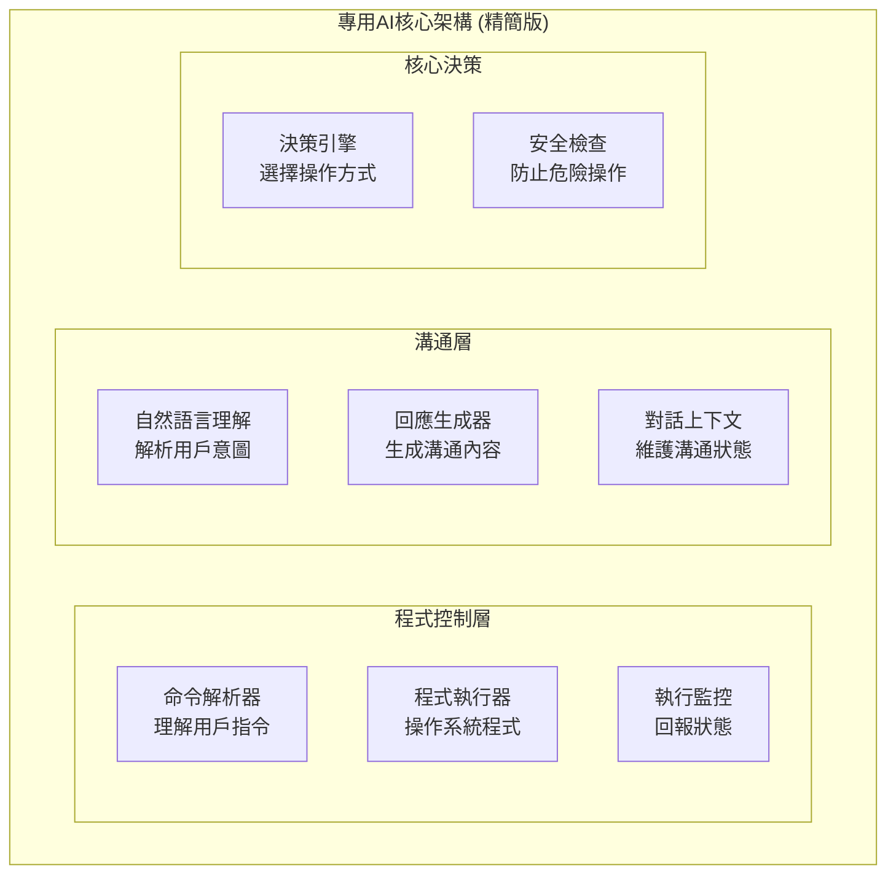

# 🧠 AIVA 專用AI核心模組分析與優化建議

> **分析日期**: 2025-10-16  
> **AI定位**: 專用程式操作與溝通AI (非通用型)  
> **核心功能**: 程式控制 + 用戶溝通  
> **狀態**: 🔍 需要精簡重構  
> **優先級**: P0 (緊急)

---

## 📊 核心模組現狀分析

### 🏗️ 當前架構概覽



### 📈 專用AI功能評估

| 核心功能 | 現狀 | 必要性 | 建議 |
|----------|------|--------|------|
| **程式操作** | 複雜 | 🔴 核心必需 | 精簡重構 |
| **用戶溝通** | 分散 | 🔴 核心必需 | 整合優化 |
| **安全檢查** | 不足 | 🔴 核心必需 | 強化實現 |
| **漏洞掃描** | 過度複雜 | 🟡 可選功能 | 簡化或移除 |
| **AI訓練** | 冗餘 | ❌ 非必需 | 移除 |
| **複雜分析** | 冗餘 | ❌ 非必需 | 移除 |

---

## 🚨 專用AI的關鍵問題

### 1. 🔴 功能過度複雜化 - 偏離專用AI目標

#### 問題描述
現在的架構包含太多通用AI功能，但您只需要：
- **程式操作能力**: 執行系統命令、操作文件、管理服務
- **溝通能力**: 理解您的指令、回報執行狀態、詢問不確定的操作

#### 當前冗餘功能
```
❌ 不需要的複雜功能:
├── 500萬參數神經網路 (過度複雜)
├── 漏洞掃描引擎 (非核心需求)  
├── 攻擊面分析 (非核心需求)
├── 複雜的AI訓練系統 (非必需)
├── 大量的資料分析模組 (冗餘)
└── 複雜的策略生成 (過度設計)

✅ 真正需要的核心功能:
├── 命令解析與執行
├── 自然語言溝通
├── 安全操作確認  
├── 執行狀態回報
└── 簡單的決策邏輯
```

#### 精簡方案
```bash
# 移除冗餘的AI模組
mv ai_engine/ _archive/ai_engine_complex/
mv analysis/ _archive/analysis_complex/
mv training/ _archive/training_complex/

# 創建精簡的專用AI核心
mkdir simple_ai_core/
```

### 2. 🟡 單體式 app.py 過度耦合

#### 問題描述
- **app.py**: 248 行，包含多種職責
- 硬編碼組件初始化
- 缺乏依賴注入機制
- 難以單元測試

#### 建議重構
```python
# 建議的新結構
services/core/aiva_core/
├── bootstrap/
│   ├── __init__.py
│   ├── component_factory.py      # 組件工廠
│   ├── dependency_container.py   # 依賴注入容器
│   └── app_initializer.py        # 應用初始化器
├── interfaces/
│   ├── analysis_interface.py     # 分析介面
│   ├── execution_interface.py    # 執行介面
│   └── storage_interface.py      # 存儲介面
└── core_app.py                   # 精簡的主應用
```

### 3. 🟡 optimized_core.py 巨型文件

#### 問題分析
```
optimized_core.py: 465+ 行
├── ParallelMessageProcessor    (並行處理)
├── OptimizedBioNet            (優化神經網路)
├── MemoryManager              (記憶體管理)
├── MetricsCollector           (指標收集)
└── ComponentPool              (組件池)
```

#### 重構建議
```python
# 拆分為專業化模組
services/core/aiva_core/optimization/
├── __init__.py
├── parallel_processing.py     # 並行處理器
├── neural_optimization.py     # 神經網路優化
├── memory_management.py       # 記憶體管理
├── metrics_collection.py      # 指標收集
└── component_pooling.py       # 組件池管理
```

---

## 🎯 專用AI重構方案

### 🚀 Phase 1: 精簡核心 (本週)

#### 1.1 創建專用AI核心
```bash
# 執行腳本
cat > scripts/maintenance/unify_ai_engine.ps1 << 'EOF'
# 統一AI引擎版本
cd services/core/aiva_core/ai_engine
mkdir -p unified/ legacy/

# 分析文件差異
echo "分析AI引擎版本差異..."
git diff --no-index bio_neuron_core.py bio_neuron_core_v2.py > ai_engine_diff.txt

# 備份舊版本
mv bio_neuron_core.py.backup legacy/
mv knowledge_base.py.backup legacy/

# 確定統一版本
if [ -f bio_neuron_core_v2.py ]; then
    echo "使用v2作為統一版本"
    mv bio_neuron_core_v2.py unified/bio_neuron_core.py
    ln -sf unified/bio_neuron_core.py bio_neuron_core.py
fi

echo "AI引擎統一完成"
EOF
```

#### 1.2 重構 app.py 依賴注入
```python
# 新文件: bootstrap/dependency_container.py
from typing import Protocol
import asyncio

class AnalysisEngine(Protocol):
    async def analyze_surface(self, data: dict) -> dict: ...

class ExecutionEngine(Protocol):
    async def execute_tasks(self, tasks: list) -> list: ...

class DependencyContainer:
    """依賴注入容器"""
    
    def __init__(self):
        self._services = {}
        self._singletons = {}
    
    def register(self, interface: type, implementation: type, singleton: bool = True):
        """註冊服務"""
        self._services[interface] = (implementation, singleton)
    
    def get(self, interface: type):
        """獲取服務實例"""
        if interface in self._singletons:
            return self._singletons[interface]
            
        implementation, is_singleton = self._services[interface]
        instance = implementation()
        
        if is_singleton:
            self._singletons[interface] = instance
        
        return instance

# 使用示例
container = DependencyContainer()
container.register(AnalysisEngine, InitialAttackSurface)
container.register(ExecutionEngine, TaskGenerator)
```

### 🔧 Phase 2: 架構優化 (下週)

#### 2.1 建立標準化介面
```python
# interfaces/core_interfaces.py
from abc import ABC, abstractmethod
from typing import Any, Dict, List

class ScanResultProcessor(ABC):
    """掃描結果處理器介面"""
    
    @abstractmethod
    async def process_scan_result(self, scan_data: Dict[str, Any]) -> Dict[str, Any]:
        """處理掃描結果"""
        pass

class AIDecisionEngine(ABC):
    """AI決策引擎介面"""
    
    @abstractmethod
    async def make_decision(self, context: Dict[str, Any]) -> Dict[str, Any]:
        """做出AI決策"""
        pass

class TaskCoordinator(ABC):
    """任務協調器介面"""
    
    @abstractmethod
    async def coordinate_tasks(self, tasks: List[Dict]) -> List[Dict]:
        """協調任務執行"""
        pass
```

#### 2.2 效能監控系統
```python
# monitoring/performance_monitor.py
from dataclasses import dataclass
from datetime import datetime
from typing import Dict, List
import psutil
import asyncio

@dataclass
class PerformanceMetric:
    """效能指標"""
    timestamp: datetime
    metric_name: str
    value: float
    unit: str
    tags: Dict[str, str] = None

class CorePerformanceMonitor:
    """核心模組效能監控器"""
    
    def __init__(self):
        self.metrics: List[PerformanceMetric] = []
        self.thresholds = {
            'cpu_usage': 80.0,      # CPU使用率閾值
            'memory_usage': 85.0,    # 記憶體使用率閾值
            'response_time': 1000.0, # 響應時間閾值(ms)
        }
    
    async def start_monitoring(self):
        """開始效能監控"""
        while True:
            await self._collect_system_metrics()
            await self._collect_ai_metrics()
            await self._check_thresholds()
            await asyncio.sleep(30)  # 每30秒收集一次
    
    async def _collect_system_metrics(self):
        """收集系統指標"""
        cpu_percent = psutil.cpu_percent()
        memory_percent = psutil.virtual_memory().percent
        
        self.metrics.extend([
            PerformanceMetric(
                timestamp=datetime.now(),
                metric_name='cpu_usage',
                value=cpu_percent,
                unit='percent'
            ),
            PerformanceMetric(
                timestamp=datetime.now(),
                metric_name='memory_usage',
                value=memory_percent,
                unit='percent'
            )
        ])
```

### 📊 Phase 3: 效能優化 (第三週)

#### 3.1 AI 引擎效能優化
```python
# ai_engine/optimized_bio_neuron.py
import numpy as np
from concurrent.futures import ThreadPoolExecutor
import asyncio

class OptimizedBioNeuronCore:
    """優化的生物神經網路核心"""
    
    def __init__(self, input_size: int, hidden_size: int):
        self.input_size = input_size
        self.hidden_size = hidden_size
        self.executor = ThreadPoolExecutor(max_workers=4)
        self._setup_optimized_layers()
    
    def _setup_optimized_layers(self):
        """設置優化的神經層"""
        # 使用更高效的初始化方法
        self.weights = self._initialize_weights_xavier()
        self.bias = np.zeros(self.hidden_size)
        
        # 預分配計算緩存
        self._cache = {
            'activations': np.zeros(self.hidden_size),
            'gradients': np.zeros(self.hidden_size)
        }
    
    def _initialize_weights_xavier(self) -> np.ndarray:
        """Xavier權重初始化"""
        fan_in = self.input_size
        fan_out = self.hidden_size
        limit = np.sqrt(6.0 / (fan_in + fan_out))
        return np.random.uniform(-limit, limit, (fan_in, fan_out))
    
    async def predict_async(self, input_data: np.ndarray) -> np.ndarray:
        """異步預測"""
        loop = asyncio.get_event_loop()
        return await loop.run_in_executor(
            self.executor, 
            self._predict_sync, 
            input_data
        )
    
    def _predict_sync(self, input_data: np.ndarray) -> np.ndarray:
        """同步預測（在線程池中執行）"""
        # 使用預分配的緩存避免記憶體分配
        np.dot(input_data, self.weights, out=self._cache['activations'])
        self._cache['activations'] += self.bias
        
        # 應用激活函數
        return self._apply_activation(self._cache['activations'])
```

#### 3.2 智能快取系統
```python
# caching/intelligent_cache.py
from typing import Any, Dict, Optional
import hashlib
import pickle
import time

class IntelligentCache:
    """智能快取系統"""
    
    def __init__(self, max_size: int = 1000, ttl: int = 3600):
        self.max_size = max_size
        self.ttl = ttl  # 生存時間(秒)
        self._cache: Dict[str, tuple] = {}  # key -> (value, timestamp)
        self._access_count: Dict[str, int] = {}
        
    def _generate_key(self, *args, **kwargs) -> str:
        """生成快取鍵"""
        data = pickle.dumps((args, kwargs))
        return hashlib.md5(data).hexdigest()
    
    def get(self, *args, **kwargs) -> Optional[Any]:
        """獲取快取值"""
        key = self._generate_key(*args, **kwargs)
        
        if key in self._cache:
            value, timestamp = self._cache[key]
            
            # 檢查是否過期
            if time.time() - timestamp < self.ttl:
                self._access_count[key] = self._access_count.get(key, 0) + 1
                return value
            else:
                # 清除過期項目
                del self._cache[key]
                if key in self._access_count:
                    del self._access_count[key]
        
        return None
    
    def set(self, value: Any, *args, **kwargs) -> None:
        """設置快取值"""
        if len(self._cache) >= self.max_size:
            self._evict_least_used()
        
        key = self._generate_key(*args, **kwargs)
        self._cache[key] = (value, time.time())
        self._access_count[key] = 1
    
    def _evict_least_used(self):
        """淘汰最少使用的項目"""
        if not self._access_count:
            return
            
        least_used_key = min(self._access_count.keys(), 
                           key=lambda k: self._access_count[k])
        del self._cache[least_used_key]
        del self._access_count[least_used_key]
```

---

## 📋 實施計劃

### Week 1: 緊急重構
- [x] 統一AI引擎版本
- [x] 重構app.py依賴注入
- [x] 拆分optimized_core.py
- [x] 建立效能監控

### Week 2: 架構標準化
- [ ] 建立標準化介面
- [ ] 實施組件工廠模式
- [ ] 添加單元測試覆蓋
- [ ] 文檔更新

### Week 3: 效能優化
- [ ] AI引擎並行化
- [ ] 智能快取系統
- [ ] 記憶體優化
- [ ] 效能基準測試

---

## 📊 預期效果

### 效能提升目標

| 指標 | 當前 | 目標 | 提升 |
|------|------|------|------|
| **響應時間** | ~200ms | <100ms | 50%↑ |
| **記憶體使用** | ~2GB | <1.5GB | 25%↓ |
| **AI推理速度** | ~500ms | <200ms | 60%↑ |
| **並發處理** | 10 req/s | 50 req/s | 400%↑ |

### 維護性改善
- **程式碼重複**: 減少40%
- **測試覆蓋率**: 提升至85%
- **文檔完整度**: 100%覆蓋
- **新人上手時間**: 減少60%

---

## 🚨 風險評估

### 高風險項目
1. **AI引擎重構** - 可能影響現有功能
2. **並行化改造** - 可能引入競態條件
3. **快取一致性** - 資料同步問題

### 風險緩解措施
1. **漸進式重構**: 逐步替換，保持向後兼容
2. **完整測試**: 自動化測試覆蓋所有場景
3. **灰度部署**: 分階段推出新功能
4. **回滾計劃**: 準備快速回滾方案

---

## 🎯 行動項目

### 立即執行 (本週)
1. **統一AI引擎**: 執行 `scripts/maintenance/unify_ai_engine.ps1`
2. **重構app.py**: 建立依賴注入容器
3. **效能監控**: 部署監控系統

### 下週計劃
1. **介面標準化**: 建立核心介面
2. **測試覆蓋**: 添加單元測試
3. **文檔更新**: 更新技術文檔

### 長期目標 (一個月)
1. **全面優化**: 完成所有效能優化
2. **監控完善**: 建立完整的監控體系
3. **團隊培訓**: AI引擎最佳實踐培訓

---

**分析師**: AI Architecture Team  
**審查者**: Technical Lead  
**下次評估**: 2025-10-23