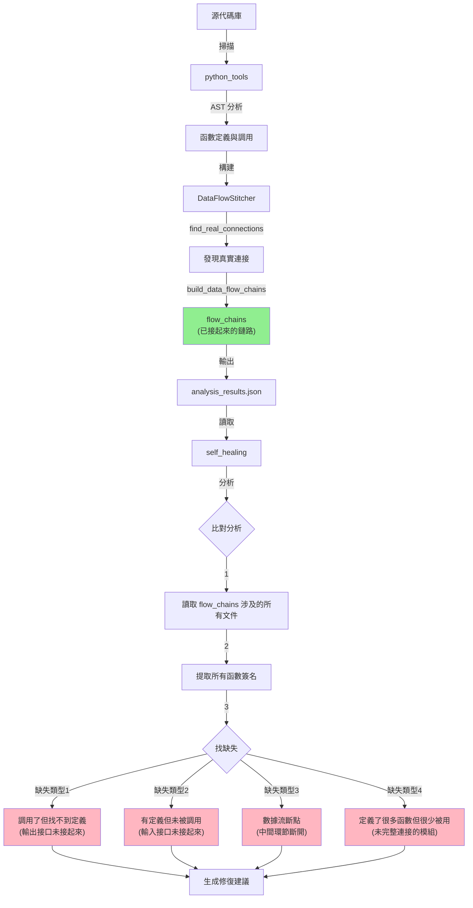

# Self-Healing 模組設計理念與邏輯分析
## 找出「尚未接起來的接口」- 與 python_tools 完全相反的設計

---

## 📑 目錄

- [🎯 核心設計理念](#-核心設計理念)
- [📂 模組架構](#-模組架構)
- [🔍 核心分析器詳解](#-核心分析器詳解)
- [📊 輸出格式](#-輸出格式)
- [🔄 工作流程](#-工作流程)

---

## 🎯 核心設計理念

### python_tools vs self_healing - 完全相反的設計

| 維度 | python_tools | self_healing |
|------|--------------|--------------|
| **目的** | **找到能夠連結的並接起來** | **找出尚未接起來的輸出入接口** |
| **工作方式** | 主動建立連接 | 發現缺失的連接 |
| **輸出** | `flow_chains`（已連接的數據流鏈路） | `missing_connections`（未連接的接口） |
| **分析對象** | 真實的函數調用關係 | 潛在但缺失的調用關係 |
| **建議類型** | - | 應該建立哪些連接 |

### 設計理念圖示



---

## 📂 模組架構

```
services/core/aiva_core/internal_exploration/self_healing/
├── core_analyzer.py                          # 統一入口
├── analyze_dataflow_breakpoints.py           # 數據流斷點分析器
├── analyze_missing_function_connections.py   # 缺失連接分析器
├── practical_analyzer.py                     # 智能過濾器
├── run_analysis.py                           # 執行腳本
└── README.md
```

---

## 🔍 核心分析器詳解

### 1. CoreAnalyzer - 統一入口

**職責**：整合所有分析器，提供統一的分析接口

```python
class CoreAnalyzer:
    def __init__(self, source_path: str, output_dir: Optional[str] = None):
        # 初始化三個分析器
        self.source_path = Path(source_path)
        self.output_dir = output_dir
    
    def full_analysis(self) -> AnalysisReport:
        """完整分析流程"""
        # Step 1: 使用 python_tools 生成基礎數據
        flow_analyzer = AIVAFlowAnalyzer(self.source_path)
        flow_analyzer.analyze_directory()  # 生成 analysis_results.json
        
        # Step 2: 讀取 python_tools 輸出
        results_json = output_dir / "analysis_results.json"
        
        # Step 3: 使用三個 self_healing 分析器找出缺失
        breakpoint_analyzer = DataFlowBreakpointAnalyzer(results_json)
        connection_analyzer = MissingConnectionAnalyzer(results_json)
        practical_analyzer = PracticalAnalyzer()
        
        # Step 4: 整合並生成報告
        return self._generate_unified_report(...)
```

**三種模式**：
- `full_analysis()` - 完整分析 (~2分鐘)
- `quick_scan()` - 快速掃描 (~10秒)  
- `diagnose_critical_only()` - 僅檢測 CRITICAL 問題

---

### 2. DataFlowBreakpointAnalyzer - 數據流斷點分析器

**核心理念**：比對「潛在連接」vs「實際連接」

#### 工作流程

```python
class DataFlowBreakpointAnalyzer:
    def __init__(self, analysis_results_path: str):
        # 讀取 python_tools 的輸出
        self.analysis_data = self._load_analysis_results()
        
        # 構建圖結構（基於 flow_chains）
        self.graph = {}           # script -> {called_scripts}
        self.reverse_graph = {}   # script -> {caller_scripts}
    
    def build_flow_graph(self):
        """基於 python_tools 的 flow_chains 構建圖"""
        flow_chains = self.analysis_data.get('flow_chains', [])
        
        # flow_chains 格式：
        # [
        #   ['script_a.py', 'script_b.py', 'script_c.py'],
        #   ['script_x.py', 'script_y.py']
        # ]
        
        for chain in flow_chains:
            for i in range(len(chain) - 1):
                source = chain[i]
                target = chain[i + 1]
                # 記錄已經連接的邊
                self.graph[source].add(target)
                self.reverse_graph[target].add(source)
```

#### 檢測方法（已修正）

##### A. detect_bottlenecks() - 檢測未完整連接的模組

**修正後的邏輯**：
```python
def detect_bottlenecks(self):
    """檢測未完整連接的模組（定義了很多函數但只有少數被實際連接）"""
    
    # 從 analysis_results.json 讀取每個腳本的函數詳情
    function_details = self.analysis_data.get('function_details', {})
    script_functions = function_details.get('script_functions', {})
    
    for script in self.all_scripts:
        script_name = Path(script).stem
        script_info = script_functions.get(script_name, {})
        
        # 潛在輸出：定義的所有導出函數
        export_functions = script_info.get('export_functions', [])
        potential_outputs = len(export_functions)
        
        # 實際輸出：在 flow_chains 中實際被其他模組調用的次數
        actual_outputs = len(self.graph.get(script, []))
        
        # 檢測未連接的輸出接口
        if potential_outputs >= 5 and actual_outputs < potential_outputs * 0.4:
            missing_outputs = potential_outputs - actual_outputs
            issue = BreakpointIssue(
                issue_type="未完整連接的輸出接口",
                severity="warning",
                location=Path(script).name,
                description=f"定義了 {potential_outputs} 個導出函數，"
                           f"但只有 {actual_outputs} 個在數據流中被其他模組調用"
                           f"（缺失 {missing_outputs} 個連接）",
                suggested_fix="檢查這些導出函數是否應該被其他模組調用"
            )
```

**關鍵差異**：
- ❌ **錯誤邏輯**（舊）：高 fan-out → 標記為「瓶頸」→ 建議「拆分」
- ✅ **正確邏輯**（新）：比對「潛在輸出」vs「實際輸出」→ 標記為「未完整連接」→ 建議「檢查是否應該被調用」

##### B. detect_breakpoints() - 檢測數據流斷點

```python
def detect_breakpoints(self):
    """檢測數據流斷點"""
    
    # 從 python_tools 的 unconnected_report 獲取信息
    unconnected_report = self.analysis_data.get('unconnected_report', {})
    
    orphaned = unconnected_report.get('orphaned_functions', [])      # 孤立函數
    unreachable = unconnected_report.get('unreachable_functions', []) # 不可達函數
    
    # 找出同時有孤立和不可達函數的文件 = 數據流斷點
    breakpoint_files = set(orphaned_files) & set(unreachable_files)
```

##### C. detect_dead_ends() - 檢測死路

```python
def detect_dead_ends(self):
    """檢測數據流死路"""
    
    # 只有輸出沒有輸入（非源頭）
    sources = set(self.graph.keys()) - set(self.reverse_graph.keys())
    
    # 只有輸入沒有輸出（非終點）
    sinks = set(self.reverse_graph.keys()) - set(self.graph.keys())
```

##### D. detect_isolated_islands() - 檢測孤立孤島

```python
def detect_isolated_islands(self):
    """檢測孤立的模組群組"""
    
    # DFS 找出所有連通分量
    islands = self._find_connected_components()
    
    # 如果有多個孤島，較小的孤島可能與主系統斷開
```

##### E. detect_circular_dependencies() - 檢測循環依賴

```python
def detect_circular_dependencies(self):
    """檢測循環依賴"""
    
    # 在 flow_chains 構建的圖中尋找環
```

---

### 3. MissingConnectionAnalyzer - 缺失連接分析器

**核心理念**：找出「應該連接但沒連接」的函數對

#### 工作流程

```python
class MissingConnectionAnalyzer:
    def __init__(self, analysis_results_path: str, source_root: str):
        self.analysis_data = self._load_analysis_results()
        
        # 函數簽名映射
        self.function_signatures: Dict[str, FunctionSignature] = {}
        self.functions_by_name: Dict[str, List[FunctionSignature]] = {}
    
    def extract_function_signatures(self):
        """從 flow_chains 涉及的所有文件中提取函數簽名"""
        
        # 獲取 flow_chains 涉及的所有文件
        flow_chains = self.analysis_data.get('flow_chains', [])
        all_files = set()
        for chain in flow_chains:
            all_files.update(chain)
        
        # 分析這些文件中的所有函數
        for file_path in all_files:
            self._analyze_file_functions(file_path)
```

#### 檢測方法

##### A. find_missing_definitions()

```python
def find_missing_definitions(self):
    """找出調用但缺失定義的函數"""
    
    for sig in self.function_signatures.values():
        for called_func in sig.calls_functions:
            # 檢查是否能找到定義
            if called_func not in self.functions_by_name:
                # 這是一個尚未接起來的輸出接口
                connection = MissingConnection(
                    connection_type="定義缺失",
                    source_function=sig.name,
                    target_function=called_func,
                    description=f"{sig.name} 調用了 {called_func}，但找不到定義"
                )
```

##### B. find_orphaned_functions()

```python
def find_orphaned_functions(self):
    """找出有定義但未被調用的函數"""
    
    for func_name, signatures in self.functions_by_name.items():
        if not any(sig.called_by for sig in signatures):
            # 這是一個尚未接起來的輸入接口
            connection = MissingConnection(
                connection_type="調用缺失",
                target_function=func_name,
                description=f"{func_name} 已定義但從未被調用"
            )
```

##### C. find_return_value_mismatches()

```python
def find_return_value_mismatches(self):
    """找出返回值未被使用的函數"""
    
    for sig in self.function_signatures.values():
        if sig.has_return:
            # 檢查調用者是否使用了返回值
            # 這代表數據流未完整
```

---

### 4. PracticalAnalyzer - 智能過濾器

**核心理念**：過濾掉誤報和不重要的問題

```python
class PracticalAnalyzer:
    def filter_report(self, report: AnalysisReport) -> AnalysisReport:
        """智能過濾分析報告"""
        
        # 規則1: 過濾標準庫調用
        # 規則2: 過濾測試文件問題
        # 規則3: 過濾 __init__.py 的問題
        # 規則4: 合併重複問題
        # 規則5: 調整優先級
```

---

## 🔄 完整分析流程

### 步驟詳解

```
1. python_tools 階段（由 CoreAnalyzer 調用）
   ↓
   AIVAFlowAnalyzer.analyze_directory()
   ↓
   → 掃描 Python 文件
   → 使用 AST 解析代碼
   → DataFlowStitcher 建立連接
   → find_real_connections() 找真實連接
   → build_data_flow_chains() 構建鏈路
   ↓
   生成 analysis_results.json:
     - flow_chains: [[file1, file2, ...], ...]
     - real_connections: [(from, to), ...]
     - function_details:
         - script_functions: {script_name: {functions, entry_points, export_functions}}
         - function_map: {func_name: {file_path, line_number, ...}}
     - unconnected_report:
         - orphaned_functions: [...]
         - unreachable_functions: [...]

2. self_healing 階段
   ↓
   讀取 analysis_results.json
   ↓
   DataFlowBreakpointAnalyzer:
     - build_flow_graph() 基於 flow_chains
     - detect_bottlenecks() 比對潛在 vs 實際連接
     - detect_breakpoints() 找斷點
     - detect_dead_ends() 找死路
     - detect_isolated_islands() 找孤島
     - detect_circular_dependencies() 找循環
   ↓
   MissingConnectionAnalyzer:
     - extract_function_signatures() 從涉及文件提取簽名
     - find_missing_definitions() 找缺失定義
     - find_orphaned_functions() 找孤立函數
     - find_return_value_mismatches() 找未使用返回值
   ↓
   PracticalAnalyzer:
     - filter_report() 智能過濾
   ↓
   生成最終報告
```

---

## 💡 關鍵設計要點

### 1. 為什麼要「相反」的設計？

**python_tools** 負責「連接」：
- 使命：找到能接的並接起來
- 輸出：已經成功建立的連接（flow_chains）
- 局限：只能記錄「已經存在」的連接

**self_healing** 負責「發現缺失」：
- 使命：找出應該接但沒接的
- 輸入：python_tools 的 flow_chains
- 分析：比對「所有可能的連接」vs「已實現的連接」
- 輸出：缺失的連接列表

**類比**：
- python_tools 是「地圖繪製者」：畫出所有已經存在的道路
- self_healing 是「規劃審查者」：找出應該建設但還沒建設的道路

### 2. detect_bottlenecks() 為什麼要改？

**錯誤理解**（舊）：
```python
# 高連接度 = 瓶頸 → 需要拆分
if total_connections > average * 2:
    issue = "瓶頸節點"
    suggestion = "考慮拆分或優化此模組"
```

**正確理解**（新）：
```python
# 潛在連接 >> 實際連接 = 未完整連接 → 需要檢查
if potential_outputs >= 5 and actual_outputs < potential_outputs * 0.4:
    issue = "未完整連接的輸出接口"
    suggestion = "檢查這些導出函數是否應該被其他模組調用"
```

**核心差異**：
- 舊邏輯：把「重要的模組」誤判為「瓶頸」
- 新邏輯：找出「定義了很多但很少被用」的模組（真正的缺失連接）

### 3. 為什麼需要 function_details？

`analysis_results.json` 的 `function_details` 提供：
```json
{
  "function_details": {
    "script_functions": {
      "module_name": {
        "functions": {"func1": {...}, "func2": {...}},
        "entry_points": ["main", "run"],
        "export_functions": ["func1", "func2", "func3"]
      }
    }
  }
}
```

這讓 self_healing 可以：
1. 知道每個模組**定義了多少函數**（潛在輸出）
2. 比對 flow_chains 知道**實際被調用多少次**（實際輸出）
3. 計算**缺失的連接數** = 潛在 - 實際

---

## 📊 輸出報告示例

### 修正後的報告格式

```markdown
## 未完整連接的模組

### services/core/aiva_core/ai_core/rl_models.py

**問題類型**: 未完整連接的輸出接口  
**嚴重程度**: Warning

**描述**:  
定義了 15 個導出函數，但只有 5 個在數據流中被其他模組調用（缺失 10 個連接）

**涉及函數**:
- train_model()
- save_checkpoint()
- load_checkpoint()
- evaluate_model()
- export_weights()
- ... (還有 5 個)

**建議修復**:
檢查這些導出函數是否應該被其他模組調用。如果不需要被外部調用，考慮將其標記為內部函數（以 _ 開頭）。

---

## 缺失的函數定義

### services/core/aiva_core/cognitive_core/reasoner.py

**問題類型**: 定義缺失  
**嚴重程度**: High

**描述**:  
函數 analyze_reasoning() 調用了 validate_logic()，但在整個代碼庫中找不到 validate_logic() 的定義

**建議修復**:
1. 檢查是否函數名拼寫錯誤
2. 檢查是否應該 import 某個模組
3. 實現缺失的函數定義
```

---

## 🔧 使用方式

### 基本使用

```python
from services.core.aiva_core.internal_exploration.self_healing import CoreAnalyzer

# 分析整個 aiva_core
analyzer = CoreAnalyzer("C:/D/fold7/AIVA-git/services/core/aiva_core")

# 完整分析
report = analyzer.full_analysis()

# 查看結果
print(f"發現 {report.total_issues} 個問題")
print(f"CRITICAL: {len(report.critical_issues)}")
print(f"建議: {report.recommendations}")
```

### 進階使用

```python
# 只分析 CRITICAL 問題
critical_report = analyzer.diagnose_critical_only()

# 快速掃描
quick_report = analyzer.quick_scan()

# 自定義輸出目錄
analyzer = CoreAnalyzer(
    source_path="path/to/code",
    output_dir="path/to/output"
)
```

---

## ✅ 總結

### Self-Healing 的核心價值

1. **補充 python_tools**：找出 python_tools 沒找到的連接
2. **發現真正的問題**：不是「高連接度」而是「未完整連接」
3. **提供可操作建議**：告訴開發者「哪些函數應該被調用但沒被調用」
4. **自動化分析**：無需人工逐一檢查代碼

### 設計哲學

- **python_tools**：樂觀主義者 - 「我能接的都接起來了！」
- **self_healing**：批判思考者 - 「等等，還有哪些應該接但沒接的？」

兩者結合，形成完整的代碼連接分析體系。
