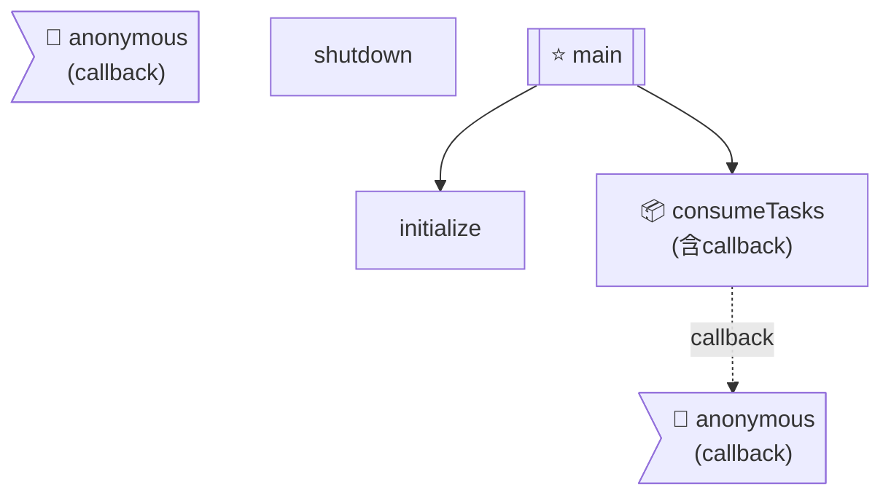

# 函數流程圖導航索引

## 📑 目錄

- [📊 函數調用關係圖](#函數調用關係圖)
- [📋 函數詳細清單](#函數詳細清單)
- [🔍 除錯指南](#除錯指南)
  - [快速定位問題](#快速定位問題)
  - [常見除錯場景](#常見除錯場景)

---
## 📊 函數調用關係圖

## 📋 函數詳細清單

| 函數名稱 | 類型 | 調用的函數 | 詳細流程圖 |
|---------|------|-----------|----------|
| `initialize` | 📝 一般 | info, info, launch, info, info, connect, createChannel, assertQueue, prefetch, info, info | [index_initialize.mmd](index_initialize.mmd) |
| `consumeTasks` | 📦 含callback | consume, parse, toString, info, scan, info, assertQueue, sendToQueue, from, stringify, ack, error, nack | [index_consumeTasks.mmd](index_consumeTasks.mmd) |
| `anonymous` | 🔄 callback | parse, toString, info, scan, info, assertQueue, sendToQueue, from, stringify, ack, error, nack | [index_anonymous.mmd](index_anonymous.mmd) |
| `anonymous` | 🔄 callback | parse, toString, info, scan, info, assertQueue, sendToQueue, from, stringify, ack, error, nack | [index_anonymous.mmd](index_anonymous.mmd) |
| `shutdown` | 📝 一般 | info, close, info, close, info, exit | [index_shutdown.mmd](index_shutdown.mmd) |
| `main` | ⭐ 入口 | initialize, consumeTasks, error, exit | [index_main.mmd](index_main.mmd) |

## 🔍 除錯指南

### 快速定位問題

1. **查看調用關係圖**：找到出問題的函數在哪個位置
2. **點擊對應的 .mmd 檔案**：查看該函數的詳細流程
3. **追蹤調用鏈**：從 main → initialize/consumeTasks → callback

### 常見除錯場景

- **初始化失敗**：查看 `initialize.mmd`
- **任務處理錯誤**：查看 `anonymous.mmd`（callback 邏輯）
- **關閉流程問題**：查看 `shutdown.mmd`

