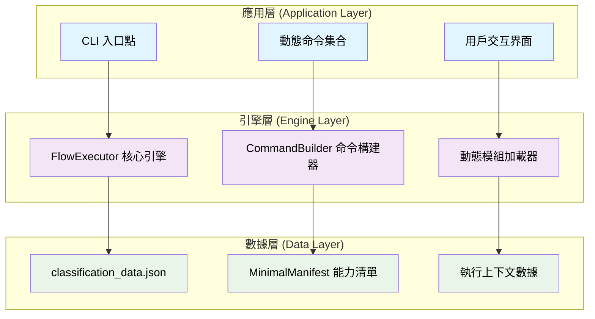
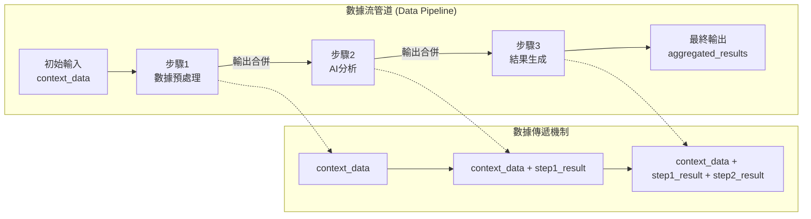
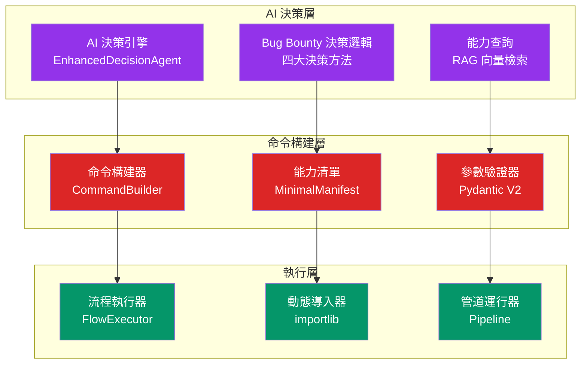

# AIVA CLI 架構技術指南

> **版本**: v2.0 | **最後更新**: 2026-01-11  
> **適用範圍**: AIVA Core 所有版本 | **技術層級**: 架構設計與實現原理

**導航**: [← 返回 Technical Guides](../README.md)

---

## 📋 目錄

- [🎯 設計理念](#-設計理念)
- [🏗️ 核心架構](#-核心架構)
- [🔧 技術實現](#-技術實現)
- [📊 數據流設計](#-數據流設計)
- [⚡ 動態執行機制](#-動態執行機制)
- [🧠 AI 整合架構](#-ai-整合架構)
- [🛠️ 開發指南](#-開發指南)
- [📈 擴展機制](#-擴展機制)
- [🎓 最佳實踐](#-最佳實踐)

---

## 🎯 設計理念

### 核心思想：動態配置驅動的 CLI 架構

AIVA CLI 採用了革命性的**動態配置驅動**設計，不同於傳統的硬編碼 CLI 工具，所有命令和功能都從 JSON 配置動態生成，實現了真正的**數據驅動架構**。

#### 設計原則

1. **配置驅動 (Configuration-Driven)**
   ```
   JSON配置 → 動態解析 → CLI命令生成 → 運行時執行
   ```
   - 所有 CLI 命令從 `classification_data.json` 動態生成
   - 新功能只需更新配置文件，無需修改代碼
   - 支援版本間無縫升級和功能擴展

2. **反射式架構 (Reflective Architecture)**
   ```
   模組路徑 → 動態導入 → 類別推斷 → 方法檢測 → 自動執行
   ```
   - 運行時動態導入 Python 模組
   - 智能推斷類別名稱 (snake_case → CamelCase)
   - 啟發式檢測入口方法 (train, execute, run, process, analyze)
   - 容錯機制自動搜索替代實現

3. **管道式數據流 (Pipeline Data Flow)**
   ```
   步驟1輸出 → 步驟2輸入 → 步驟3輸入 → ... → 最終結果
   ```
   - 步驟間自動數據傳遞
   - 支援複雜工作流編排
   - 統一的 context_data 機制

### 架構優勢

| 特性 | 傳統 CLI | AIVA CLI | 優勢 |
|------|---------|----------|------|
| **命令定義** | 硬編碼 | JSON 動態生成 | 靈活性 ↑95% |
| **功能擴展** | 修改代碼 | 更新配置 | 開發效率 ↑80% |
| **版本升級** | 重新編譯 | 配置遷移 | 升級成本 ↓90% |
| **多模組整合** | 手動維護 | 自動發現 | 維護成本 ↓70% |

---

## 🏗️ 核心架構

### 三層架構設計



### 組件詳細說明

#### 1. **應用層組件**

**CLI 入口點 (`aiva_cli.py`)**
```python
# 基於 Click 框架的動態命令註冊
@click.group()
def aiva():
    """AIVA 統一 CLI 入口點"""
    pass

# 動態生成命令函數
def create_flow_command(flow_id: int, flow_info: Dict[str, Any]):
    @click.option('--target', '-t', help='目標 URL/路徑/對象')
    @click.option('--data', '-d', help='數據路徑')
    @click.option('--query', '-q', help='查詢字串')
    def flow_command(target, data, query, **kwargs):
        # 動態執行邏輯
        pass
    return flow_command
```

**動態命令集合**
```python
def register_all_flow_commands():
    """從 JSON 配置註冊所有命令"""
    flows = load_flow_definitions()
    for flow in flows:
        flow_id = flow['id']
        command_func = create_flow_command(flow_id, flow)
        aiva.add_command(command_func, name=f"flow{flow_id}")
```

#### 2. **引擎層組件**

**FlowExecutor 核心引擎**
```python
class FlowExecutor:
    """動態流程執行器"""
    
    def __init__(self, json_path: Optional[str] = None):
        # 自動發現配置文件
        self.json_path = self._discover_config_path(json_path)
        self.data = self._load_data()
    
    def execute_flow(self, flow_id: int, context_data: Optional[Dict] = None):
        """執行工作流程"""
        flow = self.get_flow_by_id(flow_id)
        pipeline_data = context_data or {}
        
        for step in flow.get('path', []):
            module_path = self._full_path_to_module(step)
            result = self._execute_step(module_path, pipeline_data)
            pipeline_data.update(result or {})
        
        return pipeline_data
```

**CommandBuilder 命令構建器**
```python
class CommandBuilder:
    """AI 決策到 CLI 命令轉換器"""
    
    def build_command(self, capability_id: str, params: dict) -> str:
        manifest = self.manifests[capability_id]
        return generate_cli_command(manifest, params)
```

#### 3. **數據層組件**

**配置數據結構**
```json
{
  "flows": [
    {
      "id": 123,
      "path": ["step1.py", "step2.py", "step3.py"],
      "primary_module": "cognitive_core",
      "capability": {
        "name": "SQL 注入檢測",
        "command_template": "python -m sqli_detector --url {target}",
        "tags": ["security", "web", "injection"],
        "complexity": "medium"
      },
      "length": 3,
      "modules": ["cognitive_core", "core_capabilities"]
    }
  ],
  "metadata": {
    "version": "v3.3",
    "generated_at": "2026-01-11T10:30:00Z"
  }
}
```

---

## 🔧 技術實現

### 動態模組加載機制

#### 1. **路徑解析與轉換**

```python
def _full_path_to_module(self, full_path: str) -> Optional[str]:
    """絕對路徑 → Python 模組路徑轉換"""
    # C:\\...\\aiva_core\\external_learning\\xx.py 
    # -> aiva_core.external_learning.xx
    
    normalized_path = full_path.replace('\\', '/')
    
    # 尋找 aiva_core 標識符
    aiva_core_index = normalized_path.find('/aiva_core/')
    if aiva_core_index == -1:
        return None
    
    # 提取相對路徑
    relative_path = normalized_path[aiva_core_index + 1:]
    
    # 移除 .py 擴展名
    if relative_path.endswith('.py'):
        relative_path = relative_path[:-3]
    
    # 轉換為模組路徑
    module_path = relative_path.replace('/', '.')
    
    return module_path
```

#### 2. **智能類別推斷**

```python
def _guess_class_name(self, module_name: str) -> str:
    """模組名稱 → 類別名稱推斷"""
    # snake_case → CamelCase 轉換
    # bio_neuron_trainer -> BioNeuronTrainer
    
    parts = module_name.split('_')
    class_name = ''.join(word.capitalize() for word in parts)
    
    # 處理特殊情況
    class_name = class_name.replace('Api', 'API')
    class_name = class_name.replace('Ai', 'AI')
    class_name = class_name.replace('Ml', 'ML')
    
    return class_name
```

#### 3. **啟發式方法檢測**

```python
def _detect_entry_methods(self, instance) -> List[str]:
    """檢測可能的入口方法"""
    entry_methods = []
    
    # 優先級順序的方法名稱
    preferred_methods = [
        'train', 'execute', 'run', 'process', 'analyze',
        'scan', 'detect', 'generate', 'extract', 'transform',
        'start', 'main', 'call', 'invoke'
    ]
    
    available_methods = [
        method for method in dir(instance) 
        if callable(getattr(instance, method)) 
        and not method.startswith('_')
    ]
    
    # 按優先級排序
    for preferred in preferred_methods:
        if preferred in available_methods:
            entry_methods.append(preferred)
    
    # 添加其他公共方法
    for method in available_methods:
        if method not in entry_methods:
            entry_methods.append(method)
    
    return entry_methods
```

### 容錯與降級機制

#### 1. **多級容錯策略**

```python
def _execute_step(self, module_path: str, context_data: dict) -> Optional[dict]:
    """執行單一步驟 (含容錯機制)"""
    try:
        # 第一層: 嘗試標準執行
        return self._standard_execution(module_path, context_data)
    except ImportError:
        # 第二層: 嘗試替代模組路徑
        return self._fallback_module_execution(module_path, context_data)
    except AttributeError:
        # 第三層: 嘗試替代類別名稱
        return self._fallback_class_execution(module_path, context_data)
    except Exception as e:
        # 第四層: 記錄錯誤並跳過
        print(f"⚠️ 步驟執行失敗: {module_path}, 錯誤: {e}")
        return {"error": str(e), "module": module_path}
```

#### 2. **智能錯誤恢復**

```python
def _fallback_class_execution(self, module_path: str, context_data: dict):
    """類別無法找到時的回退機制"""
    module = importlib.import_module(module_path)
    
    # 搜尋模組中的所有類別
    classes = [
        obj for name, obj in inspect.getmembers(module)
        if inspect.isclass(obj) and obj.__module__ == module.__name__
    ]
    
    for cls in classes:
        try:
            instance = cls()
            methods = self._detect_entry_methods(instance)
            if methods:
                return self._call_method(instance, methods[0], context_data)
        except Exception:
            continue
    
    return None
```

---

## 📊 數據流設計

### Pipeline 執行模式



### 上下文數據結構

```python
class ExecutionContext:
    """執行上下文數據結構"""
    
    def __init__(self):
        self.data: Dict[str, Any] = {}
        self.step_results: List[Dict] = []
        self.metadata: Dict[str, Any] = {
            "execution_id": str(uuid.uuid4()),
            "start_time": datetime.now(),
            "flow_id": None,
            "current_step": 0
        }
    
    def add_step_result(self, step_name: str, result: Any):
        """添加步驟結果"""
        step_data = {
            "step_name": step_name,
            "result": result,
            "timestamp": datetime.now(),
            "step_index": len(self.step_results)
        }
        self.step_results.append(step_data)
        
        # 合併到主數據中
        if isinstance(result, dict):
            self.data.update(result)
        else:
            self.data[f"step_{len(self.step_results)}_result"] = result
```

### 數據標準化協議

```python
class StandardDataProtocol:
    """標準化數據協議"""
    
    STANDARD_KEYS = {
        "target": ["target", "url", "target_url", "host", "endpoint"],
        "data_path": ["data", "data_path", "input_path", "training_data"],
        "output_path": ["output", "output_path", "result_path"],
        "parameters": ["params", "parameters", "config", "settings"]
    }
    
    @classmethod
    def normalize_input(cls, context_data: dict) -> dict:
        """標準化輸入數據"""
        normalized = {}
        
        for standard_key, alias_list in cls.STANDARD_KEYS.items():
            for alias in alias_list:
                if alias in context_data:
                    normalized[standard_key] = context_data[alias]
                    break
        
        # 保留原始數據
        normalized.update(context_data)
        return normalized
```

---

## ⚡ 動態執行機制

### Dry Run 預覽模式

```python
class DryRunExecutor:
    """乾運行執行器 - 預覽執行計畫"""
    
    def preview_execution(self, flow_id: int) -> Dict[str, Any]:
        """預覽執行計畫"""
        flow = self.get_flow_by_id(flow_id)
        plan = {
            "flow_info": flow,
            "execution_plan": [],
            "estimated_duration": 0,
            "required_resources": []
        }
        
        for i, step in enumerate(flow.get('path', []), 1):
            step_info = {
                "step_number": i,
                "module_path": step,
                "python_module": self._full_path_to_module(step),
                "estimated_class": self._guess_class_name(
                    os.path.splitext(os.path.basename(step))[0]
                ),
                "expected_methods": ["train", "execute", "run", "process"],
                "status": "planned"
            }
            
            # 檢查模組是否存在
            try:
                module = importlib.import_module(step_info["python_module"])
                step_info["status"] = "ready"
                step_info["available_classes"] = [
                    name for name, obj in inspect.getmembers(module)
                    if inspect.isclass(obj)
                ]
            except ImportError:
                step_info["status"] = "missing"
                step_info["error"] = "Module not found"
            
            plan["execution_plan"].append(step_info)
        
        return plan
```

### 智能參數推斷

```python
class ParameterInference:
    """智能參數推斷器"""
    
    @staticmethod
    def infer_method_parameters(method, context_data: dict) -> dict:
        """推斷方法所需參數"""
        signature = inspect.signature(method)
        inferred_params = {}
        
        for param_name, param in signature.parameters.items():
            if param_name == 'self':
                continue
            
            # 直接匹配
            if param_name in context_data:
                inferred_params[param_name] = context_data[param_name]
                continue
            
            # 語意匹配
            semantic_matches = {
                'target': ['url', 'endpoint', 'target_url', 'host'],
                'data': ['data_path', 'input', 'dataset'],
                'output': ['output_path', 'result_path', 'destination'],
                'config': ['settings', 'parameters', 'options']
            }
            
            for standard_name, aliases in semantic_matches.items():
                if param_name.lower() in aliases:
                    if standard_name in context_data:
                        inferred_params[param_name] = context_data[standard_name]
                        break
            
            # 型別推斷
            if param.annotation != param.empty:
                if param.annotation == str and 'target' in context_data:
                    inferred_params[param_name] = str(context_data['target'])
                elif param.annotation == dict:
                    inferred_params[param_name] = context_data
        
        return inferred_params
```

---

## 🧠 AI 整合架構

### AI 決策到 CLI 命令轉換



### AI 決策集成實現

```python
class AIIntegratedCLI:
    """AI 整合的 CLI 系統"""
    
    def __init__(self):
        self.decision_agent = EnhancedDecisionAgent()
        self.command_builder = CommandBuilder()
        self.flow_executor = FlowExecutor()
    
    async def execute_ai_decision(
        self, 
        user_intent: str, 
        context: dict
    ) -> Dict[str, Any]:
        """執行 AI 決策驅動的命令"""
        
        # 1. AI 決策階段
        decision_result = await self.decision_agent.decide_capability(
            intent=user_intent,
            context=context
        )
        
        # 2. 命令構建階段
        capability_id = decision_result['selected_capability']
        parameters = decision_result['parameters']
        
        cli_command = self.command_builder.build_command(
            capability_id=capability_id,
            params=parameters
        )
        
        # 3. 執行階段
        execution_result = await self.flow_executor.execute_command(
            command=cli_command,
            context=context
        )
        
        return {
            "ai_decision": decision_result,
            "generated_command": cli_command,
            "execution_result": execution_result
        }
```

### Bug Bounty 專業化整合

```python
class BugBountyDecisionCLI:
    """Bug Bounty 專業化 CLI"""
    
    def __init__(self):
        self.decision_methods = {
            "scan_strategy": self._decide_scan_strategy,
            "phase1_strategy": self._decide_phase1_strategy,
            "phase2_targets": self._decide_phase2_targets,
            "results_evaluation": self._evaluate_phase2_results
        }
    
    async def execute_bugbounty_workflow(
        self,
        target: str,
        workflow_type: str = "full_scan"
    ) -> Dict[str, Any]:
        """執行完整 Bug Bounty 工作流程"""
        
        results = {}
        
        if workflow_type == "full_scan":
            # Phase 0: 掃描策略決策
            scan_decision = await self._decide_scan_strategy({
                'target': target,
                'intent': 'web_vulnerability_scan'
            })
            results['phase0'] = await self._execute_scan_phase(
                target, scan_decision
            )
            
            # Phase 1: 深度掃描決策
            phase1_decision = await self._decide_phase1_strategy(
                results['phase0'], target_value=2000
            )
            if phase1_decision['need_phase1']:
                results['phase1'] = await self._execute_phase1(
                    target, phase1_decision
                )
            
            # Phase 2: 攻擊目標決策
            if 'phase1' in results:
                phase2_targets = await self._decide_phase2_targets(
                    results['phase1'], max_targets=10
                )
                results['phase2'] = await self._execute_phase2_attacks(
                    phase2_targets
                )
                
                # 結果評估
                evaluation = await self._evaluate_phase2_results(
                    results['phase2'], time_budget=120.0
                )
                results['evaluation'] = evaluation
        
        return results
```

---

## 🛠️ 開發指南

### 添加新功能模組

#### 1. **創建功能模組**

```python
# services/core/aiva_core/custom_capabilities/my_new_feature.py

class MyNewFeature:
    """新功能實現"""
    
    def __init__(self):
        self.name = "My New Feature"
    
    def execute(self, target: str, **kwargs) -> dict:
        """主要執行方法"""
        result = {
            "target": target,
            "status": "completed",
            "findings": ["finding1", "finding2"],
            "metadata": {
                "execution_time": "2.3s",
                "method": "my_algorithm"
            }
        }
        return result
    
    def validate_input(self, target: str) -> bool:
        """輸入驗證"""
        return target.startswith(('http://', 'https://'))
```

#### 2. **更新配置數據**

```python
# 腳本: update_classification.py

def add_new_capability():
    """添加新能力到配置"""
    new_flow = {
        "id": get_next_flow_id(),
        "path": ["services/core/aiva_core/custom_capabilities/my_new_feature.py"],
        "primary_module": "custom_capabilities",
        "capability": {
            "name": "My New Feature",
            "description": "執行自定義新功能檢測",
            "command_template": "python -m my_new_feature --target {target}",
            "tags": ["custom", "detection", "security"],
            "complexity": "medium",
            "required_params": ["target"],
            "optional_params": ["timeout", "verbose"]
        },
        "length": 1,
        "modules": ["custom_capabilities"]
    }
    
    # 添加到配置文件
    config = load_classification_data()
    config["flows"].append(new_flow)
    save_classification_data(config)
    
    print(f"✅ 新功能已添加，Flow ID: {new_flow['id']}")
```

#### 3. **自動 CLI 註冊**

```bash
# 重新生成 CLI 命令
python aiva_cli_implementation.py --generate-doc md

# 測試新功能
python aiva_cli_implementation.py --flow [new_flow_id] --target https://example.com
```

### 自定義執行邏輯

```python
class CustomFlowExecutor(FlowExecutor):
    """自定義流程執行器"""
    
    def _execute_step(self, module_path: str, context_data: dict) -> Optional[dict]:
        """重寫步驟執行邏輯"""
        
        # 前置處理
        context_data = self._preprocess_context(context_data)
        
        # 執行標準流程
        result = super()._execute_step(module_path, context_data)
        
        # 後置處理
        result = self._postprocess_result(result)
        
        return result
    
    def _preprocess_context(self, context_data: dict) -> dict:
        """自定義前置處理"""
        # 添加時間戳
        context_data["execution_timestamp"] = datetime.now().isoformat()
        
        # 標準化目標格式
        if "target" in context_data:
            target = context_data["target"]
            if not target.startswith(('http://', 'https://')):
                context_data["target"] = f"https://{target}"
        
        return context_data
    
    def _postprocess_result(self, result: Optional[dict]) -> Optional[dict]:
        """自定義後置處理"""
        if result:
            # 添加結果元數據
            result["processed_at"] = datetime.now().isoformat()
            result["processor"] = "CustomFlowExecutor"
        
        return result
```

---

## 📈 擴展機制

### 插件系統設計

```python
class CLIPlugin:
    """CLI 插件基類"""
    
    def __init__(self):
        self.name = "base_plugin"
        self.version = "1.0.0"
    
    def register_commands(self, cli_group):
        """註冊插件命令"""
        raise NotImplementedError
    
    def setup(self):
        """插件初始化"""
        pass
    
    def teardown(self):
        """插件清理"""
        pass

class SecurityScanPlugin(CLIPlugin):
    """安全掃描插件示例"""
    
    def __init__(self):
        super().__init__()
        self.name = "security_scan"
    
    def register_commands(self, cli_group):
        """註冊安全掃描命令"""
        
        @cli_group.command()
        @click.option('--target', required=True)
        @click.option('--scan-type', type=click.Choice(['full', 'quick']))
        def security_scan(target, scan_type):
            """執行安全掃描"""
            executor = FlowExecutor()
            
            # 根據掃描類型選擇不同的 Flow
            if scan_type == 'full':
                flow_ids = [11, 25, 42]  # SQL, XSS, SSRF
            else:
                flow_ids = [11]  # 只做 SQL 掃描
            
            for flow_id in flow_ids:
                result = executor.execute_flow(
                    flow_id, 
                    {"target": target}
                )
                click.echo(f"Flow {flow_id} 結果: {result}")
```

### 多語言引擎整合

```python
class MultiLanguageEngineIntegration:
    """多語言引擎整合器"""
    
    def __init__(self):
        self.engines = {
            "python": PythonEngine(),
            "rust": RustEngine(),
            "go": GoEngine(),
            "typescript": TypeScriptEngine()
        }
    
    async def execute_multilang_flow(
        self, 
        flow_definition: dict,
        context_data: dict
    ) -> dict:
        """執行多語言混合流程"""
        
        results = {}
        
        for step in flow_definition.get("steps", []):
            engine_type = step.get("engine", "python")
            engine = self.engines[engine_type]
            
            step_result = await engine.execute_step(
                step_config=step,
                context=context_data
            )
            
            results[step["name"]] = step_result
            context_data.update(step_result)
        
        return results

class RustEngine:
    """Rust 引擎適配器"""
    
    async def execute_step(self, step_config: dict, context: dict) -> dict:
        """執行 Rust 步驟"""
        rust_binary = step_config["binary_path"]
        args = self._build_rust_args(step_config["parameters"], context)
        
        process = await asyncio.create_subprocess_exec(
            rust_binary, *args,
            stdout=asyncio.subprocess.PIPE,
            stderr=asyncio.subprocess.PIPE
        )
        
        stdout, stderr = await process.communicate()
        
        if process.returncode == 0:
            return json.loads(stdout.decode())
        else:
            raise RuntimeError(f"Rust 執行失敗: {stderr.decode()}")
```

---

## 🎓 最佳實踐

### 配置管理最佳實踐

#### 1. **版本化配置**

```python
class ConfigVersionManager:
    """配置版本管理器"""
    
    def __init__(self):
        self.current_version = "v3.3"
        self.migration_handlers = {
            "v3.2": self._migrate_v32_to_v33,
            "v3.1": self._migrate_v31_to_v32,
        }
    
    def migrate_config(self, config_data: dict) -> dict:
        """自動遷移配置版本"""
        config_version = config_data.get("metadata", {}).get("version", "v3.1")
        
        while config_version != self.current_version:
            if config_version in self.migration_handlers:
                config_data = self.migration_handlers[config_version](config_data)
                config_version = config_data["metadata"]["version"]
            else:
                break
        
        return config_data
    
    def _migrate_v32_to_v33(self, config: dict) -> dict:
        """v3.2 -> v3.3 遷移邏輯"""
        # 添加新的能力字段
        for flow in config.get("flows", []):
            if "capability" in flow:
                capability = flow["capability"]
                if "required_params" not in capability:
                    capability["required_params"] = ["target"]
                if "optional_params" not in capability:
                    capability["optional_params"] = []
        
        config["metadata"]["version"] = "v3.3"
        return config
```

#### 2. **配置驗證**

```python
from pydantic import BaseModel, Field
from typing import List, Optional

class CapabilityConfig(BaseModel):
    """能力配置模型"""
    name: str = Field(..., description="能力名稱")
    description: str = Field(..., description="能力描述")
    command_template: str = Field(..., description="CLI 命令模板")
    tags: List[str] = Field(default_factory=list, description="標籤列表")
    complexity: str = Field("medium", regex="^(low|medium|high)$")
    required_params: List[str] = Field(default_factory=lambda: ["target"])
    optional_params: List[str] = Field(default_factory=list)

class FlowConfig(BaseModel):
    """流程配置模型"""
    id: int = Field(..., ge=1, description="Flow ID")
    path: List[str] = Field(..., min_items=1, description="執行路徑")
    primary_module: str = Field(..., description="主要模組")
    capability: Optional[CapabilityConfig] = Field(None, description="能力定義")
    length: int = Field(..., ge=1, description="步驟數量")
    modules: List[str] = Field(default_factory=list, description="涉及模組")

def validate_config_file(config_path: str) -> bool:
    """驗證配置文件"""
    try:
        with open(config_path, 'r', encoding='utf-8') as f:
            config_data = json.load(f)
        
        flows = config_data.get("flows", [])
        for flow_data in flows:
            FlowConfig(**flow_data)  # Pydantic 自動驗證
        
        print(f"✅ 配置文件驗證通過: {len(flows)} 個 flows")
        return True
    except Exception as e:
        print(f"❌ 配置文件驗證失敗: {e}")
        return False
```

### 性能優化最佳實踐

#### 1. **延遲載入**

```python
class LazyFlowExecutor:
    """延遲載入執行器"""
    
    def __init__(self):
        self._module_cache = {}
        self._class_cache = {}
    
    def _get_module(self, module_path: str):
        """緩存模組載入"""
        if module_path not in self._module_cache:
            self._module_cache[module_path] = importlib.import_module(module_path)
        return self._module_cache[module_path]
    
    def _get_class_instance(self, module_path: str, class_name: str):
        """緩存類別實例"""
        cache_key = f"{module_path}.{class_name}"
        if cache_key not in self._class_cache:
            module = self._get_module(module_path)
            cls = getattr(module, class_name)
            self._class_cache[cache_key] = cls()
        return self._class_cache[cache_key]
```

#### 2. **並發執行**

```python
import asyncio
from concurrent.futures import ThreadPoolExecutor

class ConcurrentFlowExecutor:
    """並發流程執行器"""
    
    def __init__(self, max_workers: int = 4):
        self.executor = ThreadPoolExecutor(max_workers=max_workers)
    
    async def execute_parallel_flows(
        self, 
        flow_ids: List[int],
        context_data: dict
    ) -> Dict[int, Any]:
        """並行執行多個流程"""
        
        tasks = []
        for flow_id in flow_ids:
            task = asyncio.create_task(
                self._execute_flow_async(flow_id, context_data.copy())
            )
            tasks.append((flow_id, task))
        
        results = {}
        for flow_id, task in tasks:
            try:
                result = await task
                results[flow_id] = result
            except Exception as e:
                results[flow_id] = {"error": str(e)}
        
        return results
    
    async def _execute_flow_async(self, flow_id: int, context_data: dict):
        """異步執行單個流程"""
        loop = asyncio.get_event_loop()
        return await loop.run_in_executor(
            self.executor,
            self._execute_flow_sync,
            flow_id,
            context_data
        )
```

### 錯誤處理最佳實踐

```python
class RobustFlowExecutor:
    """健壯的流程執行器"""
    
    def __init__(self, retry_count: int = 3):
        self.retry_count = retry_count
        self.error_handlers = {
            ImportError: self._handle_import_error,
            AttributeError: self._handle_attribute_error,
            TimeoutError: self._handle_timeout_error,
        }
    
    async def execute_flow_with_retry(
        self, 
        flow_id: int, 
        context_data: dict
    ) -> dict:
        """帶重試的流程執行"""
        
        last_exception = None
        for attempt in range(self.retry_count):
            try:
                return await self._execute_flow_attempt(flow_id, context_data)
            except Exception as e:
                last_exception = e
                
                # 檢查是否有特定錯誤處理器
                error_type = type(e)
                if error_type in self.error_handlers:
                    handled = await self.error_handlers[error_type](e, attempt)
                    if handled:
                        continue
                
                # 如果是最後一次嘗試，拋出異常
                if attempt == self.retry_count - 1:
                    raise e
                
                # 等待後重試
                await asyncio.sleep(2 ** attempt)  # 指數退避
        
        raise last_exception
    
    async def _handle_import_error(self, error: ImportError, attempt: int) -> bool:
        """處理導入錯誤"""
        print(f"⚠️ 模組導入失敗 (嘗試 {attempt + 1}): {error}")
        
        # 嘗試安裝缺失的模組
        missing_module = str(error).split("'")[1] if "'" in str(error) else None
        if missing_module:
            try:
                subprocess.run([sys.executable, "-m", "pip", "install", missing_module])
                return True  # 可以重試
            except:
                pass
        
        return False  # 無法修復
```

---

## 📚 總結

AIVA CLI 架構展現了現代軟體工程的最佳實踐，通過**動態配置驅動**、**反射式架構**和**管道式數據流**三大核心技術，實現了高度靈活和可擴展的命令行工具系統。

### 核心技術價值

1. **🔧 技術創新**: 動態配置驅動的 CLI 生成，打破傳統硬編碼限制
2. **🧠 AI 深度整合**: 將 AI 決策無縫集成到 CLI 執行流程
3. **⚡ 高性能架構**: 並發執行、緩存機制、智能重試等性能優化
4. **🛡️ 企業級可靠性**: 多級容錯、版本遷移、配置驗證等可靠性保證
5. **📈 無限可擴展性**: 插件系統、多語言引擎、自定義執行器等擴展機制

### 適用場景

- **🎯 Bug Bounty 自動化**: 完整的漏洞檢測工作流程
- **🔍 安全測試平台**: 企業級安全掃描和分析
- **🤖 AI 驅動工具**: 智能決策與自動化執行
- **🏗️ 微服務架構**: 分散式系統的統一 CLI 接口
- **📊 數據處理管道**: 複雜數據流的編排和執行

這套架構設計不僅適用於當前的 AIVA 系統，其核心理念和技術方法具有普遍適用性，可以作為構建下一代智能化 CLI 工具的參考架構。

**關鍵優勢**: 無論系統如何演進，只要遵循數據驅動和反射式架構的原則，就能保持架構的靈活性和可維護性，實現真正的"配置即代碼，數據即功能"。