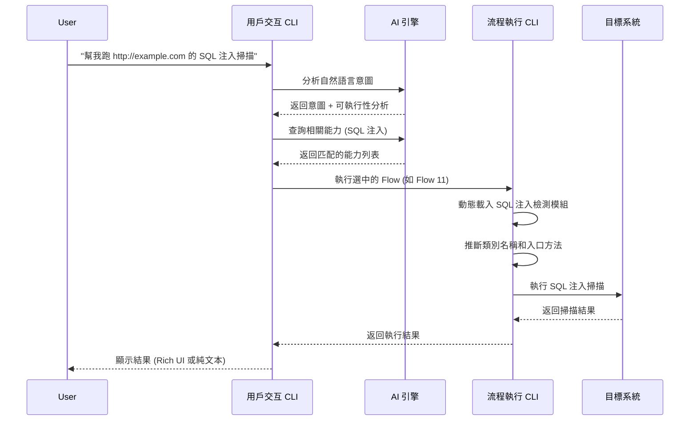

# AI 內部純 CLI 實現技術指南

> **版本**: v1.0 | **最後更新**: 2026-01-11  
> **適用範圍**: AIVA 系統 AI 內部純 CLI 實現 | **技術層級**: 無 GUI 純命令行方法論

**導航**: [← 返回 Technical Guides](../README.md)

**核心特點**: ⚡ AI 內部只有 CLI，無任何 GUI 或 Web 界面 ⚡

---

## 📋 目錄

- [🎯 純 CLI AI 設計](#-純-cli-ai-設計)
- [🏗️ 純 CLI 架構設計](#-純-cli-架構設計)
- [🔧 無 GUI 實現方法](#-無-gui-實現方法)
- [📊 CLI 原生 AI 集成](#-cli-原生-ai-集成)
- [⚡ 純文本執行機制](#-純文本執行機制)
- [🛠️ CLI-Only 代碼實現](#-cli-only-代碼實現)
- [📈 純命令行處理流程](#-純命令行處理流程)
- [🎓 CLI 原生最佳實踐](#-cli-原生最佳實踐)

---

## 🎯 純 CLI AI 設計

### AI 內部只有 CLI 的架構現實

AIVA 的 AI 核心採用了**純 CLI 架構**，這意味著：

✅ **只有命令行接口**
- 所有 AI 模組只提供 CLI 入口
- 沒有 Web UI、GUI 或圖形界面
- 純文本輸入輸出，無視覺化組件

✅ **無頭 AI 系統**
- AI 決策引擎完全基於文本處理
- 所有分析結果以命令行格式輸出  
- 容器環境中無需任何顯示服務

✅ **CLI 原生設計**
- AI 組件從設計之初就為 CLI 優化
- 支援 Unix 管道和重定向
- 與系統命令無縫集成

```bash
# AIVA AI 的典型使用方式 - 純命令行
echo "分析 http://example.com 的 SQL 注入" | python aiva_cli.py --attack
python aiva_cli_implementation.py --flow 11 --target https://test.com
python aiva_cli.py --query "漏洞掃描" | grep -i sql
```

### 純 CLI 系統定義

AIVA 採用了**純 CLI 架構**，AI 內部只有 CLI 接口，沒有其他 UI 形式：

```mermaid
graph TB
    subgraph "CLI 接口層 (CLI Interface Layer)"
        UserCLI[用戶交互界面<br/>scripts/common/aiva_cli.py]
        FlowCLI[動態流程執行器<br/>aiva_cli_implementation.py]
        MenuSystem[命令行選單系統<br/>Terminal Only]
    end
    
    subgraph "AI 核心引擎 (AI Core Engine - CLI Only)"
        AIDecision[AI 決策引擎<br/>純 CLI 輸出]
        CommandProcessor[命令處理器<br/>純文本處理]
        InternalLoop[內部循環連接器<br/>CLI 命令生成]
    end
    
    subgraph "執行引擎 (Execution Engine - CLI Driven)"
        FlowExecutor[流程執行引擎<br/>CLI 驅動]
        ModuleLoader[動態模組載入<br/>CLI 控制]
        PipelineRunner[數據管道<br/>CLI 輸出]
    end
    
### Pure CLI AI 的核心價值

1. **🚀 極致輕量化**
   ```
   傳統 AI 系統: AI 核心 + Web UI + API Server + 數據庫 UI
   AIVA AI 系統: AI 核心 + CLI (就這樣，沒了)
   ```

2. **🔧 DevOps 原生**
   - 完美融入 CI/CD 流水線
   - 腳本化和自動化友好
   - 監控和日誌收集簡單直接

3. **⚡ 性能極致優化**
   - 沒有 UI 渲染開銷
   - 所有計算資源用於 AI 推理
   - 記憶體佔用極小

4. **📦 容器化完美適配**
   ```dockerfile
   FROM python:alpine
   # 無需安裝任何 UI 庫或服務
   COPY aiva_ai/ /app/
   CMD ["python", "aiva_cli.py"]
   ```

### 核心設計理念

1. **純 CLI 架構 (Pure CLI Architecture)**
   - AI 內部只有 CLI 接口，沒有 Web UI、GUI 或其他形式的界面
   - 所有 AI 決策、分析和執行都通過命令行進行
   - 真正的無頭 (Headless) AI 系統設計

2. **命令行原生 AI (CLI-Native AI)**
   - AI 組件天生設計為 CLI 友好
   - 輸入輸出都是純文本格式
   - 支援管道 (pipe)、重定向等 Unix 哲學

3. **零 GUI 依賴 (Zero GUI Dependency)**
   - 完全基於文本的交互方式
   - 容器和雲原生友好
   - 適合自動化和腳本集成

---

## 🏗️ 純 CLI 架構設計

### AI 內部的 CLI 實現

**重要特點**: AIVA 的 AI 核心完全基於 CLI，沒有任何 GUI 或 Web 界面。

**文件分佈**:
- `scripts/common/aiva_cli.py` - 主要用戶交互入口
- `aiva_cli_implementation.py` - 動態執行引擎  
- AI 核心模組 - 只提供 CLI 接口的純文本輸出

```python
# AI 核心只有 CLI 接口的設計
class AICoreWithOnlyCLI:
    """AI 核心 - 純 CLI 接口"""
    
    def __init__(self):
        # 沒有 GUI 組件，只有 CLI 處理器
        self.cli_processor = CLITextProcessor()
        self.cli_output = CLIOutputFormatter()
        self.cli_input = CLIInputParser()
    
    def process_request(self, cli_input: str) -> str:
        """所有 AI 處理都返回純文本結果"""
        ai_result = self._run_ai_analysis(cli_input)
        return self.cli_output.format_as_text(ai_result)
    
    def _run_ai_analysis(self, text_input: str) -> dict:
        """AI 分析 - 純文本輸入輸出"""
        # AI 邏輯處理
        return {
            "decision": "execute_sql_injection_scan",
            "confidence": 0.95,
            "cli_command": "python scan_sql.py --target {target}"
        }
```

### CLI-Only AI 的優勢

1. **極簡設計**: 無 GUI 開銷，純粹專注於 AI 邏輯
2. **容器完美適配**: 在 Docker 容器中運行無需 X11 或顯示服務
3. **自動化友好**: 易於腳本化和 CI/CD 集成  
4. **資源效率**: 沒有 UI 渲染開銷，AI 運算資源利用率更高
5. **跨平台一致性**: 在任何有終端的環境都能一致運行

```python
# 核心架構設計
class UserInterfaceCLI:
    """用戶交互層 CLI"""
    
    def __init__(self):
        # AI 整合組件
        self.ai_query = AICapabilityQuery()
        self.ai_processor = AIVACommandProcessor()
        self.internal_loop = InternalLoopConnector()
        
        # UI 組件
        self.rich_available = self._check_rich_support()
        self.console = Console() if self.rich_available else None
    
    async def handle_natural_language_input(self, user_input: str):
        """處理自然語言輸入 - 核心功能"""
        # 1. AI 意圖識別
        intent_analysis = await self.ai_query.analyze_intent(user_input)
        
        # 2. 能力匹配和決策
        capabilities = await self.ai_query.query(
            user_input, 
            top_k=5
        )
        
        # 3. 自動執行決策
        if intent_analysis['executable']:
            execution_result = await self.ai_processor.process_user_input(
                user_input
            )
            self._display_execution_result(execution_result)
        
        return {
            "intent": intent_analysis,
            "capabilities": capabilities,
            "execution": execution_result if intent_analysis['executable'] else None
        }
    
    def _display_execution_result(self, result: dict):
        """結果顯示 - 支援 Rich 和純文本"""
        if self.rich_available:
            self._display_rich_result(result)
        else:
            self._display_text_result(result)
```

**關鍵特性**:

1. **自然語言處理**
```python
async def handle_attack(command: str):
    """AI 攻擊執行 - 自然語言指令處理"""
    processor = AIVACommandProcessor()
    response = await processor.process_user_input(command)
    
    # 顯示 AI 決策過程
    print(f"Intent: {response['intent']}")
    print(f"Executable: {response['executable']}")
    print(f"Message: {response['message']}")
```

2. **Rich UI 回退機制**
```python
def adaptive_display(self, content, title=""):
    """自適應顯示 - Rich 或純文本"""
    if RICH_AVAILABLE and self.console:
        self.console.print(Panel(content, title=title))
    else:
        print(f"\n{title}\n{'='*60}\n{content}")
```

### Layer 2: 流程執行 CLI

**文件位置**: `services/core/aiva_core/internal_exploration/python_tools/aiva_cli_implementation.py`

**核心職責**:
- 動態流程執行和數據管道
- JSON 配置驅動的命令生成
- 模組動態載入和方法推斷

```python
class FlowExecutionCLI:
    """流程執行層 CLI"""
    
    def __init__(self, json_path: Optional[str] = None):
        self.json_path = self._discover_config_path(json_path)
        self.data = self._load_classification_data()
        
        # 動態執行組件
        self.module_cache = {}
        self.class_cache = {}
    
    def execute_flow(self, flow_id: int, context_data: Optional[Dict] = None, dry_run: bool = False):
        """執行指定流程 - 核心執行引擎"""
        flow = self.get_flow_by_id(flow_id)
        if not flow:
            raise ValueError(f"Flow {flow_id} not found")
        
        print(f"🚀 執行 Flow {flow_id}: {flow.get('primary_module', 'unknown')}")
        
        if dry_run:
            return self._dry_run_preview(flow)
        
        # 實際執行
        pipeline_data = context_data or {}
        
        for i, step in enumerate(flow.get('path', []), 1):
            print(f"   步驟 {i}/{len(flow['path'])}: {step}")
            
            module_path = self._full_path_to_module(step)
            if not module_path:
                print(f"   ⚠️ 無法解析模組路徑: {step}")
                continue
            
            result = self._execute_step(module_path, pipeline_data)
            if result:
                pipeline_data.update(result)
        
        print(f"✅ Flow {flow_id} 執行完成")
        return pipeline_data
```

**關鍵實現細節**:

1. **路徑解析與模組載入**
```python
def _full_path_to_module(self, full_path: str) -> Optional[str]:
    """絕對路徑轉換為 Python 模組路徑"""
    # C:\\...\\aiva_core\\cognitive_core\\bio_neuron_trainer.py
    # -> aiva_core.cognitive_core.bio_neuron_trainer
    
    normalized_path = full_path.replace('\\', '/')
    aiva_core_index = normalized_path.find('/aiva_core/')
    
    if aiva_core_index == -1:
        return None
    
    relative_path = normalized_path[aiva_core_index + 1:]
    
    if relative_path.endswith('.py'):
        relative_path = relative_path[:-3]
    
    return relative_path.replace('/', '.')
```

2. **智能類別推斷**
```python
def _guess_class_name(self, module_name: str) -> str:
    """模組名稱到類別名稱推斷"""
    # bio_neuron_trainer -> BioNeuronTrainer
    parts = module_name.split('_')
    class_name = ''.join(word.capitalize() for word in parts)
    
    # 特殊處理
    replacements = {
        'Api': 'API', 'Ai': 'AI', 'Ml': 'ML', 
        'Sql': 'SQL', 'Http': 'HTTP'
    }
    
    for old, new in replacements.items():
        class_name = class_name.replace(old, new)
    
    return class_name
```

3. **啟發式方法檢測**
```python
def _detect_entry_methods(self, instance) -> List[str]:
    """檢測可能的入口方法"""
    # 優先級排序的方法名稱
    preferred_methods = [
        'train', 'execute', 'run', 'process', 'analyze',
        'scan', 'detect', 'generate', 'extract', 'transform'
    ]
    
    available = [m for m in dir(instance) 
                if callable(getattr(instance, m)) 
                and not m.startswith('_')]
    
    # 按優先級返回
    entry_methods = []
    for preferred in preferred_methods:
        if preferred in available:
            entry_methods.append(preferred)
    
    return entry_methods or available[:3]  # 回退方案
```

---

## 🔧 無 GUI 實現方法

### argparse 為核心的參數處理

```python
def create_argument_parser():
    """創建命令行參數解析器 - 標準實現模式"""
    parser = argparse.ArgumentParser(
        description="AIVA AI-Driven Vulnerability Assessment CLI",
        formatter_class=argparse.RawDescriptionHelpFormatter,
        epilog="""
Examples:
  # AI 自然語言攻擊
  python aiva_cli.py --attack "幫我跑 http://localhost:8080/WebGoat 的掃描"
  
  # 查詢能力
  python aiva_cli.py --query "SQL 注入檢測"
  
  # 執行特定流程
  python aiva_cli_implementation.py --flow 11 --target https://example.com
  
  # 生成文檔
  python aiva_cli_implementation.py --generate-doc md
        """
    )
    
    # 主要功能組
    main_group = parser.add_argument_group('主要功能')
    main_group.add_argument('--query', '-q', help='自然語言能力查詢')
    main_group.add_argument('--attack', '-a', help='AI 攻擊執行')
    main_group.add_argument('--flow', type=int, help='執行特定 Flow ID')
    
    # 配置組
    config_group = parser.add_argument_group('配置選項')
    config_group.add_argument('--target', '-t', help='目標 URL/路徑')
    config_group.add_argument('--data', '-d', help='數據路徑')
    config_group.add_argument('--dry-run', action='store_true', help='預覽模式')
    
    # 工具組
    tool_group = parser.add_argument_group('工具功能')
    tool_group.add_argument('--stats', action='store_true', help='顯示統計')
    tool_group.add_argument('--list', action='store_true', help='列出所有 Flow')
    tool_group.add_argument('--generate-doc', choices=['md', 'json'], help='生成文檔')
    
    return parser
```

### 無依賴的純文本 UI

```python
class PureTextInterface:
    """純文本界面 - 零外部依賴"""
    
    @staticmethod
    def print_banner():
        """ASCII 橫幅顯示"""
        banner = """
    ╔══════════════════════════════════════════════════════════════╗
    ║     █████╗ ██╗██╗   ██╗ █████╗     ██████╗██╗     ██╗      ║
    ║    ██╔══██╗██║██║   ██║██╔══██╗   ██╔════╝██║     ██║      ║
    ║    ███████║██║██║   ██║███████║   ██║     ██║     ██║      ║
    ║    ██╔══██║██║╚██╗ ██╔╝██╔══██║   ██║     ██║     ██║      ║
    ║    ██║  ██║██║ ╚████╔╝ ██║  ██║   ╚██████╗███████╗██║      ║
    ║    ╚═╝  ╚═╝╚═╝  ╚═══╝  ╚═╝  ╚═╝    ╚═════╝╚══════╝╚═╝      ║
    ╚══════════════════════════════════════════════════════════════╝
        """
        print(banner)
    
    @staticmethod
    def create_table(title: str, headers: List[str], rows: List[List[str]]) -> str:
        """純文本表格生成"""
        # 計算列寬
        col_widths = []
        for i, header in enumerate(headers):
            max_width = max(len(header), 
                          max(len(str(row[i])) for row in rows) if rows else 0)
            col_widths.append(max_width + 2)
        
        # 構建表格
        lines = [title, "=" * len(title), ""]
        
        # 標題行
        header_line = "|"
        for i, header in enumerate(headers):
            header_line += f" {header:<{col_widths[i]-1}}|"
        lines.append(header_line)
        
        # 分隔線
        sep_line = "|"
        for width in col_widths:
            sep_line += "-" * width + "|"
        lines.append(sep_line)
        
        # 數據行
        for row in rows:
            row_line = "|"
            for i, cell in enumerate(row):
                row_line += f" {str(cell):<{col_widths[i]-1}}|"
            lines.append(row_line)
        
        return "\n".join(lines)
    
    @staticmethod
    def show_menu(title: str, options: List[tuple]) -> str:
        """選單顯示和輸入處理"""
        print(f"\n{'='*60}")
        print(title)
        print('='*60)
        
        for key, name, _ in options:
            print(f"  [{key}] {name}")
        
        print('='*60)
        return input("選擇功能 > ").strip()
```

### 容錯和錯誤處理

```python
class CLIErrorHandler:
    """CLI 錯誤處理 - 用戶友好的錯誤提示"""
    
    @staticmethod
    def handle_import_error(module_name: str, error: ImportError):
        """模組導入錯誤處理"""
        print(f"❌ 模組載入失敗: {module_name}")
        print(f"   錯誤: {error}")
        print(f"   建議: 檢查模組是否存在或安裝相關依賴")
        
        # 提供可能的解決方案
        if "No module named" in str(error):
            missing_module = str(error).split("'")[1] if "'" in str(error) else module_name
            print(f"   嘗試: pip install {missing_module}")
    
    @staticmethod
    def handle_execution_error(flow_id: int, step: str, error: Exception):
        """執行錯誤處理"""
        print(f"❌ Flow {flow_id} 執行失敗")
        print(f"   失敗步驟: {step}")
        print(f"   錯誤類型: {type(error).__name__}")
        print(f"   錯誤訊息: {error}")
        
        # 提供除錯建議
        if isinstance(error, AttributeError):
            print(f"   建議: 檢查類別或方法名稱是否正確")
        elif isinstance(error, FileNotFoundError):
            print(f"   建議: 檢查文件路徑是否存在")
        elif isinstance(error, ValueError):
            print(f"   建議: 檢查輸入參數格式")
    
    @staticmethod
    def handle_graceful_shutdown():
        """優雅退出處理"""
        try:
            print("\n正在清理資源...")
            # 執行清理工作
            print("清理完成，程序退出")
        except Exception as e:
            print(f"清理過程中發生錯誤: {e}")
        finally:
            sys.exit(0)
```

---

## 📊 CLI 原生 AI 集成

### AI 決策完全基於 CLI 的實現

```python
class PureCLIAIProcessor:
    """純 CLI AI 處理器 - 無任何 GUI 組件"""
    
    def __init__(self):
        # 只有文本處理組件
        self.text_analyzer = TextAnalyzer()
        self.cli_formatter = CLIOutputFormatter()
        self.command_generator = CLICommandGenerator()
        
        # 絕對沒有這些組件
        # self.web_ui = None
        # self.gui_framework = None
        # self.visualization = None
    
    def process_natural_language(self, cli_input: str) -> str:
        """純文本輸入 → AI 分析 → 純文本輸出"""
        
        # 1. 文本分析 (無視覺化)
        analysis = self.text_analyzer.analyze(cli_input)
        
        # 2. CLI 命令生成 (純文本)
        cli_commands = self.command_generator.generate(analysis)
        
        # 3. 結果格式化 (ASCII 表格或純文本)
        return self.cli_formatter.format_as_cli_output(cli_commands)
    
    def execute_ai_decision(self, decision: dict) -> str:
        """AI 決策執行 - 只返回 CLI 結果"""
        if decision['executable']:
            # 直接執行系統命令
            import subprocess
            result = subprocess.run(
                decision['command'], 
                shell=True, 
                capture_output=True, 
                text=True
            )
            return f"Exit Code: {result.returncode}\nOutput:\n{result.stdout}"
        else:
            return f"AI 建議: {decision['suggestion']}"
```
        
        # Step 1: AI 意圖分析
        intent_result = await self.ai_query.analyze_intent(user_input)
        
        # Step 2: 能力查詢和匹配
        if intent_result['executable']:
            capabilities = await self.ai_query.query(
                user_input, 
                intent_result.get('extracted_target'),
                top_k=3
            )
            
            # Step 3: 選擇最佳 Flow
            selected_flow = self._select_best_flow(capabilities, intent_result)
            
            # Step 4: 準備執行參數
            execution_context = self._prepare_execution_context(
                user_input, intent_result, selected_flow
            )
            
            # Step 5: 執行 Flow
            execution_result = self.flow_executor.execute_flow(
                selected_flow['flow_id'],
                execution_context
            )
            
            return {
                "success": True,
                "intent": intent_result,
                "selected_flow": selected_flow,
                "execution_result": execution_result
            }
        
        else:
            # 僅返回查詢結果，不執行
            query_results = await self.ai_query.query(user_input, top_k=5)
            return {
                "success": False,
                "reason": "不可執行的查詢",
                "query_results": query_results
            }
    
    def _select_best_flow(self, capabilities: list, intent: dict) -> dict:
        """選擇最佳執行 Flow"""
        if not capabilities:
            raise ValueError("未找到匹配的能力")
        
        # 根據意圖和能力匹配度選擇
        best_capability = capabilities[0]  # 最高評分
        
        return {
            "flow_id": best_capability.get('flow_id'),
            "capability_name": best_capability.get('name'),
            "confidence": best_capability.get('score', 0.0),
            "module": best_capability.get('module')
        }
    
    def _prepare_execution_context(self, user_input: str, intent: dict, flow: dict) -> dict:
        """準備執行上下文"""
        context = {
            "user_input": user_input,
            "intent": intent['intent'],
            "ai_decision": True,
            "execution_timestamp": datetime.datetime.now().isoformat()
        }
        
        # 提取目標
        if intent.get('extracted_target'):
            context['target'] = intent['extracted_target']
            context['target_url'] = intent['extracted_target']
        
        # 提取其他參數
        if intent.get('parameters'):
            context.update(intent['parameters'])
        
        return context
```

### 內部循環連接器整合

```python
class InternalLoopCLIIntegration:
    """內部循環與 CLI 的深度整合"""
    
    def __init__(self):
        self.connector = InternalLoopConnector()
        self.vector_store = VectorStore(backend="chroma")
        self.knowledge_base = KnowledgeBase(vector_store=self.vector_store)
    
    async def sync_and_query_workflow(self, user_query: str) -> dict:
        """同步能力並執行查詢工作流程"""
        
        # 1. 同步最新能力到 RAG
        sync_result = await self.connector.sync_capabilities_to_rag()
        
        if not sync_result.success:
            return {"error": f"同步失敗: {sync_result.error}"}
        
        # 2. 使用 RAG 進行增強查詢
        rag_results = await self.knowledge_base.search(
            query=user_query,
            top_k=5,
            filters={"module": ["cognitive_core", "core_capabilities"]}
        )
        
        # 3. 結合 AI 決策
        ai_analysis = await self.connector.process_user_query(user_query)
        
        # 4. 整合結果
        integrated_result = {
            "sync_status": {
                "success": sync_result.success,
                "modules_scanned": sync_result.modules_scanned,
                "capabilities_found": sync_result.capabilities_found
            },
            "rag_results": rag_results,
            "ai_analysis": ai_analysis,
            "recommended_actions": self._generate_recommendations(
                rag_results, ai_analysis
            )
        }
        
        return integrated_result
    
    def _generate_recommendations(self, rag_results: list, ai_analysis: dict) -> list:
        """生成執行建議"""
        recommendations = []
        
        for result in rag_results[:3]:  # 前3個結果
            recommendations.append({
                "action": f"執行 {result['name']}",
                "flow_id": result.get('flow_id'),
                "confidence": result.get('score', 0.0),
                "description": result.get('description', ''),
                "cli_command": f"python aiva_cli_implementation.py --flow {result.get('flow_id')} --target {{target}}"
            })
        
        return recommendations
```

---

## ⚡ 動態執行機制

### 配置驅動的執行流程

```python
class ConfigurationDrivenExecution:
    """配置驅動的動態執行機制"""
    
    def __init__(self, config_path: str):
        self.config = self._load_configuration(config_path)
        self.execution_cache = {}
    
    def execute_by_configuration(self, flow_id: int, runtime_params: dict = None) -> dict:
        """根據配置動態執行"""
        
        # 1. 載入 Flow 配置
        flow_config = self._get_flow_config(flow_id)
        
        # 2. 動態構建執行計畫
        execution_plan = self._build_execution_plan(flow_config, runtime_params)
        
        # 3. 執行計畫
        return self._execute_plan(execution_plan)
    
    def _build_execution_plan(self, flow_config: dict, runtime_params: dict) -> dict:
        """構建執行計畫"""
        plan = {
            "flow_id": flow_config['id'],
            "steps": [],
            "context": runtime_params or {}
        }
        
        for i, step_path in enumerate(flow_config.get('path', [])):
            step_plan = {
                "step_number": i + 1,
                "module_path": step_path,
                "python_module": self._path_to_module(step_path),
                "expected_class": self._infer_class_name(step_path),
                "context_input": plan["context"].copy()
            }
            
            plan["steps"].append(step_plan)
        
        return plan
    
    def _execute_plan(self, plan: dict) -> dict:
        """執行計畫"""
        results = {
            "flow_id": plan["flow_id"],
            "step_results": [],
            "final_context": plan["context"].copy(),
            "success": True,
            "errors": []
        }
        
        for step in plan["steps"]:
            try:
                step_result = self._execute_single_step(
                    step, 
                    results["final_context"]
                )
                
                results["step_results"].append(step_result)
                
                # 更新上下文
                if step_result.get("output"):
                    results["final_context"].update(step_result["output"])
                    
            except Exception as e:
                error_info = {
                    "step_number": step["step_number"],
                    "error": str(e),
                    "error_type": type(e).__name__
                }
                results["errors"].append(error_info)
                results["success"] = False
                
                print(f"❌ 步驟 {step['step_number']} 失敗: {e}")
        
        return results
```

### 智能參數推斷和傳遞

```python
class SmartParameterInference:
    """智能參數推斷系統"""
    
    @staticmethod
    def infer_method_parameters(method_signature: inspect.Signature, context: dict) -> dict:
        """根據方法簽名推斷參數"""
        inferred_params = {}
        
        for param_name, param in method_signature.parameters.items():
            if param_name == 'self':
                continue
            
            # 1. 直接匹配
            if param_name in context:
                inferred_params[param_name] = context[param_name]
                continue
            
            # 2. 別名匹配
            alias_map = {
                'target': ['url', 'target_url', 'endpoint', 'host'],
                'data': ['data_path', 'input_path', 'dataset'],
                'output': ['output_path', 'result_path'],
                'config': ['configuration', 'settings', 'params']
            }
            
            matched = False
            for standard_name, aliases in alias_map.items():
                if param_name.lower() in aliases and standard_name in context:
                    inferred_params[param_name] = context[standard_name]
                    matched = True
                    break
            
            if matched:
                continue
            
            # 3. 型別推斷
            if param.annotation != param.empty:
                inferred_value = SmartParameterInference._infer_by_type(
                    param.annotation, context
                )
                if inferred_value is not None:
                    inferred_params[param_name] = inferred_value
            
            # 4. 預設值
            if param.default != param.empty:
                inferred_params[param_name] = param.default
        
        return inferred_params
    
    @staticmethod
    def _infer_by_type(annotation, context: dict):
        """根據型別推斷參數值"""
        if annotation == str:
            # 尋找字串類型的值
            for key, value in context.items():
                if isinstance(value, str) and value:
                    return value
        
        elif annotation == dict:
            # 返回整個上下文
            return context
        
        elif annotation == int:
            # 尋找整數類型的值
            for key, value in context.items():
                if isinstance(value, int):
                    return value
        
        return None
```

---

## 🛠️ 實際代碼實現

### 主執行邏輯

```python
def main():
    """主執行邏輯 - 整合雙 CLI 系統"""
    parser = create_argument_parser()
    args = parser.parse_args()
    
    # 檢查核心模組可用性
    if not check_core_availability():
        print("❌ 核心模組不可用，請檢查環境配置")
        return 1
    
    try:
        # 根據參數選擇執行模式
        if args.attack:
            # AI 攻擊模式 - 使用用戶交互 CLI
            return asyncio.run(execute_ai_attack_mode(args.attack))
        
        elif args.flow:
            # Flow 執行模式 - 使用流程執行 CLI
            return execute_flow_mode(args)
        
        elif args.query:
            # 查詢模式 - 使用用戶交互 CLI
            return asyncio.run(execute_query_mode(args.query))
        
        elif args.generate_doc:
            # 文檔生成模式 - 使用流程執行 CLI
            return execute_documentation_mode(args.generate_doc)
        
        else:
            # 交互模式 - 使用用戶交互 CLI
            return asyncio.run(execute_interactive_mode())
    
    except KeyboardInterrupt:
        print("\n用戶中斷，程序退出")
        return 0
    except Exception as e:
        print(f"執行錯誤: {e}")
        import traceback
        traceback.print_exc()
        return 1

async def execute_ai_attack_mode(attack_command: str) -> int:
    """AI 攻擊模式執行"""
    print(f"🤖 AI 攻擊模式: {attack_command}")
    
    # 使用用戶交互 CLI
    ui_cli = UserInterfaceCLI()
    result = await ui_cli.handle_natural_language_input(attack_command)
    
    if result.get('execution') and result['execution']['success']:
        print("✅ AI 攻擊執行成功")
        return 0
    else:
        print("❌ AI 攻擊執行失敗")
        return 1

def execute_flow_mode(args) -> int:
    """Flow 執行模式"""
    print(f"⚡ Flow 執行模式: Flow {args.flow}")
    
    # 使用流程執行 CLI
    flow_cli = FlowExecutionCLI()
    
    # 準備執行上下文
    context = {}
    if args.target:
        context['target'] = args.target
    if args.data:
        context['data_path'] = args.data
    
    try:
        result = flow_cli.execute_flow(
            args.flow, 
            context_data=context,
            dry_run=args.dry_run
        )
        
        if result:
            print("✅ Flow 執行完成")
            return 0
        else:
            print("❌ Flow 執行失敗")
            return 1
            
    except Exception as e:
        print(f"❌ Flow 執行錯誤: {e}")
        return 1

async def execute_interactive_mode() -> int:
    """交互模式執行"""
    print("🎮 交互模式")
    
    # 使用用戶交互 CLI
    ui_cli = UserInterfaceCLI()
    await ui_cli.interactive_menu()
    
    return 0
```

### 錯誤處理和日誌

```python
import logging
from contextlib import contextmanager

class CLILogger:
    """CLI 專用日誌系統"""
    
    def __init__(self, name: str = "aiva_cli"):
        self.logger = logging.getLogger(name)
        self.logger.setLevel(logging.INFO)
        
        if not self.logger.handlers:
            handler = logging.StreamHandler()
            formatter = logging.Formatter(
                '%(asctime)s - %(name)s - %(levelname)s - %(message)s'
            )
            handler.setFormatter(formatter)
            self.logger.addHandler(handler)
    
    @contextmanager
    def execution_context(self, operation: str):
        """執行上下文管理"""
        self.logger.info(f"開始執行: {operation}")
        start_time = datetime.datetime.now()
        
        try:
            yield
            duration = datetime.datetime.now() - start_time
            self.logger.info(f"執行完成: {operation} (耗時: {duration.total_seconds():.2f}s)")
        
        except Exception as e:
            duration = datetime.datetime.now() - start_time
            self.logger.error(f"執行失敗: {operation} (耗時: {duration.total_seconds():.2f}s) - {e}")
            raise

# 使用範例
logger = CLILogger()

def execute_with_logging(flow_id: int, context: dict):
    """帶日誌記錄的執行"""
    with logger.execution_context(f"Flow {flow_id}"):
        flow_cli = FlowExecutionCLI()
        return flow_cli.execute_flow(flow_id, context)
```

---

## 📈 處理流程設計

### 典型的 AI 攻擊處理流程



### 配置驅動的文檔生成流程

```python
class DocumentationGenerator:
    """文檔生成器 - 基於配置動態生成"""
    
    def __init__(self, config_data: dict):
        self.config = config_data
        self.flows = config_data.get('flows', [])
    
    def generate_markdown_reference(self) -> str:
        """生成 Markdown 參考文檔"""
        md_content = []
        
        # 標題和概覽
        md_content.append("# AIVA CLI 命令參考手冊\n")
        md_content.append(f"**生成時間**: {datetime.datetime.now()}\n")
        md_content.append(f"**Flow 總數**: {len(self.flows)}\n\n")
        
        # 按模組分組
        flows_by_module = self._group_flows_by_module()
        
        for module, flows in flows_by_module.items():
            md_content.append(f"## {MODULE_MAPPING.get(module, module)}\n")
            
            for flow in flows:
                md_content.append(self._generate_flow_documentation(flow))
        
        return "".join(md_content)
    
    def _generate_flow_documentation(self, flow: dict) -> str:
        """生成單個 Flow 的文檔"""
        flow_id = flow['id']
        capability = flow.get('capability', {})
        
        doc = f"### Flow {flow_id}: {capability.get('name', 'Unknown')}\n\n"
        doc += f"**模組**: {flow.get('primary_module', 'unknown')}\n"
        doc += f"**複雜度**: {capability.get('complexity', 'medium')}\n"
        doc += f"**步驟數**: {flow.get('length', 0)}\n\n"
        
        # 使用方法
        doc += "**使用方法**:\n"
        doc += f"```bash\n"
        doc += f"# 基本執行\n"
        doc += f"python aiva_cli_implementation.py --flow {flow_id}\n\n"
        doc += f"# 帶目標參數\n"
        doc += f"python aiva_cli_implementation.py --flow {flow_id} --target https://example.com\n\n"
        doc += f"# 預覽模式\n"
        doc += f"python aiva_cli_implementation.py --flow {flow_id} --dry-run\n"
        doc += f"```\n\n"
        
        # 描述
        if capability.get('description'):
            doc += f"**描述**: {capability['description']}\n\n"
        
        # 標籤
        if capability.get('tags'):
            tags = ", ".join(capability['tags'])
            doc += f"**標籤**: {tags}\n\n"
        
        return doc
```

---

## 🎓 最佳實踐模式

### 1. 模組化設計原則

```python
# ✅ 好的做法：清晰的職責分離
class UserInterfaceCLI:
    """只負責用戶交互"""
    pass

class FlowExecutionCLI:
    """只負責流程執行"""
    pass

class AIIntegrationLayer:
    """只負責 AI 整合"""
    pass

# ❌ 避免：單一類別包含所有功能
class MonolithicCLI:
    """避免所有功能混在一起"""
    pass
```

### 2. 錯誤處理最佳實踐

```python
# ✅ 好的做法：分層錯誤處理
def execute_flow_with_recovery(flow_id: int, context: dict) -> dict:
    """帶恢復機制的執行"""
    try:
        return standard_flow_execution(flow_id, context)
    except ImportError as e:
        return handle_import_error_recovery(flow_id, e)
    except AttributeError as e:
        return handle_attribute_error_recovery(flow_id, e)
    except Exception as e:
        return handle_general_error(flow_id, e)

# ❌ 避免：吞噬所有異常
def bad_execute_flow(flow_id: int):
    try:
        # 執行邏輯
        pass
    except:
        pass  # 靜默忽略所有錯誤
```

### 3. 配置管理最佳實踐

```python
# ✅ 好的做法：配置文件優先級
def discover_config_file():
    """配置文件發現順序"""
    candidates = [
        Path("latest_classification.json"),  # 最新
        Path("classification_data.json"),    # 預設
        Path("backup_classification.json")   # 備份
    ]
    
    for path in candidates:
        if path.exists():
            return path
    
    raise FileNotFoundError("找不到配置文件")

# ❌ 避免：硬編碼配置路徑
config_path = "C:\\hardcoded\\path\\config.json"  # 不可移植
```

### 4. 日誌和除錯最佳實踐

```python
# ✅ 好的做法：結構化日誌
import logging

def setup_cli_logging(verbose: bool = False):
    """設置 CLI 日誌"""
    level = logging.DEBUG if verbose else logging.INFO
    
    logging.basicConfig(
        level=level,
        format='%(asctime)s - %(name)s - %(levelname)s - %(message)s',
        handlers=[
            logging.StreamHandler(),
            logging.FileHandler('aiva_cli.log')
        ]
    )

def log_flow_execution(flow_id: int, success: bool, duration: float):
    """記錄 Flow 執行"""
    logger = logging.getLogger(__name__)
    logger.info(f"Flow {flow_id} - Success: {success} - Duration: {duration:.2f}s")
```

### 5. 性能優化最佳實踐

```python
# ✅ 好的做法：模組快取
class ModuleCache:
    """模組快取機制"""
    
    def __init__(self):
        self._module_cache = {}
        self._class_cache = {}
    
    def get_module(self, module_path: str):
        """快取的模組載入"""
        if module_path not in self._module_cache:
            self._module_cache[module_path] = importlib.import_module(module_path)
        return self._module_cache[module_path]
    
    def get_class_instance(self, module_path: str, class_name: str):
        """快取的類別實例"""
        cache_key = f"{module_path}.{class_name}"
        if cache_key not in self._class_cache:
            module = self.get_module(module_path)
            cls = getattr(module, class_name)
            self._class_cache[cache_key] = cls()
        return self._class_cache[cache_key]

# ❌ 避免：重複模組載入
def bad_execute_step(module_path: str):
    module = importlib.import_module(module_path)  # 每次都重新載入
```

---

## 📚 總結

這份**AI 內部純 CLI 實現技術指南**展示了 AIVA 系統中"AI 內部只有 CLI"的核心設計理念和實現方法。

### 🔑 核心技術特色

1. **純 CLI 架構**: AI 內部完全無 GUI，只有命令行接口
2. **無頭 AI 系統**: 真正的 Headless AI，容器化完美適配
3. **CLI 原生 AI**: 從設計之初就為命令行優化的 AI 組件
4. **零 GUI 依賴**: 無任何圖形界面或 Web UI 組件
5. **極簡高效**: 所有計算資源用於 AI 推理，無 UI 開銷

### 🎯 實際應用價值

- **🚀 極致性能**: 沒有 UI 渲染開銷，AI 運算效率最大化
- **📦 容器原生**: 完美適配 Docker/K8s，無需顯示服務
- **🔧 自動化友好**: 天然支援腳本化和 CI/CD 集成
- **⚡ 資源節約**: 記憶體和 CPU 佔用極小
- **🔍 運維簡化**: 純文本輸出，日誌和監控極其簡單

### 🚀 技術創新點

1. **AI CLI 原生設計**: AI 組件完全為 CLI 環境設計
2. **純文本 AI 輸出**: 所有 AI 結果都是命令行友好格式
3. **無依賴架構**: 零 GUI 庫依賴，極致輕量化
4. **管道友好**: 支援 Unix 管道和重定向
5. **容器最佳化**: 為容器環境量身定做的 AI 系統

這套純 CLI AI 實現不僅適用於 AIVA 系統，更代表了**下一代雲原生 AI 系統**的發展方向，通過徹底拋棄 GUI，實現了真正的"AI 即服務"和"AI 即工具"的設計哲學。

**關鍵優勢**: AI 內部只有 CLI 這一設計決策，使得 AIVA 成為了真正的雲原生 AI 系統，完美適配現代 DevOps 和容器化部署需求，實現了"純粹 AI，純粹 CLI"的極簡設計理念。