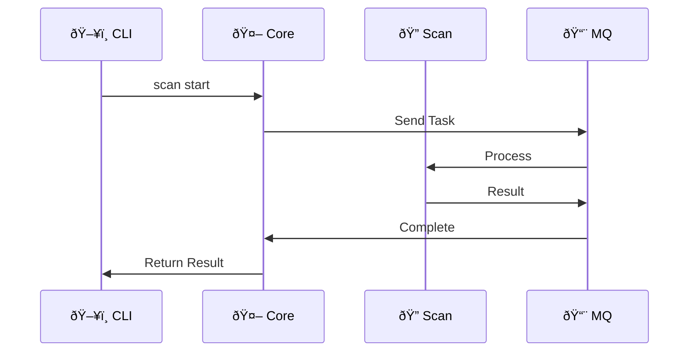

# 掃ææµç¨‹

```mermaid
sequenceDiagram
    participant CLI as ðŸ–¥ï¸ CLI
    participant Core as 🤖 Core
    participant Scan as 🔠Scan
    participant MQ as 📨 MQ

    CLI->>Core: scan start
    Core->>MQ: Send Task
    MQ->>Scan: Process
    Scan->>MQ: Result
    MQ->>Core: Complete
    Core->>CLI: Return Result
```

