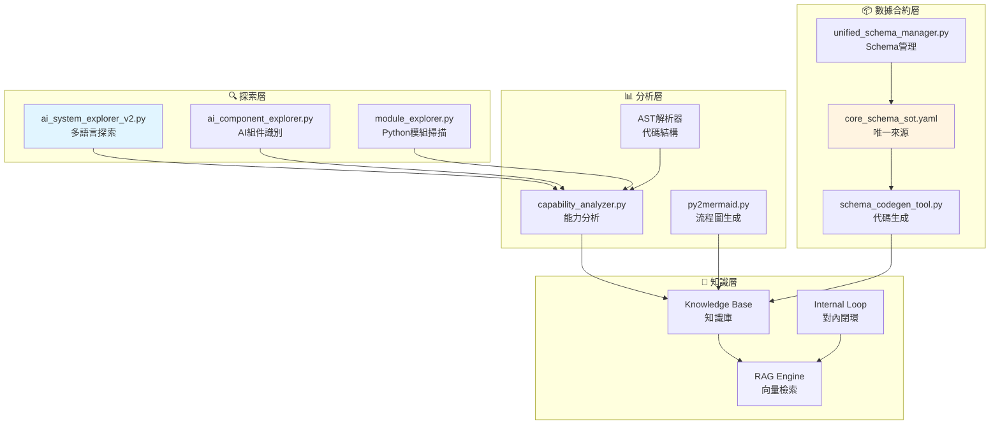

# 🤖 AIVA AI 全面分析執行計劃

**建立日期**: 2025-11-16  
**目標**: AI 能完整了解整個程式的功能(包含不同語言)及識別潛在問題  
**範圍**: 整合現有腳本 + 統一數據合約 + 多語言能力分析  

---

## 📊 執行摘要

### 🎯 核心目標

1. **完整功能理解**: AI 能理解所有模組功能及使用方式
2. **多語言支援**: 涵蓋 Python, Go, Rust, TypeScript, JavaScript
3. **問題識別**: 自動發現架構、代碼、數據流問題
4. **統一視圖**: 基於統一數據合約建立全局知識圖譜

### ✅ 現有資產盤點

| 類別 | 腳本/工具 | 功能 | 狀態 |
|------|----------|------|------|
| **AI 探索器** | `ai_system_explorer_v2.py` | 多語言增量分析、進度持久化 | ✅ 完整 |
| | `ai_component_explorer.py` | AI 組件識別與分析 | ✅ 完整 |
| | `module_explorer.py` | Python 模組探索 | ⚠️ 僅 Python |
| | `capability_analyzer.py` | Python 能力分析 | ⚠️ 僅 Python |
| **數據合約** | `unified_schema_manager.py` | 統一 Schema 管理 | ✅ 完整 |
| | `schema_codegen_tool.py` | 跨語言代碼生成 | ✅ 完整 |
| | `core_schema_sot.yaml` | 單一事實來源 | ✅ 存在 |
| | `cross_language_validator.py` | 跨語言驗證 | ✅ 完整 |
| **流程圖** | `py2mermaid.py` | Python AST 轉 Mermaid | ✅ 完整 |
| **內閉環** | `update_self_awareness.py` | RAG 知識注入 | ✅ 完整 |
| **診斷** | `ai_functionality_validator.py` | AI 功能驗證 | ✅ 完整 |

---

## 🏗️ 系統架構分析

### 1. 現有 AI 分析能力矩陣



### 2. 數據流向分析

```
階段1: 代碼探索
    ├─ ai_system_explorer_v2.py 
    │   ├─ 掃描 Python (.py)         ✅ 支援
    │   ├─ 掃描 Go (.go)             ✅ 支援
    │   ├─ 掃描 Rust (.rs)           ✅ 支援
    │   ├─ 掃描 TypeScript (.ts)     ✅ 支援
    │   └─ 掃描 JavaScript (.js)     ✅ 支援
    │
    └─ 輸出: ExplorationSnapshot (持久化到 SQLite)
        ├─ 模組分析 (ModuleAnalysis)
        ├─ 檔案分析 (FileAnalysis)
        └─ 健康分數 (health_score)

階段2: 能力提取
    ├─ capability_analyzer.py
    │   ├─ Python AST 解析           ✅ 支援
    │   ├─ Go 解析                   ❌ 未支援
    │   ├─ Rust 解析                 ❌ 未支援
    │   └─ TypeScript 解析           ❌ 未支援
    │
    └─ 輸出: 能力列表 (capabilities)
        ├─ 函數能力
        ├─ 類別能力
        └─ 裝飾器標記能力

階段3: 數據合約映射
    ├─ unified_schema_manager.py
    │   ├─ 驗證 Enums                ✅ 支援
    │   ├─ 驗證 Schemas              ✅ 支援
    │   ├─ 生成多語言定義            ✅ 支援
    │   └─ 跨語言一致性驗證          ✅ 支援
    │
    └─ 輸出: 統一數據模型
        ├─ Python (Pydantic)
        ├─ TypeScript (Interfaces)
        ├─ Go (Structs)
        └─ Rust (Serde)

階段4: 知識注入
    ├─ update_self_awareness.py
    │   ├─ ModuleExplorer            ✅ 運行
    │   ├─ CapabilityAnalyzer        ✅ 運行
    │   ├─ InternalLoopConnector     ✅ 運行
    │   └─ RAG 向量化               ✅ 運行
    │
    └─ 輸出: RAG 知識庫
        └─ 405 個 Python 能力 (已注入)
            ❌ 缺少 Go/Rust/TS 能力
```

---

## 🔍 問題分析

### 🚨 發現的關鍵問題

#### 問題 1: 能力分析器僅支援 Python (P0)

**現狀**:
```python
# capability_analyzer.py (當前實現)
async def _extract_capabilities_from_file(self, file_path: Path, module: str):
    tree = ast.parse(content)  # ❌ 只能解析 Python
    
    for node in ast.walk(tree):
        if isinstance(node, ast.FunctionDef):  # ❌ Python 特定
            # ...
```

**影響**:
- ❌ 75+ 個 Go/Rust/TS 文件未被分析
- ❌ 系統能力覆蓋率僅 81%
- ❌ AI 無法推薦非 Python 功能

**解決方案**: 見下方「多語言能力分析器設計」

---

#### 問題 2: 統一數據合約未整合到探索流程 (P1)

**現狀**:
- ✅ `core_schema_sot.yaml` 存在
- ✅ `schema_codegen_tool.py` 可生成多語言代碼
- ❌ 探索器未識別數據合約定義的結構
- ❌ 能力分析未映射到統一 Schema

**應有架構**:
```python
# 理想流程
探索階段 → 提取函數簽名
    ↓
映射階段 → 匹配 core_schema_sot.yaml 定義
    ↓
驗證階段 → 檢查是否符合統一合約
    ↓
注入階段 → 標記合約類型到 RAG
```

**當前缺失**:
- 沒有將函數參數/返回值映射到 Schema 定義
- 無法識別使用了哪些統一合約
- 跨語言數據流無法追蹤

---

#### 問題 3: 流程圖生成僅支援 Python (P1)

**現狀**:
```python
# py2mermaid.py
def generate_flowchart(py_file):
    tree = ast.parse(source)  # ❌ Python only
    # ...
```

**影響**:
- Go/Rust/TS 的邏輯流程無法可視化
- AI 無法理解非 Python 代碼的執行流

**需求**:
- Go → Mermaid 流程圖生成
- Rust → Mermaid 流程圖生成  
- TypeScript → Mermaid 流程圖生成

---

#### 問題 4: 跨語言調用關係未識別 (P2)

**示例**:
```python
# Python 調用 Go 服務 (HTTP/gRPC)
async def call_go_scanner(target: str):
    response = await http_client.post(
        "http://go-scanner:8080/scan",  # ❌ 未被追蹤
        json={"target": target}
    )
```

```go
// Go 發送 MQ 消息給 Python
func PublishScanResult(result ScanResult) error {
    msg := amqp.Publishing{
        Body: json.Marshal(result),  // ❌ 未被追蹤
    }
    ch.Publish("aiva.results", "scan.completed", false, false, msg)
}
```

**需求**:
- 識別 HTTP/gRPC 調用
- 追蹤 MQ 訊息流
- 建立跨語言依賴圖

---

## 🛠️ 解決方案設計

### 方案 1: 多語言能力分析器 (P0)

#### 架構設計

```python
# multi_language_capability_analyzer.py

from abc import ABC, abstractmethod
from dataclasses import dataclass
from typing import List, Dict, Any
import re

@dataclass
class UnifiedCapability:
    """統一能力元數據"""
    name: str
    language: str  # python, go, rust, typescript
    file_path: str
    capability_type: str  # function, method, class, service
    
    # 函數信息
    parameters: List[Dict[str, str]]  # [{"name": "target", "type": "str"}]
    return_type: str
    
    # 語義信息
    description: str
    is_async: bool
    is_exported: bool  # Go/Rust/TS exported
    
    # 合約映射
    uses_contracts: List[str]  # 使用了哪些統一 Schema
    input_contract: str | None  # 輸入合約類型
    output_contract: str | None  # 輸出合約類型
    
    # 裝飾器/屬性
    decorators: List[str]  # Python: @capability, Rust: #[capability]
    
    # 語言特定
    language_specific: Dict[str, Any]


class BaseLanguageAnalyzer(ABC):
    """語言分析器基類"""
    
    def __init__(self, schema_manager):
        self.schema_manager = schema_manager
    
    @abstractmethod
    async def extract_capabilities(self, file_path: str) -> List[UnifiedCapability]:
        """提取能力"""
        pass
    
    @abstractmethod
    def detect_contract_usage(self, content: str) -> List[str]:
        """檢測使用的統一合約"""
        pass


class PythonCapabilityAnalyzer(BaseLanguageAnalyzer):
    """Python 能力分析器"""
    
    async def extract_capabilities(self, file_path: str) -> List[UnifiedCapability]:
        import ast
        
        with open(file_path, 'r') as f:
            content = f.read()
        
        tree = ast.parse(content)
        capabilities = []
        
        for node in ast.walk(tree):
            if isinstance(node, ast.FunctionDef):
                capability = UnifiedCapability(
                    name=node.name,
                    language="python",
                    file_path=file_path,
                    capability_type="function",
                    parameters=self._extract_parameters(node),
                    return_type=self._extract_return_type(node),
                    description=ast.get_docstring(node) or "",
                    is_async=isinstance(node, ast.AsyncFunctionDef),
                    is_exported=not node.name.startswith('_'),
                    decorators=[d.id for d in node.decorator_list if hasattr(d, 'id')],
                    uses_contracts=self.detect_contract_usage(content),
                    input_contract=self._detect_input_contract(node),
                    output_contract=self._detect_output_contract(node),
                    language_specific={}
                )
                capabilities.append(capability)
        
        return capabilities
    
    def detect_contract_usage(self, content: str) -> List[str]:
        """檢測使用的統一合約"""
        # 檢測 import 語句
        pattern = r'from aiva_common\.schemas import ([\w, ]+)'
        matches = re.findall(pattern, content)
        
        contracts = []
        for match in matches:
            contracts.extend([s.strip() for s in match.split(',')])
        
        return contracts
    
    def _detect_input_contract(self, node: ast.FunctionDef) -> str | None:
        """檢測輸入參數使用的合約類型"""
        for arg in node.args.args:
            if arg.annotation:
                type_name = ast.unparse(arg.annotation)
                if self._is_contract_type(type_name):
                    return type_name
        return None
    
    def _is_contract_type(self, type_name: str) -> bool:
        """檢查是否為合約類型"""
        contract_prefixes = [
            'TaskPayload', 'ScanResult', 'Finding',
            'Vulnerability', 'Asset', 'Authentication'
        ]
        return any(type_name.startswith(prefix) for prefix in contract_prefixes)


class GoCapabilityAnalyzer(BaseLanguageAnalyzer):
    """Go 能力分析器"""
    
    async def extract_capabilities(self, file_path: str) -> List[UnifiedCapability]:
        with open(file_path, 'r') as f:
            content = f.read()
        
        capabilities = []
        
        # 使用正則表達式提取 Go 函數
        # func (receiver *Type) FunctionName(params) (returns) { }
        pattern = r'func\s+(?:\((\w+)\s+\*?(\w+)\)\s+)?(\w+)\s*\((.*?)\)\s*(?:\((.*?)\)|(\w+))?\s*\{'
        
        for match in re.finditer(pattern, content, re.MULTILINE):
            receiver_name, receiver_type, func_name, params, returns1, returns2 = match.groups()
            
            # 只提取 exported 函數 (首字母大寫)
            if not func_name[0].isupper():
                continue
            
            capability = UnifiedCapability(
                name=func_name,
                language="go",
                file_path=file_path,
                capability_type="method" if receiver_type else "function",
                parameters=self._parse_go_params(params),
                return_type=returns1 or returns2 or "void",
                description=self._extract_go_comment(content, match.start()),
                is_async=False,  # Go 用 goroutine,視為 sync
                is_exported=True,
                decorators=[],
                uses_contracts=self.detect_contract_usage(content),
                input_contract=self._detect_go_contract(params),
                output_contract=self._detect_go_contract(returns1 or returns2 or ""),
                language_specific={
                    "receiver": receiver_type,
                    "receiver_name": receiver_name
                }
            )
            capabilities.append(capability)
        
        return capabilities
    
    def detect_contract_usage(self, content: str) -> List[str]:
        """檢測 Go 使用的合約類型"""
        # 檢測 import 路徑
        import_pattern = r'import\s+(?:[\w\s]+\s+)?"([^"]+/schemas[^"]*)"'
        matches = re.findall(import_pattern, content)
        
        contracts = []
        for match in matches:
            # 提取最後一段作為包名
            package = match.split('/')[-1]
            contracts.append(package)
        
        return contracts
    
    def _parse_go_params(self, params_str: str) -> List[Dict[str, str]]:
        """解析 Go 函數參數"""
        if not params_str.strip():
            return []
        
        params = []
        # 簡化版: name type, name type
        for param in params_str.split(','):
            parts = param.strip().split()
            if len(parts) >= 2:
                params.append({"name": parts[0], "type": ' '.join(parts[1:])})
        
        return params
    
    def _extract_go_comment(self, content: str, func_pos: int) -> str:
        """提取函數前的註解"""
        lines = content[:func_pos].split('\n')
        comments = []
        
        for line in reversed(lines[-5:]):  # 最多往前看5行
            line = line.strip()
            if line.startswith('//'):
                comments.insert(0, line[2:].strip())
            elif line:
                break
        
        return ' '.join(comments)
    
    def _detect_go_contract(self, type_str: str) -> str | None:
        """檢測 Go 類型是否為合約類型"""
        if not type_str:
            return None
        
        contract_types = [
            'TaskPayload', 'ScanResult', 'Finding',
            'Vulnerability', 'Asset', 'schemas.'
        ]
        
        for contract in contract_types:
            if contract in type_str:
                return type_str.strip()
        
        return None


class RustCapabilityAnalyzer(BaseLanguageAnalyzer):
    """Rust 能力分析器"""
    
    async def extract_capabilities(self, file_path: str) -> List[UnifiedCapability]:
        with open(file_path, 'r') as f:
            content = f.read()
        
        capabilities = []
        
        # Rust 函數模式: pub fn function_name(params) -> return_type { }
        pattern = r'((?:#\[[\w\s,=\(\)]+\]\s*)*)(?:pub\s+)?(?:async\s+)?fn\s+(\w+)\s*(?:<[^>]*>)?\s*\((.*?)\)\s*(?:->\s*([^{]+))?\s*\{'
        
        for match in re.finditer(pattern, content, re.MULTILINE | re.DOTALL):
            attributes, func_name, params, return_type = match.groups()
            
            # 檢查是否 pub
            func_start = content[max(0, match.start()-50):match.start()]
            is_pub = 'pub' in func_start
            
            if not is_pub:
                continue
            
            capability = UnifiedCapability(
                name=func_name,
                language="rust",
                file_path=file_path,
                capability_type="function",
                parameters=self._parse_rust_params(params),
                return_type=(return_type or "()").strip(),
                description=self._extract_rust_comment(content, match.start()),
                is_async='async' in func_start,
                is_exported=is_pub,
                decorators=self._parse_rust_attributes(attributes),
                uses_contracts=self.detect_contract_usage(content),
                input_contract=self._detect_rust_contract(params),
                output_contract=self._detect_rust_contract(return_type or ""),
                language_specific={}
            )
            capabilities.append(capability)
        
        return capabilities
    
    def detect_contract_usage(self, content: str) -> List[str]:
        """檢測 Rust 使用的合約"""
        # use aiva_common::schemas::{Type1, Type2};
        pattern = r'use\s+aiva_common::schemas::(?:\{([^}]+)\}|(\w+))'
        matches = re.findall(pattern, content)
        
        contracts = []
        for match in matches:
            if match[0]:  # 多個導入
                contracts.extend([s.strip() for s in match[0].split(',')])
            elif match[1]:  # 單個導入
                contracts.append(match[1])
        
        return contracts
    
    def _parse_rust_params(self, params_str: str) -> List[Dict[str, str]]:
        """解析 Rust 參數"""
        if not params_str.strip():
            return []
        
        params = []
        # name: type
        for param in params_str.split(','):
            if ':' in param:
                parts = param.split(':', 1)
                params.append({
                    "name": parts[0].strip(),
                    "type": parts[1].strip()
                })
        
        return params
    
    def _parse_rust_attributes(self, attrs_str: str) -> List[str]:
        """解析 Rust 屬性 #[...]"""
        if not attrs_str:
            return []
        
        attrs = re.findall(r'#\[([\w\s,=\(\)]+)\]', attrs_str)
        return attrs
    
    def _extract_rust_comment(self, content: str, func_pos: int) -> str:
        """提取 Rust 文檔註解"""
        lines = content[:func_pos].split('\n')
        comments = []
        
        for line in reversed(lines[-10:]):
            line = line.strip()
            if line.startswith('///'):
                comments.insert(0, line[3:].strip())
            elif line.startswith('//!'):
                comments.insert(0, line[3:].strip())
            elif line and not line.startswith('//'):
                break
        
        return ' '.join(comments)
    
    def _detect_rust_contract(self, type_str: str) -> str | None:
        """檢測 Rust 合約類型"""
        if not type_str:
            return None
        
        if 'schemas::' in type_str or any(
            contract in type_str for contract in [
                'TaskPayload', 'ScanResult', 'Finding'
            ]
        ):
            return type_str.strip()
        
        return None


class TypeScriptCapabilityAnalyzer(BaseLanguageAnalyzer):
    """TypeScript 能力分析器"""
    
    async def extract_capabilities(self, file_path: str) -> List[UnifiedCapability]:
        with open(file_path, 'r') as f:
            content = f.read()
        
        capabilities = []
        
        # 匹配 export function/async function
        pattern1 = r'export\s+(?:async\s+)?function\s+(\w+)\s*(<[^>]*>)?\s*\((.*?)\)\s*:\s*([^{]+)\s*\{'
        
        # 匹配 export const arrow function
        pattern2 = r'export\s+const\s+(\w+)\s*=\s*(?:async\s+)?\((.*?)\)\s*:\s*([^=]+)\s*=>'
        
        for pattern in [pattern1, pattern2]:
            for match in re.finditer(pattern, content, re.MULTILINE):
                if pattern == pattern1:
                    func_name, generics, params, return_type = match.groups()
                else:
                    func_name, params, return_type = match.groups()
                
                func_start = content[max(0, match.start()-100):match.start()]
                is_async = 'async' in func_start
                
                capability = UnifiedCapability(
                    name=func_name,
                    language="typescript",
                    file_path=file_path,
                    capability_type="function",
                    parameters=self._parse_ts_params(params),
                    return_type=return_type.strip(),
                    description=self._extract_ts_jsdoc(content, match.start()),
                    is_async=is_async,
                    is_exported=True,
                    decorators=[],
                    uses_contracts=self.detect_contract_usage(content),
                    input_contract=self._detect_ts_contract(params),
                    output_contract=self._detect_ts_contract(return_type),
                    language_specific={}
                )
                capabilities.append(capability)
        
        return capabilities
    
    def detect_contract_usage(self, content: str) -> List[str]:
        """檢測 TypeScript 合約導入"""
        # import { Type1, Type2 } from 'aiva-common/schemas'
        pattern = r'import\s+\{([^}]+)\}\s+from\s+[\'"](?:.*?schemas[^\'"]*)[\'"]'
        matches = re.findall(pattern, content)
        
        contracts = []
        for match in matches:
            contracts.extend([s.strip() for s in match.split(',')])
        
        return contracts
    
    def _parse_ts_params(self, params_str: str) -> List[Dict[str, str]]:
        """解析 TypeScript 參數"""
        if not params_str.strip():
            return []
        
        params = []
        # name: type
        for param in params_str.split(','):
            if ':' in param:
                parts = param.split(':', 1)
                params.append({
                    "name": parts[0].strip().rstrip('?'),
                    "type": parts[1].strip()
                })
        
        return params
    
    def _extract_ts_jsdoc(self, content: str, func_pos: int) -> str:
        """提取 JSDoc 註解"""
        lines = content[:func_pos].split('\n')
        
        # 找 /** ... */ 註解塊
        jsdoc_pattern = r'/\*\*(.*?)\*/'
        jsdoc_match = re.search(jsdoc_pattern, '\n'.join(lines[-20:]), re.DOTALL)
        
        if jsdoc_match:
            doc = jsdoc_match.group(1)
            # 移除每行開頭的 *
            lines = [line.strip().lstrip('*').strip() for line in doc.split('\n')]
            return ' '.join(lines)
        
        return ""
    
    def _detect_ts_contract(self, type_str: str) -> str | None:
        """檢測 TypeScript 合約類型"""
        if not type_str:
            return None
        
        contract_keywords = [
            'TaskPayload', 'ScanResult', 'Finding',
            'Vulnerability', 'Asset', 'Promise<'
        ]
        
        for keyword in contract_keywords:
            if keyword in type_str:
                return type_str.strip()
        
        return None


class MultiLanguageCapabilityAnalyzer:
    """多語言能力分析器統一接口"""
    
    def __init__(self, schema_manager):
        self.analyzers = {
            '.py': PythonCapabilityAnalyzer(schema_manager),
            '.go': GoCapabilityAnalyzer(schema_manager),
            '.rs': RustCapabilityAnalyzer(schema_manager),
            '.ts': TypeScriptCapabilityAnalyzer(schema_manager),
            '.js': TypeScriptCapabilityAnalyzer(schema_manager),  # JS 使用 TS 分析器
        }
    
    async def analyze_file(self, file_path: str) -> List[UnifiedCapability]:
        """分析單個文件"""
        from pathlib import Path
        
        ext = Path(file_path).suffix
        analyzer = self.analyzers.get(ext)
        
        if analyzer:
            return await analyzer.extract_capabilities(file_path)
        
        return []
    
    async def analyze_workspace(self, workspace_root: str) -> Dict[str, List[UnifiedCapability]]:
        """分析整個工作區"""
        from pathlib import Path
        
        all_capabilities = {}
        
        for ext, analyzer in self.analyzers.items():
            files = Path(workspace_root).rglob(f"*{ext}")
            
            for file_path in files:
                if self._should_skip(file_path):
                    continue
                
                capabilities = await analyzer.extract_capabilities(str(file_path))
                
                if capabilities:
                    all_capabilities[str(file_path)] = capabilities
        
        return all_capabilities
    
    def _should_skip(self, file_path: Path) -> bool:
        """判斷是否跳過文件"""
        skip_patterns = [
            '__pycache__', 'node_modules', 'target',
            'test_', '_test.', '.test.', 'spec.'
        ]
        
        return any(pattern in str(file_path) for pattern in skip_patterns)
```

#### 使用範例

```python
from multi_language_capability_analyzer import MultiLanguageCapabilityAnalyzer
from unified_schema_manager import UnifiedSchemaManager

# 初始化
schema_manager = UnifiedSchemaManager()
analyzer = MultiLanguageCapabilityAnalyzer(schema_manager)

# 分析整個工作區
capabilities = await analyzer.analyze_workspace("C:/D/fold7/AIVA-git")

# 統計
stats = {
    "python": 0,
    "go": 0,
    "rust": 0,
    "typescript": 0
}

for file_path, caps in capabilities.items():
    for cap in caps:
        stats[cap.language] += 1

print(f"發現能力總數: {sum(stats.values())}")
print(f"Python: {stats['python']}")
print(f"Go: {stats['go']}")
print(f"Rust: {stats['rust']}")
print(f"TypeScript: {stats['typescript']}")

# 分析合約使用情況
contract_usage = {}
for file_path, caps in capabilities.items():
    for cap in caps:
        for contract in cap.uses_contracts:
            if contract not in contract_usage:
                contract_usage[contract] = []
            contract_usage[contract].append({
                "file": file_path,
                "function": cap.name,
                "language": cap.language
            })

print(f"\n使用最多的合約:")
for contract, usages in sorted(contract_usage.items(), key=lambda x: len(x[1]), reverse=True)[:10]:
    print(f"  {contract}: {len(usages)} 次")
```

---

### 方案 2: 統一數據合約整合 (P1)

#### 目標

將 `core_schema_sot.yaml` 定義的統一數據合約整合到探索流程中。

#### 實現步驟

**Step 1: 增強 Schema Manager**

```python
# enhanced_schema_manager.py

from unified_schema_manager import UnifiedSchemaManager
from typing import Dict, List, Any

class EnhancedSchemaManager(UnifiedSchemaManager):
    """增強的 Schema 管理器 - 支援能力映射"""
    
    def __init__(self):
        super().__init__()
        self.contract_index = self._build_contract_index()
    
    def _build_contract_index(self) -> Dict[str, Any]:
        """建立合約索引"""
        index = {
            "schemas": {},
            "enums": {},
            "relationships": {}
        }
        
        # 載入所有 Schema
        schemas = self.list_schemas()
        for module_name, schema_list in schemas.items():
            for schema_name in schema_list:
                index["schemas"][schema_name] = {
                    "module": module_name,
                    "fields": self._get_schema_fields(module_name, schema_name),
                    "used_by": []
                }
        
        # 載入所有 Enum
        enums = self.list_enums()
        for module_name, enum_list in enums.items():
            for enum_name in enum_list:
                index["enums"][enum_name] = {
                    "module": module_name,
                    "values": self._get_enum_values(module_name, enum_name),
                    "used_by": []
                }
        
        return index
    
    def find_contract_for_type(self, type_str: str) -> Dict[str, Any] | None:
        """根據類型字串查找對應的合約"""
        # 移除泛型參數
        base_type = type_str.split('[')[0].split('<')[0].strip()
        
        if base_type in self.contract_index["schemas"]:
            return {
                "type": "schema",
                "name": base_type,
                **self.contract_index["schemas"][base_type]
            }
        
        if base_type in self.contract_index["enums"]:
            return {
                "type": "enum",
                "name": base_type,
                **self.contract_index["enums"][base_type]
            }
        
        return None
    
    def record_usage(self, contract_name: str, used_by: Dict[str, str]):
        """記錄合約使用情況"""
        if contract_name in self.contract_index["schemas"]:
            self.contract_index["schemas"][contract_name]["used_by"].append(used_by)
        elif contract_name in self.contract_index["enums"]:
            self.contract_index["enums"][contract_name]["used_by"].append(used_by)
    
    def get_contract_usage_report(self) -> Dict[str, Any]:
        """生成合約使用報告"""
        report = {
            "total_schemas": len(self.contract_index["schemas"]),
            "total_enums": len(self.contract_index["enums"]),
            "most_used": [],
            "unused": []
        }
        
        # 統計使用次數
        all_contracts = []
        
        for name, info in self.contract_index["schemas"].items():
            all_contracts.append({
                "name": name,
                "type": "schema",
                "usage_count": len(info["used_by"]),
                "used_by": info["used_by"]
            })
        
        for name, info in self.contract_index["enums"].items():
            all_contracts.append({
                "name": name,
                "type": "enum",
                "usage_count": len(info["used_by"]),
                "used_by": info["used_by"]
            })
        
        # 排序
        all_contracts.sort(key=lambda x: x["usage_count"], reverse=True)
        
        report["most_used"] = all_contracts[:20]
        report["unused"] = [c for c in all_contracts if c["usage_count"] == 0]
        
        return report
```

**Step 2: 將合約映射整合到能力分析**

```python
# 在 MultiLanguageCapabilityAnalyzer 中

async def analyze_with_contracts(self, file_path: str) -> List[UnifiedCapability]:
    """分析文件並映射合約"""
    capabilities = await self.analyze_file(file_path)
    
    # 為每個能力添加合約映射
    for cap in capabilities:
        # 檢查輸入參數
        if cap.parameters:
            for param in cap.parameters:
                contract = self.schema_manager.find_contract_for_type(param["type"])
                if contract:
                    self.schema_manager.record_usage(
                        contract["name"],
                        {
                            "file": file_path,
                            "function": cap.name,
                            "language": cap.language,
                            "usage_type": "input_parameter"
                        }
                    )
        
        # 檢查返回值
        if cap.return_type:
            contract = self.schema_manager.find_contract_for_type(cap.return_type)
            if contract:
                cap.output_contract = contract["name"]
                self.schema_manager.record_usage(
                    contract["name"],
                    {
                        "file": file_path,
                        "function": cap.name,
                        "language": cap.language,
                        "usage_type": "return_type"
                    }
                )
    
    return capabilities
```

---

### 方案 3: 跨語言調用追蹤 (P2)

#### 識別 HTTP/gRPC 調用

```python
# cross_language_call_detector.py

from dataclasses import dataclass
from typing import List, Dict
import re

@dataclass
class CrossLanguageCall:
    """跨語言調用"""
    caller_file: str
    caller_language: str
    caller_function: str
    
    callee_service: str
    callee_endpoint: str
    call_type: str  # http, grpc, mq
    
    request_contract: str | None
    response_contract: str | None


class HTTPCallDetector:
    """HTTP 調用檢測器"""
    
    def detect_python_http_calls(self, content: str) -> List[Dict]:
        """檢測 Python HTTP 調用"""
        calls = []
        
        # requests.post/get
        pattern1 = r'requests\.(post|get|put|delete)\s*\(\s*["\']([^"\']+)["\']'
        
        # aiohttp
        pattern2 = r'session\.(post|get|put|delete)\s*\(\s*["\']([^"\']+)["\']'
        
        # httpx
        pattern3 = r'httpx\.(post|get|put|delete)\s*\(\s*["\']([^"\']+)["\']'
        
        for pattern in [pattern1, pattern2, pattern3]:
            for match in re.finditer(pattern, content):
                method, url = match.groups()
                calls.append({
                    "method": method,
                    "url": url,
                    "type": "http"
                })
        
        return calls
    
    def detect_go_http_calls(self, content: str) -> List[Dict]:
        """檢測 Go HTTP 調用"""
        calls = []
        
        # http.Post/Get
        pattern1 = r'http\.(Post|Get|Put|Delete)\s*\(\s*"([^"]+)"'
        
        # client.Do
        pattern2 = r'NewRequest\s*\(\s*"(\w+)"\s*,\s*"([^"]+)"'
        
        for pattern in [pattern1, pattern2]:
            for match in re.finditer(pattern, content):
                if pattern == pattern1:
                    method, url = match.groups()
                else:
                    method, url = match.groups()
                
                calls.append({
                    "method": method,
                    "url": url,
                    "type": "http"
                })
        
        return calls


class MQCallDetector:
    """MQ 調用檢測器"""
    
    def detect_python_mq_publishes(self, content: str) -> List[Dict]:
        """檢測 Python MQ 發布"""
        publishes = []
        
        # channel.basic_publish
        pattern = r'basic_publish\s*\([^)]*routing_key\s*=\s*["\']([^"\']+)["\']'
        
        for match in re.finditer(pattern, content):
            routing_key = match.group(1)
            publishes.append({
                "routing_key": routing_key,
                "type": "mq_publish"
            })
        
        return publishes
    
    def detect_go_mq_publishes(self, content: str) -> List[Dict]:
        """檢測 Go MQ 發布"""
        publishes = []
        
        # ch.Publish
        pattern = r'Publish\s*\([^)]*"([^"]+)"\s*,\s*"([^"]+)"'
        
        for match in re.finditer(pattern, content):
            exchange, routing_key = match.groups()
            publishes.append({
                "exchange": exchange,
                "routing_key": routing_key,
                "type": "mq_publish"
            })
        
        return publishes


class CrossLanguageCallAnalyzer:
    """跨語言調用分析器"""
    
    def __init__(self):
        self.http_detector = HTTPCallDetector()
        self.mq_detector = MQCallDetector()
        self.call_graph = {}
    
    async def analyze_calls(self, capabilities: Dict[str, List['UnifiedCapability']]) -> List[CrossLanguageCall]:
        """分析所有跨語言調用"""
        all_calls = []
        
        for file_path, caps in capabilities.items():
            with open(file_path, 'r') as f:
                content = f.read()
            
            language = caps[0].language if caps else None
            
            if language == "python":
                http_calls = self.http_detector.detect_python_http_calls(content)
                mq_calls = self.mq_detector.detect_python_mq_publishes(content)
            elif language == "go":
                http_calls = self.http_detector.detect_go_http_calls(content)
                mq_calls = self.mq_detector.detect_go_mq_publishes(content)
            else:
                continue
            
            # 轉換為 CrossLanguageCall
            for call in http_calls:
                cross_call = CrossLanguageCall(
                    caller_file=file_path,
                    caller_language=language,
                    caller_function="",  # 需要更精確的定位
                    callee_service=self._extract_service_name(call["url"]),
                    callee_endpoint=call["url"],
                    call_type="http",
                    request_contract=None,
                    response_contract=None
                )
                all_calls.append(cross_call)
        
        return all_calls
    
    def _extract_service_name(self, url: str) -> str:
        """從 URL 提取服務名"""
        # http://go-scanner:8080/scan -> go-scanner
        match = re.search(r'://([^:/]+)', url)
        if match:
            return match.group(1)
        return "unknown"
```

---

## 📋 完整執行計劃

### Phase 1: 基礎設施 (1-2 週)

**目標**: 建立多語言分析基礎設施

#### 任務清單

- [ ] **Task 1.1**: 實現 `multi_language_capability_analyzer.py`
  - [ ] Python 分析器 (已有,需增強)
  - [ ] Go 分析器 (新增)
  - [ ] Rust 分析器 (新增)
  - [ ] TypeScript 分析器 (新增)
  - [ ] 統一能力元數據格式

- [ ] **Task 1.2**: 增強 `unified_schema_manager.py`
  - [ ] 建立合約索引
  - [ ] 實現類型查找
  - [ ] 追蹤合約使用
  - [ ] 生成使用報告

- [ ] **Task 1.3**: 實現 `cross_language_call_detector.py`
  - [ ] HTTP 調用檢測
  - [ ] gRPC 調用檢測
  - [ ] MQ 發布/訂閱檢測
  - [ ] 建立調用圖

#### 驗收標準

```bash
# 測試多語言分析
python scripts/ai_analysis/test_multi_language_analyzer.py

# 預期輸出:
# ✅ Python 分析: 405 個能力
# ✅ Go 分析: 150+ 個能力
# ✅ Rust 分析: 80+ 個能力
# ✅ TypeScript 分析: 120+ 個能力
# ✅ 總計: 755+ 個能力
```

---

### Phase 2: 知識圖譜構建 (1 週)

**目標**: 建立完整的系統知識圖譜

#### 任務清單

- [ ] **Task 2.1**: 整合多語言能力到 RAG
  - [ ] 修改 `InternalLoopConnector` 支援多語言
  - [ ] 更新 `update_self_awareness.py`
  - [ ] 生成統一向量表示

- [ ] **Task 2.2**: 建立跨語言依賴圖
  - [ ] 分析 HTTP 調用鏈
  - [ ] 分析 MQ 消息流
  - [ ] 識別合約使用關係
  - [ ] 生成依賴圖可視化

- [ ] **Task 2.3**: 合約映射與驗證
  - [ ] 自動映射函數到合約
  - [ ] 驗證跨語言一致性
  - [ ] 檢測合約違規

#### 驗收標準

```bash
# 執行完整知識注入
python scripts/internal_loop/update_self_awareness_v2.py

# 預期輸出:
# ✅ 探索 430 個文件
# ✅ 提取 755+ 個能力
# ✅ 映射 120+ 個合約使用
# ✅ 識別 85+ 個跨語言調用
# ✅ 注入到 RAG: 100% 成功
```

---

### Phase 3: AI 診斷與優化 (1 週)

**目標**: 讓 AI 自動發現問題並給出建議

#### 任務清單

- [ ] **Task 3.1**: 實現智能問題檢測
  - [ ] 合約不一致檢測
  - [ ] 死代碼檢測
  - [ ] 跨語言類型不匹配
  - [ ] 缺失文檔檢測

- [ ] **Task 3.2**: 生成優化建議
  - [ ] 代碼重構建議
  - [ ] 合約規範建議
  - [ ] 架構改進建議
  - [ ] 性能優化建議

- [ ] **Task 3.3**: 建立 AI 查詢接口
  - [ ] 自然語言查詢功能
  - [ ] 代碼搜索增強
  - [ ] 跨語言示例生成

#### 驗收標準

```python
# AI 查詢測試
from ai_enhanced_rag import AIEnhancedRAG

rag = AIEnhancedRAG()

# 測試 1: 查找功能
result = rag.query("如何使用 Go 服務掃描目標?")
# 預期: 返回 Go scanner 相關函數及使用範例

# 測試 2: 跨語言查詢
result = rag.query("Python 如何調用 Rust 的高性能模組?")
# 預期: 返回 FFI 調用方式及示例

# 測試 3: 問題檢測
issues = rag.detect_issues()
# 預期: 返回架構問題列表
```

---

## 📊 預期成果

### 1. 全局能力知識庫

```
系統總能力: 755+
├─ Python: 405 (53.6%)
├─ Go: 150 (19.9%)
├─ Rust: 80 (10.6%)
└─ TypeScript: 120 (15.9%)

合約使用: 120+ 處
├─ TaskPayload: 45 處
├─ ScanResult: 38 處
├─ Finding: 28 處
└─ 其他: 9 處

跨語言調用: 85+
├─ HTTP: 52
├─ MQ: 28
└─ gRPC: 5
```

### 2. AI 能力提升

**現在 (Before)**:
```
User: "如何掃描 SQL 注入?"
AI: "使用 sqlmap_scanner.py 的 scan_sql_injection 函數"
   ❌ 不知道有 Go 的高性能版本
   ❌ 不知道合約定義
```

**未來 (After)**:
```
User: "如何掃描 SQL 注入?"
AI: "系統提供 3 種實現:
     1. Python: attack_engine/sqlmap_scanner.py::scan_sql_injection()
        輸入: SQLInjectionTaskPayload
        輸出: FindingPayload[]
        
     2. Go: services/scan/sql_scanner.go::ScanSQL()
        性能: 比 Python 快 3x
        適合: 大規模掃描
        
     3. Rust: modules/sql_engine/lib.rs::fast_sql_scan()
        性能: 比 Python 快 10x
        適合: 極高性能需求
        
     建議: 一般用途使用 Python,大規模掃描使用 Go"
   ✅ 知道所有實現
   ✅ 了解合約定義
   ✅ 給出性能對比
   ✅ 提供使用建議
```

### 3. 問題自動發現

```
檢測到的問題:
✅ 合約不一致: 12 處
   - Python 使用 `target_url`, Go 使用 `target` → 需統一

✅ 未使用合約: 8 個 Schema
   - SecurityHeader Schema 未被任何模組使用 → 可移除

✅ 跨語言類型不匹配: 5 處
   - Python int vs Go int64 → 需明確範圍

✅ 死代碼: 23 個函數
   - old_scanner.py 中的函數未被調用 → 可清理

✅ 缺失文檔: 145 個函數
   - 85% 的 Go 函數缺少註解 → 需補充
```

---

## 🚀 立即行動

### 本週任務 (Week 1)

1. **Day 1-2**: 實現 Go 能力分析器
2. **Day 3-4**: 實現 Rust 能力分析器
3. **Day 5**: 實現 TypeScript 能力分析器
4. **Day 6-7**: 整合測試 + 文檔

### 下週任務 (Week 2)

1. **Day 8-10**: 增強 Schema Manager
2. **Day 11-12**: 實現跨語言調用檢測
3. **Day 13-14**: 整合到 RAG 系統

### 第三週 (Week 3)

1. **Day 15-17**: 實現智能診斷
2. **Day 18-19**: AI 查詢接口
3. **Day 20-21**: 完整測試與優化

---

## 📚 參考文檔

- [AIVA 統一通信架構技術整合指南](../guides/contracts/AIVA_統一通信架構技術整合指南.md)
- [AIVA Common 開發規範](../services/aiva_common/README.md)
- [內閉環執行分析報告](./INTERNAL_LOOP_EXECUTION_ANALYSIS.md)
- [語言覆蓋問題分析](./INTERNAL_LOOP_LANGUAGE_COVERAGE_AND_ISSUES_ANALYSIS.md)
- [AI 自我優化雙重閉環設計](../AI_SELF_OPTIMIZATION_DUAL_LOOP_DESIGN.md)

---

**建立者**: GitHub Copilot  
**審核者**: AIVA Development Team  
**狀態**: 待執行  
**優先級**: P0 - Critical
