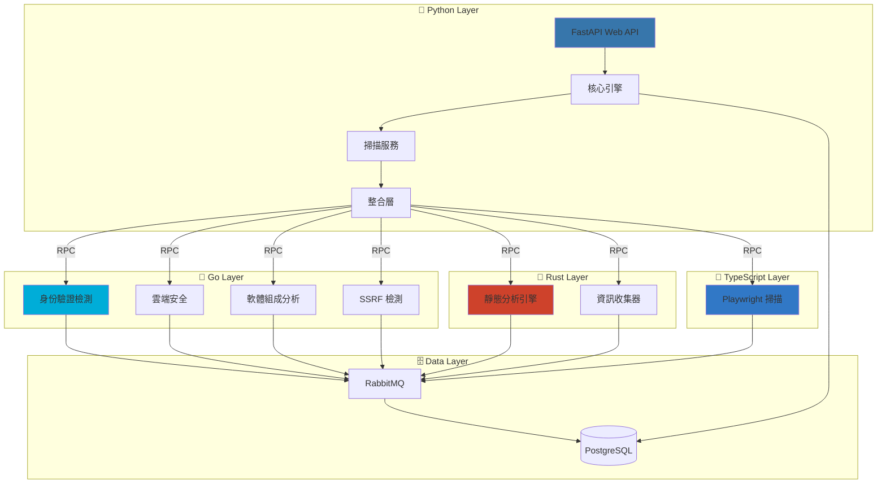
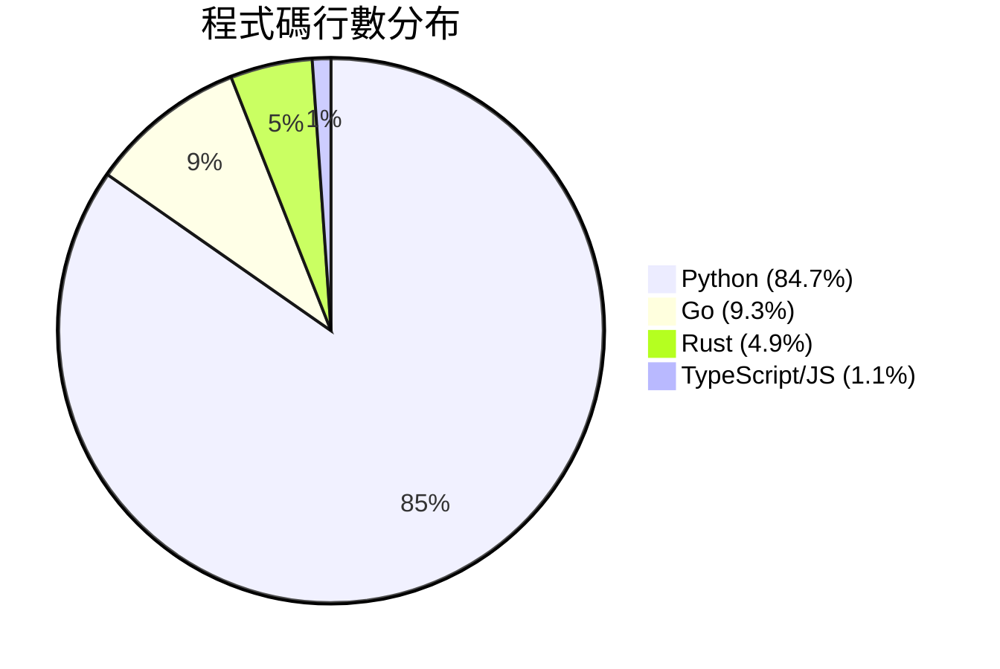
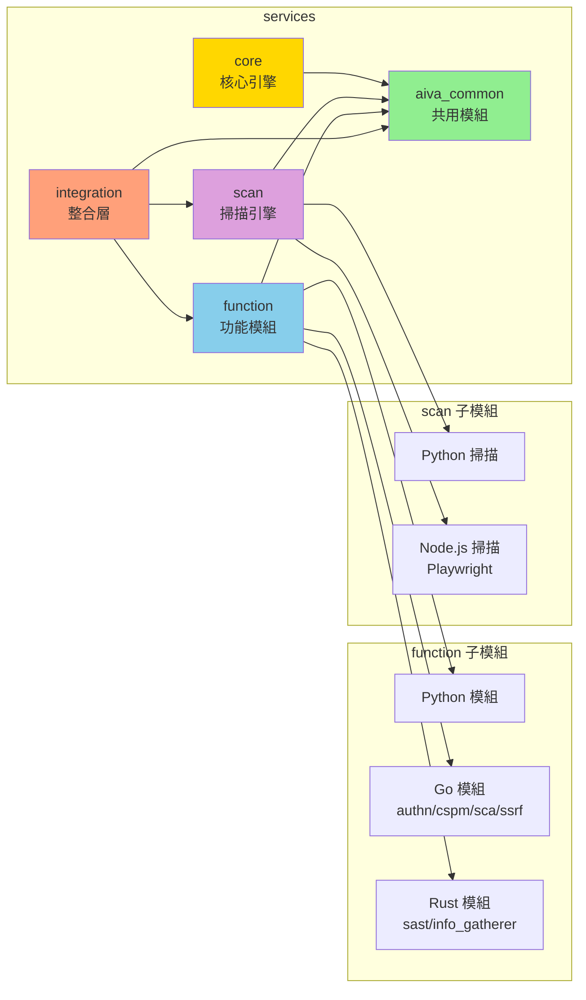
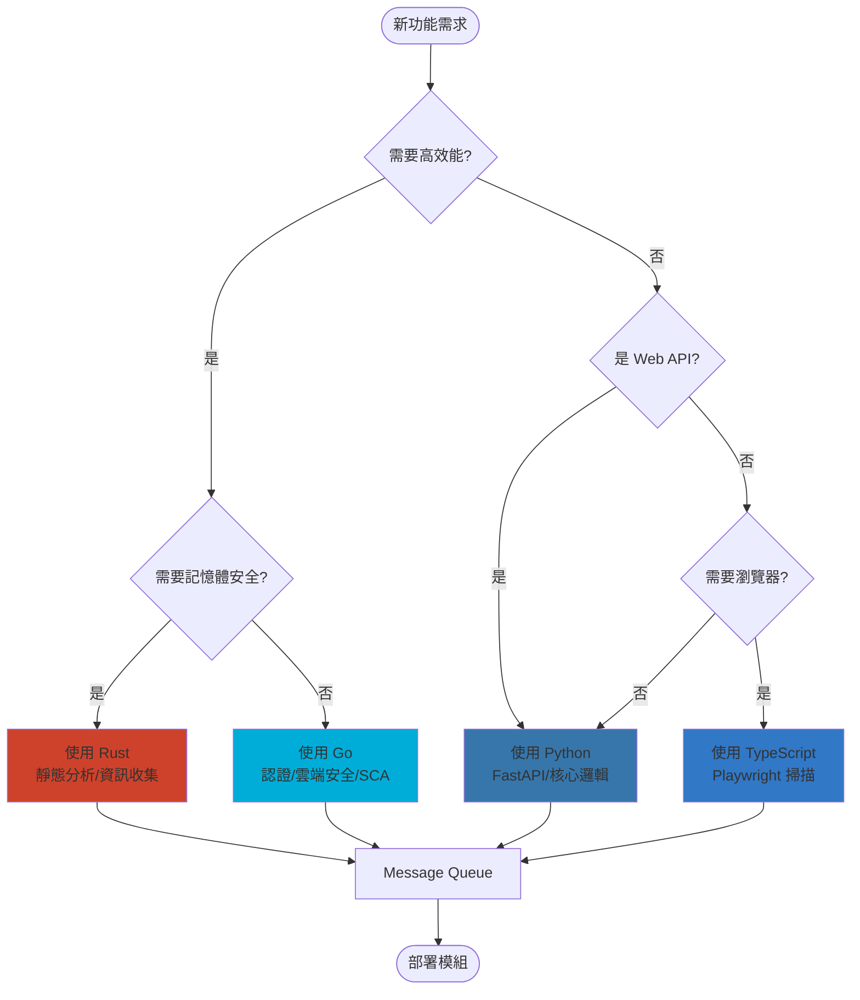
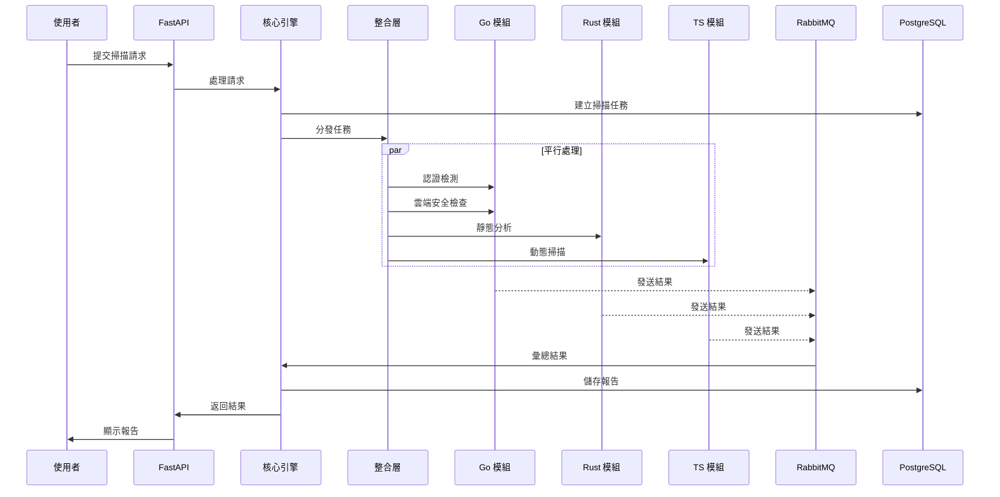
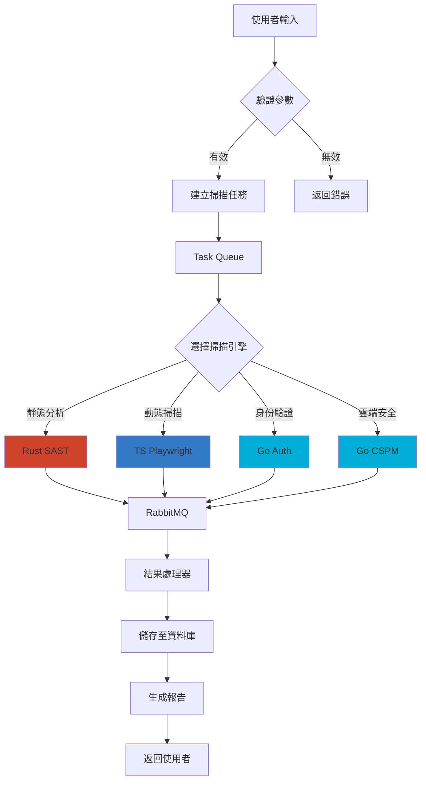
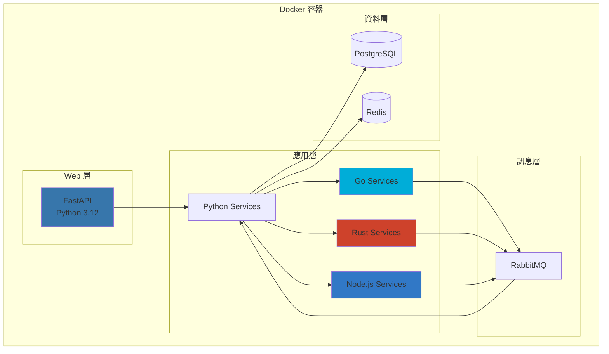

# AIVA 專案架構圖集

生成時間: 2025-10-13 14:10:59

## 1. 多語言架構概覽



## 2. 程式碼分布統計



## 3. 模組關係圖



## 4. 技術棧選擇流程



## 5. 掃描工作流程



## 6. 資料流程圖



## 7. 部署架構圖



---

### 圖表說明

- **多語言架構概覽**: 展示各層級間的關係和資料流向
- **程式碼分布統計**: 各語言的程式碼行數佔比
- **模組關係圖**: 服務模組間的依賴關係
- **技術棧選擇流程**: 選擇程式語言的決策流程
- **掃描工作流程**: 漏洞掃描的完整流程
- **資料流程圖**: 資料在系統中的流動
- **部署架構圖**: Docker 容器部署架構

### 如何使用

1. 複製 Mermaid 程式碼到 Markdown 檔案
2. 使用支援 Mermaid 的編輯器預覽 (如 VS Code + Mermaid 外掛)
3. 或使用線上工具: https://mermaid.live/

### 更新圖表

執行以下命令重新生成圖表:

```bash
python tools/generate_mermaid_diagrams.py
```

---

*此檔案由 AIVA 自動生成工具建立*
