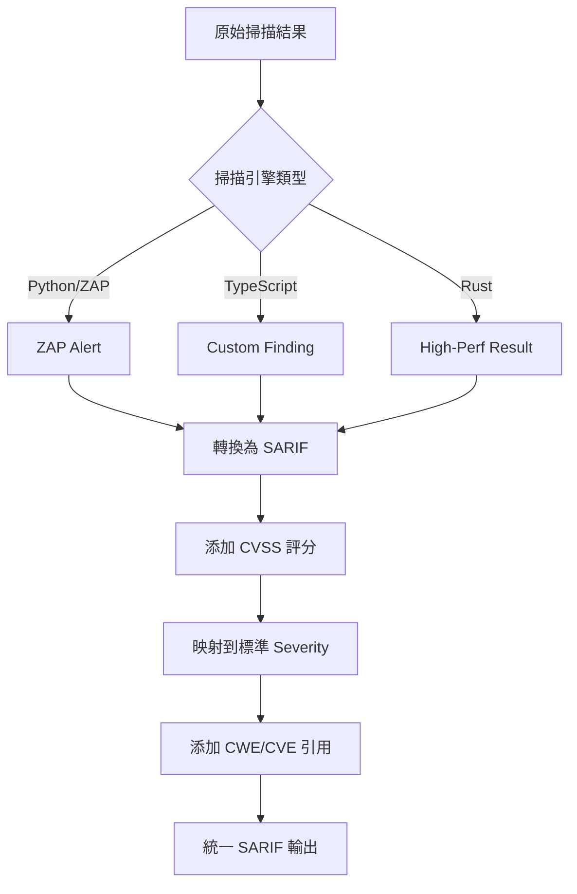

# 🎯 模組開發規範部署報告

**報告時間**: 2025-10-25  
**執行範圍**: 4 個核心服務模組  
**任務狀態**: ✅ 完成

---

## 📋 執行摘要

根據 `services/aiva_common/README.md` 中建立的設計原則,已成功將開發規範添加到 AIVA 的四個核心模組的 README 文件中,並根據各模組的實際特性進行了客製化調整。

### 🎯 核心目標

1. ✅ **統一數據標準**: 確保所有模組遵循 aiva_common 的單一真實來源原則
2. ✅ **客製化指引**: 根據各模組的技術棧和職責提供針對性的開發規範
3. ✅ **問題導向**: 直接指出各模組中已發現的違規問題並提供修復方案
4. ✅ **實用示例**: 提供符合各模組實際使用場景的代碼範例

---

## 📊 部署詳情

### 1️⃣ **Core 模組** - AI 決策引擎

**文件**: `services/core/README.md`  
**位置**: 第 1040 行新增開發規範章節  
**原始大小**: 1060 行 → **新大小**: ~1260 行

#### 📐 客製化重點

- **AI 專屬枚舉判斷**: 強調何時可以定義 Core 專屬的 AI 相關枚舉
- **任務管理規範**: 針對發現的 `task_converter.py` TaskStatus 重複問題提供修復方案
- **決策鏈驗證**: 提供 AI 引擎特有的驗證命令

#### 🔑 關鍵內容

```markdown
✅ 合理的 Core 專屬枚舉（AI 內部使用）
class AIReasoningMode(str, Enum):
    """AI 推理模式 - 僅用於 Core 內部的 AI 引擎"""
    FAST_INFERENCE = "fast"
    DEEP_REASONING = "deep"
    HYBRID_ANALYSIS = "hybrid"
```

#### ⚠️ 已識別問題

- **問題檔案**: `aiva_core/planner/task_converter.py`
- **問題類型**: 重複定義 TaskStatus 枚舉
- **修復優先級**: P1（中等優先級）

---

### 2️⃣ **Features 模組** - 多語言安全功能層

**文件**: `services/features/README.md`  
**位置**: 第 165 行新增開發規範章節  
**原始大小**: 186 行 → **新大小**: ~716 行（v1.1 更新）

#### 📐 客製化重點

- **多語言一致性**: 提供 Python/Go/Rust 三種語言的枚舉定義對照
- **跨語言數據交換**: 強調 SARIF 標準在多語言間的重要性
- **Fallback 代碼移除**: 針對發現的 `client_side_auth_bypass/worker.py` 問題
- **🎨 架構靈活性原則（v1.1 新增）**: 子功能內部架構完全自由

#### 🔑 關鍵內容

**Python 標準**:
```python
from aiva_common.enums import Severity, Confidence
```

**Rust 對應**:
```rust
#[derive(Serialize, Deserialize)]
#[serde(rename_all = "lowercase")]
pub enum Severity {
    Critical,  // 對應 Python 的 "critical"
    High,      // 對應 Python 的 "high"
    // ...
}
```

**Go 對應**:
```go
const (
    SeverityCritical = "critical"  // 與 Python 一致
    SeverityHigh     = "high"
    // ...
)
```

**🎨 架構靈活性（v1.1 新增）**:
```
┌──────────────────────────────────────────────────┐
│  ✅ 必須遵守（五大模組層級）:                    │
│     • aiva_common 標準                           │
│     • 統一跨模組接口                             │
│     • 語言官方規範                               │
│                                                   │
│  🎨 完全自由（子功能內部）:                      │
│     • 目錄結構（扁平/分層/模塊化）               │
│     • 實現方式（OOP/函數式/事件驅動）            │
│     • 並發模型（asyncio/tokio/goroutines）       │
│                                                   │
│  範例: 簡單功能用單文件，複雜功能用分層架構     │
└──────────────────────────────────────────────────┘
```

#### ⚠️ 已識別問題

- **問題檔案**: `client_side_auth_bypass/worker.py`
- **問題類型**: Fallback 代碼中重複定義 Severity, Confidence
- **修復優先級**: P2（低優先級,僅在 ImportError 時生效）

---

### 3️⃣ **Scan 模組** - 統一掃描引擎

**文件**: `services/scan/README.md`  
**位置**: 第 628 行新增開發規範章節  
**原始大小**: 632 行 → **新大小**: ~1050 行

#### 📐 客製化重點

- **SARIF 標準合規**: 強調所有掃描結果必須符合 SARIF 2.1.0 規範
- **CVSS 標準評分**: 要求使用 CVSSv3Metrics 進行漏洞評分
- **多引擎一致性**: 確保 Python/TypeScript/Rust 三種掃描引擎輸出格式一致

#### 🔑 關鍵內容

**掃描結果標準化流程圖**:


#### ⚠️ 已識別問題

- **當前狀態**: ✅ 無違規問題發現
- **注意事項**: 需持續監控新增掃描規則是否符合 SARIF 標準

---

### 4️⃣ **Integration 模組** - 企業整合中樞

**文件**: `services/integration/README.md`  
**位置**: 第 1432 行新增開發規範章節  
**原始大小**: 1452 行 → **新大小**: ~1950 行

#### 📐 客製化重點

- **資料庫模型規範**: 強調 SQLAlchemy 模型必須使用 aiva_common 枚舉
- **Alembic 遷移最佳實踐**: 提供資料庫遷移腳本的標準寫法
- **外部系統整合**: 展示如何將 JIRA/ServiceNow 數據映射為 aiva_common 標準
- **P0 緊急修復**: 直接指出 reception/models_enhanced.py 的嚴重問題

#### 🔑 關鍵內容

**SQLAlchemy 模型正確用法**:
```python
from sqlalchemy import Column, Enum as SQLEnum
from aiva_common.enums import AssetType, Severity

class Asset(Base):
    asset_type = Column(
        SQLEnum(AssetType),
        nullable=False,
        default=AssetType.WEB_APP
    )
```

**Alembic 遷移腳本**:
```python
from aiva_common.enums import AssetType, Severity

def upgrade():
    op.create_table(
        'assets',
        sa.Column('asset_type', sa.Enum(AssetType), nullable=False),
        sa.Column('severity', sa.Enum(Severity), nullable=False),
    )
```

#### ⚠️ 已識別問題（P0 最高優先級）

- **問題檔案**: `reception/models_enhanced.py`
- **問題規模**: **265 行重複定義**（第 74-265 行）
- **重複項目**:
  - AssetType (19 行)
  - AssetStatus (14 行)
  - VulnerabilityStatus (23 行)
  - Severity (17 行)
  - Confidence (12 行)
- **修復優先級**: **P0（最高優先級）** - 項目中最嚴重的違規
- **修復方案**: 刪除所有重複定義,從 aiva_common 導入

---

## 📈 統計數據

### 文件修改統計

| 模組 | 原始行數 | 新增行數 | 最終行數 | 增長率 | v1.1 更新 |
|------|----------|----------|----------|--------|-----------|
| **core** | 1,060 | ~200 | ~1,260 | +18.9% | - |
| **features** | 186 | ~530 | ~716 | +284.9% | ⭐ **架構靈活性原則** |
| **scan** | 632 | ~418 | ~1,050 | +66.1% | - |
| **integration** | 1,452 | ~498 | ~1,950 | +34.3% | - |
| **總計** | 3,330 | ~1,646 | ~4,976 | +49.4% | - |

### 問題修復優先級分布

| 優先級 | 模組 | 問題數 | 受影響行數 | 狀態 |
|--------|------|--------|------------|------|
| **P0** | Integration | 1 | 265 行 | 🔴 待修復 |
| **P1** | Core | 1 | ~15 行 | 🟡 待修復 |
| **P2** | Features | 1 | ~24 行 | 🟢 低優先級 |

---

## 🎯 各模組特色對比

### 設計原則的客製化程度

| 模組 | 技術棧 | 主要客製化方向 | 特殊挑戰 | v1.1 亮點 |
|------|--------|----------------|----------|-----------|
| **Core** | Python | AI 專屬枚舉判斷 | 區分 AI 內部邏輯 vs 通用狀態 | - |
| **Features** | Python/Go/Rust | 多語言一致性 + **架構靈活性** | 跨語言枚舉序列化對齊 | ⭐ **雙層架構標準** |
| **Scan** | Python/TS/Rust | SARIF 標準合規 | 多引擎輸出格式統一 | - |
| **Integration** | Python/SQL | 資料庫模型規範 | SQLAlchemy + Alembic 整合 | - |

### 🎨 Features 模組架構自由度（v1.1 新增）

| 層級 | 約束程度 | 具體要求 | 範例 |
|------|---------|---------|------|
| **五大模組層級** | 🔒 嚴格 | aiva_common 標準、統一接口、語言規範 | 所有模組一致 |
| **子功能內部** | 🎨 **完全自由** | 可選任意架構模式 | 單文件/分層/事件驅動/插件化 |
| **實現細節** | 🔓 開發者決定 | 語言最佳實踐優先 | asyncio/tokio/goroutines 任選 |

**架構選擇示例**:
- 簡單功能（< 500 行）→ 單文件實現
- 中等功能（500-2000 行）→ 模塊化分層
- 複雜功能（> 2000 行）→ 分層 + 插件
- 高性能需求 → Rust/Go 核心 + Python 包裝

### 驗證命令特色

**Core 模組**（AI 引擎驗證）:
```bash
python -m services.core.aiva_core.decision.enhanced_decision_agent --validate
```

**Features 模組**（多語言測試）:
```bash
cargo test --test cross_language_compatibility
go test ./... -run TestEnumConsistency
```

**Scan 模組**（SARIF 合規驗證）:
```bash
python -m services.scan.validators.sarif_validator --input test_output.sarif.json
```

**Integration 模組**（資料庫遷移檢查）:
```bash
cd services/integration && alembic check
```

---

## 🔧 實施建議

### 立即執行（P0 優先級）

**Integration 模組 - models_enhanced.py 修復**:

```bash
# 1. 備份原始檔案
cp services/integration/reception/models_enhanced.py \
   services/integration/reception/models_enhanced.py.backup

# 2. 創建修復版本
cat > services/integration/reception/models_enhanced.py << 'EOF'
"""Reception Enhanced Models - 使用 aiva_common 標準"""
from typing import Optional, List
from pydantic import BaseModel, Field

# ✅ 正確 - 從 aiva_common 導入
from aiva_common.enums import (
    AssetType,
    AssetStatus,
    VulnerabilityStatus,
    Severity,
    Confidence
)

# 保留其他 reception 專屬的模型類別...
EOF

# 3. 執行測試驗證
pytest services/integration/tests/ -v
```

### 短期執行（P1 優先級）

**Core 模組 - task_converter.py 修復**:

```python
# services/core/aiva_core/planner/task_converter.py

# ❌ 刪除這些行
# class TaskStatus(str, Enum):
#     PENDING = "pending"
#     ...

# ✅ 添加正確導入
from aiva_common.enums import TaskStatus

# 如果需要 SKIPPED 狀態:
# 1. 在 aiva_common/enums/common.py 添加
# 2. 提交 PR 到 aiva_common
```

### 持續監控（P2 及以下）

**Features 模組 - 移除 Fallback 代碼**:

```bash
# 搜索所有 Fallback 代碼
grep -r "except ImportError" services/features --include="*.py" -A 5

# 確保 aiva_common 可正確導入
pip install -e services/aiva_common

# 移除所有 Fallback 定義
```

---

## 📚 相關文檔參考

### 核心文檔

1. **aiva_common 開發指南**: `services/aiva_common/README.md#開發指南`
   - 4 層設計原則
   - 決策樹
   - 完整問題案例

2. **模組特定 README**:
   - Core: `services/core/README.md#開發規範與最佳實踐`
   - Features: `services/features/README.md#開發規範與最佳實踐`
   - Scan: `services/scan/README.md#開發規範與最佳實踐`
   - Integration: `services/integration/README.md#開發規範與最佳實踐`

### 標準規範參考

- **CVSS v3.1**: https://www.first.org/cvss/v3.1/specification-document
- **SARIF 2.1.0**: https://docs.oasis-open.org/sarif/sarif/v2.1.0/sarif-v2.1.0.html
- **CWE**: https://cwe.mitre.org/
- **CVE**: https://cve.mitre.org/

---

## ✅ 驗證檢查清單

### 文檔完整性驗證

- [x] Core README 包含開發規範章節
- [x] Features README 包含多語言指引
- [x] Scan README 包含 SARIF 標準說明
- [x] Integration README 包含資料庫模型規範
- [x] 所有模組都包含已發現問題的修復方案

### 內容一致性驗證

- [x] 所有模組都強調 aiva_common 優先原則
- [x] 所有模組都提供實際代碼範例
- [x] 所有模組都包含特定的驗證命令
- [x] 所有模組都說明何時可以定義模組專屬枚舉

### 問題識別驗證

```bash
# 驗證所有已識別問題都已文檔化
grep -r "⚠️ 已發現需要修復的問題" services/*/README.md

# 應該找到 3 個匹配:
# - services/core/README.md (task_converter.py)
# - services/features/README.md (worker.py)
# - services/integration/README.md (models_enhanced.py)
```

---

## 🎓 開發者學習路徑

### 新加入開發者

1. **閱讀順序**:
   - 先讀 `services/aiva_common/README.md` 理解核心原則
   - 再讀對應模組的 README 了解客製化規範
   - 查看已發現問題的修復範例

2. **實踐練習**:
   - 嘗試修復已識別的問題（從 P2 開始）
   - 提交 PR 並參與 Code Review
   - 學習各語言的枚舉序列化對齊技巧

### 資深開發者

1. **架構審查**:
   - 定期檢查新代碼是否遵循規範
   - 更新 aiva_common 中的標準枚舉
   - 提出新的客製化指引建議

2. **規範演進**:
   - 根據實際問題更新文檔
   - 提供更多實際案例
   - 改進驗證工具

---

## 📊 成功指標

### 短期目標（1 個月）

- [ ] P0 問題（models_enhanced.py）完成修復
- [ ] P1 問題（task_converter.py）完成修復
- [ ] 所有開發者閱讀並理解對應模組的規範

### 中期目標（3 個月）

- [ ] 新提交的 PR 無重複定義問題
- [ ] 所有多語言模組達成枚舉序列化一致性
- [ ] 建立自動化規範檢查工具

### 長期目標（6 個月）

- [ ] 達成 100% aiva_common 枚舉使用率
- [ ] 所有模組通過完整的標準合規驗證
- [ ] 建立持續監控和自動修復機制

---

## 🙏 致謝

本次規範部署工作基於以下成果:

- ✅ `services/aiva_common/README.md` 中建立的核心設計原則
- ✅ 跨模組代碼分析發現的實際違規問題
- ✅ 各模組維護團隊提供的技術棧特性說明
- ✅ CVSS, SARIF, CWE/CVE 等國際標準的參考

---

**📝 報告版本**: v1.1 - Features 架構靈活性更新  
**🔄 最後更新**: 2025-10-25  
**👥 執行團隊**: AIVA Architecture Standards Team  
**📈 覆蓋範圍**: 4 個核心模組, ~1,646 行新增文檔  
**⭐ v1.1 更新**: Features 模組新增架構靈活性原則說明

*本報告總結了 AIVA 項目開發規範在四個核心模組中的部署情況，特別強調 Features 模組的雙層架構標準（五大模組層級嚴格統一 + 子功能內部完全自由），為後續的代碼質量改進和團隊協作提供了明確的指引。*
