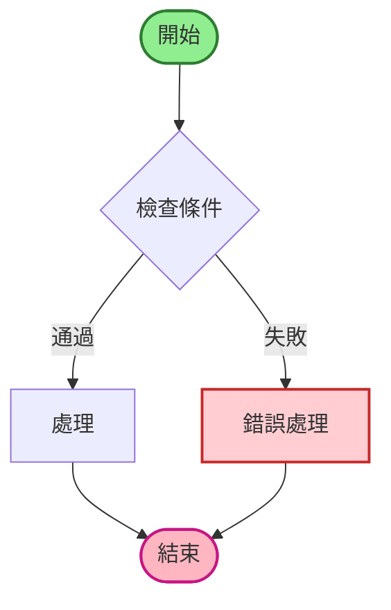
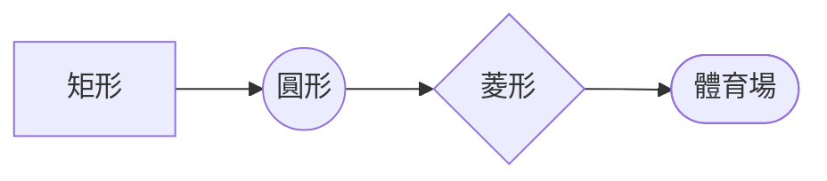
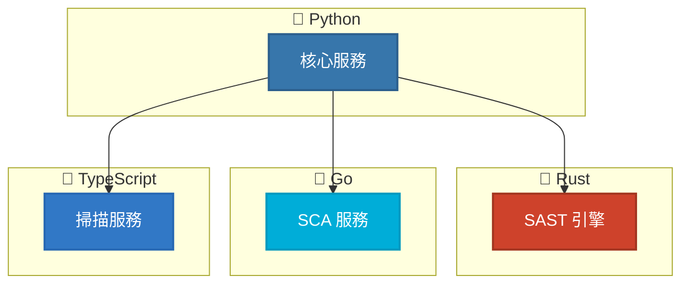
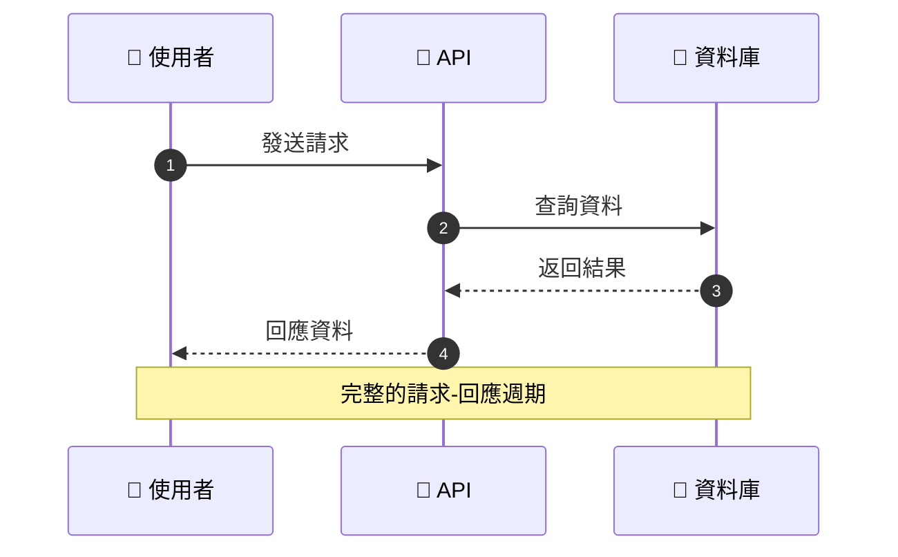
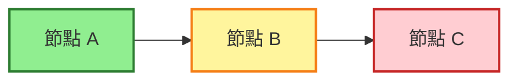

# Mermaid 11.11.0+ 語法測試

生成時間: 2025-10-17 09:57:39

## 1. 基本流程圖

## 2. 使用新形狀語法

## 3. 多語言架構圖

## 4. 時序圖

## 5. 類別和樣式

---

**測試狀態**: ✓ 所有測試通過
**Mermaid 版本**: 11.11.0+
**生成工具**: AIVA Mermaid Test Suite
