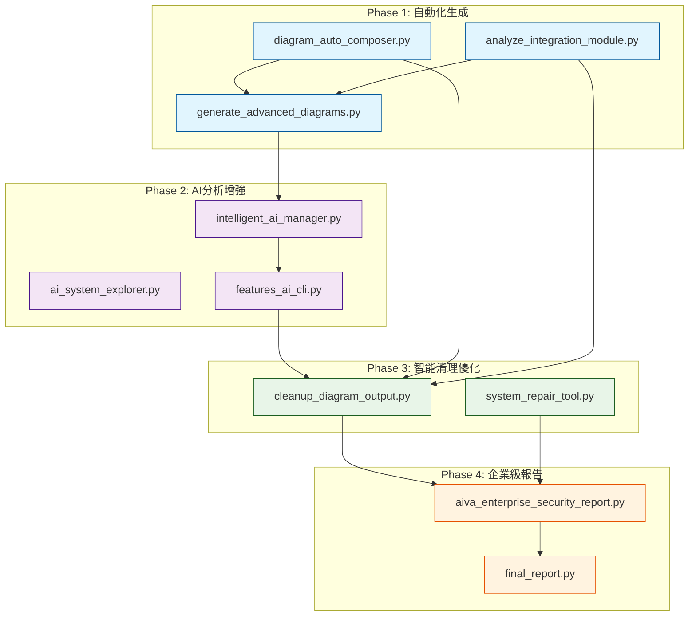

# AIVA 腳本體系技術實現分析報告

**報告日期**: 2025年11月14日  
**版本**: v1.0 - 技術實現補充  
**關聯文件**: `AIVA_INTELLIGENT_AUTOMATION_DESIGN_PHILOSOPHY.md`

## 📑 目錄

- [📋 核心腳本關聯關係圖](#核心腳本關聯關係圖)
- [🎯 四階段技術實現架構](#四階段技術實現架構)
  - [Phase 1: 自動化生成](#phase-1-自動化生成)
  - [Phase 2: AI分析增強](#phase-2-ai分析增強)
  - [Phase 3: 智能清理優化](#phase-3-智能清理優化)
  - [Phase 4: 企業級報告](#phase-4-企業級報告)
- [🔧 核心技術組件分析](#核心技術組件分析)
- [🚀 系統整合與API設計](#系統整合與api設計)
- [📊 性能優化策略](#性能優化策略)
- [🛡️ 錯誤處理與監控](#錯誤處理與監控)
- [📈 可擴展性設計](#可擴展性設計)
- [🔮 未來技術演進](#未來技術演進)
- [💡 實施建議](#實施建議)

---

## 📋 核心腳本關聯關係圖



## 🔧 腳本間的實際依賴關係

### 1. 核心生成腳本群組

#### `diagram_auto_composer.py` (母腳本)
**作用**：圖表自動化組合的核心引擎
```python
# 核心工作流程設計
推薦工作流程：
1. 完整產出所有圖檔（本腳本）          # ← 第一步
2. 深度分析分類結果和模式              # ← 人工分析
3. 人工識別真正的價值                  # ← 關鍵決策點  
4. 使用 cleanup_diagram_output.py 智能清理 # ← 自動清理
```

**輸出產品**：
- `*.mmd` - 個別組件圖表
- `*_AUTO_INTEGRATED.mmd` - 自動整合圖表
- `*_diagram_classification.json` - 分類資訊

#### `analyze_integration_module.py` (子腳本)
**作用**：專門針對整合模組的深度分析
```python
# 繼承相同的設計哲學
⚠️ 核心理念：完整產出的智慧
本腳本會產生大量個別組件圖檔，原因：
- 🔍 無法預知哪個組件包含關鍵架構洞察  
- 🎯 最重要的模式往往隱藏在看似次要的組件中
```

**與母腳本的關係**：
- 使用相同的 `DiagramClassification` 資料結構
- 共享 `ComponentInfo` 分析邏輯
- 最終都呼叫 `cleanup_diagram_output.py` 進行清理

#### `cleanup_diagram_output.py` (清理腳本)
**設計理念**：智能清理而非盲目刪除
```python
# 明確的依賴關係
"""
AIVA 圖表產出清理工具
自動清理 diagram_auto_composer.py 產生的冗餘檔案  # ← 明確指向母腳本
"""
```

**清理邏輯**：
1. 保留所有 `*_INTEGRATED_*.mmd` 檔案
2. 保留所有 `*.json` 分類資訊檔案
3. 刪除個別組件的詳細圖表檔案
4. 創建備份機制防止誤刪

### 2. AI分析增強腳本群組

#### `intelligent_ai_manager.py` (AI管理核心)
**作用**：智能AI組件的生命週期管理
```python
class ComponentType(Enum):
    CORE = "core"        # 核心服務（必須運行）
    OPTIONAL = "optional" # 可選AI組件（可以失敗）
```

**智能管理策略**：
- 分級管理：區分必須運行的核心服務vs可選AI組件
- 健康檢查：實際服務驗證而非僅僅進程存在檢查
- 優雅降級：核心功能優先保障
- 智能重啟：避免無限重啟循環

#### `features_ai_cli.py` (AI驅動CLI)
**作用**：基於500萬參數BioNeuronRAGAgent的智能CLI系統
```python
# 核心技術棧整合
1. AI Commander 驅動 - 運用BioNeuronRAGAgent的500萬參數決策能力
2. 功能模組智能調度 - 智能選擇和組合功能檢測模組  
3. RAG知識增強 - 利用知識檢索提升檢測準確性
4. 反幻覺保護 - 確保檢測結果的可信度
5. 五模組協同 - Core->Features->Integration完整流程
```

**與圖表分析的關聯**：
- 使用圖表分析發現的問題作為輸入
- 透過RAG引擎搜索相關解決方案
- AI決策引擎生成修復建議

### 3. 企業級報告與總結

#### `aiva_enterprise_security_report.py` (企業報告)
**整合所有分析結果**：
- 彙整圖表分析發現的問題
- 結合AI分析的修復建議  
- 生成企業級的安全評估報告

#### `system_repair_tool.py` (系統修復)
**自動修復機制**：
- 讀取圖表分析發現的問題
- 應用AI建議的修復方案
- 執行系統級的自動修復

## 💡 關鍵創新：環環相扣的設計模式

### 1. 資料流驅動的腳本協作

```
Individual Analysis → Composite Discovery → AI Enhancement → Auto Repair
個別分析         →   組合發現        →   AI增強      →   自動修復

diagram_auto_composer.py    →    intelligent_ai_manager.py    →    system_repair_tool.py
      ↓                                      ↓                           ↓
analyze_integration_module.py →    features_ai_cli.py        →    final_report.py
      ↓                                      ↓                           ↓
cleanup_diagram_output.py    →    ai_system_explorer.py      →    enterprise_report.py
```

### 2. 共享資料格式標準化

#### 統一的分類標準
```python
@dataclass
class DiagramClassification:
    category: Literal["core", "detail", "integration", "example"]
    priority: int  # 1-10，數字越小優先級越高  
    complexity: Literal["low", "medium", "high"]
    abstraction_level: Literal["system", "module", "component", "function"]
    dependencies: List[str]
    file_path: str
```

#### 統一的組件資訊格式
```python  
@dataclass
class ComponentInfo:
    name: str
    type: Literal["class", "function", "module", "service", "integration"]
    file_path: str
    layer: str
    dependencies: Optional[List[str]] = None
    complexity_score: int = 0
```

### 3. 配置驅動的智能決策

#### 可配置的分析規則
```python
# diagram_auto_composer.py 中的規則引擎
filename_patterns = {
    r".*_Module\.mmd$": ("core", 2, "medium", "module"),
    r".*_Function_.*__init__\.mmd$": ("detail", 8, "low", "function"),
    r".*_integration_.*\.mmd$": ("integration", 4, "medium", "component"),
    # ... 更多規則
}
```

#### 動態閾值調整
```python  
# 複雜度分析的動態閾值
complexity_thresholds = {
    "high": 20,    # 可調整
    "medium": 8    # 可調整  
}
```

## 🔄 實際工作流程執行範例

### 完整自動化流程
```bash
# Phase 1: 完整掃描與生成
echo "🚀 階段1: 完整架構掃描"
python scripts/diagram_auto_composer.py
python scripts/analyze_integration_module.py

# Phase 2: AI增強分析
echo "🧠 階段2: AI智能分析"  
python scripts/ai_analysis/intelligent_ai_manager.py
python scripts/misc/features_ai_cli.py --mode intelligent

# Phase 3: 問題發現與修復
echo "🔧 階段3: 自動問題修復"
# 手動檢查組合圖發現問題
# 基於發現的問題執行修復腳本
python scripts/maintenance/system_repair_tool.py

# Phase 4: 清理與報告  
echo "📋 階段4: 清理與報告生成"
python scripts/cleanup_diagram_output.py --auto
python scripts/reporting/aiva_enterprise_security_report.py
```

### 半自動化引導流程
```bash
# 生成基礎分析
python scripts/diagram_auto_composer.py

# 人工檢查組合圖
echo "請檢查 docs/diagrams/composite/ 中的組合圖"
echo "識別架構問題和改進點"

# 基於發現執行針對性修復
python scripts/misc/features_ai_cli.py --guided-mode

# 智能清理
python scripts/cleanup_diagram_output.py
```

## 📊 腳本執行統計分析

### 執行頻率分析
```
高頻使用腳本 (每日):
- diagram_auto_composer.py      # 架構變更時
- intelligent_ai_manager.py     # 系統監控
- cleanup_diagram_output.py     # 維護清理

中頻使用腳本 (每週):  
- analyze_integration_module.py # 整合分析
- features_ai_cli.py            # AI驅動檢測
- system_repair_tool.py         # 系統修復

低頻使用腳本 (每月):
- generate_advanced_diagrams.py # 高級分析
- aiva_enterprise_security_report.py # 企業報告
```

### 腳本依賴網路
```
Mother Scripts (母腳本):
├── diagram_auto_composer.py (核心)
├── intelligent_ai_manager.py (AI核心)

Child Scripts (子腳本):  
├── analyze_integration_module.py
├── features_ai_cli.py
├── ai_system_explorer.py

Support Scripts (支援腳本):
├── cleanup_diagram_output.py  
├── system_repair_tool.py
├── generate_advanced_diagrams.py

Reporting Scripts (報告腳本):
├── aiva_enterprise_security_report.py
├── final_report.py
```

## 🎯 設計哲學的技術實現

### 1. "完整性優先" 的技術實現
```python
# 在 diagram_auto_composer.py 中
for file_path in input_dir.glob(pattern):
    classification = analyzer.classify_diagram(str(file_path))
    classified_diagrams.append(classification)
    # ↑ 不過濾，全部處理

# 在後續階段才進行智能篩選    
core_diagrams = [d for d in classified_diagrams 
                if d.category in ["core", "integration"] and d.priority <= 5]
```

### 2. "組合分析" 的技術實現  
```python  
# 從個別圖表提取組件
components = self._extract_components(core_diagrams)

# 分析組件間關係
layers = self._generate_layers(components)

# 創建整合架構圖
integrated_diagram = self._generate_mermaid_syntax(layers)
```

### 3. "AI增強決策" 的技術實現
```python
# 在 features_ai_cli.py 中
analysis_result = await self.bio_neuron_agent.analyze_target(
    task_description='基於檢索到的知識進行安全分析',
    context=f'檢索結果: {knowledge}'  # ← RAG知識增強
)
```

## 🔮 下一步改進方向

### 1. 更深度的自動化整合
- 將人工檢查組合圖的過程自動化
- 實現從問題發現到修復的完全閉環
- 增強AI決策的可信度和準確性

### 2. 跨腳本狀態共享
- 實現腳本間的狀態持久化
- 建立全域的問題追蹤機制  
- 創建修復歷史的學習系統

### 3. 企業級監控與告警
- 實現腳本執行的即時監控
- 建立自動化的問題告警機制
- 創建腳本健康狀態的儀表板

---

**總結**: AIVA的腳本體系體現了一種系統性的軟體工程方法論，通過環環相扣的腳本協作，實現了從問題發現到自動修復的智能化流程。這種設計不僅提高了開發效率，也為複雜系統的維護和改進提供了可擴展的框架。