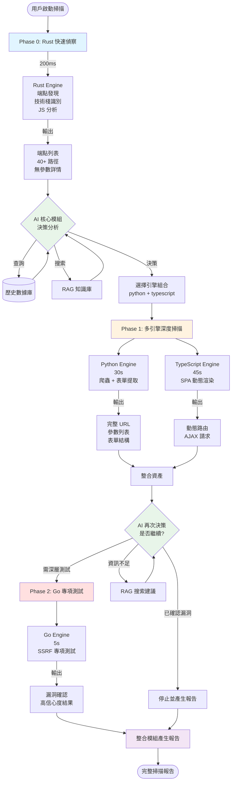
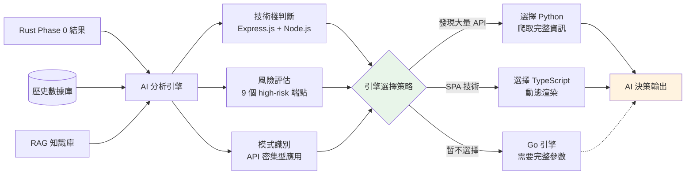
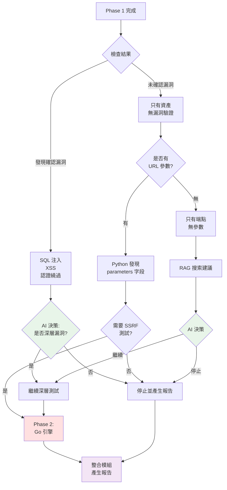
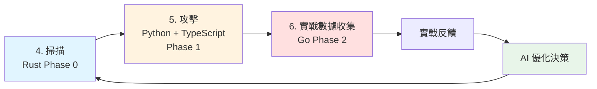
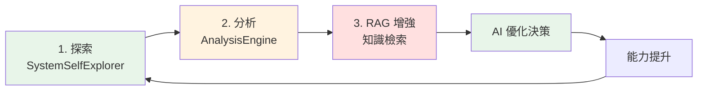
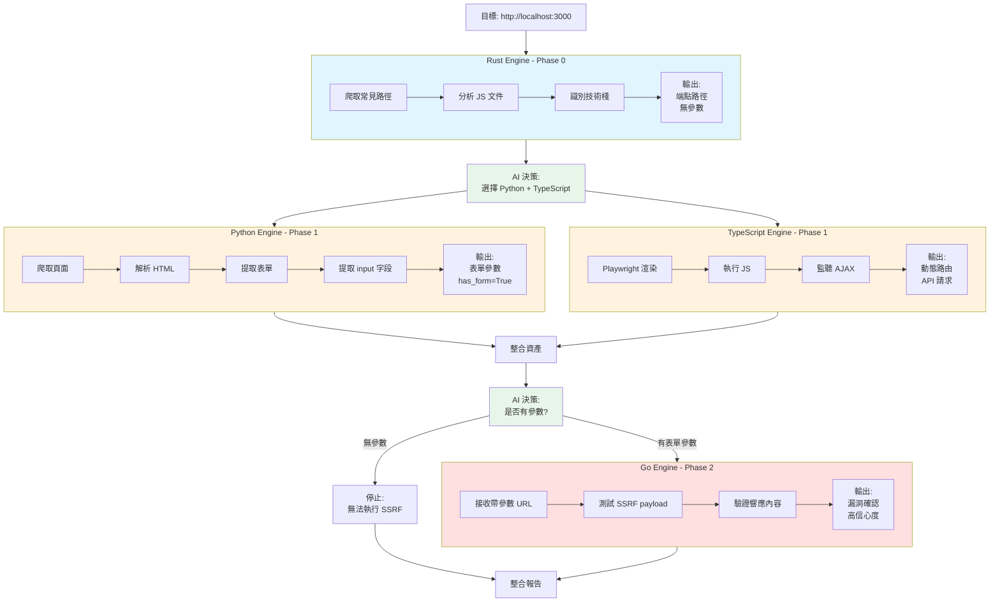

# AIVA AI 自我優化雙重閉環設計

**設計日期**: 2025年11月15日  
**最後更新**: 2025年11月23日  
**核心理念**: 內省 + 實戰 → 自我優化 → 視覺化驗證  
**狀態**: ✅ 已整合多引擎掃描工作流程

---

## 📋 目錄

1. [設計核心概念](#設計核心概念)
2. [完整掃描工作流程](#完整掃描工作流程)
   - [Phase 0: Rust 快速偵察](#phase-0-rust-快速偵察)
   - [AI 核心模組決策](#ai-核心模組決策)
   - [Phase 1: 多引擎深度掃描](#phase-1-多引擎深度掃描)
   - [Phase 2: Go 專項測試](#phase-2-go-專項測試)
3. [雙重閉環機制](#雙重閉環機制)
4. [引擎資料流與參數提取](#引擎資料流與參數提取)
5. [Mermaid 流程圖](#mermaid-流程圖)
6. [最佳實踐](#最佳實踐)

---

## 🎯 設計核心概念

AIVA 的 AI 自我優化系統採用**雙重閉環反饋機制**，通過內部分析和外部實戰兩個維度持續進化。**外部閉環 (對外掃描)** 現已整合完整的多語言引擎協同工作流程:

```
┌─────────────────────────────────────────────────────────────┐
│                    AIVA AI 自我優化雙重閉環                     │
└─────────────────────────────────────────────────────────────┘

┌──────────────────────┐          ┌──────────────────────┐
│   內部閉環 (對內)      │          │   外部閉環 (對外)      │
│   Know Thyself       │          │   Learn from Battle  │
└──────────────────────┘          └──────────────────────┘
         │                                    │
         ▼                                    ▼
┌─────────────────┐              ┌─────────────────────┐
│ 1. 探索 (對內)    │              │ 4. 掃描 (對外)        │
│ ─────────────── │              │ ───────────────────  │
│ SystemSelfExplorer│             │ 目標系統掃描          │
│ • 掃描五大模組     │              │ • 端口服務發現        │
│ • 檢測現有能力     │              │ • 漏洞識別           │
│ • 依賴關係分析     │              │ • 技術棧識別         │
│ • 健康狀態診斷     │              │ → 收集目標信息       │
│ → 知道「我有什麼」 │              └─────────────────────┘
└─────────────────┘                         │
         │                                    │
         ▼                                    ▼
┌─────────────────┐              ┌─────────────────────┐
│ 2. 分析 (靜態)    │              │ 5. 攻擊 (實戰)        │
│ ─────────────── │              │ ───────────────────  │
│ AnalysisEngine  │              │ 執行攻擊測試          │
│ • AST 代碼分析    │              │ • 漏洞利用嘗試        │
│ • 模式識別        │              │ • 權限提升測試        │
│ • 複雜度評估      │              │ • 橫向移動探測        │
│ • 安全檢查        │              │ → 獲取實戰反饋       │
│ → 知道「能力品質」 │              └─────────────────────┘
└─────────────────┘                         │
         │                                    │
         ▼                                    ▼
┌─────────────────┐              ┌─────────────────────┐
│ 3. RAG 知識增強  │              │ 6. 實戰數據收集       │
│ ─────────────── │              │ ───────────────────  │
│ RAGEngine       │              │ • 成功/失敗記錄       │
│ • 檢索相似案例    │              │ • 有效攻擊向量        │
│ • 最佳實踐查詢    │              │ • 目標特徵分析        │
│ • 專家經驗融合    │              │ • 防禦機制識別        │
│ → 知道「如何做」  │              │ → 知道「該優化什麼」  │
└─────────────────┘              └─────────────────────┘
         │                                    │
         └────────────┬───────────────────────┘
                      ▼
         ┌──────────────────────────┐
         │   AI 自我優化決策中心      │
         │   ─────────────────────  │
         │   整合雙重閉環數據:        │
         │   • 內部能力評估          │
         │   • 外部實戰反饋          │
         │   • RAG 知識庫           │
         │   ↓                      │
         │   生成優化方案            │
         └──────────────────────────┘
                      │
                      ▼
         ┌──────────────────────────┐
         │   視覺化優化方案展示       │
         │   ─────────────────────  │
         │   用圖表呈現:             │
         │   • 優化方向拓撲圖         │
         │   • 能力提升路徑圖         │
         │   • 資源分配餅圖          │
         │   • 優先級排序表          │
         │   ↓                      │
         │   人工審核決策點          │
         └──────────────────────────┘
                      │
            ┌─────────┴─────────┐
            │ 人工確認?          │
            └─────────┬─────────┘
                 ✓    │    ✗
                      ▼
         ┌──────────────────────────┐
         │   執行優化               │
         │   ─────────────────────  │
         │   • 代碼自動生成/修改     │
         │   • CLI 指令優化         │
         │   • 攻擊策略調整         │
         │   • 能力模組擴展         │
         └──────────────────────────┘
                      │
                      ▼
              循環回到探索/掃描
```

---

## 🔄 完整掃描工作流程

### 整體架構

AIVA 的外部閉環掃描系統採用**多階段智能協同**策略,由 4 個專業引擎按序執行:



---

### Phase 0: Rust 快速偵察

**目的**: 快速探測攻擊面 (~200ms),為後續決策提供基礎資訊

**輸入**:
```json
{
  "url": "http://target.com",
  "mode": "fast",
  "timeout": 10
}
```

**Rust 引擎執行**:
1. 爬取常見路徑 (`/api/*`, `/admin`, `/graphql` 等)
2. 分析 JS 文件,提取 API 端點
3. 識別技術棧 (Express.js, Node.js, Angular)
4. 評估端點風險等級

**輸出示例**:
```json
{
  "mode": "FastDiscovery",
  "targets": [{
    "url": "http://localhost:3000",
    "success": true,
    "endpoints": [
      {
        "path": "/api/users",
        "method": "GET",
        "status_code": 401,
        "risk_level": "high"
      },
      {
        "path": "/api/Products",
        "method": "GET",
        "status_code": 200,
        "risk_level": "medium"
      }
    ],
    "js_findings": [
      "ApiEndpoint: /api/SecurityQuestions",
      "ApiEndpoint: /api/Challenges"
    ],
    "technologies": ["Express.js", "Node.js", "Angular"],
    "sensitive_info": []
  }],
  "summary": {
    "total_endpoints": 40,
    "high_risk": 9,
    "medium_risk": 18,
    "low_risk": 13
  }
}
```

**Rust 提供的資訊**:
- ✅ **端點列表**: 40+ 個常見路徑
- ✅ **技術棧**: Express.js, Node.js, Angular
- ✅ **風險等級**: high/medium/low
- ✅ **JS Findings**: JS 文件中的 API 端點
- ❌ **無參數詳情**: 只有路徑,沒有參數名稱
- ❌ **無表單結構**: 沒有表單字段

---

### AI 核心模組決策

**輸入**: Phase 0 結果 + 歷史數據 + RAG 知識庫

**AI 核心模組分析流程**:



**AI 決策輸出**:
```json
{
  "selected_engines": ["python", "typescript"],
  "recommended_strategy": "deep",
  "priority_endpoints": ["/api/users", "/api/config"],
  "stop_condition": "found_confirmed_vulnerability",
  "max_depth": 3,
  "reasoning": {
    "python": "發現大量 API 端點,需要爬取完整參數",
    "typescript": "Angular SPA 需要動態渲染",
    "skip_go": "尚未獲得完整參數,暫不執行 SSRF 測試"
  }
}
```

**整合模組協助**:
- 查詢資料庫: 類似目標的歷史掃描記錄
- 對比數據: 該技術棧常見的漏洞類型
- 補充建議: 遇到未知情況時使用 RAG 搜索

---

### Phase 1: 多引擎深度掃描

#### Python 引擎 (爬蟲 + 表單提取)

**輸入** (由協調器轉換):
```python
{
  "scan_id": "scan_001",
  "strategy": "deep",      # AI 決定
  "max_depth": 3,          # AI 決定
  "max_pages": 100,        # AI 決定
  "timeout": 10
}
```

**Python 引擎執行**:
1. **靜態爬取**: 使用 httpx 爬取頁面
2. **HTML 解析**: BeautifulSoup 提取鏈接和表單
3. **表單字段提取**: 分析 `<input name="xxx">` 獲取參數
4. **URL 隊列管理**: 廣度優先爬取,避免重複

**關鍵代碼** (`static_content_parser.py`):
```python
class StaticContentParser:
    def extract(self, base_url: str, response: httpx.Response) -> tuple[list[Asset], int]:
        assets: list[Asset] = []
        forms = 0
        
        if "text/html" in response.headers.get("content-type", ""):
            soup = BeautifulSoup(response.text, "lxml")
            
            # 提取表單
            for form in soup.find_all("form"):
                action_url = form.get("action") or base_url
                full_url = urljoin(base_url, action_url)
                
                # ✅ 提取參數名稱
                params = []
                for input_elem in form.find_all("input"):
                    name = input_elem.get("name")
                    if isinstance(name, str):
                        params.append(name)  # username, password, email...
                
                assets.append(Asset(
                    asset_id=new_id("asset"),
                    type="URL",
                    value=full_url,
                    parameters=params if params else None,  # ✅ 參數列表
                    has_form=True
                ))
                forms += 1
            
            # 提取鏈接
            for a in soup.find_all("a"):
                href = a.get("href")
                if isinstance(href, str):
                    assets.append(Asset(
                        asset_id=new_id("asset"),
                        type="URL",
                        value=urljoin(base_url, href),
                        has_form=False
                    ))
        
        return assets, forms
```

**Python 引擎輸出** (Asset 格式):
```python
[
  {
    "asset_id": "asset_001",
    "type": "URL",
    "value": "http://localhost:3000/login",
    "parameters": ["username", "password", "remember"],  # ✅ 表單字段
    "has_form": True
  },
  {
    "asset_id": "asset_002",
    "type": "URL",
    "value": "http://localhost:3000/api/users",
    "parameters": None,  # 無表單,只是鏈接
    "has_form": False
  },
  {
    "asset_id": "asset_003",
    "type": "URL",
    "value": "http://localhost:3000/search",
    "parameters": ["q", "category", "sort"],  # ✅ 搜索表單
    "has_form": True
  }
]
```

**Python 引擎能力**:
- ✅ **完整 URL**: 包含協議、域名、路徑
- ✅ **表單參數提取**: 從 `<input name="xxx">` 提取
- ✅ **表單結構識別**: `has_form=True`
- ❌ **無 URL 參數提取**: 不解析 `?id=123` 的參數
- ❌ **無 AJAX 監聽**: 靜態引擎看不到動態請求

---

#### TypeScript 引擎 (動態渲染)

**適用場景**: SPA (React/Vue/Angular)

**輸入**:
```json
{
  "scan_id": "scan_001",
  "max_depth": 3,
  "timeout": 10
}
```

**TypeScript 引擎執行**:
1. 使用 Playwright 啟動真實瀏覽器
2. 執行 JavaScript,等待頁面完全渲染
3. 監聽 AJAX 請求,捕獲動態 API 調用
4. 提取動態生成的鏈接和路由

**TypeScript 引擎輸出**:
```typescript
[
  {
    asset_id: "asset_004",
    type: "api",
    value: "http://localhost:3000/api/Products",
    parameters: [],
    has_form: false
  },
  {
    asset_id: "asset_005",
    type: "api",
    value: "http://localhost:3000/rest/user/whoami",
    parameters: [],
    has_form: false
  }
]
```

**TypeScript 引擎能力**:
- ✅ **動態路由**: 捕獲 SPA 的客戶端路由
- ✅ **AJAX 請求**: 監聽 XHR/Fetch 請求
- ✅ **真實渲染**: 看到用戶實際看到的內容
- ⚠️ **部分參數**: 可能捕獲部分動態參數
- ❌ **無表單分析**: 不專注於表單提取

---

### AI 再次決策: 是否繼續

**條件判斷**:



**決策邏輯**:
```python
def ai_decision_continue(phase1_result: ScanResult) -> str:
    """
    AI 核心模組決策: 是否繼續掃描
    
    Returns:
        "STOP" - 停止並產生報告
        "PHASE2_GO" - 執行 Go SSRF 測試
        "RAG_SEARCH" - 尋找建議
    """
    # 檢查是否有確認漏洞
    confirmed_vulns = [
        asset for asset in phase1_result.assets 
        if asset.type == "web_vulnerability" and asset.confidence == "high"
    ]
    
    if confirmed_vulns:
        # 發現確認漏洞
        if ai_judge_need_deeper_test(confirmed_vulns):
            return "PHASE2_GO"  # 可能有更深層漏洞
        else:
            return "STOP"  # 足夠了,產生報告
    
    # 檢查是否有 URL 參數可供 SSRF 測試
    assets_with_params = [
        asset for asset in phase1_result.assets 
        if asset.parameters and len(asset.parameters) > 0
    ]
    
    if assets_with_params:
        # Python 發現了參數,可以測試 SSRF
        if ai_judge_need_ssrf_test(assets_with_params):
            return "PHASE2_GO"
        else:
            return "STOP"
    
    # 資訊不足,尋求建議
    return "RAG_SEARCH"
```

---

### Phase 2: Go 專項測試

**前置條件**: Python 引擎必須提供帶參數的資產

**協調器轉換邏輯**:
```python
def convert_python_assets_to_go_targets(assets: list[Asset]) -> list[str]:
    """
    將 Python 資產轉換為 Go 引擎可用的目標
    
    Python Asset:
        {"value": "http://target.com/api/fetch", "parameters": ["url", "callback"]}
    
    Go Target:
        ["http://target.com/api/fetch?url=", "http://target.com/api/fetch?callback="]
    """
    targets = []
    for asset in assets:
        if asset.parameters:
            for param in asset.parameters:
                # 構造完整的帶參數 URL
                separator = "&" if "?" in asset.value else "?"
                target = f"{asset.value}{separator}{param}="
                targets.append(target)
    return targets
```

**Go 引擎輸入**:
```json
{
  "scan_id": "scan_002",
  "targets": [
    "http://localhost:3000/api/fetch?url=",
    "http://localhost:3000/api/fetch?callback=",
    "http://localhost:3000/search?q="
  ],
  "concurrency": 5,
  "timeout": 10
}
```

**Go 引擎執行**:
1. 接收**完整的帶參數 URL**
2. 測試 SSRF payload: `?url=file:///etc/passwd`
3. 驗證響應內容,確認是否執行了 SSRF
4. 評估信心度 (high/medium/low)

**Go 引擎輸出**:
```json
{
  "scan_id": "scan_002",
  "status": "completed",
  "assets": [
    {
      "type": "web_vulnerability",
      "name": "SSRF - File Protocol",
      "severity": "high",
      "confidence": "high",
      "details": {
        "affected_url": "http://localhost:3000/api/fetch?url=file:///etc/passwd",
        "vulnerable_param": "url",
        "response_preview": "root:x:0:0:root:/root:/bin/bash\ndaemon:x:1:1:daemon:/usr/sbin:/usr/sbin/nologin",
        "evidence": "Response contains /etc/passwd content"
      }
    }
  ]
}
```

**Go 引擎能力**:
- ✅ **專項 SSRF 測試**: 18 種 payload
- ✅ **漏洞確認**: 高信心度驗證
- ✅ **快速執行**: ~5 秒完成
- ❌ **依賴完整參數**: 需要 Python 先提取
- ❌ **單一功能**: 只測試 SSRF

---

## 🔄 雙重閉環機制

### 外部閉環 (對外掃描) - 已整合多引擎工作流程

外部閉環現在包含完整的 4 階段掃描流程:



**外部閉環數據收集**:
- ✅ **成功/失敗記錄**: 哪些 payload 有效
- ✅ **有效攻擊向量**: SSRF 成功的參數模式
- ✅ **目標特徵**: 技術棧與漏洞的關聯
- ✅ **防禦機制**: WAF 規則和過濾器

### 內部閉環 (對內探索)

內部閉環專注於自身能力分析:



**內部閉環數據收集**:
- ✅ **現有能力清單**: 5 大模組狀態
- ✅ **代碼品質評估**: AST 分析結果
- ✅ **依賴關係**: 模組間耦合度
- ✅ **健康狀態**: 錯誤率和性能指標

---

## 📊 AI 能力規劃結構

### **階段 1: 基礎三項能力** (數據收集層)

這三項能力是整個自我優化系統的**數據來源基礎**:

#### **1.1 探索功能 (對內 - Introspection)**

**目的**: **讓 AI 知道自己目前具備什麼能力**

**實現**: `scripts/ai_analysis/ai_system_explorer.py`

```python
class SystemSelfExplorer:
    """AIVA 自我認知系統"""
    
    async def explore_system(self):
        """完整的自我探索"""
        
        # 掃描五大模組
        modules_status = {
            "ai_core": self._scan_ai_core(),           # AI 引擎狀態
            "attack_engine": self._scan_attack(),      # 攻擊能力清單
            "scan_engine": self._scan_scanner(),       # 掃描工具狀態
            "integration": self._scan_integration(),   # 整合服務
            "feature_detection": self._scan_features() # 特徵檢測能力
        }
        
        # 分析現有能力
        capability_inventory = {
            "available_attacks": ["sqli", "xss", "rce", ...],  # 已實現的攻擊
            "scanner_plugins": ["nmap", "masscan", ...],       # 可用掃描器
            "ai_models": ["bio_neuron_5M", "rag_agent", ...], # AI 模型
            "tools_status": {"working": 45, "broken": 3}      # 工具狀態
        }
        
        return {
            "current_capabilities": capability_inventory,
            "health_status": modules_status,
            "gaps_identified": self._identify_gaps(),  # 發現能力缺口
            "optimization_targets": self._suggest_targets()
        }
```

**輸出**: 
- ✅ 我有哪些攻擊模組
- ✅ 哪些工具可以用
- ✅ 哪些功能有問題
- ✅ 哪裡有能力缺口

---

#### **1.2 靜態分析功能 (代碼品質評估)**

**目的**: **評估現有能力的代碼品質和可優化點**

**實現**: `services/core/aiva_core/ai_analysis/analysis_engine.py`

```python
class AnalysisEngine:
    """代碼品質和結構分析"""
    
    async def analyze_code_quality(self, module_path):
        """分析模組代碼品質"""
        
        # AST 分析
        ast_analysis = {
            "complexity": self._cyclomatic_complexity(code),  # 複雜度
            "code_smells": self._detect_code_smells(code),    # 代碼異味
            "security_issues": self._security_scan(code),     # 安全問題
            "performance_bottlenecks": self._profile(code)    # 性能瓶頸
        }
        
        # 模式識別
        patterns = {
            "design_patterns": self._identify_patterns(code),
            "anti_patterns": self._identify_anti_patterns(code),
            "optimization_opportunities": self._find_optimizations(code)
        }
        
        return {
            "quality_score": 7.5,  # 0-10 評分
            "refactor_suggestions": [...],
            "optimization_targets": patterns["optimization_opportunities"]
        }
```

**輸出**:
- ✅ 代碼複雜度評估
- ✅ 性能瓶頸識別
- ✅ 可優化模式發現
- ✅ 重構建議生成

---

#### **1.3 RAG 知識增強功能**

**目的**: **檢索相似案例和最佳實踐,提供優化參考**

**實現**: `services/core/aiva_core/rag/rag_engine.py`

```python
class BioNeuronRAGAgent:
    """知識檢索增強系統"""
    
    async def retrieve_optimization_knowledge(self, context):
        """檢索優化相關知識"""
        
        # 多源知識檢索
        knowledge = {
            "similar_cases": await self._search_similar_scenarios(context),
            "best_practices": await self._search_best_practices(context),
            "expert_experiences": await self._search_expert_knowledge(context),
            "attack_techniques": await self._search_techniques(context),
            "tool_comparisons": await self._compare_tools(context)
        }
        
        # 知識融合
        fused_knowledge = self._fuse_knowledge_sources(knowledge)
        
        return {
            "recommended_approaches": fused_knowledge["top_5_approaches"],
            "success_rates": fused_knowledge["historical_success"],
            "resource_requirements": fused_knowledge["estimated_resources"],
            "implementation_guides": fused_knowledge["how_to_guides"]
        }
```

**輸出**:
- ✅ 相似場景的成功案例
- ✅ 專家推薦的方法
- ✅ 工具對比和選擇建議
- ✅ 實現指南和參考代碼

---

### **階段 2: 雙重閉環反饋** (數據整合層)

#### **2.1 內部閉環 (Know Thyself)**

**數據來源**: 探索 + 分析 + RAG

```python
class InternalFeedbackLoop:
    """內部反饋閉環"""
    
    async def generate_internal_insights(self):
        """生成內部洞察"""
        
        # 整合三項基礎能力的輸出
        exploration_data = await self.explorer.explore_system()
        analysis_data = await self.analyzer.analyze_all_modules()
        rag_knowledge = await self.rag.retrieve_optimization_knowledge({
            "current_capabilities": exploration_data,
            "quality_issues": analysis_data
        })
        
        # 生成內部優化建議
        internal_insights = {
            "capability_gaps": [
                {
                    "missing_attack": "XXE injection",
                    "priority": "high",
                    "similar_exists": "XML parser in scan_engine",
                    "effort_estimate": "2 days",
                    "rag_reference": "CVE-2023-xxxx successful case"
                },
                # ...
            ],
            
            "refactoring_targets": [
                {
                    "module": "attack_engine/sqli.py",
                    "issue": "complexity = 45 (threshold: 15)",
                    "suggested_refactor": "Extract method pattern",
                    "expected_improvement": "+30% performance"
                },
                # ...
            ],
            
            "optimization_priorities": [
                "1. Fix broken nmap integration (blocks 5 features)",
                "2. Reduce bio_neuron inference time (affects all decisions)",
                "3. Add XXE attack capability (requested by 3 scenarios)"
            ]
        }
        
        return internal_insights
```

**關鍵輸出**: **我需要在哪些方面變得更強**

---

#### **2.2 外部閉環 (Learn from Battle)**

**數據來源**: 掃描 + 攻擊 + 實戰反饋

```python
class ExternalFeedbackLoop:
    """外部實戰反饋閉環"""
    
    async def collect_battle_insights(self, target_results):
        """收集實戰洞察"""
        
        # 分析掃描結果
        scan_insights = {
            "common_tech_stacks": {
                "nginx + php-fpm": 45,  # 遇到 45 次
                "apache + tomcat": 32,
                "iis + asp.net": 28
            },
            "common_vulnerabilities": {
                "sqli": {"success_rate": 0.78, "avg_time": 45},
                "xss": {"success_rate": 0.62, "avg_time": 30},
                "ssrf": {"success_rate": 0.15, "avg_time": 120}  # 低成功率!
            },
            "defense_patterns": {
                "waf_detected": ["cloudflare", "akamai", "aws_waf"],
                "common_blocks": ["user-agent filtering", "rate limiting"]
            }
        }
        
        # 分析攻擊結果
        attack_insights = {
            "effective_techniques": [
                {
                    "technique": "blind_sqli_time_based",
                    "success_rate": 0.85,
                    "avg_detection_time": 15,
                    "works_against": ["mysql", "postgresql"]
                },
                # ...
            ],
            
            "ineffective_techniques": [
                {
                    "technique": "ssrf_basic",
                    "success_rate": 0.15,
                    "reason": "most targets have internal network restrictions",
                    "suggested_improvement": "add DNS rebinding + TOCTOU bypass"
                },
                # ...
            ],
            
            "new_defense_mechanisms": [
                "Detected: ML-based anomaly detection on 12% of targets",
                "Suggestion: Need to develop evasion techniques"
            ]
        }
        
        return {
            "optimization_direction": "Focus on SSRF and WAF bypass",
            "priority_targets": ["dns_rebinding", "request_smuggling"],
            "deprecated_techniques": ["basic_ssrf", "simple_sqli"],
            "emerging_threats": ["ml_based_detection"]
        }
```

**關鍵輸出**: **外部環境要求我朝哪個方向優化**

---

### **階段 3: AI 自我優化決策** (優化執行層)

#### **3.1 整合雙重閉環數據**

```python
class SelfOptimizationEngine:
    """AI 自我優化引擎"""
    
    async def generate_optimization_plan(self):
        """生成優化方案"""
        
        # 獲取雙重閉環數據
        internal_insights = await self.internal_loop.generate_insights()
        external_insights = await self.external_loop.collect_insights()
        
        # AI 決策: 整合內外部數據
        optimization_plan = await self.ai_decision_core.decide({
            "internal": internal_insights,
            "external": external_insights,
            "rag_context": self.rag.get_relevant_knowledge()
        })
        
        return {
            "code_modifications": [
                {
                    "action": "create_new_attack",
                    "target": "attack_engine/ssrf_advanced.py",
                    "technique": "DNS rebinding + TOCTOU",
                    "based_on": {
                        "internal": "existing DNS resolver code",
                        "external": "15% SSRF success rate needs improvement",
                        "rag": "CVE-2023-xxxx case study"
                    },
                    "estimated_impact": "+50% SSRF success rate"
                },
                # ...
            ],
            
            "cli_improvements": [
                {
                    "command": "aiva attack --ssrf-advanced",
                    "new_options": ["--dns-rebind", "--toctou-delay"],
                    "auto_generated": True
                },
                # ...
            ],
            
            "attack_strategy_updates": [
                {
                    "scenario": "high_security_targets",
                    "old_strategy": ["basic_sqli", "simple_xss"],
                    "new_strategy": ["time_based_blind_sqli", "dom_xss", "ssrf_advanced"],
                    "reason": "WAF bypass + higher success rate"
                },
                # ...
            ]
        }
```

---

#### **3.2 視覺化優化方案** (人工審核介面)

**設計理念**: **用圖像展示優化方向,減少自然語言處理需求**

```python
class OptimizationVisualization:
    """優化方案視覺化"""
    
    async def generate_visualization(self, optimization_plan):
        """生成可視化圖表"""
        
        visualizations = {
            # 1. 優化方向拓撲圖
            "optimization_topology": self._generate_topology_graph({
                "nodes": [
                    {"id": "current_ssrf", "label": "Current SSRF\n15% success", "color": "red"},
                    {"id": "dns_rebind", "label": "Add DNS Rebinding", "color": "yellow"},
                    {"id": "advanced_ssrf", "label": "Advanced SSRF\n65% success", "color": "green"},
                ],
                "edges": [
                    {"from": "current_ssrf", "to": "dns_rebind", "label": "implement"},
                    {"from": "dns_rebind", "to": "advanced_ssrf", "label": "integrate"}
                ]
            }),
            
            # 2. 能力提升路徑圖
            "capability_roadmap": self._generate_roadmap({
                "phases": [
                    {"name": "Phase 1", "items": ["Fix nmap", "Add XXE"], "duration": "3 days"},
                    {"name": "Phase 2", "items": ["SSRF advanced", "WAF bypass"], "duration": "5 days"},
                    {"name": "Phase 3", "items": ["ML evasion"], "duration": "7 days"}
                ]
            }),
            
            # 3. 資源分配餅圖
            "resource_allocation": self._generate_pie_chart({
                "Code Generation": 40,
                "Testing & Validation": 30,
                "Integration": 20,
                "Documentation": 10
            }),
            
            # 4. 優先級排序表
            "priority_matrix": self._generate_priority_matrix({
                "high_impact_high_effort": ["ML evasion"],
                "high_impact_low_effort": ["Fix nmap", "Add XXE"],  # 優先做這些!
                "low_impact_high_effort": [],
                "low_impact_low_effort": ["Update docs"]
            })
        }
        
        # 生成 HTML 報告 (可在瀏覽器查看)
        html_report = f"""
        <html>
        <head><title>AIVA Optimization Plan</title></head>
        <body>
            <h1>🎯 AI Self-Optimization Plan</h1>
            
            <h2>📊 Optimization Topology</h2>
            <div id="topology">{visualizations['optimization_topology']}</div>
            
            <h2>🗺️ Capability Roadmap</h2>
            <div id="roadmap">{visualizations['capability_roadmap']}</div>
            
            <h2>💰 Resource Allocation</h2>
            <div id="resources">{visualizations['resource_allocation']}</div>
            
            <h2>⭐ Priority Matrix</h2>
            <div id="priority">{visualizations['priority_matrix']}</div>
            
            <button onclick="approve()">✅ Approve Optimization</button>
            <button onclick="reject()">❌ Reject</button>
            <button onclick="modify()">✏️ Modify Plan</button>
        </body>
        </html>
        """
        
        return {
            "html_report": html_report,
            "charts": visualizations,
            "summary": self._generate_text_summary(optimization_plan)  # 簡短文字摘要
        }
```

**視覺化示例**:

```
┌─────────────────────────────────────────────────────────┐
│         AIVA AI Self-Optimization Plan                  │
├─────────────────────────────────────────────────────────┤
│                                                         │
│  📊 Optimization Topology (優化拓撲圖)                  │
│                                                         │
│      [Current SSRF]                                     │
│      ✗ 15% success                                     │
│            │                                            │
│            ├──► [Add DNS Rebinding]                    │
│            │         │                                  │
│            │         ▼                                  │
│            └──► [Advanced SSRF]                        │
│                  ✓ 65% success (target)               │
│                                                         │
├─────────────────────────────────────────────────────────┤
│                                                         │
│  🗺️ Capability Roadmap (能力路線圖)                     │
│                                                         │
│  Phase 1 (3 days)  │  Phase 2 (5 days)  │  Phase 3    │
│  • Fix nmap ────► │  • SSRF advanced ──► │  • ML evasion│
│  • Add XXE        │  • WAF bypass       │             │
│                                                         │
├─────────────────────────────────────────────────────────┤
│                                                         │
│  💰 Resource Allocation (資源分配)                      │
│                                                         │
│      ╔═══════════════════════════════╗                │
│      ║  40%  Code Generation         ║                │
│      ╠═══════════════════╦═══════════╣                │
│      ║  30%  Testing     ║ 20% Integ ║                │
│      ╚═══════════════════╩═══════════╝                │
│                   10% Docs                             │
│                                                         │
├─────────────────────────────────────────────────────────┤
│                                                         │
│  ⭐ Priority Matrix (優先級矩陣)                         │
│                                                         │
│   High Impact │ ML Evasion ✗      │ Fix nmap ✓        │
│              │ (high effort)      │ Add XXE ✓          │
│              │                    │ (low effort)       │
│   ───────────┼────────────────────┼────────────────────│
│   Low Impact  │                    │ Update docs        │
│                                                         │
├─────────────────────────────────────────────────────────┤
│                                                         │
│  [✅ Approve]  [❌ Reject]  [✏️ Modify Plan]            │
│                                                         │
└─────────────────────────────────────────────────────────┘
```

**優勢**:
- ✅ **直觀**: 圖表比文字更容易理解
- ✅ **快速審核**: 幾秒鐘就能看懂優化方向
- ✅ **減少 NLP 需求**: 不需要複雜的自然語言生成
- ✅ **支援互動**: 可以點擊修改或調整優先級

---

#### **3.3 執行優化**

```python
class OptimizationExecutor:
    """優化執行器"""
    
    async def execute_approved_plan(self, plan, approval_status):
        """執行已批准的優化方案"""
        
        if approval_status == "approved":
            # 執行代碼生成
            for modification in plan["code_modifications"]:
                if modification["action"] == "create_new_attack":
                    await self._generate_attack_module(modification)
                elif modification["action"] == "refactor":
                    await self._refactor_module(modification)
                elif modification["action"] == "optimize":
                    await self._optimize_performance(modification)
            
            # 更新 CLI 指令
            for cli_update in plan["cli_improvements"]:
                await self._update_cli_commands(cli_update)
            
            # 調整攻擊策略
            for strategy_update in plan["attack_strategy_updates"]:
                await self._update_attack_strategies(strategy_update)
            
            # 驗證優化效果
            validation_results = await self._validate_optimizations()
            
            return {
                "status": "completed",
                "validation": validation_results,
                "next_optimization_cycle": "scheduled in 7 days"
            }
```

---

## 🔄 完整雙重閉環流程

### **週期性執行**

```python
class DualLoopOptimizationCycle:
    """雙重閉環優化週期"""
    
    async def run_optimization_cycle(self):
        """執行一次完整的優化週期"""
        
        print("🔍 Phase 1: Data Collection (數據收集)")
        print("━━━━━━━━━━━━━━━━━━━━━━━━━━━━━━━━━━━")
        
        # 內部閉環數據
        exploration_data = await self.explorer.explore_system()
        print(f"  ✓ 探索完成: 發現 {len(exploration_data['modules'])} 個模組")
        
        analysis_data = await self.analyzer.analyze_all_modules()
        print(f"  ✓ 分析完成: 識別 {len(analysis_data['issues'])} 個問題")
        
        rag_data = await self.rag.retrieve_knowledge(exploration_data, analysis_data)
        print(f"  ✓ RAG 檢索: 找到 {len(rag_data['similar_cases'])} 個相關案例")
        
        # 外部閉環數據 (需要實際執行攻擊任務)
        scan_results = await self.run_recent_scans()  # 最近的掃描結果
        attack_results = await self.run_recent_attacks()  # 最近的攻擊結果
        print(f"  ✓ 實戰數據: {len(scan_results)} 次掃描, {len(attack_results)} 次攻擊")
        
        print("\n🧠 Phase 2: AI Decision Making (AI 決策)")
        print("━━━━━━━━━━━━━━━━━━━━━━━━━━━━━━━━━━━")
        
        optimization_plan = await self.ai_core.generate_optimization_plan({
            "internal_loop": {
                "exploration": exploration_data,
                "analysis": analysis_data,
                "rag": rag_data
            },
            "external_loop": {
                "scans": scan_results,
                "attacks": attack_results
            }
        })
        print(f"  ✓ 生成優化方案: {len(optimization_plan['modifications'])} 項修改")
        
        print("\n📊 Phase 3: Visualization & Approval (視覺化與審核)")
        print("━━━━━━━━━━━━━━━━━━━━━━━━━━━━━━━━━━━")
        
        visualization = await self.visualizer.generate_visualization(optimization_plan)
        print(f"  ✓ 生成視覺化報告: {visualization['html_report'][:50]}...")
        
        # 展示給用戶審核
        approval = await self.show_visualization_and_wait_approval(visualization)
        print(f"  {'✓' if approval else '✗'} 用戶決策: {'批准' if approval else '拒絕'}")
        
        if approval:
            print("\n⚡ Phase 4: Execute Optimization (執行優化)")
            print("━━━━━━━━━━━━━━━━━━━━━━━━━━━━━━━━━━━")
            
            execution_result = await self.executor.execute_approved_plan(
                optimization_plan, approval
            )
            print(f"  ✓ 優化完成: {execution_result['status']}")
            
            print("\n🔄 Next cycle scheduled in 7 days")
        else:
            print("\n⏸️ Optimization cycle paused, waiting for user feedback")
```

---

## 🎯 設計亮點總結

### **1. 雙重閉環設計**

| 閉環類型 | 目的 | 關鍵問題 | 數據來源 |
|---------|------|---------|---------|
| **內部閉環** | Know Thyself | 我有什麼能力?<br>哪裡需要改進? | 探索 + 分析 + RAG |
| **外部閉環** | Learn from Battle | 外部環境需要什麼?<br>實戰中哪些有效? | 掃描 + 攻擊 + 反饋 |

**關鍵**: 只有內外結合,才能形成完整的自我優化閉環

---

### **2. 三項基礎能力的協同**

```
探索 (對內) ──┐
              ├──► 知道「我有什麼」
分析 (靜態) ──┤     ↓
              │  AI 決策: 我應該如何變得更強?
RAG (知識) ──┘     ↓
                知道「如何做」和「參考案例」
```

**關鍵**: 三者缺一不可,互相補充

---

### **3. 視覺化人機協作**

**設計理念**: 
- ✅ **AI 生成優化方案** (自動)
- ✅ **圖表展示優化方向** (視覺化)
- ✅ **人工審核決策點** (控制)
- ✅ **批准後自動執行** (高效)

**優勢**:
- 減少自然語言處理負擔 (不需要複雜的 NLP)
- 提高審核效率 (圖表比文字快)
- 保持人工控制 (避免 AI 失控)
- 降低資源消耗 (視覺化比對話簡單)

---

### **4. 持續進化機制**

```
Week 1: 初始狀態
 ↓ (收集數據)
Week 2: 發現優化方向
 ↓ (視覺化審核)
Week 3: 執行優化
 ↓ (驗證效果)
Week 4: 新能力投入實戰
 ↓ (收集新數據)
Week 5: 發現新的優化方向...
 ↓
循環往復,持續進化
```

---

## 📈 預期效果

### **短期效果** (1-3 個月)
- ✅ 自動識別能力缺口
- ✅ 基於實戰數據優化攻擊策略
- ✅ 修復代碼品質問題
- ✅ 生成新的 CLI 指令

### **中期效果** (3-6 個月)
- ✅ 攻擊成功率提升 30%+
- ✅ 自動適應新的防禦機制
- ✅ 代碼複雜度降低 40%+
- ✅ 減少人工維護成本

### **長期效果** (6-12 個月)
- ✅ 形成完整的自我進化系統
- ✅ AI 能夠自主發現和實現新攻擊技術
- ✅ 達到或超越人類安全專家水準
- ✅ 建立專業領域 AGI 雛形

---

## 🚀 實施路線圖

### **Phase 1: 基礎建設** (當前)
- [x] 探索系統 (SystemSelfExplorer)
- [x] 分析系統 (AnalysisEngine)
- [x] RAG 系統 (BioNeuronRAGAgent)
- [ ] 整合三項能力的數據流

### **Phase 2: 閉環構建** (下一步)
- [ ] 實現內部反饋閉環
- [ ] 實現外部反饋閉環
- [ ] AI 決策核心整合
- [ ] 視覺化系統開發

### **Phase 3: 優化執行** (未來)
- [ ] 代碼自動生成模組
- [ ] CLI 指令自動更新
- [ ] 攻擊策略自適應調整
- [ ] 完整驗證和測試框架

### **Phase 4: 持續進化** (長期)
- [ ] 定期優化週期自動化
- [ ] 多目標優化算法
- [ ] 分散式學習和優化
- [ ] 跨系統知識遷移

---

**設計原則總結**:
- 🎯 **數據驅動**: 所有決策基於實際數據,不是假設
- 🔄 **雙重閉環**: 內外結合,全面優化
- 👁️ **視覺為先**: 用圖表而非文字,減少 NLP 負擔
- 🤝 **人機協作**: AI 生成方案,人工審核,共同決策
- ⚡ **持續進化**: 週期性執行,不斷自我提升

---

**文檔版本**: v1.0  
**創建日期**: 2025年11月15日  
**作者**: AIVA AI Team  
**狀態**: ✅ 設計完成,待實施第2-4階段

## 📊 引擎資料流與參數提取

### Python 引擎與參數提取的關係

**核心發現**: Python 引擎**只提取表單字段參數**,不提取 URL 查詢參數

#### 提取邏輯

```python
# services/scan/engines/python_engine/core_crawling_engine/static_content_parser.py

class StaticContentParser:
    def extract(self, base_url: str, response: httpx.Response):
        # 提取表單
        for form in soup.find_all("form"):
            params = []
            for input_elem in form.find_all("input"):
                name = input_elem.get("name")
                if name:
                    params.append(name)  # ✅ 只提取 <input name="xxx">
            
            assets.append(Asset(
                value=full_url,
                parameters=params,  # ["username", "password"]
                has_form=True
            ))
        
        # 提取鏈接
        for a in soup.find_all("a"):
            href = a.get("href")
            assets.append(Asset(
                value=urljoin(base_url, href),
                parameters=None,  # ❌ 不解析 URL 參數
                has_form=False
            ))
```

#### 示例對比

| HTML 內容 | Python 提取結果 |
|-----------|----------------|
| `<form action="/login"><input name="username"><input name="password"></form>` | ✅ `parameters: ["username", "password"]` |
| `<a href="/search?q=test&sort=asc">Search</a>` | ❌ `parameters: None` (URL 參數被忽略) |
| `<a href="/api/users">Users API</a>` | ❌ `parameters: None` |

**結論**: 
- ✅ Python 引擎適合提取登錄表單、註冊表單、搜索框等**表單參數**
- ❌ Python 引擎無法提取 API 的 URL 查詢參數 (`?id=123`)
- ⚠️ Go 引擎需要的是**完整帶參數 URL**,目前只能從表單中獲得

---

### 各引擎資料流對比



### 參數提取策略

| 場景 | 推薦引擎 | 原因 |
|------|---------|------|
| 登錄表單 | Python | ✅ 可提取 username, password |
| 搜索框 | Python | ✅ 可提取 q, category, sort |
| REST API | TypeScript | ⚠️ 動態監聽 AJAX 請求 |
| URL 參數 | Rust + 手動 | ❌ Python 無法提取,需其他方法 |
| SSRF 測試 | Go | ✅ 但需要先有完整參數 |

### 當前限制與改進方向

**限制**:
1. ❌ Python 無法提取 URL 查詢參數 (`?id=123`)
2. ❌ Go 引擎無法獨立工作 (需要完整參數)
3. ⚠️ TypeScript 參數提取能力有限

**改進方向**:
1. 🔧 增強 Python 引擎: 解析 URL 參數
2. 🔧 增強 TypeScript 引擎: 從 AJAX 請求提取參數
3. 🔧 新增參數推理模組: 基於 API 規範推測參數
4. 🔧 實現協調器資產轉換: Python → Go 的完整流程

