# AIVA 完整架構圖集 | Complete Architecture Diagrams

> **生成時間 Generated**: 2025-10-13
> **專案 Project**: AIVA - AI-Powered Intelligent Vulnerability Analysis Platform
> **版本 Version**: v1.0

---

## 目錄 | Table of Contents

- [AIVA 完整架構圖集 | Complete Architecture Diagrams](#aiva-完整架構圖集--complete-architecture-diagrams)
  - [目錄 | Table of Contents](#目錄--table-of-contents)
  - [1. 整體系統架構 | Overall System Architecture](#1-整體系統架構--overall-system-architecture)
  - [2. 四大模組概覽 | Four Core Modules Overview](#2-四大模組概覽--four-core-modules-overview)
  - [3. 核心引擎模組 | Core Engine Module](#3-核心引擎模組--core-engine-module)
  - [4. 掃描引擎模組 | Scan Engine Module](#4-掃描引擎模組--scan-engine-module)
  - [5. 檢測功能模組 | Detection Function Module](#5-檢測功能模組--detection-function-module)
  - [6. 整合服務模組 | Integration Service Module](#6-整合服務模組--integration-service-module)
  - [7. SQL 注入檢測流程 | SQLi Detection Flow](#7-sql-注入檢測流程--sqli-detection-flow)
  - [8. XSS 檢測流程 | XSS Detection Flow](#8-xss-檢測流程--xss-detection-flow)
  - [9. SSRF 檢測流程 | SSRF Detection Flow](#9-ssrf-檢測流程--ssrf-detection-flow)
  - [10. IDOR 檢測流程 | IDOR Detection Flow](#10-idor-檢測流程--idor-detection-flow)
  - [11. 完整掃描工作流程 | Complete Scan Workflow](#11-完整掃描工作流程--complete-scan-workflow)
  - [12. 多語言架構決策 | Multi-Language Architecture Decision](#12-多語言架構決策--multi-language-architecture-decision)
  - [13. 資料流程圖 | Data Flow Diagram](#13-資料流程圖--data-flow-diagram)
  - [14. 部署架構圖 | Deployment Architecture](#14-部署架構圖--deployment-architecture)
  - [圖表說明 | Diagram Descriptions](#圖表說明--diagram-descriptions)
    - [使用方法 | Usage](#使用方法--usage)
    - [圖表類型 | Diagram Types](#圖表類型--diagram-types)
    - [顏色說明 | Color Legend](#顏色說明--color-legend)
  - [生成腳本 | Generation Script](#生成腳本--generation-script)

---

## 1. 整體系統架構 | Overall System Architecture

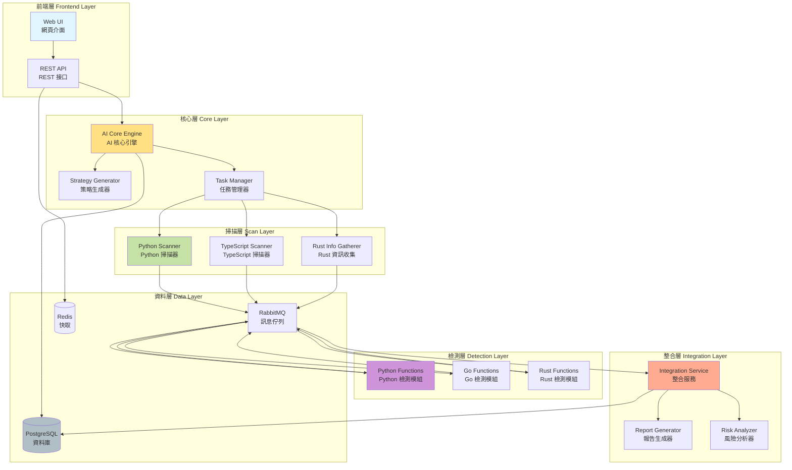

---

## 2. 四大模組概覽 | Four Core Modules Overview

```mermaid
graph LR
    subgraph "Module 1: Core Engine<br/>模組一：核心引擎"
        CORE_AI[AI Engine<br/>AI 引擎]
        CORE_EXEC[Execution Engine<br/>執行引擎]
        CORE_STATE[State Manager<br/>狀態管理]
    end

    subgraph "Module 2: Scan Engine<br/>模組二：掃描引擎"
        SCAN_STATIC[Static Scanner<br/>靜態掃描]
        SCAN_DYN[Dynamic Scanner<br/>動態掃描]
        SCAN_INFO[Info Collector<br/>資訊收集]
    end

    subgraph "Module 3: Detection Functions<br/>模組三：檢測功能"
        FUNC_WEB[Web Vulnerabilities<br/>Web 漏洞]
        FUNC_CLOUD[Cloud Security<br/>雲端安全]
        FUNC_CODE[Code Analysis<br/>程式碼分析]
    end

    subgraph "Module 4: Integration<br/>模組四：整合服務"
        INTG_API[API Gateway<br/>API 閘道]
        INTG_RPT[Reporting<br/>報告系統]
        INTG_RISK[Risk Assessment<br/>風險評估]
    end

    CORE_AI --> CORE_EXEC
    CORE_EXEC --> CORE_STATE
    CORE_STATE --> SCAN_STATIC

    SCAN_STATIC --> SCAN_DYN
    SCAN_DYN --> SCAN_INFO
    SCAN_INFO --> FUNC_WEB

    FUNC_WEB --> FUNC_CLOUD
    FUNC_CLOUD --> FUNC_CODE
    FUNC_CODE --> INTG_API

    INTG_API --> INTG_RPT
    INTG_RPT --> INTG_RISK

    style CORE_AI fill:#FFD54F
    style SCAN_STATIC fill:#81C784
    style FUNC_WEB fill:#BA68C8
    style INTG_API fill:#FF8A65
```

---

## 3. 核心引擎模組 | Core Engine Module

```mermaid
graph TB
    subgraph "Core Module<br/>核心引擎模組"
        subgraph "AI Engine<br/>AI 引擎"
            BIO[Bio Neuron Core<br/>生物神經網路核心]
            KB[Knowledge Base<br/>知識庫]
            TOOLS[AI Tools<br/>AI 工具]
        end

        subgraph "Analysis<br/>分析模組"
            INIT[Initial Surface<br/>初始攻擊面]
            STRATEGY[Strategy Generator<br/>策略生成器]
            DYNAMIC[Dynamic Adjustment<br/>動態調整]
        end

        subgraph "Execution<br/>執行引擎"
            TASKGEN[Task Generator<br/>任務生成器]
            QUEUE[Task Queue Manager<br/>任務佇列管理]
            MONITOR[Status Monitor<br/>狀態監控]
        end

        subgraph "State Management<br/>狀態管理"
            SESSION[Session State<br/>會話狀態]
            CONTEXT[Scan Context<br/>掃描上下文]
        end

        subgraph "UI Panel<br/>UI 面板"
            DASH[Dashboard<br/>儀表板]
            SERVER[UI Server<br/>UI 服務器]
        end
    end

    BIO --> KB
    KB --> TOOLS
    TOOLS --> INIT

    INIT --> STRATEGY
    STRATEGY --> DYNAMIC
    DYNAMIC --> TASKGEN

    TASKGEN --> QUEUE
    QUEUE --> MONITOR
    MONITOR --> SESSION

    SESSION --> CONTEXT
    CONTEXT --> DASH
    DASH --> SERVER

    style BIO fill:#FFD54F
    style STRATEGY fill:#FFF59D
    style TASKGEN fill:#FFECB3
    style DASH fill:#FFE082
```

---

## 4. 掃描引擎模組 | Scan Engine Module

```mermaid
graph TB
    subgraph "Scan Module<br/>掃描引擎模組"
        subgraph "Python Scanner<br/>Python 掃描器"
            subgraph "Core Crawling<br/>核心爬蟲"
                HTTP[HTTP Client<br/>HTTP 客戶端]
                PARSER[Content Parser<br/>內容解析器]
                URLQ[URL Queue<br/>URL 佇列]
            end

            subgraph "Dynamic Engine<br/>動態引擎"
                BROWSER[Browser Pool<br/>瀏覽器池]
                JS_SIM[JS Simulator<br/>JS 模擬器]
                EXTRACTOR[Content Extractor<br/>內容提取器]
            end

            subgraph "Info Gatherer<br/>資訊收集"
                JS_ANAL[JS Analyzer<br/>JS 分析器]
                FINGER[Fingerprinter<br/>指紋識別]
                SENSITIVE[Sensitive Detector<br/>敏感資訊檢測]
            end
        end

        subgraph "TypeScript Scanner<br/>TypeScript 掃描器"
            TS_SERVICE[Scan Service<br/>掃描服務]
            TS_LOGGER[Logger<br/>日誌]
        end

        subgraph "Rust Info Gatherer<br/>Rust 資訊收集"
            GIT_SCAN[Git History Scanner<br/>Git 歷史掃描]
            SECRET[Secret Detector<br/>秘密檢測器]
        end

        subgraph "Configuration<br/>配置管理"
            AUTH_MGR[Auth Manager<br/>身份驗證管理]
            CONFIG[Config Center<br/>配置中心]
            SCOPE[Scope Manager<br/>範圍管理]
        end
    end

    HTTP --> PARSER
    PARSER --> URLQ
    URLQ --> BROWSER

    BROWSER --> JS_SIM
    JS_SIM --> EXTRACTOR
    EXTRACTOR --> JS_ANAL

    JS_ANAL --> FINGER
    FINGER --> SENSITIVE
    SENSITIVE --> TS_SERVICE

    TS_SERVICE --> TS_LOGGER
    TS_LOGGER --> GIT_SCAN
    GIT_SCAN --> SECRET

    SECRET --> AUTH_MGR
    AUTH_MGR --> CONFIG
    CONFIG --> SCOPE

    style HTTP fill:#81C784
    style BROWSER fill:#AED581
    style TS_SERVICE fill:#4FC3F7
    style GIT_SCAN fill:#E57373
```

---

## 5. 檢測功能模組 | Detection Function Module

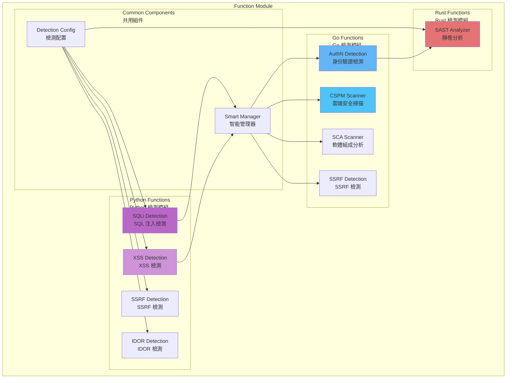

---

## 6. 整合服務模組 | Integration Service Module

```mermaid
graph TB
    subgraph "Integration Module<br/>整合服務模組"
        subgraph "Analysis<br/>分析服務"
            COMPLY[Compliance Checker<br/>合規性檢查]
            RISK[Risk Assessment<br/>風險評估]
            CORREL[Correlation Analyzer<br/>關聯分析]
        end

        subgraph "Attack Path<br/>攻擊路徑"
            ATK_ENGINE[Analysis Engine<br/>分析引擎]
            GRAPH[Graph Builder<br/>圖構建器]
            VISUAL[Visualizer<br/>視覺化]
        end

        subgraph "Reporting<br/>報告系統"
            CONTENT[Content Generator<br/>內容生成器]
            TEMPLATE[Template Selector<br/>模板選擇器]
            EXPORT[Formatter Exporter<br/>格式化匯出]
        end

        subgraph "Performance Feedback<br/>效能回饋"
            META[Metadata Analyzer<br/>元資料分析]
            SUGGEST[Suggestion Generator<br/>建議生成器]
        end

        subgraph "Infrastructure<br/>基礎設施"
            GATEWAY[API Gateway<br/>API 閘道]
            RECEPTION[Data Reception<br/>資料接收]
            DB_INTG[SQL Database<br/>SQL 資料庫]
        end
    end

    COMPLY --> RISK
    RISK --> CORREL
    CORREL --> ATK_ENGINE

    ATK_ENGINE --> GRAPH
    GRAPH --> VISUAL
    VISUAL --> CONTENT

    CONTENT --> TEMPLATE
    TEMPLATE --> EXPORT
    EXPORT --> META

    META --> SUGGEST
    SUGGEST --> GATEWAY
    GATEWAY --> RECEPTION
    RECEPTION --> DB_INTG

    style COMPLY fill:#FF8A65
    style ATK_ENGINE fill:#FFAB91
    style CONTENT fill:#FFCCBC
    style GATEWAY fill:#BCAAA4
```

---

## 7. SQL 注入檢測流程 | SQLi Detection Flow

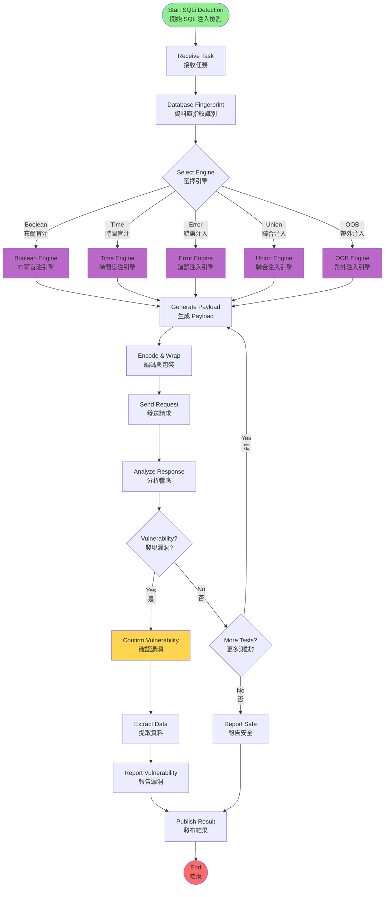

---

## 8. XSS 檢測流程 | XSS Detection Flow

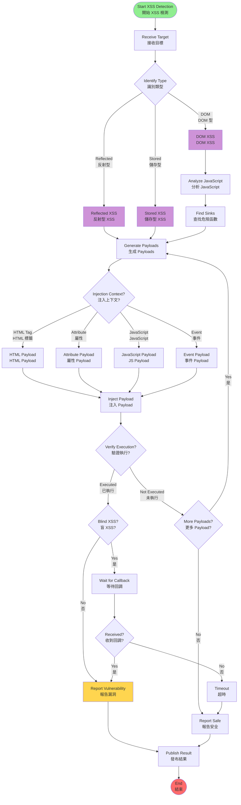

---

## 9. SSRF 檢測流程 | SSRF Detection Flow

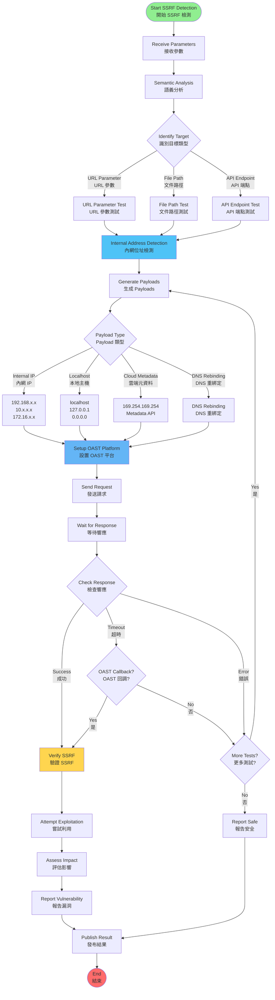

---

## 10. IDOR 檢測流程 | IDOR Detection Flow

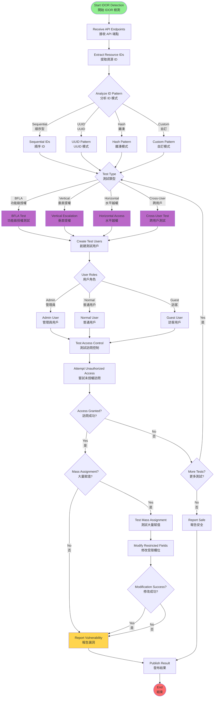

---

## 11. 完整掃描工作流程 | Complete Scan Workflow

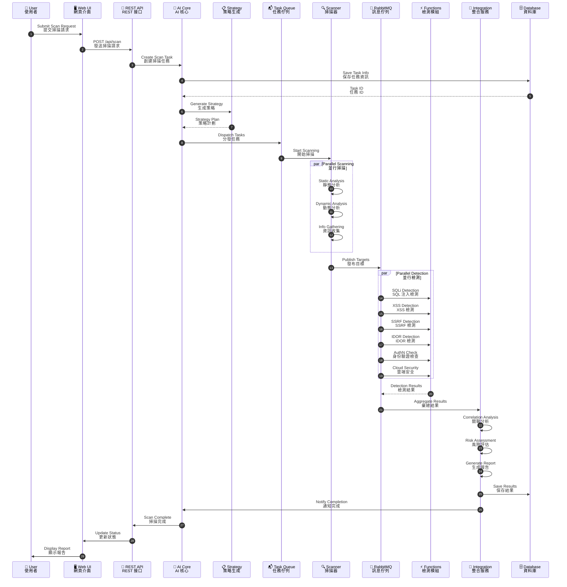

---

## 12. 多語言架構決策 | Multi-Language Architecture Decision

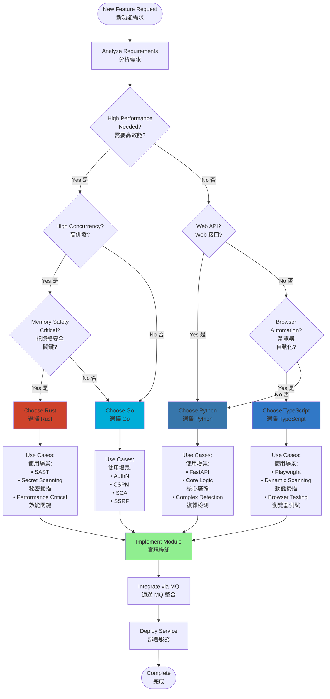

---

## 13. 資料流程圖 | Data Flow Diagram

```mermaid
graph TB
    subgraph "Input Layer<br/>輸入層"
        USER_INPUT[User Input<br/>用戶輸入]
        API_REQ[API Request<br/>API 請求]
    end

    subgraph "Validation Layer<br/>驗證層"
        AUTH[Authentication<br/>身份驗證]
        VALIDATE[Input Validation<br/>輸入驗證]
        SANITIZE[Sanitization<br/>清理]
    end

    subgraph "Processing Layer<br/>處理層"
        PARSE[Parse Request<br/>解析請求]
        CREATE_TASK[Create Task<br/>創建任務]
        QUEUE_TASK[Queue Task<br/>任務入隊]
    end

    subgraph "Execution Layer<br/>執行層"
        DISPATCH[Dispatch<br/>分發]
        SCAN_EXEC[Execute Scan<br/>執行掃描]
        DETECT_EXEC[Execute Detection<br/>執行檢測]
    end

    subgraph "Message Layer<br/>訊息層"
        PUBLISH[Publish Message<br/>發布訊息]
        CONSUME[Consume Message<br/>消費訊息]
        MQ_STORE[Message Storage<br/>訊息儲存]
    end

    subgraph "Analysis Layer<br/>分析層"
        COLLECT[Collect Results<br/>收集結果]
        CORRELATE[Correlate Data<br/>關聯資料]
        ASSESS[Assess Risk<br/>評估風險]
    end

    subgraph "Storage Layer<br/>儲存層"
        DB_WRITE[Write to DB<br/>寫入資料庫]
        CACHE_WRITE[Write to Cache<br/>寫入快取]
        FILE_STORE[File Storage<br/>文件儲存]
    end

    subgraph "Output Layer<br/>輸出層"
        FORMAT[Format Output<br/>格式化輸出]
        GENERATE_RPT[Generate Report<br/>生成報告]
        SEND_RESPONSE[Send Response<br/>發送響應]
    end

    USER_INPUT --> API_REQ
    API_REQ --> AUTH
    AUTH --> VALIDATE
    VALIDATE --> SANITIZE

    SANITIZE --> PARSE
    PARSE --> CREATE_TASK
    CREATE_TASK --> QUEUE_TASK

    QUEUE_TASK --> DISPATCH
    DISPATCH --> SCAN_EXEC
    DISPATCH --> DETECT_EXEC

    SCAN_EXEC --> PUBLISH
    DETECT_EXEC --> PUBLISH
    PUBLISH --> MQ_STORE
    MQ_STORE --> CONSUME

    CONSUME --> COLLECT
    COLLECT --> CORRELATE
    CORRELATE --> ASSESS

    ASSESS --> DB_WRITE
    ASSESS --> CACHE_WRITE
    ASSESS --> FILE_STORE

    DB_WRITE --> FORMAT
    CACHE_WRITE --> FORMAT
    FILE_STORE --> FORMAT

    FORMAT --> GENERATE_RPT
    GENERATE_RPT --> SEND_RESPONSE

    style USER_INPUT fill:#E1F5FE
    style AUTH fill:#FFF9C4
    style DISPATCH fill:#C5E1A5
    style COLLECT fill:#CE93D8
    style DB_WRITE fill:#FFAB91
    style SEND_RESPONSE fill:#B0BEC5
```

---

## 14. 部署架構圖 | Deployment Architecture

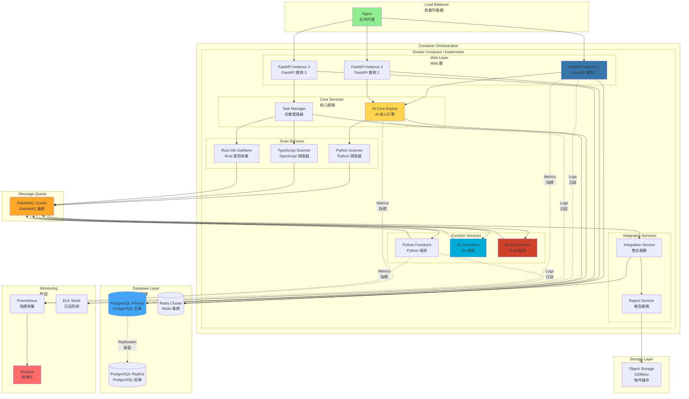

---

## 圖表說明 | Diagram Descriptions

### 使用方法 | Usage

1. **查看圖表 | View Diagrams**
   - 使用支援 Mermaid 的編輯器 (VS Code + Mermaid 擴展)
   - 線上預覽: <https://mermaid.live/>

2. **匯出圖表 | Export Diagrams**

   ```bash
   # 使用 mmdc CLI 匯出為 PNG/SVG
   mmdc -i diagram.mmd -o diagram.png
   ```

3. **整合到文檔 | Integrate to Docs**
   - 直接複製 Mermaid 語法到 Markdown
   - 使用 GitBook / Docusaurus 等支援 Mermaid 的文檔平台

### 圖表類型 | Diagram Types

- **graph TB/LR**: 流程圖 (上下/左右)
- **flowchart TD**: 詳細流程圖
- **sequenceDiagram**: 時序圖
- **pie**: 圓餅圖

### 顏色說明 | Color Legend

| 顏色 Color | 用途 Usage | 十六進位 Hex |
|-----------|-----------|------------|
| 🟦 藍色 | Python 模組 | #3776AB |
| 🟦 淺藍 | Go 模組 | #00ADD8 |
| 🟥 紅色 | Rust 模組 | #CE422B |
| 🟦 藍色 | TypeScript 模組 | #3178C6 |
| 🟨 黃色 | 核心服務 | #FFD54F |
| 🟩 綠色 | 掃描服務 | #81C784 |
| 🟪 紫色 | 檢測服務 | #BA68C8 |
| 🟧 橙色 | 整合服務 | #FF8A65 |

---

## 生成腳本 | Generation Script

使用以下命令重新生成圖表:

```bash
python tools/generate_complete_architecture.py
```

---

**文件版本 Document Version**: v1.0
**最後更新 Last Updated**: 2025-10-13
**維護者 Maintainer**: AIVA Development Team
