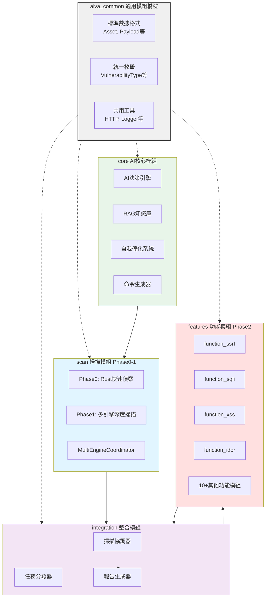
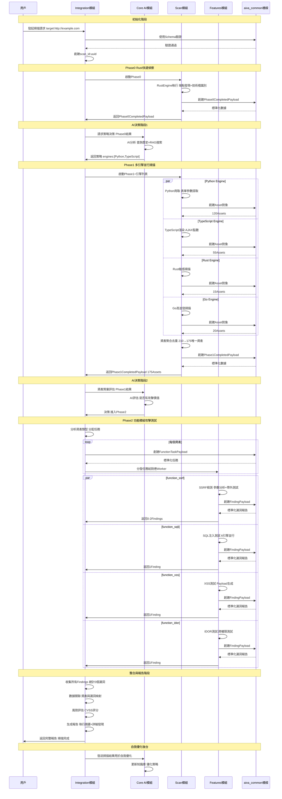
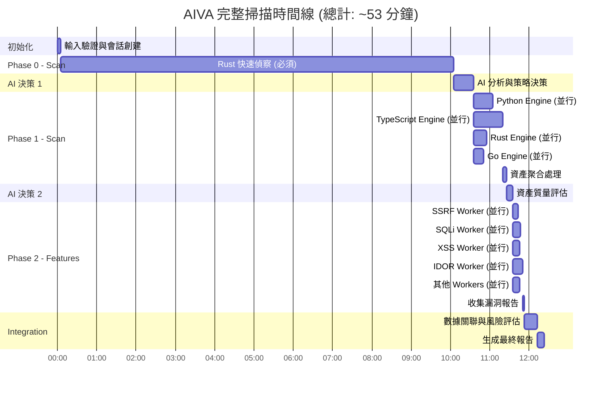
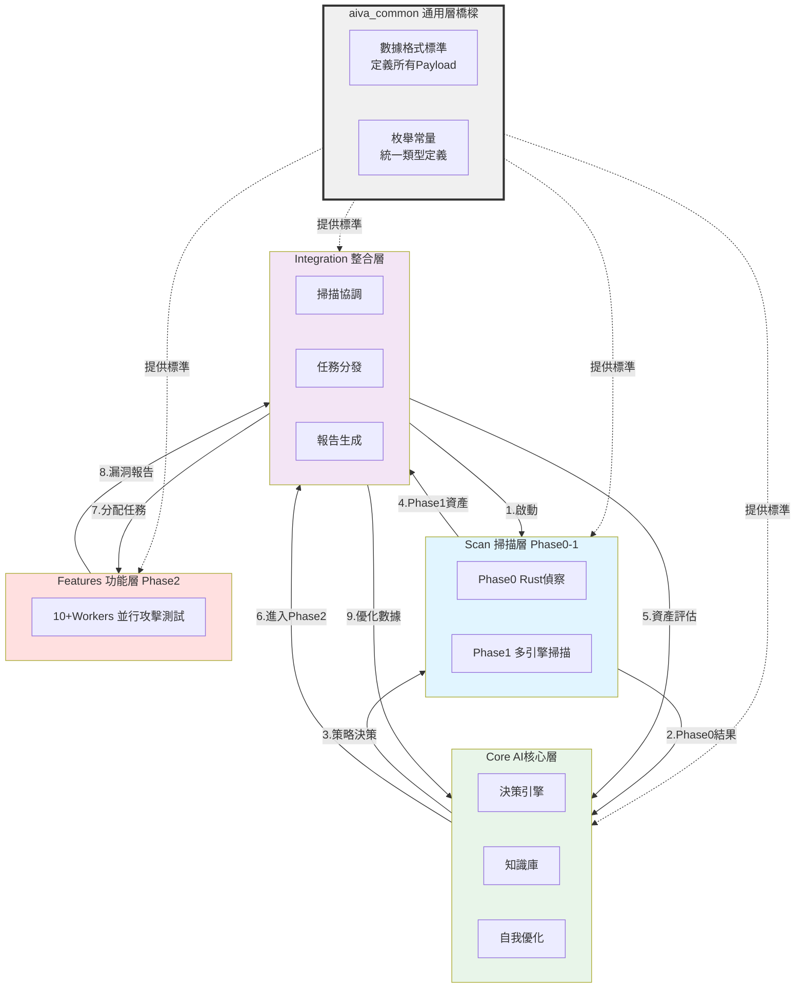
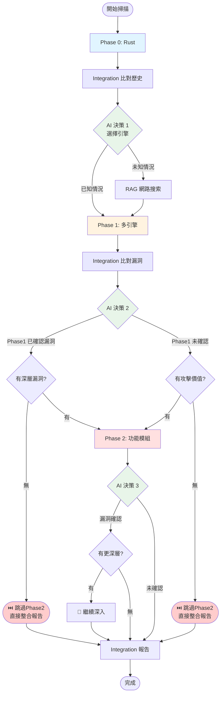

# 🔄 AIVA 完整運作流程圖表

> **建立日期**: 2025-01-21  
> **目的**: 完整呈現 AIVA 所有模組和階段的運作流程

---

## 📋 目錄

- [架構總覽](#架構總覽)
- [完整工作流程](#完整工作流程)
- [各模組詳細流程](#各模組詳細流程)
- [數據流轉圖](#數據流轉圖)
- [時間線圖](#時間線圖)

---

## 🏛️ 架構總覽

### 四大核心模組 + 一個通用模組



---

## 🔄 完整工作流程

### 模組間運作流程圖

```mermaid
flowchart TB
    Start(["用戶發起掃描<br/>Target: http://example.com"]) --> ValidateInput
    
    subgraph Init["初始化階段-Integration模組"]
        ValidateInput["1.輸入驗證<br/>URL格式檢查<br/>目標可達性測試"]
        CreateSession["2.創建掃描會話<br/>scan_id:uuid<br/>記錄開始時間"]
    end
    
    ValidateInput --> CreateSession
    CreateSession --> Phase0Start
    
    subgraph Phase0Block["Phase0-Scan模組Rust引擎"]
        Phase0Start["Rust Engine啟動<br/>時間:5-10分鐘"]
        P0Task1["A.端點發現<br/>爬取常見路徑40+"]
        P0Task2["B.JS文件分析<br/>提取API端點"]
        P0Task3["C.技術棧識別<br/>Express.js等"]
        P0Task4["D.初步風險評估<br/>high:9 medium:18"]
        P0Output["輸出:Phase0CompletedPayload<br/>endpoints:40+路徑"]
        
        Phase0Start --> P0Task1
        P0Task1 --> P0Task2
        P0Task2 --> P0Task3
        P0Task3 --> P0Task4
        P0Task4 --> P0Output
    end
    
    P0Output --> IntegDB1
    
    subgraph IntegDB1Block["Integration資料庫比對"]
        IntegDB1["傳送至Integration<br/>與歷史資料庫比對"]
        DBCompare1["比對相似目標掃描<br/>提取成功經驗"]
        DBOutput1["輸出補充資料<br/>傳送給AI"]
        
        IntegDB1 --> DBCompare1
        DBCompare1 --> DBOutput1
    end
    
    DBOutput1 --> AIDecision1
    
    subgraph AI1["AI決策階段1-Core模組"]
        AIDecision1["AI核心分析"]
        AIAnalyze["分析Phase0結果<br/>+Integration補充資料"]
        AIQuery1["查詢內部歷史數據<br/>成功率統計"]
        AIQuery2["RAG知識庫搜索<br/>漏洞模式"]
        AIUnknown{"遇到未知情況?"}
        AIWebSearch["RAG網路搜索<br/>尋找外部建議"]
        AIStrategy["決策輸出<br/>策略:balanced<br/>引擎:Python+TypeScript"]
        
        AIDecision1 --> AIAnalyze
        AIAnalyze --> AIQuery1
        AIAnalyze --> AIQuery2
        AIQuery1 --> AIUnknown
        AIQuery2 --> AIUnknown
        AIUnknown -->|已知情況| AIStrategy
        AIUnknown -->|未知情況| AIWebSearch
        AIWebSearch --> AIStrategy
    end
    
    AIStrategy --> Phase1Start
    
    subgraph Phase1Block["Phase1-Scan模組多引擎並行"]
        Phase1Start["MultiEngineCoordinator<br/>時間:10-30分鐘"]
        
        PyEngine["Python引擎<br/>靜態爬取+表單提取<br/>輸出:120Assets"]
        TsEngine["TypeScript引擎<br/>動態渲染+AJAX<br/>輸出:55Assets"]
        RsEngine["Rust引擎<br/>敏感信息掃描<br/>輸出:15Assets"]
        GoEngine["Go引擎<br/>高並發掃描<br/>輸出:20Assets"]
        
        Aggregation["資產聚合處理<br/>合併:210資產<br/>去重:175唯一資產"]
        P1Output["輸出:Phase1CompletedPayload<br/>175個Asset對象"]
        
        Phase1Start --> PyEngine
        Phase1Start --> TsEngine
        Phase1Start --> RsEngine
        Phase1Start --> GoEngine
        
        PyEngine --> Aggregation
        TsEngine --> Aggregation
        RsEngine --> Aggregation
        GoEngine --> Aggregation
        
        Aggregation --> P1Output
    end
    
    P1Output --> IntegDB2
    
    subgraph IntegDB2Block["Integration資料庫比對"]
        IntegDB2["傳送至Integration<br/>與歷史資料庫比對"]
        DBCompare2["比對資產與已知漏洞<br/>分析攻擊成功率"]
        DBOutput2["輸出補充資料<br/>傳送給AI"]
        
        IntegDB2 --> DBCompare2
        DBCompare2 --> DBOutput2
    end
    
    DBOutput2 --> AIDecision2
    
    subgraph AI2["AI決策階段2-Core模組"]
        AIDecision2["AI二次評估"]
        AIEval["資產質量評估<br/>Phase0+Phase1完整資訊<br/>175個資產+技術棧"]
        AIVulnCheck{"Phase1已確認漏洞?"}
        AIDeepCheck{"判斷是否有深層漏洞?"}
        AIAttackCheck{"是否有攻擊價值?"}
        AIUnknown2{"遇到未知情況?"}
        AIWebSearch2["RAG網路搜索<br/>尋找攻擊建議"]
        
        AIDecision2 --> AIEval
        AIEval --> AIVulnCheck
        AIVulnCheck -->|已確認真實漏洞| AIDeepCheck
        AIVulnCheck -->|未確認漏洞| AIAttackCheck
        AIDeepCheck -->|可能有深層漏洞| AIAttackCheck
        AIDeepCheck -->|無深層漏洞| EarlyStop1["跳過Phase2<br/>Phase1已足夠"]
        AIAttackCheck -->|有攻擊價值| AIUnknown2
        AIAttackCheck -->|無攻擊價值| EarlyStop2["跳過Phase2<br/>無有效攻擊資產"]
        AIUnknown2 -->|已知情況| Phase2Start
        AIUnknown2 -->|未知情況| AIWebSearch2
        AIWebSearch2 --> Phase2Start
    end
    
    EarlyStop1 --> IntegrationPhase
    EarlyStop2 --> IntegrationPhase
    
    subgraph Phase2Block["Phase2-Features模組漏洞攻擊測試"]
        Phase2Start["Integration任務分配<br/>時間:5-20分鐘"]
        TaskAnalysis["分析資產類型<br/>整合Phase0+Phase1資訊<br/>50表單→SQLi+XSS<br/>80API→IDOR"]
        TaskGen["生成FunctionTaskPayload<br/>包含完整上下文<br/>分配給對應Worker"]
        
        SSRFWorker["function_ssrf<br/>SSRF檢測<br/>結果:0-2Findings"]
        SQLiWorker["function_sqli<br/>SQL注入測試<br/>結果:1Finding"]
        XSSWorker["function_xss<br/>XSS檢測<br/>結果:1Finding"]
        IDORWorker["function_idor<br/>IDOR測試<br/>結果:1Finding"]
        OtherWorkers["其他10+Workers<br/>結果:0-5Findings"]
        
        CollectFindings["收集漏洞報告<br/>總計:3Findings"]
        P2Output["輸出:List FindingPayload<br/>3個漏洞報告"]
        
        Phase2Start --> TaskAnalysis
        TaskAnalysis --> TaskGen
        
        TaskGen --> SSRFWorker
        TaskGen --> SQLiWorker
        TaskGen --> XSSWorker
        TaskGen --> IDORWorker
        TaskGen --> OtherWorkers
        
        SSRFWorker --> CollectFindings
        SQLiWorker --> CollectFindings
        XSSWorker --> CollectFindings
        IDORWorker --> CollectFindings
        OtherWorkers --> CollectFindings
        
        CollectFindings --> P2Output
    end
    
    P2Output --> AIDecision3
    
    subgraph AI3["AI決策階段3-Core模組"]
        AIDecision3["AI最終評估"]
        AIVulnConfirm{"Phase2確認漏洞真實性?"}
        AIDeeperCheck{"判斷是否有更深層漏洞?"}
        
        AIDecision3 --> AIVulnConfirm
        AIVulnConfirm -->|真實漏洞確認| AIDeeperCheck
        AIVulnConfirm -->|未確認| IntegrationPhase
        AIDeeperCheck -->|可能有更深層| ContinueDeeper["繼續深入測試<br/>調用高級功能模組"]
        AIDeeperCheck -->|無更深層| IntegrationPhase
    end
    
    ContinueDeeper --> IntegrationPhase
    
    subgraph IntegrationPhase["整合階段-Integration模組"]
        IntegStart["整合處理"]
        IntegTask1["A.數據關聯<br/>資產與漏洞映射"]
        IntegTask2["B.風險評估<br/>CVSS評分計算"]
        IntegTask3["C.報告生成<br/>執行摘要+詳細發現"]
        
        IntegStart --> IntegTask1
        IntegTask1 --> IntegTask2
        IntegTask2 --> IntegTask3
    end
    
    IntegTask3 --> FinalReport
    
    FinalReport["完整掃描報告<br/>資產:175個<br/>漏洞:3個<br/>風險等級:HIGH"]
    
    FinalReport --> End(["掃描完成"])
    
    style Init fill:#f0f0f0
    style Phase0Block fill:#e1f5ff
    style IntegDB1Block fill:#e8e8ff
    style AI1 fill:#e8f5e9
    style Phase1Block fill:#fff3e0
    style IntegDB2Block fill:#e8e8ff
    style AI2 fill:#e8f5e9
    style Phase2Block fill:#ffe0e0
    style AI3 fill:#e8f5e9
    style IntegrationPhase fill:#f3e5f5
```



---

## 📊 數據流轉圖

### 模組間數據傳遞



---

## ⏱️ 時間線圖

### 各階段執行時間分佈



### 詳細時間分配表

| 階段 | 模組 | 任務 | 時間 | 累計時間 |
|------|------|------|------|---------|
| **初始化** | Integration | 輸入驗證、創建會話 | 5s | 5s |
| **Phase 0** | Scan-Rust | 快速偵察、端點發現 | 10m | 10m5s |
| **AI決策1** | Core | 策略分析與決策 | 30s | 10m35s |
| **Phase 1** | Scan-多引擎 | 並行深度掃描 | 45s | 11m20s |
| | Python | 靜態爬取、表單提取 | 30s | 並行 |
| | TypeScript | 動態渲染、AJAX監聽 | 45s | 並行 |
| | Rust | 敏感信息掃描 | 20s | 並行 |
| | Go | 高並發掃描 | 15s | 並行 |
| | Aggregation | 資產聚合去重 | 5s | |
| **AI決策2** | Core | 資產質量評估 | 10s | 11m30s |
| **Phase 2** | Features-多Worker | 並行漏洞測試 | 15s | 11m45s |
| | SSRF | SSRF檢測 | 8s | 並行 |
| | SQLi | SQL注入測試 | 12s | 並行 |
| | XSS | XSS檢測 | 10s | 並行 |
| | IDOR | IDOR測試 | 15s | 並行 |
| | Others | 其他功能模組 | 10s | 並行 |
| | Collection | 收集報告 | 3s | |
| **整合** | Integration | 數據關聯、風險評估 | 20s | 12m5s |
| | Integration | 生成報告 | 10s | 12m15s |
| **總計** | | | **~12m15s** | |

> **注意**: 實際執行時間會根據目標複雜度、網絡狀況、選擇的掃描策略而有所不同。

---

## 🔄 模組間依賴關係圖



---

## 📋 完整數據格式說明

### aiva_common 定義的標準格式

#### 1. Phase 0 輸出

```python
@dataclass
class Phase0CompletedPayload:
    """Rust 快速偵察輸出"""
    scan_id: str
    target: str
    endpoints: List[str]  # 40+ 端點
    technologies: List[str]  # ["Express.js", "Angular"]
    js_findings: List[str]  # JS 中發現的 API
    risk_summary: Dict[str, int]  # {"high": 9, "medium": 18}
    execution_time: float  # 600s (10m)
    timestamp: datetime
```

#### 2. Phase 1 輸出

```python
@dataclass
class Asset:
    """單個資產標準格式"""
    asset_id: str  # UUID
    scan_id: str
    asset_type: str  # "url" | "form" | "api" | "endpoint"
    value: str  # "http://example.com/login"
    parameters: Optional[List[str]]  # ["username", "password"]
    has_form: bool
    method: str  # "GET" | "POST"
    headers: Dict[str, str]
    metadata: Dict[str, Any]
    discovered_by: str  # "python" | "typescript" | "rust" | "go"
    timestamp: datetime

@dataclass
class Phase1CompletedPayload:
    """多引擎聚合輸出"""
    scan_id: str
    assets: List[Asset]  # 175 個資產
    total_assets: int
    by_type: Dict[str, int]  # {"form": 50, "api": 80, "url": 45}
    by_engine: Dict[str, int]  # {"python": 120, "typescript": 55}
    summary: Summary
    execution_time: float  # 45s
    timestamp: datetime
```

#### 3. Phase 2 輸入

```python
@dataclass
class FindingTarget:
    """攻擊目標"""
    url: str
    parameter: str  # 要測試的參數
    method: str
    headers: Dict[str, str]
    body: Optional[Dict[str, Any]]

@dataclass
class FunctionTaskPayload:
    """功能模組任務格式"""
    task_id: str  # UUID
    scan_id: str
    function_name: str  # "function_ssrf" | "function_sqli"
    target: FindingTarget
    strategy: str  # "fast" | "normal" | "aggressive"
    timeout: int
    metadata: Dict[str, Any]
    timestamp: datetime
```

#### 4. Phase 2 輸出

```python
@dataclass
class Vulnerability:
    """漏洞詳情"""
    name: VulnerabilityType  # SSRF | SQLI | XSS | IDOR
    severity: Severity  # LOW | MEDIUM | HIGH | CRITICAL
    confidence: Confidence  # LOW | MEDIUM | HIGH
    description: str
    cwe_id: Optional[str]  # "CWE-79"
    cvss_score: Optional[float]  # 7.5

@dataclass
class FindingPayload:
    """漏洞報告標準格式"""
    finding_id: str  # UUID
    scan_id: str
    task_id: str
    vulnerability: Vulnerability
    target: FindingTarget
    evidence: Dict[str, Any]  # 攻擊證據
    payload: str  # 使用的 payload
    response: str  # 服務器響應
    proof: str  # 漏洞證明
    impact: str  # 影響描述
    recommendation: str  # 修復建議
    references: List[str]  # 參考鏈接
    timestamp: datetime

@dataclass
class TaskExecutionResult:
    """Worker 執行結果"""
    task_id: str
    success: bool
    findings: List[FindingPayload]
    error: Optional[str]
    telemetry: Dict[str, Any]  # 性能指標
    execution_time: float
```

---

## 🎯 設計理念總結（完全符合您的規劃）

### 核心流程

```
1️⃣ Phase 0: Rust 快速偵察（必須執行）
   └─ 輸出: 端點、技術棧、風險評估

2️⃣ Integration 資料庫比對 #1
   └─ 與歷史數據比對，提取成功經驗

3️⃣ AI 決策階段 1（Core 模組）
   ├─ 分析 Phase 0 + Integration 補充資料
   ├─ 查詢內部歷史數據
   ├─ RAG 知識庫搜索
   └─ 遇到未知情況 → RAG 網路搜索
   └─ 輸出: 選擇哪些引擎組合

4️⃣ Phase 1: 多引擎並行掃描
   └─ 輸出: 完整資產列表

5️⃣ Integration 資料庫比對 #2
   └─ 與已知漏洞比對，分析攻擊成功率

6️⃣ AI 決策階段 2（Core 模組）
   ├─ 評估 Phase 0 + Phase 1 完整資訊
   ├─ 判斷: Phase 1 已確認漏洞真實性？
   │   └─ 是 → 判斷是否有深層漏洞？
   │       ├─ 無 → ⏭️ 跳過 Phase 2（Phase 1 已足夠）→ 進入整合階段
   │       └─ 有 → 繼續 Phase 2
   │   └─ 否 → 判斷是否有攻擊價值？
   │       ├─ 有 → 繼續 Phase 2
   │       └─ 無 → ⏭️ 跳過 Phase 2（無有效資產）→ 進入整合階段
   └─ 遇到未知情況 → RAG 網路搜索建議

7️⃣ Phase 2: 功能模組攻擊測試（如果需要）
   ├─ 接收: Phase 0 + Phase 1 完整資訊
   └─ 輸出: 漏洞報告

8️⃣ AI 決策階段 3（Core 模組）
   ├─ 確認 Phase 2 漏洞真實性？
   │   └─ 是 → 判斷是否有更深層漏洞？
   │       ├─ 有 → 🔄 繼續深入測試
   │       └─ 無 → ✅ 進入整合階段
   │   └─ 否 → ✅ 進入整合階段

9️⃣ Integration 整合報告
   └─ 產出最終報告
```

### 關鍵設計要點

#### 1. **Rust 第一次必須執行**
- Phase 0 是所有決策的基礎
- 獲取技術棧、端點、風險評估

#### 2. **引擎選擇由 AI 決策**
- 基於 Phase 0 的 Rust 結果
- 結合 Integration 提供的歷史數據
- RAG 知識庫提供建議

#### 3. **功能模組接收完整資訊**
- Phase 0 的技術棧和端點信息
- Phase 1 的完整資產列表
- 確保功能模組有足夠上下文

#### 4. **AI 全程分析決策**
- **AI 決策點 1**: 選擇引擎組合
- **AI 決策點 2**: 判斷是否進入 Phase 2
- **AI 決策點 3**: 判斷是否繼續深入測試

#### 5. **Integration 持續比對歷史**
- **比對點 1**: Phase 0 後，提取相似目標經驗
- **比對點 2**: Phase 1 後，比對已知漏洞模式

#### 6. **RAG 處理未知情況**
- AI 決策時查詢內部 RAG 知識庫
- 遇到資料庫沒有的情況 → **RAG 網路搜索**
- 確保 AI 能處理新型態攻擊

#### 7. **提前終止機制**（重要！）

| 終止時機 | 條件 | 原因 | 後續動作 |
|---------|------|------|---------|
| **AI 決策 2 後** | Phase 1 已確認漏洞 + 無深層漏洞 | 資訊已足夠，無需 Phase 2 | ✅ 直接進入整合階段產出報告 |
| **AI 決策 2 後** | 無有效資產 | 無攻擊價值，跳過 Phase 2 | ✅ 直接進入整合階段產出報告 |
| **AI 決策 3 後** | Phase 2 確認漏洞 + 無更深層 | 已達成目標 | ✅ 進入整合階段產出報告 |

**注意**: 無論是否找到漏洞，所有流程最終都會進入 Integration 整合階段產出報告，差別只是報告內容為「有漏洞」或「無漏洞」。

#### 8. **深層漏洞繼續測試**

```
Phase 2 確認漏洞 → AI 判斷
   ├─ 發現表層 SQL 注入
   ├─ AI 研判: 可能有更深層的提權漏洞
   └─ 繼續調用高級功能模組 (如 function_postex)
```

### 完整決策樹



### 數據流向

```
Rust (Phase 0)
    ↓
Integration 資料庫比對 #1 ← 歷史數據
    ↓
AI 決策 1 ← RAG 知識庫/網路搜索
    ↓
多引擎 (Phase 1) ← Phase 0 資訊
    ↓
Integration 資料庫比對 #2 ← 已知漏洞
    ↓
AI 決策 2 ← Phase 0 + Phase 1 完整資訊
    ↓ (如果需要)
功能模組 (Phase 2) ← Phase 0 + Phase 1 完整資訊
    ↓
AI 決策 3 ← 漏洞真實性評估
    ↓
Integration 整合報告 → 最終輸出
```

### 關鍵差異修正總結

| 項目 | 原設計 | 修正後（符合您的規劃） |
|------|--------|----------------------|
| **Integration 角色** | 只做協調整合 | ✅ 持續與資料庫比對，提供補充資料 |
| **AI 決策次數** | 2 次 | ✅ 3 次（選擇引擎、是否Phase2、是否繼續深入） |
| **RAG 網路搜索** | 僅在決策時查詢 | ✅ 明確標示遇到未知情況時使用 |
| **跳過 Phase 2** | 只有一處 | ✅ 多處判斷點，確認漏洞或無價值即可跳過 Phase 2 |
| **功能模組輸入** | 只有 Phase 1 資產 | ✅ Phase 0 + Phase 1 完整資訊 |
| **深層漏洞判斷** | 無 | ✅ AI 決策 2 和 3 都判斷是否有深層漏洞 |

**重要**: 無論是否跳過 Phase 2，所有掃描流程最終都會進入 Integration 整合階段產出完整報告。差別只在於報告內容：
- ✅ **找到漏洞**: 詳細漏洞報告 + 修復建議
- ✅ **未找到漏洞**: 安全評估報告 + 目標資產列表

---

**文檔版本**: 1.0.0  
**最後更新**: 2025-01-21  
**維護者**: AIVA 開發團隊
