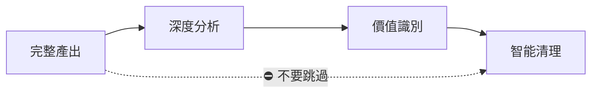

# AIVA 圖表產出管理指南

## 🎯 目的與理念

### **目的**
管理 `diagram_auto_composer.py` 產生的大量圖表檔案，避免目錄混亂。

### **核心理念：完整產出的智慧**
> **「有時候笨方法才是好方法」**

**為什麼選擇先全產出再篩選？**
- 🔍 **無法預知寶藏**: 最重要的架構洞察可能隱藏在看似無關的組件中
- 🎯 **零遺漏保證**: 寧可產出 300 個圖刪除 295 個，也不要遺漏 1 個關鍵發現
- 🧠 **完整理解基礎**: 只有看到全貌才能做出最佳的價值判斷
- ⚡ **意外發現**: 最突破性的發現往往來自「意外」的組合

**實際證明**：
```
掃描模組案例：
產出 301 個個別圖 → 發現策略驅動雙引擎架構模式 → 清理 295 個 
如果預先過濾 → 可能永遠不會發現這個關鍵模式
```

## 📋 標準工作流程

### **步驟 1：執行圖表分析**
```bash
cd AIVA-git
python scripts/diagram_auto_composer.py
```

### **步驟 2：立即檢查和清理**
```bash
# 自動檢查並清理（推薦）
python scripts/cleanup_diagram_output.py --auto

# 或手動確認後清理
python scripts/cleanup_diagram_output.py
```

### **步驟 3：驗證重要檔案保留**
確認以下檔案已保留：
- ✅ `*_INTEGRATED_ARCHITECTURE.mmd` (手工整合架構)
- ✅ `*_AUTO_INTEGRATED.mmd` (自動產出參考)
- ✅ `*_diagram_classification.json` (分類數據)
- ✅ `*_ARCHITECTURE_ANALYSIS.md` (架構分析)

## 🧹 手動清理方法

### **PowerShell 清理命令**
```powershell
# 清理自動產生的個別組件圖
Remove-Item "_out/architecture_diagrams/aiva_*_Function_*.mmd" -Confirm:$false
Remove-Item "_out/architecture_diagrams/aiva_*_Module.mmd" -Confirm:$false

# 檢查清理結果
Get-ChildItem "_out/architecture_diagrams" | Measure-Object
```

### **備份重要檔案**
```bash
# 創建備份目錄
mkdir -p backup/$(date +%Y%m%d)

# 備份重要整合圖
cp _out/*_INTEGRATED_ARCHITECTURE.mmd backup/$(date +%Y%m%d)/
cp _out/*_ARCHITECTURE_ANALYSIS.md backup/$(date +%Y%m%d)/
```

## ⚠️ 重要提醒

### **永遠保留的檔案類型**
- 手工優化的整合架構圖 (語法正確，內容精煉)
- 架構分析報告 (包含重要洞察和問題識別)
- 分類數據 JSON (分析的原始資產)

### **可以刪除的檔案類型**
- 個別函數級圖表 (`aiva_*_Function_*.mmd`)
- 個別模組級圖表 (`aiva_*_Module.mmd`) 
- 重複率超過 90% 的類似圖表

### **最佳實踐**

#### **階段化工作流程**


1. **完整產出第一** - 不要預先過濾任何組件
2. **深度分析理解** - 花時間理解分類結果和模式
3. **人工價值判斷** - 基於完整理解識別真正的價值
4. **智能批量清理** - 保護發現的寶藏，清理冗餘

#### **實用建議**
- 🕐 **給分析留時間**: 不要匆忙清理，可能錯過重要洞察
- 🔍 **意外發現敏感**: 注意那些分類為 "detail" 但實際包含關鍵模式的組件
- 📊 **數據驅動決策**: 基於 classification.json 的統計做決策
- 🛡️ **保護直覺**: 如果某個圖"感覺"重要，就保留它

## 📊 統計參考

| 模組 | 原始圖檔 | 清理後 | 保留率 |
|------|---------|--------|--------|
| scan | 301 | 4 | 1.3% |
| analysis | ~200 | 3-5 | ~2% |
| reception | ~150 | 3-5 | ~3% |

**清理可以減少 97% 的檔案數量，同時保留所有重要的架構洞察！**

---

*建立日期：2025年10月24日*  
*適用版本：AIVA v2.0+*