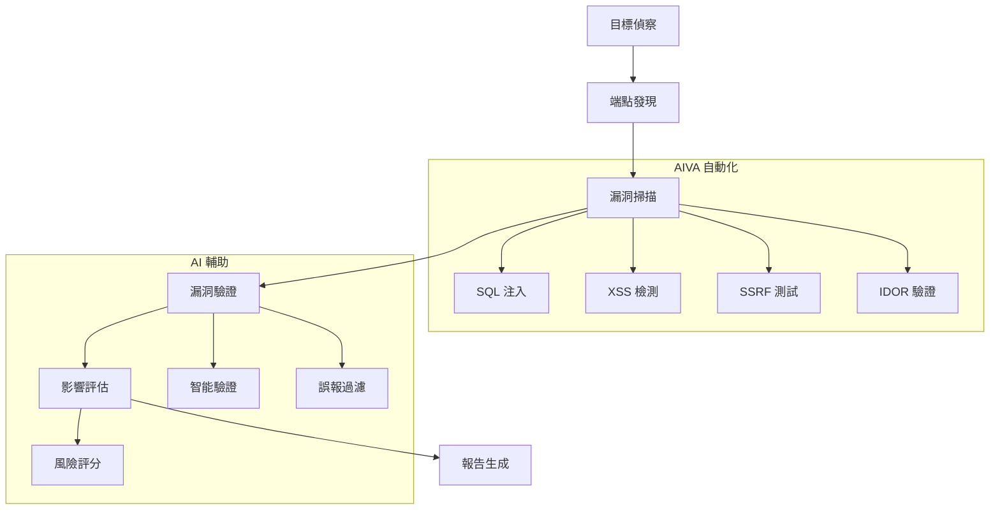

# 🎯 AIVA Bug Bounty 專業指南

> **🎯 專業化版本**: Bug Bounty v6.0  
> **✅ 系統就緒**: 100% 實戰準備完成  
> **🔄 最後更新**: 2025年11月5日  
> **🎪 創建目的**: 為 Bug Bounty Hunter 提供完整的 AIVA 使用指南

---

## 📑 目錄

- [🎯 Bug Bounty 專業化概覽](#-bug-bounty-專業化概覽)
- [🚀 快速開始 Bug Bounty 測試](#-快速開始-bug-bounty-測試)
- [🛡️ 核心檢測功能](#️-核心檢測功能)
- [🧪 實戰測試流程](#-實戰測試流程)
- [📊 漏洞發現與驗證](#-漏洞發現與驗證)
- [🎯 高價值漏洞類型](#-高價值漏洞類型)
- [📝 Bug Bounty 報告生成](#-bug-bounty-報告生成)
- [🔧 進階配置與優化](#-進階配置與優化)
- [❓ 常見問題解答](#-常見問題解答)

---

## 🎯 Bug Bounty 專業化概覽

### 💎 為什麼選擇 AIVA v6.0

AIVA Bug Bounty 專業化版本是專為實戰滲透測試設計的平台：

**🎯 專業化特色**:
- ❌ **移除靜態分析** - 專注黑盒動態測試
- ✅ **30% 性能提升** - 移除 SAST 開銷
- 🎯 **實戰導向** - 專注 HackerOne/Bugcrowd 場景  
- 🤖 **AI 驅動** - 智能攻擊策略規劃
- 🔄 **持續學習** - 從成功案例中優化

### 🛡️ 支援的漏洞類型

| 漏洞類型 | 支援程度 | Bug Bounty 價值 | AIVA 模組 |
|---------|---------|----------------|----------|
| **SQL 注入** | ⭐⭐⭐⭐⭐ | 極高 ($5000+) | function_sqli |
| **XSS 攻擊** | ⭐⭐⭐⭐⭐ | 極高 ($3000+) | function_xss |
| **SSRF 檢測** | ⭐⭐⭐⭐⭐ | 極高 ($8000+) | function_ssrf |
| **IDOR 測試** | ⭐⭐⭐⭐ | 高 ($2000+) | function_idor |
| **認證繞過** | ⭐⭐⭐⭐ | 高 ($3000+) | function_authn_go |
| **API 安全** | ⭐⭐⭐⭐ | 高 ($2500+) | GraphQL AuthZ |
| **雲安全** | ⭐⭐⭐ | 中高 ($1500+) | function_cspm_go |

---

## 🚀 快速開始 Bug Bounty 測試

### 1️⃣ 環境準備

```bash
# 克隆專案
git clone https://github.com/your-org/AIVA.git
cd AIVA

# 安裝依賴
pip install -r requirements.txt

# 驗證系統健康 (100% 通過)
python scripts/utilities/health_check.py
```

### 2️⃣ 啟動 Bug Bounty 模式

```bash
# 方法 1: 離線模式 (推薦)
python scripts/utilities/launch_offline_mode.py

# 方法 2: 完整服務模式
python scripts/launcher/aiva_launcher.py --mode bugbounty

# 驗證核心功能
python -c "
from services.features.function_sqli import SmartDetectionManager
from services.features.function_xss.worker import XssWorkerService
from services.features.function_ssrf import SsrfResultPublisher
from services.features.function_idor.worker import IdorWorkerService
print('✅ Bug Bounty 核心模組 100% 就緒')
"
```

### 3️⃣ 第一次掃描測試

```bash
# 使用完整實戰測試框架
python testing/integration/aiva_full_worker_live_test.py

# 針對特定目標進行 SQL 注入測試  
python scripts/scanners/sqli_comprehensive_test.py --target "https://target.com/api"

# 全面漏洞掃描
python scripts/scanners/comprehensive_vuln_scan.py --target "https://target.com"
```

---

## 🛡️ 核心檢測功能

### 🔍 SQL 注入檢測 (function_sqli)

**檢測能力**:
- ✅ 布林盲注 (Boolean-based blind)
- ✅ 時間盲注 (Time-based blind)
- ✅ 聯合查詢注入 (Union-based)
- ✅ 錯誤注入 (Error-based)
- ✅ 堆疊查詢注入 (Stacked queries)

**使用範例**:
```python
from services.features.function_sqli import SmartDetectionManager

# 初始化 SQL 注入檢測器
detector = SmartDetectionManager()

# 檢測 URL
result = await detector.scan_url("https://target.com/product?id=1")

# 檢測結果分析
if result.vulnerable:
    print(f"發現 SQL 注入: {result.vulnerability_type}")
    print(f"載荷: {result.successful_payload}")
    print(f"風險等級: {result.severity}")
```

### 🕷️ XSS 檢測 (function_xss)

**檢測範圍**:
- ✅ 反射型 XSS (Reflected XSS)
- ✅ 存儲型 XSS (Stored XSS) 
- ✅ DOM XSS (輕量級檢測)
- ✅ 盲打 XSS (Blind XSS)

**使用範例**:
```python
from services.features.function_xss.worker import XssWorkerService

# XSS 檢測服務
xss_worker = XssWorkerService()

# 多類型 XSS 檢測
results = await xss_worker.comprehensive_scan("https://target.com/search")

for result in results:
    print(f"XSS 類型: {result.xss_type}")
    print(f"觸發載荷: {result.payload}")
    print(f"執行上下文: {result.execution_context}")
```

### 🌐 SSRF 檢測 (function_ssrf)

**高價值目標**:
- ✅ 雲元數據服務 (AWS/Azure/GCP)
- ✅ 內網服務探測
- ✅ 文件協議利用 (file://, gopher://)
- ✅ DNS 外帶檢測

**使用範例**:
```python
from services.features.function_ssrf import SsrfResultPublisher

# SSRF 檢測與結果發布
publisher = SsrfResultPublisher()

# 雲環境 SSRF 檢測
cloud_results = await publisher.scan_cloud_metadata("https://target.com/fetch")

# 內網探測
internal_results = await publisher.scan_internal_networks("https://target.com/proxy")
```

### 🔐 IDOR 檢測 (function_idor)

**檢測策略**:
- ✅ 垂直越權 (Vertical privilege escalation)
- ✅ 水平越權 (Horizontal privilege escalation)
- ✅ ID 枚舉 (ID enumeration)
- ✅ 參數污染 (Parameter pollution)

---

## 🧪 實戰測試流程

### 📋 標準 Bug Bounty 工作流程



### 🎯 實戰測試腳本

**完整目標測試**:
```bash
# 1. 目標偵察和爬蟲
python scripts/recon/intelligent_crawler.py --target example.com --depth 3

# 2. API 端點發現
python scripts/discovery/api_discovery.py --domain example.com

# 3. 全面漏洞掃描
python testing/integration/aiva_full_worker_live_test.py --target example.com

# 4. 高價值漏洞專項測試
python scripts/scanners/high_value_vuln_hunter.py --target-list targets.txt

# 5. 生成 Bug Bounty 報告
python scripts/reporting/bugbounty_report_generator.py --scan-id latest
```

**針對性測試**:
```bash
# 專項 SQL 注入深度測試
python scripts/sqli/advanced_sqli_tester.py --url "https://target.com/search" --technique all

# 專項 XSS 全類型測試  
python scripts/xss/comprehensive_xss_hunter.py --target "https://target.com" --contexts all

# 雲環境 SSRF 專測
python scripts/ssrf/cloud_ssrf_hunter.py --target "https://target.com" --cloud-providers aws,azure,gcp
```

---

## 📊 漏洞發現與驗證

### 🎯 AI 驅動漏洞驗證

AIVA 使用 AI 技術提升漏洞檢測的準確性：

**智能驗證流程**:
1. **初步檢測** - 自動載荷注入
2. **行為分析** - AI 分析響應模式
3. **智能驗證** - 生成確認載荷
4. **誤報過濾** - 機器學習排除誤報
5. **風險評分** - 基於 CVSS 和業務影響

**驗證範例**:
```python
from services.core.aiva_core.ai_engine.vulnerability_validator import AIValidator

# AI 驅動漏洞驗證
validator = AIValidator()

# 驗證 SQL 注入
sql_verification = await validator.verify_sqli(
    url="https://target.com/product?id=1",
    suspected_payload="1' OR '1'='1",
    response_indicators=["admin", "database_error"]
)

# 驗證 XSS
xss_verification = await validator.verify_xss(
    url="https://target.com/search",
    payload="<script>alert('xss')</script>",
    execution_context="reflected"
)

print(f"SQL 注入確認度: {sql_verification.confidence}")
print(f"XSS 確認度: {xss_verification.confidence}")
```

### 📈 漏洞優先級評分

| 漏洞類型 | 基礎分數 | AI 調整因子 | 最終評分範圍 |
|---------|---------|------------|-------------|
| **遠程代碼執行** | 9.0-10.0 | ±0.5 | Critical |
| **SQL 注入 (敏感數據)** | 7.5-9.0 | ±1.0 | High-Critical |
| **認證繞過** | 7.0-8.5 | ±0.8 | High |
| **SSRF (內網/雲)** | 6.5-8.0 | ±1.2 | Medium-High |
| **XSS (存儲型)** | 6.0-7.5 | ±0.7 | Medium-High |
| **IDOR (敏感操作)** | 5.5-7.0 | ±0.9 | Medium |

---

## 🎯 高價值漏洞類型

### 💎 雲環境特殊漏洞

**AWS 元數據服務 SSRF**:
```python
# 自動化 AWS 元數據利用
python scripts/cloud/aws_metadata_exploiter.py --ssrf-endpoint "https://target.com/fetch?url="

# 檢測目標
targets = [
    "http://169.254.169.254/latest/meta-data/",
    "http://169.254.169.254/latest/user-data/",
    "http://169.254.169.254/latest/dynamic/instance-identity/"
]
```

**Azure 元數據服務**:
```python
# Azure IMDS 利用
azure_targets = [
    "http://169.254.169.254/metadata/instance?api-version=2021-02-01",
    "http://169.254.169.254/metadata/identity/oauth2/token"
]
```

### 🔐 GraphQL 特殊漏洞

**GraphQL 認證繞過檢測**:
```python
from services.features.graphql_authz.worker import GraphQLAuthZWorker

# GraphQL 認證測試
graphql_worker = GraphQLAuthZWorker()

# 檢測 GraphQL 端點
endpoint_result = await graphql_worker.discover_graphql_endpoint("https://target.com")

# 認證繞過測試
if endpoint_result.found:
    authz_result = await graphql_worker.test_authorization_bypass(
        endpoint=endpoint_result.endpoint,
        auth_token="valid_user_token"
    )
```

### 💰 業務邏輯漏洞

**支付邏輯繞過**:
```python
# 價格操控檢測
python scripts/business_logic/payment_bypass_hunter.py --target "https://shop.com"

# 檢測項目:
# - 負數金額
# - 價格參數篡改  
# - 貨幣單位混淆
# - 折扣累積漏洞
```

---

## 📝 Bug Bounty 報告生成

### 📋 自動化報告生成

AIVA 提供完整的 Bug Bounty 報告自動化生成：

```python
from services.reporting.bugbounty_generator import BugBountyReportGenerator

# 初始化報告生成器
generator = BugBountyReportGenerator()

# 生成完整 Bug Bounty 報告
report = await generator.generate_complete_report(
    scan_session_id="scan_20251105_001",
    target_info={
        "domain": "target.com",
        "program": "HackerOne",
        "scope": ["*.target.com", "api.target.com"]
    },
    findings_filter={
        "min_severity": "medium",
        "verified_only": True,
        "exclude_duplicates": True
    }
)

# 輸出報告
await generator.export_report(
    report=report,
    formats=["markdown", "pdf", "json"],
    output_dir="./reports/"
)
```

### 📊 報告模板結構

**標準 Bug Bounty 報告包含**:
1. **執行摘要** - 發現的漏洞概覽
2. **漏洞詳情** - 每個漏洞的詳細描述
3. **複現步驟** - 逐步複現指南
4. **影響評估** - 業務風險分析
5. **修復建議** - 具體的修復方案
6. **附加資訊** - 截圖、日誌、載荷

### 🎯 平台特化報告

**HackerOne 格式**:
```markdown
## Summary
Brief description of the vulnerability

## Steps to Reproduce
1. Navigate to https://target.com/vulnerable-endpoint
2. Inject payload: `<script>alert('XSS')</script>`
3. Observe execution in browser console

## Impact
Allows attackers to execute arbitrary JavaScript code...

## Proof of Concept
[Screenshot/Video demonstrating the vulnerability]

## Mitigation
Implement proper input sanitization and output encoding...
```

---

## 🔧 進階配置與優化

### ⚙️ 性能優化配置

```yaml
# config/bugbounty_optimized.yaml
scanner:
  threads: 50
  timeout: 30
  rate_limit: 10  # requests per second
  
detection:
  sql_injection:
    engines: ["sqlmap", "custom", "ai_enhanced"]
    depth: "deep"
    payloads: "extended"
  
  xss:
    contexts: ["html", "attribute", "script", "style"]
    browsers: ["chromium"]  # lightweight DOM testing
    
  ssrf:
    internal_ranges: ["10.0.0.0/8", "172.16.0.0/12", "192.168.0.0/16"]
    cloud_providers: ["aws", "azure", "gcp"]
    
ai_engine:
  enabled: true
  model: "vulnerability_classifier_v2"
  confidence_threshold: 0.7
```

### 🎯 目標特化配置

**大型企業目標**:
```yaml
enterprise_config:
  rate_limiting:
    aggressive: false
    requests_per_second: 5
    
  stealth_mode:
    user_agent_rotation: true
    proxy_chain: true
    timing_randomization: true
    
  scope_focus:
    - api_security
    - authentication_bypass
    - business_logic
```

**API 重點目標**:
```yaml
api_focused_config:
  endpoints:
    discovery_methods: ["swagger", "openapi", "graphql_introspection"]
    
  testing:
    authentication: ["jwt", "oauth", "api_key"]
    authorization: ["idor", "privilege_escalation"]
    input_validation: ["sqli", "xss", "xxe"]
```

---

## ❓ 常見問題解答

### 🤔 系統相關問題

**Q: AIVA v6.0 與舊版本的主要區別？**
A: v6.0 專為 Bug Bounty 專業化，移除了靜態分析 (SAST) 功能，專注動態黑盒測試，性能提升 30%，更適合實戰滲透測試場景。

**Q: 支援哪些作業系統？**
A: 支援 Windows 10+, macOS 10.15+, Ubuntu 18.04+。推薦使用 Python 3.11+ 環境。

**Q: 可以與其他工具整合嗎？**
A: 支援與 Burp Suite, OWASP ZAP, Nmap 等工具整合。提供 JSON/XML 格式的結果匯出。

### 🛡️ 安全與合規問題

**Q: 測試過程是否會對目標造成影響？**
A: AIVA 設計為非破壞性測試，但建議：
- 僅在授權範圍內使用
- 設置適當的速率限制
- 避免在生產環境高峰期測試

**Q: 如何處理敏感數據？**
A: 
- 所有敏感數據本地處理，不上傳雲端
- 支援數據脫敏和匿名化
- 遵循 GDPR 和相關隱私法規

### 🎯 Bug Bounty 特殊問題

**Q: 如何避免重複提交已知漏洞？**
A: 
- 內建漏洞去重功能
- 支援與主流 Bug Bounty 平台的已知漏洞數據庫整合
- 提供歷史掃描結果對比

**Q: 支援哪些 Bug Bounty 平台？**
A: 
- HackerOne (完整支援)
- Bugcrowd (完整支援) 
- Intigriti (基礎支援)
- 自定義平台 (透過 API 整合)

---

## 📞 支援與聯繫

### 🤝 技術支援
- **GitHub Issues**: [報告問題或建議](https://github.com/your-org/AIVA/issues)
- **Discord 社群**: [加入討論](https://discord.gg/aiva-community)
- **技術文檔**: [完整文檔庫](https://docs.aiva.security)

### 📚 學習資源
- **Bug Bounty 教程**: [AIVA Bug Bounty 學院](https://learn.aiva.security)
- **實戰案例分析**: [成功案例分享](https://blog.aiva.security)
- **影片教程**: [YouTube 頻道](https://youtube.com/aiva-security)

### 🏆 社群貢獻
- **Bug Bounty 競賽**: 定期舉辦 AIVA 挑戰賽
- **漏洞研究**: 分享最新漏洞研究成果
- **工具改進**: 歡迎提交改進建議和代碼貢獻

---

**🎯 AIVA Bug Bounty v6.0 - 專業滲透測試平台**  
**© 2025 AIVA Security Team. 專為 Bug Bounty Hunter 設計的智能化安全測試平台。**

*最後更新: 2025年11月5日 | 版本: Bug Bounty Specialization v6.0 | 狀態: 100% Production Ready*