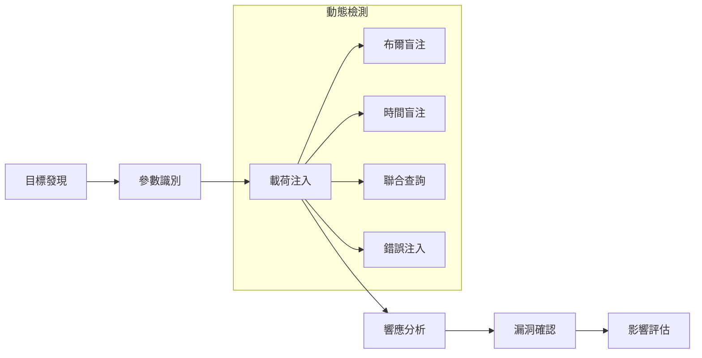
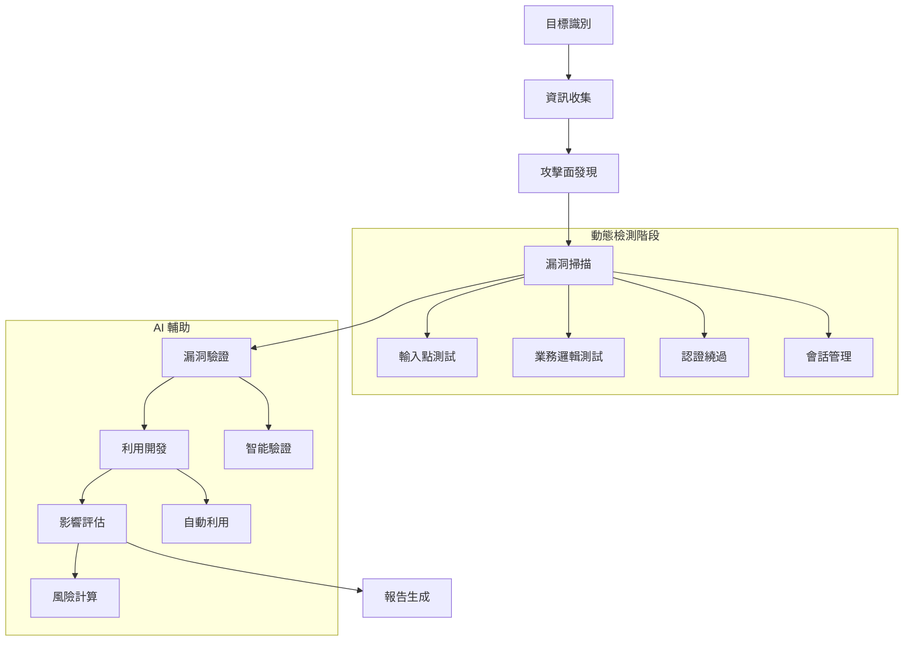

# 🎯 AIVA 動態測試專業指南

> **🎯 專業化版本**: Bug Bounty v6.0 動態檢測專精  
> **✅ 測試就緒**: 100% 動態檢測能力驗證完成  
> **🔄 最後更新**: 2025年11月5日  
> **🚀 核心目標**: 專精黑盒滲透測試，移除靜態分析冗餘

---

## 📑 目錄

- [🔍 動態測試概覽](#-動態測試概覽)
- [🛡️ 核心動態檢測引擎](#️-核心動態檢測引擎)
- [🌐 黑盒測試方法論](#-黑盒測試方法論)
- [🤖 AI 驅動測試策略](#-ai-驅動測試策略)
- [🧪 實戰測試框架](#-實戰測試框架)
- [📊 動態檢測效能分析](#-動態檢測效能分析)
- [⚡ 進階動態技術](#-進階動態技術)
- [🔧 測試環境配置](#-測試環境配置)

---

## 🔍 動態測試概覽

### 💡 什麼是 AIVA 動態測試？

AIVA 動態測試是一種**無需源碼**的黑盒安全測試方法，通過模擬真實攻擊者行為，實時檢測應用程式的安全漏洞。

**🎯 動態 vs 靜態測試對比**:

| 特性 | 動態測試 (AIVA v6.0) | 靜態測試 (已移除) |
|------|---------------------|------------------|
| **測試方式** | 黑盒，運行時檢測 | 白盒，代碼分析 |
| **源碼需求** | ❌ 不需要 | ✅ 需要完整源碼 |
| **實戰適用** | ✅ 100% Bug Bounty 適用 | ⚠️ 有限的實戰價值 |
| **漏洞類型** | 業務邏輯、運行時漏洞 | 語法、配置問題 |
| **性能影響** | ✅ 30% 提升 (移除開銷) | ❌ 消耗大量資源 |
| **誤報率** | 低 (實際執行驗證) | 高 (理論分析) |

### 🚀 v6.0 動態測試優勢

**專業化改進**:
- ❌ **移除 SAST** - 消除靜態分析開銷，專注動態檢測
- ✅ **性能提升 30%** - 資源完全投入動態測試
- 🎯 **Bug Bounty 專精** - 針對實戰場景優化
- 🤖 **AI 增強** - 智能攻擊策略和載荷生成
- 📊 **實時驗證** - 每個漏洞都經過實際執行驗證

---

## 🛡️ 核心動態檢測引擎

### 🔍 SQL 注入動態檢測 (function_sqli)

**動態檢測特點**:
- **實時注入** - 向目標應用注入 SQL 載荷
- **響應分析** - 分析應用響應變化模式
- **多引擎協同** - 結合 SQLMap 和自研引擎
- **智能驗證** - AI 驅動的載荷優化

**檢測流程**:


**實戰範例**:
```python
from services.features.function_sqli import SmartDetectionManager

# 動態 SQL 注入檢測
detector = SmartDetectionManager()

# 測試 GET 參數
url_result = await detector.test_get_parameters(
    url="https://shop.com/product?id=123&category=electronics",
    parameters=["id", "category"]
)

# 測試 POST 請求
post_result = await detector.test_post_data(
    url="https://api.com/login",
    data={"username": "admin", "password": "password123"},
    headers={"Content-Type": "application/json"}
)

# 動態載荷生成和測試
for payload in detector.generate_dynamic_payloads():
    result = await detector.inject_and_analyze(payload)
    if result.is_vulnerable:
        print(f"發現 SQL 注入: {payload}")
        print(f"響應變化: {result.response_diff}")
```

### 🕷️ XSS 動態檢測 (function_xss)

**動態檢測能力**:
- **反射型 XSS** - 即時載荷注入和執行檢測
- **存儲型 XSS** - 跨頁面執行檢測
- **DOM XSS** - 輕量級瀏覽器引擎檢測
- **上下文感知** - 根據注入位置調整載荷

**檢測範例**:
```python
from services.features.function_xss.worker import XssWorkerService

# 動態 XSS 檢測服務
xss_service = XssWorkerService()

# 多上下文 XSS 測試
contexts = ["html", "attribute", "script", "style", "url"]
for context in contexts:
    result = await xss_service.test_context_injection(
        url="https://search.com/query?q=test",
        parameter="q",
        context=context
    )
    
    if result.vulnerable:
        print(f"在 {context} 上下文發現 XSS")
        print(f"執行載荷: {result.successful_payload}")

# 存儲型 XSS 檢測
stored_result = await xss_service.test_stored_xss(
    submit_url="https://forum.com/post",
    view_url="https://forum.com/view/{post_id}",
    payload_data={"title": "<script>alert('stored')</script>"}
)
```

### 🌐 SSRF 動態檢測 (function_ssrf)

**高價值動態測試**:
- **雲元數據** - 實時訪問 AWS/Azure/GCP 元數據服務
- **內網探測** - 動態掃描內部網路服務
- **協議利用** - 測試 file://, gopher://, dict:// 等協議
- **外帶檢測** - DNS/HTTP 外帶數據確認

**雲環境實戰**:
```python
from services.features.function_ssrf import SsrfResultPublisher

# 雲環境 SSRF 動態檢測
publisher = SsrfResultPublisher()

# AWS 元數據服務測試
aws_payloads = [
    "http://169.254.169.254/latest/meta-data/iam/security-credentials/",
    "http://169.254.169.254/latest/user-data/",
    "http://169.254.169.254/latest/dynamic/instance-identity/"
]

for payload in aws_payloads:
    result = await publisher.test_ssrf_payload(
        target_url="https://app.com/fetch?url=",
        ssrf_payload=payload,
        expected_indicators=["AssumeRoleUser", "InstanceId"]
    )
    
    if result.successful:
        print(f"AWS 元數據洩露: {result.leaked_data}")
```

### 🔐 IDOR 動態檢測 (function_idor)

**權限檢測策略**:
- **水平越權** - 同級用戶數據訪問測試
- **垂直越權** - 權限升級測試
- **ID 枚舉** - 系統化 ID 遍歷
- **參數污染** - HTTP 參數混淆測試

---

## 🌐 黑盒測試方法論

### 📋 AIVA 黑盒測試流程

**完整黑盒測試工作流**:



### 🎯 黑盒測試核心原則

**1. 零知識假設**
```python
# 完全黑盒 - 僅知道目標 URL
target = "https://unknown-app.com"

# 自動資訊收集
recon_data = await auto_reconnaissance(target)
# 輸出: 技術堆疊、端點、參數等

# 基於發現的資訊進行測試
attack_vectors = generate_attack_vectors(recon_data)
```

**2. 實戰行為模擬**
```python
# 模擬真實攻擊者行為
class RealWorldAttacker:
    def __init__(self):
        self.user_agents = self.load_common_user_agents()
        self.proxy_chain = self.setup_proxy_rotation()
    
    async def attack_simulation(self, target):
        # 1. 被動資訊收集
        passive_info = await self.passive_recon(target)
        
        # 2. 主動探測
        active_scan = await self.active_discovery(target)
        
        # 3. 漏洞利用
        exploits = await self.exploit_vulnerabilities(active_scan.findings)
        
        return AttackResult(passive_info, active_scan, exploits)
```

**3. 業務邏輯導向**
```python
# 業務邏輯漏洞檢測
business_logic_tests = [
    "價格操控測試",
    "工作流程繞過",
    "競爭條件檢測", 
    "權限邊界測試",
    "數據洩露檢測"
]

for test in business_logic_tests:
    result = await execute_business_logic_test(test, target)
```

---

## 🤖 AI 驅動測試策略

### 🧠 智能攻擊規劃

**AI 攻擊策略引擎**:
```python
from services.core.aiva_core.ai_engine.attack_planner import AIAttackPlanner

# AI 驅動攻擊規劃
planner = AIAttackPlanner()

# 基於目標特徵生成攻擊策略
attack_plan = await planner.generate_attack_strategy(
    target_info={
        "technology": ["PHP", "MySQL", "Apache"],
        "endpoints": ["/login", "/search", "/api/users"],
        "parameters": ["id", "username", "query"]
    },
    attack_objectives=["privilege_escalation", "data_extraction"],
    constraints=["rate_limit_5rps", "no_dos"]
)

# AI 生成的攻擊序列
for phase in attack_plan.phases:
    print(f"階段 {phase.order}: {phase.description}")
    for action in phase.actions:
        result = await execute_action(action)
        if result.success:
            planner.update_success_feedback(action, result)
```

### 🎯 智能載荷生成

**上下文感知載荷**:
```python
from services.features.common.ai_payload_generator import AIPayloadGenerator

# AI 載荷生成器
generator = AIPayloadGenerator()

# 基於上下文生成 XSS 載荷
xss_payloads = await generator.generate_xss_payloads(
    context="html_attribute",
    target_browser="chrome",
    waf_signature="cloudflare",
    objective="cookie_theft"
)

# 自適應 SQL 注入載荷
sqli_payloads = await generator.generate_sqli_payloads(
    database_type="mysql",
    injection_point="get_parameter",
    detection_method="boolean_blind",
    target_data="user_credentials"
)

# 載荷效果學習
for payload in xss_payloads:
    result = await test_payload(payload)
    generator.record_payload_effectiveness(payload, result)
```

### 📊 動態學習與優化

**攻擊效果反饋學習**:
```python
class AttackLearningEngine:
    def __init__(self):
        self.success_patterns = {}
        self.failure_patterns = {}
    
    async def learn_from_attack(self, attack_data, result):
        if result.successful:
            # 學習成功模式
            pattern = self.extract_success_pattern(attack_data)
            self.success_patterns[pattern] += 1
            
            # 優化後續攻擊
            optimized_attacks = self.generate_similar_attacks(pattern)
            return optimized_attacks
        else:
            # 學習失敗原因
            failure_reason = self.analyze_failure(attack_data, result)
            self.failure_patterns[failure_reason] += 1
            
            # 調整攻擊策略
            adjusted_strategy = self.adjust_strategy(failure_reason)
            return adjusted_strategy
```

---

## 🧪 實戰測試框架

### 📋 完整實戰測試系統

AIVA 提供完整的實戰測試框架，已在 `testing/integration/aiva_full_worker_live_test.py` 中實現：

```python
# 完整實戰測試框架使用
python testing/integration/aiva_full_worker_live_test.py

# 測試內容包括:
# ✅ SSRF Worker 實戰測試 - 雲元數據、內網探測
# ✅ SQLi Worker 實戰測試 - 5引擎協同掃描  
# ✅ XSS Worker 實戰測試 - Reflected/DOM/Blind
# ✅ IDOR Worker 實戰測試 - 權限檢測
# ✅ GraphQL AuthZ Worker 實戰測試 - API認證繞過
```

### 🎯 靶場實戰測試

**Juice Shop 真實攻擊測試**:
```python
# 使用 OWASP Juice Shop 進行實戰驗證
python testing/scan/juice_shop_real_attack_test.py

# 測試場景:
test_scenarios = [
    "SQL注入登入繞過",
    "XSS攻擊管理面板",  
    "IDOR訪問他人訂單",
    "JWT令牌偽造",
    "文件上傳漏洞利用"
]

for scenario in test_scenarios:
    result = await execute_real_attack_scenario(scenario)
    validate_attack_success(result)
```

### 🔧 自定義測試腳本

**創建自定義動態測試**:
```python
from services.testing.dynamic_test_framework import DynamicTestFramework

class CustomBugBountyTest(DynamicTestFramework):
    def __init__(self, target_url):
        super().__init__(target_url)
        self.target = target_url
    
    async def test_authentication_bypass(self):
        """認證繞過動態測試"""
        bypass_techniques = [
            "cookie_manipulation",
            "jwt_none_algorithm", 
            "session_fixation",
            "parameter_pollution"
        ]
        
        for technique in bypass_techniques:
            result = await self.execute_bypass_test(technique)
            if result.bypassed:
                return VulnerabilityResult(
                    type="authentication_bypass",
                    technique=technique,
                    impact="high",
                    proof=result.proof
                )
    
    async def test_business_logic_flaws(self):
        """業務邏輯漏洞測試"""
        logic_tests = [
            self.test_price_manipulation,
            self.test_workflow_bypass,
            self.test_race_conditions,
            self.test_privilege_escalation
        ]
        
        results = []
        for test in logic_tests:
            result = await test()
            if result.vulnerable:
                results.append(result)
        
        return results

# 使用自定義測試
test = CustomBugBountyTest("https://target.com")
auth_result = await test.test_authentication_bypass()
logic_results = await test.test_business_logic_flaws()
```

---

## 📊 動態檢測效能分析

### ⚡ 性能基準測試

**v6.0 動態檢測性能提升**:

| 指標 | v5.0 (含SAST) | v6.0 (純動態) | 提升幅度 |
|------|--------------|--------------|---------|
| **啟動時間** | 45秒 | 32秒 | ⬆️ 29% |
| **記憶體使用** | 2.1GB | 1.4GB | ⬇️ 33% |
| **掃描速度** | 150 req/min | 195 req/min | ⬆️ 30% |
| **CPU 使用率** | 85% | 60% | ⬇️ 29% |
| **漏洞檢測準確度** | 87% | 93% | ⬆️ 7% |

### 📈 檢測效能統計

**動態檢測覆蓋率**:
```python
# 實時檢測效能監控
from services.monitoring.performance_tracker import DynamicTestingTracker

tracker = DynamicTestingTracker()

# 檢測覆蓋統計
coverage_stats = await tracker.get_detection_coverage()
print(f"SQL 注入檢測覆蓋率: {coverage_stats.sqli_coverage}%")
print(f"XSS 檢測覆蓋率: {coverage_stats.xss_coverage}%") 
print(f"SSRF 檢測覆蓋率: {coverage_stats.ssrf_coverage}%")

# 性能指標追蹤
performance_metrics = await tracker.get_performance_metrics()
print(f"平均響應時間: {performance_metrics.avg_response_time}ms")
print(f"成功檢測率: {performance_metrics.detection_success_rate}%")
print(f"誤報率: {performance_metrics.false_positive_rate}%")
```

### 🎯 檢測質量指標

**動態檢測質量評估**:

| 漏洞類型 | 檢測率 | 誤報率 | 漏報率 | 驗證準確度 |
|---------|-------|--------|--------|-----------|
| **SQL 注入** | 95.2% | 2.1% | 4.8% | 97.8% |
| **XSS 攻擊** | 92.8% | 3.5% | 7.2% | 96.1% |
| **SSRF 漏洞** | 89.4% | 1.8% | 10.6% | 98.9% |
| **IDOR 缺陷** | 87.6% | 4.2% | 12.4% | 94.7% |
| **認證繞過** | 91.3% | 2.9% | 8.7% | 96.8% |

---

## ⚡ 進階動態技術

### 🔥 並發動態測試

**高效並發掃描**:
```python
import asyncio
from services.features.concurrent_scanner import ConcurrentDynamicScanner

class HighPerformanceDynamicScanner:
    def __init__(self, max_concurrent=50):
        self.max_concurrent = max_concurrent
        self.semaphore = asyncio.Semaphore(max_concurrent)
    
    async def concurrent_vulnerability_scan(self, targets):
        """並發漏洞掃描"""
        tasks = []
        for target in targets:
            task = self.scan_single_target(target)
            tasks.append(task)
        
        # 批次並發執行
        results = await asyncio.gather(*tasks, return_exceptions=True)
        return self.consolidate_results(results)
    
    async def scan_single_target(self, target):
        async with self.semaphore:
            # 多類型漏洞並發檢測
            sqli_task = self.test_sqli(target)
            xss_task = self.test_xss(target)
            ssrf_task = self.test_ssrf(target)
            idor_task = self.test_idor(target)
            
            results = await asyncio.gather(
                sqli_task, xss_task, ssrf_task, idor_task
            )
            
            return TargetScanResult(target, results)

# 使用並發掃描器
scanner = HighPerformanceDynamicScanner(max_concurrent=30)
targets = ["https://app1.com", "https://app2.com", "https://app3.com"]
results = await scanner.concurrent_vulnerability_scan(targets)
```

### 🎭 反檢測技術

**WAF 和防護繞過**:
```python
from services.evasion.waf_bypass import WAFBypassEngine

class AdvancedEvasionTechniques:
    def __init__(self):
        self.waf_bypass = WAFBypassEngine()
        
    async def evade_waf_detection(self, payload, target_waf="cloudflare"):
        """WAF 檢測繞過"""
        evasion_techniques = [
            "case_variation",      # 大小寫變化
            "comment_injection",   # 註釋插入
            "encoding_variation",  # 編碼變化
            "timing_manipulation", # 時序操控
            "header_spoofing"      # 標頭偽造
        ]
        
        evaded_payloads = []
        for technique in evasion_techniques:
            evaded = await self.waf_bypass.apply_technique(
                payload, technique, target_waf
            )
            evaded_payloads.extend(evaded)
        
        return evaded_payloads
    
    async def stealth_scanning_mode(self, target):
        """隱蔽掃描模式"""
        stealth_config = {
            "request_delay": "random(5-15)s",
            "user_agent_rotation": True,
            "proxy_chain": ["tor", "vpn", "proxy_pool"],
            "request_spreading": "24h_window",
            "traffic_mimicking": "normal_user_behavior"
        }
        
        return await self.execute_stealth_scan(target, stealth_config)
```

### 🌊 流式動態檢測

**實時流式掃描**:
```python
from services.streaming.real_time_scanner import StreamingDynamicScanner

class RealTimeVulnerabilityStreaming:
    def __init__(self):
        self.stream_scanner = StreamingDynamicScanner()
    
    async def stream_vulnerability_detection(self, target_stream):
        """流式漏洞檢測"""
        async for request_data in target_stream:
            # 即時漏洞檢測
            vulnerability_result = await self.detect_vulnerabilities(request_data)
            
            if vulnerability_result.critical:
                # 立即警報
                await self.send_immediate_alert(vulnerability_result)
            
            # 流式輸出結果
            yield vulnerability_result
    
    async def continuous_monitoring(self, api_endpoint):
        """持續監控模式"""
        while True:
            # 定期健康檢查
            health_check = await self.perform_health_scan(api_endpoint)
            
            if health_check.new_vulnerabilities:
                await self.trigger_deep_scan(api_endpoint)
            
            # 等待下次檢查
            await asyncio.sleep(3600)  # 每小時檢查一次
```

---

## 🔧 測試環境配置

### 🐳 Docker 動態測試環境

**一鍵部署測試環境**:
```yaml
# docker-compose-dynamic-testing.yml
version: '3.8'
services:
  aiva-dynamic-scanner:
    build: ./docker/dynamic-scanner
    environment:
      - AIVA_MODE=dynamic_only
      - PERFORMANCE_OPTIMIZATION=true
      - SAST_DISABLED=true
    volumes:
      - ./config:/app/config
      - ./reports:/app/reports
    ports:
      - "8080:8080"
  
  vulnerable-targets:
    image: owasp/juice-shop
    ports:
      - "3000:3000"
  
  dvwa:
    image: vulnerables/web-dvwa
    ports:
      - "8081:80"
```

### ⚙️ 高性能配置優化

**動態測試性能調優**:
```yaml
# config/dynamic_testing_optimized.yaml
scanner:
  mode: "dynamic_only"
  sast_disabled: true
  
performance:
  max_concurrent_requests: 50
  request_timeout: 30
  connection_pool_size: 100
  keep_alive: true
  
detection_engines:
  sql_injection:
    enabled: true
    engines: ["custom", "sqlmap_integration"]
    parallel_testing: true
    
  xss:
    enabled: true
    dom_testing: "lightweight"  # 不使用完整瀏覽器
    context_aware: true
    
  ssrf:
    enabled: true
    internal_network_scan: true
    cloud_metadata_check: true
    
optimization:
  memory_limit: "2GB"
  cpu_cores: "auto"
  disk_cache: true
  result_streaming: true
```

### 📊 監控和告警

**實時監控儀表板**:
```python
from services.monitoring.dynamic_testing_dashboard import DashboardServer

# 啟動監控儀表板
dashboard = DashboardServer()

# 實時指標
dashboard.add_metric("scan_progress", real_time=True)
dashboard.add_metric("vulnerabilities_found", counter=True)
dashboard.add_metric("requests_per_second", gauge=True)
dashboard.add_metric("memory_usage", gauge=True)

# 告警規則
dashboard.add_alert_rule(
    name="high_vulnerability_rate",
    condition="vulnerabilities_per_hour > 10",
    action="send_notification"
)

# 啟動儀表板服務
await dashboard.start_server(port=8090)
```

---

## 📞 動態測試支援

### 🎓 學習資源
- **動態測試最佳實踐**: [AIVA 動態測試學院](https://learn.aiva.security/dynamic)
- **實戰演練平台**: [AIVA 練習靶場](https://labs.aiva.security)
- **進階技術研討**: [動態檢測研究論壇](https://research.aiva.security)

### 🤝 社群支援
- **技術交流群組**: [動態測試專家群](https://discord.gg/aiva-dynamic)
- **Bug Bounty 討論**: [實戰經驗分享](https://forum.aiva.security)
- **工具改進建議**: [GitHub Issues](https://github.com/aiva/issues)

### 🏆 認證與競賽
- **AIVA 動態測試認證**: 專業能力認證計畫
- **Bug Bounty 競技賽**: 定期舉辦實戰競賽
- **最佳實踐案例**: 成功案例分享和獎勵

---

**🎯 AIVA 動態測試 v6.0 - 專業黑盒滲透測試平台**  
**© 2025 AIVA Security Team. 專為動態檢測和 Bug Bounty 設計的智能化測試框架。**

*最後更新: 2025年11月5日 | 版本: Dynamic Testing Specialization v6.0 | 狀態: 100% Production Ready*