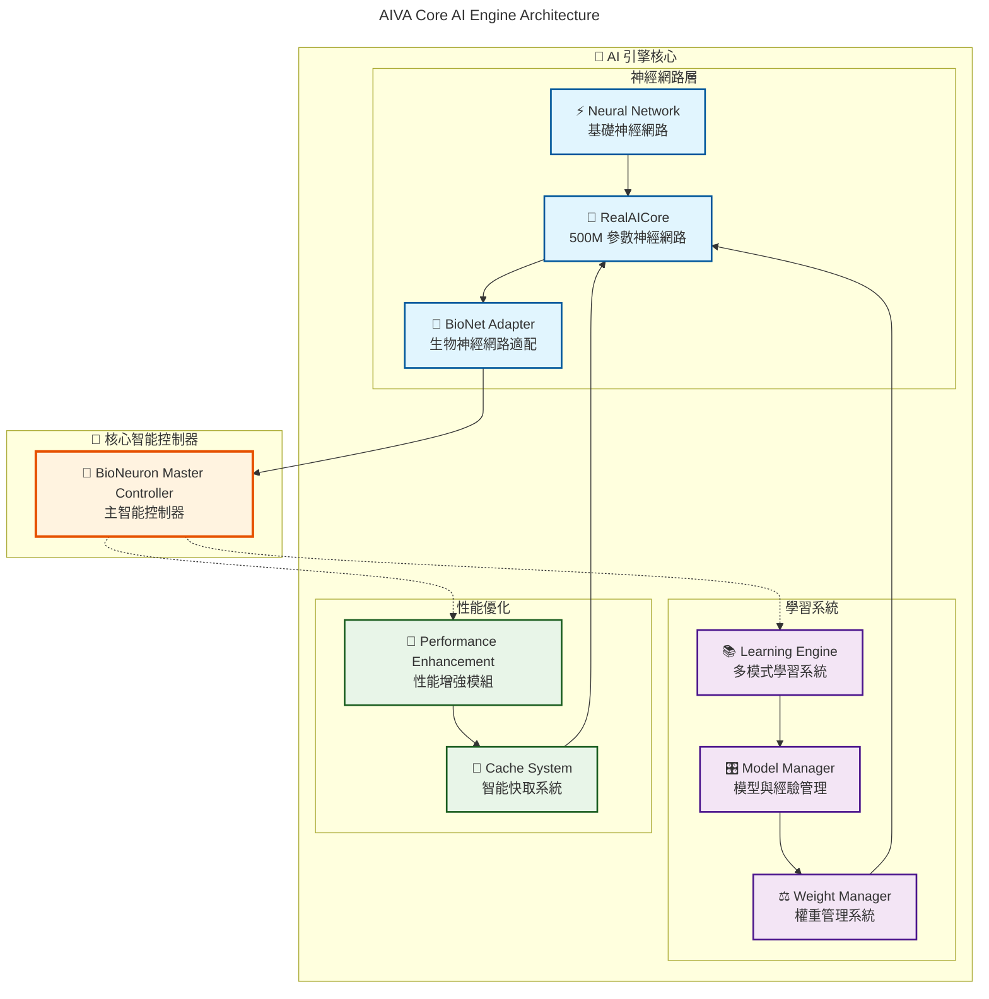
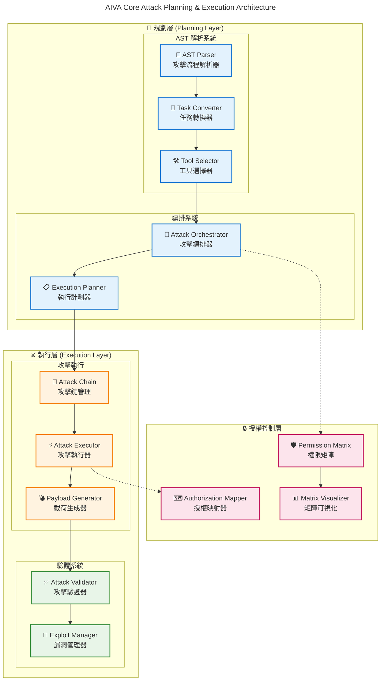
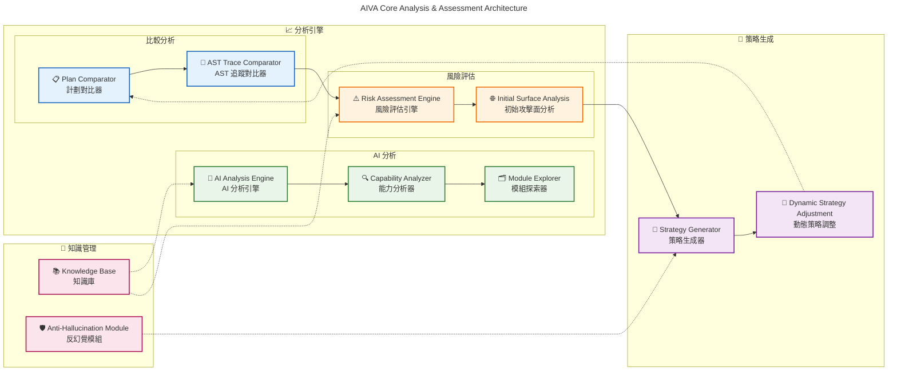
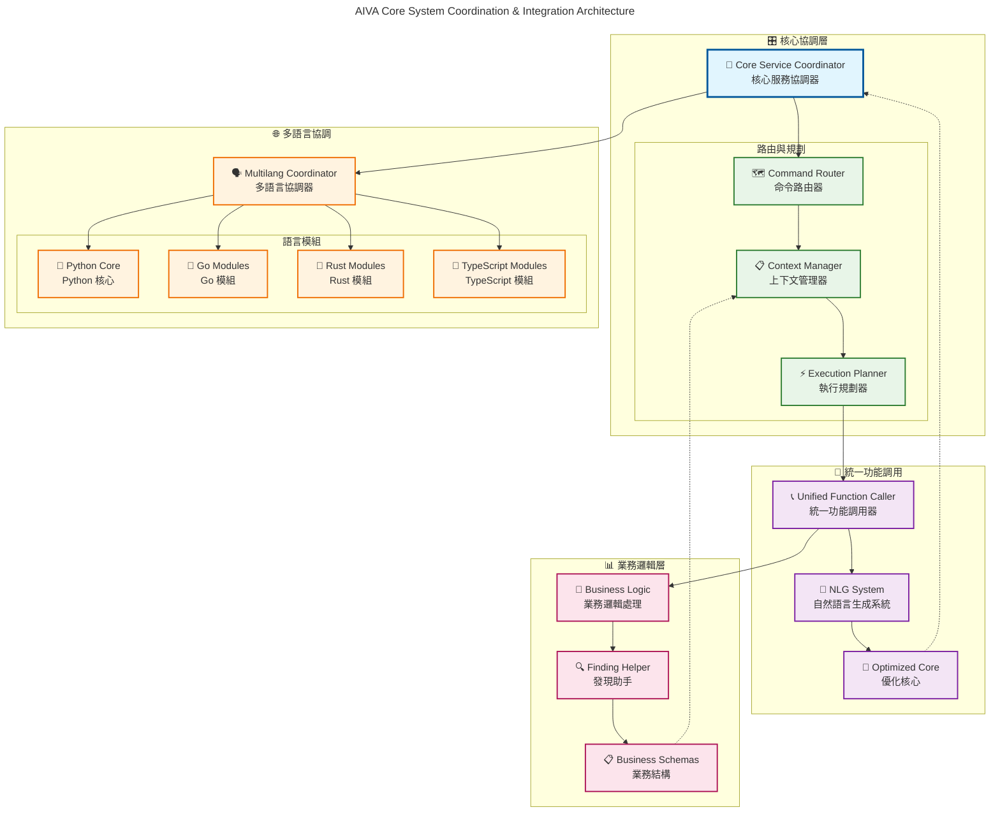
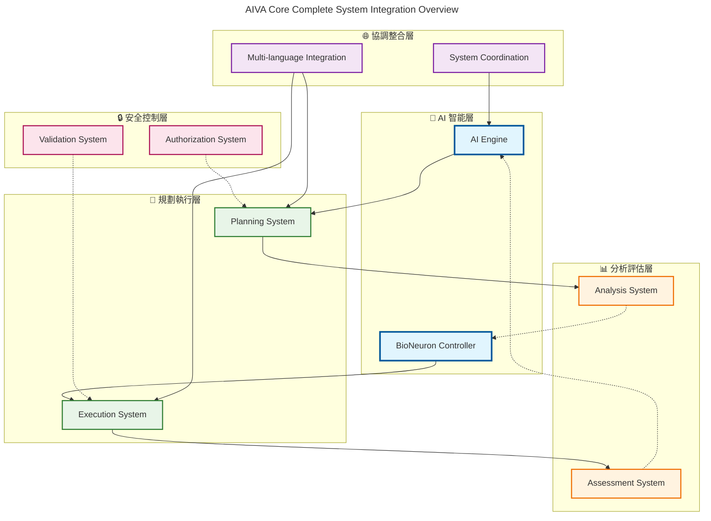

# AIVA Core AI 功能架構組合圖

**生成時間**: 2025年11月14日  
**目的**: 展示 AIVA Core 各 AI 模組的功能架構和關聯性  

---

## 🧠 AI 引擎核心架構圖

---

## ⚔️ 攻擊規劃與執行架構圖

---

## 📊 分析與評估系統架構圖

---

## 🔄 系統協調與整合架構圖

---

## 📋 完整系統整合總覽圖

---

**說明**: 這些組合圖展示了 AIVA Core 各 AI 模組的完整功能架構，從底層神經網路到高層業務邏輯的完整技術棧，體現了 AIVA 作為 AI 驅動安全測試平台的核心能力。