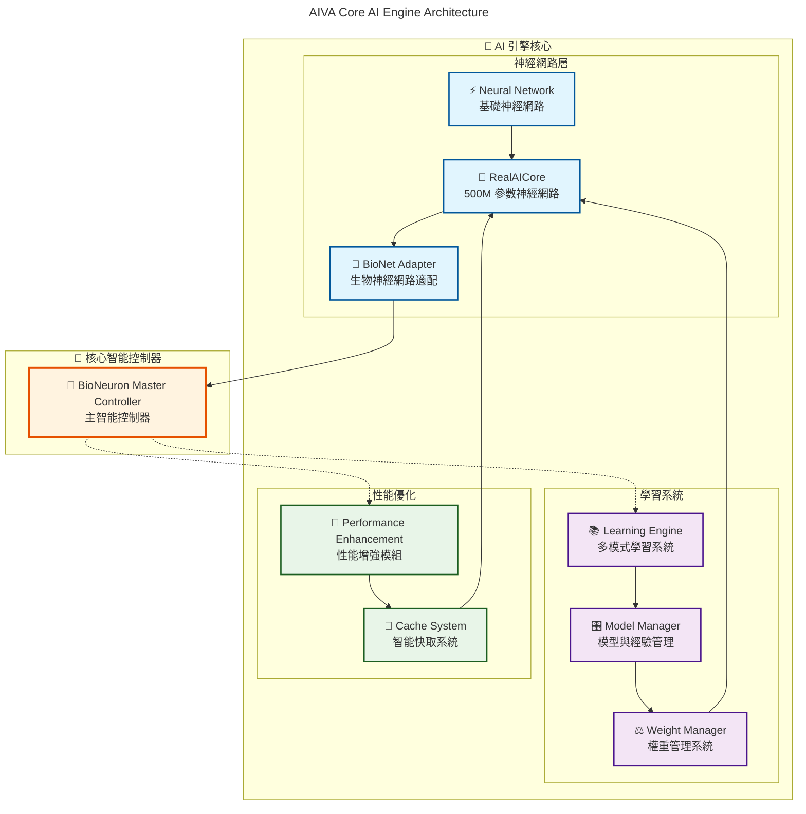
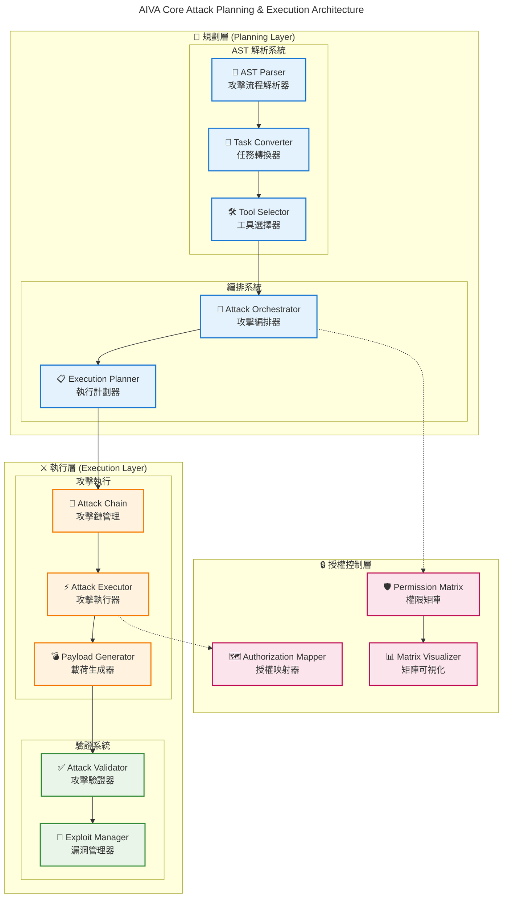
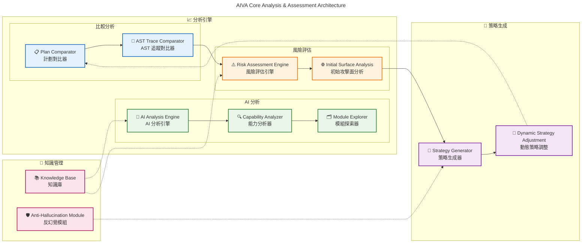
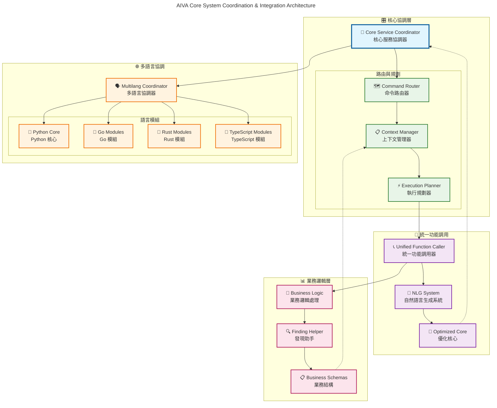
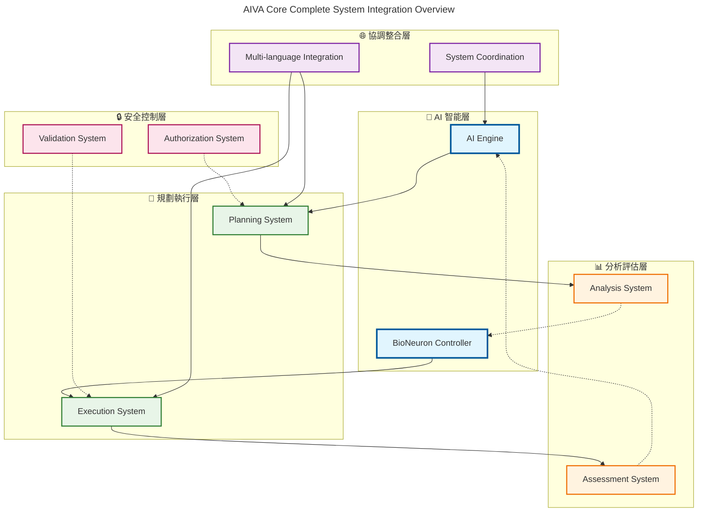

# AIVA Core AI 功能架構組合圖

## 📑 目錄

- [🧠 AI 引擎核心架構圖](#ai-引擎核心架構圖)
- [⚔️ 攻擊規劃與執行架構圖](#攻擊規劃與執行架構圖)
- [📊 分析與評估系統架構圖](#分析與評估系統架構圖)
- [🔄 系統協調與整合架構圖](#系統協調與整合架構圖)
- [📋 完整系統整合總覽圖](#完整系統整合總覽圖)

---
---
---

## 🧠 AI 引擎核心架構圖

```mermaid
---
title: AIVA Core AI Engine Architecture
---
flowchart TB
    subgraph "🎯 AI 引擎核心"
        direction TB
        
        subgraph "神經網路層"
            RealCore["🧠 RealAICore<br/>500M 參數神經網路"]
            BioNet["🔗 BioNet Adapter<br/>生物神經網路適配"]
            NeuralNet["⚡ Neural Network<br/>基礎神經網路"]
        end
        
        subgraph "學習系統"
            LearningEngine["📚 Learning Engine<br/>多模式學習系統"]
            ModelManager["🎛️ Model Manager<br/>模型與經驗管理"]
            WeightManager["⚖️ Weight Manager<br/>權重管理系統"]
        end
        
        subgraph "性能優化"
            PerfEnhance["🚀 Performance Enhancement<br/>性能增強模組"]
            CacheSystem["💾 Cache System<br/>智能快取系統"]
        end
    end
    
    subgraph "🎯 核心智能控制器"
        BioMaster["🤖 BioNeuron Master Controller<br/>主智能控制器"]
    end
    
    %% 連接關係
    RealCore --> BioNet
    BioNet --> BioMaster
    NeuralNet --> RealCore
    
    LearningEngine --> ModelManager
    ModelManager --> WeightManager
    WeightManager --> RealCore
    
    PerfEnhance --> CacheSystem
    CacheSystem --> RealCore
    
    BioMaster -.-> LearningEngine
    BioMaster -.-> PerfEnhance
    
    %% 樣式
    classDef coreAI fill:#e1f5fe,stroke:#01579b,stroke-width:2px
    classDef learning fill:#f3e5f5,stroke:#4a148c,stroke-width:2px
    classDef performance fill:#e8f5e8,stroke:#1b5e20,stroke-width:2px
    classDef controller fill:#fff3e0,stroke:#e65100,stroke-width:3px
    
    class RealCore,BioNet,NeuralNet coreAI
    class LearningEngine,ModelManager,WeightManager learning
    class PerfEnhance,CacheSystem performance
    class BioMaster controller
```

---

## ⚔️ 攻擊規劃與執行架構圖

```mermaid
---
title: AIVA Core Attack Planning & Execution Architecture
---
flowchart TD
    subgraph "🎯 規劃層 (Planning Layer)"
        direction TB
        
        subgraph "AST 解析系統"
            ASTParser["📝 AST Parser<br/>攻擊流程解析器"]
            TaskConverter["🔄 Task Converter<br/>任務轉換器"]
            ToolSelector["🛠️ Tool Selector<br/>工具選擇器"]
        end
        
        subgraph "編排系統"
            Orchestrator["🎼 Attack Orchestrator<br/>攻擊編排器"]
            ExecutionPlanner["📋 Execution Planner<br/>執行計劃器"]
        end
    end
    
    subgraph "⚔️ 執行層 (Execution Layer)"
        direction TB
        
        subgraph "攻擊執行"
            AttackChain["🔗 Attack Chain<br/>攻擊鏈管理"]
            AttackExecutor["⚡ Attack Executor<br/>攻擊執行器"]
            PayloadGen["💣 Payload Generator<br/>載荷生成器"]
        end
        
        subgraph "驗證系統"
            Validator["✅ Attack Validator<br/>攻擊驗證器"]
            ExploitManager["🎯 Exploit Manager<br/>漏洞管理器"]
        end
    end
    
    subgraph "🔒 授權控制層"
        direction LR
        PermissionMatrix["🛡️ Permission Matrix<br/>權限矩陣"]
        AuthzMapper["🗺️ Authorization Mapper<br/>授權映射器"]
        MatrixViz["📊 Matrix Visualizer<br/>矩陣可視化"]
    end
    
    %% 資料流
    ASTParser --> TaskConverter
    TaskConverter --> ToolSelector
    ToolSelector --> Orchestrator
    
    Orchestrator --> ExecutionPlanner
    ExecutionPlanner --> AttackChain
    
    AttackChain --> AttackExecutor
    AttackExecutor --> PayloadGen
    PayloadGen --> Validator
    
    Validator --> ExploitManager
    
    %% 授權控制
    Orchestrator -.-> PermissionMatrix
    AttackExecutor -.-> AuthzMapper
    PermissionMatrix --> MatrixViz
    
    %% 樣式
    classDef planning fill:#e3f2fd,stroke:#1976d2,stroke-width:2px
    classDef execution fill:#fff3e0,stroke:#f57c00,stroke-width:2px
    classDef validation fill:#e8f5e8,stroke:#388e3c,stroke-width:2px
    classDef security fill:#fce4ec,stroke:#c2185b,stroke-width:2px
    
    class ASTParser,TaskConverter,ToolSelector,Orchestrator,ExecutionPlanner planning
    class AttackChain,AttackExecutor,PayloadGen execution
    class Validator,ExploitManager validation
    class PermissionMatrix,AuthzMapper,MatrixViz security
```

---

## 📊 分析與評估系統架構圖

```mermaid
---
title: AIVA Core Analysis & Assessment Architecture
---
flowchart LR
    subgraph "📈 分析引擎"
        direction TB
        
        subgraph "AI 分析"
            AIAnalysisEngine["🤖 AI Analysis Engine<br/>AI 分析引擎"]
            CapabilityAnalyzer["🔍 Capability Analyzer<br/>能力分析器"]
            ModuleExplorer["🗂️ Module Explorer<br/>模組探索器"]
        end
        
        subgraph "比較分析"
            PlanComparator["📋 Plan Comparator<br/>計劃對比器"]
            TraceComparator["🔄 AST Trace Comparator<br/>AST 追蹤對比器"]
        end
        
        subgraph "風險評估"
            RiskEngine["⚠️ Risk Assessment Engine<br/>風險評估引擎"]
            SurfaceAnalysis["🌐 Initial Surface Analysis<br/>初始攻擊面分析"]
        end
    end
    
    subgraph "🎯 策略生成"
        direction TB
        
        StrategyGen["📝 Strategy Generator<br/>策略生成器"]
        DynamicAdjust["🔄 Dynamic Strategy Adjustment<br/>動態策略調整"]
    end
    
    subgraph "🧠 知識管理"
        direction TB
        
        KnowledgeBase["📚 Knowledge Base<br/>知識庫"]
        AntiHallucination["🛡️ Anti-Hallucination Module<br/>反幻覺模組"]
    end
    
    %% 資料流向
    AIAnalysisEngine --> CapabilityAnalyzer
    CapabilityAnalyzer --> ModuleExplorer
    
    PlanComparator --> TraceComparator
    TraceComparator --> RiskEngine
    
    RiskEngine --> SurfaceAnalysis
    SurfaceAnalysis --> StrategyGen
    
    StrategyGen --> DynamicAdjust
    
    %% 知識支援
    KnowledgeBase -.-> AIAnalysisEngine
    KnowledgeBase -.-> RiskEngine
    AntiHallucination -.-> StrategyGen
    
    %% 回饋循環
    DynamicAdjust -.-> PlanComparator
    
    %% 樣式
    classDef aiAnalysis fill:#e8f5e8,stroke:#2e7d32,stroke-width:2px
    classDef comparison fill:#e3f2fd,stroke:#1565c0,stroke-width:2px
    classDef risk fill:#fff3e0,stroke:#ef6c00,stroke-width:2px
    classDef strategy fill:#f3e5f5,stroke:#7b1fa2,stroke-width:2px
    classDef knowledge fill:#fce4ec,stroke:#ad1457,stroke-width:2px
    
    class AIAnalysisEngine,CapabilityAnalyzer,ModuleExplorer aiAnalysis
    class PlanComparator,TraceComparator comparison
    class RiskEngine,SurfaceAnalysis risk
    class StrategyGen,DynamicAdjust strategy
    class KnowledgeBase,AntiHallucination knowledge
```

---

## 🔄 系統協調與整合架構圖

```mermaid
---
title: AIVA Core System Coordination & Integration Architecture
---
flowchart TD
    subgraph "🎛️ 核心協調層"
        direction TB
        
        CoreCoordinator["🎼 Core Service Coordinator<br/>核心服務協調器"]
        
        subgraph "路由與規劃"
            CommandRouter["🗺️ Command Router<br/>命令路由器"]
            ContextManager["📋 Context Manager<br/>上下文管理器"]
            ExecutionPlanner["⚡ Execution Planner<br/>執行規劃器"]
        end
    end
    
    subgraph "🌐 多語言協調"
        direction LR
        
        MultilangCoord["🗣️ Multilang Coordinator<br/>多語言協調器"]
        
        subgraph "語言模組"
            PythonCore["🐍 Python Core<br/>Python 核心"]
            GoModules["🔷 Go Modules<br/>Go 模組"]
            RustModules["🦀 Rust Modules<br/>Rust 模組"]
            TSModules["📘 TypeScript Modules<br/>TypeScript 模組"]
        end
    end
    
    subgraph "🎯 統一功能調用"
        direction TB
        
        UnifiedCaller["📞 Unified Function Caller<br/>統一功能調用器"]
        NLGSystem["💬 NLG System<br/>自然語言生成系統"]
        OptimizedCore["🚀 Optimized Core<br/>優化核心"]
    end
    
    subgraph "📊 業務邏輯層"
        direction LR
        
        BusinessLogic["💼 Business Logic<br/>業務邏輯處理"]
        FindingHelper["🔍 Finding Helper<br/>發現助手"]
        BusinessSchemas["📋 Business Schemas<br/>業務結構"]
    end
    
    %% 主要控制流
    CoreCoordinator --> CommandRouter
    CommandRouter --> ContextManager
    ContextManager --> ExecutionPlanner
    
    %% 多語言協調
    CoreCoordinator --> MultilangCoord
    MultilangCoord --> PythonCore
    MultilangCoord --> GoModules
    MultilangCoord --> RustModules
    MultilangCoord --> TSModules
    
    %% 統一調用
    ExecutionPlanner --> UnifiedCaller
    UnifiedCaller --> NLGSystem
    NLGSystem --> OptimizedCore
    
    %% 業務邏輯
    UnifiedCaller --> BusinessLogic
    BusinessLogic --> FindingHelper
    FindingHelper --> BusinessSchemas
    
    %% 回饋與監控
    OptimizedCore -.-> CoreCoordinator
    BusinessSchemas -.-> ContextManager
    
    %% 樣式
    classDef coordination fill:#e1f5fe,stroke:#01579b,stroke-width:3px
    classDef routing fill:#e8f5e8,stroke:#2e7d32,stroke-width:2px
    classDef multilang fill:#fff3e0,stroke:#ef6c00,stroke-width:2px
    classDef unified fill:#f3e5f5,stroke:#7b1fa2,stroke-width:2px
    classDef business fill:#fce4ec,stroke:#ad1457,stroke-width:2px
    
    class CoreCoordinator coordination
    class CommandRouter,ContextManager,ExecutionPlanner routing
    class MultilangCoord,PythonCore,GoModules,RustModules,TSModules multilang
    class UnifiedCaller,NLGSystem,OptimizedCore unified
    class BusinessLogic,FindingHelper,BusinessSchemas business
```

---

## 📋 完整系統整合總覽圖

```mermaid
---
title: AIVA Core Complete System Integration Overview
---
flowchart TD
    subgraph "🧠 AI 智能層"
        AIEngine["AI Engine"]
        BioController["BioNeuron Controller"]
    end
    
    subgraph "🎯 規劃執行層"
        Planning["Planning System"]
        Execution["Execution System"]
    end
    
    subgraph "📊 分析評估層"
        Analysis["Analysis System"]
        Assessment["Assessment System"]
    end
    
    subgraph "🔒 安全控制層"
        Authorization["Authorization System"]
        Validation["Validation System"]
    end
    
    subgraph "🌐 協調整合層"
        Coordination["System Coordination"]
        Integration["Multi-language Integration"]
    end
    
    %% 主要控制流
    AIEngine --> Planning
    BioController --> Execution
    Planning --> Analysis
    Execution --> Assessment
    
    %% 安全控制
    Authorization -.-> Planning
    Validation -.-> Execution
    
    %% 系統協調
    Coordination --> AIEngine
    Integration --> Planning
    Integration --> Execution
    
    %% 回饋循環
    Assessment -.-> AIEngine
    Analysis -.-> BioController
    
    %% 樣式
    classDef ai fill:#e1f5fe,stroke:#01579b,stroke-width:3px
    classDef planning fill:#e8f5e8,stroke:#2e7d32,stroke-width:2px
    classDef analysis fill:#fff3e0,stroke:#ef6c00,stroke-width:2px
    classDef security fill:#fce4ec,stroke:#ad1457,stroke-width:2px
    classDef coordination fill:#f3e5f5,stroke:#7b1fa2,stroke-width:2px
    
    class AIEngine,BioController ai
    class Planning,Execution planning
    class Analysis,Assessment analysis
    class Authorization,Validation security
    class Coordination,Integration coordination
```

---

**說明**: 這些組合圖展示了 AIVA Core 各 AI 模組的完整功能架構，從底層神經網路到高層業務邏輯的完整技術棧，體現了 AIVA 作為 AI 驅動安全測試平台的核心能力。