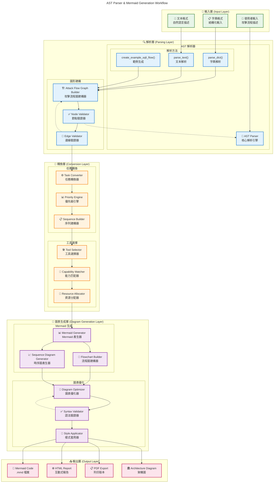

## 🎯 AST 解析與 Mermaid 流程圖生成詳細架構

```mermaid
---
title: AST Parser & Mermaid Generation Workflow
---
flowchart TD
    subgraph "📝 輸入層 (Input Layer)"
        direction TB
        
        UserInput["👤 使用者輸入<br/>攻擊流程描述"]
        DictInput["📋 字典格式<br/>結構化輸入"]
        TextInput["📄 文本格式<br/>自然語言描述"]
    end
    
    subgraph "🔍 解析層 (Parsing Layer)"
        direction TB
        
        subgraph "AST 解析器"
            ASTParser["🧠 AST Parser<br/>核心解析引擎"]
            
            subgraph "解析方法"
                ParseDict["parse_dict()<br/>字典解析"]
                ParseText["parse_text()<br/>文本解析"] 
                CreateExample["create_example_sqli_flow()<br/>範例生成"]
            end
        end
        
        subgraph "圖形建構"
            GraphBuilder["🏗️ Attack Flow Graph Builder<br/>攻擊流程圖建構器"]
            NodeValidator["✅ Node Validator<br/>節點驗證器"]
            EdgeValidator["🔗 Edge Validator<br/>邊緣驗證器"]
        end
    end
    
    subgraph "🔄 轉換層 (Conversion Layer)"
        direction TB
        
        subgraph "任務轉換"
            TaskConverter["⚙️ Task Converter<br/>任務轉換器"]
            PriorityEngine["📊 Priority Engine<br/>優先級引擎"]
            SequenceBuilder["📋 Sequence Builder<br/>序列建構器"]
        end
        
        subgraph "工具選擇"
            ToolSelector["🛠️ Tool Selector<br/>工具選擇器"]
            CapabilityMatcher["🎯 Capability Matcher<br/>能力匹配器"]
            ResourceAllocator["💾 Resource Allocator<br/>資源分配器"]
        end
    end
    
    subgraph "🎨 圖表生成層 (Diagram Generation Layer)"
        direction TB
        
        subgraph "Mermaid 生成"
            MermaidGen["📊 Mermaid Generator<br/>Mermaid 產生器"]
            FlowchartBuilder["🌊 Flowchart Builder<br/>流程圖建構器"]
            SequenceDiagramGen["📈 Sequence Diagram Generator<br/>時序圖產生器"]
        end
        
        subgraph "圖表優化"
            DiagramOptimizer["🚀 Diagram Optimizer<br/>圖表優化器"]
            SyntaxValidator["✅ Syntax Validator<br/>語法驗證器"]
            StyleApplicator["🎨 Style Applicator<br/>樣式套用器"]
        end
    end
    
    subgraph "📤 輸出層 (Output Layer)"
        direction LR
        
        MermaidCode["📄 Mermaid Code<br/>.mmd 檔案"]
        HTMLReport["🌐 HTML Report<br/>互動式報告"]
        PDFExport["📋 PDF Export<br/>列印版本"]
        ArchDiagram["🏛️ Architecture Diagram<br/>架構圖"]
    end
    
    %% 主要資料流
    UserInput --> ASTParser
    DictInput --> ParseDict
    TextInput --> ParseText
    
    ParseDict --> GraphBuilder
    ParseText --> GraphBuilder
    CreateExample --> GraphBuilder
    
    GraphBuilder --> NodeValidator
    NodeValidator --> EdgeValidator
    EdgeValidator --> TaskConverter
    
    TaskConverter --> PriorityEngine
    PriorityEngine --> SequenceBuilder
    SequenceBuilder --> ToolSelector
    
    ToolSelector --> CapabilityMatcher
    CapabilityMatcher --> ResourceAllocator
    ResourceAllocator --> MermaidGen
    
    MermaidGen --> FlowchartBuilder
    MermaidGen --> SequenceDiagramGen
    
    FlowchartBuilder --> DiagramOptimizer
    SequenceDiagramGen --> DiagramOptimizer
    
    DiagramOptimizer --> SyntaxValidator
    SyntaxValidator --> StyleApplicator
    
    StyleApplicator --> MermaidCode
    StyleApplicator --> HTMLReport
    StyleApplicator --> PDFExport
    StyleApplicator --> ArchDiagram
    
    %% 驗證回饋
    SyntaxValidator -.-> DiagramOptimizer
    NodeValidator -.-> ASTParser
    EdgeValidator -.-> GraphBuilder
    
    %% 樣式定義
    classDef input fill:#e8f5e8,stroke:#2e7d32,stroke-width:2px
    classDef parsing fill:#e3f2fd,stroke:#1976d2,stroke-width:2px
    classDef conversion fill:#fff3e0,stroke:#f57c00,stroke-width:2px
    classDef generation fill:#f3e5f5,stroke:#7b1fa2,stroke-width:2px
    classDef output fill:#fce4ec,stroke:#c2185b,stroke-width:2px
    
    class UserInput,DictInput,TextInput input
    class ASTParser,ParseDict,ParseText,CreateExample,GraphBuilder,NodeValidator,EdgeValidator parsing
    class TaskConverter,PriorityEngine,SequenceBuilder,ToolSelector,CapabilityMatcher,ResourceAllocator conversion
    class MermaidGen,FlowchartBuilder,SequenceDiagramGen,DiagramOptimizer,SyntaxValidator,StyleApplicator generation
    class MermaidCode,HTMLReport,PDFExport,ArchDiagram output
```
