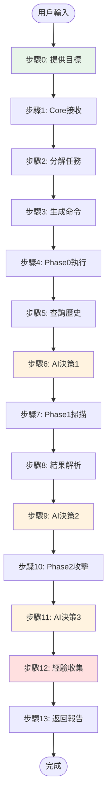

# AIVA 雙閉環系統操作指南

**創建日期**: 2026年1月10日  
**檢查日期**: 2026年1月10日  
**版本**: v1.0  
**狀態**: ✅ 基於實際架構編寫，路徑已驗證  
**目標用戶**: AIVA 系統操作者、開發者

---

## 📋 目錄

- [系統概述](#系統概述)
- [架構現狀](#架構現狀)
- [操作流程](#操作流程)
  - [步驟 0: 用戶提供目標](#步驟-0-用戶提供目標)
  - [步驟 1-2: 任務接收與規劃](#步驟-1-2-任務接收與規劃)
  - [步驟 3-13: 完整執行流程](#步驟-3-13-完整執行流程)
- [內部閉環操作](#內部閉環操作)
- [外部閉環操作](#外部閉環操作)
- [實際路徑參考](#實際路徑參考)
- [常見問題](#常見問題)

---

## 系統概述

AIVA 雙閉環系統是一個 AI 自我優化架構，包含：

- **內部閉環** (Know Thyself): 系統自我認知與能力分析
- **外部閉環** (Learn from Battle): 實戰執行與經驗學習

```
┌──────────────────────────────────────────────────────┐
│              AIVA 雙閉環系統架構                        │
├──────────────────────────────────────────────────────┤
│                                                      │
│  ┌─────────────┐              ┌─────────────┐      │
│  │ 內部閉環     │              │ 外部閉環     │      │
│  │ (對內探索)   │◄────┐  ┌────►│ (對外執行)   │      │
│  └─────────────┘     │  │     └─────────────┘      │
│         │            │  │            │              │
│         ▼            │  │            ▼              │
│  ┌──────────────┐   │  │   ┌──────────────┐       │
│  │ 能力分析     │   │  │   │ 任務執行     │       │
│  │ 代碼品質     │   │  │   │ 漏洞掃描     │       │
│  │ CLI生成      │   │  │   │ 攻擊測試     │       │
│  └──────────────┘   │  │   └──────────────┘       │
│         │            │  │            │              │
│         └────────────┴──┴────────────┘              │
│                      │                              │
│                      ▼                              │
│           ┌────────────────────┐                    │
│           │  AI 自我優化決策    │                    │
│           │  • 能力提升         │                    │
│           │  • 策略調整         │                    │
│           │  • 持續學習         │                    │
│           └────────────────────┘                    │
└──────────────────────────────────────────────────────┘
```

---

## 架構現狀

### 核心模組位置 (2026-01-10 驗證)

```
services/core/aiva_core/
├── cognitive_core/                    # 認知核心
│   ├── internal_loop_connector.py    # ✅ 內部閉環連接器
│   ├── external_loop_connector.py    # ✅ 外部閉環連接器
│   ├── decision/                      # AI 決策系統
│   ├── learning_system/               # 學習系統
│   └── rag/                          # RAG 知識檢索
│
├── internal_exploration/              # 內部探索
│   ├── python_tools/                 # Python 代碼分析
│   │   ├── aiva_flow_analyzer.py    # 流程分析器
│   │   ├── aiva_flow_classifier.py  # 流程分類器
│   │   └── aiva_cli_implementation.py # CLI 生成器
│   ├── typescript_tools/             # TypeScript 工具
│   ├── go_tools/                     # Go 工具
│   └── rust_tools/                   # Rust 工具
│
├── task_planning/                     # 任務規劃
│   ├── commander/                    # AI 指揮官
│   └── coordinators/                 # 任務協調器
│
└── service_backbone/                  # 服務骨幹
    └── api/                          # API 網關
        └── gateway.py                # 命令中心路由
```

### 數據存儲位置

```
services/integration/data/internal_exploration/
├── latest_classification.json         # ✅ 最新能力分類 (v6)
└── analysis_history/
    └── v6/                           # ✅ 當前版本 (2026-01-10)
        ├── analysis_results.json     # 完整分析結果
        └── CLI_COMMANDS_REFERENCE.md # CLI 指令文檔
```

---

## 操作流程

### 步驟 0: 用戶提供目標

**操作方式**:

```bash
# 方式1: CLI 命令
aiva scan --target "http://example.com" --type full

# 方式2: API 調用
curl -X POST http://localhost:8000/api/v1/scan \
  -H "Content-Type: application/json" \
  -d '{"target": "http://example.com", "scan_type": "full"}'

# 方式3: Python 腳本
from services.core.aiva_core import AIVACore
aiva = AIVACore()
result = await aiva.scan("http://example.com")
```

**輸入格式**:
```python
{
    "target": "http://example.com",      # 目標 URL 或 IP
    "scan_type": "quick|deep|full",      # 掃描類型
    "constraints": {                      # 可選約束
        "timeout": 300,
        "max_depth": 3,
        "stealth_mode": False
    }
}
```

---

### 步驟 1-2: 任務接收與規劃

**執行流程**:

```python
# 1. 命令中心接收請求
# services/core/aiva_core/service_backbone/api/app.py
CommandCenter.route_command(user_input)

# 2. AI Commander 分析任務
# services/core/aiva_core/task_planning/commander/
AICommander.process_scan_command(user_input)
    ↓
# 3. 生成攻擊計劃
PlanBuilder.build_attack_plan(context)
    ↓
# 4. 選擇協調器
coordinator = select_coordinator(plan)
```

**輸出**: AttackPlan 物件包含執行步驟

---

### 步驟 3-13: 完整執行流程



**關鍵決策點**:

- **AI 決策 1** (步驟6): 決定掃描策略
  - 位置: `cognitive_core/decision/enhanced_decision_agent.py`
  - 方法: `decide_scan_strategy()`

- **AI 決策 2** (步驟9): 選擇攻擊目標
  - 位置: `cognitive_core/decision/enhanced_decision_agent.py`
  - 方法: `decide_phase2_targets()`

- **AI 決策 3** (步驟11): 評估結果
  - 位置: `cognitive_core/decision/enhanced_decision_agent.py`
  - 方法: `evaluate_phase2_results()`

---

## 內部閉環操作

### 目的

讓 AI 知道自己有哪些能力，如何優化這些能力。

### 執行方式

```bash
# 1. 觸發內部探索
cd services/core/aiva_core/internal_exploration
python aiva_exploration_pipeline.py

# 2. 查看分析結果
cat services/integration/data/internal_exploration/latest_classification.json

# 3. 注入到 RAG 知識庫
python -c "
from services.core.aiva_core.cognitive_core import InternalLoopConnector
connector = InternalLoopConnector()
await connector.sync_capabilities_to_rag()
"
```

### 數據流

```
1. 代碼探索
   └─> aiva_flow_analyzer.py (分析代碼流程)
       └─> aiva_flow_classifier.py (分類能力)
           └─> latest_classification.json (輸出結果)

2. 能力注入
   └─> InternalLoopConnector.sync_capabilities_to_rag()
       └─> cognitive_core/rag/knowledge_base (存儲)

3. CLI 生成
   └─> aiva_cli_implementation.py (生成命令)
       └─> CLI_COMMANDS_REFERENCE.md (文檔)
```

### 產出內容

**latest_classification.json** 包含:
- 能力分類 (CORE, SCAN, FEATURES, INTEGRATION, COMMON)
- 能力範圍 (GLOBAL, INTERNAL, PRIVATE)
- 可見性 (PUBLIC, PROTECTED, PRIVATE)
- 複雜度評估
- 使用示例

---

## 外部閉環操作

### 目的

從實戰中學習，優化攻擊策略和決策模型。

### 執行方式

```python
# 1. 執行攻擊任務 (自動觸發外部閉環)
from services.core.aiva_core import AIVACore

aiva = AIVACore()
result = await aiva.execute_attack({
    "target": "http://target.com",
    "attack_plan": attack_plan,
    "collect_experience": True  # 啟用經驗收集
})

# 2. 手動觸發外部閉環
from services.core.aiva_core.cognitive_core import ExternalLoopConnector

connector = ExternalLoopConnector()
await connector.process_execution_result(
    plan=attack_plan,
    trace=execution_trace
)
```

### 數據流

```
1. 任務執行
   └─> task_planning/executor (執行攻擊)
       └─> execution_trace (記錄軌跡)

2. 偏差分析
   └─> ExternalLoopConnector.process_execution_result()
       └─> learning_system/analysis/ast_trace_comparator.py
           └─> DeviationAnalysisResult (偏差記錄)

3. 模型訓練
   └─> learning_system/learning/model_trainer.py
       └─> neural/weight_manager.py (更新權重)

4. 策略優化
   └─> 反饋到 AI 決策模組
```

### 學習內容

- **成功經驗**: 哪些攻擊有效
- **失敗教訓**: 哪些策略無效
- **偏差分析**: 計劃 vs 實際執行
- **權重更新**: 調整決策模型

---

## 實際路徑參考

### 關鍵文件清單

```
✅ 已驗證存在的文件 (2026-01-10):

# 雙閉環連接器
services/core/aiva_core/cognitive_core/internal_loop_connector.py (2036行)
services/core/aiva_core/cognitive_core/external_loop_connector.py (447行)

# 內部探索工具
services/core/aiva_core/internal_exploration/python_tools/aiva_flow_analyzer.py
services/core/aiva_core/internal_exploration/python_tools/aiva_flow_classifier.py
services/core/aiva_core/internal_exploration/python_tools/aiva_cli_implementation.py
services/core/aiva_core/internal_exploration/python_tools/aiva_exploration_pipeline.py

# 決策系統
services/core/aiva_core/cognitive_core/decision/enhanced_decision_agent.py

# 學習系統
services/core/aiva_core/cognitive_core/learning_system/analysis/ast_trace_comparator.py
services/core/aiva_core/cognitive_core/learning_system/learning/model_trainer.py

# 數據存儲
services/integration/data/internal_exploration/latest_classification.json
services/integration/data/internal_exploration/analysis_history/v6/
```

### 配置文件

```bash
# 內部探索配置
services/core/aiva_core/internal_exploration/modules_config.json

# RAG 配置
services/core/aiva_core/cognitive_core/rag/config.py

# 學習系統配置
services/core/aiva_core/cognitive_core/learning_system/config.py
```

---

## 常見問題

### Q1: 如何啟動完整的雙閉環流程？

```bash
# 一鍵啟動 (如果有自動化腳本)
python scripts/start_dual_loop.py

# 分步啟動
# 1. 啟動內部閉環
python services/core/aiva_core/internal_exploration/aiva_exploration_pipeline.py

# 2. 執行掃描任務 (自動觸發外部閉環)
aiva scan --target "http://example.com"
```

### Q2: 如何查看內部閉環的分析結果？

```bash
# 查看最新分類結果
cat services/integration/data/internal_exploration/latest_classification.json | jq

# 查看 CLI 命令文檔
cat services/integration/data/internal_exploration/analysis_history/v6/CLI_COMMANDS_REFERENCE.md
```

### Q3: 如何驗證外部閉環是否正常工作？

```python
# 檢查偏差分析記錄
from services.core.aiva_core.cognitive_core import ExternalLoopConnector

connector = ExternalLoopConnector()
# 查看最近的偏差記錄
recent_deviations = connector.get_recent_deviations()
print(f"發現 {len(recent_deviations)} 個偏差記錄")
```

### Q4: 如何手動觸發能力同步到 RAG？

```python
from services.core.aiva_core.cognitive_core import InternalLoopConnector

connector = InternalLoopConnector()
result = await connector.sync_capabilities_to_rag()
print(f"同步完成: {result.synced_count} 個能力")
```

### Q5: 內部閉環多久執行一次？

- **自動模式**: 每次代碼變更後自動觸發
- **定期模式**: 每週執行一次 (可配置)
- **手動模式**: 隨時可以手動觸發

### Q6: 外部閉環如何收集經驗？

外部閉環在每次任務執行後自動收集：
- 執行計劃 (AttackPlan)
- 執行軌跡 (ExecutionTrace)
- 結果數據 (ScanResult)
- 偏差分析 (DeviationRecord)

這些數據用於：
- 優化 AI 決策模型
- 調整攻擊策略
- 改進能力編排

---

## 進階操作

### 自定義內部探索範圍

```python
# 只分析特定模組
from services.core.aiva_core.internal_exploration import ExplorationPipeline

pipeline = ExplorationPipeline()
result = await pipeline.analyze_specific_modules([
    "services/core",
    "services/features"
])
```

### 自定義學習參數

```python
# 調整模型訓練參數
from services.core.aiva_core.cognitive_core.learning_system import ModelTrainer

trainer = ModelTrainer(
    learning_rate=0.001,
    batch_size=32,
    epochs=10
)
```

### 查看系統健康狀態

```python
from services.core.aiva_core import AIVACore

aiva = AIVACore()
health = await aiva.get_system_health()

print(f"內部閉環狀態: {health['internal_loop']}")
print(f"外部閉環狀態: {health['external_loop']}")
print(f"RAG 狀態: {health['rag']}")
print(f"決策系統狀態: {health['decision']}")
```

---

## 參考資源

- **架構設計文檔**: `docs/core_architecture/AI_SELF_OPTIMIZATION_DUAL_LOOP_DESIGN.md`
- **13步驟流程**: `docs/core_architecture/13_STEPS_DATAFLOW_STATIC_ANALYSIS.md`
- **內部探索文檔**: `services/core/aiva_core/internal_exploration/README.md`
- **認知核心文檔**: `services/core/aiva_core/cognitive_core/README.md`

---

**最後更新**: 2026年1月10日  
**維護者**: AIVA Development Team  
**狀態**: ✅ 基於實際架構編寫，隨系統更新而更新
