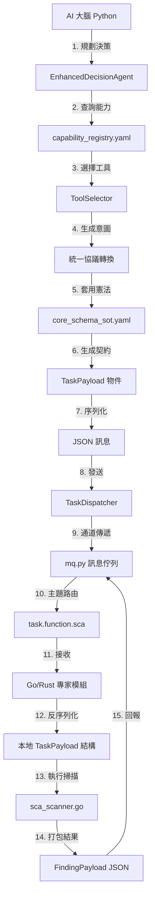

# AIVA 合約開發指南

## 📋 指南概述

本指南提供 AIVA 數據合約系統的完整開發說明，包括架構設計、開發規範、最佳實踐和實施指導。適用於所有 AIVA 開發人員，確保數據合約的一致性和可靠性。

> 🧠 **AIVA 的跨語言 AI 操作哲學**  
> AIVA 的 AI 之所以能夠「跨語言操作」，並非因為 AI (Python) 學會了 Go 或 Rust。相反，AIVA 從「第一性原理」出發，建立了一個基於 **模型上下文協議 (MCP)** 的先進架構——AI 和所有工具 (無論什麼語言) 都在統一協議下溝通。**AI 不必懂 Go，只需懂「協議」；Go 也不必懂 AI，只需懂「協議」。**

## 🎯 快速入門

### 1. 核心概念理解：MCP 架構的四個支柱

AIVA 合約系統基於 **模型上下文協議 (MCP)** 和 **統一數據標準** 理念，實現 AI 與跨語言工具的智能協作：

#### 🧠 支柱一：AI 規劃層 (Python)
- **EnhancedDecisionAgent**: AI 大腦進行策略規劃
- **ToolSelector**: 智能選擇最適合的專家模組
- **意圖生成**: 將高層決策轉化為具體任務意圖

#### 📜 支柱二：統一協議層 (Schema)
- **core_schema_sot.yaml**: 單一事實來源，定義跨語言契約
- **schema_codegen_tool.py**: 自動生成多語言綁定
- **契約翻譯**: 將 AI 意圖標準化為跨語言任務

#### 🌐 支柱三：通信通道層 (MQ)
- **TaskDispatcher**: 任務分發器
- **mq.py**: 跨語言訊息佇列通道
- **主題路由**: 基於能力的智能路由機制

#### ⚙️ 支柱四：專家執行層 (Go/Rust)
- **function_sca_go**: Go 語言 SCA 掃描專家
- **schemas.go**: 自動生成的 Go 合約綁定
- **結果回報**: 標準化結果返回機制

AIVA 合約系統通過 Pydantic v2 實現強類型數據驗證和跨語言互操作性：

```python
# 合約系統的核心原則
from services.aiva_common.schemas import FindingPayload, Authentication

# ✅ 標準化數據流程
def process_security_finding(raw_data: dict) -> FindingPayload:
    """使用標準合約處理安全發現"""
    # 1. 數據驗證 - 自動進行
    finding = FindingPayload(**raw_data)
    
    # 2. 類型安全 - 編譯時檢查
    vulnerability = finding.vulnerability
    
    # 3. 一致性保證 - 跨模組統一
    return finding
```

### 2. 基礎導入模式

```python
# Python 後端 - 標準導入方式
from services.aiva_common.schemas import (
    # 核心數據合約
    FindingPayload,         # 漏洞發現報告
    AivaMessage,           # 統一訊息格式
    Authentication,        # 認證資訊
    MessageHeader,         # 訊息標頭
    
    # API 標準格式
    APIResponse,           # 統一API響應
    ExecutionError,        # 錯誤處理
    
    # 業務領域合約  
    ScanScope,            # 掃描範圍
    AttackPlan,           # 攻擊計劃
    RiskAssessment        # 風險評估
)
```

```typescript
// TypeScript 前端 - 類型定義
import type { 
  Finding, 
  ScanRequest, 
  APIResponse,
  UserInfo,
  SecurityEvent 
} from '../contracts/aiva-web-contracts';

// 類型安全的API調用
async function submitScanRequest(request: ScanRequest): Promise<APIResponse<Finding[]>> {
  return await fetch('/api/scan/start', {
    method: 'POST',
    headers: { 'Content-Type': 'application/json' },
    body: JSON.stringify(request)
  }).then(res => res.json());
}
```

### 3. 開發環境驗證

```bash
# 檢查合約系統狀態
python -c "
from services.aiva_common.schemas import FindingPayload
print('✅ 合約系統可用')
print(f'📋 FindingPayload 字段數: {len(FindingPayload.model_fields)}')
"

# 驗證工具鏈
python tools/analyze_contract_coverage.py --quick-check
python tools/schema_compliance_validator.py --check-basic
```

## 🏗️ 合約架構設計

### AIVA 跨語言 MCP 工作原理詳解

#### 🔍 階段一：AI 大腦規劃 (Python)

```python
# 1. AI 決策：需要 SCA 掃描能力
class EnhancedDecisionAgent:
    def plan_security_assessment(self, target: str):
        # AI 分析目標，決定需要的能力
        required_capabilities = ["sca_scanning", "vulnerability_analysis"]
        
        # 2. 查詢能力註冊表
        tool = self.tool_selector.select_tool("sca_scanning")
        # tool = "function_sca_go" (從 capability_registry.yaml 獲得)
        
        # 3. 生成標準化意圖
        intent = {
            "action": "scan_dependencies",
            "target": target,
            "scan_type": "sca",
            "priority": "high"
        }
        
        return intent
```

#### ⚖️ 階段二：統一協議翻譯 (Schema)

```python
# 4. 套用「憲法」：統一標準轉換
class TaskContractGenerator:
    def generate_task_contract(self, intent: dict) -> TaskPayload:
        # 使用 core_schema_sot.yaml 定義的標準
        task = TaskPayload(
            task_id=generate_uuid(),
            task_type="function.sca",
            target_url=intent["target"],
            configuration=ScanConfiguration(**intent),
            # 完全符合跨語言協議規範
        )
        
        # 5. 生成語言無關的 JSON 契約
        json_contract = task.model_dump_json()
        return json_contract
```

#### 🌐 階段三：跨語言通道傳遞 (MQ)

```python
# 6. AI 發送任務 (Python 端完成)
class TaskDispatcher:
    async def dispatch_task(self, contract: str):
        # 透過訊息佇列發送到專家模組
        await self.mq.publish(
            topic="task.function.sca",  # 路由到 SCA 專家
            message=contract,
            headers={"source": "aiva_core", "version": "v1"}
        )
        # AI 工作結束 - 不需知道接收者是什麼語言
```

#### ⚙️ 階段四：專家模組執行 (Go/Rust)

```go
// 7. Go 專家接收 (Go 端)
type SCAScanner struct {
    MessageQueue *MQ
}

func (s *SCAScanner) ListenForTasks() {
    s.MessageQueue.Subscribe("task.function.sca", func(msg []byte) {
        // 8. 契約的魔力：完美理解 Python AI 的指令
        var task TaskPayload
        json.Unmarshal(msg, &task) // 使用自動生成的 schemas.go
        
        // 9. 執行專業掃描
        results := s.executeSCAScanning(task.TargetURL)
        
        // 10. 標準化結果回報
        finding := FindingPayload{
            FindingID:     generateUUID(),
            Vulnerability: results.ToVulnerability(),
            Confidence:    results.ConfidenceScore,
        }
        
        // 11. 回報給 AI (依然透過標準協議)
        s.MessageQueue.Publish("result.function.sca", finding.ToJSON())
    })
}
```

#### 🎯 關鍵洞察：協議的力量

**AI 不必懂 Go**：
- AI 只需要知道如何生成符合 `TaskPayload` 標準的 JSON
- AI 完全不關心誰來執行，用什麼語言執行

**Go 不必懂 AI**：
- Go 模組只需要知道如何解析 `TaskPayload` JSON
- Go 模組不知道指令來自 AI，還是人工系統

**統一協議是核心**：
- `core_schema_sot.yaml` 是「憲法」，定義所有跨語言契約
- `schema_codegen_tool.py` 自動生成各語言的綁定
- `mq.py` 提供語言無關的通信通道

### 分層架構模型

AIVA 採用基於 **模型上下文協議 (MCP)** 的統一合約架構，實現 AI 與跨語言工具的無縫協作：

```
📦 aiva_common.schemas/ (統一協議核心)
├── 🏛️ 基礎設施層 (Infrastructure Layer)
│   ├── base.py              # MessageHeader, Authentication, APIResponse
│   ├── messaging.py         # AivaMessage, AIVARequest, EventPayload  
│   ├── telemetry.py        # HeartbeatPayload, ErrorRecord, Metrics
│   └── validation.py       # 通用驗證器和規則
│
├── 🔒 安全領域層 (Security Domain Layer)  
│   ├── findings.py         # FindingPayload, Vulnerability, Evidence
│   ├── scanning.py         # ScanScope, ScanConfig, ScanResult
│   ├── ai_security.py      # AIVerificationRequest, AttackPlan
│   └── risk_assessment.py  # RiskAssessment, ThreatVector, AttackPath
│
├── 🌐 整合服務層 (Integration Service Layer)
│   ├── api_contracts.py    # REST API 標準合約
│   ├── async_contracts.py  # AsyncAPI 事件合約
│   ├── graphql_types.py    # GraphQL 類型定義
│   └── webhook_schemas.py  # Webhook 載荷格式
│
├── 🔄 任務執行層 (Task Execution Layer) ⭐ MCP 核心
│   ├── function_tasks.py   # FunctionTask, TaskConfig, TaskResult
│   ├── workflow_steps.py   # WorkflowStep, Pipeline, Orchestration
│   └── batch_operations.py # BatchJob, BulkOperation, QueuedTask
│
├── 📊 資產管理層 (Asset Management Layer)
│   ├── asset_lifecycle.py  # AssetLifecycle, AssetMetadata
│   ├── easm_integration.py # EASMAsset, ExternalAsset, AssetDiscovery
│   └── inventory_sync.py   # InventoryItem, SyncStatus, AssetUpdate
│
└── 🧠 威脅情報層 (Threat Intelligence Layer)
    ├── stix_taxii.py       # STIX/TAXII 標準格式
    ├── iocs.py            # 威脅指標 (IOCs)
    ├── threat_feeds.py    # 威脅情報來源
    └── correlation.py     # 關聯分析結果
```

#### 🔄 AIVA 跨語言 MCP 工作流程



### 合約繼承體系

```python
# 基礎合約定義
class AIVABaseContract(BaseModel):
    """所有 AIVA 合約的基礎類"""
    
    # 通用元數據
    schema_version: str = Field(default="1.0", description="合約架構版本")
    created_at: datetime = Field(
        default_factory=lambda: datetime.now(UTC),
        description="創建時間戳"
    )
    trace_id: Optional[str] = Field(None, description="分散式追蹤ID")
    
    # 標準配置
    model_config = ConfigDict(
        validate_assignment=True,
        use_enum_values=True,
        extra='forbid'  # 禁止額外字段
    )

# 領域特定基礎類
class SecurityContract(AIVABaseContract):
    """安全領域合約基礎類"""
    
    confidence_level: float = Field(
        ge=0.0, le=1.0, 
        description="置信度 (0.0-1.0)"
    )
    classification: str = Field(description="數據分類標籤")

class TaskContract(AIVABaseContract):
    """任務執行合約基礎類"""
    
    task_id: str = Field(description="任務唯一識別碼")
    priority: int = Field(default=5, ge=1, le=10, description="優先級")
    timeout_seconds: Optional[int] = Field(None, description="超時設置")
```

### 命名約定和標準

```python
# ✅ 推薦的命名模式
class VulnerabilityPayload(BaseModel):     # 數據載荷 - Payload 後綴
class ScanStartRequest(BaseModel):         # 請求消息 - Request 後綴  
class AuthenticationResponse(BaseModel):   # 響應消息 - Response 後綴
class SecurityEvent(BaseModel):            # 事件 - Event 後綴
class UserProfile(BaseModel):              # 實體對象 - 名詞
class NetworkConfiguration(BaseModel):     # 配置 - Configuration 後綴

# ❌ 避免的命名模式
class VulnData(BaseModel):                 # 過於簡化
class ScanStuff(BaseModel):                # 語義不明
class APIThing(BaseModel):                 # 缺乏描述性
class TestModel123(BaseModel):             # 測試專用名稱
```

## 🛠️ 高階開發實踐

### 1. 進階合約定義

```python
from datetime import UTC, datetime
from typing import Optional, Literal, Union, Annotated
from pydantic import BaseModel, Field, field_validator, model_validator
from enum import Enum

class SeverityLevel(str, Enum):
    """安全威脅嚴重程度枚舉"""
    CRITICAL = "critical"
    HIGH = "high" 
    MEDIUM = "medium"
    LOW = "low"
    INFO = "info"

class AdvancedSecurityFinding(SecurityContract):
    """進階安全發現合約 - 展示最佳實踐"""
    
    # 唯一識別
    finding_id: str = Field(
        description="發現唯一識別碼",
        pattern=r"^finding_[a-f0-9]{8}$"  # 格式驗證
    )
    
    # 核心屬性
    title: Annotated[str, Field(
        min_length=5, 
        max_length=200,
        description="發現標題，簡潔描述威脅"
    )]
    
    severity: SeverityLevel = Field(description="威脅嚴重程度")
    
    # 條件字段 - 根據嚴重程度要求不同
    mitigation_deadline: Optional[datetime] = Field(
        None, 
        description="緩解截止時間 (高/極高威脅必填)"
    )
    
    # 複合驗證
    affected_assets: list[str] = Field(
        min_length=1,
        description="受影響的資產清單"
    )
    
    # 自訂驗證器
    @field_validator('finding_id')
    @classmethod
    def validate_finding_id_format(cls, v: str) -> str:
        """驗證發現ID格式"""
        if not v.startswith('finding_'):
            raise ValueError("發現ID必須以 'finding_' 開頭")
        return v.lower()
    
    @model_validator(mode='after')
    def validate_deadline_for_high_severity(self) -> 'AdvancedSecurityFinding':
        """高嚴重程度發現必須設置緩解截止時間"""
        if self.severity in [SeverityLevel.CRITICAL, SeverityLevel.HIGH]:
            if not self.mitigation_deadline:
                raise ValueError(f"{self.severity} 威脅必須設置緩解截止時間")
        return self
    
    # 計算屬性
    @property
    def is_urgent(self) -> bool:
        """判斷是否為緊急威脅"""
        if not self.mitigation_deadline:
            return False
        return (self.mitigation_deadline - datetime.now(UTC)).days <= 1
    
    # JSON Schema 擴展
    model_config = ConfigDict(
        json_schema_extra={
            "examples": [
                {
                    "finding_id": "finding_a1b2c3d4",
                    "title": "SQL注入漏洞 - 用戶登錄端點",
                    "severity": "high",
                    "confidence_level": 0.95,
                    "classification": "public",
                    "mitigation_deadline": "2025-11-03T00:00:00Z",
                    "affected_assets": ["app.example.com", "api.example.com"]
                }
            ]
        }
    )
```

### 2. 響應式合約模式

```python
# 靈活的API響應格式
from typing import TypeVar, Generic

T = TypeVar('T')

class PaginatedResponse(APIResponse[list[T]], Generic[T]):
    """分頁響應合約模板"""
    
    # 分頁元數據
    page: int = Field(ge=1, description="當前頁碼")
    page_size: int = Field(ge=1, le=100, description="每頁數量")
    total_count: int = Field(ge=0, description="總記錄數")
    total_pages: int = Field(ge=0, description="總頁數")
    
    # 導航鏈接
    has_next: bool = Field(description="是否有下一頁")
    has_previous: bool = Field(description="是否有上一頁")
    
    @model_validator(mode='after') 
    def calculate_pagination_flags(self) -> 'PaginatedResponse[T]':
        """計算分頁標誌"""
        self.total_pages = (self.total_count + self.page_size - 1) // self.page_size
        self.has_next = self.page < self.total_pages
        self.has_previous = self.page > 1
        return self

# 使用範例
FindingListResponse = PaginatedResponse[AdvancedSecurityFinding]
UserListResponse = PaginatedResponse[UserProfile]
```

### 3. 事件驅動合約

```python
class SecurityEventPayload(EventContract):
    """安全事件載荷 - 事件驅動架構"""
    
    # 事件元數據
    event_type: Literal["vulnerability_detected", "scan_completed", "threat_mitigated"]
    event_source: str = Field(description="事件來源服務")
    correlation_id: str = Field(description="事件關聯ID")
    
    # 事件載荷 - 使用Union支持多種類型
    payload: Union[
        AdvancedSecurityFinding,  # 漏洞發現事件
        ScanCompletionData,       # 掃描完成事件  
        ThreatMitigationData      # 威脅緩解事件
    ] = Field(discriminator='event_type')  # 判別聯合類型
    
    # 事件路由信息
    routing_key: str = Field(description="消息隊列路由鍵")
    delivery_count: int = Field(default=1, description="投遞次數")
    
    @field_validator('routing_key')
    @classmethod
    def generate_routing_key(cls, v: str, info) -> str:
        """自動生成路由鍵"""
        if not v and 'event_type' in info.data:
            return f"security.{info.data['event_type']}"
        return v
```

## 🔧 工具鏈深度整合

### 1. 合約生成和維護工具

```bash
# 完整的合約工具鏈操作
#!/bin/bash

echo "🔧 AIVA 合約工具鏈執行"

# 1. 驗證合約定義
echo "📋 驗證合約定義..."
python tools/schema_compliance_validator.py --strict --report

# 2. 生成跨語言綁定
echo "🌐 生成多語言綁定..."
aiva-contracts export-jsonschema --out schemas/aiva_contracts.json
aiva-contracts gen-typescript --input schemas/aiva_contracts.json --out web/types/
aiva-contracts gen-golang --input schemas/aiva_contracts.json --out services/go/contracts/
aiva-contracts gen-rust --input schemas/aiva_contracts.json --out services/rust/contracts/

# 3. 更新文檔
echo "📚 更新合約文檔..."
aiva-contracts gen-docs --format markdown --out docs/api/contracts.md
aiva-contracts gen-docs --format openapi --out docs/api/openapi.yaml

# 4. 運行測試套件
echo "🧪 執行合約測試..."
pytest tests/contracts/ -v --cov=services.aiva_common.schemas

# 5. 性能基準測試
echo "⚡ 性能基準測試..."
python tools/contract_performance_benchmark.py --iterations 10000

echo "✅ 工具鏈執行完成"
```

### 2. 智能合約分析

```python
# 合約使用分析和優化建議
class ContractAnalyzer:
    """智能合約分析器"""
    
    def analyze_usage_patterns(self) -> Dict[str, Any]:
        """分析合約使用模式"""
        analysis = {
            "high_frequency_contracts": self._find_high_frequency_contracts(),
            "unused_contracts": self._find_unused_contracts(),
            "validation_hotspots": self._find_validation_bottlenecks(),
            "optimization_opportunities": self._suggest_optimizations()
        }
        return analysis
    
    def _find_high_frequency_contracts(self) -> List[str]:
        """識別高頻使用的合約"""
        # 掃描代碼庫，統計導入頻率
        import ast
        from pathlib import Path
        
        usage_count = defaultdict(int)
        
        for py_file in Path('.').rglob('*.py'):
            try:
                tree = ast.parse(py_file.read_text())
                for node in ast.walk(tree):
                    if isinstance(node, ast.ImportFrom):
                        if node.module == 'services.aiva_common.schemas':
                            for alias in node.names:
                                usage_count[alias.name] += 1
            except:
                continue
        
        # 返回使用頻率前10的合約
        return [
            contract for contract, count in 
            sorted(usage_count.items(), key=lambda x: x[1], reverse=True)[:10]
        ]
    
    def suggest_local_contract_promotion(self) -> List[Dict[str, Any]]:
        """建議將本地合約提升為標準合約"""
        suggestions = []
        
        # 掃描本地模組中的合約定義
        local_contracts = self._find_local_contracts()
        
        for contract_info in local_contracts:
            if contract_info['usage_count'] >= 5:  # 使用次數閾值
                suggestions.append({
                    'contract_name': contract_info['name'],
                    'current_location': contract_info['file_path'],
                    'usage_count': contract_info['usage_count'],
                    'promotion_benefit': self._calculate_promotion_benefit(contract_info),
                    'migration_effort': self._estimate_migration_effort(contract_info)
                })
        
        return sorted(suggestions, key=lambda x: x['promotion_benefit'], reverse=True)
```

### 3. 自動化合約升級

```python
class ContractMigrationTool:
    """合約遷移和升級工具"""
    
    def create_migration_plan(self, from_version: str, to_version: str) -> MigrationPlan:
        """創建合約版本遷移計劃"""
        
        changes = self._analyze_version_differences(from_version, to_version)
        
        migration_plan = MigrationPlan(
            from_version=from_version,
            to_version=to_version,
            breaking_changes=changes['breaking'],
            deprecations=changes['deprecated'],
            new_features=changes['new'],
            migration_steps=self._generate_migration_steps(changes),
            rollback_plan=self._create_rollback_plan(changes)
        )
        
        return migration_plan
    
    def execute_automated_migration(self, migration_plan: MigrationPlan) -> MigrationResult:
        """執行自動化遷移"""
        
        results = []
        
        for step in migration_plan.migration_steps:
            try:
                if step.type == 'field_rename':
                    self._rename_field_in_codebase(step.old_name, step.new_name)
                elif step.type == 'import_update':
                    self._update_import_statements(step.old_import, step.new_import)
                elif step.type == 'validation_rule_update':
                    self._update_validation_rules(step.contract_name, step.new_rules)
                
                results.append(MigrationStepResult(step=step, success=True))
                
            except Exception as e:
                results.append(MigrationStepResult(
                    step=step, 
                    success=False, 
                    error=str(e)
                ))
        
        return MigrationResult(
            migration_plan=migration_plan,
            step_results=results,
            success_rate=sum(1 for r in results if r.success) / len(results)
        )
```

## 📊 進階監控和分析

### 1. 實時性能監控

```python
class RealTimeContractMonitor:
    """實時合約性能監控"""
    
    def __init__(self):
        self.metrics_collector = MetricsCollector()
        self.alert_manager = AlertManager()
        
    async def start_realtime_monitoring(self):
        """啟動實時監控"""
        
        # 監控項目
        monitoring_tasks = [
            self._monitor_validation_performance(),
            self._monitor_import_times(),
            self._monitor_memory_usage(),
            self._monitor_error_rates(),
            self._monitor_contract_usage_trends()
        ]
        
        # 並發執行所有監控任務
        await asyncio.gather(*monitoring_tasks)
    
    async def _monitor_validation_performance(self):
        """監控驗證性能"""
        while True:
            start_time = time.perf_counter()
            
            # 執行基準驗證測試
            test_contracts = [
                FindingPayload,
                AuthenticationRequest, 
                ScanConfiguration,
                APIResponse
            ]
            
            for contract_class in test_contracts:
                validation_time = self._measure_validation_time(contract_class)
                
                # 記錄性能指標
                self.metrics_collector.record_validation_time(
                    contract=contract_class.__name__,
                    duration=validation_time
                )
                
                # 性能異常檢測
                if validation_time > 0.1:  # 100ms 閾值
                    await self.alert_manager.send_performance_alert(
                        f"{contract_class.__name__} 驗證時間異常: {validation_time:.3f}s"
                    )
            
            await asyncio.sleep(60)  # 每分鐘檢查
    
    def _measure_validation_time(self, contract_class: type) -> float:
        """測量合約驗證時間"""
        test_data = self._generate_test_data(contract_class)
        
        start = time.perf_counter()
        try:
            contract_class(**test_data)
        except ValidationError:
            pass  # 測試性能，不關心驗證結果
        end = time.perf_counter()
        
        return end - start
```

### 2. 智能告警系統

```python
class IntelligentAlertSystem:
    """智能告警系統 - 基於機器學習的異常檢測"""
    
    def __init__(self):
        self.baseline_model = self._load_baseline_model()
        self.anomaly_detector = AnomalyDetector()
        
    async def analyze_contract_health(self) -> HealthAnalysis:
        """智能分析合約系統健康狀況"""
        
        # 收集多維度指標
        current_metrics = await self._collect_comprehensive_metrics()
        
        # 異常檢測
        anomalies = self.anomaly_detector.detect_anomalies(
            current_metrics, 
            self.baseline_model
        )
        
        # 生成智能分析報告
        analysis = HealthAnalysis(
            overall_health=self._calculate_overall_health(current_metrics),
            detected_anomalies=anomalies,
            trend_analysis=self._analyze_trends(current_metrics),
            predictive_alerts=self._generate_predictive_alerts(current_metrics),
            recommendations=self._generate_recommendations(anomalies)
        )
        
        return analysis
    
    def _generate_predictive_alerts(self, metrics: MetricsSnapshot) -> List[PredictiveAlert]:
        """生成預測性告警"""
        alerts = []
        
        # 預測覆蓋率趨勢
        coverage_trend = self._predict_coverage_trend(metrics.coverage_history)
        if coverage_trend.predicted_drop > 0.05:  # 預測下降超過5%
            alerts.append(PredictiveAlert(
                type="coverage_decline_predicted",
                severity="warning",
                message=f"預測合約覆蓋率將在{coverage_trend.days_to_threshold}天後下降{coverage_trend.predicted_drop:.1%}",
                recommended_actions=[
                    "審查未使用的合約清單",
                    "計劃合約推廣活動",
                    "更新開發者培訓材料"
                ]
            ))
        
        return alerts
```

## 🚀 合約優化策略

### 1. 性能優化技術

```python
# 高性能合約定義技術
from functools import lru_cache
from typing import ClassVar

class HighPerformanceContract(BaseModel):
    """高性能合約實現示例"""
    
    # 類級別緩存 - 避免重複計算
    _validation_cache: ClassVar[dict] = {}
    
    # 使用 Slots 優化內存
    model_config = ConfigDict(
        extra='forbid',
        validate_assignment=False,  # 禁用重複驗證以提升性能
        use_enum_values=True,
        slots=True  # 啟用 slots 優化
    )
    
    @field_validator('complex_field')
    @classmethod
    @lru_cache(maxsize=1000)  # 緩存驗證結果
    def validate_complex_field(cls, v: str) -> str:
        """緩存式複雜字段驗證"""
        # 複雜驗證邏輯
        return v
    
    @classmethod
    def fast_create(cls, **data) -> 'HighPerformanceContract':
        """快速創建實例 - 跳過部分驗證"""
        # 信任的數據源可以使用更快的創建方式
        return cls.model_construct(**data)
```

### 2. 內存優化策略

```python
class MemoryEfficientContract(BaseModel):
    """內存高效的合約設計"""
    
    # 使用更緊湊的數據類型
    timestamp: int = Field(description="Unix時間戳 - 比datetime更緊湊")
    flags: int = Field(description="位標誌 - 存儲多個布爾值")
    
    # 延遲加載大型字段
    large_data: Optional[bytes] = Field(None, description="大型數據 - 按需加載")
    
    @property
    def datetime_timestamp(self) -> datetime:
        """轉換為datetime對象"""
        return datetime.fromtimestamp(self.timestamp, tz=UTC)
    
    def has_flag(self, flag_bit: int) -> bool:
        """檢查特定標誌位"""
        return bool(self.flags & (1 << flag_bit))
    
    def set_flag(self, flag_bit: int, value: bool = True) -> None:
        """設置標誌位"""
        if value:
            self.flags |= (1 << flag_bit)
        else:
            self.flags &= ~(1 << flag_bit)
```

## 📈 覆蓋率提升策略

### 1. 系統化推廣計劃

```python
class ContractAdoptionStrategy:
    """合約採用策略實施"""
    
    def create_adoption_roadmap(self) -> AdoptionRoadmap:
        """創建採用路線圖"""
        
        # 分析當前狀況
        current_analysis = self.analyze_current_state()
        
        # 識別推廣機會
        opportunities = self.identify_adoption_opportunities()
        
        # 制定階段性目標
        roadmap = AdoptionRoadmap(
            phases=[
                AdoptionPhase(
                    name="快速勝利階段", 
                    duration_weeks=4,
                    target_modules=["api", "web"],
                    target_coverage_increase=0.15
                ),
                AdoptionPhase(
                    name="核心模組整合",
                    duration_weeks=8, 
                    target_modules=["services", "tools"],
                    target_coverage_increase=0.25
                ),
                AdoptionPhase(
                    name="全面標準化",
                    duration_weeks=12,
                    target_modules=["all"],
                    target_coverage_increase=0.40
                )
            ]
        )
        
        return roadmap
    
    def execute_targeted_migration(self, target_module: str) -> MigrationResult:
        """執行目標模組的遷移"""
        
        # 掃描目標模組
        module_contracts = self._scan_module_contracts(target_module)
        
        # 生成遷移計劃
        migration_plan = self._create_module_migration_plan(module_contracts)
        
        # 執行自動化遷移
        result = self._execute_automated_migration(migration_plan)
        
        return result
```

### 2. 開發者採用激勵

```python
class DeveloperEngagementProgram:
    """開發者參與計劃"""
    
    def setup_contract_adoption_metrics(self):
        """設置合約採用指標追踪"""
        
        metrics = {
            "developer_adoption_rate": self._track_developer_adoption(),
            "module_coverage_improvements": self._track_module_improvements(),
            "best_practices_compliance": self._track_best_practices(),
            "performance_improvements": self._track_performance_gains()
        }
        
        return metrics
    
    def create_adoption_incentives(self) -> List[Incentive]:
        """創建採用激勵措施"""
        
        incentives = [
            Incentive(
                name="合約先鋒徽章",
                criteria="首個在模組中導入標準合約的開發者",
                reward="團隊recognition + 文檔署名"
            ),
            Incentive(
                name="覆蓋率提升獎",
                criteria="單次PR提升模組覆蓋率超過10%",  
                reward="代碼評審優先權 + 技術分享機會"
            ),
            Incentive(
                name="最佳實踐導師",
                criteria="幫助其他開發者採用合約標準",
                reward="技術導師認證 + 培訓機會"
            )
        ]
        
        return incentives
```

## 📚 擴展學習資源

### 進階主題深度指南

1. **[Pydantic 高級特性](https://docs.pydantic.dev/latest/concepts/validators/)**
   - 自訂驗證器開發
   - 性能優化技術  
   - 序列化定制

2. **[FastAPI 深度整合](https://fastapi.tiangolo.com/advanced/)**
   - 依賴注入與合約
   - 中間件集成
   - 測試策略

3. **[TypeScript 類型系統](https://www.typescriptlang.org/docs/handbook/2/types-from-types.html)**
   - 高級類型操作
   - 泛型程式設計
   - 類型守衛

### 社群貢獻指南

```markdown
# 貢獻 AIVA 合約系統

## 🤝 如何貢獻

1. **提交新合約提案**
   - 在 GitHub Issues 中使用 "Contract Proposal" 模板
   - 說明業務需求和技術規範
   - 提供使用案例和範例

2. **改進現有合約** 
   - Fork 專案並創建功能分支
   - 遵循合約命名和驗證規範
   - 添加完整的測試覆蓋

3. **文檔貢獻**
   - 更新使用指南和最佳實踐
   - 提供實際應用案例
   - 翻譯多語言文檔

## 📋 提交檢查清單

- [ ] 合約定義遵循命名約定
- [ ] 添加完整的字段文檔說明  
- [ ] 包含驗證規則和約束
- [ ] 提供使用範例和測試
- [ ] 通過所有自動化檢查
- [ ] 更新相關文檔

## �️ 程式碼品質要求

> **重要**: 所有合約代碼必須符合 AIVA 企業級品質標準

### 🎯 認知複雜度標準
- **函數複雜度上限**: ≤15 (SonarQube 標準)
- **重構觸發點**: 複雜度 >10 建議重構
- **強制重構點**: 複雜度 >15 必須重構

#### 複雜度控制策略
```python
# ✅ 正確示例：使用 Extract Method 降低複雜度
def process_finding(data: dict) -> FindingPayload:
    """主處理函數保持簡潔"""
    validated_data = _validate_input_data(data)
    processed_data = _apply_business_rules(validated_data)
    return _create_finding_payload(processed_data)

def _validate_input_data(data: dict) -> dict:
    """輔助函數：專注單一職責"""
    # 驗證邏輯
    
def _apply_business_rules(data: dict) -> dict:
    """輔助函數：專注業務邏輯"""
    # 業務規則處理
```

### 🔧 SonarQube 合規性
- **錯誤級別**: 0 個錯誤 (強制要求)
- **警告控制**: 儘量減少，記錄合理原因
- **程式碼異味**: 積極修復

#### 常見品質問題避免
```python
# ❌ 避免：字符串常量重複使用
def process_data(data):
    if data.type == "optional":  # 重複字符串
        return f"Optional[{data.name}]"  # 重複字符串
    
# ✅ 正確：提取字符串常量
OPTIONAL_PREFIX = "optional"
OPTIONAL_TEMPLATE = "Optional[{}]"

def process_data(data):
    if data.type == OPTIONAL_PREFIX:
        return OPTIONAL_TEMPLATE.format(data.name)
```

### 📊 品質檢查工具
- **主要工具**: SonarQube + Pylance
- **檢查頻率**: 每次提交前
- **自動化**: CI/CD 整合

#### 推薦檢查命令
```bash
# SonarQube 本地檢查
python -m sonarqube_analyze_file <file_path>

# Pylance 語法檢查  
python -m py_compile <file_path>

# 複雜度檢查 (使用 radon)
radon cc <file_path> -s
```

### 🏆 品質里程碑參考
> 基於 AIVA v5.1 品質保證成果

- **重構成功案例**: 7 個核心函數從 15+ 複雜度降至 ≤15
- **工具穩定性**: Schema 代碼生成工具品質提升
- **維護性提升**: 45+ 輔助函數提取，職責明確分離

## �🔍 代碼審查標準

合約提交將根據以下標準進行審查：
- **程式碼品質**: 符合認知複雜度和 SonarQube 標準
- **技術正確性**: 最佳實踐遵循和架構一致性  
- **文檔完整性**: 清晰的技術文檔和使用範例
- **系統兼容性**: 與現有統一通信架構的兼容性
- **性能考量**: 性能影響評估和優化建議
- **安全性**: 安全性考慮和風險評估
```

---

**指南維護**: AIVA 架構團隊  
**最後更新**: 2025-11-03  
**版本**: 2.1.0 (新增程式碼品質標準)  
**適用範圍**: 全項目開發團隊  
**品質基準**: 基於 v5.1 認知複雜度修復成果