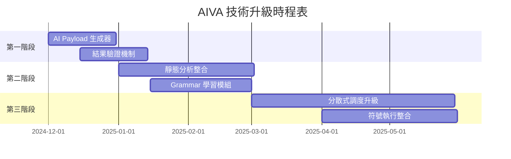

# AIVA 技術升級路線圖
*基於 AIxCC 競爭對手分析的實施計畫*

## 📑 目錄

- [路線圖總覽](#路線圖總覽)
- [階段一：核心 AI 能力建構（1個月）](#階段一核心-ai-能力建構1個月)
  - [目標：建立 AI 輔助的基礎能力](#目標建立-ai-輔助的基礎能力)
  - [具體任務](#具體任務)
    - [Week 1: AI Payload 生成器](#week-1-ai-payload-生成器)
    - [Week 2: 多重驗證機制](#week-2-多重驗證機制)
    - [Week 3-4: 系統整合與測試](#week-3-4-系統整合與測試)
  - [交付成果](#交付成果)
- [階段二：智能分析能力擴展（2-3個月）](#階段二智能分析能力擴展2-3個月)
  - [目標：建立靜動態結合分析和智能學習能力](#目標建立靜動態結合分析和智能學習能力)
    - [Month 2: 靜態分析整合](#month-2-靜態分析整合)
    - [Month 2.5: Grammar 學習模組](#month-25-grammar-學習模組)
  - [交付成果](#交付成果)
- [階段三：分散式智能平台（3-4個月）](#階段三分散式智能平台3-4個月)
  - [目標：建立大規模智能掃描平台](#目標建立大規模智能掃描平台)
    - [Month 4-5: 分散式調度系統](#month-4-5-分散式調度系統)
    - [Month 5-6: 符號執行整合](#month-5-6-符號執行整合)
  - [交付成果](#交付成果)
- [技術債務管理](#技術債務管理)
  - [重構計畫](#重構計畫)
  - [測試策略](#測試策略)
- [風險緩解策略](#風險緩解策略)
  - [技術風險](#技術風險)
  - [業務風險](#業務風險)
- [成功指標](#成功指標)
  - [技術指標](#技術指標)
  - [業務指標](#業務指標)
- [結論](#結論)

---

## 路線圖總覽



## 階段一：核心 AI 能力建構（1個月）

### 目標：建立 AI 輔助的基礎能力
- 完成 AI Payload 生成器原型
- 實作多重結果驗證機制
- 整合第一批開源工具

### 具體任務

#### Week 1: AI Payload 生成器
**技術架構設計**
```python
# core/ai_payload_generator.py
class AIPayloadGenerator:
    def __init__(self, config):
        self.aiva_nlg_system = self._init_aiva_nlg(config.nlg_provider)
        self.traditional_dict = PayloadDictionary()
        self.context_analyzer = ContextAnalyzer()
    
    def generate_for_vulnerability(self, vuln_type, target_context):
        # 1. 分析目標上下文
        context_features = self.context_analyzer.extract_features(target_context)
        
        # 2. 生成 AI payload
        ai_payloads = self.aiva_nlg_system.generate_payloads(
            vuln_type=vuln_type,
            context=context_features,
            count=10
        )
        
        # 3. 結合傳統字典
        traditional_payloads = self.traditional_dict.get_payloads(vuln_type)
        
        # 4. 優化和去重
        return self._optimize_payloads(ai_payloads + traditional_payloads)
```

**整合點**
- AIVA XSS 模組：在現有 payload 基礎上增加 AI 生成
- AIVA SQLi 模組：根據資料庫類型客製化 payload
- AIVA Features 模組：為每種漏洞類型提供智能 payload

#### Week 2: 多重驗證機制
**驗證架構**
```python
# core/consensus_validator.py
class ConsensusValidator:
    def __init__(self):
        self.validators = [
            AIVAValidator(model="enhanced-decision-agent"),
            AIValidator(model="claude-3"),
            RuleBasedValidator(),
            POCValidator()
        ]
    
    def validate_finding(self, finding):
        scores = []
        for validator in self.validators:
            score = validator.validate(finding)
            scores.append(score)
        
        # 共識決策
        consensus_score = self._calculate_consensus(scores)
        confidence_level = self._determine_confidence(consensus_score)
        
        return ValidationResult(
            is_valid=consensus_score > 0.7,
            confidence=confidence_level,
            evidence=self._collect_evidence(finding)
        )
```

#### Week 3-4: 系統整合與測試

### 交付成果
1. **AI Payload Generator v1.0**
2. **Consensus Validation Framework**
3. **整合測試報告**
4. **效能基準測試**

## 階段二：智能分析能力擴展（2-3個月）

### 目標：建立靜動態結合分析和智能學習能力

#### Month 2: 靜態分析整合

**技術選型評估**
| 工具 | 語言支援 | 整合難度 | 授權 | 推薦度 |
|------|----------|----------|------|--------|
| CodeQL | Java/JS/Python/C++ | 中 | 免費 | ⭐⭐⭐⭐⭐ |
| Infer | Java/C/C++/Objective-C | 低 | MIT | ⭐⭐⭐⭐ |
| SonarQube | 多語言 | 高 | 商業 | ⭐⭐⭐ |
| Tree-sitter | 語法解析 | 低 | MIT | ⭐⭐⭐⭐⭐ |

**實施架構**
```python
# modules/static_analysis.py
class StaticAnalysisIntegrator:
    def __init__(self):
        self.analyzers = {
            'codeql': CodeQLAnalyzer(),
            'infer': InferAnalyzer(),
            'tree_sitter': TreeSitterAnalyzer()
        }
    
    def analyze_target(self, target_info):
        if not target_info.has_source_code:
            return None
            
        results = {}
        for name, analyzer in self.analyzers.items():
            try:
                result = analyzer.analyze(target_info.source_path)
                results[name] = result
            except Exception as e:
                logger.warning(f"Static analysis {name} failed: {e}")
        
        return self._merge_static_results(results)
    
    def correlate_with_dynamic(self, static_results, dynamic_results):
        # 靜動態結果關聯分析
        correlations = []
        for static_finding in static_results:
            for dynamic_finding in dynamic_results:
                if self._are_related(static_finding, dynamic_finding):
                    correlations.append(
                        CorrelatedFinding(static_finding, dynamic_finding)
                    )
        return correlations
```

#### Month 2.5: Grammar 學習模組

**學習架構**
```python
# modules/grammar_learner.py
class GrammarLearner:
    def __init__(self):
        self.pattern_analyzer = PatternAnalyzer()
        self.structure_inferrer = StructureInferrer()
        self.payload_generator = StructuralPayloadGenerator()
    
    def learn_from_traffic(self, http_traffic):
        # 1. 分析 HTTP 流量模式
        patterns = self.pattern_analyzer.extract_patterns(http_traffic)
        
        # 2. 推斷參數結構
        parameter_structures = {}
        for param_name, values in patterns.parameters.items():
            structure = self.structure_inferrer.infer_structure(values)
            parameter_structures[param_name] = structure
        
        # 3. 生成結構化 payload
        structured_payloads = {}
        for param, structure in parameter_structures.items():
            payloads = self.payload_generator.generate_for_structure(
                structure, param
            )
            structured_payloads[param] = payloads
        
        return GrammarLearningResult(
            patterns=patterns,
            structures=parameter_structures,
            payloads=structured_payloads
        )
```

**應用整合**
- 整合到 AIVA Scanner 模組的參數分析邏輯
- 擴展 Features 模組的 payload 生成策略
- 提升 Common 模組的輸入解析能力

### 交付成果
1. **Static-Dynamic Analysis Bridge**
2. **Grammar Learning Engine**
3. **Enhanced Payload Generation System**
4. **Correlation Analysis Dashboard**

## 階段三：分散式智能平台（3-4個月）

### 目標：建立大規模智能掃描平台

#### Month 4-5: 分散式調度系統

**架構升級**
```yaml
# kubernetes/aiva-distributed.yaml
apiVersion: apps/v1
kind: Deployment
metadata:
  name: aiva-scheduler
spec:
  replicas: 1
  selector:
    matchLabels:
      app: aiva-scheduler
  template:
    spec:
      containers:
      - name: scheduler
        image: aiva/scheduler:v2.0
        env:
        - name: SCHEDULER_TYPE
          value: "reinforcement_learning"
        - name: MAX_WORKERS
          value: "1000"
---
apiVersion: apps/v1
kind: Deployment
metadata:
  name: aiva-workers
spec:
  replicas: 100
  selector:
    matchLabels:
      app: aiva-worker
  template:
    spec:
      containers:
      - name: worker
        image: aiva/worker:v2.0
        resources:
          requests:
            memory: "256Mi"
            cpu: "100m"
          limits:
            memory: "512Mi"
            cpu: "500m"
```

**RL 調度演算法**
```python
# core/rl_scheduler.py
import torch
import torch.nn as nn
from collections import deque
import random

class AivaRLScheduler:
    def __init__(self, state_size, action_size):
        self.state_size = state_size
        self.action_size = action_size
        self.memory = deque(maxlen=10000)
        self.epsilon = 1.0
        self.epsilon_min = 0.01
        self.epsilon_decay = 0.995
        self.learning_rate = 0.001
        self.model = self._build_model()
    
    def _build_model(self):
        model = nn.Sequential(
            nn.Linear(self.state_size, 64),
            nn.ReLU(),
            nn.Linear(64, 64),
            nn.ReLU(),
            nn.Linear(64, self.action_size)
        )
        return model
    
    def get_action(self, state):
        # ε-greedy 策略
        if random.random() <= self.epsilon:
            return random.randrange(self.action_size)
        
        with torch.no_grad():
            q_values = self.model(torch.FloatTensor(state))
            return q_values.argmax().item()
    
    def remember(self, state, action, reward, next_state, done):
        self.memory.append((state, action, reward, next_state, done))
    
    def replay(self, batch_size=32):
        if len(self.memory) < batch_size:
            return
        
        batch = random.sample(self.memory, batch_size)
        # 實作 DQN 訓練邏輯
        self._train_model(batch)
```

#### Month 5-6: 符號執行整合

**angr 整合**
```python
# modules/symbolic_execution.py
import angr
import claripy

class SymbolicExecutionModule:
    def __init__(self):
        self.timeout = 300  # 5分鐘超時
        self.max_paths = 100
    
    def analyze_binary(self, binary_path, entry_points=None):
        project = angr.Project(binary_path, auto_load_libs=False)
        
        # 建立符號狀態
        state = project.factory.entry_state()
        
        # 設定符號輸入
        symbolic_input = claripy.BVS("input", 8 * 1024)  # 1KB 符號輸入
        state.memory.store(state.regs.rdi, symbolic_input)
        
        # 執行符號分析
        simgr = project.factory.simulation_manager(state)
        simgr.explore(find=self._is_vulnerable_state)
        
        vulnerabilities = []
        for found_state in simgr.found:
            vuln = self._extract_vulnerability(found_state)
            if vuln:
                vulnerabilities.append(vuln)
        
        return vulnerabilities
    
    def analyze_web_logic(self, application_logic):
        # 針對 Web 應用邏輯進行符號分析
        # 特別關注認證繞過、權限提升等邏輯漏洞
        pass
```

### 交付成果
1. **Kubernetes-based Distributed Platform**
2. **RL-powered Smart Scheduler**
3. **Symbolic Execution Engine**
4. **Performance Monitoring Dashboard**

## 技術債務管理

### 重構計畫
1. **Month 1**: 重構現有 payload 生成邏輯
2. **Month 2**: 重構結果報告系統
3. **Month 3**: 重構任務調度系統
4. **Month 4**: 重構資料庫架構

### 測試策略
```python
# tests/integration/test_ai_enhancement.py
class TestAIEnhancement:
    def test_ai_payload_generation(self):
        generator = AIPayloadGenerator()
        payloads = generator.generate_for_vulnerability(
            vuln_type="xss",
            target_context={"param_name": "search", "framework": "react"}
        )
        assert len(payloads) > 0
        assert any("script" in payload for payload in payloads)
    
    def test_consensus_validation(self):
        validator = ConsensusValidator()
        finding = VulnerabilityFinding(
            type="sql_injection",
            payload="' OR 1=1--",
            response="SQL error: syntax error"
        )
        result = validator.validate_finding(finding)
        assert result.confidence > 0.8
```

## 風險緩解策略

### 技術風險
1. **AI 不穩定**：多模型備援 + 傳統方法 fallback
2. **效能問題**：分層 AI 調用 + 快取策略
3. **相容性**：保持 API 向下相容

### 業務風險
1. **客戶接受度**：提供開關控制新功能
2. **訓練成本**：建立詳細文件和培訓計畫
3. **競爭壓力**：快速迭代，持續創新

## 成功指標

### 技術指標
- 漏洞檢出率提升 30%
- 誤報率降低 40%
- 掃描效率提升 2x（分散式部署）
- AI 輔助準確率 >85%

### 業務指標
- 客戶滿意度提升 25%
- 新客戶簽約率增加 40%
- 技術領先優勢維持 2-3 年

## 結論

本路線圖基於 AIxCC 七強隊伍的成功經驗，為 AIVA 規劃了一條從傳統掃描器進化為 AI 賦能智能平台的升級路徑。

**核心策略**：
1. **漸進式改進**：降低風險，確保穩定
2. **開源整合**：站在巨人肩膀上
3. **AI 優先**：引領下一代安全工具

通過此路線圖的實施，AIVA 將建立在自動化滲透測試領域的決定性技術優勢。