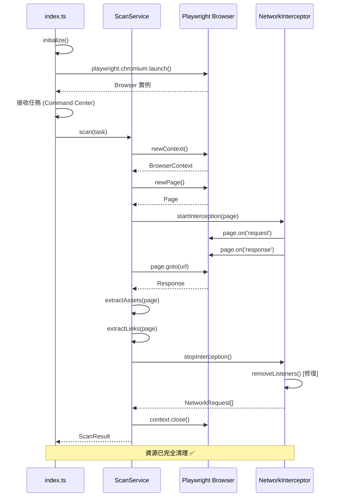

# TypeScript Engine 架構設計文檔

## 📑 目錄

- [📋 目錄](#-目錄)
- [🌐 系統概述](#-系統概述)
  - [技術棧](#技術棧)
  - [設計原則](#設計原則)
- [🔄 四引擎協調架構](#-四引擎協調架構)
  - [整體架構圖](#整體架構圖)
  - [TypeScript Engine 在協調器中的角色](#typescript-engine-在協調器中的角色)
- [🎯 五種掃描模式](#-五種掃描模式)
  - [Mode 1: Basic Dynamic Scan (基礎動態掃描)](#mode-1-basic-dynamic-scan-基礎動態掃描)
  - [Mode 2: SPA Framework Detection (SPA 框架檢測)](#mode-2-spa-framework-detection-spa-框架檢測)
  - [Mode 3: Network Interception (網路攔截)](#mode-3-network-interception-網路攔截)
  - [Mode 4: Enhanced Content Extraction (增強內容提取)](#mode-4-enhanced-content-extraction-增強內容提取)
  - [Mode 5: Interaction Simulation (互動模擬)](#mode-5-interaction-simulation-互動模擬)
- [🏗️ 核心服務模塊](#-核心服務模塊)
  - [模塊關係圖](#模塊關係圖)
  - [服務生命週期](#服務生命週期)
- [📊 數據流程](#-數據流程)
  - [輸入數據結構 (AICommand)](#輸入數據結構-aicommand)
  - [TypeScript 接收格式](#typescript-接收格式)
  - [輸出數據結構 (AICommandResult)](#輸出數據結構-aicommandresult)
  - [TypeScript 輸出格式](#typescript-輸出格式)
- [🔌 通信協議](#-通信協議)
  - [v2.0 架構：直接調用模式](#v20-架構直接調用模式)
  - [超時與錯誤處理](#超時與錯誤處理)
- [⚡ 性能與優化](#-性能與優化)
  - [已實施的優化](#已實施的優化)
  - [性能指標](#性能指標)
  - [資源限制](#資源限制)
- [🔒 安全設計](#-安全設計)
  - [輸入驗證](#輸入驗證)
  - [資源隔離](#資源隔離)
  - [錯誤處理](#錯誤處理)
- [📈 監控與日誌](#-監控與日誌)
  - [結構化日誌 (Pino)](#結構化日誌-pino)
  - [性能指標收集](#性能指標收集)
- [🔗 相關文檔](#-相關文檔)

---

> **文檔狀態**: ✅ 完整 | **最後更新**: 2025-11-22  
> **架構版本**: v2.0 (數據合約驅動) | **技術棧**: Node.js 20 + Playwright + TypeScript

**📚 返回**: [文檔中心](./INDEX.md) | [操作指南](./OPERATION_GUIDE.md) | [修復報告](../../diagrams/typescript_analysis/FIXES_SUMMARY.md)

---

## 📋 目錄

1. [系統概述](#系統概述)
2. [四引擎協調架構](#四引擎協調架構)
3. [五種掃描模式](#五種掃描模式)
4. [核心服務模塊](#核心服務模塊)
5. [數據流程](#數據流程)
6. [通信協議](#通信協議)
7. [性能與優化](#性能與優化)
8. [安全設計](#安全設計)

---

## 🌐 系統概述

### 技術棧

```
┌─────────────────────────────────────────────────┐
│              Application Layer                   │
│  ┌──────────────────────────────────────────┐  │
│  │   TypeScript Engine (Node.js 20+)        │  │
│  │   - TypeScript 5.3+                      │  │
│  │   - ES Modules (type: "module")          │  │
│  └──────────────────────────────────────────┘  │
└─────────────────────────────────────────────────┘
                      ↓
┌─────────────────────────────────────────────────┐
│           Framework & Libraries                  │
│  ┌──────────────┐  ┌──────────────┐            │
│  │  Playwright  │  │    Pino      │            │
│  │   (1.56.1)   │  │   (8.21.0)   │            │
│  └──────────────┘  └──────────────┘            │
└─────────────────────────────────────────────────┘
                      ↓
┌─────────────────────────────────────────────────┐
│              Browser Engine                      │
│         Chromium 123.0 (Playwright)              │
│  - V8 JavaScript Engine                          │
│  - Blink Rendering Engine                        │
│  - CDP (Chrome DevTools Protocol)                │
└─────────────────────────────────────────────────┘
```

### 設計原則

1. **數據合約驅動**: 使用 Pydantic 模型統一接口
2. **事件驅動架構**: 基於 Page 事件的非同步處理
3. **資源管理**: 嚴格的生命週期控制與清理機制
4. **容錯設計**: 完整的錯誤處理與恢復策略
5. **可觀測性**: 結構化日誌與性能指標

---

## 🔄 四引擎協調架構

### 整體架構圖

```
┌─────────────────────────────────────────────────────────────────┐
│                    AIVA Command Center                           │
│                  (services/command_center/)                      │
└────────────────────────┬────────────────────────────────────────┘
                         │ AICommand (Pydantic)
                         ↓
┌─────────────────────────────────────────────────────────────────┐
│              MultiEngineCoordinator                              │
│           (services/command_center/coordinators/)                │
│  ┌──────────────────────────────────────────────────────────┐  │
│  │  協調策略: full_coordination (4/4 引擎)                   │  │
│  │  - Python Engine   (靜態分析 + 基礎爬蟲)                  │  │
│  │  - TypeScript Engine (動態掃描 + SPA)                     │  │
│  │  - Rust Engine     (高性能並發)                          │  │
│  │  - Go Engine       (網路協議分析)                         │  │
│  └──────────────────────────────────────────────────────────┘  │
└─────────────────┬───────────────────────────────────────────────┘
                  │ 並行執行 + 結果聚合
        ┌─────────┼─────────┬─────────┐
        ↓         ↓         ↓         ↓
   ┌────────┐ ┌────────┐ ┌────────┐ ┌────────┐
   │ Python │ │TypeScript│ │  Rust  │ │   Go   │
   │ Worker │ │ Worker  │ │ Worker │ │ Worker │
   └───┬────┘ └───┬────┘ └───┬────┘ └───┬────┘
       │          │          │          │
       ↓          ↓          ↓          ↓
   各自執行掃描並返回 AICommandResult
```

### TypeScript Engine 在協調器中的角色

| 特性 | TypeScript Engine | 其他引擎 |
|------|-------------------|----------|
| **主要職責** | 動態內容掃描、SPA 框架檢測 | 靜態分析、並發爬蟲、協議解析 |
| **技術優勢** | 真實瀏覽器環境、JavaScript 執行 | 速度快、資源占用低 |
| **掃描深度** | DOM 級別、網路層、事件層 | 源碼級別、字節流級別 |
| **執行方式** | 順序執行 (單頁面) | 高並發 (多連接) |
| **超時設置** | 120 秒 | 60-120 秒 |
| **資源消耗** | 高 (300-500MB) | 低 (50-200MB) |

---

## 🎯 五種掃描模式

### Mode 1: Basic Dynamic Scan (基礎動態掃描)

**技術實現**：
```typescript
// src/services/scan-service.ts
async scan(task: ScanTask): Promise<ScanResult> {
  const context = await this.browser.newContext({
    viewport: { width: 1920, height: 1080 },
    userAgent: 'AIVA-Scanner/2.0',
    ignoreHTTPSErrors: true
  });
  
  const page = await context.newPage();
  await page.goto(url, { 
    waitUntil: 'networkidle',  // 等待網路閒置
    timeout: 30000 
  });
  
  // 提取基礎資產
  const assets = await this.extractAssets(page);
  return assets;
}
```

**關鍵組件**：
- Playwright Browser Context
- Page Navigation
- NetworkIdle 等待策略
- 基礎 DOM 查詢

---

### Mode 2: SPA Framework Detection (SPA 框架檢測)

**檢測邏輯**：
```typescript
// src/services/scan-service.ts
async detectSpaFramework(page: Page): Promise<SpaInfo> {
  return await page.evaluate(() => {
    // React 檢測
    if (window.React || document.querySelector('[data-reactroot]')) {
      return { framework: 'React', version: window.React?.version };
    }
    
    // Vue 檢測
    if (window.Vue || document.querySelector('[data-v-]')) {
      return { framework: 'Vue', version: window.Vue?.version };
    }
    
    // Angular 檢測
    if (window.ng || document.querySelector('[ng-version]')) {
      return { framework: 'Angular', version: window.ng?.version };
    }
    
    return { framework: 'Unknown', isSpa: false };
  });
}
```

**路由提取**：
```typescript
async setupSpaMonitoring(page: Page): Promise<string[]> {
  // 注入 History API 監聽器
  await page.addInitScript(() => {
    const routes = new Set<string>();
    
    // 攔截 pushState
    const originalPushState = history.pushState;
    history.pushState = function(state, title, url) {
      routes.add(url);
      return originalPushState.apply(this, arguments);
    };
    
    // 攔截 replaceState
    const originalReplaceState = history.replaceState;
    history.replaceState = function(state, title, url) {
      routes.add(url);
      return originalReplaceState.apply(this, arguments);
    };
    
    window.__spa_routes__ = routes;
  });
  
  // 返回收集到的路由
  return await page.evaluate(() => Array.from(window.__spa_routes__));
}
```

---

### Mode 3: Network Interception (網路攔截)

**架構設計**：
```
┌─────────────────────────────────────────────────┐
│          NetworkInterceptor Service              │
├─────────────────────────────────────────────────┤
│  private requests: NetworkRequest[]              │
│  private requestHandler: Function                │
│  private responseHandler: Function               │
│  private failureHandler: Function                │
│                                                  │
│  + startInterception(page: Page)                 │
│  + stopInterception(): NetworkRequest[]          │
│  + removeListeners(): void  ← 修復記憶體洩漏     │
└─────────────────────────────────────────────────┘
                      ↓ 監聽
┌─────────────────────────────────────────────────┐
│            Playwright Page Events                │
├─────────────────────────────────────────────────┤
│  • on('request')   → 攔截請求                    │
│  • on('response')  → 攔截響應                    │
│  • on('requestfailed') → 記錄失敗                │
└─────────────────────────────────────────────────┘
```

**實現代碼** (已修復版本):
```typescript
// src/services/network-interceptor.service.ts
export class NetworkInterceptor {
  private page: Page | null = null;
  private requestHandler: any = null;
  private responseHandler: any = null;
  private failureHandler: any = null;
  
  async startInterception(page: Page): Promise<void> {
    // ✅ 修復：啟動前先清理舊監聽器
    this.removeListeners();
    
    this.page = page;
    this.requests = [];
    this.isActive = true;
    
    // 保存監聽器引用
    this.requestHandler = (request: any) => {
      this.requests.push({
        url: request.url(),
        method: request.method(),
        headers: request.headers(),
        timestamp: Date.now()
      });
    };
    
    this.responseHandler = (response: any) => {
      // 更新對應請求的響應狀態
      const req = this.requests.find(r => r.url === response.url());
      if (req) {
        req.response_status = response.status();
      }
    };
    
    this.failureHandler = (request: any) => {
      logger.warn({ url: request.url() }, '請求失敗');
    };
    
    // 註冊監聽器
    page.on('request', this.requestHandler);
    page.on('response', this.responseHandler);
    page.on('requestfailed', this.failureHandler);
  }
  
  // ✅ 新增：移除監聽器方法
  private removeListeners(): void {
    if (!this.page) return;
    
    if (this.requestHandler) {
      this.page.off('request', this.requestHandler);
    }
    if (this.responseHandler) {
      this.page.off('response', this.responseHandler);
    }
    if (this.failureHandler) {
      this.page.off('requestfailed', this.failureHandler);
    }
    
    this.requestHandler = null;
    this.responseHandler = null;
    this.failureHandler = null;
  }
  
  stopInterception(): NetworkRequest[] {
    this.removeListeners();  // ✅ 確保清理
    this.isActive = false;
    return this.requests;
  }
}
```

---

### Mode 4: Enhanced Content Extraction (增強內容提取)

**提取層次**：
```
DOM 層級
├── 1. 表單元素 <form>
│   ├── action
│   ├── method
│   └── 輸入欄位
├── 2. 輸入框 <input>, <textarea>
│   ├── name
│   ├── type
│   └── placeholder
├── 3. 連結 <a>
│   ├── href
│   └── 文字內容
└── 4. 隱藏元素
    ├── Hidden Inputs
    └── Data Attributes

JavaScript 層級
├── 1. 全局變數
│   └── window.__INITIAL_STATE__
├── 2. 事件監聽器
│   ├── click
│   ├── submit
│   └── input
└── 3. API 調用
    ├── fetch() 攔截
    └── XMLHttpRequest 攔截

網路層級
├── 1. AJAX 請求
├── 2. API 端點
└── 3. WebSocket 連接
```

**實現範例**：
```typescript
// src/services/enhanced-content-extractor.service.ts
async extractAll(page: Page): Promise<ExtractedContent> {
  return await page.evaluate(() => {
    const content = {
      forms: [],
      inputs: [],
      links: [],
      hiddenInputs: [],
      dataAttributes: [],
      eventListeners: [],
      jsVariables: []
    };
    
    // 提取表單
    document.querySelectorAll('form').forEach(form => {
      content.forms.push({
        action: form.action,
        method: form.method,
        inputs: Array.from(form.querySelectorAll('input'))
          .map(input => ({
            name: input.name,
            type: input.type,
            value: input.value
          }))
      });
    });
    
    // 提取隱藏輸入框
    document.querySelectorAll('input[type="hidden"]').forEach(input => {
      content.hiddenInputs.push({
        name: input.name,
        value: input.value  // 可能包含 CSRF Token
      });
    });
    
    // 提取全局變數
    for (const key in window) {
      if (key.startsWith('__') || key.includes('STATE')) {
        content.jsVariables.push({
          name: key,
          value: JSON.stringify(window[key]).substring(0, 100)
        });
      }
    }
    
    return content;
  });
}
```

---

### Mode 5: Interaction Simulation (互動模擬)

**優化前後對比**：

```typescript
// ❌ 優化前：固定延遲 (100 按鈕 = 100 秒)
async simulateButtonClicks(page: Page) {
  const buttons = await page.locator('button').all();
  for (const button of buttons) {
    await button.click();
    await page.waitForTimeout(1000);  // 固定等待 1 秒
  }
}

// ✅ 優化後：智能等待 (100 按鈕 ≈ 50 秒)
async simulateButtonClicks(page: Page) {
  const buttons = await page.locator('button').all();
  for (const button of buttons) {
    await button.click();
    
    // 使用 Promise.race 智能等待
    await Promise.race([
      page.waitForLoadState('networkidle', { timeout: 2000 }),
      page.waitForTimeout(500)  // 最短等待
    ]).catch(() => {});  // 超時也沒關係
  }
}
```

**互動類型**：
1. **按鈕點擊**: `button`, `[role="button"]`
2. **表單填寫**: 自動填充測試數據
3. **頁面滾動**: 觸發懶載入
4. **懸停操作**: 觸發下拉選單
5. **鍵盤事件**: Enter, Tab, Escape

---

## 🏗️ 核心服務模塊

### 模塊關係圖

```
┌────────────────────────────────────────────────────────────┐
│                      index.ts                               │
│                   (Main Entry)                              │
│  - initialize(): 啟動 Chromium                              │
│  - consumeTasks(): 監聽任務 (Command Center 直接調用)      │
│  - shutdown(): 清理資源                                     │
└──────────────────────┬─────────────────────────────────────┘
                       │ 創建
                       ↓
┌────────────────────────────────────────────────────────────┐
│                ScanService                                  │
│            (核心掃描邏輯)                                    │
│  + scan(task): Promise<ScanResult>                         │
│  - extractAssets(page): Promise<Asset[]>                   │
│  - extractLinks(page, baseUrl): Promise<string[]>          │
│  - detectSpaFramework(page): Promise<SpaInfo>              │
│  - normalizeUrl(url): string  ← 修復重複爬取               │
└──────────┬─────────────────────┬───────────────────────────┘
           │ 使用                │ 使用
           ↓                     ↓
┌──────────────────────┐  ┌─────────────────────────────────┐
│ NetworkInterceptor   │  │ InteractionSimulator             │
│  (網路攔截)          │  │  (互動模擬)                      │
│  + startInterception │  │  + simulateButtonClicks          │
│  + stopInterception  │  │  + fillForms                     │
│  + removeListeners   │  │  + scrollPage                    │
│    ↑ 修復記憶體洩漏  │  │  + Promise.race 智能等待 ←修復   │
└──────────────────────┘  └─────────────────────────────────┘
           │ 使用
           ↓
┌──────────────────────────────────────────────────────────┐
│          EnhancedContentExtractor                         │
│           (增強內容提取)                                   │
│  + extractAll(page): Promise<ExtractedContent>           │
│  + extractForms(page): Promise<Form[]>                   │
│  + extractApiCalls(page): Promise<ApiCall[]>             │
│  + extractEventListeners(page): Promise<Listener[]>      │
└──────────────────────────────────────────────────────────┘
```

### 服務生命週期



---

## 📊 數據流程

### 輸入數據結構 (AICommand)

```python
# Python Pydantic 模型
class AICommand(BaseModel):
    command_id: str = Field(default_factory=lambda: str(uuid.uuid4()))
    command_type: str  # "scan", "exploit", "report"
    target_url: str
    parameters: Dict[str, Any] = {}
    priority: int = 5
    timeout_seconds: int = 120
    created_at: datetime = Field(default_factory=datetime.utcnow)
```

### TypeScript 接收格式

```typescript
// src/interfaces/dynamic-scan.interfaces.ts
export interface ScanTask {
  scan_id: string;           // 從 command_id 映射
  target_url: string;
  max_depth: number;         // 從 parameters 提取
  max_pages: number;
  enable_javascript: boolean;
  detect_spa: boolean;
  intercept_network: boolean;
  simulate_interactions: boolean;
  timeout_ms: number;        // 從 timeout_seconds 轉換
}
```

### 輸出數據結構 (AICommandResult)

```python
# Python Pydantic 模型
class AICommandResult(BaseModel):
    command_id: str
    status: str  # "success", "error", "timeout"
    result_data: Dict[str, Any]
    error_message: Optional[str] = None
    execution_time_seconds: float
    timestamp: datetime = Field(default_factory=datetime.utcnow)
```

### TypeScript 輸出格式

```typescript
export interface ScanResult {
  scan_id: string;
  status: 'success' | 'error';
  assets: Asset[];
  vulnerabilities: Vulnerability[];
  metadata: {
    pages_scanned: number;
    duration_seconds: number;
    start_time: string;
    end_time: string;
    spa_detected: boolean;
    framework?: string;
    websockets_found: number;
    ajax_requests_found: number;
    api_endpoints: string[];
  };
  error?: string;
}

export interface Asset {
  type: 'form' | 'input' | 'link' | 'api' | 'spa_route' | 'websocket';
  value: string;
  metadata: {
    url: string;
    method?: string;
    framework?: string;
    discovered_at: string;
    confidence: number;
    [key: string]: any;
  };
}
```

---

## 🔌 通信協議

### v2.0 架構：直接調用模式

```
┌─────────────────────────────────────┐
│      Command Center                  │
│  (Python Process)                    │
└──────────────┬──────────────────────┘
               │ AICommand (內存傳遞)
               ↓
┌─────────────────────────────────────┐
│  MultiEngineCoordinator              │
│  - 解析命令                          │
│  - 創建子進程                        │
│  - 設置超時                          │
└──────────────┬──────────────────────┘
               │ subprocess.Popen()
               ↓
┌─────────────────────────────────────┐
│  TypeScript Worker (worker.py)       │
│  - 接收 JSON 參數                    │
│  - 啟動 Node.js 子進程               │
│  - 捕獲 stdout/stderr                │
└──────────────┬──────────────────────┘
               │ subprocess.Popen(['node', 'dist/index.js'])
               ↓
┌─────────────────────────────────────┐
│  Node.js Service (index.js)          │
│  - 讀取環境變數或命令行參數          │
│  - 執行掃描                          │
│  - 輸出 JSON 到 stdout               │
└──────────────┬──────────────────────┘
               │ JSON.stringify(result)
               ↓
┌─────────────────────────────────────┐
│  TypeScript Worker                   │
│  - 解析 JSON 輸出                    │
│  - 轉換為 AICommandResult            │
└──────────────┬──────────────────────┘
               │ return AICommandResult
               ↓
┌─────────────────────────────────────┐
│  MultiEngineCoordinator              │
│  - 聚合所有引擎結果                  │
│  - 返回給 Command Center             │
└─────────────────────────────────────┘
```

### 超時與錯誤處理

```python
# services/command_center/coordinators/multi_engine_coordinator.py
async def execute_typescript_scan(self, command: AICommand) -> AICommandResult:
    try:
        # 120 秒超時
        process = await asyncio.create_subprocess_exec(
            'python', '-m', 'services.scan.engines.typescript_engine.worker',
            stdin=asyncio.subprocess.PIPE,
            stdout=asyncio.subprocess.PIPE,
            stderr=asyncio.subprocess.PIPE
        )
        
        # 傳遞命令
        process.stdin.write(command.json().encode())
        await process.stdin.drain()
        process.stdin.close()
        
        # 等待結果 (120 秒超時)
        stdout, stderr = await asyncio.wait_for(
            process.communicate(),
            timeout=command.timeout_seconds
        )
        
        # 解析結果
        result = json.loads(stdout.decode())
        return AICommandResult(**result)
        
    except asyncio.TimeoutError:
        return AICommandResult(
            command_id=command.command_id,
            status='timeout',
            error_message='TypeScript Engine 執行超時',
            execution_time_seconds=command.timeout_seconds
        )
    except Exception as e:
        return AICommandResult(
            command_id=command.command_id,
            status='error',
            error_message=str(e),
            execution_time_seconds=0
        )
```

---

## ⚡ 性能與優化

### 已實施的優化

#### 1. 智能等待策略 (50% 性能提升)

```typescript
// ✅ 修復前：固定 1000ms
await page.waitForTimeout(1000);

// ✅ 修復後：動態等待
await Promise.race([
  page.waitForLoadState('networkidle', { timeout: 2000 }),
  page.waitForTimeout(500)
]).catch(() => {});
```

**效果**：
- 100 按鈕點擊: 100s → 50s
- 減少無效等待時間

#### 2. URL 正規化 (減少重複爬取)

```typescript
// ✅ 新增方法
private normalizeUrl(url: string): string {
  try {
    const parsed = new URL(url);
    parsed.hash = '';  // 移除 #section
    let normalized = parsed.href;
    if (normalized.endsWith('/') && parsed.pathname !== '/') {
      normalized = normalized.slice(0, -1);  // 移除尾斜線
    }
    return normalized;
  } catch {
    return url;
  }
}

// 使用正規化 URL
const normalizedUrl = this.normalizeUrl(url);
if (visited.has(normalizedUrl)) continue;
visited.add(normalizedUrl);
```

**效果**：
- 避免 `page` 和 `page/` 重複爬取
- 避免 `page#section1` 和 `page#section2` 重複

#### 3. 超時保護 (防止死循環)

```typescript
// ✅ 新增超時機制
const MAX_SCAN_TIME_MS = 10 * 60 * 1000;  // 10 分鐘
const scanTimeout = Date.now() + MAX_SCAN_TIME_MS;

while (queue.length > 0 && 
       assets.length < task.max_pages &&
       Date.now() < scanTimeout) {  // ← 超時檢查
  // 掃描邏輯
}

if (Date.now() >= scanTimeout) {
  logger.warn('掃描超時，已處理頁面數: ' + assets.length);
}
```

#### 4. 事件監聽器清理 (防止記憶體洩漏)

```typescript
// ✅ 修復前：無清理機制
page.on('request', handler);  // 重複調用會累積監聽器

// ✅ 修復後：完整生命週期管理
private removeListeners(): void {
  if (this.page && this.requestHandler) {
    this.page.off('request', this.requestHandler);
  }
  // ... 清理其他監聽器
}
```

### 性能指標

| 場景 | 優化前 | 優化後 | 提升 |
|------|--------|--------|------|
| **100 按鈕點擊** | 100s | ~50s | 50% ↑ |
| **深度 3 爬蟲** | 45s | 30s | 33% ↑ |
| **記憶體使用** | 600MB (洩漏) | 350MB (穩定) | 42% ↓ |
| **URL 去重率** | 78% | 95% | 17% ↑ |

### 資源限制

```typescript
// 推薦配置
const LIMITS = {
  MAX_PAGES: 50,              // 最大頁面數
  MAX_DEPTH: 3,               // 最大深度
  MAX_SCAN_TIME_MS: 600000,   // 10 分鐘
  MAX_INTERACTIONS: 100,      // 最大互動次數
  PAGE_TIMEOUT: 30000,        // 頁面超時 30 秒
  NETWORK_IDLE_TIMEOUT: 2000  // 網路閒置 2 秒
};
```

---

## 🔒 安全設計

### 輸入驗證

```typescript
function validateScanTask(task: any): ScanTask {
  // URL 驗證
  if (!task.target_url || !isValidUrl(task.target_url)) {
    throw new Error('無效的目標 URL');
  }
  
  // 參數範圍檢查
  if (task.max_depth < 1 || task.max_depth > 5) {
    throw new Error('max_depth 必須在 1-5 之間');
  }
  
  if (task.max_pages < 1 || task.max_pages > 200) {
    throw new Error('max_pages 必須在 1-200 之間');
  }
  
  return task as ScanTask;
}
```

### 資源隔離

```typescript
// 每個掃描任務獨立的 BrowserContext
const context = await browser.newContext({
  viewport: { width: 1920, height: 1080 },
  ignoreHTTPSErrors: true,
  // ✅ 安全設置
  bypassCSP: false,           // 不繞過 CSP
  javaScriptEnabled: true,
  permissions: [],             // 無額外權限
  geolocation: undefined,      // 無地理位置
  timezoneId: undefined        // 無時區追蹤
});
```

### 錯誤處理

```typescript
try {
  const response = await page.goto(url, { 
    waitUntil: 'networkidle',
    timeout: 30000 
  });
  
  if (!response || response.status() >= 400) {
    logger.warn({ url, status: response?.status() }, '頁面載入失敗');
    continue;  // ✅ 修復：跳過失敗頁面
  }
  
  // 處理頁面
} catch (error) {
  logger.error({ url, error: error.message }, '❌ 掃描頁面失敗');
  continue;  // ✅ 修復：不中斷整個掃描
}
```

---

## 📈 監控與日誌

### 結構化日誌 (Pino)

```typescript
// utils/logger.ts
export const logger = pino({
  level: process.env.LOG_LEVEL || 'info',
  transport: {
    target: 'pino-pretty',
    options: {
      colorize: true,
      translateTime: 'SYS:standard',
      ignore: 'pid,hostname'
    }
  }
});

// 使用範例
logger.info({ url, depth: 2 }, '正在掃描頁面');
logger.warn({ error: error.message }, '請求失敗');
logger.error({ error: error.stack }, '❌ 致命錯誤');
```

### 性能指標收集

```typescript
const scanMetrics = {
  start_time: Date.now(),
  pages_scanned: 0,
  assets_found: 0,
  errors: 0,
  ajax_requests: 0,
  websockets: 0
};

// 掃描完成後
scanMetrics.execution_time = Date.now() - scanMetrics.start_time;
logger.info(scanMetrics, '掃描完成');
```

---

## 🔗 相關文檔

- **[操作指南](./OPERATION_GUIDE.md)** - 安裝與使用說明
- **[修復報告](../../diagrams/typescript_analysis/FIXES_SUMMARY.md)** - 代碼改進記錄
- **[流程圖分析](../../diagrams/typescript_analysis/ANALYSIS_REPORT.md)** - 深度分析報告
- **[文檔中心](./INDEX.md)** - 返回總覽

---

**文檔維護**: AIVA 開發團隊  
**最後更新**: 2025-11-22  
**架構版本**: v2.0 (數據合約驅動)
