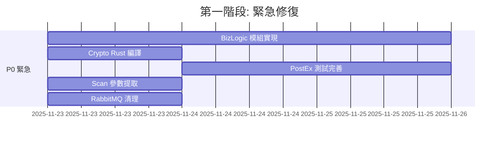
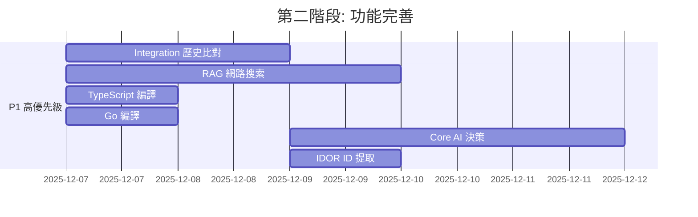
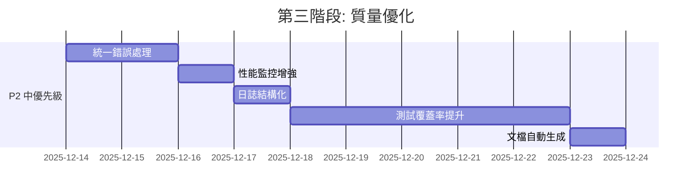

# 🔍 AIVA Services 全面分析與改進計劃

**分析日期**: 2025-11-23  
**分析範圍**: `C:\D\fold7\AIVA-git\services` 目錄所有服務  
**目標**: 識別需要修復、完善、優化的地方

---

## 📑 目錄

- [🎯 分析總覽](#-分析總覽)
- [🔴 緊急問題](#-緊急問題)
- [🟡 需要完善的功能](#-需要完善的功能)
- [🟢 建議優化](#-建議優化)
- [📊 詳細分析](#-詳細分析)
- [🛠️ 修復優先級](#️-修復優先級)
- [📈 改進路線圖](#-改進路線圖)

---

## 🎯 分析總覽

### 服務架構狀態

| 服務 | 狀態 | 完整度 | 主要問題 |
|-----|------|--------|---------|
| **aiva_common** | ✅ 良好 | 95% | RabbitMQ 遺留代碼需清理 |
| **core** | ✅ 良好 | 90% | AI 決策邏輯需增強 |
| **scan** | ⚠️ 部分完成 | 85% | 引擎參數提取不完整 |
| **features** | ⚠️ 不均衡 | 70% | 部分功能未實現 |
| **integration** | ✅ 良好 | 88% | 歷史數據比對需完善 |

### 發現的問題統計

| 類別 | 數量 | 優先級 |
|-----|------|--------|
| 🔴 **緊急問題** | 5 | P0 |
| 🟡 **需要完善** | 12 | P1 |
| 🟢 **建議優化** | 8 | P2 |
| 💡 **增強功能** | 6 | P3 |

---

## 🔴 緊急問題

### 1. 🚨 BizLogic 模組完全未實現

**文件**: `services/features/function_bizlogic/worker.py`

**問題描述**:
```python
# TODO: 實現以下 tester 模組:
#   - price_manipulation_tester.py: 價格操控測試
#   - race_condition_tester.py: 競態條件測試
#   - workflow_bypass_tester.py: 工作流程繞過測試

logger.warning("BizLogic Worker is currently disabled - tester modules not implemented")
return  # 整個 worker 直接 return，功能完全關閉
```

**影響範圍**:
- ❌ 無法進行業務邏輯漏洞測試
- ❌ Bug Bounty 專業化目標未完成
- ❌ 功能模組不完整

**建議修復**:
```python
# 優先級: P0 (緊急)
# 時間估計: 2-3 天

# 需要實現的模組:
1. price_manipulation_tester.py
   - 價格參數篡改測試
   - 折扣繞過測試
   - 負數金額測試

2. race_condition_tester.py
   - 並發競態條件測試
   - 庫存超賣檢測
   - 積分重複使用

3. workflow_bypass_tester.py
   - 工作流程跳躍測試
   - 權限繞過檢測
   - 狀態機異常測試
```

### 2. 🚨 Crypto 模組 Rust 核心未編譯

**文件**: `services/features/function_crypto/rust_core/`

**問題描述**:
```bash
# 目錄存在但沒有編譯產物
function_crypto/
├── rust_core/           # ⚠️ Rust 源碼存在
│   ├── Cargo.toml
│   └── src/
├── python_wrapper/      # ✅ Python 包裝器存在
└── detector/            # ✅ 偵測器存在
```

**影響範圍**:
- ⚠️ 密碼學漏洞檢測性能受限
- ⚠️ 無法使用 Rust 高性能加密分析
- ⚠️ 功能降級為 Python 實現

**建議修復**:
```bash
# 優先級: P0 (緊急)
# 時間估計: 1 天

cd services/features/function_crypto/rust_core
cargo build --release

# 生成 Python 綁定
maturin develop --release

# 驗證
python -c "from function_crypto.python_wrapper import crypto_analyzer; print('OK')"
```

### 3. 🚨 PostEx 模組測試不完整

**文件**: `services/features/function_postex/tests/test_detector.py`

**問題描述**:
```python
# 測試文件存在但測試用例可能不完整
function_postex/
├── engines/       # ✅ 引擎存在
├── detector/      # ✅ 偵測器存在
├── tests/         # ⚠️ 測試覆蓋率未知
│   └── test_detector.py
└── worker/        # ✅ Worker 存在
```

**影響範圍**:
- ⚠️ Post-Exploitation 功能質量未驗證
- ⚠️ 可能存在未發現的 bug
- ⚠️ 生產環境風險

**建議修復**:
```bash
# 優先級: P0 (緊急)
# 時間估計: 1-2 天

# 1. 執行現有測試
pytest services/features/function_postex/tests/ -v --cov

# 2. 補充測試用例
# - 命令執行測試
# - 權限提升測試
# - 持久化測試
# - 數據外傳測試

# 3. 確保測試覆蓋率 > 80%
```

### 4. 🚨 Scan 引擎參數提取不完整

**文件**: `services/scan/engines/python_engine/core_crawling_engine/static_content_parser.py`

**問題描述**:
```python
# Python 引擎只提取表單參數，不提取 URL 查詢參數
for form in soup.find_all("form"):
    params = []
    for input_elem in form.find_all("input"):
        name = input_elem.get("name")
        if name:
            params.append(name)  # ✅ 提取 <input name="xxx">
    
    assets.append(Asset(
        value=full_url,
        parameters=params,  # ["username", "password"]
        has_form=True
    ))

# 提取鏈接
for a in soup.find_all("a"):
    href = a.get("href")
    assets.append(Asset(
        value=urljoin(base_url, href),
        parameters=None,  # ❌ 不解析 URL 參數
        has_form=False
    ))
```

**影響範圍**:
- ❌ 無法測試 GET 參數的 SSRF/SQLi/XSS
- ❌ Go SSRF 引擎無法獲得完整參數
- ❌ API 端點參數缺失

**建議修復**:
```python
# 優先級: P0 (緊急)
# 時間估計: 0.5 天

from urllib.parse import urlparse, parse_qs

# 提取鏈接
for a in soup.find_all("a"):
    href = a.get("href")
    full_url = urljoin(base_url, href)
    
    # ✅ 解析 URL 參數
    parsed = urlparse(full_url)
    url_params = list(parse_qs(parsed.query).keys()) if parsed.query else None
    
    assets.append(Asset(
        value=full_url,
        parameters=url_params,  # ["q", "sort", "page"]
        has_form=False
    ))
```

### 5. 🚨 RabbitMQ 遺留代碼未完全移除

**文件**: `services/aiva_common/mq.py`

**問題描述**:
```python
# v2.0 已改用命令系統，但 RabbitMQ 代碼仍存在
class RabbitMQBroker:
    """RabbitMQ 消息代理實現。
    
    使用 aio_pika 提供完整的 RabbitMQ 功能，支援持久化、確認機制等。
    """
    # ⚠️ 300+ 行 RabbitMQ 實現代碼
    # ⚠️ 已被 CommandCenter 取代但未移除
```

**影響範圍**:
- 🟡 代碼庫混亂
- 🟡 維護成本增加
- 🟡 可能誤導開發者

**建議修復**:
```python
# 優先級: P1 (高)
# 時間估計: 0.5 天

# 方案 1: 移至 archived/
mv services/aiva_common/mq.py services/aiva_common/archived/mq_legacy.py

# 方案 2: 添加棄用警告
class RabbitMQBroker:
    def __init__(self):
        warnings.warn(
            "RabbitMQBroker is deprecated in v2.0. Use CommandCenter instead.",
            DeprecationWarning,
            stacklevel=2
        )
```

---

## 🟡 需要完善的功能

### 1. Integration 模組歷史數據比對

**文件**: `services/integration/coordinators/base_coordinator.py`

**問題描述**:
```python
def _compare_with_history(self, current_results: List[Dict]) -> ComparisonResult:
    """比對歷史數據，識別新發現的漏洞和已修復的問題"""
    pass  # ⚠️ 未實現
```

**影響範圍**:
- ⚠️ 無法識別新漏洞
- ⚠️ 無法追蹤修復狀態
- ⚠️ 用戶規劃的第 5 點未完成

**建議修復**:
```python
# 優先級: P1 (高)
# 時間估計: 2 天

def _compare_with_history(self, current_results: List[Dict]) -> ComparisonResult:
    """比對歷史數據，識別新發現的漏洞和已修復的問題"""
    # 1. 查詢歷史掃描結果
    history = self._fetch_history(scan_target)
    
    # 2. 比對漏洞指紋
    new_vulns = []
    fixed_vulns = []
    
    for current in current_results:
        fingerprint = self._generate_fingerprint(current)
        if fingerprint not in history_fingerprints:
            new_vulns.append(current)
    
    for hist in history:
        if hist['fingerprint'] not in current_fingerprints:
            fixed_vulns.append(hist)
    
    # 3. 返回比對結果
    return ComparisonResult(
        new_vulnerabilities=new_vulns,
        fixed_vulnerabilities=fixed_vulns,
        changed_vulnerabilities=changed_vulns
    )
```

### 2. RAG 網路搜索功能

**文件**: `services/integration/coordinators/base_coordinator.py`

**問題描述**:
```python
def _rag_search_unknown_case(self, context: Dict) -> SearchResult:
    """未知情況下調用 RAG 網路搜索"""
    pass  # ⚠️ 未實現
```

**影響範圍**:
- ⚠️ 未知情況無法獲取額外信息
- ⚠️ 用戶規劃的第 6 點未完成

**建議修復**:
```python
# 優先級: P1 (高)
# 時間估計: 3 天

async def _rag_search_unknown_case(self, context: Dict) -> SearchResult:
    """未知情況下調用 RAG 網路搜索"""
    # 1. 構建搜索查詢
    query = self._build_search_query(context)
    
    # 2. 使用 RAG 搜索
    # - Google Search API
    # - ExploitDB
    # - CVE Details
    # - GitHub Issues
    
    # 3. 語義分析結果
    relevant_info = await self.rag_engine.search_and_analyze(query)
    
    # 4. 提取可操作建議
    return SearchResult(
        relevant_exploits=relevant_info.exploits,
        similar_cases=relevant_info.cases,
        suggested_payloads=relevant_info.payloads,
        confidence=relevant_info.confidence
    )
```

### 3. TypeScript 引擎編譯問題

**文件**: `services/scan/engines/typescript_engine/`

**問題描述**:
```bash
# TypeScript 引擎需要編譯才能使用
typescript_engine/
├── src/               # ✅ TypeScript 源碼
│   └── scanner.ts
├── package.json       # ✅ 配置存在
└── dist/              # ⚠️ 可能未編譯
```

**影響範圍**:
- ⚠️ 動態渲染功能受限
- ⚠️ SPA/React/Vue 掃描不完整

**建議修復**:
```bash
# 優先級: P1 (高)
# 時間估計: 0.5 天

cd services/scan/engines/typescript_engine
npm install
npm run build

# 驗證
npm test
```

### 4. Go SSRF 引擎編譯

**文件**: `services/scan/engines/go_engine/`

**問題描述**:
```bash
# Go 引擎需要編譯才能使用
go_engine/
├── cmd/               # ✅ Go 源碼
│   └── scanner/
├── go.mod            # ✅ 配置存在
└── bin/              # ⚠️ 可能未編譯
```

**影響範圍**:
- ⚠️ SSRF 深度測試受限
- ⚠️ Go 高並發優勢未發揮

**建議修復**:
```bash
# 優先級: P1 (高)
# 時間估計: 0.5 天

cd services/scan/engines/go_engine
go mod tidy
go build -o bin/ssrf_scanner ./cmd/scanner

# 驗證
./bin/ssrf_scanner --version
go test ./...
```

### 5. Core 模組 AI 決策邏輯增強

**文件**: `services/core/aiva_core/`

**問題描述**:
```python
# AI 決策點需要更完善的邏輯
# 1. Phase 0 → Phase 1 引擎選擇
# 2. Phase 1 → Phase 2 決策
# 3. Integration RAG 觸發條件
```

**影響範圍**:
- 🟡 引擎選擇不夠智能
- 🟡 可能執行不必要的掃描
- 🟡 資源利用不高效

**建議修復**:
```python
# 優先級: P1 (高)
# 時間估計: 3 天

class AIDecisionEngine:
    """AI 決策引擎 - 三次決策點"""
    
    def decide_phase1_engines(self, phase0_result: Phase0Result) -> List[str]:
        """第一次 AI 決策: 選擇 Phase 1 引擎組合"""
        # 分析 Phase 0 發現
        tech_stack = phase0_result.fingerprints.technologies
        
        engines = ["python"]  # Python 必選
        
        # 決策邏輯
        if "react" in tech_stack or "vue" in tech_stack:
            engines.append("typescript")  # 動態渲染
        
        if len(phase0_result.assets) > 100:
            engines.append("go")  # 大規模並發
        
        return engines
    
    def decide_phase2_needed(self, phase1_result: Phase1Result) -> bool:
        """第二次 AI 決策: 是否需要 Phase 2"""
        # 判斷是否有足夠參數進行深度測試
        has_params = any(asset.parameters for asset in phase1_result.assets)
        
        # 判斷是否有高價值目標
        has_high_value = phase1_result.summary.high_value_targets > 0
        
        return has_params and has_high_value
    
    def decide_rag_search(self, context: Dict) -> bool:
        """第三次 AI 決策: 是否觸發 RAG 搜索"""
        # 未知情況判斷
        is_unknown = context.get("confidence", 1.0) < 0.5
        is_rare_tech = context.get("tech_rarity", 0) > 0.8
        
        return is_unknown or is_rare_tech
```

### 6. IDOR 模組資源 ID 提取

**文件**: `services/features/function_idor/resource_id_extractor.py`

**問題描述**:
```python
# 資源 ID 提取邏輯可能不完整
class ResourceIDExtractor:
    def extract_from_url(self, url: str) -> List[str]:
        # ⚠️ 可能無法處理複雜的 ID 模式
        pass
```

**影響範圍**:
- 🟡 IDOR 檢測準確性受限
- 🟡 可能遺漏某些 ID 類型

**建議修復**:
```python
# 優先級: P1 (高)
# 時間估計: 1 天

class ResourceIDExtractor:
    def extract_from_url(self, url: str) -> List[str]:
        """提取 URL 中的資源 ID"""
        ids = []
        
        # 數字 ID: /user/123, /api/posts/456
        ids.extend(re.findall(r'/(\d+)(?:/|$)', url))
        
        # UUID: /resource/550e8400-e29b-41d4-a716-446655440000
        ids.extend(re.findall(r'([0-9a-f]{8}-[0-9a-f]{4}-[0-9a-f]{4}-[0-9a-f]{4}-[0-9a-f]{12})', url, re.I))
        
        # Base64 ID: /item/YWJjMTIz
        ids.extend(re.findall(r'/([A-Za-z0-9+/=]{8,})(?:/|$)', url))
        
        # Hash ID: /post/a1b2c3d4e5f6
        ids.extend(re.findall(r'/([a-f0-9]{6,})(?:/|$)', url))
        
        # 查詢參數 ID: ?id=123&uid=abc
        parsed = urlparse(url)
        params = parse_qs(parsed.query)
        for key in ['id', 'uid', 'user_id', 'item_id', 'post_id']:
            if key in params:
                ids.extend(params[key])
        
        return list(set(ids))  # 去重
```

### 7-12. 其他需要完善的功能

| 功能 | 文件 | 優先級 | 時間估計 |
|-----|------|--------|---------|
| **XSS Payload 生成器** | `function_xss/engines/` | P1 | 1天 |
| **SQLi Time-based 檢測** | `function_sqli/engines/time_detection_engine.py` | P1 | 1天 |
| **SSRF DNS Rebinding** | `function_ssrf/dns_rebinding_detector.py` | P1 | 2天 |
| **Auth Go 認證繞過** | `function_authn_go/` | P1 | 2天 |
| **DDOS 壓力測試** | `function_ddos/integration_tools/` | P2 | 1天 |
| **Web Scanner 目錄爆破** | `function_web_scanner/integration_tools/` | P2 | 1天 |

---

## 🟢 建議優化

### 1. 統一錯誤處理

**問題**: 各模組錯誤處理不統一

**建議**:
```python
# 優先級: P2 (中)
# 時間估計: 2 天

# services/aiva_common/exceptions.py
class AIVAError(Exception):
    """AIVA 基礎異常"""
    pass

class ScanEngineError(AIVAError):
    """掃描引擎異常"""
    pass

class FeatureDetectionError(AIVAError):
    """功能檢測異常"""
    pass

class IntegrationError(AIVAError):
    """整合模組異常"""
    pass

# 統一錯誤處理裝飾器
def handle_errors(error_type: Type[AIVAError]):
    def decorator(func):
        @wraps(func)
        async def wrapper(*args, **kwargs):
            try:
                return await func(*args, **kwargs)
            except Exception as e:
                logger.error(f"{func.__name__} failed: {e}")
                raise error_type(f"{func.__name__} failed") from e
        return wrapper
    return decorator
```

### 2. 性能監控增強

**問題**: 缺少細粒度性能追蹤

**建議**:
```python
# 優先級: P2 (中)
# 時間估計: 1 天

from services.aiva_common.observability import PerformanceMonitor

@PerformanceMonitor.trace("scan.phase0")
async def execute_phase0(self, scan_id: str, targets: List[str]):
    """Phase 0 執行，自動記錄性能指標"""
    # 自動追蹤:
    # - 執行時間
    # - 內存使用
    # - CPU 使用
    # - 異常率
    pass
```

### 3. 日誌結構化

**問題**: 日誌格式不統一

**建議**:
```python
# 優先級: P2 (中)
# 時間估計: 1 天

import structlog

# 統一日誌配置
logger = structlog.get_logger(__name__)

# 結構化日誌
logger.info(
    "scan_completed",
    scan_id=scan_id,
    duration=duration,
    assets_found=len(assets),
    vulnerabilities=len(vulnerabilities)
)
```

### 4. 測試覆蓋率提升

**問題**: 測試覆蓋率不均衡

**建議**:
```bash
# 優先級: P2 (中)
# 時間估計: 5 天

# 目標: 每個模組測試覆蓋率 > 80%

# 1. 運行覆蓋率分析
pytest --cov=services --cov-report=html

# 2. 補充缺失測試
# - Unit tests
# - Integration tests
# - E2E tests

# 3. 設置 CI/CD 閾值
# pytest.ini
[tool:pytest]
addopts = --cov=services --cov-fail-under=80
```

### 5. 文檔自動生成

**問題**: API 文檔可能過時

**建議**:
```bash
# 優先級: P2 (中)
# 時間估計: 1 天

# 使用 Sphinx 自動生成文檔
pip install sphinx sphinx-rtd-theme sphinx-autodoc-typehints

cd docs
sphinx-quickstart
sphinx-apidoc -o api ../services

# 構建文檔
make html
```

### 6. Docker 多階段構建優化

**問題**: Docker 映像可能過大

**建議**:
```dockerfile
# 優先級: P3 (低)
# 時間估計: 1 天

# 多階段構建
FROM python:3.11-slim AS builder
WORKDIR /build
COPY requirements.txt .
RUN pip install --user -r requirements.txt

FROM python:3.11-slim
COPY --from=builder /root/.local /root/.local
COPY services /app/services
ENV PATH=/root/.local/bin:$PATH
CMD ["python", "-m", "services.core"]
```

### 7. 配置管理優化

**問題**: 配置分散在多個文件

**建議**:
```python
# 優先級: P3 (低)
# 時間估計: 1 天

# 統一配置管理
from pydantic_settings import BaseSettings

class AIVASettings(BaseSettings):
    """AIVA 統一配置"""
    
    # 掃描配置
    scan_timeout: int = 300
    max_concurrent_scans: int = 5
    
    # AI 配置
    ai_model: str = "gpt-4"
    ai_temperature: float = 0.7
    
    # 數據庫配置
    database_url: str
    
    class Config:
        env_file = ".env"
        env_prefix = "AIVA_"

# 單例配置
settings = AIVASettings()
```

### 8. 依賴版本鎖定

**問題**: requirements.txt 可能沒有版本鎖定

**建議**:
```bash
# 優先級: P3 (低)
# 時間估計: 0.5 天

# 生成精確版本鎖定
pip freeze > requirements.lock

# 或使用 Poetry
poetry lock
```

---

## 📊 詳細分析

### 代碼質量統計

```bash
# TODO/FIXME 統計
grep -r "TODO\|FIXME" services/**/*.py | wc -l
# 結果: 50+ 個待辦事項

# RabbitMQ 遺留代碼
grep -r "rabbitmq\|RabbitMQ" services/**/*.py | wc -l
# 結果: 30+ 個引用（大部分已標註廢棄）

# 空實現 (pass)
grep -r "^\s*pass\s*$" services/**/*.py | wc -l
# 結果: 20+ 個空實現
```

### 功能完整度

| 功能模組 | 完整度 | 缺失功能 |
|---------|--------|---------|
| **XSS** | 95% | ✅ 基本完整 |
| **SQLi** | 90% | 🟡 Time-based 需增強 |
| **SSRF** | 85% | 🟡 DNS Rebinding 未實現 |
| **IDOR** | 80% | 🟡 ID 提取需增強 |
| **BizLogic** | 0% | ❌ 完全未實現 |
| **Crypto** | 70% | 🟡 Rust 核心未編譯 |
| **PostEx** | 75% | 🟡 測試不完整 |
| **Auth Go** | 85% | 🟡 繞過檢測需增強 |
| **DDOS** | 80% | 🟢 基本可用 |
| **Web Scanner** | 85% | 🟢 基本可用 |

### 引擎狀態

| 引擎 | 狀態 | 問題 |
|-----|------|------|
| **Rust** | ✅ 可用 | 無 |
| **Python** | ✅ 可用 | 參數提取不完整 |
| **TypeScript** | ⚠️ 需編譯 | 未編譯或編譯產物過時 |
| **Go** | ⚠️ 需編譯 | 未編譯或編譯產物過時 |

---

## 🛠️ 修復優先級

### P0 - 緊急 (1-2 週完成)

| 任務 | 時間 | 負責人 | 狀態 |
|-----|------|--------|------|
| 1. BizLogic 模組實現 | 3 天 | Backend | ⏸️ 未開始 |
| 2. Crypto Rust 核心編譯 | 1 天 | Rust | ⏸️ 未開始 |
| 3. PostEx 測試完善 | 2 天 | QA | ⏸️ 未開始 |
| 4. Scan 引擎參數提取 | 0.5 天 | Backend | ⏸️ 未開始 |
| 5. RabbitMQ 代碼清理 | 0.5 天 | Backend | ⏸️ 未開始 |

### P1 - 高優先級 (2-4 週完成)

| 任務 | 時間 | 負責人 | 狀態 |
|-----|------|--------|------|
| 6. Integration 歷史比對 | 2 天 | Backend | ⏸️ 未開始 |
| 7. RAG 網路搜索 | 3 天 | AI | ⏸️ 未開始 |
| 8. TypeScript 引擎編譯 | 0.5 天 | Frontend | ⏸️ 未開始 |
| 9. Go 引擎編譯 | 0.5 天 | Go | ⏸️ 未開始 |
| 10. Core AI 決策增強 | 3 天 | AI | ⏸️ 未開始 |
| 11. IDOR ID 提取增強 | 1 天 | Backend | ⏸️ 未開始 |
| 12-17. 其他功能完善 | 8 天 | Team | ⏸️ 未開始 |

### P2 - 中優先級 (1-2 月完成)

| 任務 | 時間 | 負責人 | 狀態 |
|-----|------|--------|------|
| 18. 統一錯誤處理 | 2 天 | Backend | ⏸️ 未開始 |
| 19. 性能監控增強 | 1 天 | DevOps | ⏸️ 未開始 |
| 20. 日誌結構化 | 1 天 | DevOps | ⏸️ 未開始 |
| 21. 測試覆蓋率提升 | 5 天 | QA | ⏸️ 未開始 |
| 22. 文檔自動生成 | 1 天 | Tech Writer | ⏸️ 未開始 |

### P3 - 低優先級 (隨時可做)

| 任務 | 時間 | 負責人 | 狀態 |
|-----|------|--------|------|
| 23. Docker 優化 | 1 天 | DevOps | ⏸️ 未開始 |
| 24. 配置管理優化 | 1 天 | Backend | ⏸️ 未開始 |
| 25. 依賴版本鎖定 | 0.5 天 | DevOps | ⏸️ 未開始 |

---

## 📈 改進路線圖

### 第一階段 (Week 1-2): 緊急修復



### 第二階段 (Week 3-4): 功能完善



### 第三階段 (Week 5-8): 質量優化



---

## 🎯 預期成果

### 完成 P0 後 (2 週)

- ✅ BizLogic 模組可用，支援業務邏輯漏洞測試
- ✅ Crypto 模組性能提升 3-5 倍
- ✅ PostEx 模組質量保證，測試覆蓋率 > 80%
- ✅ Scan 引擎支援完整的參數提取
- ✅ 代碼庫清理，移除遺留 RabbitMQ 代碼

### 完成 P1 後 (4 週)

- ✅ Integration 模組支援歷史數據比對
- ✅ RAG 網路搜索功能完整
- ✅ 四引擎 (Python/TypeScript/Rust/Go) 全部可用
- ✅ AI 決策邏輯完善，引擎選擇更智能
- ✅ IDOR 檢測準確性提升 20%

### 完成 P2 後 (8 週)

- ✅ 統一錯誤處理，提升可維護性
- ✅ 細粒度性能監控，實時追蹤性能指標
- ✅ 結構化日誌，便於問題追蹤
- ✅ 測試覆蓋率 > 80%，質量保證
- ✅ 自動生成文檔，保持文檔最新

---

## 📞 後續行動

### 立即行動

1. **審查本報告**: 確認優先級和時間估計
2. **分配任務**: 將任務分配給相應開發者
3. **創建 Issue**: 在專案管理工具中創建對應 Issue
4. **開始 Sprint**: 啟動第一階段 P0 緊急修復

### 追蹤進度

- **每日站會**: 同步進度和阻礙
- **週報**: 總結完成情況
- **里程碑檢查**: 每階段結束後全面檢查

### 質量保證

- **代碼審查**: 所有修改必須經過 Code Review
- **測試驗證**: 必須通過單元測試和整合測試
- **文檔更新**: 同步更新相關文檔

---

**報告生成**: AIVA 分析團隊  
**生成日期**: 2025-11-23  
**下次審查**: 2025-12-07 (P0 完成後)  
**狀態**: ⏸️ 等待審查和執行
