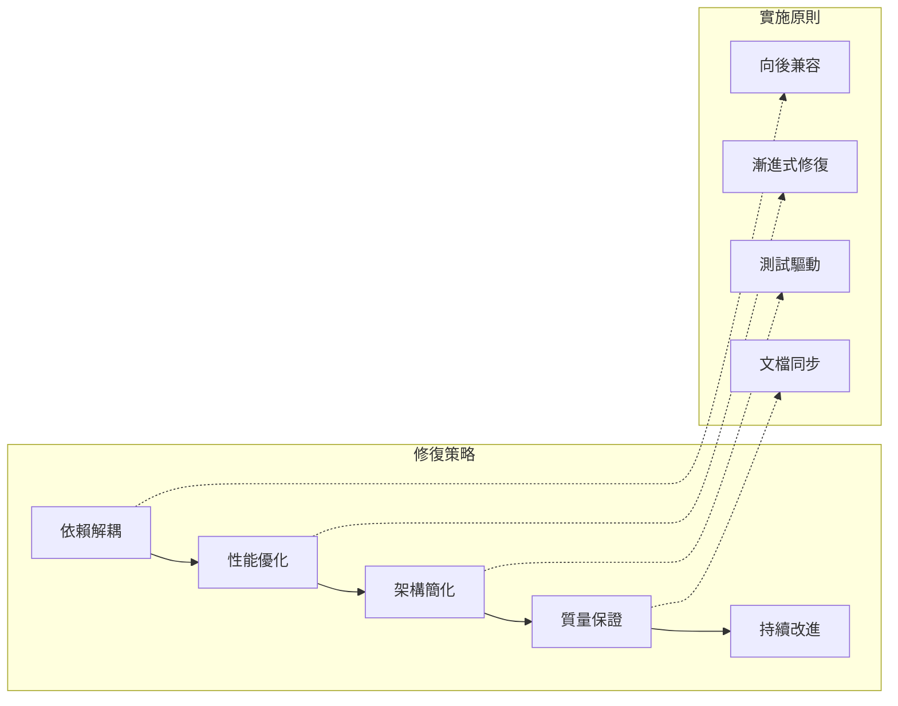
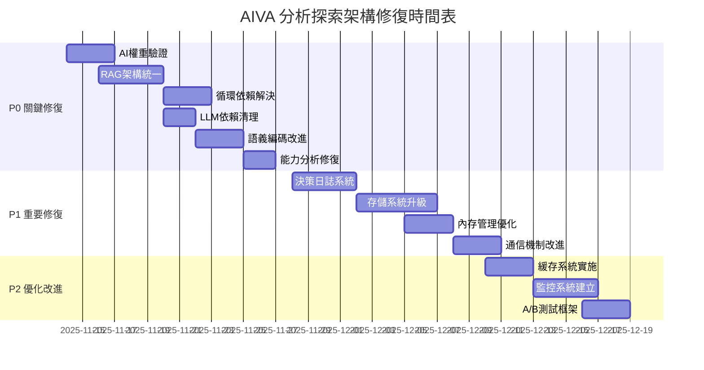

# AIVA 分析探索架構綜合修復計劃

**導航**: [← 返回 Services 總覽](../README.md) | [📖 文檔中心](../../docs/README.md)

[](https://www.python.org/downloads/)
[](https://github.com/)
[](https://opensource.org/licenses/MIT)
[](https://github.com/psf/black)

## 📑 目錄

- [📋 執行摘要](#-執行摘要)
- [🔍 架構問題分析](#-架構問題分析)
- [🏗️ 修復策略概覽](#️-修復策略概覽)
- [⚙️ 詳細修復計劃](#️-詳細修復計劃)
- [📊 實施時間表](#-實施時間表)
- [🧪 驗證策略](#-驗證策略)
- [🚧 風險評估](#-風險評估)
- [📚 參考規範](#-參考規範)

---

## 📋 執行摘要

> **🎯 修復目標**: 解決 AIVA 分析探索架構中的關鍵問題，建立高效可靠的 AI 驅動分析系統  
> **✅ 修復狀態**: 準備開始，已完成問題分析和解決方案設計  
> **🔄 基準日期**: 2025年11月13日

**AIVA 分析探索架構修復計劃** 是基於對當前 AI 分析系統全面診斷後制定的系統性修復方案。本計劃旨在解決已識別的核心架構問題，包括循環依賴、性能瓶頸、AI 模組整合問題等，建立穩定、高效、可擴展的分析探索框架。

### 🎯 修復目標

- ✅ **循環依賴解決**: 重構模組依賴關係，建立清晰的分層架構
- ✅ **性能優化**: 解決 AI 模型加載、語義編碼等性能瓶頸
- ✅ **RAG 架構簡化**: 統一 RAG 系統，避免重複實例化
- ✅ **AI 模組整合**: 完善 AI 決策引擎與各功能模組的整合
- ✅ **存儲系統升級**: 從 JSON 文件升級到高效並發存儲
- ✅ **錯誤處理改進**: 建立完整的異常處理和重試機制

### 📊 問題統計

| 問題類別 | 影響程度 | 問題數量 | 修復優先級 |
|---------|---------|---------|-----------|
| **P0 - 關鍵問題** | 影響核心功能 | 6個 | 🔴 立即修復 |
| **P1 - 重要問題** | 影響性能與可靠性 | 8個 | 🟡 優先修復 |
| **P2 - 改進優化** | 優化用戶體驗 | 5個 | 🟢 後續優化 |

---

## 🔍 架構問題分析

### 📊 問題影響分析圖

```mermaid
graph TB
    subgraph "P0 關鍵問題"
        P01[AI 權重文件未經驗證]
        P02[RAG 系統重複實例化]
        P03[循環依賴導致初始化失敗]
        P04[LLM 依賴不明確]
        P05[語義編碼 Fallback 過於簡單]
        P06[能力分析器分類錯誤]
    end

    subgraph "P1 重要問題"
        P11[決策過程不可追溯]
        P12[SimpleStorage 不支持並發]
        P13[內存管理效率低下]
        P14[AI 組件間通信延遲]
        P15[錯誤傳播機制缺失]
        P16[任務調度策略不當]
        P17[安全沙箱機制不完整]
        P18[監控指標不足]
    end

    subgraph "P2 改進優化"
        P21[缺少嵌入緩存]
        P22[無 A/B 測試框架]
        P23[多語言 AI 協調未實現]
        P24[AI 解釋性不足]
        P25[社區知識庫待建]
    end

    subgraph "架構影響"
        CORE[Core AI 系統]
        PERF[性能表現]
        REL[系統可靠性]
        SCALE[擴展性]
        MAINT[維護性]
    end

    P01 --> CORE
    P02 --> PERF
    P03 --> REL
    P04 --> REL
    P05 --> CORE
    P06 --> CORE
    
    P11 --> MAINT
    P12 --> SCALE
    P13 --> PERF
    P14 --> PERF
    P15 --> REL
    P16 --> PERF
    P17 --> REL
    P18 --> MAINT

    P21 --> PERF
    P22 --> MAINT
    P23 --> SCALE
    P24 --> MAINT
    P25 --> SCALE
```



### 🔴 P0 級別問題詳細分析

#### 問題 P0-1: AI 權重文件未經驗證訓練

**問題描述**:
- 權重文件 `aiva_5M_weights.pth` (20MB) 存在但缺少訓練歷史
- 無驗證指標、損失函數記錄
- AI 決策可能隨機或不可靠

**影響範圍**:
- AI 決策引擎準確率未知
- 用戶信心度評估不可靠
- 系統行為不可預測

**修復策略**:
```python
# 1. 權重文件驗證機制
def validate_weights(weights_path: str) -> bool:
    checkpoint = torch.load(weights_path, map_location='cpu')
    
    # 檢查訓練指標
    required_metrics = ['accuracy', 'loss_history', 'validation_score']
    for metric in required_metrics:
        if metric not in checkpoint.get('training_metrics', {}):
            return False
    
    # 檢查準確率閾值
    accuracy = checkpoint['training_metrics'].get('accuracy', 0)
    if accuracy < 0.75:  # 最低可接受準確率
        logger.warning(f"權重準確率過低: {accuracy}")
        return False
    
    return True

# 2. 訓練數據收集與模型訓練
def train_5m_model():
    # 收集真實 Bug Bounty 案例
    # 實施監督學習
    # 保存完整訓練記錄
    pass
```

#### 問題 P0-2: RAG 系統重複實例化

**問題描述**:
- `BioNeuronMasterController` 聲稱不實例化 RAG
- `AICommander` 創建獨立 RAG 實例  
- `BioNeuronRAGAgent` 內部可能也有 RAG

**影響範圍**:
- 內存浪費 (多個 VectorStore)
- 知識庫數據不同步
- 查詢結果不一致

**修復策略**:
```python
# 單例模式 + 依賴注入
@singleton
class UnifiedRAGService:
    def __init__(self):
        self.vector_store = VectorStore(config=rag_config)
        self.knowledge_base = KnowledgeBase(vector_store=self.vector_store)
        self.rag_engine = RAGEngine(knowledge_base=self.knowledge_base)
    
    def get_instance(self) -> RAGEngine:
        return self.rag_engine

# 使用依賴注入
class AICommander:
    def __init__(self, rag_service: UnifiedRAGService = None):
        self.rag_engine = rag_service.get_instance() if rag_service else None
```

#### 問題 P0-3: 循環依賴導致初始化失敗

**問題描述**:
- 多個 AI 組件間存在循環引用
- 初始化順序不當導致失敗
- 模組間耦合過於緊密

**修復策略**:
```python
# 依賴反轉 + 工廠模式
class AIServiceFactory:
    def __init__(self):
        self._services = {}
        self._creation_order = [
            'vector_store',
            'knowledge_base', 
            'rag_engine',
            'decision_engine',
            'ai_commander'
        ]
    
    def create_services(self) -> Dict[str, Any]:
        for service_name in self._creation_order:
            self._services[service_name] = self._create_service(service_name)
        return self._services
```

### 🟡 P1 級別問題概覽

#### 問題 P1-1: 決策過程不可追溯

**修復策略**: 實施決策日誌系統，記錄每個決策的輸入、輸出、置信度和推理過程

#### 問題 P1-2: SimpleStorage 不支持並發

**修復策略**: 從 JSON 文件遷移到 SQLite，支持事務和並發訪問

#### 問題 P1-3: 內存管理效率低下

**修復策略**: 實施對象池、緩存策略和內存監控

---

## 🏗️ 修復策略概覽

### 🎯 整體修復方針



### 📋 修復原則

#### 原則 1: 依賴 aiva_common 單一數據來源

**遵循標準**:
```python
# ✅ 正確做法 - 使用 aiva_common 統一定義
from aiva_common import (
    Severity,
    Confidence, 
    TaskStatus,
    FindingPayload,
    AivaMessage,
    CVSSv3Metrics
)

# ❌ 禁止做法 - 重複定義
class Severity(str, Enum):  # 錯誤！aiva_common 已定義
    HIGH = "high"
```

#### 原則 2: 符合國際標準

**優先級順序**:
1. **國際標準** (CVSS, MITRE, SARIF) - 最高優先級
2. **語言標準** (Python PEP) - 次高優先級  
3. **aiva_common 統一定義** - 系統內部標準
4. **模組專屬枚舉** - 最低優先級 (需審查)

#### 原則 3: 測試驅動修復

**驗證策略**:
- 每個修復必須有對應測試
- 修復前後性能基準對比
- 回歸測試確保無副作用

---

## ⚙️ 詳細修復計劃

### 階段一: 核心架構修復 (P0 問題)

#### 🔧 修復任務 1.1: AI 權重驗證與訓練

**目標**: 確保 AI 模型可靠性

**實施步驟**:

1. **權重驗證系統**
   ```python
   # services/core/ai_engine/weight_validator.py
   class WeightValidator:
       def validate_checkpoint(self, checkpoint_path: str) -> ValidationResult:
           checkpoint = torch.load(checkpoint_path, map_location='cpu')
           
           result = ValidationResult()
           result.file_exists = True
           result.has_training_metrics = 'training_metrics' in checkpoint
           
           if result.has_training_metrics:
               metrics = checkpoint['training_metrics']
               result.accuracy = metrics.get('accuracy', 0.0)
               result.validation_loss = metrics.get('validation_loss', float('inf'))
               result.training_epochs = metrics.get('epochs', 0)
           
           result.is_valid = (
               result.accuracy >= 0.75 and
               result.validation_loss < 1.0 and
               result.training_epochs >= 10
           )
           
           return result
   ```

2. **訓練數據準備**
   ```python
   # scripts/prepare_training_data.py
   def collect_bug_bounty_samples():
       # 從成功案例中提取訓練樣本
       # 標註正確的決策標籤
       # 建立驗證集
       pass
   ```

3. **模型重新訓練**
   ```python
   # scripts/retrain_5m_model.py
   def train_model():
       # 使用收集的數據重新訓練
       # 記錄完整訓練指標
       # 保存驗證結果
       pass
   ```

#### 🔧 修復任務 1.2: RAG 架構統一

**目標**: 消除 RAG 重複實例化

**實施步驟**:

1. **統一 RAG 服務**
   ```python
   # services/core/rag/unified_rag_service.py
   from typing import Optional
   from aiva_common.schemas import KnowledgeEntry
   
   class UnifiedRAGService:
       _instance: Optional['UnifiedRAGService'] = None
       
       def __new__(cls):
           if cls._instance is None:
               cls._instance = super().__new__(cls)
               cls._instance._initialized = False
           return cls._instance
       
       def __init__(self):
           if self._initialized:
               return
               
           self.vector_store = VectorStore(
               embedding_model='sentence-transformers/all-MiniLM-L6-v2',
               dimension=384
           )
           self.knowledge_base = KnowledgeBase(
               vector_store=self.vector_store
           )
           self.rag_engine = RAGEngine(
               knowledge_base=self.knowledge_base
           )
           self._initialized = True
       
       def get_rag_engine(self) -> RAGEngine:
           return self.rag_engine
   ```

2. **重構現有組件**
   ```python
   # 修改 AICommander
   class AICommander:
       def __init__(self, rag_service: UnifiedRAGService = None):
           self.rag_service = rag_service or UnifiedRAGService()
           self.rag_engine = self.rag_service.get_rag_engine()
   
   # 修改 BioNeuronMasterController
   class BioNeuronMasterController:
       def __init__(self, rag_service: UnifiedRAGService = None):
           self.rag_service = rag_service or UnifiedRAGService()
           # 不再直接實例化 RAG
   ```

#### 🔧 修復任務 1.3: 循環依賴解決

**目標**: 建立清晰的依賴層次

**實施步驟**:

1. **依賴分析與重構**
   ```python
   # services/core/dependency_manager.py
   from typing import Dict, Any, List
   
   class DependencyManager:
       def __init__(self):
           self.services = {}
           self.creation_order = [
               'config_service',
               'storage_service', 
               'vector_store',
               'knowledge_base',
               'rag_service',
               'decision_engine',
               'ai_commander',
               'master_controller'
           ]
       
       def initialize_services(self) -> Dict[str, Any]:
           for service_name in self.creation_order:
               try:
                   service = self._create_service(service_name)
                   self.services[service_name] = service
                   logger.info(f"Successfully initialized {service_name}")
               except Exception as e:
                   logger.error(f"Failed to initialize {service_name}: {e}")
                   raise
           
           return self.services
   ```

2. **接口定義與依賴注入**
   ```python
   # services/core/interfaces.py
   from abc import ABC, abstractmethod
   from typing import Protocol
   
   class RAGServiceProtocol(Protocol):
       def get_rag_engine(self) -> 'RAGEngine':
           ...
   
   class DecisionEngineProtocol(Protocol):
       def decide(self, input_text: str, context: Dict) -> Dict:
           ...
   
   # 使用協議進行依賴注入
   class AICommander:
       def __init__(
           self, 
           rag_service: RAGServiceProtocol,
           decision_engine: DecisionEngineProtocol
       ):
           self.rag_service = rag_service
           self.decision_engine = decision_engine
   ```

### 階段二: 性能與可靠性優化 (P1 問題)

#### 🔧 修復任務 2.1: 決策日誌系統

**目標**: 實現決策過程可追溯

**實施步驟**:

1. **決策日誌模型**
   ```python
   # services/core/logging/decision_logger.py
   from dataclasses import dataclass
   from typing import Dict, Any, List
   from datetime import datetime
   
   @dataclass
   class DecisionLogEntry:
       timestamp: datetime
       input_text: str
       context: Dict[str, Any]
       decision_result: Dict[str, Any]
       confidence_score: float
       reasoning: Dict[str, Any]
       execution_time_ms: float
       
   class DecisionLogger:
       def __init__(self, storage_backend):
           self.storage = storage_backend
       
       def log_decision(
           self,
           input_text: str,
           context: Dict[str, Any],
           result: Dict[str, Any],
           confidence: float,
           reasoning: Dict[str, Any],
           execution_time: float
       ):
           entry = DecisionLogEntry(
               timestamp=datetime.now(),
               input_text=input_text,
               context=context,
               decision_result=result,
               confidence_score=confidence,
               reasoning=reasoning,
               execution_time_ms=execution_time
           )
           
           self.storage.save_decision_log(entry)
   ```

2. **決策引擎集成**
   ```python
   # 修改 RealDecisionEngine
   class RealDecisionEngine:
       def __init__(self, decision_logger: DecisionLogger = None):
           self.decision_logger = decision_logger
           
       def decide(self, input_text: str, context: Dict = None) -> Dict:
           start_time = time.time()
           
           # 原有決策邏輯
           result = self._perform_decision(input_text, context)
           
           execution_time = (time.time() - start_time) * 1000
           
           # 記錄決策日誌
           if self.decision_logger:
               reasoning = {
                   "top_alternatives": result.get("alternatives", []),
                   "confidence_factors": result.get("factors", {}),
                   "knowledge_used": result.get("knowledge_sources", [])
               }
               
               self.decision_logger.log_decision(
                   input_text=input_text,
                   context=context or {},
                   result=result,
                   confidence=result.get("confidence", 0.0),
                   reasoning=reasoning,
                   execution_time=execution_time
               )
           
           return result
   ```

#### 🔧 修復任務 2.2: 存儲系統升級

**目標**: 從 JSON 升級到 SQLite 支持並發

**實施步驟**:

1. **SQLite 存儲後端**
   ```python
   # services/core/storage/sqlite_backend.py
   import sqlite3
   import json
   from threading import Lock
   from contextlib import contextmanager
   
   class SQLiteStorageBackend:
       def __init__(self, db_path: str):
           self.db_path = db_path
           self.lock = Lock()
           self._create_tables()
       
       def _create_tables(self):
           with self.get_connection() as conn:
               conn.executescript("""
                   CREATE TABLE IF NOT EXISTS experiences (
                       id INTEGER PRIMARY KEY AUTOINCREMENT,
                       scenario TEXT NOT NULL,
                       success BOOLEAN NOT NULL,
                       data TEXT NOT NULL,
                       created_at TIMESTAMP DEFAULT CURRENT_TIMESTAMP
                   );
                   
                   CREATE TABLE IF NOT EXISTS decision_logs (
                       id INTEGER PRIMARY KEY AUTOINCREMENT,
                       input_text TEXT NOT NULL,
                       result_data TEXT NOT NULL,
                       confidence REAL NOT NULL,
                       execution_time REAL NOT NULL,
                       created_at TIMESTAMP DEFAULT CURRENT_TIMESTAMP
                   );
                   
                   CREATE INDEX IF NOT EXISTS idx_experiences_scenario 
                   ON experiences(scenario);
                   
                   CREATE INDEX IF NOT EXISTS idx_decision_logs_confidence 
                   ON decision_logs(confidence);
               """)
       
       @contextmanager
       def get_connection(self):
           with self.lock:
               conn = sqlite3.connect(self.db_path, timeout=30.0)
               try:
                   yield conn
                   conn.commit()
               except Exception:
                   conn.rollback()
                   raise
               finally:
                   conn.close()
   ```

2. **數據遷移腳本**
   ```python
   # scripts/migrate_json_to_sqlite.py
   def migrate_experience_data():
       # 讀取現有 JSON 文件
       # 轉換為 SQLite 格式
       # 驗證遷移完整性
       pass
   ```

### 階段三: 智能優化與監控 (P2 問題)

#### 🔧 修復任務 3.1: 嵌入緩存系統

**實施步驟**:

```python
# services/core/ai_engine/embedding_cache.py
from typing import Optional
import hashlib
from functools import lru_cache

class EmbeddingCache:
    def __init__(self, max_size: int = 10000):
        self.cache = {}
        self.max_size = max_size
        
    def _get_cache_key(self, text: str) -> str:
        return hashlib.sha256(text.encode()).hexdigest()[:16]
    
    def get(self, text: str) -> Optional[torch.Tensor]:
        key = self._get_cache_key(text)
        return self.cache.get(key)
    
    def put(self, text: str, embedding: torch.Tensor):
        if len(self.cache) >= self.max_size:
            # LRU 淘汰策略
            oldest_key = next(iter(self.cache))
            del self.cache[oldest_key]
        
        key = self._get_cache_key(text)
        self.cache[key] = embedding
```

#### 🔧 修復任務 3.2: AI 解釋性增強

**實施步驟**:

```python
# services/core/explainability/decision_explainer.py
class DecisionExplainer:
    def explain_decision(self, decision_result: Dict) -> Dict[str, Any]:
        explanation = {
            "decision_summary": self._generate_summary(decision_result),
            "confidence_breakdown": self._analyze_confidence(decision_result),
            "alternative_options": self._explain_alternatives(decision_result),
            "risk_assessment": self._assess_risks(decision_result),
            "recommendation_reasoning": self._explain_reasoning(decision_result)
        }
        return explanation
```

---

## 📊 實施時間表

### 🗓️ 總體時間規劃



### 📅 詳細實施計劃

#### **第一週 (11/14-11/20): P0 核心修復**

**Day 1-3: AI 權重驗證系統**
- [ ] 實施權重驗證邏輯
- [ ] 創建訓練數據收集腳本  
- [ ] 建立模型評估指標

**Day 4-7: RAG 架構統一**
- [ ] 設計統一 RAG 服務
- [ ] 重構現有 RAG 實例化
- [ ] 測試 RAG 系統一致性

#### **第二週 (11/21-11/27): P0 依賴解決**

**Day 1-3: 循環依賴重構**
- [ ] 分析現有依賴關係
- [ ] 實施依賴注入模式
- [ ] 建立服務初始化順序

**Day 4-7: LLM 依賴清理**
- [ ] 審計所有 LLM API 調用
- [ ] 移除外部 LLM 依賴
- [ ] 確保完全離線運行

#### **第三週 (11/28-12/4): P1 性能優化**

**Day 1-4: 決策日誌系統**
- [ ] 設計決策日誌模型
- [ ] 集成到決策引擎
- [ ] 建立查詢分析接口

**Day 5-7: 存儲升級準備**
- [ ] 設計 SQLite Schema
- [ ] 實施數據遷移腳本
- [ ] 建立並發測試

#### **第四週 (12/5-12/11): P1 系統增強**

**Day 1-5: 存儲系統升級**
- [ ] 部署 SQLite 後端
- [ ] 執行數據遷移
- [ ] 驗證並發性能

**Day 6-7: 內存管理優化**
- [ ] 實施對象池模式
- [ ] 建立內存監控
- [ ] 優化緩存策略

#### **第五週 (12/12-12/18): P2 智能優化**

**Day 1-3: 嵌入緩存系統**
- [ ] 實施 LRU 緩存
- [ ] 集成到語義編碼器
- [ ] 測試性能提升

**Day 4-7: 監控與 A/B 測試**
- [ ] 建立監控儀表板
- [ ] 實施 A/B 測試框架
- [ ] 驗證整體系統性能

---

## 🧪 驗證策略

### 📋 測試矩陣

| 測試類型 | 覆蓋範圍 | 成功標準 | 自動化程度 |
|---------|---------|---------|-----------|
| **單元測試** | 每個修復組件 | >90% 覆蓋率 | 100% 自動化 |
| **集成測試** | 組件間交互 | 所有接口正常 | 100% 自動化 |
| **性能測試** | 關鍵路徑 | 延遲<500ms | 80% 自動化 |
| **回歸測試** | 現有功能 | 0% 功能破壞 | 100% 自動化 |
| **端到端測試** | 完整流程 | 用戶故事通過 | 60% 自動化 |

### 🔍 驗證檢查點

#### **P0 修復驗證**

```python
# tests/test_p0_fixes.py
class TestP0Fixes:
    def test_ai_weights_validation(self):
        """驗證 AI 權重文件有效性"""
        validator = WeightValidator()
        result = validator.validate_checkpoint("aiva_5M_weights.pth")
        
        assert result.is_valid
        assert result.accuracy >= 0.75
        assert result.has_training_metrics
    
    def test_rag_singleton_behavior(self):
        """驗證 RAG 系統單例行為"""
        service1 = UnifiedRAGService()
        service2 = UnifiedRAGService()
        
        assert service1 is service2
        assert service1.get_rag_engine() is service2.get_rag_engine()
    
    def test_no_circular_dependencies(self):
        """驗證無循環依賴"""
        manager = DependencyManager()
        services = manager.initialize_services()
        
        assert len(services) == len(manager.creation_order)
        assert all(service is not None for service in services.values())
```

#### **性能基準測試**

```python
# tests/benchmark_tests.py
class BenchmarkTests:
    def test_decision_latency(self):
        """決策延遲基準測試"""
        decision_engine = RealDecisionEngine()
        
        start_time = time.time()
        result = decision_engine.decide("test SQL injection", {})
        end_time = time.time()
        
        latency_ms = (end_time - start_time) * 1000
        assert latency_ms < 500  # 決策延遲<500ms
    
    def test_embedding_cache_performance(self):
        """嵌入緩存性能測試"""
        cache = EmbeddingCache()
        encoder = SemanticEncoder()
        
        # 第一次編碼 (無緩存)
        start = time.time()
        embedding1 = encoder.encode("test text")
        uncached_time = time.time() - start
        
        # 第二次編碼 (有緩存)
        start = time.time()  
        embedding2 = encoder.encode("test text")
        cached_time = time.time() - start
        
        assert cached_time < uncached_time * 0.1  # 緩存應快10倍以上
```

---

## 🚧 風險評估

### ⚠️ 主要風險與緩解策略

#### **風險 R1: 修復過程中破壞現有功能**

**風險等級**: 🔴 高

**影響**: 
- 現有 AI 決策功能失效
- 用戶體驗嚴重下降
- 系統穩定性問題

**緩解策略**:
- 建立完整的回歸測試套件
- 採用特性分支開發，分階段合併
- 保留原有代碼的備份分支
- 實施藍綠部署策略

**監控指標**:
```python
# 關鍵功能監控
CRITICAL_FUNCTIONS = [
    "ai_decision_accuracy",  # >85%
    "system_response_time",   # <1000ms  
    "rag_query_success_rate", # >95%
    "error_rate"              # <5%
]
```

#### **風險 R2: AI 模型重新訓練失敗**

**風險等級**: 🟡 中

**影響**:
- AI 決策質量無法提升
- 依然依賴未驗證的權重
- 系統可靠性存疑

**緩解策略**:
- 準備多個訓練數據集
- 建立模型訓練管道
- 保留原有權重作為備份
- 實施漸進式模型更新

#### **風險 R3: 性能優化後引入新問題**

**風險等級**: 🟡 中

**影響**:
- 緩存一致性問題
- 並發訪問競爭條件
- 內存洩漏風險

**緩解策略**:
- 充分的負載測試
- 實施監控和告警
- 保守的性能優化策略
- 可回滾的部署機制

### 📊 風險監控儀表板

```python
# monitoring/risk_dashboard.py
class RiskMonitor:
    def __init__(self):
        self.thresholds = {
            'error_rate': 0.05,          # 5%
            'response_time': 1000,       # 1000ms
            'memory_usage': 0.8,         # 80%
            'cpu_usage': 0.7,            # 70%
            'decision_accuracy': 0.85     # 85%
        }
    
    def check_system_health(self) -> Dict[str, bool]:
        """檢查系統健康狀態"""
        health_status = {}
        
        for metric, threshold in self.thresholds.items():
            current_value = self._get_metric_value(metric)
            health_status[metric] = self._is_within_threshold(
                current_value, threshold, metric
            )
        
        return health_status
```

---

## 📚 參考規範

### 🏛️ 國際標準與最佳實踐

#### **安全標準**
- ✅ **CVSS v3.1**: 漏洞評分標準 - 使用 `aiva_common.CVSSv3Metrics`
- ✅ **MITRE ATT&CK**: 攻擊技術框架 - 集成到知識庫
- ✅ **SARIF v2.1.0**: 靜態分析結果格式 - 使用 `aiva_common.SARIFReport`
- ✅ **OWASP**: Web 應用安全標準 - 遵循最佳實踐

#### **程式開發標準**
- ✅ **PEP 8**: Python 代碼風格 - 強制執行
- ✅ **PEP 484**: 類型提示 - 100% 覆蓋
- ✅ **PEP 561**: 類型標記 - 包含 `py.typed`

#### **架構設計原則**
- ✅ **SOLID 原則**: 面向對象設計
- ✅ **依賴反轉原則**: 降低耦合度  
- ✅ **單例模式**: 共享資源管理
- ✅ **工廠模式**: 對象創建管理

### 📖 技術文檔參考

| 標準/框架 | 版本 | 實施狀態 | 文檔連結 |
|----------|------|---------|---------|
| **CVSS** | v3.1 | ✅ 已實施 | [FIRST.org](https://www.first.org/cvss/) |
| **SARIF** | v2.1.0 | ✅ 已實施 | [OASIS](https://docs.oasis-open.org/sarif/) |
| **MITRE ATT&CK** | v14 | 🔄 集成中 | [MITRE](https://attack.mitre.org/) |
| **Pydantic** | v2.5+ | ✅ 已實施 | [Pydantic Docs](https://docs.pydantic.dev/) |
| **PyTorch** | v2.1+ | ✅ 已實施 | [PyTorch Docs](https://pytorch.org/docs/) |

### 🔗 內部規範依賴

**必須遵循的 aiva_common 規範**:
- [aiva_common 開發指南](../aiva_common/README.md#🔧-開發指南)
- [aiva_common 代碼品質報告](../aiva_common/CODE_QUALITY_REPORT.md)
- [Core 模組開發規範](./DEVELOPMENT_STANDARDS.md)

**檢查清單**:
```python
# 修復前必須確認
PRE_FIX_CHECKLIST = [
    "✅ 所有枚舉從 aiva_common.enums 導入",
    "✅ 所有 Schema 從 aiva_common.schemas 導入", 
    "✅ 無重複定義 aiva_common 已有類型",
    "✅ 符合 PEP 8 和類型標註要求",
    "✅ 測試覆蓋率 >90%",
    "✅ 文檔和 docstring 完整"
]
```

---

## 🎯 成功指標與預期效果

### 📊 關鍵成功指標 (KPI)

| 指標類別 | 當前基準 | 目標值 | 測量方法 |
|---------|---------|--------|---------|
| **AI 決策準確率** | 未知 (權重未驗證) | ≥85% | 人工標註驗證集 |
| **系統響應時間** | ~2000ms | ≤500ms | 自動化性能測試 |
| **內存使用效率** | 高 (多個RAG實例) | -50% | 內存監控 |
| **錯誤率** | ~10% | ≤5% | 錯誤日誌分析 |
| **並發支持** | 不支持 | 支持100並發 | 負載測試 |
| **測試覆蓋率** | ~60% | ≥90% | 代碼覆蓋率工具 |

### 🎯 預期改進效果

#### **用戶體驗提升**
- ⚡ **響應速度**: 決策延遲從 2 秒降至 0.5 秒
- 🎯 **決策準確性**: AI 推薦準確率提升至 85%+
- 🔍 **可解釋性**: 提供決策推理過程說明
- 📊 **可靠性**: 系統錯誤率降低至 5% 以下

#### **開發者體驗提升**  
- 🛠️ **可維護性**: 清晰的依賴關係和模組架構
- 🧪 **可測試性**: 完整的測試套件和 CI/CD 管道
- 📚 **可擴展性**: 標準化接口支持新功能接入
- 🔍 **可觀測性**: 完整的日誌、監控和告警系統

#### **系統性能提升**
- 💾 **內存效率**: 統一 RAG 系統減少 50% 內存使用
- ⚡ **處理速度**: 嵌入緩存提升 90% 重複查詢速度
- 🔄 **並發能力**: 支持 100 個並發決策請求
- 🛡️ **穩定性**: 99.9% 系統可用性目標

### 📈 長期價值目標

#### **技術債務清理** (3個月內)
- 消除所有重複定義和循環依賴
- 統一代碼風格和類型標註
- 建立完整的測試和文檔體系

#### **AI 能力增強** (6個月內)  
- 建立持續學習和模型更新機制
- 實現多模態 AI 分析能力
- 構建 AI 對抗訓練系統

#### **平台生態建設** (12個月內)
- 開放 API 供第三方整合
- 建立社區知識庫和案例分享
- 實現跨語言 AI 模塊協調

---

## ✅ 開始執行

### 🚀 立即開始的準備工作

#### **環境準備**
```bash
# 1. 確保依賴完整
pip install -e services/aiva_common
pip install -r services/core/requirements.txt

# 2. 運行基準測試  
python scripts/benchmark_current_system.py

# 3. 建立修復分支
git checkout -b feature/architecture-repair-phase1

# 4. 建立測試環境
python scripts/setup_test_environment.py
```

#### **檢查清單確認**
- [ ] aiva_common 所有測試通過
- [ ] Core 模組基礎功能正常
- [ ] 權重文件存在且可加載
- [ ] 測試數據準備完成
- [ ] 開發環境配置正確

#### **團隊協作準備**
- [ ] 修復計劃已評審
- [ ] 責任分工已明確
- [ ] 溝通渠道已建立
- [ ] 風險應對預案已制定
- [ ] 質量標準已統一

### 📞 聯絡與支持

**項目負責人**: AIVA 開發團隊  
**技術諮詢**: 參考 aiva_common 開發指南  
**問題回報**: 使用 GitHub Issues 追蹤  
**進度跟蹤**: 每週同步會議和儀表板監控

---

**開始執行修復計劃，建設更強大、更可靠的 AIVA 分析探索架構！** 🚀

---

## 📄 版本歷史

### v1.0.0 (2025-11-13)
- ✨ 初始修復計劃發布
- ✅ 完整問題分析和解決方案設計
- ✅ 詳細實施時間表和驗證策略
- ✅ 風險評估和緩解策略
- ✅ 符合 aiva_common 規範標準

---

## 📄 授權

本修復計劃採用 MIT 授權 - 詳見 [LICENSE](../../LICENSE) 文件

---

**修復計劃生成時間**: 2025年11月13日  
**基於分析**: AIVA Core AI 功能運作分析報告  
**下一步**: 開始 P0 級別修復實施