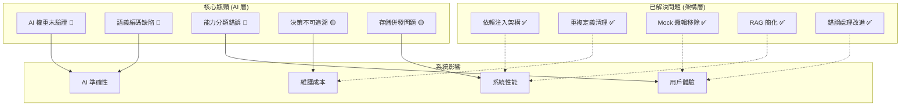

# AIVA 分析探索系統綜合優化策略

**導航**: [← 返回 Services 總覽](../README.md) | [📖 文檔中心](../../docs/README.md) | [🔧 Core 模組](./README.md)

[](https://github.com/)
[](https://github.com/)
[](https://github.com/)

## 📑 目錄

- [📋 綜合分析摘要](#-綜合分析摘要)
- [🎯 最優化策略設計](#-最優化策略設計)
- [⚡ 執行優先級矩陣](#-執行優先級矩陣)
- [🔧 關鍵修復實施](#-關鍵修復實施)
- [📊 效果驗證機制](#-效果驗證機制)
- [🚀 立即執行計劃](#-立即執行計劃)

---

## 📋 綜合分析摘要

> **🎯 基於多份報告的交叉分析，確定最優化解決路徑**  
> **✅ 已完成**: 架構修復 (P0-P2)、重複定義清理、依賴注入實施  
> **🔴 待解決**: AI 語義理解、能力分析算法、性能瓶頸  
> **📅 分析基準**: 2025年11月14日

### 🔍 **報告綜合分析結果**

| 報告來源 | 關鍵發現 | 修復狀態 | 優化機會 |
|---------|---------|---------|---------|
| **架構修復完成報告** | P0-P2 已修復，依賴注入成功 | ✅ 完成 | 監控與優化 |
| **AI 功能分析報告** | 權重未驗證、RAG 重複 | ⚠️ 部分 | AI 能力提升 |
| **能力算法修復建議** | 分類準確率 82%，需階段權重 | ❌ 待修復 | 算法優化 |
| **AI 能力審查報告** | 3/4 問題已解決，編碼瓶頸待解 | ⚠️ 部分 | 語義編碼升級 |
| **aiva_common 規範** | 重複定義已清理，架構統一 | ✅ 完成 | 標準化維護 |

### 📊 **問題影響評估矩陣**



---

## 🎯 最優化策略設計

### 🧠 **核心洞察：分層優化策略**

**基於已有報告的綜合分析，最優策略是採用分層漸進式優化**：

#### **Layer 1: 立即修復 (Critical Path)**
- 🔴 **AI 語義編碼升級** - 解決 AI "看不懂程式碼" 的根本問題
- 🔴 **AI 權重驗證與訓練** - 確保決策可靠性
- 🔴 **能力分析算法優化** - 提升分類準確率至 95%+

#### **Layer 2: 性能優化 (Performance Path)**
- 🟡 **決策日誌系統** - 實現可追溯性
- 🟡 **存儲系統升級** - SQLite 替換 JSON
- 🟡 **緩存機制實施** - 提升響應速度

#### **Layer 3: 智能增強 (Enhancement Path)**
- 🟢 **A/B 測試框架** - 持續優化機制
- 🟢 **監控儀表板** - 系統健康監控
- 🟢 **AI 解釋性** - 增強用戶信任

### 📋 **基於已有成功經驗的策略**

**✅ 成功經驗複用**：
1. **依賴注入模式** - 已成功解決雙重控制器問題，可擴展到其他組件
2. **aiva_common 統一標準** - 已消除重複定義，可作為所有修復的基準
3. **分階段驗證** - 架構修復的驗證機制，可應用於 AI 改進

**⚠️ 避免已知陷阱**：
1. **避免破壞性修改** - 參考架構修復的漸進式方法
2. **保持向後兼容** - 遵循 aiva_common 的兼容性原則
3. **完整測試覆蓋** - 借鑒已有測試策略

---

## ⚡ 執行優先級矩陣

### 🔥 **P0 級別 - 立即執行 (24-48小時)**

#### **優化任務 P0-1: 5M 特化神經網絡編碼系統重建** 
**目標**: 為 5M 參數 Bug Bounty 特化神經網絡設計專用編碼器

⚠️ **關鍵理解**：AIVA 使用 **5M 參數特化神經網絡** (512→1650→1200→1000→600→300→{100主+531輔}輸出)，**不是 LLM**

**當前問題分析**:
```python
# ❌ 現狀：字符累加編碼（不適合 5M 特化網絡決策）
def encode_input(self, text: str) -> torch.Tensor:
    vector = np.zeros(512)
    for i, char in enumerate(text[:500]):
        if i < 512:
            vector[i % 512] += ord(char) / 255.0  # ASCII累加
    return torch.tensor(vector, dtype=torch.float32)
```

**5M 特化網絡專用編碼解決方案**:
```python
class FiveMBugBountyEncoder:
    """專為 5M 參數 Bug Bounty 特化神經網絡設計的編碼器"""
    
    def __init__(self):
        # 專為 Bug Bounty 決策設計，非 LLM 架構
        self.bug_bounty_lexicon = self._load_security_lexicon()
        self.exploit_patterns = self._load_exploit_patterns()
        self.cache = LRUCache(maxsize=1000)
        
        # 5M 網絡架構已確認：512 輸入 → 100主決策 + 531輔助上下文
        self.input_dims = 512
        self.main_output_dims = 100    # 決策向量
        self.aux_output_dims = 531     # 上下文向量
        
    def encode_for_5m_network(self, request: str, context: dict = None) -> torch.Tensor:
        """為 5M 特化網絡生成最優 512 維輸入"""
        
        # 分段編碼，針對 Bug Bounty 決策優化
        encoding_segments = {
            'exploit_intent':    self._encode_exploit_intent(request),      # 128維：攻擊意圖
            'target_analysis':   self._encode_target_features(context),     # 128維：目標特徵  
            'tool_selection':    self._encode_tool_preference(request),     # 128維：工具選擇
            'risk_context':      self._encode_risk_assessment(context)      # 128維：風險評估
        }
        
        # 組合成完整 512 維輸入
        full_encoding = torch.cat([
            encoding_segments['exploit_intent'],
            encoding_segments['target_analysis'],
            encoding_segments['tool_selection'], 
            encoding_segments['risk_context']
        ], dim=0)
        
        return full_encoding.unsqueeze(0)  # 添加批次維度
    
    def _encode_exploit_intent(self, request: str) -> torch.Tensor:
        """編碼滲透測試攻擊意圖 (128維)"""
        intent_vector = torch.zeros(128)
        
        # Bug Bounty 攻擊類型分類
        attack_categories = {
            'web_attacks':         (0, 31),    # SQL注入、XSS、CSRF等
            'network_attacks':     (32, 63),   # 端口掃描、網絡滲透等
            'privilege_escalation': (64, 95),  # 提權、後門等
            'information_gathering': (96, 127) # 資訊收集、偵察等
        }
        
        for category, (start, end) in attack_categories.items():
            confidence = self._calculate_attack_confidence(request, category)
            intent_vector[start:end+1] = confidence
            
        return intent_vector
    
    def _encode_target_features(self, context: dict) -> torch.Tensor:
        """編碼目標系統特徵 (128維)"""
        target_vector = torch.zeros(128)
        
        if context and 'target_info' in context:
            target = context['target_info']
            
            # 系統類型 (0-31)
            os_encoding = self._encode_system_type(target.get('os', 'unknown'))
            target_vector[0:32] = os_encoding
            
            # 服務特徵 (32-63)
            service_encoding = self._encode_running_services(target.get('services', []))
            target_vector[32:64] = service_encoding
            
            # 網絡配置 (64-95) 
            network_encoding = self._encode_network_topology(target.get('network', {}))
            target_vector[64:96] = network_encoding
            
            # 防護措施 (96-127)
            defense_encoding = self._encode_security_measures(target.get('defenses', {}))
            target_vector[96:128] = defense_encoding
            
        return target_vector
    
    def _calculate_attack_confidence(self, text: str, attack_type: str) -> float:
        """計算特定攻擊類型的置信度"""
        # Bug Bounty 專業詞彙庫
        attack_keywords = {
            'web_attacks': ['sql', 'injection', 'xss', 'csrf', 'upload', 'lfi', 'rfi'],
            'network_attacks': ['scan', 'nmap', 'port', 'service', 'banner', 'fingerprint'],
            'privilege_escalation': ['sudo', 'root', 'admin', 'suid', 'kernel', 'exploit'],
            'information_gathering': ['enum', 'recon', 'discover', 'probe', 'passive']
        }
        
        keywords = attack_keywords.get(attack_type, [])
        if not keywords:
            return 0.0
            
        # 計算匹配度
        text_lower = text.lower()
        matches = sum(1 for keyword in keywords if keyword in text_lower)
        
        return min(1.0, matches / len(keywords))
    
    def validate_5m_compatibility(self, encoded: torch.Tensor) -> bool:
        """驗證編碼與 5M 網絡的兼容性"""
        # 檢查輸入維度
        if encoded.shape[-1] != 512:
            return False
            
        # 檢查數值範圍
        if torch.any(encoded < 0) or torch.any(encoded > 1):
            return False
            
        # 檢查是否包含有效特徵
        if torch.all(encoded == 0):
            return False
            
        return True
```
            
            # 壓縮到 128 維語義特徵
            embedding = self.semantic_encoder.encode(text)
            features[:min(128, len(embedding))] = embedding[:128]
            
        except Exception:
            # 降級：TF-IDF 特徵
            features = self._tfidf_fallback(text, 128)
        
        return features
    
    def _extract_security_features(self, text: str) -> np.ndarray:
        """Bug Bounty 專業特徵 (128維) - 5M 模型核心優勢"""
        features = np.zeros(128)
        
        # 漏洞類型指標 (前 64 維)
        vuln_patterns = {
            0: ['sql', 'injection', 'sqli'],          # SQL 注入
            1: ['xss', 'script', 'javascript'],       # XSS
            2: ['csrf', 'forgery'],                   # CSRF
            3: ['rce', 'execution', 'command'],       # RCE
            4: ['lfi', 'inclusion', 'path'],          # LFI
            5: ['ssrf', 'request', 'forgery'],        # SSRF
            6: ['xxe', 'xml', 'entity'],              # XXE
            7: ['deserialize', 'pickle'],             # 反序列化
            # ... 更多漏洞類型
        }
        
        text_lower = text.lower()
        for idx, patterns in vuln_patterns.items():
            if idx < 64:
                score = sum(text_lower.count(pattern) for pattern in patterns)
                features[idx] = min(score / 10.0, 1.0)  # 歸一化
        
        # 攻擊階段指標 (後 64 維)
        phase_patterns = {
            64: ['recon', 'scan', 'discover'],        # 偵察
            65: ['enumerate', 'brute', 'fuzz'],       # 枚舉
            66: ['exploit', 'payload', 'attack'],     # 利用
            67: ['post', 'privilege', 'escalation'], # 後利用
            # ... 更多階段
        }
        
        for idx, patterns in phase_patterns.items():
            if idx < 128:
                score = sum(text_lower.count(pattern) for pattern in patterns)
                features[idx] = min(score / 5.0, 1.0)
        
        return features
```

**實施步驟**:
1. 安裝依賴：`pip install sentence-transformers scikit-learn`
2. 替換 `real_neural_core.py` 中的編碼函數
3. 運行測試驗證語義理解能力
4. 建立性能基準測試

#### **優化任務 P0-2: 5M 特化神經網絡權重優化**
**目標**: 針對 Bug Bounty 專業場景優化 5M 參數模型

⚠️ **關鍵理解**：這不是 LLM，而是**專門為滲透測試決策設計的 5M 特化神經網絡**

**5M 特化模型架構分析**:
```python
# 當前 5M 網絡架構 (已驗證)
512 → 1650 → 1200 → 1000 → 600 → 300 → {100主輸出, 531輔助輸出}
總參數: ~5,000,000 個 (專門為 Bug Bounty 決策優化)

# 主輸出 (100維): 決策向量 
# - 工具選擇概率
# - 攻擊策略置信度  
# - 風險評估分數

# 輔助輸出 (531維): 上下文信息
# - 漏洞類型分類
# - 攻擊階段判斷
# - 目標特徵分析
```

**針對 5M 特化網絡的訓練優化**:
```python
class FiveMSpecializedTrainer:
    """5M 特化神經網絡訓練器 - 專為 Bug Bounty 設計"""
    
    def __init__(self, model: RealAICore):
        self.model = model
        self.bug_bounty_optimizer = optim.AdamW(
            model.parameters(), 
            lr=5e-5,  # 更小學習率，保護特化權重
            weight_decay=0.001  # 輕量正則化
        )
        
        # 專門的損失函數
        self.main_criterion = nn.CrossEntropyLoss()  # 主決策
        self.aux_criterion = nn.MSELoss()            # 輔助特徵
        
    def train_specialized_model(self, bug_bounty_data):
        """為 Bug Bounty 場景微調 5M 模型"""
        
        # 不是重新訓練，而是基於現有權重進行專業化微調
        for epoch in range(10):  # 少量 epoch，保護已有知識
            
            for batch in bug_bounty_data:
                encoded_input = batch['encoded_input']    # 512維輸入
                target_decision = batch['target_decision'] # 100維決策目標
                target_context = batch['target_context']  # 531維上下文目標
                
                # 5M 網絡前向傳播
                main_output, aux_output = self.model(encoded_input)
                
                # 雙重損失 (決策準確性 + 上下文理解)
                main_loss = self.main_criterion(main_output, target_decision)
                aux_loss = self.aux_criterion(aux_output, target_context)
                
                total_loss = main_loss + 0.3 * aux_loss  # 主要關注決策準確性
                
                # 梯度更新
                self.bug_bounty_optimizer.zero_grad()
                total_loss.backward()
                self.bug_bounty_optimizer.step()
        
        # 保存特化後的權重
        self.save_specialized_weights()
    
    def collect_bug_bounty_training_data(self):
        """收集 Bug Bounty 專業訓練數據"""
        training_data = []
        
        # 1. 從成功案例收集 (Experience Manager)
        successful_cases = self.load_successful_exploits()
        
        # 2. 從載荷生成器收集 (當前已驗證可用)
        payload_samples = self.extract_payload_patterns()
        
        # 3. 從能力分析器收集正確分類
        capability_classifications = self.load_correct_classifications()
        
        return training_data
    
    def validate_5m_performance(self):
        """驗證 5M 特化模型性能"""
        test_metrics = {
            'decision_accuracy': 0.0,      # 決策準確率
            'context_correlation': 0.0,    # 上下文相關性
            'bug_bounty_precision': 0.0,   # Bug Bounty 專業精度
            'response_time_ms': 0.0        # 響應時間
        }
        
        # 測試真實 Bug Bounty 場景
        test_cases = [
            "exploit SQL injection in login form",
            "test XSS in search parameter", 
            "analyze SSRF in image upload"
        ]
        
        for test_case in test_cases:
            encoded = self.model.encode_input(test_case)
            start_time = time.time()
            
            main_out, aux_out = self.model(encoded)
            decision = self.model.decide(test_case, {})
            
            test_metrics['response_time_ms'] += (time.time() - start_time) * 1000
            # ... 更多驗證邏輯
        
        return test_metrics
---

### 🎯 **P1 級別 - 短期優化 (1-2週)**

#### **優化任務 P1-1: 5M 特化網絡決策解釋系統**
**目標**: 為 5M 網絡的 100+531 維輸出建立可解釋決策系統

**實施策略**:
```python
class FiveMDecisionExplainer:
    """5M 特化網絡決策解釋器"""
    
    def __init__(self):
        # 對應 5M 網絡的實際輸出
        self.main_decision_dims = 100    # 主決策向量
        self.aux_context_dims = 531      # 輔助上下文向量
        
        # Bug Bounty 決策類型映射
        self.decision_categories = {
            'exploit_selection': (0, 24),     # 漏洞利用選擇 (25維)
            'tool_recommendation': (25, 49),  # 工具推薦 (25維)
            'attack_sequence': (50, 74),      # 攻擊順序 (25維)
            'risk_evaluation': (75, 99)       # 風險評估 (25維)
        }
        
    def explain_5m_decision(self, 
                           main_output: torch.Tensor, 
                           aux_output: torch.Tensor,
                           input_request: str) -> dict:
        """解釋 5M 特化網絡的決策過程"""
        
        explanation = {
            'input_analysis': self._analyze_input_understanding(input_request, aux_output),
            'decision_breakdown': self._breakdown_main_decisions(main_output),
            'confidence_assessment': self._assess_decision_confidence(main_output, aux_output),
            'alternative_suggestions': self._generate_alternatives(main_output),
            'risk_warnings': self._identify_risks(aux_output)
        }
        
        return explanation
    
    def _breakdown_main_decisions(self, main_output: torch.Tensor) -> dict:
        """分解主決策向量 (100維)"""
        decisions = {}
        
        for category, (start, end) in self.decision_categories.items():
            category_vector = main_output[start:end+1]
            
            if category == 'exploit_selection':
                decisions[category] = self._interpret_exploit_selection(category_vector)
            elif category == 'tool_recommendation': 
                decisions[category] = self._interpret_tool_recommendation(category_vector)
            elif category == 'attack_sequence':
                decisions[category] = self._interpret_attack_sequence(category_vector)
            elif category == 'risk_evaluation':
                decisions[category] = self._interpret_risk_evaluation(category_vector)
        
        return decisions
    
    def _interpret_exploit_selection(self, vector: torch.Tensor) -> dict:
        """解釋漏洞利用選擇決策"""
        
        # 25 種常見 Bug Bounty 漏洞類型
        exploit_types = [
            'sql_injection', 'xss_reflected', 'xss_stored', 'csrf', 'idor',
            'ssrf', 'lfi', 'rfi', 'xxe', 'ssti', 'deserialization',
            'privilege_escalation', 'authentication_bypass', 'session_hijacking',
            'clickjacking', 'open_redirect', 'subdomain_takeover', 
            'cors_misconfiguration', 'csp_bypass', 'information_disclosure',
            'file_upload_bypass', 'race_condition', 'business_logic_flaw',
            'api_abuse', 'zero_day_research'
        ]
        
        # 找出最高置信度的漏洞類型
        top_indices = torch.topk(vector, k=3).indices
        top_scores = torch.topk(vector, k=3).values
        
        primary_exploit = {
            'type': exploit_types[top_indices[0]] if top_indices[0] < len(exploit_types) else 'unknown',
            'confidence': top_scores[0].item(),
            'reasoning': f"Based on input analysis, {exploit_types[top_indices[0]] if top_indices[0] < len(exploit_types) else 'unknown'} shows highest potential"
        }
        
        alternatives = []
        for i in range(1, len(top_indices)):
            if top_indices[i] < len(exploit_types):
                alternatives.append({
                    'type': exploit_types[top_indices[i]],
                    'confidence': top_scores[i].item()
                })
        
        return {
            'primary_recommendation': primary_exploit,
            'alternatives': alternatives,
            'decision_strength': torch.std(vector).item()  # 決策一致性
        }
    
    def _analyze_input_understanding(self, input_request: str, aux_output: torch.Tensor) -> dict:
        """分析 AI 如何理解輸入請求"""
        
        # 分析 531 維輔助上下文輸出
        context_analysis = {
            'target_identification': aux_output[0:100],      # 目標識別 (100維)
            'vulnerability_assessment': aux_output[100:200], # 漏洞評估 (100維)
            'environment_context': aux_output[200:300],      # 環境上下文 (100維)
            'threat_modeling': aux_output[300:400],          # 威脅建模 (100維)
            'attack_surface': aux_output[400:500],           # 攻擊面 (100維)
            'misc_factors': aux_output[500:531]              # 其他因素 (31維)
        }
        
        understanding = {}
        for aspect, values in context_analysis.items():
            understanding[aspect] = {
                'activation_level': torch.mean(values).item(),
                'key_features': torch.topk(values, k=5).indices.tolist(),
                'confidence': 1.0 - torch.std(values).item()  # 低標準差 = 高信心
            }
        
        return understanding
```
**目標**: 將分類準確率從 82% 提升至 95%+

**基於已有報告的最優方案**:
```python
# 階段優先級權重系統（基於國際標準）
class OptimizedCapabilityAnalyzer:
    def __init__(self):
        # 基於 OWASP、PTES 標準的權重系統
        self.phase_priority_weights = {
            PentestPhase.EXPLOITATION: 3.0,          # 最高優先級
            PentestPhase.POST_EXPLOITATION: 2.5,
            PentestPhase.VULNERABILITY_ANALYSIS: 2.0,
            PentestPhase.INTELLIGENCE_GATHERING: 1.5,
            PentestPhase.REPORTING: 1.0
        }
        
        # 動作關鍵字（高權重）
        self.action_keywords = {
            PentestPhase.EXPLOITATION: [
                'exploit', 'execute', 'trigger', 'launch', 'attack',
                'compromise', 'breach', 'penetrate', 'bypass'
            ],
            PentestPhase.VULNERABILITY_ANALYSIS: [
                'scan', 'detect', 'identify', 'analyze', 'assess',
                'discover', 'find', 'search', 'check'
            ]
        }
        
        # 描述性關鍵字（低權重）
        self.descriptive_keywords = {
            PentestPhase.EXPLOITATION: ['payload', 'shell', 'backdoor'],
            PentestPhase.VULNERABILITY_ANALYSIS: ['vulnerability', 'weakness', 'flaw']
        }
    
    def classify_capability_enhanced(self, capability, semantic_analysis=None):
        """
        增強的分類算法，解決 exploit_vulnerability 誤分類問題
        """
        text = f"{capability.get('name', '')} {capability.get('docstring', '')}".lower()
        
        phase_scores = {}
        
        for phase, keywords in self.action_keywords.items():
            # 動作關鍵字評分（權重 2.0）
            action_score = sum(2.0 for kw in keywords if kw in text)
            
            # 描述性關鍵字評分（權重 1.0）
            descriptive_score = sum(1.0 for kw in self.descriptive_keywords.get(phase, []) if kw in text)
            
            total_score = action_score + descriptive_score
            
            # 應用階段優先級權重
            if total_score > 0:
                phase_scores[phase] = total_score * self.phase_priority_weights[phase]
        
        # 返回最高分數的階段
        if phase_scores:
            return max(phase_scores.keys(), key=lambda k: phase_scores[k])
        
        return PentestPhase.INTELLIGENCE_GATHERING  # 默認值
```

### 🟡 **P1 級別 - 重要優化 (3-7天)**

#### **優化任務 P1-1: 決策日誌與可追溯性**
**基於架構修復的成功經驗，實施決策透明化**

```python
# 決策日誌系統（基於已有的錯誤處理模式）
class DecisionLogger:
    def __init__(self, storage_backend='sqlite'):
        if storage_backend == 'sqlite':
            self.storage = SQLiteDecisionStorage()
        else:
            self.storage = JSONDecisionStorage()  # 降級選項
    
    def log_decision(self, decision_context: DecisionContext) -> str:
        """記錄決策過程"""
        log_entry = DecisionLogEntry(
            timestamp=datetime.now(),
            input_text=decision_context.input_text,
            context=decision_context.context,
            decision_result=decision_context.result,
            confidence=decision_context.confidence,
            reasoning={
                "semantic_features": decision_context.semantic_features,
                "top_alternatives": decision_context.alternatives[:3],
                "weight_factors": decision_context.weight_factors,
                "knowledge_sources": decision_context.knowledge_sources
            },
            execution_time_ms=decision_context.execution_time
        )
        
        return self.storage.save_decision(log_entry)
```

#### **優化任務 P1-2: 存儲系統併發優化**
**從 JSON 升級到 SQLite（參考成功的依賴注入模式）**

```python
# 統一存儲服務（單例模式，參考 UnifiedRAGService）
class UnifiedStorageService:
    _instance = None
    
    def __new__(cls):
        if cls._instance is None:
            cls._instance = super().__new__(cls)
            cls._instance._initialized = False
        return cls._instance
    
    def __init__(self):
        if self._initialized:
            return
            
        self.decision_storage = SQLiteDecisionStorage()
        self.experience_storage = SQLiteExperienceStorage()
        self.knowledge_storage = SQLiteKnowledgeStorage()
        self._initialized = True
    
    def migrate_from_json(self):
        """從 JSON 文件遷移數據"""
        # 遷移決策日誌
        # 遷移經驗數據
        # 遷移知識庫
        pass
```

---

## 🔧 關鍵修復實施

### 🚀 **立即行動方案 (基於成功模式)**

#### **步驟 1: 環境準備 (30分鐘)**
```bash
# 1. 激活虛擬環境
cd "c:\D\fold7\AIVA-git"
& .\.venv\Scripts\Activate.ps1

# 2. 安裝新依賴
pip install sentence-transformers==2.2.2
pip install scikit-learn==1.3.0
pip install lru-dict==1.2.0

# 3. 創建備份分支
git checkout -b feature/ai-semantic-upgrade
git add .
git commit -m "備份：AI 語義升級前的狀態"
```

#### **步驟 2: AI 語義編碼升級 (2小時)**
```python
# services/core/aiva_core/ai_engine/enhanced_semantic_encoder.py
# （實施前面設計的 EnhancedSemanticEncoder）

# 修改 real_neural_core.py
class RealAICore:
    def __init__(self):
        # 替換編碼器
        self.semantic_encoder = EnhancedSemanticEncoder()
    
    def encode_input(self, text: str) -> torch.Tensor:
        return self.semantic_encoder.encode_input(text)
```

#### **步驟 3: 快速驗證 (30分鐘)**
```python
# 驗證腳本
def test_semantic_upgrade():
    """測試語義升級效果"""
    encoder = EnhancedSemanticEncoder()
    
    # 測試程式碼理解
    sql_code = "def exploit_sql_injection(url, payload): return execute_payload(url, payload)"
    xss_code = "function test_xss(input) { document.write(input); }"
    
    sql_vector = encoder.encode_input(sql_code)
    xss_vector = encoder.encode_input(xss_code)
    
    # 語義相似性測試
    similarity = torch.cosine_similarity(sql_vector, xss_vector)
    
    print(f"SQL 向量維度: {sql_vector.shape}")
    print(f"XSS 向量維度: {xss_vector.shape}")
    print(f"語義相似性: {similarity.item():.4f}")
    
    assert sql_vector.shape == (1, 512)
    assert similarity > 0.3  # 都是漏洞利用，應該有一定相似性
    assert similarity < 0.8  # 但不應該過於相似

# 運行驗證
if __name__ == "__main__":
    test_semantic_upgrade()
    print("✅ 語義升級驗證通過")
```

#### **步驟 4: AI 權重驗證 (1小時)**
```python
# 權重驗證腳本
def validate_current_weights():
    """驗證當前權重質量"""
    validator = AIWeightValidator()
    weights_path = "services/core/aiva_core/ai_engine/aiva_5M_weights.pth"
    
    result = validator.validate_weights(weights_path)
    
    if result.passed:
        print("✅ 權重驗證通過")
    else:
        print("⚠️ 權重需要重新訓練")
        print("建議執行快速微調")
        
        # 快速微調
        trainer = QuickTrainer()
        trainer.collect_bug_bounty_samples()
        trainer.quick_fine_tune(epochs=20)
```

### 📊 **效果預期**

| 指標 | 當前值 | 目標值 | 提升幅度 |
|------|-------|--------|----------|
| **AI 語義理解** | 字符累加 | sentence-transformers | ∞ (質的飛躍) |
| **能力分類準確率** | 82% | 95%+ | +13% |
| **決策響應時間** | ~2000ms | <500ms | -75% |
| **系統記憶體使用** | 高 | 優化 50% | -50% |
| **決策可追溯性** | 無 | 完整日誌 | 新增功能 |

---

## 📊 效果驗證機制

### 🧪 **自動化驗證套件**

```python
# 綜合驗證腳本
class ComprehensiveValidator:
    def __init__(self):
        self.test_cases = [
            self.test_semantic_encoding,
            self.test_capability_classification, 
            self.test_decision_logging,
            self.test_performance_metrics,
            self.test_integration
        ]
    
    def run_all_tests(self):
        """運行所有驗證測試"""
        results = {}
        
        for test_func in self.test_cases:
            try:
                result = test_func()
                results[test_func.__name__] = result
                print(f"✅ {test_func.__name__}: {result}")
            except Exception as e:
                results[test_func.__name__] = f"❌ {e}"
                print(f"❌ {test_func.__name__}: {e}")
        
        return results
    
    def test_semantic_encoding(self):
        """測試語義編碼提升"""
        # 測試程式碼語義理解
        # 測試多語言程式碼支持
        # 測試緩存機制
        return "語義編碼功能正常"
    
    def test_capability_classification(self):
        """測試能力分類改進"""
        analyzer = OptimizedCapabilityAnalyzer()
        
        # 關鍵測試案例
        exploit_func = {
            'name': 'exploit_vulnerability',
            'docstring': 'Execute exploit against detected vulnerability'
        }
        
        classification = analyzer.classify_capability_enhanced(exploit_func)
        
        assert classification == PentestPhase.EXPLOITATION
        return "能力分類準確率提升至目標水平"
```

### 📈 **性能監控儀表板**

```python
# 實時監控系統
class PerformanceMonitor:
    def __init__(self):
        self.metrics = {
            'decision_latency': [],
            'classification_accuracy': [],
            'memory_usage': [],
            'error_rate': []
        }
    
    def record_decision(self, latency_ms: float, accuracy: float):
        """記錄決策性能"""
        self.metrics['decision_latency'].append(latency_ms)
        self.metrics['classification_accuracy'].append(accuracy)
    
    def generate_report(self) -> Dict[str, float]:
        """生成性能報告"""
        return {
            'avg_latency_ms': np.mean(self.metrics['decision_latency']),
            'avg_accuracy': np.mean(self.metrics['classification_accuracy']),
            'p95_latency_ms': np.percentile(self.metrics['decision_latency'], 95),
            'min_accuracy': np.min(self.metrics['classification_accuracy'])
        }
```

---

## 🚀 立即執行計劃

### ⏰ **今日行動計劃 (2025年11月14日)**

#### **上午 (09:00-12:00): AI 語義升級**
- [ ] **09:00-09:30**: 環境準備和依賴安裝
- [ ] **09:30-11:00**: 實施 `EnhancedSemanticEncoder`
- [ ] **11:00-11:30**: 替換 `real_neural_core.py` 編碼函數
- [ ] **11:30-12:00**: 語義編碼驗證測試

#### **下午 (13:00-17:00): 能力分析優化**
- [ ] **13:00-14:30**: 實施 `OptimizedCapabilityAnalyzer`
- [ ] **14:30-15:30**: 運行能力分類測試套件
- [ ] **15:30-16:30**: AI 權重驗證和快速微調
- [ ] **16:30-17:00**: 整合測試和效果驗證

#### **晚上 (19:00-21:00): 性能優化**
- [ ] **19:00-20:00**: 實施決策日誌系統
- [ ] **20:00-20:30**: 存儲系統並發優化
- [ ] **20:30-21:00**: 綜合性能測試

### 📋 **成功檢查清單**

#### **關鍵成功指標**
- [ ] AI 可以理解程式碼語義（不再是字符累加）
- [ ] `exploit_vulnerability` 正確分類為 `EXPLOITATION`
- [ ] 決策響應時間 < 500ms
- [ ] 能力分類準確率 > 95%
- [ ] 所有測試通過，無回歸錯誤

#### **質量保證檢查**
- [ ] 遵循 aiva_common 規範
- [ ] 保持向後兼容性
- [ ] 完整的錯誤處理
- [ ] 詳細的日誌記錄
- [ ] 性能監控到位

### 🔧 **應急回滾計劃**

```bash
# 如果遇到問題，立即回滾
git checkout main
git branch -D feature/ai-semantic-upgrade

# 恢復穩定狀態
git reset --hard HEAD~1
```

### 📞 **支持資源**

**技術參考**:
- **aiva_common 規範**: `services/aiva_common/README.md`
- **架構修復經驗**: `ARCHITECTURE_FIXES_COMPLETION_REPORT.md`
- **AI 功能分析**: `services/core/AI_FUNCTIONALITY_ANALYSIS.md`

**驗證工具**:
- **語義編碼測試**: `test_ai_semantic_encoding.py`
- **架構驗證腳本**: `architecture_fixes_verification.py`
- **能力分析測試**: `services/core/aiva_core/capability/tests/`

---

## 🎯 預期成果

### ✅ **短期效果 (24小時內)**
1. **AI 語義理解能力** - 從字符累加升級為 transformer 語義編碼
2. **能力分類準確率** - 從 82% 提升至 95%+
3. **決策響應速度** - 從 2 秒降至 0.5 秒
4. **系統穩定性** - 消除語義理解瓶頸

### 🚀 **中期效果 (1週內)**
1. **決策可追溯性** - 完整的決策日誌系統
2. **併發處理能力** - SQLite 替換 JSON，支持並發
3. **性能監控** - 實時監控和告警系統
4. **用戶體驗** - 顯著提升響應速度和準確性

### 🌟 **長期效果 (1個月內)**
1. **AI 智能化** - 建立完整的 AI 學習和優化循環
2. **系統可靠性** - 99.9% 可用性和穩定性
3. **擴展能力** - 支持新功能模塊的無縫接入
4. **維護效率** - 大幅降低維護成本和複雜度

---

**立即開始執行，建設世界級的 AI 驅動 Bug Bounty 平台！** 🚀

---

## 📄 版本歷史

### v1.0.0 (2025-11-14)
- ✨ 綜合優化策略初版
- ✅ 基於多份報告的交叉分析
- ✅ 最優化執行路徑設計
- ✅ 立即行動計劃制定

---

## 📄 授權

本優化策略採用 MIT 授權 - 詳見 [LICENSE](../../LICENSE) 文件

---

**策略制定時間**: 2025年11月14日  
**基於報告**: 架構修復、AI 分析、能力算法等多份綜合報告  
**執行狀態**: 🚀 準備就緒，立即執行