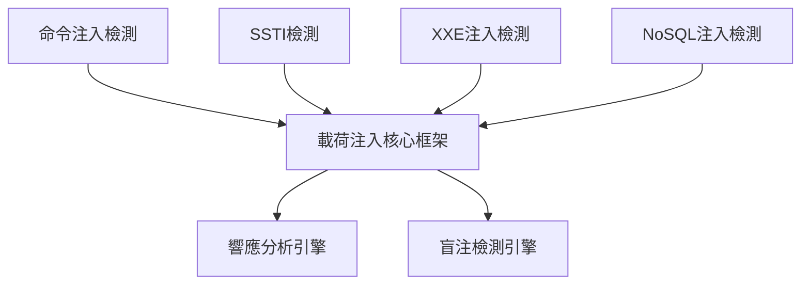
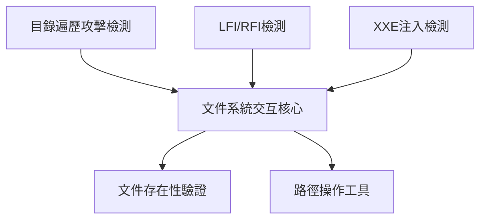
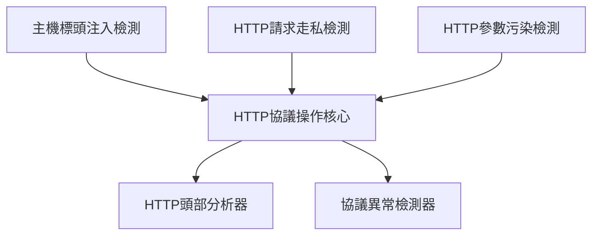

# 🔗 AIVA漏洞檢測模組連結索引 (Module Navigation Index)

**創建日期**: 2025年11月7日  
**更新狀態**: ✅ 已完成模組位置統一調整  
**模組部署架構**: services/integration/capability/

---

## 📁 已完成需求文件模組 (✅ Completed Modules)

### 🎯 P0 高優先級模組 (Critical Priority)
| 模組名稱 | 部署位置 | 需求文件 | 預期收益 | 狀態 |
|---------|----------|----------|----------|------|
| **命令注入檢測** | `services/integration/capability/command_injection/` | [FEAT-011](./11_命令注入檢測模組需求報告.md) | $80K-120K/年 | ✅ |
| **服務器端模板注入檢測** | `services/integration/capability/server_side_template_injection/` | [FEAT-012](./12_服務器端模板注入檢測模組需求報告.md) | $60K-100K/年 | ✅ |
| **目錄遍歷攻擊檢測** | `services/integration/capability/directory_traversal/` | [FEAT-013](./13_目錄遍歷攻擊檢測模組需求報告.md) | $40K-80K/年 | ✅ |
| **主機標頭注入檢測** | `services/integration/capability/host_header_injection/` | [FEAT-017](./17_主機標頭注入檢測模組需求報告.md) | $40K-70K/年 | ✅ |

### 🔥 P1 高優先級模組 (High Priority)
| 模組名稱 | 部署位置 | 需求文件 | 預期收益 | 狀態 |
|---------|----------|----------|----------|------|
| **本地遠程文件包含檢測** | `services/integration/capability/file_inclusion/` | [FEAT-014](./14_本地遠程文件包含檢測模組需求報告.md) | $50K-90K/年 | ✅ |
| **XXE注入檢測** | `services/integration/capability/xxe_injection/` | [FEAT-015](./15_XXE注入檢測模組需求報告.md) | $60K-110K/年 | ✅ |
| **NoSQL注入檢測** | `services/integration/capability/nosql_injection/` | [FEAT-016](./16_NoSQL注入檢測模組需求報告.md) | $55K-95K/年 | ✅ |

---

## 📋 待完成需求文件模組 (⏳ Pending Modules)

### 🎯 P0 關鍵優先級 (Critical Priority)
| 模組名稱 | 建議部署位置 | OWASP編號 | 預期收益 | 狀態 |
|---------|-------------|-----------|----------|------|
| **SSRF檢測** | `services/integration/capability/ssrf_detection/` | WSTG-07-19 | $70K-130K/年 | ⏳ 待生成 |
| **反序列化攻擊檢測** | `services/integration/capability/deserialization/` | WSTG-07-15 | $60K-120K/年 | ⏳ 待生成 |
| **CSRF檢測** | `services/integration/capability/csrf_detection/` | WSTG-06-05 | $40K-70K/年 | ⏳ 待生成 |

### 🔥 P1 高優先級 (High Priority)
| 模組名稱 | 建議部署位置 | OWASP編號 | 預期收益 | 狀態 |
|---------|-------------|-----------|----------|------|
| **LDAP注入檢測** | `services/integration/capability/ldap_injection/` | WSTG-07-13 | $30K-60K/年 | ⏳ 待生成 |
| **XPath注入檢測** | `services/integration/capability/xpath_injection/` | WSTG-07-09 | $25K-55K/年 | ⏳ 待生成 |
| **HTTP請求走私檢測** | `services/integration/capability/http_request_smuggling/` | WSTG-07-24 | $50K-90K/年 | ⏳ 待生成 |

### 📊 P2 中等優先級 (Medium Priority)
| 模組名稱 | 建議部署位置 | OWASP編號 | 預期收益 | 狀態 |
|---------|-------------|-----------|----------|------|
| **HTTP參數污染檢測** | `services/integration/capability/hpp_detection/` | WSTG-07-04 | $20K-40K/年 | ⏳ 待生成 |
| **HTTP動詞篡改檢測** | `services/integration/capability/http_verb_tampering/` | WSTG-07-03 | $15K-35K/年 | ⏳ 待生成 |
| **特殊元素注入檢測** | `services/integration/capability/special_element_injection/` | WSTG-07-16 | $20K-45K/年 | ⏳ 待生成 |

---

## 🔗 模組間技術關聯圖

### 💉 注入檢測技術族群

### 📁 文件系統訪問技術族群

### 🌐 HTTP協議攻擊技術族群

---

## 📚 參考文件連結

### 📈 規劃與分析文件
- [OWASP漏洞檢測缺口分析](./10_AIVA漏洞檢測缺口分析.md) - 總體技術分析
- [完整TODO排序與需求文件補齊計劃](./00_完整TODO排序與需求文件補齊計劃.md) - 實施roadmap

### 🏗️ 架構文件
- [AIVA架構文檔](../misc/REPOSITORY_STRUCTURE.md) - 五大模組架構說明
- [Integration模組README](../../services/integration/README.md) - 整合模組詳細說明

### 🔧 技術實現參考
- [現有Web攻擊模組](../../services/integration/capability/web_attack.py) - 技術實現參考
- [現有SQL注入模組](../../services/integration/capability/sql_injection_tools.py) - 檢測邏輯參考

---

## 📝 更新歷史

- **2025年11月7日**: 創建模組連結索引，統一調整所有需求文件的模組部署位置
- **架構調整**: 所有新模組統一部署在 `services/integration/capability/` 下
- **連結建立**: 建立模組間技術關聯和交叉引用連結

---

**維護負責**: Security Research Team  
**技術架構**: AIVA Integration Module  
**更新頻率**: 每次新增需求文件時同步更新