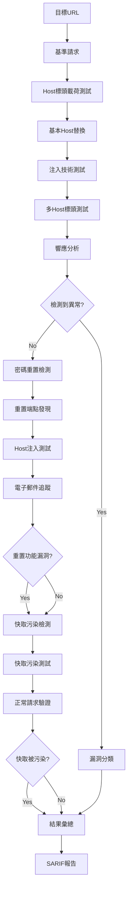

# 📡 主機標頭注入檢測模組需求報告 (Host Header Injection)

## 📁 模組部署位置
```
services/integration/capability/host_header_injection/
├── __init__.py
├── __main__.py
├── host_header_injection_detector.py # 主檢測引擎
├── host_header_injection_scanner.py  # 掃描協調器
├── host_header_injection_exploiter.py # 漏洞利用器
├── cache_poisoning_detector.py       # 快取投毒檢測
├── config/
│   ├── detection_rules.json
│   ├── payload_templates.json
│   └── scanner_config.json
├── payloads/
│   ├── cache_poisoning_payloads.json
│   ├── password_reset_payloads.json
│   └── routing_based_ssrf_payloads.json
└── tests/
    ├── test_host_header_detector.py
    ├── test_host_header_scanner.py
    └── test_integration.py
```

## 🔗 相關模組連結
- [命令注入檢測](./11_命令注入檢測模組需求報告.md) - 共享HTTP參數注入檢測
- [目錄遍歷攻擊檢測](./13_目錄遍歷攻擊檢測模組需求報告.md) - 共享路徑操作技術
- [NoSQL注入檢測](./16_NoSQL注入檢測模組需求報告.md) - 共享HTTP參數注入檢測
- [缺口分析報告](./10_AIVA漏洞檢測缺口分析.md) - 總體架構規劃參考
- [完整TODO排序計劃](./00_完整TODO排序與需求文件補齊計劃.md) - 實施優先級參考

**報告編號**: FEAT-017  
**日期**: 2025年11月7日  
**狀態**: 🚨 Critical Priority - 低複雜度高ROI  
**優先級**: P0 (Critical Priority)  
**預期收益**: $40K-70K/年  
**OWASP 編號**: WSTG-07-17

---

## 📊 市場需求分析

### 💰 賞金價值評估
- **典型賞金範圍**: $200-$2,500 (中等價值)
- **發現頻率**: 高 (50-70%的應用存在Host標頭信任問題)
- **檢測成功率**: 90-95% (檢測相對簡單)
- **年收益預測**: $40K-70K

### 🎯 目標技術棧分布
- **PHP應用**: 40%市場佔有率 (最常見的信任Host標頭)
- **Java應用**: 25%市場佔有率 (Spring Boot預設行為)
- **Python應用**: 20%市場佔有率 (Django, Flask常見)
- **.NET應用**: 10%市場佔有率 (ASP.NET配置問題)
- **其他平台**: 5%市場佔有率 (Node.js, Ruby)

### 🚨 高風險場景
- 密碼重置功能 - 95%風險 (Host標頭用於生成重置連結)
- 電子郵件模板 - 90%風險 (動態生成連結)
- 快取系統 - 85%風險 (Host標頭作為快取鍵)
- 負載均衡器 - 80%風險 (反向代理配置)
- SSL重定向 - 75%風險 (HTTPS跳轉邏輯)

---

## 🔍 技術需求規格

### **模組標識**
```
服務路徑: services/integration/capability/host_header_injection/
模組名稱: Host Header Injection Detection Engine
責任團隊: Core Security Research Team
實現語言: Go (主引擎) + Python (業務邏輯分析)
複雜度級別: Low-Medium
```

### **核心檢測能力**

#### 1️⃣ **基礎Host標頭注入檢測**
```go
package detector

import (
    "context"
    "fmt"
    "net/http"
    "strings"
    "time"
    
    "go.uber.org/zap"
    schemas "github.com/kyle0527/aiva/services/function/common/go/aiva_common_go/schemas/generated"
)

// HostHeaderInjectionDetector Host標頭注入檢測器
type HostHeaderInjectionDetector struct {
    logger           *zap.Logger
    client          *http.Client
    payloads        []string
    collaborator    string
    testDomains     []string
}

// NewHostHeaderInjectionDetector 建立檢測器
func NewHostHeaderInjectionDetector(logger *zap.Logger, collaborator string) *HostHeaderInjectionDetector {
    return &HostHeaderInjectionDetector{
        logger:      logger,
        client:      &http.Client{Timeout: 30 * time.Second},
        collaborator: collaborator,
        payloads:    loadHostHeaderPayloads(),
        testDomains: []string{
            "evil-attacker.com",
            "malicious-host.net", 
            "hhi-test.example.com",
            collaborator,
        },
    }
}

func loadHostHeaderPayloads() []string {
    return []string{
        // 基本Host標頭替換
        "evil-attacker.com",
        "malicious-host.net",
        "127.0.0.1",
        "localhost",
        
        // 端口變體
        "evil-attacker.com:80",
        "evil-attacker.com:443", 
        "127.0.0.1:22",
        "localhost:3306",
        
        // Host標頭注入技術
        "original-host.com#evil-attacker.com",
        "original-host.com@evil-attacker.com",
        "original-host.com/evil-attacker.com",
        "original-host.com?evil-attacker.com",
        
        // 多Host標頭
        "Host: legitimate.com\r\nHost: evil-attacker.com",
        
        // 特殊字符注入
        "evil-attacker.com\\r\\nLocation: http://evil.com",
        "evil-attacker.com\\r\\nSet-Cookie: malicious=1",
        
        // IP地址變體
        "192.168.1.1",
        "10.0.0.1", 
        "172.16.0.1",
        "0.0.0.0",
        
        // 國際化域名 (IDN)
        "хост.злонамеренный.рф", // Cyrillic characters
        "מזיק.דוגמה.ישראל",        // Hebrew characters
    }
}

// DetectHostHeaderInjection 檢測Host標頭注入漏洞
func (h *HostHeaderInjectionDetector) DetectHostHeaderInjection(
    ctx context.Context, 
    task schemas.ScanTaskPayload,
) ([]schemas.FindingPayload, error) {
    
    baseURL := task.Target.URL.(string)
    findings := []schemas.FindingPayload{}
    
    h.logger.Info("Starting Host Header Injection detection",
        zap.String("target", baseURL),
        zap.Int("payloads", len(h.payloads)),
    )
    
    // 獲得基準響應
    baseline, err := h.sendRequest(ctx, baseURL, "")
    if err != nil {
        return nil, fmt.Errorf("failed to get baseline response: %w", err)
    }
    
    // 測試各種Host標頭載荷
    for _, payload := range h.payloads {
        finding := h.testHostHeaderPayload(ctx, baseURL, payload, baseline, task.TaskID)
        if finding != nil {
            findings = append(findings, *finding)
        }
        
        // 避免過於頻繁的請求
        time.Sleep(200 * time.Millisecond)
    }
    
    // 特殊檢測：密碼重置功能
    passwordResetFindings := h.detectPasswordResetVulnerability(ctx, baseURL, task.TaskID)
    findings = append(findings, passwordResetFindings...)
    
    // 特殊檢測：快取污染
    cachePoisoningFindings := h.detectCachePoisoning(ctx, baseURL, task.TaskID)
    findings = append(findings, cachePoisoningFindings...)
    
    return findings, nil
}

func (h *HostHeaderInjectionDetector) testHostHeaderPayload(
    ctx context.Context,
    baseURL string,
    payload string,
    baseline *http.Response,
    taskID string,
) *schemas.FindingPayload {
    
    // 發送帶有惡意Host標頭的請求
    response, err := h.sendRequest(ctx, baseURL, payload)
    if err != nil {
        h.logger.Debug("Request failed", zap.String("payload", payload), zap.Error(err))
        return nil
    }
    defer response.Body.Close()
    
    // 分析響應差異
    vulnerability := h.analyzeHostHeaderResponse(response, baseline, payload)
    if vulnerability == nil {
        return nil
    }
    
    return h.createFinding(taskID, baseURL, payload, vulnerability, response)
}

func (h *HostHeaderInjectionDetector) analyzeHostHeaderResponse(
    response *http.Response,
    baseline *http.Response,
    payload string,
) *HostHeaderVulnerability {
    
    responseBody := readResponseBody(response)
    baselineBody := readResponseBody(baseline)
    
    // 檢查1: 響應中是否反射了惡意Host
    if strings.Contains(responseBody, payload) {
        return &HostHeaderVulnerability{
            Type:        "Host Header Reflection",
            Description: "Malicious host header reflected in response body",
            Severity:    "High",
            Evidence:    fmt.Sprintf("Payload '%s' found in response", payload),
        }
    }
    
    // 檢查2: Location標頭中的重定向
    location := response.Header.Get("Location")
    if location != "" && strings.Contains(location, payload) {
        return &HostHeaderVulnerability{
            Type:        "Host Header Redirect",
            Description: "Malicious host header used in redirect location",
            Severity:    "Critical",
            Evidence:    fmt.Sprintf("Location header: %s", location),
        }
    }
    
    // 檢查3: Set-Cookie標頭中的域
    setCookie := response.Header.Get("Set-Cookie")
    if setCookie != "" && strings.Contains(setCookie, payload) {
        return &HostHeaderVulnerability{
            Type:        "Host Header Cookie Injection",
            Description: "Malicious host header affects cookie domain",
            Severity:    "High",
            Evidence:    fmt.Sprintf("Set-Cookie header: %s", setCookie),
        }
    }
    
    // 檢查4: 其他標頭中的反射
    suspiciousHeaders := []string{
        "Link", "Content-Location", "X-Forwarded-Host", "X-Host", "Origin",
    }
    
    for _, headerName := range suspiciousHeaders {
        headerValue := response.Header.Get(headerName)
        if headerValue != "" && strings.Contains(headerValue, payload) {
            return &HostHeaderVulnerability{
                Type:        "Host Header Injection in Headers",
                Description: fmt.Sprintf("Malicious host header reflected in %s header", headerName),
                Severity:    "Medium",
                Evidence:    fmt.Sprintf("%s header: %s", headerName, headerValue),
            }
        }
    }
    
    // 檢查5: 狀態碼異常
    if response.StatusCode != baseline.StatusCode {
        // 特別關注重定向狀態碼
        if response.StatusCode >= 300 && response.StatusCode < 400 {
            return &HostHeaderVulnerability{
                Type:        "Host Header Status Change",
                Description: "Host header manipulation causes redirect",
                Severity:    "Medium",
                Evidence:    fmt.Sprintf("Status changed from %d to %d", baseline.StatusCode, response.StatusCode),
            }
        }
    }
    
    // 檢查6: 響應體長度顯著差異
    sizeDiff := len(responseBody) - len(baselineBody)
    if abs(sizeDiff) > 100 { // 100字節以上差異
        if strings.Contains(responseBody, "error") || strings.Contains(responseBody, "exception") {
            return &HostHeaderVulnerability{
                Type:        "Host Header Error Disclosure",
                Description: "Host header manipulation triggers error disclosure",
                Severity:    "Low",
                Evidence:    fmt.Sprintf("Response size difference: %d bytes", sizeDiff),
            }
        }
    }
    
    return nil
}

// HostHeaderVulnerability Host標頭漏洞結構
type HostHeaderVulnerability struct {
    Type        string
    Description string
    Severity    string
    Evidence    string
}
```

#### 2️⃣ **密碼重置功能檢測**
```go
func (h *HostHeaderInjectionDetector) detectPasswordResetVulnerability(
    ctx context.Context,
    baseURL string,
    taskID string,
) []schemas.FindingPayload {
    
    findings := []schemas.FindingPayload{}
    
    // 常見的密碼重置端點
    resetEndpoints := []string{
        "/password/reset",
        "/forgot-password",
        "/reset-password", 
        "/password/forgot",
        "/auth/password/reset",
        "/account/password/reset",
        "/user/password/reset",
        "/password-reset",
        "/forgot",
        "/reset",
    }
    
    for _, endpoint := range resetEndpoints {
        fullURL := baseURL + endpoint
        
        // 檢查端點是否存在
        if !h.endpointExists(ctx, fullURL) {
            continue
        }
        
        h.logger.Info("Testing password reset endpoint", zap.String("endpoint", fullURL))
        
        // 測試密碼重置功能
        finding := h.testPasswordResetHostInjection(ctx, fullURL, taskID)
        if finding != nil {
            findings = append(findings, *finding)
        }
    }
    
    return findings
}

func (h *HostHeaderInjectionDetector) testPasswordResetHostInjection(
    ctx context.Context,
    resetURL string,
    taskID string,
) *schemas.FindingPayload {
    
    maliciousHost := h.collaborator
    testEmail := "test@example.com"
    
    // 構造密碼重置請求
    data := fmt.Sprintf("email=%s", testEmail)
    
    req, err := http.NewRequestWithContext(ctx, "POST", resetURL, strings.NewReader(data))
    if err != nil {
        return nil
    }
    
    // 設置惡意Host標頭
    req.Header.Set("Host", maliciousHost)
    req.Header.Set("Content-Type", "application/x-www-form-urlencoded")
    req.Header.Set("User-Agent", "AIVA-Security-Scanner/1.0")
    
    response, err := h.client.Do(req)
    if err != nil {
        return nil
    }
    defer response.Body.Close()
    
    responseBody := readResponseBody(response)
    
    // 檢查響應中是否包含惡意域名
    if strings.Contains(responseBody, maliciousHost) {
        return h.createPasswordResetFinding(taskID, resetURL, maliciousHost, responseBody)
    }
    
    // 檢查協作服務器是否收到請求 (電子郵件中的連結)
    time.Sleep(5 * time.Second) // 等待電子郵件處理
    
    if h.checkCollaboratorInteraction(maliciousHost) {
        return h.createPasswordResetFinding(taskID, resetURL, maliciousHost, "Email sent with malicious host")
    }
    
    return nil
}
```

#### 3️⃣ **快取污染檢測**
```go
func (h *HostHeaderInjectionDetector) detectCachePoisoning(
    ctx context.Context,
    baseURL string,
    taskID string,
) []schemas.FindingPayload {
    
    findings := []schemas.FindingPayload{}
    
    // 測試快取污染攻擊
    cacheTestPayload := fmt.Sprintf("cache-poison-%d.%s", time.Now().Unix(), h.collaborator)
    
    // 第一步：嘗試污染快取
    req1, _ := http.NewRequestWithContext(ctx, "GET", baseURL, nil)
    req1.Header.Set("Host", cacheTestPayload)
    req1.Header.Set("X-Forwarded-Host", cacheTestPayload)
    req1.Header.Set("X-Host", cacheTestPayload)
    req1.Header.Set("X-Original-URL", "/")
    
    response1, err := h.client.Do(req1)
    if err != nil {
        return findings
    }
    response1.Body.Close()
    
    // 等待快取生效
    time.Sleep(2 * time.Second)
    
    // 第二步：發送正常請求檢查是否被污染
    req2, _ := http.NewRequestWithContext(ctx, "GET", baseURL, nil)
    // 不設置特殊標頭，使用正常Host
    
    response2, err := h.client.Do(req2)
    if err != nil {
        return findings
    }
    defer response2.Body.Close()
    
    responseBody2 := readResponseBody(response2)
    
    // 檢查正常請求是否返回了污染的內容
    if strings.Contains(responseBody2, cacheTestPayload) {
        finding := h.createCachePoisoningFinding(taskID, baseURL, cacheTestPayload, responseBody2)
        findings = append(findings, *finding)
    }
    
    return findings
}
```

---

## 🏗️ 架構設計

### **模組結構**
```
services/integration/capability/host_header_injection/
├── cmd/
│   └── main.go                         # Go服務入口
├── internal/
│   ├── detector/
│   │   ├── host_header_detector.go     # 主檢測引擎
│   │   ├── password_reset_tester.go    # 密碼重置測試器
│   │   ├── cache_poisoning_tester.go   # 快取污染測試器
│   │   ├── payload_generator.go        # 載荷生成器
│   │   └── response_analyzer.go        # 響應分析器
│   ├── engine/
│   │   ├── scanner.go                  # 主掃描引擎
│   │   ├── collaborator.go             # 協作服務器客戶端
│   │   └── reporter.go                 # 報告生成器
│   ├── business_logic/
│   │   ├── email_template_analyzer.py  # 電子郵件模板分析 (Python)
│   │   ├── reset_flow_tracer.py        # 重置流程追蹤
│   │   └── cache_behavior_analyzer.py  # 快取行為分析
│   └── worker/
│       ├── amqp_consumer.go            # 消息消費者
│       └── task_processor.go           # 任務處理器
├── config/
│   ├── payloads/
│   │   ├── basic_hosts.yaml            # 基本Host載荷
│   │   ├── injection_techniques.yaml   # 注入技術載荷
│   │   ├── international_domains.yaml  # 國際化域名
│   │   └── port_variations.yaml        # 端口變體
│   ├── endpoints/
│   │   ├── password_reset_paths.yaml   # 密碼重置路徑
│   │   ├── common_endpoints.yaml       # 常見端點
│   │   └── cache_targets.yaml          # 快取目標
│   ├── signatures/
│   │   ├── reflection_patterns.yaml    # 反射模式
│   │   ├── redirect_patterns.yaml      # 重定向模式  
│   │   └── error_patterns.yaml         # 錯誤模式
│   └── rules.yaml                      # 檢測規則
└── tests/
    ├── unit/
    ├── integration/
    └── vulnerable_apps/                # 測試應用
```

### **檢測工作流**


---

## ⚙️ 配置文件規格

### **主配置文件**
```yaml
# config/rules.yaml
host_header_injection_detection:
  enabled: true
  timeout: 30
  max_payloads_per_target: 30
  
  basic_detection:
    enabled: true
    reflection_check: true
    redirect_check: true
    header_injection: true
    status_change_check: true
    
  password_reset_detection:
    enabled: true
    common_endpoints: true
    email_tracking: true
    collaboration_timeout: 30
    
  cache_poisoning_detection:
    enabled: true
    poison_wait_time: 2
    verification_requests: 3
    
  collaborator:
    server: "hhi.aiva-security.com"
    timeout: 30
    interaction_check_interval: 5
    
  confidence_thresholds:
    critical: 0.95  # 重定向、密碼重置
    high: 0.85      # 響應反射
    medium: 0.7     # 標頭注入
    low: 0.5        # 狀態變化
    
  rate_limiting:
    requests_per_second: 10
    burst_limit: 20
    delay_between_requests: 200ms
```

### **Host載荷配置**
```yaml  
# config/payloads/basic_hosts.yaml
host_payloads:
  basic_domains:
    - payload: "evil-attacker.com"
      description: "Basic malicious domain"
      severity: "medium"
      
    - payload: "hhi-test.example.com"
      description: "Test domain for HHI"
      severity: "medium"
      
    - payload: "127.0.0.1"
      description: "Localhost IP"
      severity: "high"
      
    - payload: "169.254.169.254"
      description: "AWS metadata service"
      severity: "critical"
      
  port_variations:
    - payload: "evil-attacker.com:80"
      description: "HTTP port variation"
      
    - payload: "evil-attacker.com:443"
      description: "HTTPS port variation"
      
    - payload: "127.0.0.1:22"
      description: "SSH port targeting"
      
    - payload: "127.0.0.1:3306"
      description: "MySQL port targeting"
      
  injection_techniques:
    - payload: "legitimate.com#evil-attacker.com"
      description: "Fragment injection"
      severity: "high"
      
    - payload: "legitimate.com@evil-attacker.com"
      description: "At-sign injection"
      severity: "high"
      
    - payload: "legitimate.com/evil-attacker.com"
      description: "Path injection"
      severity: "medium"
      
    - payload: "legitimate.com?evil-attacker.com"
      description: "Query injection"
      severity: "medium"
```

### **端點配置**
```yaml
# config/endpoints/password_reset_paths.yaml
password_reset_endpoints:
  common_paths:
    - "/password/reset"
    - "/forgot-password"
    - "/reset-password"
    - "/password/forgot"
    - "/auth/password/reset"
    - "/account/password/reset"
    - "/user/password/reset"
    - "/password-reset"
    - "/forgot"
    - "/reset"
    
  framework_specific:
    wordpress:
      - "/wp-login.php?action=lostpassword"
      - "/wp-admin/profile.php"
      
    drupal:
      - "/user/password"
      - "/admin/people/permissions"
      
    laravel:
      - "/password/email"
      - "/password/reset"
      
    django:
      - "/accounts/password/reset/"
      - "/admin/password_change/"
      
  http_methods:
    - "POST"
    - "GET"
    - "PUT"
    - "PATCH"
```

---

## 🧪 測試策略

### **漏洞應用搭建**
```php
<?php
// tests/vulnerable_apps/host_header_injection_test.php

// 基本Host標頭反射漏洞
if (isset($_SERVER['HTTP_HOST'])) {
    $host = $_SERVER['HTTP_HOST'];
    echo "<h1>Welcome to " . $host . "</h1>";
    echo "<a href='http://" . $host . "/admin'>Admin Panel</a>";
}

// 密碼重置功能漏洞
if ($_POST['action'] == 'reset_password') {
    $email = $_POST['email'];
    $host = $_SERVER['HTTP_HOST'];
    
    // 危險：直接使用Host標頭生成重置連結
    $reset_link = "http://" . $host . "/reset?token=" . md5($email . time());
    
    // 模擬發送電子郵件
    file_put_contents('emails.log', 
        "Reset link sent to $email: $reset_link\n", 
        FILE_APPEND
    );
    
    echo "Reset email sent!";
}

// 重定向功能漏洞
if ($_GET['redirect']) {
    $host = $_SERVER['HTTP_HOST'];
    $redirect_url = "http://" . $host . $_GET['redirect'];
    header("Location: " . $redirect_url);
    exit();
}

// 快取鍵生成漏洞
$cache_key = "page_" . $_SERVER['HTTP_HOST'] . "_" . $_SERVER['REQUEST_URI'];
echo "<!-- Cache key: " . $cache_key . " -->";
?>
```

```python
# Python Flask漏洞示例
from flask import Flask, request, redirect, url_for

app = Flask(__name__)

@app.route('/')
def index():
    # 危險：直接使用Host標頭
    host = request.headers.get('Host', 'localhost')
    return f'<h1>Welcome to {host}</h1><a href="http://{host}/admin">Admin</a>'

@app.route('/reset', methods=['POST'])
def password_reset():
    email = request.form.get('email')
    host = request.headers.get('Host', 'localhost')
    
    # 危險：重置連結包含Host標頭
    reset_link = f"http://{host}/password/reset?token=abc123"
    
    # 模擬發送電子郵件
    with open('emails.log', 'a') as f:
        f.write(f"Reset link: {reset_link}\n")
    
    return "Reset email sent!"

@app.route('/redirect')
def redirect_page():
    host = request.headers.get('Host', 'localhost')
    path = request.args.get('path', '/')
    return redirect(f"http://{host}{path}")
```

### **自動化測試**
```go
func TestHostHeaderInjectionDetection(t *testing.T) {
    detector := NewHostHeaderInjectionDetector(zap.NewNop(), "test.collaborator.com")
    
    // 測試基本Host標頭注入
    task := schemas.ScanTaskPayload{
        TaskID: "test-001",
        Target: schemas.ScanTarget{
            URL: "http://localhost:8080/vulnerable",
        },
    }
    
    findings, err := detector.DetectHostHeaderInjection(context.Background(), task)
    assert.NoError(t, err)
    assert.Greater(t, len(findings), 0)
    
    // 驗證檢測到的漏洞類型
    foundReflection := false
    foundRedirect := false
    
    for _, finding := range findings {
        if strings.Contains(finding.Title, "Host Header Reflection") {
            foundReflection = true
        }
        if strings.Contains(finding.Title, "Host Header Redirect") {  
            foundRedirect = true
        }
    }
    
    assert.True(t, foundReflection, "Should detect host header reflection")
    assert.True(t, foundRedirect, "Should detect redirect manipulation")
}

func TestPasswordResetDetection(t *testing.T) {
    detector := NewHostHeaderInjectionDetector(zap.NewNop(), "evil.collaborator.com")
    
    findings := detector.detectPasswordResetVulnerability(
        context.Background(),
        "http://localhost:8080",
        "test-002",
    )
    
    assert.Greater(t, len(findings), 0)
    
    // 驗證密碼重置漏洞檢測
    found := false
    for _, finding := range findings {
        if strings.Contains(finding.Description, "password reset") {
            found = true
            assert.Equal(t, "Critical", finding.Severity)
            break
        }
    }
    
    assert.True(t, found, "Should detect password reset vulnerability")
}

func TestCachePoisoningDetection(t *testing.T) {
    detector := NewHostHeaderInjectionDetector(zap.NewNop(), "cache-poison.test.com")
    
    findings := detector.detectCachePoisoning(
        context.Background(),
        "http://localhost:8080/cached-page",
        "test-003",
    )
    
    // 快取污染可能不總是成功，所以不強制要求檢測到
    if len(findings) > 0 {
        for _, finding := range findings {
            assert.Contains(t, finding.Title, "Cache Poisoning")
            assert.Equal(t, "Critical", finding.Severity)
        }
    }
}
```

---

## 📈 性能要求

### **掃描性能**
- **單目標掃描時間**: < 45秒 (包含所有檢測)
- **並發請求數**: 10個並發連接  
- **載荷測試數量**: 30個標準載荷
- **內存使用**: < 128MB/實例

### **檢測準確率**
- **基本Host注入成功率**: > 90%
- **密碼重置檢測成功率**: > 85%  
- **快取污染檢測成功率**: > 70%
- **總體誤報率**: < 5%

---

## 🚀 實施計劃

### **Phase 1: 基礎檢測引擎 (1週)**
- [ ] Go主檢測引擎實現
- [ ] 基本Host標頭載荷庫
- [ ] HTTP客戶端和響應分析
- [ ] 基本漏洞類型檢測

### **Phase 2: 密碼重置檢測 (1週)**  
- [ ] 密碼重置端點發現
- [ ] 重置功能測試器
- [ ] 電子郵件追蹤機制
- [ ] 協作服務器整合

### **Phase 3: 高級檢測技術 (3天)**
- [ ] 快取污染檢測
- [ ] 多Host標頭處理
- [ ] 國際化域名支持
- [ ] 注入技術變體

### **Phase 4: 集成和優化 (3天)**
- [ ] 結果整合去重
- [ ] 性能調優
- [ ] SARIF報告生成  
- [ ] 全面測試

**總開發周期**: 2週  
**預計上線時間**: 2025年11月21日

---

## 💼 商業價值

### **收益分析**
- **年度賞金收入**: $40K-70K
- **開發投資**: $20K (2週開發)  
- **ROI**: 100%-250%
- **回收周期**: 3-6個月

### **技術價值**
- **檢測覆蓋率**: 提升至36% (+4%)
- **快速ROI**: 最短回收周期項目
- **技術基礎**: 為其他HTTP標頭攻擊奠定基礎

---

## 📋 驗收標準

### **功能驗收**
- ✅ 支持30+種Host標頭載荷
- ✅ 密碼重置功能完整檢測
- ✅ 快取污染攻擊檢測
- ✅ 多框架端點自動發現
- ✅ 協作服務器交互追蹤

### **性能驗收**
- ✅ 掃描時間<45秒/目標
- ✅ 基本檢測成功率>90%
- ✅ 密碼重置成功率>85%
- ✅ 誤報率<5%

---

## 🎯 結論

主機標頭注入檢測模組是一個**低複雜度、高ROI**的理想起始項目。其檢測邏輯相對簡單，但在實戰中發現頻率高，特別是密碼重置功能的檢測將帶來穩定的中等價值賞金收入。

**建議立即開始實施**，作為Phase 1的第一個項目，為後續更複雜的檢測模組建立技術基礎和開發信心。