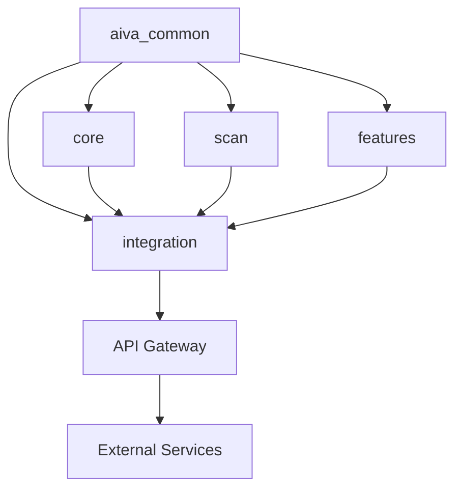

# AIVA 專案結構說明文件

> **AIVA** - AI-Driven Vulnerability Assessment Platform  
> **更新時間**: 2025年10月26日  
> **版本**: v2.1 - Schema 標準化完成版  

---

## 📋 目錄

- [📋 概覽](#-概覽)
- [🏗️ 五大核心模組架構](#️-五大核心模組架構)
- [📁 目錄結構詳解](#-目錄結構詳解)
- [🔧 配置文件說明](#-配置文件說明)
- [📊 統計資訊](#-統計資訊)
- [🚀 快速導航](#-快速導航)

---

## 📋 概覽

AIVA 是一個基於人工智能的漏洞評估平台，採用模組化五大架構設計，提供智能化的安全測試和持續學習能力。

## 🏗️ 五大核心模組架構

### 1. 🧩 aiva_common - 通用基礎模組
```
services/aiva_common/
├── 共享資料結構
├── 枚舉定義
├── 工具函數
└── 基礎類別
```

### 2. 🧠 core - 核心業務模組
```
services/core/aiva_core/
├── ai_engine/              # AI 引擎系統
│   ├── bio_neuron_core.py   # BioNeuron 核心
│   ├── anti_hallucination_module.py # 抗幻覺模組
│   ├── learning_engine.py   # 學習引擎
│   └── neural_network.py    # 神經網路
├── decision/                # 決策系統
│   └── enhanced_decision_agent.py
├── ai_commander.py          # AI 指揮官
├── bio_neuron_master.py     # BioNeuron 主控
└── multilang_coordinator.py # 多語言協調器
```

### 3. 🔍 scan - 掃描發現模組
```
services/scan/aiva_scan/
├── target_environment_detector.py  # 靶場環境檢測
├── vulnerability_scanner.py        # 漏洞掃描引擎
├── network_scanner.py             # 網路掃描器
├── service_detector.py            # 服務檢測器
├── fingerprint_manager.py         # 指紋識別管理
└── core_crawling_engine/          # 爬蟲引擎
```

### 4. 🔗 integration - 整合服務模組
```
services/integration/aiva_integration/
├── trigger_ai_continuous_learning.py # AI 持續學習觸發器
├── integrated_ai_trainer.py          # 整合式 AI 訓練器
├── ai_operation_recorder.py          # AI 操作記錄器
├── system_performance_monitor.py     # 系統效能監控
├── api_gateway/                      # API 閘道
├── reporting/                        # 報告系統
└── observability/                    # 可觀察性
```

### 5. 🎯 features - 功能檢測模組
```
services/features/
├── smart_detection_manager.py    # 智能檢測管理器
├── high_value_manager.py         # 高價值漏洞管理
├── function_xss/                 # XSS 檢測功能
├── function_sqli/                # SQL 注入檢測
├── function_idor/                # IDOR 檢測
├── jwt_confusion/                # JWT 混淆攻擊
├── oauth_confusion/              # OAuth 混淆攻擊
└── payment_logic_bypass/         # 支付邏輯繞過
```

## 📁 專案目錄結構

### 根目錄檔案
```
AIVA-git/
├── README.md                    # 專案說明文件
├── pyproject.toml              # Python 專案配置
├── requirements.txt            # 依賴套件清單
├── aiva_launcher.py            # 主啟動器（重定向）
├── aiva_package_validator.py   # 套件驗證器
└── AIVA.code-workspace         # VS Code 工作區配置
```

### 配置目錄
```
config/
├── api_keys.py                 # API 金鑰配置
└── settings.py                 # 系統設定
```

### API 服務
```
api/
├── main.py                     # FastAPI 主程式
├── start_api.py               # API 啟動器
├── test_api.py                # API 測試
├── routers/                   # API 路由模組
└── requirements.txt           # API 依賴套件
```

### 啟動腳本
```
scripts/
└── launcher/
    ├── aiva_launcher.py              # 統一啟動介面
    └── smart_communication_selector.py # 智能通訊選擇器
```

### 資料目錄
```
data/
├── ai_commander/              # AI 指揮官資料
└── database/                  # 資料庫檔案
```

### 測試目錄
```
tests/                         # 單元測試
test_data/                     # 測試資料
```

### 文件與範例
```
docs/                          # 文件目錄
examples/                      # 範例程式碼
schemas/                       # 資料綱要定義
```

### 工具與部署
```
tools/                         # 開發工具
docker/                        # Docker 容器配置
├── docker-compose.yml         # 開發環境
└── docker-compose.production.yml # 生產環境
```

### 前端介面（保留但暫不開發）
```
web/
├── index.html                 # 主頁面
├── js/                        # JavaScript 檔案
└── README.md                  # 前端說明
```

### 輸出與報告
```
logs/                          # 系統日誌
reports/                       # 生成報告
_out/                          # 輸出檔案
```

## 🚀 啟動方式

### 主要啟動器
```bash
# 使用統一啟動介面
python scripts/launcher/aiva_launcher.py

# 或使用根目錄重定向器（兼容性）
python aiva_launcher.py
```

### 直接啟動服務
```bash
# 啟動 API 服務
python api/start_api.py

# 啟動 AI 持續學習
python services/integration/aiva_integration/trigger_ai_continuous_learning.py
```

## 🔧 開發工具配置

### Python 環境
- **Python**: 3.8+
- **虛擬環境**: `.venv/`
- **依賴管理**: `requirements.txt`, `pyproject.toml`

### 程式碼品質
- **格式化**: `ruff` (配置: `ruff.toml`)
- **型別檢查**: `mypy` (配置: `mypy.ini`)
- **Python 分析**: `pyrightconfig.json`

### 版本控制
- **Git**: `.gitignore` 配置完整
- **預提交鉤子**: `.pre-commit-config.yaml`

## 📊 模組間通訊



## 🎯 核心特性

### 人工智能引擎
- **BioNeuron**: 生物神經元啟發的 AI 架構
- **抗幻覺**: 防止 AI 生成不合理步驟
- **持續學習**: 自動優化攻擊策略

### 智能檢測
- **多語言支援**: 支援多種程式語言檢測
- **高價值引導**: 優先檢測高價值漏洞
- **動態適應**: 根據環境調整檢測策略

### 整合能力
- **API 閘道**: 統一對外介面
- **監控系統**: 即時效能與狀態監控
- **報告生成**: 自動化報告產生

## 📝 使用注意事項

1. **環境要求**: 確保 Python 3.8+ 和所需依賴已安裝
2. **配置檔案**: 複製 `.env.example` 為 `.env` 並配置必要參數
3. **資料庫**: 確保 `aiva_experience.db` 可正常存取
4. **權限**: 部分功能需要管理員權限執行

## 🔄 更新歷程

- **v2.0** (2025-10-24): 完成五大模組架構重組
- **v1.x**: 初版功能開發

## 📞 聯絡資訊

- **專案**: AIVA - AI-Driven Vulnerability Assessment
- **維護者**: AIVA 開發團隊
- **更新**: 持續更新中

---

*本文件會隨著專案發展持續更新*